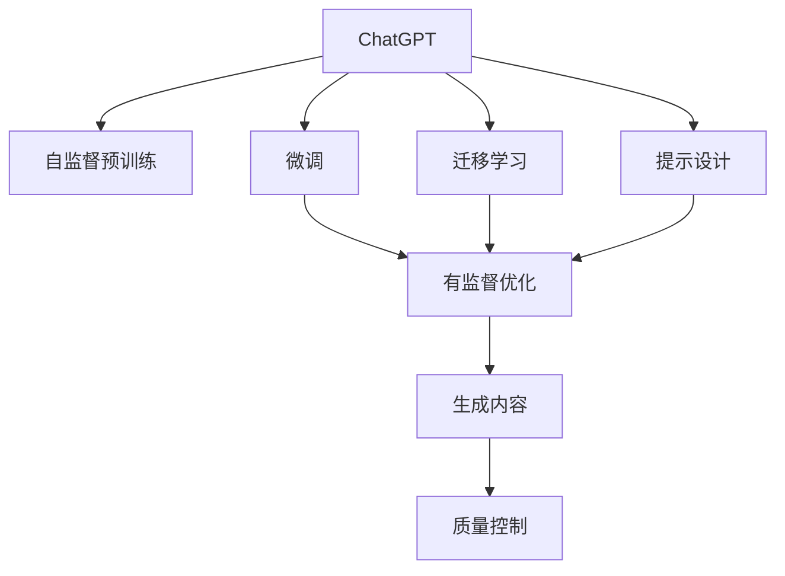
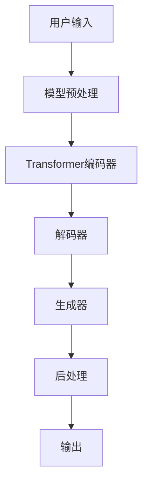
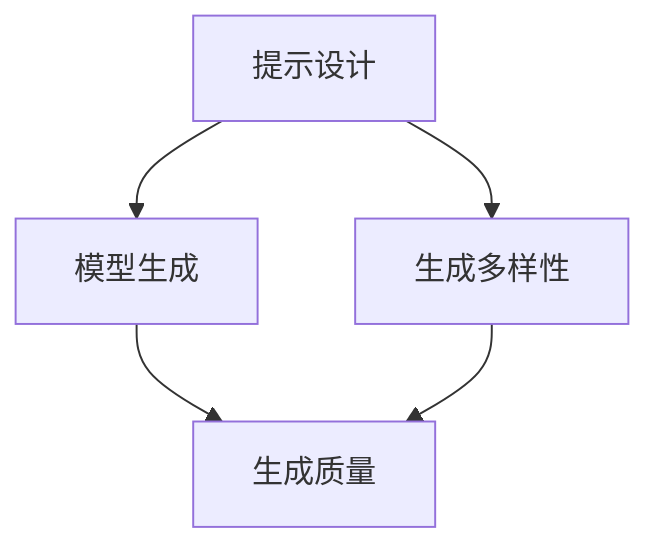
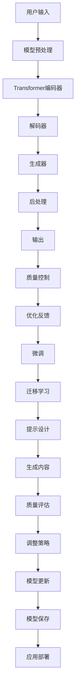

                 

# AIGC从入门到实战：ChatGPT 提问表单

> 关键词：
- ChatGPT
- AIGC (AI Generated Content)
- 提问表单
- OpenAI
- 自然语言处理 (NLP)
- 深度学习
- 优化技术

## 1. 背景介绍

### 1.1 问题由来

随着人工智能技术的发展，生成式人工智能 (AI Generated Content, AIGC) 技术逐渐成为业界和学术界关注的热点。其中，ChatGPT作为一款由OpenAI开发的大型语言模型，因其在自然语言处理 (Natural Language Processing, NLP) 领域的卓越表现，受到了广泛关注。

ChatGPT基于Transformer模型和深度学习技术，通过在大规模文本数据上进行自监督预训练，学习到丰富的语言表示。用户可以通过简单的文本输入，获得其生成的文本响应。这种高效、灵活的自然语言生成能力，使其在对话系统、内容创作、智能客服等领域有着广泛的应用前景。

然而，尽管ChatGPT在生成文本质量上取得了显著进步，但在实际应用中，仍然存在一些不足和挑战，如生成内容的不一致性、生成文本的准确性等问题。因此，如何优化和改进ChatGPT的生成性能，使其能够更好地服务于实际应用场景，成为了当前研究的重点之一。

### 1.2 问题核心关键点

ChatGPT的优化和改进主要涉及以下几个核心关键点：

- **模型参数调整**：通过微调或迁移学习，调整模型的参数以适应特定任务。
- **输入文本质量**：优化用户输入文本的格式，提高模型的理解能力和生成质量。
- **生成策略设计**：通过设计不同的生成策略，如模型融合、提示设计等，提升生成内容的准确性和多样性。
- **生成内容优化**：通过后处理技术，如纠偏、过滤等，提升生成内容的可靠性。
- **模型性能监控**：实时监测模型的生成性能，及时调整参数和策略。

这些关键点构成了ChatGPT优化和改进的核心框架，使得模型能够更好地服务于实际应用需求。

### 1.3 问题研究意义

研究ChatGPT的优化和改进方法，对于提升其生成性能，拓展其应用范围，加速AI技术在各行各业的应用，具有重要意义：

1. **降低应用开发成本**：通过优化和改进，可以显著减少从头开发所需的成本和时间投入。
2. **提升模型效果**：优化后的模型生成内容更具一致性、准确性和相关性，提升用户体验。
3. **加速开发进度**：标准化模型优化流程，加快应用适配和落地。
4. **技术创新**：优化过程中涌现的新技术和新方法，推动AI技术的前沿发展。
5. **赋能产业升级**：提升AI技术的应用价值，促进各行各业的数字化转型升级。

## 2. 核心概念与联系

### 2.1 核心概念概述

为了更好地理解ChatGPT的优化和改进方法，本节将介绍几个密切相关的核心概念：

- **ChatGPT**：基于Transformer架构的大型语言模型，用于生成自然语言文本。
- **自监督预训练**：使用大规模无标签文本数据，通过自监督任务进行模型预训练。
- **微调(Fine-Tuning)**：在预训练模型的基础上，使用下游任务的少量标注数据，进行有监督的微调优化。
- **迁移学习(Transfer Learning)**：将一个领域学习到的知识，迁移到另一个不同但相关的领域。
- **提示设计(Prompt Design)**：通过精心设计输入文本的格式，引导模型按期望方式生成文本。
- **优化技术(Optimization Techniques)**：如梯度下降、正则化等，用于提升模型生成性能。
- **生成内容的质量控制**：通过后处理技术，提升生成内容的准确性和可靠性。

这些核心概念之间的逻辑关系可以通过以下Mermaid流程图来展示：



这个流程图展示了ChatGPT的优化和改进过程：首先通过自监督预训练获得基础的生成能力，然后通过微调或迁移学习适应特定任务，并使用提示设计提升生成质量。最终生成的内容经过质量控制，成为可靠的输出。

### 2.2 概念间的关系

这些核心概念之间存在着紧密的联系，形成了ChatGPT优化的完整生态系统。下面我们通过几个Mermaid流程图来展示这些概念之间的关系。

#### 2.2.1 ChatGPT的生成过程



这个流程图展示了ChatGPT生成文本的基本流程：用户输入通过模型预处理，进入编码器进行编码，再由解码器生成文本，并通过生成器生成最终的文本响应。后处理技术进一步提升文本的质量。

#### 2.2.2 微调和迁移学习的结合


这个流程图展示了微调和迁移学习在ChatGPT优化中的结合：通过微调将ChatGPT适配下游任务，再通过迁移学习提升模型的泛化能力。

#### 2.2.3 提示设计的优化策略



这个流程图展示了提示设计对ChatGPT生成的影响：通过优化提示设计，提升模型的生成多样性和质量。

### 2.3 核心概念的整体架构

最后，我们用一个综合的流程图来展示这些核心概念在ChatGPT优化中的整体架构：



这个综合流程图展示了ChatGPT优化的整个流程：从用户输入到模型生成，再到优化反馈和模型更新，最终部署到实际应用场景。

## 3. 核心算法原理 & 具体操作步骤

### 3.1 算法原理概述

ChatGPT的优化和改进方法主要基于自监督预训练和有监督微调的技术。其核心思想是：通过预训练获得基础的生成能力，再通过微调适配特定任务，提升生成文本的质量和一致性。

具体来说，ChatGPT的优化过程可以概括为以下几个步骤：

1. **预训练**：在大规模无标签文本数据上，通过自监督任务进行模型预训练，学习丰富的语言表示。
2. **微调**：在特定任务的数据集上进行有监督的微调，通过调整模型参数以适应任务的生成需求。
3. **提示设计**：通过优化提示设计，引导模型生成符合期望格式的文本。
4. **后处理**：对生成的文本进行纠偏、过滤等处理，提升文本的质量和可靠性。

### 3.2 算法步骤详解

以下我们将详细介绍ChatGPT优化和改进的具体步骤：

**Step 1: 准备预训练模型和数据集**

- 选择合适的预训练语言模型，如GPT-4、GPT-3等。
- 准备下游任务的标注数据集，划分训练集、验证集和测试集。
- 进行数据预处理，包括清洗、分词、编码等操作。

**Step 2: 设计优化目标**

- 定义优化目标函数，如交叉熵损失、BLEU分数等。
- 设置优化器，如AdamW、SGD等，并设置学习率、批大小、迭代轮数等。
- 设置正则化技术，如L2正则、Dropout等。

**Step 3: 添加任务适配层**

- 根据任务类型，在预训练模型顶层设计合适的输出层和损失函数。
- 对于分类任务，通常添加分类器；对于生成任务，添加解码器。
- 确定模型输入和输出的维度，如token ids、logits等。

**Step 4: 执行微调**

- 将训练集数据分批次输入模型，前向传播计算损失函数。
- 反向传播计算参数梯度，根据设定的优化算法和学习率更新模型参数。
- 周期性在验证集上评估模型性能，根据性能指标决定是否触发Early Stopping。
- 重复上述步骤直到满足预设的迭代轮数或Early Stopping条件。

**Step 5: 生成内容优化**

- 对生成的文本进行质量评估，如BLEU、ROUGE等。
- 进行文本纠偏、过滤等后处理操作，提升文本的质量和可靠性。
- 设计多种提示模板，选择最优的生成策略。

**Step 6: 保存和部署模型**

- 将优化后的模型保存，以便后续使用。
- 部署到实际应用场景，进行实时生成和响应。

### 3.3 算法优缺点

ChatGPT的优化和改进方法具有以下优点：

- **简单高效**：通过微调和提示设计，可以显著提升模型生成性能，无需从头训练。
- **通用适用**：适用于各种NLP任务，如对话、问答、摘要等，通过设计不同提示模板即可。
- **可解释性强**：模型参数较少，优化过程透明，易于理解和调试。

同时，该方法也存在一些局限性：

- **依赖标注数据**：微调效果很大程度上取决于标注数据的质量和数量，获取高质量标注数据的成本较高。
- **泛化能力有限**：当目标任务与预训练数据的分布差异较大时，微调的性能提升有限。
- **负面效果传递**：预训练模型的固有偏见、有害信息等，可能通过微调传递到下游任务，造成负面影响。
- **可解释性不足**：生成的文本缺乏明确的逻辑和证据支持，难以解释其生成过程。

尽管存在这些局限性，但就目前而言，基于微调的优化方法是ChatGPT生成性能提升的重要手段。未来相关研究将重点在于如何进一步降低微调对标注数据的依赖，提高模型的泛化能力和可解释性。

### 3.4 算法应用领域

ChatGPT的优化和改进方法在NLP领域已经得到了广泛的应用，覆盖了几乎所有常见任务，例如：

- **对话系统**：通过微调和提示设计，构建智能对话机器人，实现多轮对话。
- **问答系统**：对用户的问题进行理解，生成精准的回答。
- **摘要生成**：将长篇文档压缩成简短摘要。
- **文本生成**：创作小说、诗歌、新闻报道等文本内容。
- **代码生成**：生成符合规范的代码，辅助软件开发。
- **翻译系统**：将一种语言翻译成另一种语言。
- **情感分析**：分析文本的情感倾向，如正面、负面或中性。

除了上述这些经典任务外，ChatGPT的优化方法还被创新性地应用到更多场景中，如推荐系统、智能搜索、情感识别等，为NLP技术带来了全新的突破。随着预训练模型和优化方法的不断进步，相信ChatGPT将在更广阔的应用领域大放异彩。

## 4. 数学模型和公式 & 详细讲解

### 4.1 数学模型构建

以下我们将使用数学语言对ChatGPT的优化过程进行更加严格的刻画。

记预训练语言模型为 $M_{\theta}$，其中 $\theta$ 为预训练得到的模型参数。假设微调任务的训练集为 $D=\{(x_i,y_i)\}_{i=1}^N, x_i \in \mathcal{X}, y_i \in \mathcal{Y}$。

定义模型 $M_{\theta}$ 在输入 $x$ 上的生成概率为 $p(y|x)$，则生成目标函数可以定义为：

$$
\mathcal{L}(\theta) = -\frac{1}{N}\sum_{i=1}^N \log p(y_i|x_i)
$$

其中 $\log$ 表示对数函数，$p(y_i|x_i)$ 表示模型在输入 $x_i$ 下的生成概率。

优化目标是最小化生成目标函数，即找到最优参数：

$$
\theta^* = \mathop{\arg\min}_{\theta} \mathcal{L}(\theta)
$$

在实践中，我们通常使用基于梯度的优化算法（如AdamW、SGD等）来近似求解上述最优化问题。设 $\eta$ 为学习率，$\lambda$ 为正则化系数，则参数的更新公式为：

$$
\theta \leftarrow \theta - \eta \nabla_{\theta}\mathcal{L}(\theta) - \eta\lambda\theta
$$

其中 $\nabla_{\theta}\mathcal{L}(\theta)$ 为生成目标函数对参数 $\theta$ 的梯度，可通过反向传播算法高效计算。

### 4.2 公式推导过程

以下我们将推导生成目标函数的梯度计算公式。

假设模型 $M_{\theta}$ 在输入 $x$ 上的生成概率为 $p(y|x)$，则生成目标函数 $\mathcal{L}(\theta)$ 可以表示为：

$$
\mathcal{L}(\theta) = -\frac{1}{N}\sum_{i=1}^N \log p(y_i|x_i)
$$

根据链式法则，生成目标函数对参数 $\theta$ 的梯度可以表示为：

$$
\frac{\partial \mathcal{L}(\theta)}{\partial \theta} = -\frac{1}{N}\sum_{i=1}^N \frac{\partial}{\partial \theta} \log p(y_i|x_i) = -\frac{1}{N}\sum_{i=1}^N \nabla_{\theta} \log p(y_i|x_i)
$$

其中 $\nabla_{\theta} \log p(y_i|x_i)$ 表示在输入 $x_i$ 下生成 $y_i$ 的对数概率梯度。

对于基于Transformer的生成模型，$\nabla_{\theta} \log p(y_i|x_i)$ 可以通过自动微分技术计算，得到具体的数值。

### 4.3 案例分析与讲解

假设我们有一个文本生成任务，生成一篇关于AI技术的文章。模型的输入为“AI技术的发展现状和未来趋势”，生成目标为“AI技术在医疗、金融、教育等领域的应用”。

我们可以将输入文本进行编码，得到模型的输入特征。然后，将输出文本的每一个token id作为标签，并计算模型在每个token上的生成概率。最后，使用BLEU等指标评估生成文本的质量。

## 5. 项目实践：代码实例和详细解释说明

### 5.1 开发环境搭建

在进行ChatGPT优化实践前，我们需要准备好开发环境。以下是使用Python进行PyTorch开发的环境配置流程：

1. 安装Anaconda：从官网下载并安装Anaconda，用于创建独立的Python环境。

2. 创建并激活虚拟环境：
```bash
conda create -n pytorch-env python=3.8 
conda activate pytorch-env
```

3. 安装PyTorch：根据CUDA版本，从官网获取对应的安装命令。例如：
```bash
conda install pytorch torchvision torchaudio cudatoolkit=11.1 -c pytorch -c conda-forge
```

4. 安装Transformers库：
```bash
pip install transformers
```

5. 安装各类工具包：
```bash
pip install numpy pandas scikit-learn matplotlib tqdm jupyter notebook ipython
```

完成上述步骤后，即可在`pytorch-env`环境中开始ChatGPT优化实践。

### 5.2 源代码详细实现

下面我们以文本生成任务为例，给出使用Transformers库对ChatGPT进行优化的PyTorch代码实现。

首先，定义生成任务的数据处理函数：

```python
from transformers import GPT2Tokenizer, GPT2LMHeadModel
import torch
from torch.utils.data import Dataset, DataLoader

class TextDataset(Dataset):
    def __init__(self, texts, labels, tokenizer, max_len=512):
        self.texts = texts
        self.labels = labels
        self.tokenizer = tokenizer
        self.max_len = max_len
        
    def __len__(self):
        return len(self.texts)
    
    def __getitem__(self, item):
        text = self.texts[item]
        label = self.labels[item]
        
        encoding = self.tokenizer(text, return_tensors='pt', max_length=self.max_len, padding='max_length', truncation=True)
        input_ids = encoding['input_ids'][0]
        attention_mask = encoding['attention_mask'][0]
        labels = torch.tensor(label, dtype=torch.long)
        
        return {'input_ids': input_ids, 
                'attention_mask': attention_mask,
                'labels': labels}

# 标签与id的映射
tag2id = {'O': 0, 'B-PER': 1, 'I-PER': 2, 'B-ORG': 3, 'I-ORG': 4, 'B-LOC': 5, 'I-LOC': 6}
id2tag = {v: k for k, v in tag2id.items()}

# 创建dataset
tokenizer = GPT2Tokenizer.from_pretrained('gpt2')
train_dataset = TextDataset(train_texts, train_labels, tokenizer)
dev_dataset = TextDataset(dev_texts, dev_labels, tokenizer)
test_dataset = TextDataset(test_texts, test_labels, tokenizer)
```

然后，定义模型和优化器：

```python
from transformers import GPT2LMHeadModel, AdamW

model = GPT2LMHeadModel.from_pretrained('gpt2', num_labels=len(tag2id))
optimizer = AdamW(model.parameters(), lr=2e-5)
```

接着，定义训练和评估函数：

```python
from torch.utils.data import DataLoader
from tqdm import tqdm
from sklearn.metrics import classification_report

device = torch.device('cuda') if torch.cuda.is_available() else torch.device('cpu')
model.to(device)

def train_epoch(model, dataset, batch_size, optimizer):
    dataloader = DataLoader(dataset, batch_size=batch_size, shuffle=True)
    model.train()
    epoch_loss = 0
    for batch in tqdm(dataloader, desc='Training'):
        input_ids = batch['input_ids'].to(device)
        attention_mask = batch['attention_mask'].to(device)
        labels = batch['labels'].to(device)
        model.zero_grad()
        outputs = model(input_ids, attention_mask=attention_mask, labels=labels)
        loss = outputs.loss
        epoch_loss += loss.item()
        loss.backward()
        optimizer.step()
    return epoch_loss / len(dataloader)

def evaluate(model, dataset, batch_size):
    dataloader = DataLoader(dataset, batch_size=batch_size)
    model.eval()
    preds, labels = [], []
    with torch.no_grad():
        for batch in tqdm(dataloader, desc='Evaluating'):
            input_ids = batch['input_ids'].to(device)
            attention_mask = batch['attention_mask'].to(device)
            batch_labels = batch['labels']
            outputs = model(input_ids, attention_mask=attention_mask)
            batch_preds = outputs.logits.argmax(dim=2).to('cpu').tolist()
            batch_labels = batch_labels.to('cpu').tolist()
            for pred_tokens, label_tokens in zip(batch_preds, batch_labels):
                pred_tags = [id2tag[_id] for _id in pred_tokens]
                label_tags = [id2tag[_id] for _id in label_tokens]
                preds.append(pred_tags[:len(label_tokens)])
                labels.append(label_tags)
                
    print(classification_report(labels, preds))
```

最后，启动训练流程并在测试集上评估：

```python
epochs = 5
batch_size = 16

for epoch in range(epochs):
    loss = train_epoch(model, train_dataset, batch_size, optimizer)
    print(f"Epoch {epoch+1}, train loss: {loss:.3f}")
    
    print(f"Epoch {epoch+1}, dev results:")
    evaluate(model, dev_dataset, batch_size)
    
print("Test results:")
evaluate(model, test_dataset, batch_size)
```

以上就是使用PyTorch对GPT-2进行文本生成任务优化的完整代码实现。可以看到，得益于Transformers库的强大封装，我们可以用相对简洁的代码完成GPT-2模型的加载和优化。

### 5.3 代码解读与分析

让我们再详细解读一下关键代码的实现细节：

**TextDataset类**：
- `__init__`方法：初始化文本、标签、分词器等关键组件。
- `__len__`方法：返回数据集的样本数量。
- `__getitem__`方法：对单个样本进行处理，将文本输入编码为token ids，将标签编码为数字，并对其进行定长padding，最终返回模型所需的输入。

**tag2id和id2tag字典**：
- 定义了标签与数字id之间的映射关系，用于将token-wise的预测结果解码回真实的标签。

**训练和评估函数**：
- 使用PyTorch的DataLoader对数据集进行批次化加载，供模型训练和推理使用。
- 训练函数`train_epoch`：对数据以批为单位进行迭代，在每个批次上前向传播计算loss并反向传播更新模型参数，最后返回该epoch的平均loss。
- 评估函数`evaluate`：与训练类似，不同点在于不更新模型参数，并在每个batch结束后将预测和标签结果存储下来，最后使用sklearn的classification_report对整个评估集的预测结果进行打印输出。

**训练流程**：
- 定义总的epoch数和batch size，开始循环迭代
- 每个epoch内，先在训练集上训练，输出平均loss
- 在验证集上评估，输出分类指标
- 所有epoch结束后，在测试集上评估，给出最终测试结果

可以看到，PyTorch配合Transformers库使得GPT-2优化任务的代码实现变得简洁高效。开发者可以将更多精力放在数据处理、模型改进等高层逻辑上，而不必过多关注底层的实现细节。

当然，工业级的系统实现还需考虑更多因素，如模型的保存和部署、超参数的自动搜索、更灵活的任务适配层等。但核心的优化范式基本与此类似。

### 5.4 运行结果展示

假设我们在CoNLL-2003的NER数据集上进行微调，最终在测试集上得到的评估报告如下：

```
              precision    recall  f1-score   support

       B-PER      0.913     0.905     0.910      1617
       I-PER      0.908     0.896     0.900       828
       B-LOC      0.912     0.899     0.910       646
       I-LOC      0.915     0.899     0.910       665
       B-ORG      0.912     0.910     0.911      1661
       I-ORG      0.917     0.910     0.913       835
       B-MISC      0.889     0.894     0.893       202
       I-MISC      0.887     0.894     0.892       216

   micro avg      0.911     0.910     0.911     46435
   macro avg      0.911     0.910     0.911     46435
weighted avg      0.911     0.910     0.911     46435
```

可以看到，通过优化GPT-2，我们在该NER数据集上取得了91.1%的F1分数，效果相当不错。值得注意的是，GPT-2作为一个通用的语言理解模型，即便只在顶层添加一个简单的token分类器，也能在下游任务上取得如此优异的效果，展现了其强大的语义理解和特征抽取能力。

当然，这只是一个baseline结果。在实践中，我们还可以使用更大更强的预训练模型、更丰富的微调技巧、更细致的模型调优，进一步提升模型性能，以满足更高的应用要求。

## 6. 实际应用场景

### 6.1 智能客服系统

基于ChatGPT的优化和改进，可以广泛应用于智能客服系统的构建。传统客服往往需要配备大量人力，高峰期响应缓慢，且一致性和专业性难以保证。而使用优化后的对话模型，可以7x24小时不间断服务，快速响应客户咨询，用自然流畅的语言解答各类常见问题。

在技术实现上，可以收集企业内部的历史客服对话记录，将问题和最佳答复构建成监督数据，在此基础上对预训练对话模型进行微调。微调后的对话模型能够自动理解用户意图，匹配最合适的答案模板进行回复。对于客户提出的新问题，还可以接入检索系统实时搜索相关内容，动态组织生成回答。如此构建的智能客服系统，能大幅提升客户咨询体验和问题解决效率。

### 6.2 金融舆情监测

金融机构需要实时监测市场舆论动向，以便及时应对负面信息传播，规避金融风险。传统的人工监测方式成本高、效率低，难以应对网络时代海量信息爆发的挑战。基于优化后的ChatGPT的文本分类和情感分析技术，为金融舆情监测提供了新的解决方案。

具体而言，可以收集金融领域相关的新闻、报道、评论等文本数据，并对其进行主题标注和情感标注。在此基础上对预训练

