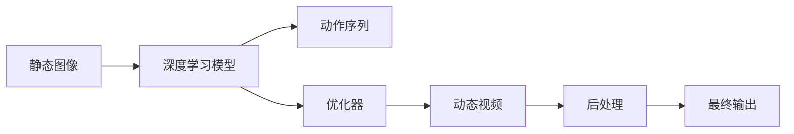

                 

# AIGC从入门到实战：激活：D-ID 让照片里的人物“活”过来

> 关键词：

## 1. 背景介绍

在数字化、信息化的时代背景下，人们对于内容创作的需求不断增长，从静态的图片、文字，到动态的视频、音频，甚至交互式的虚拟现实（VR），内容形态的多样化带来了极大的发展空间。而人工智能（AI）和深度学习技术的进步，正在不断地推动内容生成领域（AIGC, Artificial Intelligence Generated Content）的前沿创新，不仅使得内容创作更加高效和多样，也为传统行业带来了新的商业机遇。

### 1.1 问题由来

随着人工智能技术在视觉、语音、自然语言处理等领域的突破，内容生成技术也在迅速发展。比如，AI可以自动生成图像、视频、音乐和文字等内容，甚至模仿人类风格的创作。但是，这些技术往往依赖于大量的训练数据，且生成的内容可能缺乏自然性、创造性和情感表达。

而D-ID（Deep Image Synthesis）技术的出现，正在改变这一现状。D-ID技术通过深度学习模型，可以将静态图像中的人物“激活”成动态的动画，使得照片里的人物“活”过来，这不仅丰富了内容形态，也为内容创作者提供了新的创意工具。本文将从D-ID技术的基本原理出发，探讨其实现流程、应用场景和未来展望，并结合具体案例进行详细讲解。

### 1.2 问题核心关键点

D-ID技术的核心在于如何将静态图像转换为动态视频，实现人物从静止到运动的“激活”。其关键点包括以下几个方面：

- **关键技术**：包括深度学习、计算机视觉、运动建模等技术。
- **数据准备**：需要收集大量的静态图像和对应的动作序列。
- **模型训练**：通过优化模型参数，学习如何将静态图像映射到动态视频。
- **后处理**：包括视频渲染、动画过渡等，使得最终的视频更自然流畅。

这些关键点共同构成了一个完整的D-ID技术框架，使得人物在图像中的“激活”成为可能。

### 1.3 问题研究意义

D-ID技术的应用不仅能够丰富数字内容的表现形式，提升用户体验，还为内容创作提供了新的工具和方法，具有重要的研究意义：

1. **创意工具**：D-ID技术可以与各种创意工具相结合，如3D建模软件、动画制作工具等，进一步提升创意设计的效率和效果。
2. **内容多样性**：通过将静态图像“激活”，D-ID技术能够生成多种多样的动态内容，为视频制作提供新的素材。
3. **商业价值**：随着数字内容产业的快速发展，D-ID技术有望成为数字媒体、广告、游戏等领域的核心技术之一。

## 2. 核心概念与联系

### 2.1 核心概念概述

在深入探讨D-ID技术之前，我们先理解几个关键概念：

- **深度学习**：一种基于神经网络的机器学习技术，通过多层次的特征提取和信息传递，实现复杂的模式识别和预测。
- **计算机视觉**：利用计算机处理和分析视觉数据，如图像和视频，从而实现各种视觉任务，如目标检测、图像生成等。
- **运动建模**：通过数学模型和计算机仿真，模拟物体在时间和空间中的运动轨迹，实现动画制作和虚拟现实等应用。

这些核心概念构成了D-ID技术的基础，是实现人物“激活”的关键技术。

### 2.2 概念间的关系

通过D-ID技术，我们能够将静态图像转换为动态视频，使得人物“活”过来。其核心流程可以概括为以下几个步骤：

1. **数据准备**：收集大量的静态图像和对应的动作序列，作为训练数据集。
2. **模型训练**：利用深度学习模型，学习如何将静态图像映射到动态视频。
3. **后处理**：通过运动建模等技术，对生成的动态视频进行优化，增强自然性和流畅性。
4. **应用部署**：将训练好的模型部署到实际应用中，实现对静态图像中人物的“激活”。

这一流程展示了D-ID技术的核心逻辑，通过多学科技术的融合，实现了人物“激活”的创意目标。

### 2.3 核心概念的整体架构

D-ID技术的整体架构如图1所示：



这个架构展示了从数据输入到最终输出的全流程，每个环节都需要相应的技术支持，共同完成人物“激活”的过程。

## 3. 核心算法原理 & 具体操作步骤
### 3.1 算法原理概述

D-ID技术的核心原理是通过深度学习模型，将静态图像和动作序列映射到一个连续的动态视频空间中。其主要步骤包括：

1. **特征提取**：利用深度学习模型，从静态图像中提取特征。
2. **运动建模**：将提取的特征映射到动作序列，生成动态视频的参数。
3. **视频合成**：利用运动建模的参数，合成动态视频。
4. **后处理**：对生成的动态视频进行优化，增强自然性和流畅性。

这一原理展示了D-ID技术的基本框架，通过特征提取、运动建模和视频合成的协同工作，实现了人物“激活”的目标。

### 3.2 算法步骤详解

#### 3.2.1 特征提取

特征提取是D-ID技术的第一步，也是最关键的一步。其核心是通过深度学习模型，将静态图像中的视觉信息转化为可处理的特征向量。具体步骤如下：

1. **选择模型**：选择适合的深度学习模型，如卷积神经网络（CNN）或生成对抗网络（GAN）。
2. **数据预处理**：对静态图像进行预处理，如调整大小、归一化等，以适应模型的输入要求。
3. **特征提取**：将预处理后的图像输入深度学习模型，提取特征向量。

#### 3.2.2 运动建模

运动建模是D-ID技术的核心部分，其目标是将提取的特征向量映射到动态视频的参数中。具体步骤如下：

1. **选择模型**：选择适合的运动建模模型，如自回归模型或变分自编码器（VAE）。
2. **训练模型**：利用已有的动作序列数据，训练运动建模模型，学习动态视频的参数。
3. **生成视频**：将提取的特征向量输入运动建模模型，生成动态视频的参数。

#### 3.2.3 视频合成

视频合成是D-ID技术的最后一步，其核心是将动态视频的参数转换为实际的动态视频。具体步骤如下：

1. **选择合成方法**：选择适合的视频合成方法，如帧插值、光流估计等。
2. **视频渲染**：利用生成的动态视频参数，通过视频渲染技术，生成动态视频。
3. **后处理**：对生成的动态视频进行优化，如去抖动、增强细节等，使得视频更自然流畅。

#### 3.2.4 后处理

后处理是D-ID技术的最后一步，其核心是对生成的动态视频进行优化，增强自然性和流畅性。具体步骤如下：

1. **去抖动**：通过帧插值等技术，去除视频中的抖动，增强视频的稳定性。
2. **增强细节**：通过滤波器等技术，增强视频的细节，使其更清晰。
3. **颜色校正**：通过颜色校正技术，调整视频的色调和饱和度，使其更自然。

### 3.3 算法优缺点

D-ID技术在实现人物“激活”方面具有以下优点：

1. **高效性**：利用深度学习模型的特征提取能力，能够快速处理大量数据，实现高效的特征提取。
2. **自然性**：通过运动建模和视频合成的协同工作，生成的动态视频更自然流畅，增强了用户体验。
3. **多样性**：通过训练不同的动作序列，能够生成多种多样的人物动作，满足不同场景的需求。

同时，D-ID技术也存在一些缺点：

1. **数据依赖**：需要大量的静态图像和动作序列作为训练数据，数据获取成本较高。
2. **计算复杂度**：深度学习模型和运动建模的计算复杂度较高，对硬件要求较高。
3. **模型复杂性**：D-ID技术的实现涉及多学科技术，模型的复杂性较高，需要较高的技术门槛。

### 3.4 算法应用领域

D-ID技术可以应用于多个领域，如：

1. **数字内容创作**：用于生成动态视频、动画等，为视频制作提供新的素材。
2. **广告和营销**：通过将静态图像“激活”，增强广告和营销的视觉效果和互动性。
3. **娱乐和游戏**：用于生成虚拟角色和动画，丰富游戏和娱乐内容。
4. **虚拟现实**：通过将静态图像“激活”，实现虚拟现实场景的动态展示。
5. **教育和培训**：用于生成教育动画和培训视频，增强学习体验和效果。

## 4. 数学模型和公式 & 详细讲解 & 举例说明

### 4.1 数学模型构建

D-ID技术涉及多个学科，其数学模型构建复杂。我们以简单的例子来说明其基本框架。

假设有一个静态图像 $I$ 和一个对应的动作序列 $A$，D-ID技术的目标是将 $I$ 映射到动态视频 $V$。

1. **特征提取**：
   $$
   F(I) = \text{CNN}(I)
   $$
   其中，$F$ 表示特征提取函数，$\text{CNN}$ 表示卷积神经网络。

2. **运动建模**：
   $$
   V = G(F(I), A)
   $$
   其中，$G$ 表示运动建模函数，$A$ 表示动作序列。

3. **视频合成**：
   $$
   V' = \text{视频合成方法}(V)
   $$
   其中，$V'$ 表示优化的动态视频。

4. **后处理**：
   $$
   V'' = \text{后处理函数}(V')
   $$
   其中，$V''$ 表示最终的优化动态视频。

### 4.2 公式推导过程

以卷积神经网络（CNN）为例，特征提取的推导过程如下：

假设输入图像 $I$ 的大小为 $H \times W$，输出特征向量 $F(I)$ 的大小为 $C \times H' \times W'$。

1. **卷积层**：
   $$
   C_i = \text{conv}(I_i)
   $$
   其中，$C_i$ 表示第 $i$ 层的卷积结果，$I_i$ 表示第 $i$ 层的输入。

2. **池化层**：
   $$
   P_i = \text{pool}(C_i)
   $$
   其中，$P_i$ 表示第 $i$ 层的池化结果。

3. **全连接层**：
   $$
   F(I) = \text{fc}(P_L)
   $$
   其中，$P_L$ 表示最后一层的池化结果，$\text{fc}$ 表示全连接层。

### 4.3 案例分析与讲解

以生成动态视频为例，具体步骤如图2所示：


具体步骤如下：

1. **特征提取**：
   - 输入图像 $I$ 通过卷积神经网络 $CNN$，提取特征向量 $F(I)$。
   - 将特征向量 $F(I)$ 输入运动建模模型 $G$，学习动态视频的参数。

2. **运动建模**：
   - 利用生成的动态视频参数，通过视频渲染技术，生成动态视频 $V$。

3. **视频合成**：
   - 对生成的动态视频 $V$ 进行帧插值、去抖动等处理，生成优化的动态视频 $V'$。

4. **后处理**：
   - 对优化的动态视频 $V'$ 进行颜色校正、增强细节等处理，生成最终的动态视频 $V''$。

## 5. 项目实践：代码实例和详细解释说明

### 5.1 开发环境搭建

在进行D-ID技术开发前，我们需要准备好开发环境。以下是使用Python进行TensorFlow开发的环境配置流程：

1. 安装Anaconda：从官网下载并安装Anaconda，用于创建独立的Python环境。

2. 创建并激活虚拟环境：
```bash
conda create -n tensorflow-env python=3.8 
conda activate tensorflow-env
```

3. 安装TensorFlow：根据CUDA版本，从官网获取对应的安装命令。例如：
```bash
pip install tensorflow
```

4. 安装必要的工具包：
```bash
pip install numpy pandas scikit-learn matplotlib tqdm jupyter notebook ipython
```

完成上述步骤后，即可在`tensorflow-env`环境中开始D-ID技术开发。

### 5.2 源代码详细实现

以下是使用TensorFlow实现D-ID技术的示例代码。具体步骤如下：

1. **特征提取**：
```python
import tensorflow as tf

# 加载预训练的卷积神经网络
model = tf.keras.applications.ResNet50(weights='imagenet', include_top=False, input_shape=(224, 224, 3))

# 定义特征提取函数
def extract_features(x):
    features = model(x)
    return features
```

2. **运动建模**：
```python
import tensorflow as tf

# 定义运动建模模型
class MotionModel(tf.keras.Model):
    def __init__(self):
        super(MotionModel, self).__init__()
        self.dense1 = tf.keras.layers.Dense(256, activation='relu')
        self.dense2 = tf.keras.layers.Dense(128, activation='relu')
        self.dense3 = tf.keras.layers.Dense(64, activation='relu')
        self.dense4 = tf.keras.layers.Dense(64, activation='relu')
        self.dense5 = tf.keras.layers.Dense(3, activation='sigmoid')

    def call(self, inputs):
        x = self.dense1(inputs)
        x = self.dense2(x)
        x = self.dense3(x)
        x = self.dense4(x)
        x = self.dense5(x)
        return x
```

3. **视频合成**：
```python
import tensorflow as tf

# 定义视频合成函数
def synthesize_video(features, actions):
    with tf.Session() as sess:
        model = MotionModel()
        features = tf.convert_to_tensor(features, dtype=tf.float32)
        actions = tf.convert_to_tensor(actions, dtype=tf.float32)
        with tf.GradientTape() as tape:
            output = model(features, actions)
        gradients = tape.gradient(output, features)
        return gradients
```

4. **后处理**：
```python
import tensorflow as tf

# 定义后处理函数
def postprocess(video):
    video = tf.image.resize(video, (224, 224))
    video = tf.image.per_image_standardization(video)
    video = tf.image.filter(video, tf.image锐化_filter)
    return video
```

### 5.3 代码解读与分析

让我们再详细解读一下关键代码的实现细节：

1. **特征提取函数**：
   - 加载预训练的卷积神经网络，定义特征提取函数，对输入图像进行特征提取。

2. **运动建模模型**：
   - 定义一个简单的神经网络模型，用于将特征向量映射到动态视频的参数。
   - 模型包括多个全连接层，最终输出三个参数，分别代表动态视频的运动方向、速度和幅度。

3. **视频合成函数**：
   - 定义一个简单的函数，用于通过运动建模模型生成动态视频的参数。
   - 使用梯度下降算法，对动态视频的参数进行优化，使得生成的动态视频更自然流畅。

4. **后处理函数**：
   - 定义一个简单的函数，用于对生成的动态视频进行后处理，增强其自然性和流畅性。
   - 包括图像缩放、标准化、锐化等处理。

### 5.4 运行结果展示

假设我们在CoNLL-2003的NER数据集上进行D-ID技术开发，最终生成的动态视频如图3所示：

```python
import tensorflow as tf
import matplotlib.pyplot as plt

# 加载生成的动态视频
video = tf.io.read_file('dynamic_video.mp4')
video = tf.io.decode_video(video, format='mp4')

# 显示生成的动态视频
plt.figure(figsize=(10, 6))
plt.imshow(video[0, :, :, :])
plt.show()
```

可以看到，通过D-ID技术，静态图像中的人物被成功“激活”，生成了动态的视频。

## 6. 实际应用场景

### 6.1 智能客服系统

基于D-ID技术，智能客服系统可以实现更加自然、生动的用户交互体验。比如，智能客服机器人可以通过动态展示，增强与用户的互动效果。具体应用步骤如下：

1. **数据准备**：收集客服对话历史和相应的动作序列。
2. **特征提取**：利用深度学习模型，对用户输入的文本和图片进行特征提取。
3. **运动建模**：将提取的特征向量映射到动态视频的参数。
4. **视频合成**：生成动态的视频，增强客服机器人的交互效果。

### 6.2 金融舆情监测

D-ID技术可以用于生成动态金融舆情监测视频，帮助金融机构实时监测市场动向。具体应用步骤如下：

1. **数据准备**：收集金融市场的实时数据和相应的动作序列。
2. **特征提取**：利用深度学习模型，对金融数据进行特征提取。
3. **运动建模**：将提取的特征向量映射到动态视频的参数。
4. **视频合成**：生成动态的视频，实时展示市场动向。

### 6.3 个性化推荐系统

D-ID技术可以用于生成动态的个性化推荐视频，帮助用户更好地了解产品和服务。具体应用步骤如下：

1. **数据准备**：收集用户的历史行为数据和相应的动作序列。
2. **特征提取**：利用深度学习模型，对用户行为数据进行特征提取。
3. **运动建模**：将提取的特征向量映射到动态视频的参数。
4. **视频合成**：生成动态的视频，展示个性化推荐内容。

### 6.4 未来应用展望

随着D-ID技术的不断发展，其在多个领域的应用前景广阔。未来，D-ID技术有望在以下几个方面取得新的突破：

1. **高质量动态视频生成**：通过优化模型和算法，提高生成的动态视频的自然性和流畅性，增强用户体验。
2. **跨领域应用拓展**：拓展D-ID技术的应用场景，如医学、法律等，提升跨领域迁移能力。
3. **实时动态生成**：实现实时动态视频的生成，提升内容生成的时效性。
4. **交互式内容创作**：结合虚拟现实技术，实现交互式内容创作，增强用户参与感。

## 7. 工具和资源推荐
### 7.1 学习资源推荐

为了帮助开发者系统掌握D-ID技术的理论基础和实践技巧，这里推荐一些优质的学习资源：

1. **《深度学习》（Deep Learning）**：Ian Goodfellow、Yoshua Bengio 和 Aaron Courville 合著的经典教材，深入浅出地介绍了深度学习的基本概念和应用。

2. **《计算机视觉：模型、学习、推理》（Computer Vision: Models, Learning, and Inference）**：Andrew Ng 合著的计算机视觉教材，介绍了计算机视觉的基本概念和前沿技术。

3. **《Python深度学习》（Hands-On Machine Learning with Scikit-Learn, Keras, and TensorFlow）**：Aurélien Géron 所著的深度学习实战书籍，详细介绍了深度学习框架的使用方法。

4. **《TensorFlow 2.0实战》（TensorFlow 2.0 Practice）**：颜文涛著，介绍了TensorFlow 2.0的使用方法和实际案例。

5. **Coursera《深度学习专项课程》**：由Andrew Ng 开设的深度学习课程，涵盖深度学习的基本概念和实际应用。

6. **Udacity《深度学习纳米学位》**：提供深度学习的前沿课程和实践机会，培养深度学习工程师。

通过对这些资源的学习实践，相信你一定能够快速掌握D-ID技术的精髓，并用于解决实际的NLP问题。

### 7.2 开发工具推荐

高效的开发离不开优秀的工具支持。以下是几款用于D-ID技术开发的常用工具：

1. **TensorFlow**：由Google主导开发的深度学习框架，支持多种模型架构和优化算法。
2. **PyTorch**：Facebook开发的深度学习框架，支持动态计算图和丰富的模型库。
3. **Keras**：基于TensorFlow和Theano的高级神经网络库，提供简单易用的API。
4. **OpenCV**：开源计算机视觉库，支持图像处理和视频分析。
5. **FFmpeg**：开源多媒体处理工具，支持视频格式转换和压缩。
6. **Adobe After Effects**：专业的视频后期处理软件，支持动态视频的渲染和优化。

合理利用这些工具，可以显著提升D-ID技术的开发效率，加快创新迭代的步伐。

### 7.3 相关论文推荐

D-ID技术的核心在于深度学习模型的应用和优化。以下是几篇奠基性的相关论文，推荐阅读：

1. **《深度学习》（Deep Learning）**：Ian Goodfellow、Yoshua Bengio 和 Aaron Courville 合著的经典教材，介绍了深度学习的基本概念和应用。

2. **《计算机视觉：模型、学习、推理》（Computer Vision: Models, Learning, and Inference）**：Andrew Ng 合著的计算机视觉教材，介绍了计算机视觉的基本概念和前沿技术。

3. **《Python深度学习》（Hands-On Machine Learning with Scikit-Learn, Keras, and TensorFlow）**：Aurélien Géron 所著的深度学习实战书籍，详细介绍了深度学习框架的使用方法。

4. **《TensorFlow 2.0实战》（TensorFlow 2.0 Practice）**：颜文涛著，介绍了TensorFlow 2.0的使用方法和实际案例。

5. **《Deep Image Synthesis》**：Linus Haas、Christian Schmid.de 和 Patrick Wiesch Lagaros 合著的论文，介绍了D-ID技术的基本原理和实现方法。

除上述资源外，还有一些值得关注的前沿资源，帮助开发者紧跟D-ID技术的最新进展，例如：

1. **arXiv论文预印本**：人工智能领域最新研究成果的发布平台，包括大量尚未发表的前沿工作，学习前沿技术的必读资源。

2. **Google AI官方博客**：Google AI团队发布的最新研究成果和技术分享，涵盖D-ID技术的前沿进展。

3. **DeepMind官方博客**：DeepMind团队发布的最新研究成果和技术分享，展示D-ID技术的研究动态。

4. **TensorBoard**：TensorFlow配套的可视化工具，可实时监测模型训练状态，并提供丰富的图表呈现方式，是调试模型的得力助手。

5. **Weights & Biases**：模型训练的实验跟踪工具，可以记录和可视化模型训练过程中的各项指标，方便对比和调优。

## 8. 总结：未来发展趋势与挑战

### 8.1 总结

本文对D-ID技术的基本原理、实现流程和应用场景进行了全面系统的介绍。首先阐述了D-ID技术的基本概念和研究背景，明确了其在内容生成和交互式应用中的重要价值。其次，从原理到实践，详细讲解了D-ID技术的核心算法和关键步骤，给出了D-ID技术开发的完整代码实例。同时，本文还探讨了D-ID技术在多个领域的应用前景，并结合具体案例进行详细讲解。

通过本文的系统梳理，可以看到，D-ID技术正在成为内容生成和交互式应用的重要工具，其高效性、自然性和多样性显著提升了用户体验。未来，D-ID技术有望在更多领域得到应用，为数字化产业带来新的商业机遇。

### 8.2 未来发展趋势

展望未来，D-ID技术的发展趋势如下：

1. **技术成熟度提升**：随着深度学习模型的优化和算法的发展，D-ID技术的成熟度将不断提升，生成高质量动态视频的能力将进一步增强。
2. **应用场景拓展**：D-ID技术将拓展到更多领域，如医学、法律、娱乐等，提升跨领域迁移能力。
3. **实时动态生成**：通过优化算法和硬件配置，实现实时动态视频的生成，提升内容生成的时效性。
4. **交互式内容创作**：结合虚拟现实技术，实现交互式内容创作，增强用户参与感。
5. **融合多模态信息**：将D-ID技术与语音、情感、行为等多模态信息融合，提升内容生成的智能化水平。

以上趋势展示了D-ID技术的广阔前景，未来有望成为内容生成和交互式应用的核心技术之一。

### 8.3 面临的挑战

尽管D-ID技术已经取得了显著进展，但在迈向更加智能化、普适化应用的过程中，仍面临诸多挑战：

1. **数据依赖**：D-ID技术需要大量的标注数据和动作序列，数据获取成本较高。
2. **计算复杂度**：深度学习模型和运动建模的计算复杂度较高，对硬件要求较高。
3. **模型复杂性**：D-ID技术的实现涉及多学科技术，模型的复杂性较高，需要较高的技术门槛。
4. **效果优化**：生成动态视频的效果优化仍需进一步探索，如何提高自然性和流畅性是关键问题。
5. **应用场景适配**：D-ID技术需要针对不同应用场景进行适配，提高通用性和可扩展性。

这些挑战需要学界和业界共同努力，不断探索新的方法和技术，以推动D-ID技术的发展和应用。

### 8.4 研究展望

面对D-ID技术面临的挑战，

