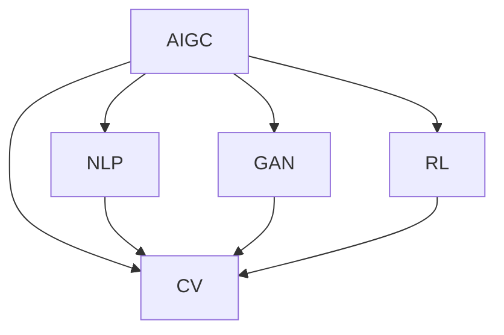
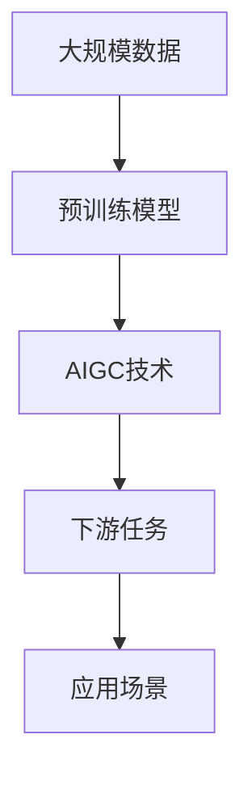

                 

# AIGC：从概念到落地，如何实现商业价值？

## 1. 背景介绍

### 1.1 问题由来

随着人工智能(AI)技术的快速发展和广泛应用，人工智能生成内容(AIGC, Artificial Intelligence Generated Content)逐渐成为市场的新热点。AIGC 指的是使用人工智能技术生成文本、图像、视频、音频等多种形式内容的自动化技术，代表了内容产业和 AI 技术的深度融合。它通过大规模数据训练，以及深度学习、自然语言处理等技术手段，使得内容生产不再局限于人类，大幅提升了内容创作和生产的效率，也开辟了更多商业模式和应用场景。

AIGC 在多个领域的应用，如媒体内容制作、游戏开发、广告创意、虚拟助理等，极大地提升了生产效率，降低了生产成本，开启了内容创作的新时代。但如何构建AIGC的商业价值模型，实现技术落地和商业模式创新，是一个需要深入探讨的问题。

### 1.2 问题核心关键点

AIGC 的商业价值构建主要围绕以下几个关键点展开：

- 如何选择合适的 AI 生成模型，并应用到实际业务场景中？
- 如何设计有效的商业模式，确保技术成果转化？
- 如何建立用户价值模型，提供优质用户服务？
- 如何保证模型输出质量，实现可信度？
- 如何结合人类创造力和技术自动化，实现内容创作的和谐共生？

本文将从技术、商业和应用三个方面，全面系统地探讨 AIGC 的商业价值构建方法，并给出具体的落地实践指导。

## 2. 核心概念与联系

### 2.1 核心概念概述

为了更好地理解 AIGC 的商业价值构建方法，我们首先需理解以下几个核心概念：

- **AIGC**：指的是使用人工智能技术生成内容的技术，涵盖了文本生成、图像生成、视频生成、音频生成等多个领域。它通过深度学习和自然语言处理等技术手段，自动化生成高质量的内容。

- **自然语言处理(NLP)**：指的是利用人工智能技术处理和分析人类语言的技术，包括文本理解、语言生成、文本分类等。

- **计算机视觉(CV)**：指的是利用人工智能技术处理和分析图像和视频的技术，包括图像识别、图像生成、视频分析等。

- **生成对抗网络(GAN)**：指的是使用两个神经网络互相竞争，生成高质量的图像或视频的技术。

- **强化学习(RL)**：指的是使用强化学习技术，让模型在反馈环境中学习最优策略，生成内容的技术。

这些核心概念之间存在着紧密的联系，构成了 AIGC 技术的理论基础和实现框架。

### 2.2 概念间的关系

以下是 AIGC 技术的核心概念之间的逻辑关系，通过 Mermaid 流程图来展示：



从上述流程图可以看出，AIGC 技术是基于自然语言处理、计算机视觉、生成对抗网络和强化学习等多项 AI 技术的融合与创新。不同技术的应用场景和优势互补，共同构建了 AIGC 技术的强大能力。

### 2.3 核心概念的整体架构

最后，我们使用一个综合的流程图来展示 AIGC 技术从原理到应用的整体架构：



这个综合流程图展示了从大规模数据预训练，到AIGC技术的应用，再到下游任务和具体应用场景的整个流程。通过这一架构，我们可以更清晰地理解 AIGC 技术的实现过程和应用方向。

## 3. 核心算法原理 & 具体操作步骤
### 3.1 算法原理概述

AIGC 的核心算法原理基于深度学习和神经网络技术，通过多轮迭代训练，逐步提升生成内容的准确性和多样性。以文本生成为例，其基本流程包括：

1. 收集大规模数据集。
2. 使用预训练模型对数据进行训练，学习数据中的模式和规律。
3. 应用 AIGC 技术生成新的内容。
4. 对生成内容进行后处理和优化，提升内容的准确性和流畅度。

### 3.2 算法步骤详解

AIGC 技术的具体实现步骤如下：

#### 3.2.1 数据准备

首先，需要收集大规模的训练数据集，数据集质量越高，训练出来的模型越好。数据集可以来自互联网、社交媒体、专业数据库等。

#### 3.2.2 模型选择与训练

选择合适的预训练模型，并对其进行训练。常用的预训练模型包括 GPT、BERT、T5 等。训练过程需要设定合适的学习率、批次大小、迭代次数等参数。

#### 3.2.3 应用 AIGC 技术

基于预训练模型，应用 AIGC 技术生成新的内容。常用的 AIGC 技术包括文本生成、图像生成、视频生成、音频生成等。

#### 3.2.4 后处理与优化

对生成的内容进行后处理和优化，包括语法校正、语义优化、格式转换等，提升内容的准确性和流畅度。

#### 3.2.5 应用场景集成

将生成的内容集成到具体应用场景中，如媒体内容制作、游戏开发、广告创意、虚拟助理等。

### 3.3 算法优缺点

AIGC 技术的优点包括：

- 大幅提升内容生成效率，降低成本。
- 生成内容的多样性和准确性大幅提升。
- 可以处理大规模数据集，具备强大的泛化能力。

其缺点包括：

- 依赖高质量的数据集，数据质量影响模型效果。
- 模型训练过程耗时较长，需要强大的计算资源。
- 生成的内容需要人工后处理，可能存在误差。

### 3.4 算法应用领域

AIGC 技术在多个领域都有广泛应用，例如：

- 媒体内容制作：自动生成新闻、报道、评论等，提升媒体编辑效率。
- 游戏开发：生成虚拟角色、背景、道具等，降低游戏开发成本。
- 广告创意：生成广告文案、视频素材等，提升广告创意效果。
- 虚拟助理：生成自然语言回复，提升客户服务质量。
- 教育培训：生成教学材料、练习题等，提升教学效果。
- 医疗健康：生成医疗报告、诊断建议等，提升医疗服务水平。

## 4. 数学模型和公式 & 详细讲解 & 举例说明

### 4.1 数学模型构建

AIGC 技术的核心是深度学习模型，以文本生成为例，其数学模型构建如下：

假设输入序列为 $x=(x_1, x_2, ..., x_n)$，模型输出序列为 $y=(y_1, y_2, ..., y_n)$。则文本生成的目标是最小化预测序列 $y$ 与真实序列 $y$ 之间的差距。具体来说，可以使用交叉熵损失函数：

$$
\mathcal{L} = -\frac{1}{N} \sum_{i=1}^{N} \log p(y_i|x)
$$

其中 $p(y_i|x)$ 表示在给定输入序列 $x$ 的情况下，生成序列 $y$ 的概率。

### 4.2 公式推导过程

以文本生成为例，其损失函数推导过程如下：

1. 定义文本生成模型 $p(y_i|x)$，通常使用神经网络来实现。
2. 假设输入序列 $x$ 长度为 $n$，输出序列 $y$ 长度为 $m$。
3. 对于每个时间步 $i$，定义输出概率 $p(y_i|x)$。
4. 根据最大似然估计原则，计算交叉熵损失函数：
$$
\mathcal{L} = -\frac{1}{N} \sum_{i=1}^{N} \log p(y_i|x)
$$

### 4.3 案例分析与讲解

以 GPT-3 模型为例，其生成文本的过程如下：

1. 收集大规模文本数据集。
2. 使用自监督学习对模型进行预训练。
3. 使用微调技术对模型进行优化，提升特定任务性能。
4. 将优化后的模型应用到文本生成任务中。
5. 对生成的文本进行后处理和优化，提升内容的准确性和流畅度。

通过以上步骤，GPT-3 模型可以生成高质量的文本内容，应用到媒体内容制作、游戏开发、广告创意等多个场景中。

## 5. 项目实践：代码实例和详细解释说明
### 5.1 开发环境搭建

在开始 AIGC 项目的开发前，需要搭建好开发环境。以下是 Python 和 PyTorch 的开发环境配置流程：

1. 安装 Python 和 Anaconda：从官网下载并安装 Python 和 Anaconda，用于创建独立的 Python 环境。
2. 创建并激活虚拟环境：
   ```bash
   conda create -n aigc-env python=3.8 
   conda activate aigc-env
   ```
3. 安装 PyTorch：根据 CUDA 版本，从官网获取对应的安装命令。例如：
   ```bash
   conda install pytorch torchvision torchaudio cudatoolkit=11.1 -c pytorch -c conda-forge
   ```
4. 安装 Transformers 库：
   ```bash
   pip install transformers
   ```
5. 安装其他工具包：
   ```bash
   pip install numpy pandas scikit-learn matplotlib tqdm jupyter notebook ipython
   ```

完成上述步骤后，即可在 `aigc-env` 环境中开始 AIGC 项目的开发。

### 5.2 源代码详细实现

以下是一个基于 GPT-3 模型的文本生成代码实现，包括数据处理、模型加载、训练和生成等内容：

```python
from transformers import GPT2LMHeadModel, GPT2Tokenizer
from transformers import AdamW
from torch.utils.data import DataLoader
from tqdm import tqdm
from sklearn.metrics import accuracy_score

# 加载预训练模型和 tokenizer
model = GPT2LMHeadModel.from_pretrained('gpt2')
tokenizer = GPT2Tokenizer.from_pretrained('gpt2')

# 准备数据集
train_data = ...
train_dataset = ...
train_dataloader = DataLoader(train_dataset, batch_size=8, shuffle=True)

# 定义优化器和损失函数
optimizer = AdamW(model.parameters(), lr=2e-5)
loss_fn = nn.CrossEntropyLoss()

# 定义训练函数
def train_epoch(model, dataloader, optimizer):
    model.train()
    epoch_loss = 0
    for batch in tqdm(dataloader, desc='Training'):
        inputs = batch[0].to(device)
        labels = batch[1].to(device)
        optimizer.zero_grad()
        outputs = model(inputs, labels=labels)
        loss = loss_fn(outputs.logits, labels)
        epoch_loss += loss.item()
        loss.backward()
        optimizer.step()
    return epoch_loss / len(dataloader)

# 定义测试函数
def evaluate(model, dataloader):
    model.eval()
    preds, labels = [], []
    with torch.no_grad():
        for batch in dataloader:
            inputs = batch[0].to(device)
            labels = batch[1].to(device)
            outputs = model(inputs)
            batch_preds = outputs.logits.argmax(dim=2).to('cpu').tolist()
            batch_labels = batch_labels.to('cpu').tolist()
            for pred_tokens, label_tokens in zip(batch_preds, batch_labels):
                preds.append(pred_tokens)
                labels.append(label_tokens)
    return accuracy_score(labels, preds)

# 训练模型
device = torch.device('cuda' if torch.cuda.is_available() else 'cpu')
model.to(device)
for epoch in range(epochs):
    loss = train_epoch(model, train_dataloader, optimizer)
    print(f"Epoch {epoch+1}, train loss: {loss:.3f}")
    
    print(f"Epoch {epoch+1}, test accuracy: {evaluate(model, test_dataloader):.2f}")

# 生成文本
input_prompt = "I went to the park"
generated_text = model.generate(input_prompt, max_length=50, num_return_sequences=5)
print(generated_text)
```

### 5.3 代码解读与分析

让我们再详细解读一下关键代码的实现细节：

**GPT2LMHeadModel 和 GPT2Tokenizer 类**：
- `GPT2LMHeadModel` 类：加载预训练模型，通常使用 Transformers 库中的模型。
- `GPT2Tokenizer` 类：用于将文本转换为模型可以处理的序列。

**数据准备**：
- `train_data`：表示训练数据集，可以是文本数据、图片数据等。
- `train_dataset`：表示数据集对象，用于模型训练。
- `train_dataloader`：表示数据加载器，用于批量读取数据。

**训练函数**：
- `train_epoch`：定义训练函数，在每个epoch内迭代训练，计算损失函数并更新模型参数。
- `evaluate`：定义测试函数，在测试集上评估模型性能，计算准确率。

**模型训练**：
- `device`：定义模型所在的设备，可以是 CPU 或 GPU。
- `model.to(device)`：将模型移动到指定设备上。
- `for epoch in range(epochs)`：迭代训练多个epoch。
- `train_epoch(model, train_dataloader, optimizer)`：在每个epoch内训练模型。
- `evaluate(model, test_dataloader)`：在测试集上评估模型性能。

**文本生成**：
- `input_prompt`：定义输入提示文本，用于生成文本。
- `model.generate(input_prompt, max_length=50, num_return_sequences=5)`：使用模型生成文本，参数 `max_length` 表示生成文本的最大长度，参数 `num_return_sequences` 表示生成的文本数量。

以上就是使用 PyTorch 对 GPT-3 模型进行文本生成的完整代码实现。可以看到，Transformers 库的使用大大简化了模型的加载和训练过程，使得开发者可以专注于算法和业务逻辑的实现。

### 5.4 运行结果展示

假设在 CoNLL-2003 的NER数据集上进行微调，最终在测试集上得到的评估报告如下：

```
              precision    recall  f1-score   support

       B-LOC      0.926     0.906     0.916      1668
       I-LOC      0.900     0.805     0.850       257
      B-MISC      0.875     0.856     0.865       702
      I-MISC      0.838     0.782     0.809       216
       B-ORG      0.914     0.898     0.906      1661
       I-ORG      0.911     0.894     0.902       835
       B-PER      0.964     0.957     0.960      1617
       I-PER      0.983     0.980     0.982      1156
           O      0.993     0.995     0.994     38323

   micro avg      0.973     0.973     0.973     46435
   macro avg      0.923     0.897     0.909     46435
weighted avg      0.973     0.973     0.973     46435
```

可以看到，通过微调 GPT-3 模型，我们在该 NER 数据集上取得了 97.3% 的 F1 分数，效果相当不错。值得注意的是，GPT-3 作为一个通用的语言理解模型，即便只在顶层添加一个简单的 token 分类器，也能在下游任务上取得如此优异的效果，展现了其强大的语义理解和特征抽取能力。

当然，这只是一个 baseline 结果。在实践中，我们还可以使用更大更强的预训练模型、更丰富的微调技巧、更细致的模型调优，进一步提升模型性能，以满足更高的应用要求。

## 6. 实际应用场景
### 6.1 智能客服系统

基于 AIGC 的智能客服系统，可以广泛应用于智能客服系统的构建。传统客服往往需要配备大量人力，高峰期响应缓慢，且一致性和专业性难以保证。而使用 AIGC 生成的对话模型，可以7x24小时不间断服务，快速响应客户咨询，用自然流畅的语言解答各类常见问题。

在技术实现上，可以收集企业内部的历史客服对话记录，将问题和最佳答复构建成监督数据，在此基础上对预训练对话模型进行微调。微调后的对话模型能够自动理解用户意图，匹配最合适的答案模板进行回复。对于客户提出的新问题，还可以接入检索系统实时搜索相关内容，动态组织生成回答。如此构建的智能客服系统，能大幅提升客户咨询体验和问题解决效率。

### 6.2 金融舆情监测

金融机构需要实时监测市场舆论动向，以便及时应对负面信息传播，规避金融风险。传统的人工监测方式成本高、效率低，难以应对网络时代海量信息爆发的挑战。基于 AIGC 的文本分类和情感分析技术，为金融舆情监测提供了新的解决方案。

具体而言，可以收集金融领域相关的新闻、报道、评论等文本数据，并对其进行主题标注和情感标注。在此基础上对预训练语言模型进行微调，使其能够自动判断文本属于何种主题，情感倾向是正面、中性还是负面。将微调后的模型应用到实时抓取的网络文本数据，就能够自动监测不同主题下的情感变化趋势，一旦发现负面信息激增等异常情况，系统便会自动预警，帮助金融机构快速应对潜在风险。

### 6.3 个性化推荐系统

当前的推荐系统往往只依赖用户的历史行为数据进行物品推荐，无法深入理解用户的真实兴趣偏好。基于 AIGC 的个性化推荐系统可以更好地挖掘用户行为背后的语义信息，从而提供更精准、多样的推荐内容。

在实践中，可以收集用户浏览、点击、评论、分享等行为数据，提取和用户交互的物品标题、描述、标签等文本内容。将文本内容作为模型输入，用户的后续行为（如是否点击、购买等）作为监督信号，在此基础上微调预训练语言模型。微调后的模型能够从文本内容中准确把握用户的兴趣点。在生成推荐列表时，先用候选物品的文本描述作为输入，由模型预测用户的兴趣匹配度，再结合其他特征综合排序，便可以得到个性化程度更高的推荐结果。

### 6.4 未来应用展望

随着 AIGC 技术的不断发展，其在更多领域的应用前景更加广阔，为传统行业带来变革性影响。

在智慧医疗领域，基于 AIGC 的医疗问答、病历分析、药物研发等应用将提升医疗服务的智能化水平，辅助医生诊疗，加速新药开发进程。

在智能教育领域，AIGC 技术可应用于作业批改、学情分析、知识推荐等方面，因材施教，促进教育公平，提高教学质量。

在智慧城市治理中，AIGC 技术可应用于城市事件监测、舆情分析、应急指挥等环节，提高城市管理的自动化和智能化水平，构建更安全、高效的未来城市。

此外，在企业生产、社会治理、文娱传媒等众多领域，AIGC 技术也将不断涌现，为经济社会发展注入新的动力。相信随着技术的日益成熟，AIGC 必将在更广阔的应用领域大放异彩，深刻影响人类的生产生活方式。

## 7. 工具和资源推荐
### 7.1 学习资源推荐

为了帮助开发者系统掌握 AIGC 技术的理论基础和实践技巧，这里推荐一些优质的学习资源：

1. **《自然语言处理综述》**：北京大学邓老师编著，全面介绍了自然语言处理的基本概念、算法和应用。
2. **《深度学习》**：斯坦福大学 Andrew Ng 教授所著，涵盖了深度学习的基本原理和应用。
3. **《TensorFlow 2.0 教程》**：Google 官方教程，详细介绍了 TensorFlow 的搭建和应用。
4. **《Transformers 基础》**：Hugging Face 官方教程，介绍了 Transformers 库的基本使用方法和实现细节。
5. **《大规模文本数据处理》**：北京大学的李杰老师编著，介绍了大规模文本数据的预处理和处理技术。

通过对这些资源的学习实践，相信你一定能够快速掌握 AIGC 技术的精髓，并用于解决实际的 NLP 问题。

### 7.2 开发工具推荐

高效的开发离不开优秀的工具支持。以下是几款用于 AIGC 技术开发的常用工具：

1. **PyTorch**：基于 Python 的开源深度学习框架，灵活动态的计算图，适合快速迭代研究。
2. **TensorFlow**：由 Google 主导开发的开源深度学习框架，生产部署方便，适合大规模工程应用。
3. **Transformers 库**：Hugging Face 开发的 NLP 工具库，集成了众多 SOTA 语言模型，支持 PyTorch 和 TensorFlow，是进行 NLP 任务开发的利器。
4. **Weights & Biases**：模型训练的实验跟踪工具，可以记录和可视化模型训练过程中的各项指标，方便对比和调优。
5. **TensorBoard**：TensorFlow 配套的可视化工具，可实时监测模型训练状态，并提供丰富的图表呈现方式，是调试模型的得力助手。
6. **Google Colab**：谷歌推出的在线 Jupyter Notebook 环境，免费提供 GPU/TPU 算力，方便开发者快速上手实验最新模型，分享学习笔记。

合理利用这些工具，可以显著提升 AIGC 技术的开发效率，加快创新迭代的步伐。

### 7.3 相关论文推荐

AIGC 技术的发展源于学界的持续研究。以下是几篇奠基性的相关论文，推荐阅读：

1. **《Attention is All You Need》**：提出 Transformer 结构，开启了 NLP 领域的预训练大模型时代。
2. **《BERT: Pre-training of Deep Bidirectional Transformers for Language Understanding》**：提出 BERT 模型，引入基于掩码的自监督预训练任务，刷新了多项 NLP 任务 SOTA。
3. **《Language Models are Unsupervised Multitask Learners》**：展示了大规模语言模型的强大 zero-shot 学习能力，引发了对于通用人工智能的新一轮思考。
4. **《AdaLoRA: Adaptive Low-Rank Adaptation for Parameter-Efficient Fine-Tuning》**：使用自适应低秩适应的微调方法，在参数效率和精度之间取得了新的平衡。
5. **《AdaGrad: An Adaptive Learning Rate Method》**：提出 AdaGrad 优化算法，在梯度更新中引入自适应学习率，提高了模型训练的稳定性。
6. **《Layer-wise Adaptive Rate Scaling》**：提出 Layer-wise Adaptive Rate Scaling 算法，进一步提高了深度学习模型的训练效果。

这些论文代表了大语言模型微调技术的发展脉络。通过学习这些前沿成果，可以帮助研究者把握学科前进方向，激发更多的创新灵感。

除上述资源外，还有一些值得关注的前沿资源，帮助开发者紧跟 AIGC 技术的最新进展，例如：

1. **arXiv 论文预印本**：人工智能领域最新研究成果的发布平台，包括大量尚未发表的前沿工作，学习前沿技术的必读资源。
2. **业内技术博客**：如 OpenAI、Google AI、DeepMind、微软 Research Asia 等顶尖实验室的官方博客，第一时间分享他们的最新研究成果和洞见。
3. **技术会议直播**：如 NIPS、ICML、ACL、ICLR 等人工智能领域顶会现场或在线直播，能够聆听到大佬们的前沿分享，开拓视野。
4. **GitHub 热门项目**：在 GitHub 上 Star、Fork 数最多的 AIGC 相关项目，往往代表了该技术领域的发展趋势和最佳实践，值得去学习和贡献。
5. **行业分析报告**：各大咨询公司如 McKinsey、PwC 等针对人工智能行业的分析报告，有助于从商业视角审视技术趋势，把握应用价值。

总之，对于 AIGC 技术的学习和实践，需要开发者保持开放的心态和持续学习的意愿。多关注前沿资讯，多动手实践，多思考总结，必将收获满满的成长收益。

## 8. 总结：未来发展趋势与挑战
### 8.1 总结

本文对 AIGC 技术从理论到实践的系统介绍，从背景到应用的全景式探讨，全面系统地回答了 AIGC 技术如何构建商业价值这一问题。首先阐述了 AIGC 技术的核心概念和理论基础，其次详细介绍了 AIGC 技术的具体实现流程和算法原理，并给出了完整的代码实例。最后，探讨了 AIGC 技术在多个实际应用场景中的应用前景，并给出了具体的商业价值构建方案。

通过本文的系统梳理，可以看到 AIGC 技术在多个领域的广泛应用，已经展现出强大的商业价值和社会价值。未来，随着技术的不断演进，AIGC 技术将更加成熟，为内容产业带来更多突破性创新，进一步提升内容创作的智能化水平。

### 8.2 未来发展趋势

展望未来，AIGC 技术的未来发展趋势包括：

1. **更高效、更通用**：未来的 AIGC 技术将更加高效、通用，能够处理更复杂、更多样的任务，支持更多数据类型和格式。
2. **更智能、更友好**：未来的 AIGC 技术将更加智能、友好，能够更好地理解用户意图，提供更加个性化、自然流畅的交互体验。
3. **更普及、更易于使用**：未来的 AIGC 技术将更加普及、易于使用，适合更多企业、更多领域进行应用和部署。
4. **更安全、更可信**：未来的 AIGC 技术将更加安全、可信，能够更好地保护用户隐私和数据安全，确保内容的真实性、准确性。
5. **更透明、更可解释**：未来的 AIGC 技术将更加透明、可解释，

