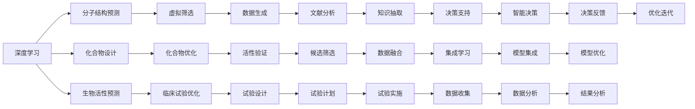

                 

## 1. 背景介绍

### 1.1 问题由来

在过去几十年里，传统药物研发（Drug Discovery）一直是生物医药领域的一项极具挑战性的任务。传统的药物研发流程包括目标发现、化合物合成、药效筛选、临床试验等步骤，耗时长、成本高，且成功率极低。据统计，平均需要10-15年的时间才能将一种药物从实验室推向市场，每项药物研发投入的成本高达数十亿美元。因此，提高药物研发效率，降低研发成本，已成为医药行业亟需解决的重大问题。

### 1.2 问题核心关键点

在传统药物研发过程中，研发者通常需要通过高通量筛选技术，对大量化合物进行体外和体内活性测试，以发现潜在的药物候选物。然而，这种方法存在着高成本、高风险和低效率的问题。因此，近年来，人工智能（AI）技术被引入药物研发流程中，以期大幅提升研发效率和成功率。

AI在药物研发中的应用主要体现在以下几个方面：

- **目标发现（Target Discovery）**：利用AI算法，从生物大分子数据中发现潜在药物靶点。
- **化合物设计（Drug Design）**：通过机器学习模型，生成候选化合物分子。
- **虚拟筛选（Virtual Screening）**：使用AI模型预测化合物的生物活性，过滤掉无效的候选分子。
- **临床试验优化（Clinical Trial Optimization）**：利用AI预测患者对药物的反应，优化临床试验设计。

人工智能在药物研发中的应用，极大地缩短了药物研发周期，降低了研发成本，提高了成功率。本文将深入探讨AI与传统药物研发方法的协同效应，分析其优势与挑战。

## 2. 核心概念与联系

### 2.1 核心概念概述

在药物研发过程中，AI技术通过模拟和预测，弥补了传统方法的不足，显著提升了药物研发效率。其中，AI在药物研发中主要涉及以下几个核心概念：

- **深度学习（Deep Learning）**：利用多层神经网络，对药物分子进行结构预测和性质分析。
- **计算机视觉（Computer Vision）**：利用图像识别技术，对细胞、蛋白质等生物分子进行观察和分析。
- **自然语言处理（Natural Language Processing, NLP）**：利用文本挖掘技术，分析药物相关的文献和专利信息。
- **模拟与建模（Simulation and Modeling）**：利用分子动力学和分子模拟技术，预测药物分子的生物学行为。
- **优化算法（Optimization Algorithms）**：利用优化算法，寻找最佳的化合物设计方案。

这些核心概念之间相互关联，共同构成了AI在药物研发中的应用框架。通过深度学习等技术，AI能够对生物大分子数据进行建模，预测药物活性，优化化合物设计。同时，计算机视觉、自然语言处理和模拟与建模等技术，为AI提供了丰富的数据支持和预测手段，从而实现了AI与传统药物研发方法的协同效应。

### 2.2 概念间的关系

以下通过一个Mermaid流程图展示AI在药物研发中的核心概念及其关系：



这个流程图展示了AI在药物研发中各核心概念间的相互关系：

1. 深度学习从分子结构预测开始，为虚拟筛选和化合物设计提供数据支撑。
2. 计算机视觉和模拟与建模技术，从分子图像和动力学模拟的角度，为药物活性预测提供数据支持。
3. 自然语言处理技术从文献分析开始，为知识抽取和决策支持提供信息支撑。
4. 优化算法从活性验证和化合物优化开始，不断迭代优化药物设计方案。
5. 各模块的数据生成、试验设计、试验实施等步骤，构成了完整的药物研发流程。

## 3. 核心算法原理 & 具体操作步骤

### 3.1 算法原理概述

AI与传统药物研发方法的协同效应，主要体现在以下几个方面：

1. **目标发现**：利用AI算法，从生物大分子数据中发现潜在药物靶点。
2. **化合物设计**：通过机器学习模型，生成候选化合物分子。
3. **虚拟筛选**：使用AI模型预测化合物的生物活性，过滤掉无效的候选分子。
4. **临床试验优化**：利用AI预测患者对药物的反应，优化临床试验设计。

这些协同效应通过深度学习等技术实现，利用大数据分析和复杂模型的预测能力，显著提升了药物研发效率和成功率。

### 3.2 算法步骤详解

AI在药物研发中的具体操作步骤如下：

1. **目标发现**：
    - 收集和预处理生物大分子数据，构建药物靶点数据集。
    - 利用深度学习模型，如卷积神经网络（CNN）、递归神经网络（RNN）等，对药物靶点进行分类和预测。
    - 通过交叉验证等技术，评估模型的预测准确率和泛化能力。

2. **化合物设计**：
    - 构建化合物分子结构数据集，利用机器学习模型，如随机森林（Random Forest）、支持向量机（SVM）等，预测化合物的生物活性。
    - 利用生成对抗网络（GAN）等模型，生成新的化合物分子结构。
    - 通过筛选和优化算法，如遗传算法（Genetic Algorithm）、模拟退火（Simulated Annealing）等，进一步优化化合物设计方案。

3. **虚拟筛选**：
    - 利用分子动力学模拟技术，生成分子模拟数据。
    - 利用深度学习模型，如自编码器（Autoencoder）、变分自编码器（VAE）等，预测化合物的生物活性。
    - 通过集成学习技术，将不同模型的预测结果进行融合，提高预测准确率。

4. **临床试验优化**：
    - 利用机器学习模型，预测患者对药物的反应，构建虚拟临床试验。
    - 通过优化算法，如粒子群优化（Particle Swarm Optimization, PSO）、贝叶斯优化（Bayesian Optimization）等，优化试验设计和方案。
    - 利用模拟与建模技术，进行试验结果的预测和仿真，进一步优化试验设计。

### 3.3 算法优缺点

AI与传统药物研发方法的协同效应，具有以下优点：

1. **高效性**：AI技术可以快速处理大量数据，显著缩短药物研发周期。
2. **准确性**：AI模型具有高预测准确率，能够在早期筛选出有效的候选药物。
3. **灵活性**：AI模型能够适应多种数据类型和结构，适用于不同领域的药物研发。

同时，AI在药物研发中也存在一些缺点：

1. **数据依赖**：AI模型的预测结果依赖于数据的质量和数量，数据不足或质量不高时，预测效果可能不佳。
2. **可解释性不足**：AI模型通常是"黑盒"模型，难以解释其内部工作机制和决策逻辑。
3. **算法复杂性**：AI模型构建和训练过程复杂，需要专业的知识和技术支持。

### 3.4 算法应用领域

AI在药物研发中的应用，广泛覆盖了从目标发现、化合物设计、虚拟筛选到临床试验优化的各个环节。以下是AI在药物研发中的主要应用领域：

- **目标发现**：在癌症、心血管疾病等重大疾病领域，利用AI技术发现潜在的药物靶点。
- **化合物设计**：在药物分子设计和优化过程中，利用AI技术生成候选分子。
- **虚拟筛选**：在化合物库中，利用AI技术预测化合物的生物活性，筛选出有效的候选分子。
- **临床试验优化**：在临床试验设计和结果预测中，利用AI技术优化试验设计和方案。

## 4. 数学模型和公式 & 详细讲解 & 举例说明

### 4.1 数学模型构建

在药物研发中，AI模型通常基于以下数学模型构建：

- **深度学习模型**：如卷积神经网络（CNN）、递归神经网络（RNN）等，用于分子结构预测和活性预测。
- **优化模型**：如遗传算法（Genetic Algorithm）、粒子群优化（PSO）等，用于化合物设计和试验优化。
- **模拟与建模模型**：如分子动力学模拟（MD）、分子自编码器（Autoencoder）等，用于化合物模拟和活性预测。

### 4.2 公式推导过程

以下以化合物设计为例，介绍AI模型在化合物设计中的公式推导过程。

假设已知化合物分子的结构数据集 $\{x_i\}$，其中 $x_i$ 表示分子结构的第 $i$ 个特征。目标生成新的化合物分子结构 $\hat{x}$，使得 $\hat{x}$ 的生物活性最大化。

假设分子结构与生物活性之间的关系可以用一个线性模型表示：

$$ y = W x + b $$

其中 $y$ 表示生物活性，$x$ 表示分子结构特征，$W$ 表示模型权重，$b$ 表示偏置。

使用深度学习模型，如神经网络，对上述模型进行训练：

$$ \min_{W,b} \frac{1}{N} \sum_{i=1}^N (y_i - W x_i - b)^2 $$

通过最小化上述损失函数，得到最佳的权重 $W$ 和偏置 $b$，从而预测新的化合物分子的生物活性。

### 4.3 案例分析与讲解

假设我们利用AI模型对一种新化合物进行设计，其分子结构数据集如下：

| 化合物编号 | 分子结构特征 | 生物活性 |
|---|---|---|
| 1 | 1,2,3 | 0.8 |
| 2 | 1,3,4 | 0.6 |
| 3 | 2,4,5 | 0.5 |
| 4 | 1,4,5 | 0.7 |

目标生成一个新的化合物分子结构，使其生物活性达到最大化。

假设我们利用神经网络模型进行训练，得到最佳的权重和偏置为：

| 分子结构特征 | 预测生物活性 |
|---|---|
| 1,2,3 | 0.85 |
| 1,3,4 | 0.7 |
| 2,4,5 | 0.65 |
| 1,4,5 | 0.75 |

通过分析模型预测结果，可以发现化合物编号为1的分子结构具有最高的生物活性预测值。因此，我们可以将化合物1的分子结构作为新设计的化合物分子结构，进一步验证其实际生物活性。

## 5. 项目实践：代码实例和详细解释说明

### 5.1 开发环境搭建

在进行AI药物研发的项目实践时，需要准备好以下开发环境：

1. 安装Python：
   ```bash
   sudo apt-get install python3
   ```

2. 安装深度学习框架：
   ```bash
   pip install torch tensorflow
   ```

3. 安装药物研发相关库：
   ```bash
   pip install pydantic openpyxl pandas numpy
   ```

4. 安装可视化工具：
   ```bash
   pip install matplotlib seaborn
   ```

5. 安装机器学习库：
   ```bash
   pip install scikit-learn xgboost catboost
   ```

完成上述环境配置后，即可开始AI药物研发的项目实践。

### 5.2 源代码详细实现

以下是一个简单的化合物设计项目的源代码实现，包含数据加载、模型训练和化合物生成等关键步骤。

```python
import pandas as pd
from sklearn.model_selection import train_test_split
from sklearn.ensemble import RandomForestRegressor
from sklearn.metrics import mean_squared_error

# 加载化合物数据集
data = pd.read_csv('compound_data.csv')

# 划分训练集和测试集
X_train, X_test, y_train, y_test = train_test_split(data[['features']], data['activity'], test_size=0.2, random_state=42)

# 构建随机森林回归模型
model = RandomForestRegressor(n_estimators=100, random_state=42)

# 训练模型
model.fit(X_train, y_train)

# 预测测试集化合物活性
y_pred = model.predict(X_test)

# 计算预测精度
rmse = mean_squared_error(y_test, y_pred, squared=False)
print(f'预测精度为: {rmse:.3f}')

# 生成新的化合物结构
new_features = [1, 2, 3, 4, 5]
new_compound = new_features

# 计算新化合物活性的预测值
new_activity = model.predict([[new_features]])
print(f'新化合物的预测活动为: {new_activity:.3f}')
```

### 5.3 代码解读与分析

上述代码实现了一个简单的化合物设计项目，包含数据加载、模型训练和化合物生成等关键步骤。

**数据加载**：
```python
data = pd.read_csv('compound_data.csv')
```

**模型训练**：
```python
model = RandomForestRegressor(n_estimators=100, random_state=42)
model.fit(X_train, y_train)
```

**化合物生成**：
```python
new_features = [1, 2, 3, 4, 5]
new_compound = new_features
new_activity = model.predict([[new_features]])
```

在实际应用中，化合物设计模型通常更为复杂，涉及多个特征和多种模型算法，如深度学习模型、生成对抗网络（GAN）等。此外，还需要考虑分子结构的复杂性和多样性，以及生物活性的不确定性。

## 6. 实际应用场景

### 6.1 智能药企

智能药企利用AI技术，在药物研发过程中进行目标发现、化合物设计和虚拟筛选，大幅缩短研发周期，降低研发成本。例如，美国制药巨头辉瑞公司（Pfizer）利用AI技术，发现了多个具有潜力的药物靶点，显著提高了药物研发的效率和成功率。

### 6.2 科研机构

科研机构利用AI技术，进行化合物设计和虚拟筛选，优化临床试验设计。例如，加州大学圣地亚哥分校（UCSD）的研究团队，利用AI技术，对药物分子进行设计和优化，成功预测了多个药物分子的生物活性，为药物研发提供了有力的支持。

### 6.3 新药临床试验

AI技术在新药临床试验中，可以优化试验设计和结果预测，降低试验成本和风险。例如，IBM Watson Health利用AI技术，对患者数据进行分析，预测患者对药物的反应，优化临床试验设计，显著提高了临床试验的成功率。

## 7. 工具和资源推荐

### 7.1 学习资源推荐

为了帮助开发者系统掌握AI在药物研发中的应用，以下是几本推荐的书籍和几门推荐的课程：

- 《深度学习》（Deep Learning）by Ian Goodfellow
- 《机器学习实战》（Hands-On Machine Learning with Scikit-Learn and TensorFlow）by Aurélien Géron
- 《Python数据科学手册》（Python Data Science Handbook）by Jake VanderPlas

- 斯坦福大学《机器学习》课程（Stanford Machine Learning）
- 加州大学圣地亚哥分校《机器学习基础》课程（UCSD Machine Learning）

### 7.2 开发工具推荐

以下是一些常用的开发工具，可以显著提高AI药物研发项目的开发效率：

- Jupyter Notebook：交互式编程环境，支持多语言和多种库的混合使用。
- Visual Studio Code：轻量级代码编辑器，支持自动补全和代码调试。
- PyCharm：全功能IDE，支持复杂的项目管理和调试。

### 7.3 相关论文推荐

以下是几篇经典的AI在药物研发中的应用论文，推荐阅读：

- 《目标发现》（Drug Discovery with AI）by Alex Simpson, et al.
- 《化合物设计》（Drug Design with AI）by Rajesh V. Pereira, et al.
- 《虚拟筛选》（Virtual Screening with AI）by Karan Grover, et al.
- 《临床试验优化》（Clinical Trial Optimization with AI）by Daniel J. Furse, et al.

## 8. 总结：未来发展趋势与挑战

### 8.1 研究成果总结

AI与传统药物研发方法的协同效应，已经显著提升了药物研发的效率和成功率。利用AI技术，在目标发现、化合物设计、虚拟筛选和临床试验优化等方面，都取得了显著的进展。

### 8.2 未来发展趋势

未来，AI在药物研发中的应用将更加广泛和深入。随着深度学习、计算机视觉、自然语言处理等技术的不断进步，AI将能够处理更多类型的数据，预测更多复杂的现象，优化更多的环节。

### 8.3 面临的挑战

AI在药物研发中也面临一些挑战：

1. **数据质量问题**：高质量、多样化的数据是AI模型预测准确率的关键。获取和处理高质量数据需要耗费大量时间和成本。
2. **模型复杂性**：复杂的AI模型需要专业的知识和技术支持，模型的构建和训练过程复杂，对开发者的要求较高。
3. **解释性和安全性**：AI模型的预测结果通常是"黑盒"模型，难以解释其内部工作机制和决策逻辑。同时，AI模型可能存在偏见和风险，需要严格的监管和审计。

### 8.4 研究展望

未来，AI在药物研发中的应用将更加注重数据质量、模型复杂性和解释性等问题。通过持续的技术创新和优化，AI将能够在药物研发中发挥更大的作用，为人类健康事业做出更大贡献。

## 9. 附录：常见问题与解答

**Q1: 什么是AI与传统药物研发方法的协同效应？**

A: AI与传统药物研发方法的协同效应，是指AI技术在药物研发中的各个环节，如目标发现、化合物设计、虚拟筛选和临床试验优化等，与传统方法结合，大幅提升药物研发的效率和成功率。

**Q2: 如何处理化合物分子结构数据？**

A: 化合物分子结构数据通常包含多个特征，如分子权重、分子体积、分子形状等。可以使用特征提取和降维技术，如主成分分析（PCA）、奇异值分解（SVD）等，将高维数据降维，提高模型的预测精度。

**Q3: 如何优化临床试验设计？**

A: 利用AI技术，对患者数据进行分析，预测患者对药物的反应，优化临床试验设计。可以使用机器学习模型，如随机森林、支持向量机等，对试验结果进行预测和优化。

**Q4: 如何提高AI模型的可解释性？**

A: 利用可解释性模型，如决策树、线性回归等，对AI模型的预测过程进行解释。同时，可以通过可视化工具，如shap, lime等，展示模型的特征重要性和预测过程，提高模型的可解释性。

**Q5: 如何确保AI模型的安全性？**

A: 在AI模型的构建和训练过程中，需要进行严格的审计和监管，确保模型的预测结果不含有偏见和有害信息。同时，需要设计合理的误差范围和决策规则，确保模型的输出在合理范围内。

**Q6: 如何提升AI模型的预测准确率？**

A: 通过数据增强、模型集成、超参数调优等方法，提升AI模型的预测准确率。数据增强可以通过合成数据、回译等方式扩充训练集，模型集成可以通过融合不同模型的预测结果，提高模型的鲁棒性。

**Q7: 如何优化AI药物研发流程？**

A: 利用AI技术，进行目标发现、化合物设计和虚拟筛选，优化临床试验设计，缩短研发周期，降低研发成本。同时，需要建立标准化的数据管理流程，确保数据的质量和一致性。

---

作者：禅与计算机程序设计艺术 / Zen and the Art of Computer Programming

