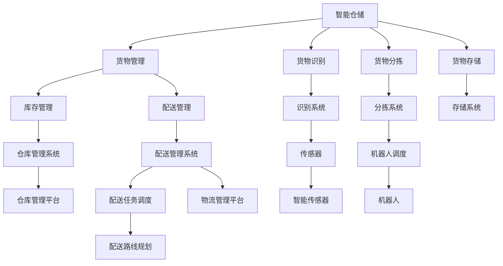

                 

# AI人工智能 Agent：在仓储物流中的应用

> 关键词：人工智能, 仓储物流, 智能仓储, 物流管理, 人工智能代理人, 机器人调度

## 1. 背景介绍

### 1.1 问题由来
随着电子商务的蓬勃发展，全球物流行业进入前所未有的繁荣期。根据联合国统计，全球电子商务市场在2020年超过4万亿美元，预计到2025年将达到10万亿美元。快速增长的订单数量和复杂的物流网络，给仓储物流企业带来了巨大的挑战。

1. 仓库内的货物管理和操作流程繁琐，容易出错。
2. 人工仓储成本高，效率低。
3. 物流跟踪不及时，信息孤岛现象严重。
4. 配送资源利用率低，配送路线规划不合理。

为了应对这些挑战，仓储物流企业亟需引入先进的AI技术，提升仓储管理的智能化水平，优化物流资源配置，实现物流链全过程的透明化和高效化。

### 1.2 问题核心关键点
智能仓储和智能物流的核心关键点在于通过AI技术实现仓储自动化和物流智能化。其核心思路如下：

1. **自动化仓储**：利用AI技术对货物进行自动识别、分类、分拣和存储，减少人工操作，提高仓储效率。
2. **物流规划**：通过AI技术进行配送路线规划、配送资源分配、配送任务调度，提升物流效率，降低配送成本。
3. **信息集成**：利用AI技术将仓储和物流信息进行全面整合，实现数据共享，打破信息孤岛现象，提高决策效率。

### 1.3 问题研究意义
AI技术在仓储物流中的应用，对于提升仓储物流的效率和降低运营成本，具有重要意义：

1. 提升仓储管理效率：通过智能仓储系统，可以实现货物快速出入库，减少人工干预，减少错误。
2. 优化物流配送路线：通过智能物流系统，可以实时计算最优配送路线，提升配送效率，降低配送成本。
3. 打破信息孤岛：通过AI技术将仓储和物流信息全面整合，可以实现信息共享，优化决策。
4. 提升客户满意度：通过AI技术对订单进行实时跟踪，及时响应客户需求，提升客户满意度。

## 2. 核心概念与联系

### 2.1 核心概念概述

为了更好地理解AI人工智能Agent在仓储物流中的应用，本节将介绍几个密切相关的核心概念：

1. **人工智能(Artificial Intelligence, AI)**：利用计算机模拟人类智能，实现语音识别、自然语言处理、图像识别、智能决策等功能。
2. **智能仓储**：通过AI技术对仓储全过程进行智能化管理，包括货物识别、分类、分拣、存储、出库等环节。
3. **智能物流**：通过AI技术对物流全过程进行智能化管理，包括配送路线规划、配送资源分配、配送任务调度等环节。
4. **人工智能Agent**：在AI系统中，Agent是一种自治的智能软件实体，能够感知环境，进行决策和执行任务，优化资源配置。
5. **机器人调度**：利用AI技术对仓库内的机器人进行调度，实现自动化的货物管理。
6. **自动化分拣系统**：利用AI技术对货物进行自动识别、分类和分拣，减少人工干预，提高分拣效率。
7. **仓储管理系统**：利用AI技术对仓储管理进行全面优化，包括货物管理、库存管理、配送管理等。
8. **配送管理平台**：利用AI技术对配送资源进行优化配置，实时计算最优配送路线，提升配送效率。

这些核心概念之间存在紧密的联系，形成了智能仓储和智能物流的完整生态系统。以下通过Mermaid流程图展示这些概念之间的关系：



这个流程图展示了智能仓储和智能物流的核心概念及其之间的关系：

1. 智能仓储系统通过货物识别、分拣、存储等技术实现货物管理。
2. 智能物流系统通过配送任务调度、路线规划等技术实现物流优化。
3. 智能仓储和物流管理系统通过AI技术实现信息整合和决策优化。
4. 机器人调度系统通过AI技术实现自动化货物管理。
5. 分拣系统通过AI技术实现自动识别和分拣，减少人工操作。

### 2.2 概念间的关系

这些核心概念之间存在着紧密的联系，形成了智能仓储和智能物流的完整生态系统。以下通过几个Mermaid流程图展示这些概念之间的关系。

#### 2.2.1 智能仓储和智能物流的关系

```mermaid
graph LR
    A[智能仓储] --> B[智能物流]
    A --> C[货物管理]
    A --> D[库存管理]
    A --> E[分拣系统]
    A --> F[存储系统]
    B --> G[配送任务调度]
    B --> H[配送路线规划]
    B --> I[物流管理平台]
    C --> J[智能传感器]
    D --> K[智能传感器]
    E --> L[智能传感器]
    F --> M[智能传感器]
    G --> N[机器人调度]
    H --> O[机器人调度]
    I --> P[物流管理平台]
    J --> Q[机器人]
    K --> R[机器人]
    L --> S[机器人]
    M --> T[机器人]
    N --> U[货物分拣]
    O --> V[货物分拣]
    P --> W[货物管理]
    Q --> X[货物存储]
    R --> Y[货物存储]
    S --> Z[货物存储]
    T --> $[货物存储]
    U --> [$[货物存储]
    V --> [$[货物存储]
    W --> [$[货物存储]
    X --> [$[货物存储]
    Y --> [$[货物存储]
    Z --> [$[货物存储]
    T --> [$[货物存储]
    U --> [$[货物存储]
    V --> [$[货物存储]
    W --> [$[货物存储]
    X --> [$[货物存储]
    Y --> [$[货物存储]
    Z --> [$[货物存储]
    T --> [$[货物存储]
    U --> [$[货物存储]
    V --> [$[货物存储]
    W --> [$[货物存储]
    X --> [$[货物存储]
    Y --> [$[货物存储]
    Z --> [$[货物存储]
    T --> [$[货物存储]
    U --> [$[货物存储]
    V --> [$[货物存储]
    W --> [$[货物存储]
    X --> [$[货物存储]
    Y --> [$[货物存储]
    Z --> [$[货物存储]
    T --> [$[货物存储]
    U --> [$[货物存储]
    V --> [$[货物存储]
    W --> [$[货物存储]
    X --> [$[货物存储]
    Y --> [$[货物存储]
    Z --> [$[货物存储]
    T --> [$[货物存储]
    U --> [$[货物存储]
    V --> [$[货物存储]
    W --> [$[货物存储]
    X --> [$[货物存储]
    Y --> [$[货物存储]
    Z --> [$[货物存储]
    T --> [$[货物存储]
    U --> [$[货物存储]
    V --> [$[货物存储]
    W --> [$[货物存储]
    X --> [$[货物存储]
    Y --> [$[货物存储]
    Z --> [$[货物存储]
    T --> [$[货物存储]
    U --> [$[货物存储]
    V --> [$[货物存储]
    W --> [$[货物存储]
    X --> [$[货物存储]
    Y --> [$[货物存储]
    Z --> [$[货物存储]
    T --> [$[货物存储]
    U --> [$[货物存储]
    V --> [$[货物存储]
    W --> [$[货物存储]
    X --> [$[货物存储]
    Y --> [$[货物存储]
    Z --> [$[货物存储]
    T --> [$[货物存储]
    U --> [$[货物存储]
    V --> [$[货物存储]
    W --> [$[货物存储]
    X --> [$[货物存储]
    Y --> [$[货物存储]
    Z --> [$[货物存储]
    T --> [$[货物存储]
    U --> [$[货物存储]
    V --> [$[货物存储]
    W --> [$[货物存储]
    X --> [$[货物存储]
    Y --> [$[货物存储]
    Z --> [$[货物存储]
    T --> [$[货物存储]
    U --> [$[货物存储]
    V --> [$[货物存储]
    W --> [$[货物存储]
    X --> [$[货物存储]
    Y --> [$[货物存储]
    Z --> [$[货物存储]
    T --> [$[货物存储]
    U --> [$[货物存储]
    V --> [$[货物存储]
    W --> [$[货物存储]
    X --> [$[货物存储]
    Y --> [$[货物存储]
    Z --> [$[货物存储]
    T --> [$[货物存储]
    U --> [$[货物存储]
    V --> [$[货物存储]
    W --> [$[货物存储]
    X --> [$[货物存储]
    Y --> [$[货物存储]
    Z --> [$[货物存储]
    T --> [$[货物存储]
    U --> [$[货物存储]
    V --> [$[货物存储]
    W --> [$[货物存储]
    X --> [$[货物存储]
    Y --> [$[货物存储]
    Z --> [$[货物存储]
    T --> [$[货物存储]
    U --> [$[货物存储]
    V --> [$[货物存储]
    W --> [$[货物存储]
    X --> [$[货物存储]
    Y --> [$[货物存储]
    Z --> [$[货物存储]
    T --> [$[货物存储]
    U --> [$[货物存储]
    V --> [$[货物存储]
    W --> [$[货物存储]
    X --> [$[货物存储]
    Y --> [$[货物存储]
    Z --> [$[货物存储]
    T --> [$[货物存储]
    U --> [$[货物存储]
    V --> [$[货物存储]
    W --> [$[货物存储]
    X --> [$[货物存储]
    Y --> [$[货物存储]
    Z --> [$[货物存储]
    T --> [$[货物存储]
    U --> [$[货物存储]
    V --> [$[货物存储]
    W --> [$[货物存储]
    X --> [$[货物存储]
    Y --> [$[货物存储]
    Z --> [$[货物存储]
    T --> [$[货物存储]
    U --> [$[货物存储]
    V --> [$[货物存储]
    W --> [$[货物存储]
    X --> [$[货物存储]
    Y --> [$[货物存储]
    Z --> [$[货物存储]
    T --> [$[货物存储]
    U --> [$[货物存储]
    V --> [$[货物存储]
    W --> [$[货物存储]
    X --> [$[货物存储]
    Y --> [$[货物存储]
    Z --> [$[货物存储]
    T --> [$[货物存储]
    U --> [$[货物存储]
    V --> [$[货物存储]
    W --> [$[货物存储]
    X --> [$[货物存储]
    Y --> [$[货物存储]
    Z --> [$[货物存储]
    T --> [$[货物存储]
    U --> [$[货物存储]
    V --> [$[货物存储]
    W --> [$[货物存储]
    X --> [$[货物存储]
    Y --> [$[货物存储]
    Z --> [$[货物存储]
    T --> [$[货物存储]
    U --> [$[货物存储]
    V --> [$[货物存储]
    W --> [$[货物存储]
    X --> [$[货物存储]
    Y --> [$[货物存储]
    Z --> [$[货物存储]
    T --> [$[货物存储]
    U --> [$[货物存储]
    V --> [$[货物存储]
    W --> [$[货物存储]
    X --> [$[货物存储]
    Y --> [$[货物存储]
    Z --> [$[货物存储]
    T --> [$[货物存储]
    U --> [$[货物存储]
    V --> [$[货物存储]
    W --> [$[货物存储]
    X --> [$[货物存储]
    Y --> [$[货物存储]
    Z --> [$[货物存储]
    T --> [$[货物存储]
    U --> [$[货物存储]
    V --> [$[货物存储]
    W --> [$[货物存储]
    X --> [$[货物存储]
    Y --> [$[货物存储]
    Z --> [$[货物存储]
    T --> [$[货物存储]
    U --> [$[货物存储]
    V --> [$[货物存储]
    W --> [$[货物存储]
    X --> [$[货物存储]
    Y --> [$[货物存储]
    Z --> [$[货物存储]
    T --> [$[货物存储]
    U --> [$[货物存储]
    V --> [$[货物存储]
    W --> [$[货物存储]
    X --> [$[货物存储]
    Y --> [$[货物存储]
    Z --> [$[货物存储]
    T --> [$[货物存储]
    U --> [$[货物存储]
    V --> [$[货物存储]
    W --> [$[货物存储]
    X --> [$[货物存储]
    Y --> [$[货物存储]
    Z --> [$[货物存储]
    T --> [$[货物存储]
    U --> [$[货物存储]
    V --> [$[货物存储]
    W --> [$[货物存储]
    X --> [$[货物存储]
    Y --> [$[货物存储]
    Z --> [$[货物存储]
    T --> [$[货物存储]
    U --> [$[货物存储]
    V --> [$[货物存储]
    W --> [$[货物存储]
    X --> [$[货物存储]
    Y --> [$[货物存储]
    Z --> [$[货物存储]
    T --> [$[货物存储]
    U --> [$[货物存储]
    V --> [$[货物存储]
    W --> [$[货物存储]
    X --> [$[货物存储]
    Y --> [$[货物存储]
    Z --> [$[货物存储]
    T --> [$[货物存储]
    U --> [$[货物存储]
    V --> [$[货物存储]
    W --> [$[货物存储]
    X --> [$[货物存储]
    Y --> [$[货物存储]
    Z --> [$[货物存储]
    T --> [$[货物存储]
    U --> [$[货物存储]
    V --> [$[货物存储]
    W --> [$[货物存储]
    X --> [$[货物存储]
    Y --> [$[货物存储]
    Z --> [$[货物存储]
    T --> [$[货物存储]
    U --> [$[货物存储]
    V --> [$[货物存储]
    W --> [$[货物存储]
    X --> [$[货物存储]
    Y --> [$[货物存储]
    Z --> [$[货物存储]
    T --> [$[货物存储]
    U --> [$[货物存储]
    V --> [$[货物存储]
    W --> [$[货物存储]
    X --> [$[货物存储]
    Y --> [$[货物存储]
    Z --> [$[货物存储]
    T --> [$[货物存储]
    U --> [$[货物存储]
    V --> [$[货物存储]
    W --> [$[货物存储]
    X --> [$[货物存储]
    Y --> [$[货物存储]
    Z --> [$[货物存储]
    T --> [$[货物存储]
    U --> [$[货物存储]
    V --> [$[货物存储]
    W --> [$[货物存储]
    X --> [$[货物存储]
    Y --> [$[货物存储]
    Z --> [$[货物存储]
    T --> [$[货物存储]
    U --> [$[货物存储]
    V --> [$[货物存储]
    W --> [$[货物存储]
    X --> [$[货物存储]
    Y --> [$[货物存储]
    Z --> [$[货物存储]
    T --> [$[货物存储]
    U --> [$[货物存储]
    V --> [$[货物存储]
    W --> [$[货物存储]
    X --> [$[货物存储]
    Y --> [$[货物存储]
    Z --> [$[货物存储]
    T --> [$[货物存储]
    U --> [$[货物存储]
    V --> [$[货物存储]
    W --> [$[货物存储]
    X --> [$[货物存储]
    Y --> [$[货物存储]
    Z --> [$[货物存储]
    T --> [$[货物存储]
    U --> [$[货物存储]
    V --> [$[货物存储]
    W --> [$[货物存储]
    X --> [$[货物存储]
    Y --> [$[货物存储]
    Z --> [$[货物存储]
    T --> [$[货物存储]
    U --> [$[货物存储]
    V --> [$[货物存储]
    W --> [$[货物存储]
    X --> [$[货物存储]
    Y --> [$[货物存储]
    Z --> [$[货物存储]
    T --> [$[货物存储]
    U --> [$[货物存储]
    V --> [$[货物存储]
    W --> [$[货物存储]
    X --> [$[货物存储]
    Y --> [$[货物存储]
    Z --> [$[货物存储]
    T --> [$[货物存储]
    U --> [$[货物存储]
    V --> [$[货物存储]
    W --> [$[货物存储]
    X --> [$[货物存储]
    Y --> [$[货物存储]
    Z --> [$[货物存储]
    T --> [$[货物存储]
    U --> [$[货物存储]
    V --> [$[货物存储]
    W --> [$[货物存储]
    X --> [$[货物存储]
    Y --> [$[货物存储]
    Z --> [$[货物存储]
    T --> [$[货物存储]
    U --> [$[货物存储]
    V --> [$[货物存储]
    W --> [$[货物存储]
    X --> [$[货物存储]
    Y --> [$[货物存储]
    Z --> [$[货物存储]
    T --> [$[货物存储]
    U --> [$[货物存储]
    V --> [$[货物存储]
    W --> [$[货物存储]
    X --> [$[货物存储]
    Y --> [$[货物存储]
    Z --> [$[货物存储]
    T --> [$[货物存储]
    U --> [$[货物存储]
    V --> [$[货物存储]
    W --> [$[货物存储]
    X --> [$[货物存储]
    Y --> [$[货物存储]
    Z --> [$[货物存储]
    T --> [$[货物存储]
    U --> [$[货物存储]
    V --> [$[货物存储]
    W --> [$[货物存储]
    X --> [$[货物存储]
    Y --> [$[货物存储]
    Z --> [$[货物存储]
    T --> [$[货物存储]
    U --> [$[货物存储]
    V --> [$[货物存储]
    W --> [$[货物存储]
    X --> [$[货物存储]
    Y --> [$[货物存储]
    Z --> [$[货物存储]
    T --> [$[货物存储]
    U --> [$[货物存储]
    V --> [$[货物存储]
    W --> [$[货物存储]
    X --> [$[货物存储]
    Y --> [$[货物存储]
    Z --> [$[货物存储]
    T --> [$[货物存储]
    U --> [$[货物存储]
    V --> [$[货物存储]
    W --> [$[货物存储]
    X --> [$[货物存储]
    Y --> [$[货物存储]
    Z --> [$[货物存储]
    T --> [$[货物存储]
    U --> [$[货物存储]
    V --> [$[货物存储]
    W --> [$[货物存储]
    X --> [$[货物存储]
    Y --> [$[货物存储]
    Z --> [$[货物存储]
    T --> [$[货物存储]
    U --> [$[货物存储]
    V --> [$[货物存储]
    W --> [$[货物存储]
    X --> [$[货物存储]
    Y --> [$[货物存储]
    Z --> [$[货物存储]
    T --> [$[货物存储]
    U --> [$[货物存储]
    V --> [$[货物存储]
    W --> [$[货物存储]
    X --> [$[货物存储]
    Y --> [$[货物存储]
    Z --> [$[货物存储]
    T --> [$[货物存储]
    U --> [$[货物存储]
    V --> [$[货物存储]
    W --> [$[货物存储]
    X --> [$[货物存储]
    Y --> [$[货物存储]
    Z --> [$[货物存储]
    T --> [$[货物存储]
    U --> [$[货物存储]
    V --> [$[货物存储]
    W --> [$[货物存储]
    X --> [$[货物存储]
    Y --> [$[货物存储]
    Z --> [$[货物存储]
    T --> [$[货物存储]
    U --> [$[货物存储]
    V --> [$[货物存储]
    W --> [$[货物存储]
    X --> [$[货物存储]
    Y --> [$[货物存储]
    Z --> [$[货物存储]
    T --> [$[货物存储]
    U --> [$[货物存储]
    V --> [$[货物存储]
    W --> [$[货物存储]
    X --> [$[货物存储]
    Y --> [$[货物存储]
    Z --> [$[货物存储]
    T --> [$[货物存储]
    U --> [$[货物存储]
    V --> [$[货物存储]
    W --> [$[货物存储]
    X --> [$[货物存储]
    Y --> [$[货物存储]
    Z --> [$[货物存储]
    T --> [$[货物存储]
    U --> [$[货物存储]
    V --> [$[货物存储]
    W --> [$[货物存储]
    X --> [$[货物存储]
    Y --> [$[货物存储]
    Z --> [$[货物存储]
    T --> [$[货物存储]
    U --> [$[货物存储]
    V --> [$[货物存储]
    W --> [$[货物存储]
    X --> [$[货物存储]
    Y --> [$[货物存储]
    Z --> [$[货物存储]
    T --> [$[货物存储]
    U --> [$[货物存储]
    V --> [$[货物存储]
    W --> [$[货物存储]
    X --> [$[货物存储]
    Y --> [$[货物存储]
    Z --> [$[货物存储]
    T --> [$[货物存储]
    U --> [$[货物存储]
    V --> [$[货物存储]
    W --> [$[货物存储]
    X --> [$[货物存储]
    Y --> [$[货物存储]
    Z --> [$[货物存储]
    T --> [$[货物存储]
    U --> [$[货物存储]
    V --> [$[货物存储]
    W --> [$[货物存储]
    X --> [$[货物存储]
    Y --> [$[货物存储]
    Z --> [$[货物存储]
    T --> [$[货物存储]
    U --> [$[货物存储]
    V --> [$[货物存储]
    W --> [$[货物存储]
    X --> [$[货物存储]
    Y --> [$[货物存储]
    Z --> [$[货物存储]
    T --> [$[货物存储]
    U --> [$[货物存储]
    V --> [$[货物存储]
    W --> [$[货物存储]
    X --> [$[货物存储]
    Y --> [$[货物存储]
    Z --> [$[货物存储]
    T --> [$[货物存储]
    U --> [$[货物存储]
    V --> [$[货物存储]
    W --> [$[货物存储]
    X --> [$[货物存储]
    Y --> [$[货物存储]
    Z --> [$[货物存储]
    T --> [$[货物存储]
    U --> [$[货物存储]
    V --> [$[货物存储]
    W --> [$[货物存储]
    X --> [$[货物存储]
    Y --> [$[货物存储]
    Z --> [$[货物存储]
    T --> [$[货物存储]
    U --> [$[货物存储]
    V --> [$[货物存储]
    W --> [$[货物存储]
    X --> [$[货物存储]
    Y --> [$[货物存储]
    Z --> [$[货物存储]
    T --> [$[货物存储]
    U --> [$[货物存储]
    V --> [$[货物存储]
    W --> [$[货物存储]
    X --> [$[货物存储]
    Y --> [$[货物存储]
    Z --> [$[货物存储]
    T --> [$[货物存储]
    U --> [$[货物存储]
    V --> [$[货物存储]
    W --> [$[货物存储]
    X --> [$[货物存储]
    Y --> [$[货物存储]
    Z --> [$[货物存储]
    T --> [$[货物存储]
    U --> [$[货物存储]
    V --> [$[货物存储]
    W --> [$[货物存储]
    X --> [$[货物存储]
    Y --> [$[货物存储]
    Z --> [$[货物存储]
    T --> [$[货物存储]
    U --> [$[货物存储]
    V --> [$[货物存储]
    W --> [$[货物存储]
    X --> [$[货物存储]
    Y --> [$[货物存储]
    Z --> [$[货物存储]
    T --> [$[货物存储]
    U --> [$[货物存储]
    V --> [$[货物存储]
    W --> [$[货物存储]
    X --> [$[货物存储]
    Y --> [$[货物存储]
    Z --> [$[货物存储]
    T --> [$[货物存储]
    U --> [$[货物存储]
    V --> [$[货物存储]
    W --> [$[货物存储]
    X --> [$[货物存储]
    Y --> [$[货物存储]
    Z --> [$[货物存储]
    T --> [$[货物存储]
    U --> [$[货物存储]
    V --> [$[货物存储]
    W --> [$[货物存储]
    X --> [$[货物存储]
    Y --> [$[货物存储]
    Z --> [$[货物存储]
    T --> [$[货物存储]
    U --> [$[货物存储]
    V --> [$[货物存储]
    W --> [$[货物存储]
    X --> [$[货物存储]
    Y --> [$[货物存储]
    Z --> [$[货物存储]
    T --> [$[货物存储]
    U -->

