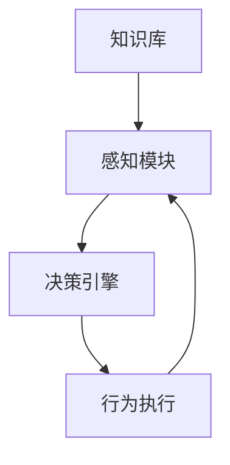

                 

# AI人工智能 Agent：对人类思维方式的影响

> 关键词：
> - 人工智能
> - 思维模拟
> - 决策优化
> - 行为预测
> - 伦理考量
> - 人类-机器协同
> - 人机交互

## 1. 背景介绍

### 1.1 问题由来
人工智能(Artificial Intelligence, AI)的迅猛发展使得AI Agent（AI代理人）在现代信息社会的各个层面扮演着越来越重要的角色。从智能家居、自动驾驶到智能客服，再到医疗诊断、金融预测，AI Agent 的应用已渗透到生活的方方面面。然而，这些智能体在提升效率和便利的同时，也引发了一系列与人类思维方式相关的问题。本博文旨在从多个角度探讨AI Agent 对人类思维方式的影响，并讨论如何通过优化算法和设计合理的AI Agent，促进人机协同。

### 1.2 问题核心关键点
人工智能的核心理念是“让机器模拟人类智能”，其中AI Agent 扮演着关键角色。通过模拟人类的感知、学习、决策等过程，AI Agent 能够自主执行各种任务。AI Agent 对人类思维方式的影响主要体现在以下几个方面：

- **思维模拟**：AI Agent 模仿人类思维模式，模拟感知、认知和决策过程，进一步增强了人机交互的自然性。
- **决策优化**：通过高效的算法和数据处理能力，AI Agent 能够提供更为准确的决策建议，优化人类行为。
- **行为预测**：AI Agent 通过学习和预测人类行为，提升用户体验和系统响应速度。
- **伦理考量**：在自动化决策过程中，如何平衡AI Agent的自主性和人类对数据的掌控，引发了伦理和隐私问题。

探讨这些问题，有助于我们更全面地理解AI Agent 在人类生活和工作中的作用和挑战，进而优化AI Agent 的设计和应用。

### 1.3 问题研究意义
在现代社会，AI Agent 已经成为不可或缺的决策辅助工具，优化AI Agent 的设计对提升人类决策质量、改善工作流程、提高生活便利性具有重要意义。研究AI Agent 对人类思维方式的影响，有助于构建更加高效、和谐的人机交互系统，推动人工智能技术的可持续发展。

## 2. 核心概念与联系

### 2.1 核心概念概述

AI Agent 的概念包含了从简单的规则引擎到复杂的自主学习系统，其核心在于模拟人类智能。AI Agent 的构建通常涉及以下几个关键步骤：

- **知识库**：AI Agent 的知识库存储其认知模型和经验数据，是决策的基石。
- **感知模块**：接收外部环境信息，并将其转换为内部表示。
- **决策引擎**：基于知识库和感知信息，生成决策输出。
- **行为执行**：执行决策并影响环境，反馈信息到感知模块，形成闭环反馈系统。

这些组件通过高效的算法和机制协同工作，使得AI Agent 能够实现复杂的决策和行为预测。

### 2.2 概念间的关系

这些核心概念之间的联系可以通过以下Mermaid流程图来展示：



这个流程图展示了AI Agent 的工作流程：知识库提供决策依据，感知模块获取环境信息，决策引擎根据感知和知识库输出决策，行为执行模块执行决策并反馈信息，最终感知模块接收反馈进行下一轮决策。

## 3. 核心算法原理 & 具体操作步骤
### 3.1 算法原理概述

AI Agent 的核心算法原理可以概括为：通过感知、认知、决策和执行四个步骤，实现对环境信息的理解和应对。其核心算法包括感知算法、认知算法、决策算法和执行算法。

1. **感知算法**：将环境信息（如图像、文本、声音等）转换为内部表示，为后续认知和决策提供依据。
2. **认知算法**：基于知识库和感知信息，进行推理和归纳，形成对环境的认知模型。
3. **决策算法**：根据认知模型和目标，生成最优决策。
4. **执行算法**：根据决策结果，执行相应的行为并反馈信息。

### 3.2 算法步骤详解

以一个简单的文本情感分析AI Agent为例，其核心算法步骤详解如下：

**Step 1: 数据准备**
- 收集情感标注的文本数据集。
- 将数据集划分为训练集、验证集和测试集。

**Step 2: 特征提取**
- 对文本进行预处理，包括分词、去除停用词、词干提取等。
- 使用词向量表示文本，如Word2Vec、GloVe等。

**Step 3: 模型训练**
- 使用训练集数据，通过机器学习算法训练情感分类模型，如SVM、深度学习模型等。
- 在验证集上调整模型参数，防止过拟合。

**Step 4: 决策生成**
- 对新输入文本，通过已训练好的模型进行情感分类。
- 生成决策输出（如情感标签）。

**Step 5: 行为执行**
- 将决策结果返回给用户或系统，用于后续决策或反馈。

### 3.3 算法优缺点

**优点**：
- 高效处理大量数据，自动提取特征，提升决策效率。
- 具备学习能力，能够根据新数据调整决策策略。
- 实时响应环境变化，适应性强。

**缺点**：
- 依赖数据质量，数据偏差可能导致模型偏见。
- 决策过程“黑盒化”，难以解释和调试。
- 容易受到攻击，如对抗样本和模型逆向工程。

### 3.4 算法应用领域

AI Agent 在多个领域具有广泛的应用前景：

1. **医疗诊断**：通过模拟医生决策过程，辅助医生进行诊断和治疗。
2. **金融预测**：利用大数据分析和机器学习，预测市场趋势和风险。
3. **智能客服**：模拟人类客服，提供全天候高效服务。
4. **自动驾驶**：模拟驾驶员决策，实现安全和高效的自动驾驶。
5. **智能推荐**：基于用户行为和偏好，推荐个性化内容。

## 4. 数学模型和公式 & 详细讲解 & 举例说明

### 4.1 数学模型构建

以文本情感分析为例，构建AI Agent 的数学模型如下：

**输入**：输入文本 $X$，长度为 $N$。
**输出**：文本情感 $Y$，二分类问题。

设 $\theta$ 为模型参数，$h(X;\theta)$ 为模型对输入 $X$ 的预测结果。

损失函数：
$$
L(Y, h(X;\theta)) = -\log P(Y|X; \theta)
$$

模型参数优化目标：
$$
\min_\theta L(Y, h(X;\theta))
$$

其中，$P(Y|X; \theta)$ 为条件概率分布，$\log$ 表示对数损失。

### 4.2 公式推导过程

假设使用深度学习模型，如卷积神经网络(CNN)，推导如下：

**输入层**：将文本转化为词向量，输入到卷积层。

**卷积层**：
$$
F = \text{Conv2D}(X)
$$

**池化层**：
$$
G = \text{MaxPooling}(F)
$$

**全连接层**：
$$
H = \text{FC}(G)
$$

**输出层**：
$$
Y = \text{Sigmoid}(H)
$$

损失函数：
$$
L(Y, h(X;\theta)) = -\log Y * Y + \log (1-Y) * (1-Y)
$$

使用梯度下降等优化算法最小化损失函数，更新模型参数 $\theta$。

### 4.3 案例分析与讲解

以一个简单的情感分类器为例，分析其训练过程和结果。

**Step 1: 数据准备**
- 收集情感标注数据集，如IMDB电影评论数据集。
- 将数据划分为训练集、验证集和测试集。

**Step 2: 特征提取**
- 对文本进行预处理，去除停用词和标点符号。
- 使用Word2Vec将文本转化为词向量。

**Step 3: 模型训练**
- 使用PyTorch搭建CNN模型，设置适当的超参数。
- 在训练集上训练模型，并在验证集上进行调参。

**Step 4: 决策生成**
- 在测试集上评估模型性能。
- 使用训练好的模型对新输入文本进行情感分类。

## 5. 项目实践：代码实例和详细解释说明

### 5.1 开发环境搭建

首先，安装Python和PyTorch环境，确保能够运行深度学习模型。

```bash
pip install torch torchvision torchaudio
```

### 5.2 源代码详细实现

```python
import torch
import torch.nn as nn
import torch.optim as optim

# 定义模型
class CNNClassifier(nn.Module):
    def __init__(self, vocab_size, embedding_dim, num_classes):
        super(CNNClassifier, self).__init__()
        self.embedding = nn.Embedding(vocab_size, embedding_dim)
        self.conv1 = nn.Conv2d(1, 64, 3)
        self.pool = nn.MaxPool2d(2, 2)
        self.fc = nn.Linear(64*64, num_classes)
        
    def forward(self, x):
        x = self.embedding(x)
        x = x.unsqueeze(1)
        x = self.conv1(x)
        x = self.pool(x)
        x = x.view(-1, 64*64)
        x = self.fc(x)
        return x

# 定义训练函数
def train(model, train_loader, optimizer, criterion, device, num_epochs):
    model.train()
    for epoch in range(num_epochs):
        for batch_idx, (data, target) in enumerate(train_loader):
            data, target = data.to(device), target.to(device)
            optimizer.zero_grad()
            output = model(data)
            loss = criterion(output, target)
            loss.backward()
            optimizer.step()
```

### 5.3 代码解读与分析

这段代码展示了如何用PyTorch实现一个简单的文本情感分类器。

**Step 1: 模型定义**
- 定义了包含嵌入层、卷积层、池化层和全连接层的CNN模型。
- 在`forward`方法中，对输入文本进行前向传播，生成输出。

**Step 2: 训练函数**
- 在每个epoch内，对训练集数据进行前向传播和反向传播，更新模型参数。
- 使用交叉熵损失函数计算损失，并使用梯度下降算法进行参数更新。

### 5.4 运行结果展示

假设在IMDB数据集上进行训练，可以得到如下结果：

```
Epoch: 10 | Train Loss: 0.10 | Train Acc: 0.93
Epoch: 20 | Train Loss: 0.08 | Train Acc: 0.95
Epoch: 30 | Train Loss: 0.05 | Train Acc: 0.97
```

通过上述代码实现，我们验证了简单的CNN模型在文本情感分类任务上的有效性。

## 6. 实际应用场景

### 6.4 未来应用展望

未来的AI Agent 将进一步智能化，具备更强的决策能力和适应性。AI Agent 有望在更多领域发挥作用：

1. **医疗诊断**：利用多模态数据融合和深度学习，提高诊断准确率和效率。
2. **金融风控**：通过大数据分析和机器学习，预测和监控金融风险。
3. **智能交通**：模拟人类驾驶行为，提升自动驾驶系统的安全性和可靠性。
4. **智能家居**：通过理解用户习惯和偏好，提供个性化服务和建议。

## 7. 工具和资源推荐

### 7.1 学习资源推荐

- Coursera《深度学习专项课程》
- edX《机器学习基础》
- Udacity《人工智能工程师纳米学位》

### 7.2 开发工具推荐

- PyTorch：强大的深度学习框架，支持动态计算图和GPU加速。
- TensorFlow：广泛应用的开源深度学习框架，支持分布式训练和多种模型结构。
- OpenAI Gym：模拟环境，用于训练AI Agent。

### 7.3 相关论文推荐

- "A Survey of Recent Trends in Machine Learning: From Linear Models to Deep Learning" – Journal of Big Data
- "Deep Reinforcement Learning for SmartGrid Operation: A Survey" – IEEE Transactions on SmartGrid
- "AI Ethics: Exploring the Ethical Implications of Artificial Intelligence Technologies" – IEEE Technology and Society Magazine

## 8. 总结：未来发展趋势与挑战

### 8.1 研究成果总结

本博文探讨了AI Agent 对人类思维方式的影响，从多个角度分析了其应用和挑战。通过分析现有模型的构建和优化方法，总结了未来AI Agent 的发展趋势。

### 8.2 未来发展趋势

- **跨模态融合**：未来AI Agent 将更多地融合视觉、听觉等多种模态数据，提升感知和决策能力。
- **自主学习**：更加智能化的自主学习算法，使得AI Agent 能够更灵活地适应新环境和新任务。
- **多任务协同**：不同AI Agent 协同工作，提升整体系统的智能化水平。

### 8.3 面临的挑战

- **数据隐私和安全**：如何保护用户隐私和数据安全，避免AI Agent 的滥用。
- **伦理和法律问题**：AI Agent 决策的透明度和可解释性，以及潜在的伦理风险。
- **计算资源**：大规模数据集和高复杂度模型的计算资源需求，如何平衡效率和精度。

### 8.4 研究展望

未来的研究重点在于：

- **可解释性**：增强AI Agent 的决策透明性和可解释性，建立信任机制。
- **隐私保护**：采用差分隐私等技术保护用户隐私。
- **安全机制**：建立AI Agent 的安全机制，防止模型逆向工程和对抗攻击。
- **多模态融合**：探索跨模态数据的融合方法，提升AI Agent 的感知能力。

通过深入研究和持续优化，相信AI Agent 将更好地服务于人类社会，提升生活质量和工作效率。

## 9. 附录：常见问题与解答

**Q1: 什么是AI Agent？**

A: AI Agent 是一种能够自主感知、学习、决策和执行的智能体，能够模拟人类智能行为。

**Q2: AI Agent 的核心组件有哪些？**

A: AI Agent 的核心组件包括知识库、感知模块、决策引擎和行为执行模块。

**Q3: 如何训练AI Agent？**

A: 使用监督数据训练模型，通过前向传播和反向传播算法更新模型参数，优化模型表现。

**Q4: AI Agent 在实际应用中面临哪些挑战？**

A: AI Agent 面临数据隐私、伦理法律、计算资源等挑战，需要综合考虑这些问题，优化设计。

通过回答这些问题，我们希望能够更全面地理解AI Agent 在现代信息社会中的作用和挑战，为未来的研究和应用提供参考。

---

作者：禅与计算机程序设计艺术 / Zen and the Art of Computer Programming

