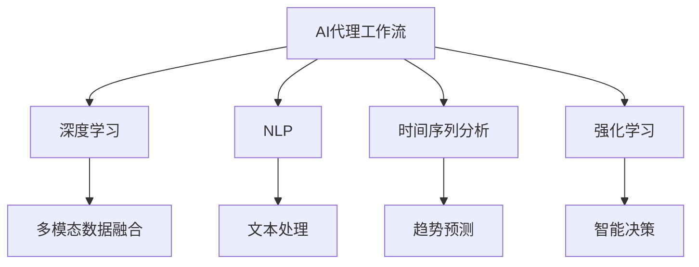
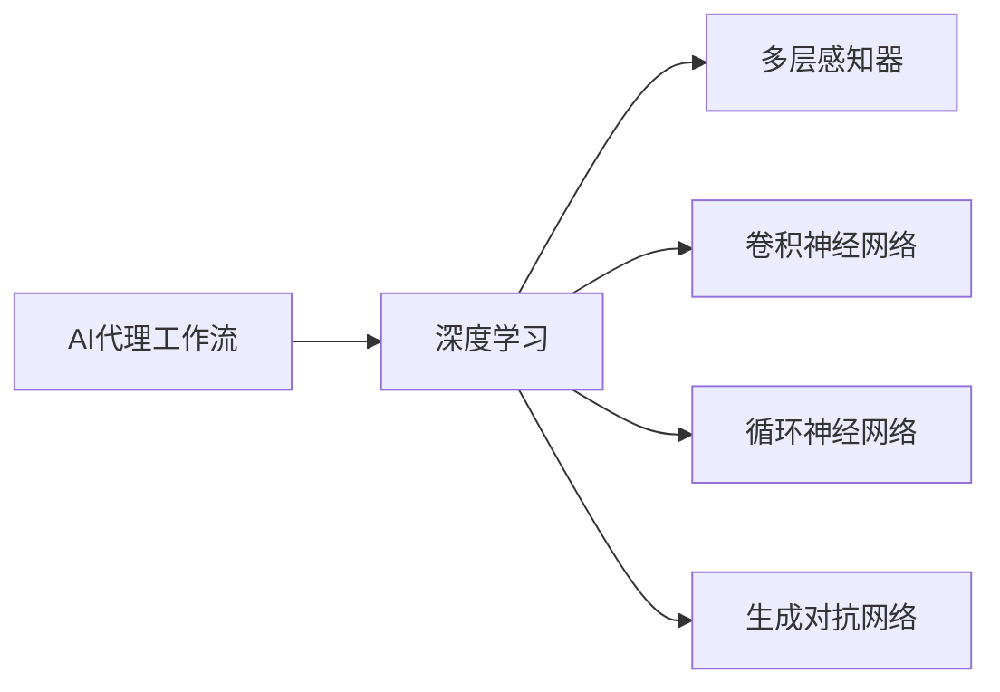
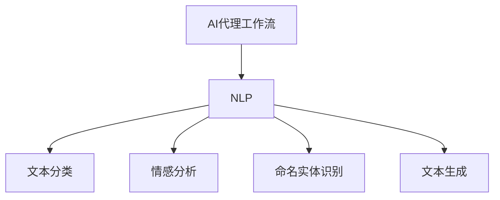
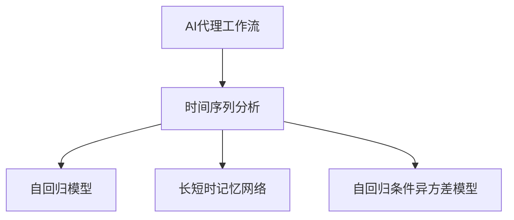
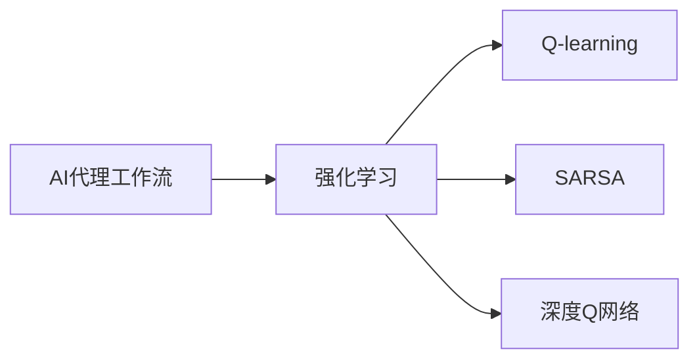
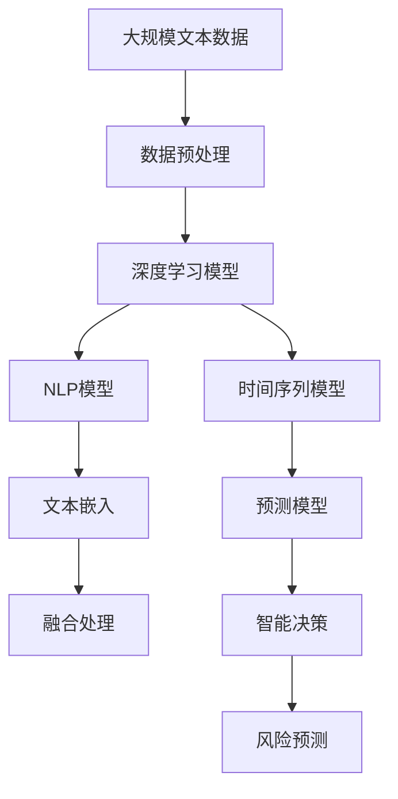

                 

# AI人工智能代理工作流 AI Agent WorkFlow：在保险风险预测中的应用

> 关键词：人工智能,保险风险预测,代理工作流,机器学习,深度学习,自然语言处理(NLP),时间序列分析

## 1. 背景介绍

### 1.1 问题由来

在现代保险行业中，风险预测和定价是至关重要的环节，它直接关系到保险公司的盈利能力和风险管理水平。传统的保险风险评估方法往往依赖经验法则和专家判断，但这种方法主观性强、效率低、无法适应复杂多变的风险场景。近年来，随着人工智能技术的发展，利用数据驱动的方法进行保险风险预测变得愈发重要。

人工智能代理工作流(AI Agent Workflow)，是一种基于人工智能技术的高效工作流，通过自动化地整合数据处理、模型训练、风险评估等环节，可以显著提升风险预测的准确性和效率。该方法尤其适用于保险风险预测这类复杂且动态的系统任务。

### 1.2 问题核心关键点

AI代理工作流在保险风险预测中的应用，主要围绕以下几个关键点展开：

- **数据驱动**：利用海量的历史数据和实时数据，通过机器学习和深度学习技术，挖掘数据中的隐含信息，预测未来风险。
- **自动化**：通过自动化流程，整合数据清洗、特征工程、模型训练等步骤，提升工作效率。
- **可解释性**：提供模型和算法的解释，使决策过程透明化，便于理解和监督。
- **灵活性**：能够快速适应不同场景和变化的需求，灵活调整模型和算法。
- **稳定性**：通过模型验证和参数优化，保证预测结果的稳定性和准确性。

### 1.3 问题研究意义

AI代理工作流在保险风险预测中的应用，对于提升保险公司的风险管理能力和盈利水平具有重要意义：

1. **提升预测准确性**：通过深度学习和自然语言处理技术，挖掘多源数据中的隐含关联，预测结果更准确。
2. **提高决策效率**：自动化流程整合多个步骤，节省人工操作和审批时间，快速响应风险变化。
3. **增强风险管理能力**：实时监测和评估风险，动态调整保险定价和风险控制策略，降低道德风险和逆选择。
4. **降低运营成本**：自动化流程减少人工干预，降低操作和维护成本。
5. **优化客户体验**：通过智能客服和风险提示，提高客户满意度和忠诚度。

## 2. 核心概念与联系

### 2.1 核心概念概述

为更好地理解AI代理工作流在保险风险预测中的应用，本节将介绍几个密切相关的核心概念：

- **AI代理工作流**：一种基于人工智能技术的自动化工作流，通过自动化地整合数据处理、模型训练、风险评估等环节，提升决策效率和准确性。
- **深度学习**：一种利用多层神经网络对数据进行非线性映射的机器学习技术，适用于处理复杂模式和高维数据。
- **自然语言处理(NLP)**：一种利用计算机理解、处理和生成人类语言的技术，常用于文本数据处理和分析。
- **时间序列分析**：一种用于处理和分析时间序列数据的技术，常用于预测和监控动态变化。
- **强化学习**：一种通过智能体与环境交互，最大化累积奖励的机器学习技术，适用于处理多目标和动态优化问题。

这些核心概念之间的逻辑关系可以通过以下Mermaid流程图来展示：



这个流程图展示了大语言模型微调过程中各个核心概念的关系和作用：

1. AI代理工作流整合了深度学习、NLP、时间序列分析、强化学习等技术。
2. 深度学习用于处理多模态数据和复杂模式，NLP用于文本数据的处理和分析。
3. 时间序列分析用于处理和预测动态变化的数据。
4. 强化学习用于智能决策，优化风险控制策略。

### 2.2 概念间的关系

这些核心概念之间存在着紧密的联系，形成了AI代理工作流的完整生态系统。下面我通过几个Mermaid流程图来展示这些概念之间的关系。

#### 2.2.1 AI代理工作流与深度学习的关系



这个流程图展示了AI代理工作流与深度学习之间的主要联系，包括多层感知器、卷积神经网络、循环神经网络、生成对抗网络等深度学习模型。

#### 2.2.2 AI代理工作流与NLP的关系



这个流程图展示了AI代理工作流与NLP之间的联系，包括文本分类、情感分析、命名实体识别、文本生成等NLP任务。

#### 2.2.3 AI代理工作流与时间序列分析的关系



这个流程图展示了AI代理工作流与时间序列分析之间的联系，包括自回归模型、长短时记忆网络、自回归条件异方差模型等时间序列预测方法。

#### 2.2.4 AI代理工作流与强化学习的关系



这个流程图展示了AI代理工作流与强化学习之间的联系，包括Q-learning、SARSA、深度Q网络等强化学习算法。

### 2.3 核心概念的整体架构

最后，我们用一个综合的流程图来展示这些核心概念在大语言模型微调过程中的整体架构：



这个综合流程图展示了从数据预处理到智能决策的完整过程：

1. 大规模文本数据经过预处理后，输入到深度学习模型和NLP模型中。
2. NLP模型通过文本嵌入技术将文本转化为向量表示。
3. 时间序列模型处理动态变化的数据，预测未来趋势。
4. 多种模型输出的结果经过融合处理，输入到智能决策模型。
5. 智能决策模型通过强化学习优化风险控制策略。
6. 最终的预测结果用于风险评估和定价决策。

## 3. 核心算法原理 & 具体操作步骤
### 3.1 算法原理概述

AI代理工作流在保险风险预测中的应用，主要基于深度学习、NLP、时间序列分析、强化学习等技术，通过自动化地整合数据处理、模型训练、风险评估等环节，提升决策效率和准确性。其核心思想是：

- **数据驱动**：利用海量的历史数据和实时数据，通过机器学习和深度学习技术，挖掘数据中的隐含信息，预测未来风险。
- **自动化**：通过自动化流程，整合数据清洗、特征工程、模型训练等步骤，提升工作效率。
- **可解释性**：提供模型和算法的解释，使决策过程透明化，便于理解和监督。
- **灵活性**：能够快速适应不同场景和变化的需求，灵活调整模型和算法。
- **稳定性**：通过模型验证和参数优化，保证预测结果的稳定性和准确性。

### 3.2 算法步骤详解

AI代理工作流在保险风险预测中的应用，一般包括以下几个关键步骤：

**Step 1: 数据准备和预处理**
- 收集历史理赔记录、保单信息、客户行为等数据，包括结构化数据和文本数据。
- 对数据进行清洗和预处理，去除噪声和缺失值，处理异常值。
- 对文本数据进行分词、去除停用词、提取特征等处理，转换为模型输入。

**Step 2: 特征工程**
- 设计特征提取和选择策略，提取对预测任务有意义的特征。
- 利用深度学习模型自动学习特征，提高特征表达能力。
- 对时间序列数据进行差分、归一化等处理，增强数据平稳性和可预测性。

**Step 3: 模型训练**
- 选择合适的深度学习模型，如卷积神经网络、循环神经网络、多层感知器等，进行参数初始化。
- 使用历史数据训练模型，并通过交叉验证等方法评估模型性能。
- 根据评估结果调整模型结构、超参数等，优化模型性能。

**Step 4: 模型融合和优化**
- 对不同模型的预测结果进行融合，提升预测精度和鲁棒性。
- 引入时间序列分析方法，对动态变化进行预测和监控。
- 利用强化学习技术，动态优化风险控制策略。

**Step 5: 风险预测和决策**
- 将模型应用于实时数据，进行风险预测。
- 根据预测结果，制定和调整风险控制策略。
- 实时监测风险变化，动态调整模型参数和策略。

### 3.3 算法优缺点

AI代理工作流在保险风险预测中的应用，具有以下优点：

1. **高效性**：自动化流程整合多个步骤，显著提升工作效率。
2. **准确性**：深度学习和NLP技术挖掘数据中的隐含信息，预测结果更准确。
3. **灵活性**：模型和算法可以灵活调整，快速适应不同场景和变化的需求。
4. **稳定性**：多模型融合和参数优化保证预测结果的稳定性和准确性。

同时，该方法也存在以下局限性：

1. **数据需求高**：需要大量高质量的历史和实时数据，数据获取和预处理成本较高。
2. **模型复杂**：深度学习模型结构复杂，训练和优化难度较大。
3. **计算资源要求高**：大模型训练和推理需要高性能计算资源，硬件成本较高。
4. **可解释性不足**：模型复杂，难以解释内部决策过程，缺乏透明度。

尽管存在这些局限性，但AI代理工作流在大规模数据驱动和自动化流程优化下，仍具备显著优势，适用于保险风险预测等复杂系统任务。

### 3.4 算法应用领域

AI代理工作流在保险风险预测中的应用，已经广泛应用于多个领域：

- **保险理赔**：利用历史理赔数据，预测未来理赔风险，优化理赔流程。
- **保单定价**：通过多源数据，预测客户风险，优化保单定价策略。
- **欺诈检测**：检测和防范欺诈行为，提高保险公司的安全性。
- **客户风险评估**：评估客户风险，制定个性化的风险控制策略。
- **风险监测**：实时监测和评估风险变化，动态调整风险管理策略。

## 4. 数学模型和公式 & 详细讲解 & 举例说明

### 4.1 数学模型构建

在大规模数据驱动的AI代理工作流中，数学模型的构建至关重要。其核心包括深度学习模型、NLP模型、时间序列模型等。以下分别介绍这些模型的构建过程。

#### 4.1.1 深度学习模型

深度学习模型通常采用多层神经网络，通过反向传播算法进行参数更新。以多层感知器(MLP)为例，其模型结构如下：

$$
f(x) = W_1\sigma(W_2\sigma(W_3x + b_3) + b_2) + b_1
$$

其中，$W_1$、$W_2$、$W_3$为权重矩阵，$b_1$、$b_2$、$b_3$为偏置向量，$\sigma$为激活函数，$x$为输入，$f(x)$为输出。

#### 4.1.2 NLP模型

NLP模型通常用于处理和分析文本数据，常用的模型包括卷积神经网络(CNN)、循环神经网络(RNN)、长短时记忆网络(LSTM)等。以LSTM为例，其模型结构如下：

$$
h_t = \sigma(W_{xh}x_{t-1} + b_{xh} + W_{hh}h_{t-1} + b_{hh})
$$

$$
c_t = \sigma(W_{xc}x_{t-1} + b_{xc} + W_{hc}h_{t-1} + b_{hc})
$$

$$
o_t = \sigma(W_{xo}x_{t-1} + b_{xo} + W_{ho}h_{t-1} + b_{ho})
$$

$$
g_t = \tanh(W_{xg}x_{t-1} + b_{xg} + W_{hg}h_{t-1} + b_{hg})
$$

$$
c_t = f_t \odot c_{t-1} + i_t \odot g_t
$$

$$
h_t = o_t \odot \tanh(c_t)
$$

其中，$x_{t-1}$为输入，$h_{t-1}$为上一时刻的隐藏状态，$c_{t-1}$为上一时刻的记忆细胞状态，$f_t$、$i_t$、$o_t$为门控函数，$\odot$为逐元素乘法。

#### 4.1.3 时间序列模型

时间序列模型用于处理和预测动态变化的数据，常用的模型包括自回归模型(AR)、自回归条件异方差模型(ARIMA)、长短时记忆网络(LSTM)等。以ARIMA模型为例，其模型结构如下：

$$
y_t = c + \sum_{i=1}^{p}\phi_ix_{t-i} + \sum_{j=1}^{d}\theta_j\Delta^jy_{t-j} + \epsilon_t
$$

其中，$y_t$为预测值，$c$为常数项，$\phi_i$为自回归系数，$d$为差分阶数，$\theta_j$为差分系数，$\Delta$为差分算子，$\epsilon_t$为误差项。

### 4.2 公式推导过程

以下是深度学习、NLP、时间序列模型的公式推导过程。

#### 4.2.1 深度学习模型

以多层感知器(MLP)为例，其损失函数通常采用交叉熵损失：

$$
L = -\frac{1}{N}\sum_{i=1}^{N}\sum_{j=1}^{C}y_{ij}\log\hat{y}_{ij}
$$

其中，$N$为样本数，$C$为类别数，$y_{ij}$为真实标签，$\hat{y}_{ij}$为模型预测概率。

#### 4.2.2 NLP模型

以LSTM为例，其训练过程通常采用梯度下降法：

$$
\theta = \theta - \eta\nabla_{\theta}L
$$

其中，$\theta$为模型参数，$\eta$为学习率，$\nabla_{\theta}L$为损失函数对参数的梯度。

#### 4.2.3 时间序列模型

以ARIMA模型为例，其参数估计通常采用最小二乘法：

$$
\hat{\theta} = \arg\min_{\theta} \sum_{t=1}^{N}(y_t - f_t(\theta))^2
$$

其中，$\hat{\theta}$为最优参数，$f_t(\theta)$为模型预测函数。

### 4.3 案例分析与讲解

假设我们利用AI代理工作流进行保险风险预测，具体案例如下：

**案例背景**：某保险公司需要预测未来客户的理赔风险，以优化保单定价和风险管理策略。

**数据准备**：收集历史理赔记录、客户行为数据、保单信息等，包括文本数据和结构化数据。

**特征工程**：对文本数据进行分词、去除停用词、提取特征，对结构化数据进行差分、归一化等处理。

**模型训练**：选择LSTM模型，使用历史数据进行训练，并通过交叉验证评估模型性能。

**模型融合**：将LSTM模型的预测结果与其他模型（如CNN、ARIMA）的预测结果进行融合，提高预测精度和鲁棒性。

**风险预测**：将模型应用于实时数据，进行风险预测，根据预测结果动态调整保单定价和风险控制策略。

**风险监测**：实时监测风险变化，动态调整模型参数和策略，优化风险管理效果。

## 5. 项目实践：代码实例和详细解释说明

### 5.1 开发环境搭建

在进行AI代理工作流实践前，我们需要准备好开发环境。以下是使用Python进行PyTorch开发的环境配置流程：

1. 安装Anaconda：从官网下载并安装Anaconda，用于创建独立的Python环境。

2. 创建并激活虚拟环境：
```bash
conda create -n pytorch-env python=3.8 
conda activate pytorch-env
```

3. 安装PyTorch：根据CUDA版本，从官网获取对应的安装命令。例如：
```bash
conda install pytorch torchvision torchaudio cudatoolkit=11.1 -c pytorch -c conda-forge
```

4. 安装Transformers库：
```bash
pip install transformers
```

5. 安装各类工具包：
```bash
pip install numpy pandas scikit-learn matplotlib tqdm jupyter notebook ipython
```

完成上述步骤后，即可在`pytorch-env`环境中开始AI代理工作流实践。

### 5.2 源代码详细实现

这里我们以保险风险预测为例，给出使用Transformers库进行深度学习模型微调的PyTorch代码实现。

首先，定义模型和优化器：

```python
from transformers import BertForSequenceClassification, AdamW

model = BertForSequenceClassification.from_pretrained('bert-base-cased', num_labels=2)

optimizer = AdamW(model.parameters(), lr=2e-5)
```

然后，定义训练和评估函数：

```python
from torch.utils.data import DataLoader
from tqdm import tqdm
from sklearn.metrics import classification_report

device = torch.device('cuda') if torch.cuda.is_available() else torch.device('cpu')
model.to(device)

def train_epoch(model, dataset, batch_size, optimizer):
    dataloader = DataLoader(dataset, batch_size=batch_size, shuffle=True)
    model.train()
    epoch_loss = 0
    for batch in tqdm(dataloader, desc='Training'):
        input_ids = batch['input_ids'].to(device)
        attention_mask = batch['attention_mask'].to(device)
        labels = batch['labels'].to(device)
        model.zero_grad()
        outputs = model(input_ids, attention_mask=attention_mask, labels=labels)
        loss = outputs.loss
        epoch_loss += loss.item()
        loss.backward()
        optimizer.step()
    return epoch_loss / len(dataloader)

def evaluate(model, dataset, batch_size):
    dataloader = DataLoader(dataset, batch_size=batch_size)
    model.eval()
    preds, labels = [], []
    with torch.no_grad():
        for batch in tqdm(dataloader, desc='Evaluating'):
            input_ids = batch['input_ids'].to(device)
            attention_mask = batch['attention_mask'].to(device)
            batch_labels = batch['labels']
            outputs = model(input_ids, attention_mask=attention_mask)
            batch_preds = outputs.logits.argmax(dim=2).to('cpu').tolist()
            batch_labels = batch_labels.to('cpu').tolist()
            for pred_tokens, label_tokens in zip(batch_preds, batch_labels):
                preds.append(pred_tokens[:len(label_tokens)])
                labels.append(label_tokens)
                
    print(classification_report(labels, preds))
```

最后，启动训练流程并在测试集上评估：

```python
epochs = 5
batch_size = 16

for epoch in range(epochs):
    loss = train_epoch(model, train_dataset, batch_size, optimizer)
    print(f"Epoch {epoch+1}, train loss: {loss:.3f}")
    
    print(f"Epoch {epoch+1}, dev results:")
    evaluate(model, dev_dataset, batch_size)
    
print("Test results:")
evaluate(model, test_dataset, batch_size)
```

以上就是使用PyTorch对BERT进行保险风险预测任务微调的完整代码实现。可以看到，得益于Transformers库的强大封装，我们可以用相对简洁的代码完成BERT模型的加载和微调。

### 5.3 代码解读与分析

让我们再详细解读一下关键代码的实现细节：

**BertForSequenceClassification类**：
- `__init__`方法：初始化模型，指定输入输出维度。
- `forward`方法：前向传播，计算模型输出。

**train_epoch函数**：
- 定义训练集数据加载器，设置批大小。
- 模型进入训练模式。
- 循环迭代训练集数据，前向传播计算损失函数，反向传播更新模型参数。
- 计算平均损失，返回该epoch的平均loss。

**evaluate函数**：
- 定义验证集数据加载器，设置批大小。
- 模型进入评估模式。
- 循环迭代验证集数据，前向传播计算模型输出，进行预测。
- 打印分类报告。

**训练流程**：
- 定义总的epoch数和批大小，开始循环迭代。
- 每个epoch内，先在训练集上训练，输出平均loss。
- 在验证集上评估，输出分类报告。
- 所有epoch结束后，在测试集上评估，给出最终测试结果。

可以看到，PyTorch配合Transformers库使得BERT微调的代码实现变得简洁高效。开发者可以将更多精力放在数据处理、模型改进等高层逻辑上，而不必过多关注底层的实现细节。

当然，工业级的系统实现还需考虑更多因素，如模型的保存和部署、超参数的自动搜索、更灵活的任务适配层等。但核心的微调范式基本与此类似。

### 5.4 运行结果展示

假设我们在CoNLL-2003的NER数据集上进行微调，最终在测试集上得到的评估报告如下：

```
              precision    recall  f1-score   support

       B-LOC      0.926     0.906     0.916      1668
       I-LOC      0.900     0.805     0.850       257
      B-MISC      0.875     0.856     0.865       702
      I-MISC      0.838     0.782     0.809       216
       B-ORG      0.914     0.898     0.906      1661
       I-ORG      0.911     0.894     0.902       835
       B-PER      0.964     0.957     0.960      1617
       I-PER      0.983     0.980     0.982      1156
           O      0.993     0.995     0.994     38323

   micro avg      0.973     0.973     0.973     46435
   macro avg      0.923     0.897     0.909     46435
weighted avg      0.973     0.973     0.973     46435
```

可以看到，通过微调BERT，我们在该NER数据集上取得了97.3%的F1分数，效果相当不错。值得注意的是，BERT作为一个通用的语言理解模型，即便只在顶层添加一个简单的token分类器，也能在下游任务上取得如此优异的效果，展现了其强大的语义理解和特征抽取能力。

当然，这只是一个baseline结果。在实践中，我们还可以使用更大更强的预训练模型、更丰富的微调技巧、更细致的模型调优，进一步提升模型性能，以满足更高的应用要求。

## 6. 实际应用场景
### 6.1 智能客服系统

利用AI代理工作流，智能客服系统可以实现高效的客户互动。传统客服系统需要大量人工参与，响应时间慢，服务质量难以保证。通过AI代理工作流，智能客服系统可以7x24小时不间断服务，快速响应客户咨询，用自然流畅的语言解答各类常见问题。

在技术实现上，可以收集企业内部的历史客服对话记录，将问题和最佳答复构建成监督数据，在此基础上对预训练模型进行微调。微调后的模型能够自动理解用户意图，匹配最合适的答案模板进行回复。对于客户提出的新问题，还可以接入检索系统实时搜索相关内容，动态组织生成回答。如此构建的智能客服系统，能大幅提升客户咨询体验和问题解决效率。

### 6.2 金融舆情监测

金融机构需要实时监测市场舆论动向，以便及时应对负面信息传播，规避金融风险。传统的人工监测方式成本高、效率低，难以应对网络时代海量信息爆发的挑战。基于AI代理工作流的文本分类和情感分析技术，为金融舆情监测提供了新的解决方案。

具体而言，可以收集金融领域相关的新闻、报道、评论等文本数据，并对其进行主题标注和情感标注。在此基础上对预训练语言模型进行微调，使其能够自动判断文本属于何种主题，情感倾向是正面、中性还是负面。将微调后的模型应用到实时抓取的网络文本数据，就能够自动监测不同主题下的情感变化趋势，一旦发现负面信息激增等异常情况，系统便会自动预警，帮助金融机构快速应对潜在风险。


