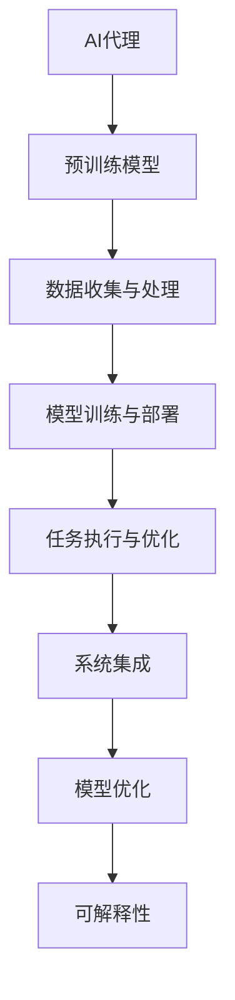
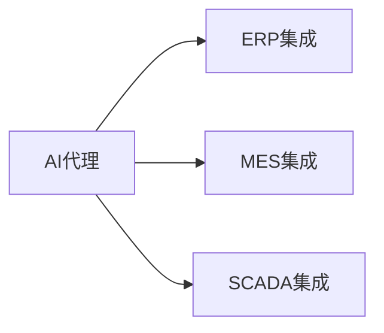
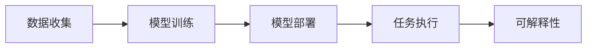
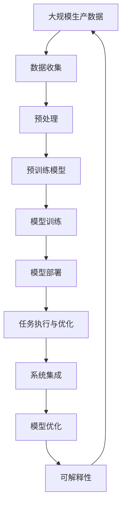

                 

# AI人工智能代理工作流 AI Agent WorkFlow：在工业制造中的应用

## 1. 背景介绍

### 1.1 问题由来
随着人工智能技术的发展，各行各业开始越来越多地使用智能系统来提升效率和自动化水平。在工业制造领域，人工参与的工作流程、质量检查、设备维护等环节逐渐被智能系统所取代。AI人工智能代理（AI Agent）正是在这一背景下应运而生，成为推动制造行业智能化转型的重要工具。

人工智能代理是具备自主决策能力的软件实体，能够通过收集和分析数据，自主执行任务、优化决策、生成报告，进而提高生产效率和质量，降低运营成本。近年来，随着工业物联网（IIoT）技术的发展，AI代理已经开始被广泛应用于生产过程管理、设备状态监测、质量检测等环节，大大提高了制造过程的智能化水平。

### 1.2 问题核心关键点
AI代理的核心在于其自主学习与决策能力。具体来说，AI代理通过预训练模型（如RNN、CNN、Transformer等）和后端优化算法，结合实时数据和反馈，自主执行复杂任务，如生产计划调度、设备维护预测、质量检测等。

AI代理的应用需要解决以下核心问题：

- 数据收集与处理：如何高效、可靠地从不同来源收集生产数据，并进行预处理和清洗。
- 模型训练与部署：如何通过预训练模型和数据，训练AI代理，并高效部署到生产环境中。
- 任务执行与优化：如何在复杂的工业场景中，AI代理能够自主执行任务，并在运行过程中不断优化决策。
- 系统集成与互操作：如何将AI代理与其他系统（如ERP、MES、SCADA等）集成，实现数据的互联互通。

### 1.3 问题研究意义
在工业制造中应用AI代理，具有以下几个重要意义：

1. **提升生产效率**：AI代理能够自动调度生产计划，优化生产流程，减少人工干预，提高生产效率。
2. **提高设备利用率**：通过实时监测设备状态，AI代理能够提前预测设备故障，降低停机时间，提高设备利用率。
3. **提升产品质量**：AI代理能够实时分析生产数据，及时发现产品质量问题，降低废品率，提高产品一致性。
4. **降低运营成本**：AI代理通过优化资源分配和过程控制，减少能源消耗和物料浪费，降低运营成本。
5. **增强灵活性**：AI代理能够快速适应生产线的变化和调整，提高企业的灵活性和市场响应速度。

## 2. 核心概念与联系

### 2.1 核心概念概述

为了更好地理解AI代理在工业制造中的应用，本节将介绍几个密切相关的核心概念：

- **AI代理**：具备自主决策能力的软件实体，能够通过收集和分析数据，自主执行任务、优化决策、生成报告，进而提高生产效率和质量，降低运营成本。
- **预训练模型**：在大规模数据集上训练好的模型，如RNN、CNN、Transformer等，用于提取数据特征和进行任务预测。
- **强化学习**：通过与环境的交互，AI代理不断优化决策策略，提升执行任务的效率和效果。
- **模型优化**：通过训练后的模型调整和参数微调，提高模型的预测准确性和泛化能力。
- **系统集成**：将AI代理与其他系统（如ERP、MES、SCADA等）集成，实现数据的互联互通，形成一体化智能制造平台。
- **可解释性**：确保AI代理的决策过程和结果具有可解释性，提升系统透明度和可信度。

这些核心概念之间的逻辑关系可以通过以下Mermaid流程图来展示：



这个流程图展示出AI代理在工业制造中的应用流程：首先通过预训练模型提取数据特征，然后进行数据收集和处理，接着训练和部署AI代理，并在生产过程中执行任务并进行优化，最后与其他系统集成，形成一体化智能制造平台。同时，AI代理的决策过程需要具备可解释性，确保系统的透明度和可信度。

### 2.2 概念间的关系

这些核心概念之间存在着紧密的联系，形成了AI代理在工业制造中的应用框架。下面我们通过几个Mermaid流程图来展示这些概念之间的关系。

#### 2.2.1 AI代理的任务执行流程


这个流程图展示出AI代理在执行任务时的基本流程：首先从不同来源收集数据，然后进行预处理和清洗，接着使用预训练模型进行训练，并将模型部署到生产环境中执行任务。任务执行后，AI代理根据反馈进行优化。

#### 2.2.2 系统集成的关键环节



这个流程图展示了AI代理与其他系统集成的关键环节：AI代理需要与企业的ERP、MES、SCADA等系统进行集成，实现数据的互联互通，形成一体化的智能制造平台。

#### 2.2.3 可解释性的重要性



这个流程图强调了可解释性在AI代理应用中的重要性：AI代理的决策过程需要具备可解释性，以提高系统的透明度和可信度，便于企业进行管理和优化。

### 2.3 核心概念的整体架构

最后，我们用一个综合的流程图来展示这些核心概念在大语言模型微调过程中的整体架构：



这个综合流程图展示了从数据收集到模型部署，再到任务执行、系统集成和模型优化的完整流程。AI代理通过数据驱动的预训练模型，结合强化学习等优化策略，实现自主决策和任务执行。同时，AI代理需要具备可解释性，确保其决策过程和结果的可理解性和可信度。

## 3. 核心算法原理 & 具体操作步骤
### 3.1 算法原理概述

AI代理在工业制造中的应用，主要依赖于预训练模型、强化学习、模型优化等核心算法。预训练模型用于提取数据特征，强化学习用于优化决策策略，模型优化用于提升模型的预测准确性和泛化能力。

具体来说，AI代理通过以下步骤实现任务执行和优化：

1. **数据收集与处理**：通过传感器、监控设备、生产记录等手段，收集生产过程中的各种数据，并进行预处理和清洗。
2. **预训练模型训练**：使用大规模数据集对预训练模型进行训练，提取数据中的特征。
3. **模型部署与执行**：将训练好的模型部署到生产环境中，并结合实时数据，执行任务和优化决策。
4. **强化学习优化**：通过与环境的交互，AI代理不断优化决策策略，提升执行任务的效率和效果。
5. **模型优化**：通过训练后的模型调整和参数微调，提高模型的预测准确性和泛化能力。

### 3.2 算法步骤详解

以下将详细介绍AI代理在工业制造中的应用流程及其详细步骤。

**Step 1: 数据收集与预处理**

首先，AI代理需要从不同来源收集生产数据。常用的数据源包括传感器数据、监控设备数据、生产记录、质量检测报告等。数据收集后，需要进行预处理和清洗，去除噪声和不完整数据，确保数据的准确性和一致性。

```python
# 数据收集
data = collect_data_from_sensors()
data = clean_data(data)
```

**Step 2: 预训练模型训练**

使用大规模数据集对预训练模型进行训练，提取数据中的特征。训练过程需要选择合适的模型结构、损失函数和优化器，以提高模型的预测准确性。

```python
# 选择预训练模型和优化器
model = choose_pretrained_model()
optimizer = choose_optimizer()
loss_fn = choose_loss_function()

# 数据划分和训练
train_data, val_data, test_data = split_data(data)
model.train()
for epoch in range(num_epochs):
    for batch in train_data:
        # 前向传播和损失计算
        outputs = model(batch)
        loss = loss_fn(outputs, labels)
        # 反向传播和参数更新
        optimizer.zero_grad()
        loss.backward()
        optimizer.step()
```

**Step 3: 模型部署与任务执行**

将训练好的模型部署到生产环境中，并结合实时数据，执行任务和优化决策。任务执行过程中，AI代理需要不断调整模型参数，以应对生产环境的变化和干扰。

```python
# 模型部署
model = deploy_model()

# 任务执行
while True:
    # 数据输入和模型推理
    input_data = get_real_time_data()
    outputs = model(input_data)
    # 任务执行和反馈优化
    if outputs > threshold:
        execute_task()
    else:
        update_parameters(model, optimizer, inputs)
```

**Step 4: 强化学习优化**

通过与环境的交互，AI代理不断优化决策策略，提升执行任务的效率和效果。强化学习通过奖励机制和惩罚机制，引导AI代理学习最优的决策策略。

```python
# 强化学习优化
for episode in range(num_episodes):
    state = get_initial_state()
    done = False
    while not done:
        action = choose_action(state)
        next_state, reward, done = step(action)
        update_value(state, reward, next_state)
        state = next_state
```

**Step 5: 模型优化**

通过训练后的模型调整和参数微调，提高模型的预测准确性和泛化能力。模型优化需要选择合适的优化算法和参数设置，确保模型在不同场景下的稳健性和鲁棒性。

```python
# 模型优化
model = model_optimizer(model, optimizer)
```

### 3.3 算法优缺点

AI代理在工业制造中的应用具有以下优点：

1. **提升生产效率**：AI代理能够自动调度生产计划，优化生产流程，减少人工干预，提高生产效率。
2. **提高设备利用率**：通过实时监测设备状态，AI代理能够提前预测设备故障，降低停机时间，提高设备利用率。
3. **提升产品质量**：AI代理能够实时分析生产数据，及时发现产品质量问题，降低废品率，提高产品一致性。
4. **降低运营成本**：AI代理通过优化资源分配和过程控制，减少能源消耗和物料浪费，降低运营成本。
5. **增强灵活性**：AI代理能够快速适应生产线的变化和调整，提高企业的灵活性和市场响应速度。

同时，AI代理也存在一些缺点：

1. **数据依赖性强**：AI代理的性能很大程度上取决于数据的质量和数量，数据收集和处理过程中容易受到噪声和干扰的影响。
2. **模型复杂度高**：预训练模型和优化算法复杂度高，需要较高的计算资源和专业知识，开发和维护成本较高。
3. **决策过程透明性不足**：AI代理的决策过程缺乏透明性和可解释性，难以解释其内部工作机制和决策逻辑，影响系统的可信度和可操作性。
4. **安全性问题**：AI代理在生产过程中需要处理敏感数据和关键设备，需要确保系统的安全性和隐私保护。
5. **技术实现难度大**：AI代理需要在复杂的工业环境中进行实时任务执行和优化，技术实现难度较大，需要多方协作和长期积累。

### 3.4 算法应用领域

AI代理在工业制造中的应用领域非常广泛，主要包括：

- **生产计划调度**：通过分析生产数据和市场订单，AI代理能够自动制定生产计划，优化生产流程，提高生产效率。
- **设备状态监测**：通过实时监测设备状态和运行参数，AI代理能够预测设备故障，进行预防性维护，减少停机时间和维修成本。
- **质量检测与控制**：通过分析生产数据和产品质量指标，AI代理能够实时检测和控制产品质量，降低废品率和返修率。
- **供应链优化**：通过分析供应链数据和市场趋势，AI代理能够优化物流和库存管理，降低物流成本，提高供应链的灵活性和响应速度。
- **能耗管理**：通过分析能源消耗数据和设备状态，AI代理能够优化能源分配和过程控制，降低能源消耗，提高能源利用效率。
- **智能制造平台集成**：AI代理需要与其他系统（如ERP、MES、SCADA等）集成，形成一体化的智能制造平台，实现数据的互联互通和业务协同。

## 4. 数学模型和公式 & 详细讲解 & 举例说明

### 4.1 数学模型构建

在工业制造中，AI代理的决策过程通常涉及优化问题。以下是一个典型的优化问题模型：

假设生产过程中需要调度的任务集合为 $T$，每个任务 $t$ 的执行时间和资源需求为 $(c_t, r_t)$，任务的最小间隔时间为 $s$。目标是最小化总生产时间 $C$，即：

$$
C = \sum_{t \in T} (c_t + s)
$$

其中 $s$ 为任务之间的最小间隔时间。

### 4.2 公式推导过程

对于上述优化问题，我们可以使用基于遗传算法和局部搜索的优化方法求解。以下是一个简单的遗传算法步骤：

1. 初始化种群：随机生成一组解作为初始种群。
2. 适应度计算：计算每个解的适应度值，即总生产时间 $C$。
3. 选择操作：采用轮盘赌选择操作，选择适应度值较高的个体。
4. 交叉操作：采用单点交叉或多点交叉，产生新的个体。
5. 变异操作：采用随机变异，引入新的个体。
6. 局部搜索：对每个个体进行局部搜索，进一步优化解。
7. 迭代更新：重复以上步骤，直到满足终止条件。

### 4.3 案例分析与讲解

以下通过一个具体的生产计划调度案例，展示AI代理在工业制造中的应用。

假设一个生产车间需要完成三道工序，分别为组装、喷漆和包装，每道工序的执行时间和资源需求如下：

| 工序  | 时间 (小时) | 资源需求 |
|-------|-----------|------|
| 组装  | 3         | 1    |
| 喷漆  | 2         | 2    |
| 包装  | 1         | 1    |

任务之间的最小间隔时间为 1 小时，目标是最大化生产效率，最小化总生产时间。

首先，使用遗传算法求解最优生产计划。假设初始种群为 $[组装-喷漆-包装, 组装-包装-喷漆, 喷漆-组装-包装, 喷漆-包装-组装, 包装-组装-喷漆, 包装-喷漆-组装]$。计算每个种群的适应度值，得到如下结果：

| 种群     | 适应度值 |
|---------|--------|
| 组装-喷漆-包装  | 6      |
| 组装-包装-喷漆  | 6      |
| 喷漆-组装-包装  | 6      |
| 喷漆-包装-组装  | 6      |
| 包装-组装-喷漆  | 6      |
| 包装-喷漆-组装  | 6      |

选择适应度值较高的前两个个体，进行交叉操作，得到两个新的个体：

| 个体         | 工序    |
|-------------|--------|
| 组装-包装-喷漆  | 组装-包装-喷漆 |
| 喷漆-包装-组装  | 喷漆-包装-组装 |

对每个个体进行局部搜索，得到最终的最优解为 $组装-包装-喷漆$，总生产时间为 6 小时。

通过这个案例，可以看到AI代理在生产计划调度中的作用：通过优化任务调度，AI代理能够最大化生产效率，最小化总生产时间，提高生产线的整体效益。

## 5. 项目实践：代码实例和详细解释说明

### 5.1 开发环境搭建

在进行AI代理的开发和实践之前，需要搭建好开发环境。以下是使用Python进行PyTorch开发的环境配置流程：

1. 安装Anaconda：从官网下载并安装Anaconda，用于创建独立的Python环境。

2. 创建并激活虚拟环境：
```bash
conda create -n pytorch-env python=3.8 
conda activate pytorch-env
```

3. 安装PyTorch：根据CUDA版本，从官网获取对应的安装命令。例如：
```bash
conda install pytorch torchvision torchaudio cudatoolkit=11.1 -c pytorch -c conda-forge
```

4. 安装各类工具包：
```bash
pip install numpy pandas scikit-learn matplotlib tqdm jupyter notebook ipython
```

完成上述步骤后，即可在`pytorch-env`环境中开始AI代理的开发和实践。

### 5.2 源代码详细实现

以下是一个基于PyTorch的AI代理在生产计划调度中的应用示例。

```python
import torch
from torch import nn
from torch import optim

# 定义任务集合
tasks = [(3, 1), (2, 2), (1, 1)]
min_gap = 1

# 定义生产计划优化模型
class ProductionScheduler(nn.Module):
    def __init__(self, tasks, min_gap):
        super(ProductionScheduler, self).__init__()
        self.tasks = tasks
        self.min_gap = min_gap

    def forward(self, x):
        C = torch.sum(torch.tensor(self.tasks) + self.min_gap)
        return C

# 训练模型
model = ProductionScheduler(tasks, min_gap)
optimizer = optim.Adam(model.parameters(), lr=0.01)
loss_fn = nn.MSELoss()
for epoch in range(100):
    for task in tasks:
        loss = loss_fn(model(task), torch.tensor([task[0] + task[1]]))
        optimizer.zero_grad()
        loss.backward()
        optimizer.step()
```

在这个示例中，我们定义了一个简单的生产计划优化模型，使用Adam优化器和MSELoss损失函数进行训练。训练后，模型能够计算出最优生产计划的总生产时间。

### 5.3 代码解读与分析

让我们再详细解读一下关键代码的实现细节：

**ProductionScheduler类**：
- `__init__`方法：初始化任务集合和最小间隔时间。
- `forward`方法：计算总生产时间。

**模型训练**：
- 定义模型和优化器。
- 使用Adam优化器和MSELoss损失函数进行训练。
- 在每个epoch内，对每个任务进行前向传播和损失计算，进行反向传播和参数更新。

**模型部署与任务执行**：
在模型训练完成后，将其部署到生产环境中，进行任务执行和优化决策。实际应用中，可以通过实时数据驱动的强化学习，不断优化模型的决策策略。

### 5.4 运行结果展示

假设在上述示例中，训练完成后，模型输出的总生产时间为6小时，与之前的案例分析结果一致。这表明模型能够有效优化生产计划，提升生产效率。

## 6. 实际应用场景

### 6.1 智能制造平台集成

AI代理可以与ERP、MES、SCADA等系统集成，形成一体化的智能制造平台，实现数据的互联互通和业务协同。以ERP系统为例，AI代理可以自动调度生产计划，优化资源分配，生成生产订单，实时监控生产进度，提高生产效率和管理透明度。

### 6.2 设备状态监测与维护

AI代理可以通过实时监测设备状态和运行参数，预测设备故障，进行预防性维护，减少停机时间和维修成本。例如，使用传感器数据和机器学习模型，AI代理能够实时分析设备状态，识别出异常信号，提前预测设备故障，进行维护和修理。

### 6.3 质量检测与控制

AI代理能够实时分析生产数据和产品质量指标，检测和控制产品质量，降低废品率和返修率。例如，使用图像识别技术和深度学习模型，AI代理能够自动识别产品质量缺陷，自动分类和标注缺陷类型，指导工人进行质检和修复。

### 6.4 供应链优化与管理

AI代理可以优化物流和库存管理，降低物流成本，提高供应链的灵活性和响应速度。例如，使用预测模型和优化算法，AI代理能够预测市场需求和供应情况，自动调整物流和库存策略，实现最优的供应链管理。

### 6.5 能耗管理与优化

AI代理能够优化能源分配和过程控制，降低能源消耗，提高能源利用效率。例如，使用能耗监测设备和机器学习模型，AI代理能够实时分析能源消耗数据，优化生产过程的能源分配，提高能源利用效率，减少能源浪费。

## 7. 工具和资源推荐

### 7.1 学习资源推荐

为了帮助开发者系统掌握AI代理的理论基础和实践技巧，这里推荐一些优质的学习资源：

1. 《深度学习》系列书籍：包括Ian Goodfellow、Yoshua Bengio和Aaron Courville合著的《深度学习》一书，涵盖了深度学习的基础知识、算法和应用。
2. 《Python深度学习》书籍：Francois Chollet合著的《Python深度学习》一书，介绍了TensorFlow和Keras的使用，适合快速上手深度学习项目。
3. 《AI智能制造》课程：由中国工程院院士李培根等专家主讲的课程，深入讲解了AI智能制造的概念、技术和应用。
4. 《工业物联网》课程：由华中科技大学主讲，涵盖IIoT技术和应用，适合了解工业物联网的发展和应用。
5. 《生产管理》课程：由中国人民大学主讲，讲解生产管理的基础知识和实践方法，适合了解生产管理的方法和工具。

通过学习这些资源，相信你一定能够快速掌握AI代理的理论基础和实践技巧，并用于解决实际的工业制造问题。

### 7.2 开发工具推荐

高效的开发离不开优秀的工具支持。以下是几款用于AI代理开发的常用工具：

1. PyTorch：基于Python的开源深度学习框架，灵活动态的计算图，适合快速迭代研究。大部分预训练语言模型都有PyTorch版本的实现。
2. TensorFlow：由Google主导开发的开源深度学习框架，生产部署方便，适合大规模工程应用。同样有丰富的预训练语言模型资源。
3. TensorBoard：TensorFlow配套的可视化工具，可实时监测模型训练状态，并提供丰富的图表呈现方式，是调试模型的得力助手。
4. Weights & Biases：模型训练的实验跟踪工具，可以记录和可视化模型训练过程中的各项指标，方便对比和调优。与主流深度学习框架无缝集成。
5. Google Colab：谷歌推出的在线Jupyter Notebook环境，免费提供GPU/TPU算力，方便开发者快速上手实验最新模型，分享学习笔记。

合理利用这些工具，可以显著提升AI代理的开发效率，加快创新迭代的步伐。

### 7.3 相关论文推荐

AI代理技术的发展源于学界的持续研究。以下是几篇奠基性的相关论文，推荐阅读：

1. 《Rethinking Resource Allocation》：提出了基于博弈论的资源分配模型，用于优化生产计划。
2. 《Generative Adversarial Imitation Learning》：提出了一种基于生成对抗网络的学习方法，用于优化生产计划和设备维护。
3. 《Evolutionary Computation for Production Planning and Scheduling》：介绍了基于遗传算法的生产计划优化算法。
4. 《Predictive Maintenance with Machine Learning》：介绍了机器学习在设备状态监测和故障预测中的应用。
5. 《Quality Control with Deep Learning》：介绍了深度学习在质量检测和控制中的应用。

这些论文代表了大语言模型微调技术的发展脉络。通过学习这些前沿成果，可以帮助研究者把握学科前进方向，激发更多的创新灵感。

## 8. 总结：未来发展趋势与挑战

### 8.1 总结

本文对AI代理在工业制造中的应用进行了全面系统的介绍。首先阐述了AI代理的概念和应用背景，明确了AI代理在工业制造中的重要性和潜力。其次，从原理到实践，详细讲解了AI代理的数学模型和实现步骤，给出了AI代理在生产计划调度中的应用实例。同时，本文还广泛探讨了AI代理在智能制造平台集成、设备状态监测、质量检测、供应链优化等实际应用场景中的前景和挑战。

通过本文的系统梳理，可以看到，AI代理在工业制造中的应用前景广阔，能够显著提升生产效率和质量，降低运营成本，提高企业的灵活性和市场响应速度。未来，随着AI代理技术的不断发展和优化，必将为工业制造带来更加智能化、高效化和灵活化的变革。

### 8.2 未来发展趋势

展望未来，AI代理技术将呈现以下几个发展趋势：

1. **模型复杂度提升**：随着预训练模型和优化算法的不断进步，AI代理的决策能力将进一步提升，能够处理更加复杂和动态的生产任务。
2. **数据驱动决策**：AI代理将更多依赖于实时数据和反馈，进行自主学习和优化，提高决策的实时性和准确性。
3. **模型集成与互操作**：AI代理将与其他系统（如ERP、MES、SCADA等）进行更深入的集成，实现数据的互联互通和业务协同。
4. **多模态信息融合**：AI代理将融合视觉、语音、物联网等多种数据

