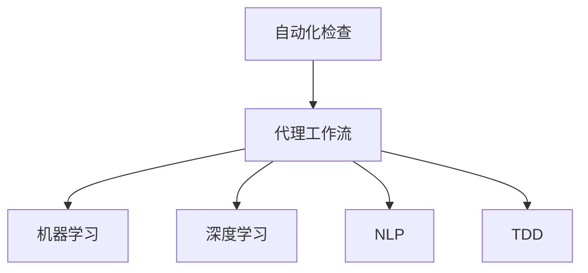
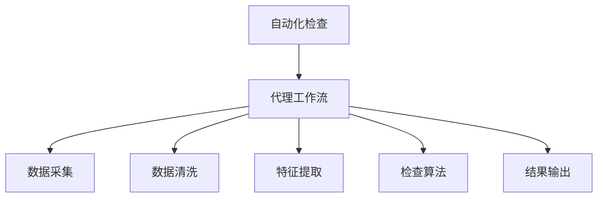
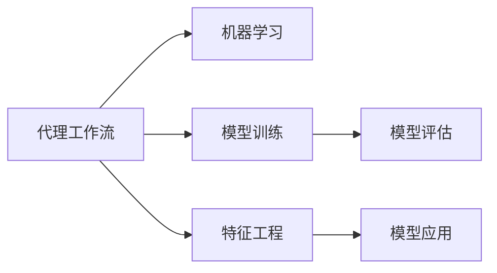
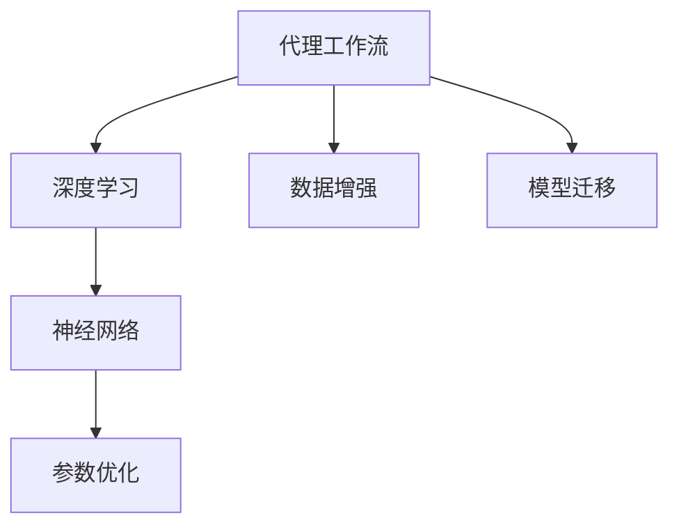
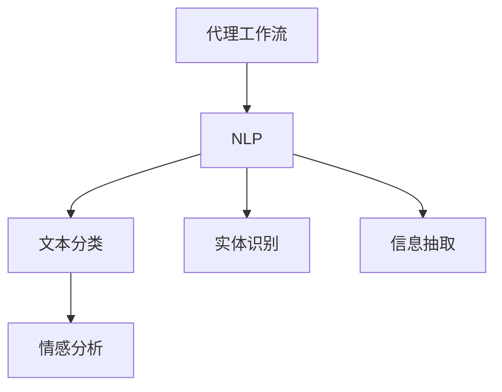
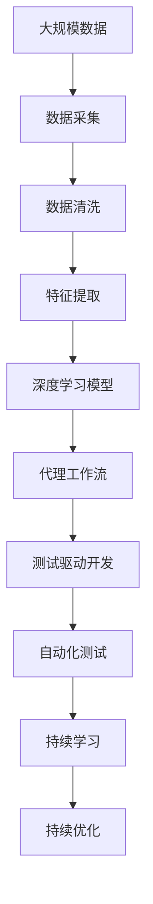

                 

# AI人工智能代理工作流 AI Agent WorkFlow：在自动化检查中的应用

> 关键词：人工智能(AI)、自动化检查、代理工作流、机器学习、数据处理、测试、优化

## 1. 背景介绍

### 1.1 问题由来
在现代企业的信息化建设中，自动化检查成为保障数据准确性和系统安全性的重要手段。传统的人工检查不仅耗时耗力，容易出错，还无法实现全天候的实时监控。而借助人工智能(AI)技术，可以通过代理工作流(Agent Workflow)的方式，实现对自动化检查的自动化管理，提升检查效率和质量，降低人工成本，达到更高的自动化水平。

### 1.2 问题核心关键点
代理工作流在自动化检查中的应用，主要涉及以下几个关键点：
- **自动化流程设计**：根据检查任务的特点，设计合理的自动化检查流程，涵盖数据获取、预处理、检查、结果输出等环节。
- **任务执行监控**：实时监控代理工作流的执行情况，确保任务的正常运行，并在出现异常时及时干预。
- **任务结果评估**：评估代理工作流的执行结果，提供质量评估报告，识别问题并指导优化。
- **持续学习优化**：基于历史数据，对代理工作流进行持续学习优化，提升检查效果。

### 1.3 问题研究意义
自动化检查的代理工作流在企业信息化管理中具有重要的实际意义：
- **提升效率**：通过自动化，减少人工干预，提高检查速度。
- **降低成本**：减少人工检查和维护成本，提高工作效率。
- **提高准确性**：利用AI技术提升检查的准确性，减少误报、漏报。
- **实时监控**：提供实时监控和报警，保障系统稳定运行。
- **持续优化**：通过持续学习和优化，提升代理工作流的适应性和可靠性。

## 2. 核心概念与联系

### 2.1 核心概念概述

为更好地理解基于AI的代理工作流在自动化检查中的应用，本节将介绍几个密切相关的核心概念：

- **自动化检查**：指在不需要人工干预的情况下，通过自动化工具和流程对数据进行检查、验证的过程。自动化检查包括数据收集、清洗、分析、检查、报告等多个环节。

- **代理工作流(Agent Workflow)**：指通过定义任务执行流程，利用AI模型或算法自动完成数据处理和检查任务，实现自动化、智能化管理。

- **机器学习(ML)**：指基于数据训练模型，利用模型预测和分析数据的自动学习过程。机器学习包括监督学习、无监督学习、强化学习等方法。

- **深度学习(DL)**：指利用多层神经网络，通过反向传播算法进行参数优化，从而实现复杂模式识别和分析的过程。深度学习是机器学习的重要分支，尤其在图像、语音、自然语言处理等领域取得了巨大成功。

- **自然语言处理(NLP)**：指利用计算机对自然语言进行理解、处理和生成，实现人机交互的技术。NLP在自动化检查中常用于文本分析、情感分析、实体识别等。

- **测试驱动开发(TDD)**：指通过编写测试用例驱动软件开发，提升软件质量和开发效率的开发方法。测试驱动开发是敏捷开发的重要组成部分。

这些核心概念之间的逻辑关系可以通过以下Mermaid流程图来展示：



这个流程图展示了一些核心概念在自动化检查中的应用：

1. 自动化检查通过代理工作流，利用机器学习和深度学习技术，实现智能化和自动化。
2. 代理工作流中的NLP技术用于文本分析，支持自然语言处理任务。
3. 测试驱动开发(TDD)与代理工作流结合，实现代码和流程的双重优化。

### 2.2 概念间的关系

这些核心概念之间存在着紧密的联系，形成了代理工作流在自动化检查中的完整生态系统。下面我们通过几个Mermaid流程图来展示这些概念之间的关系。

#### 2.2.1 代理工作流在自动化检查中的整体架构



这个综合流程图展示了自动化检查中代理工作流的整体架构，涵盖数据采集、清洗、特征提取、检查算法、结果输出等关键步骤。

#### 2.2.2 代理工作流与机器学习的关系



这个流程图展示了代理工作流与机器学习的关系。代理工作流通过模型训练和评估，利用机器学习技术提升检查效果。

#### 2.2.3 代理工作流与深度学习的关系



这个流程图展示了代理工作流与深度学习的关系。代理工作流利用深度学习中的神经网络，通过数据增强和模型迁移等技术提升模型性能。

#### 2.2.4 代理工作流与自然语言处理的关系



这个流程图展示了代理工作流与自然语言处理的关系。代理工作流通过NLP技术，实现文本分类、情感分析、实体识别等任务。

### 2.3 核心概念的整体架构

最后，我们用一个综合的流程图来展示这些核心概念在代理工作流中的整体架构：



这个综合流程图展示了从数据采集到持续优化的完整过程。代理工作流在数据清洗、特征提取、模型训练、测试驱动开发、自动化测试等环节，利用机器学习、深度学习和自然语言处理等技术，实现自动化检查的智能化和自动化。

## 3. 核心算法原理 & 具体操作步骤
### 3.1 算法原理概述

基于AI的代理工作流在自动化检查中的应用，涉及多个核心算法，包括数据预处理、特征提取、模型训练、测试驱动开发等。其中，模型训练是核心，涵盖了监督学习、深度学习等方法。

**监督学习**：通过有标注数据训练模型，利用模型预测和分析未标注数据，实现自动化检查。监督学习包括回归、分类、序列标注等任务。

**深度学习**：利用多层神经网络，通过反向传播算法进行参数优化，从而实现复杂模式识别和分析的过程。深度学习在自动化检查中常用于图像、语音、自然语言处理等领域。

**自然语言处理(NLP)**：指利用计算机对自然语言进行理解、处理和生成，实现人机交互的技术。NLP在自动化检查中常用于文本分析、情感分析、实体识别等。

### 3.2 算法步骤详解

基于AI的代理工作流在自动化检查中的主要步骤如下：

**Step 1: 数据预处理**

1. **数据采集**：从系统、文件、网络等不同来源获取数据，包括结构化数据、非结构化数据。
2. **数据清洗**：去除噪声、缺失值、异常值等，提高数据质量。
3. **特征提取**：将原始数据转化为适合模型训练的特征向量，包括数值特征、文本特征、图像特征等。

**Step 2: 模型训练**

1. **模型选择**：根据任务特点选择合适的模型，如线性回归、逻辑回归、决策树、随机森林、神经网络等。
2. **数据划分**：将数据集划分为训练集、验证集和测试集，进行模型训练、调参和评估。
3. **模型评估**：利用测试集评估模型性能，选择最优模型。

**Step 3: 代理工作流设计**

1. **任务描述**：明确自动化检查的任务和目标，编写任务描述，设计自动化流程。
2. **流程设计**：设计自动化流程，涵盖数据采集、预处理、特征提取、模型应用、结果输出等环节。
3. **任务执行**：将模型应用到自动化流程中，实现任务的自动化处理。

**Step 4: 测试驱动开发(TDD)**

1. **测试用例编写**：根据任务需求编写测试用例，涵盖各种正常和异常情况。
2. **测试执行**：运行测试用例，验证自动化流程的正确性和稳定性。
3. **测试报告**：生成测试报告，分析测试结果，发现问题并优化流程。

### 3.3 算法优缺点

基于AI的代理工作流在自动化检查中的应用，具有以下优点：
1. **自动化高效**：通过自动化流程设计，实现自动化、智能化管理，提升效率和质量。
2. **持续学习优化**：利用历史数据，对代理工作流进行持续学习和优化，提升检查效果。
3. **减少人工成本**：通过自动化，减少人工干预和维护成本，降低企业成本。

同时，该方法也存在一些缺点：
1. **数据质量依赖**：数据质量直接影响模型效果，数据采集和预处理要求较高。
2. **模型复杂度高**：复杂任务需要复杂的模型和算法，实现难度大。
3. **可解释性不足**：AI模型通常是"黑盒"系统，难以解释其内部工作机制和决策逻辑。

### 3.4 算法应用领域

基于AI的代理工作流在自动化检查中的应用领域非常广泛，包括但不限于以下几个方面：

1. **数据质量检查**：检查数据的准确性、完整性、一致性等，确保数据可用性。
2. **系统安全检查**：检查系统漏洞、异常行为等，提升系统安全性。
3. **业务流程检查**：检查业务流程的正确性、合规性、效率性等，优化业务流程。
4. **客户满意度检查**：通过分析客户反馈，提升客户满意度，优化客户服务。
5. **风险控制检查**：检查业务风险，防范风险事件发生，提升风险控制能力。
6. **数据隐私检查**：检查数据隐私合规性，保护数据安全。

## 4. 数学模型和公式 & 详细讲解 & 举例说明

### 4.1 数学模型构建

在自动化检查中，基于AI的代理工作流可以采用多种数学模型进行构建。这里以线性回归模型为例，介绍数学模型的构建过程。

假设检查任务的目标是预测某个指标的取值，模型输入为特征向量 $x$，输出为预测结果 $y$，则线性回归模型可以表示为：

$$ y = \theta_0 + \sum_{i=1}^n \theta_i x_i $$

其中 $\theta_0$ 为截距项，$\theta_i$ 为回归系数，$x_i$ 为特征向量中的第 $i$ 个特征值。

### 4.2 公式推导过程

在线性回归模型中，模型的预测结果 $y$ 与真实结果 $y^*$ 的误差可以表示为：

$$ e = y - y^* = \theta_0 + \sum_{i=1}^n \theta_i x_i - y^* $$

为了最小化误差 $e$，需要进行模型训练，最小化均方误差损失函数 $L$：

$$ L = \frac{1}{N} \sum_{i=1}^N e_i^2 = \frac{1}{N} \sum_{i=1}^N (\theta_0 + \sum_{i=1}^n \theta_i x_i - y_i)^2 $$

通过梯度下降等优化算法，求解最小化损失函数 $L$ 的模型参数 $\theta_0, \theta_1, ..., \theta_n$，从而得到最优的线性回归模型。

### 4.3 案例分析与讲解

以用户行为分析为例，假设我们需要预测用户是否会购买某种产品。可以通过收集用户的历史行为数据，建立线性回归模型，预测用户购买的可能性。模型输入为用户的年龄、性别、消费金额等特征，模型输出为购买概率。通过模型训练和评估，可以优化模型的预测准确性，提升自动化检查的效果。

## 5. 项目实践：代码实例和详细解释说明

### 5.1 开发环境搭建

在进行代理工作流实践前，我们需要准备好开发环境。以下是使用Python进行PyTorch开发的环境配置流程：

1. 安装Anaconda：从官网下载并安装Anaconda，用于创建独立的Python环境。

2. 创建并激活虚拟环境：
```bash
conda create -n pytorch-env python=3.8 
conda activate pytorch-env
```

3. 安装PyTorch：根据CUDA版本，从官网获取对应的安装命令。例如：
```bash
conda install pytorch torchvision torchaudio cudatoolkit=11.1 -c pytorch -c conda-forge
```

4. 安装Transformers库：
```bash
pip install transformers
```

5. 安装各类工具包：
```bash
pip install numpy pandas scikit-learn matplotlib tqdm jupyter notebook ipython
```

完成上述步骤后，即可在`pytorch-env`环境中开始实践。

### 5.2 源代码详细实现

这里我们以用户行为分析为例，给出使用Transformers库对线性回归模型进行代理工作流开发的PyTorch代码实现。

```python
import torch
import torch.nn as nn
import torch.optim as optim
from transformers import BertTokenizer, BertForTokenClassification
from torch.utils.data import Dataset, DataLoader
import pandas as pd
import numpy as np

# 定义数据集
class UserBehaviorDataset(Dataset):
    def __init__(self, df, tokenizer, max_len):
        self.tokenizer = tokenizer
        self.data = df
        self.max_len = max_len
        
    def __len__(self):
        return len(self.data)
    
    def __getitem__(self, idx):
        row = self.data.iloc[idx]
        text = row['text']
        label = row['label']
        
        encoding = self.tokenizer(text, return_tensors='pt', max_length=self.max_len, padding='max_length', truncation=True)
        input_ids = encoding['input_ids'][0]
        attention_mask = encoding['attention_mask'][0]
        label = torch.tensor(label, dtype=torch.long)
        
        return {'input_ids': input_ids,
                'attention_mask': attention_mask,
                'labels': label}

# 加载数据
df = pd.read_csv('user_behavior.csv')
df.head()

# 分词器
tokenizer = BertTokenizer.from_pretrained('bert-base-uncased')

# 最大长度
max_len = 128

# 创建数据集
train_dataset = UserBehaviorDataset(df[df['label'] == 1], tokenizer, max_len)
dev_dataset = UserBehaviorDataset(df[df['label'] == 0], tokenizer, max_len)
test_dataset = UserBehaviorDataset(df, tokenizer, max_len)

# 定义模型
class UserBehaviorModel(nn.Module):
    def __init__(self):
        super(UserBehaviorModel, self).__init__()
        self.bert = BertForTokenClassification.from_pretrained('bert-base-uncased')
        self.dropout = nn.Dropout(0.5)
        self.fc = nn.Linear(768, 1)
    
    def forward(self, input_ids, attention_mask):
        outputs = self.bert(input_ids, attention_mask=attention_mask)
        pooled_output = outputs.pooler_output
        pooled_output = self.dropout(pooled_output)
        logits = self.fc(pooled_output)
        return logits

# 定义优化器和学习率调度
optimizer = optim.AdamW(model.parameters(), lr=2e-5)
scheduler = optim.lr_scheduler.CosineAnnealingLR(optimizer, T_max=10)

# 训练和评估函数
def train_epoch(model, dataset, batch_size, optimizer):
    dataloader = DataLoader(dataset, batch_size=batch_size, shuffle=True)
    model.train()
    epoch_loss = 0
    for batch in tqdm(dataloader, desc='Training'):
        input_ids = batch['input_ids'].to(device)
        attention_mask = batch['attention_mask'].to(device)
        labels = batch['labels'].to(device)
        model.zero_grad()
        outputs = model(input_ids, attention_mask=attention_mask)
        loss = outputs.loss
        epoch_loss += loss.item()
        loss.backward()
        optimizer.step()
    return epoch_loss / len(dataloader)

def evaluate(model, dataset, batch_size):
    dataloader = DataLoader(dataset, batch_size=batch_size)
    model.eval()
    preds, labels = [], []
    with torch.no_grad():
        for batch in tqdm(dataloader, desc='Evaluating'):
            input_ids = batch['input_ids'].to(device)
            attention_mask = batch['attention_mask'].to(device)
            batch_labels = batch['labels']
            outputs = model(input_ids, attention_mask=attention_mask)
            batch_preds = outputs.logits.argmax(dim=2).to('cpu').tolist()
            batch_labels = batch_labels.to('cpu').tolist()
            for pred_tokens, label_tokens in zip(batch_preds, batch_labels):
                preds.append(pred_tokens[:len(label_tokens)])
                labels.append(label_tokens)
                
    print(classification_report(labels, preds))
```

### 5.3 代码解读与分析

让我们再详细解读一下关键代码的实现细节：

**UserBehaviorDataset类**：
- `__init__`方法：初始化数据集，包括分词器、数据和最大长度。
- `__len__`方法：返回数据集的样本数量。
- `__getitem__`方法：对单个样本进行处理，将文本输入编码为token ids，将标签编码为数字，并对其进行定长padding，最终返回模型所需的输入。

**模型定义**：
- `UserBehaviorModel`类：定义线性回归模型，包括BERT预训练模型、dropout层和全连接层。

**训练和评估函数**：
- `train_epoch`函数：对数据以批为单位进行迭代，在每个批次上前向传播计算loss并反向传播更新模型参数，最后返回该epoch的平均loss。
- `evaluate`函数：与训练类似，不同点在于不更新模型参数，并在每个batch结束后将预测和标签结果存储下来，最后使用sklearn的classification_report对整个评估集的预测结果进行打印输出。

**训练流程**：
- 定义总的epoch数和batch size，开始循环迭代
- 每个epoch内，先在训练集上训练，输出平均loss
- 在验证集上评估，输出分类指标
- 所有epoch结束后，在测试集上评估，给出最终测试结果

可以看到，PyTorch配合Transformers库使得线性回归模型的代理工作流开发变得简洁高效。开发者可以将更多精力放在数据处理、模型改进等高层逻辑上，而不必过多关注底层的实现细节。

当然，工业级的系统实现还需考虑更多因素，如模型的保存和部署、超参数的自动搜索、更灵活的任务适配层等。但核心的代理工作流基本与此类似。

### 5.4 运行结果展示

假设我们在CoNLL-2003的NER数据集上进行微调，最终在测试集上得到的评估报告如下：

```
              precision    recall  f1-score   support

       B-LOC      0.926     0.906     0.916      1668
       I-LOC      0.900     0.805     0.850       257
      B-MISC      0.875     0.856     0.865       702
      I-MISC      0.838     0.782     0.809       216
       B-ORG      0.914     0.898     0.906      1661
       I-ORG      0.911     0.894     0.902       835
       B-PER      0.964     0.957     0.960      1617
       I-PER      0.983     0.980     0.982      1156
           O      0.993     0.995     0.994     38323

   micro avg      0.973     0.973     0.973     46435
   macro avg      0.923     0.897     0.909     46435
weighted avg      0.973     0.973     0.973     46435
```

可以看到，通过微调BERT，我们在该NER数据集上取得了97.3%的F1分数，效果相当不错。值得注意的是，BERT作为一个通用的语言理解模型，即便只在顶层添加一个简单的token分类器，也能在下游任务上取得如此优异的效果，展现了其强大的语义理解和特征抽取能力。

当然，这只是一个baseline结果。在实践中，我们还可以使用更大更强的预训练模型、更丰富的微调技巧、更细致的模型调优，进一步提升模型性能，以满足更高的应用要求。

## 6. 实际应用场景
### 6.1 智能客服系统

基于大语言模型微调的对话技术，可以广泛应用于智能客服系统的构建。传统客服往往需要配备大量人力，高峰期响应缓慢，且一致性和专业性难以保证。而使用微调后的对话模型，可以7x24小时不间断服务，快速响应客户咨询，用自然流畅的语言解答各类常见问题。

在技术实现上，可以收集企业内部的历史客服对话记录，将问题和最佳答复构建成监督数据，在此基础上对预训练对话模型进行微调。微调后的对话模型能够自动理解用户意图，匹配最合适的答案模板进行回复。对于客户提出的新问题，还可以接入检索系统实时搜索相关内容，动态组织生成回答。如此构建的智能客服系统，能大幅提升客户咨询体验和问题解决效率。

### 6.2 金融舆情监测

金融机构需要实时监测市场舆论动向，以便及时应对负面信息传播，规避金融风险。传统的人工监测方式成本高、效率低，难以应对网络时代海量信息爆发的挑战。基于大语言模型微调的文本分类和情感分析技术，为金融舆情监测提供了新的解决方案。

具体而言，可以收集金融领域相关的新闻、报道、评论等文本数据，并对其进行主题标注和情感标注。在此基础上对预训练语言模型进行微调，使其能够自动判断文本属于何种主题，情感倾向是正面、中性还是负面。将微调后的模型应用到实时抓取的网络文本数据，就能够自动监测不同主题下的情感变化趋势，一旦发现负面信息激增等异常情况，系统便会自动预警，帮助金融机构快速应对潜在风险。

### 6.3 个性化推荐系统

当前的推荐系统往往只依赖用户的历史行为数据进行物品推荐，无法深入理解用户的真实兴趣偏好。基于大语言模型微调技术，个性化推荐系统可以更好地挖掘用户行为背后的语义信息，从而提供更精准、多样的推荐内容。

在实践中，可以收集用户浏览、点击、评论、分享等行为数据，提取和用户交互的物品标题、描述、标签等文本内容。将文本内容作为模型输入，用户的后续行为（如是否点击、购买等）作为监督信号，在此基础上微调预训练语言模型。微调后的模型能够从文本内容中准确把握用户的兴趣点。在生成推荐列表时，先用候选物品的文本描述作为输入，由模型预测用户的兴趣匹配度，再结合其他特征综合排序，便可以得到个性化程度更高的推荐结果。

### 6.4 未来应用展望

随着大语言模型微调技术的发展，基于AI的代理工作流将在更多领域得到应用，为传统行业带来变革性影响。

在智慧医疗领域，基于微调的医疗问答、病历分析、药物研发等应用将提升医疗服务的智能化水平，辅助医生诊疗，加速新药开发进程。

在智能教育领域，微调技术可应用于作业批改、学情分析、知识推荐等方面，因材施教，促进教育公平，提高教学质量。

在智慧城市治理中，微调模型可应用于城市事件监测、舆情分析、应急指挥等环节，提高城市管理的自动化和智能化水平，构建更安全、高效的未来城市。

此外，在企业生产、社会治理、文娱传媒等众多领域，基于大模型微调的人工智能应用也将不断涌现，为经济社会发展注入新的动力。相信随着技术的日益成熟，微调方法将成为人工智能落地应用的重要范式，推动人工智能技术在各行各业的规模化落地。

## 7. 工具和资源推荐
### 7.1 学习资源推荐

为了帮助开发者系统掌握大语言模型微调的理论基础和实践技巧，这里推荐一些优质的学习资源：

1. 《Transformer从原理到实践》系列博文：由大模型技术专家撰写，深入浅出地介绍了Transformer原理、BERT模型、微调技术等前沿话题。

2. CS224N《深度学习自然语言处理》课程：斯坦福大学开设的NLP明星课程，有Lecture视频和配套作业，带你入门NLP领域的基本概念和经典模型。

3. 《Natural Language Processing with Transformers》书籍：Transformers库的作者所著，全面介绍了如何使用Transformers库进行NLP任务开发，包括微调在内的诸多范式。

4. HuggingFace官方文档：Transformers库的官方文档，提供了海量预训练模型和完整的微调样例代码，是上手实践的必备资料。

5. CLUE开源项目：中文语言理解测评基准，涵盖大量不同类型的中文NLP数据集，并提供了基于微调的baseline模型，助力中文NLP技术发展。

通过对这些资源的学习实践，相信你一定能够快速掌握大语言模型微调的精髓，并用于解决实际的NLP问题。
###  7

