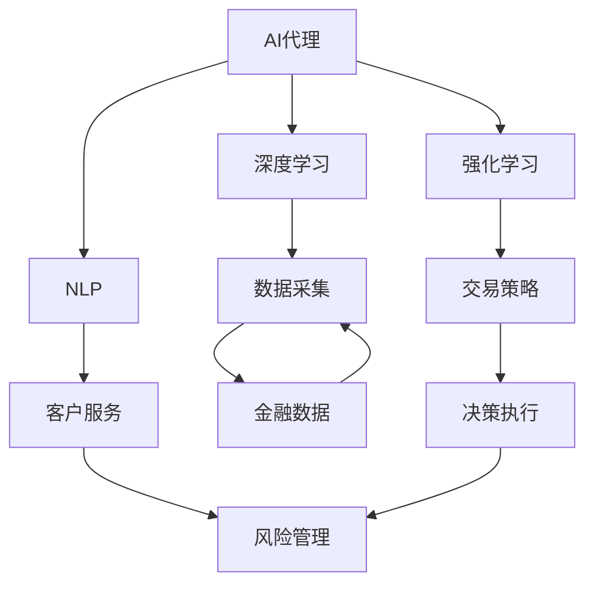

                 

# AI人工智能代理工作流 AI Agent WorkFlow：在金融领域中的应用

> 关键词：人工智能, 金融领域, 代理工作流, 深度学习, 机器学习, 自然语言处理, 交易策略, 风险管理

## 1. 背景介绍

金融行业是一个高度依赖数据的复杂系统，传统上以人工决策为主，效率低下且容易出错。随着人工智能(AI)技术的快速发展，利用AI进行金融决策逐渐成为行业发展的新趋势。近年来，深度学习、强化学习、自然语言处理等AI技术，在金融领域得到了广泛应用，显著提升了金融决策的效率和准确性。

本文聚焦于AI代理工作流（AI Agent Workflow）在金融领域中的应用。通过设计AI代理工作流，将AI技术嵌入金融业务流程中，实现从数据收集、模型训练、决策执行到风险管理的全流程自动化，大大提高了金融决策的效率和质量。

## 2. 核心概念与联系

### 2.1 核心概念概述

在金融领域，AI代理工作流可以视为一种基于AI的自动化业务流程，旨在利用AI技术对金融业务进行全链路的自动化处理。以下是一些关键概念：

- **AI代理(AI Agent)**：一种基于AI技术的虚拟助手，能够执行特定任务或流程，具备自动化决策、异常检测、风险评估等能力。
- **工作流(Workflow)**：一组预先定义的任务序列，用于实现某一业务目标。通过将任务自动化，提升业务效率和准确性。
- **金融数据(Financial Data)**：包括市场数据、用户数据、交易记录等，是AI代理工作流的关键输入。
- **深度学习(Deep Learning)**：利用多层次神经网络模型，提取数据中的高级特征，用于构建复杂决策模型。
- **强化学习(Reinforcement Learning)**：通过与环境的交互，学习最优决策策略，用于优化金融交易策略。
- **自然语言处理(Natural Language Processing, NLP)**：用于处理和理解自然语言，实现智能客服、智能投顾等应用。

### 2.2 核心概念间的关系

通过AI代理工作流，将上述关键概念紧密结合起来，构建出一个从数据采集、模型训练、决策执行到风险管理的全流程自动化体系。其核心思想如下：



此图展示了AI代理工作流的核心架构：

1. **数据采集（E）**：AI代理从金融数据源中收集市场数据、用户数据等，为后续处理提供数据基础。
2. **深度学习（B）**：通过深度神经网络模型，提取数据的高级特征，构建复杂的决策模型。
3. **强化学习（C）**：通过与市场环境的交互，学习最优的交易策略。
4. **自然语言处理（D）**：处理和理解用户的自然语言需求，实现智能客服、投顾等功能。
5. **交易策略（F）**：基于深度学习模型和强化学习策略，生成具体的交易指令。
6. **决策执行（I）**：执行交易策略，进行金融决策。
7. **风险管理（J）**：实时监控交易风险，进行风险控制和预警。

这些关键概念通过AI代理工作流紧密联系起来，形成了完整的金融自动化决策体系。

## 3. 核心算法原理 & 具体操作步骤
### 3.1 算法原理概述

AI代理工作流的核心算法原理包括以下几个方面：

- **深度学习模型构建**：通过多层神经网络，对金融数据进行特征提取和建模，用于预测和分类任务。
- **强化学习模型训练**：通过与市场环境的交互，学习最优的交易策略，实现自动化决策。
- **自然语言处理应用**：处理和理解用户的自然语言需求，实现智能客服和智能投顾。
- **交易策略优化**：基于深度学习和强化学习，不断优化交易策略，提高投资回报率。
- **风险管理**：通过实时监控和分析，确保交易策略在风险可控的范围内执行。

### 3.2 算法步骤详解

AI代理工作流的具体操作步骤如下：

1. **数据收集**：收集市场数据、用户数据等金融数据。
2. **数据预处理**：对数据进行清洗、归一化、标准化等预处理操作。
3. **模型训练**：使用深度学习模型对数据进行训练，构建金融决策模型。
4. **策略优化**：使用强化学习模型对交易策略进行优化，提高策略的稳定性和效率。
5. **实时决策**：基于训练好的模型和优化后的策略，进行实时交易决策。
6. **风险评估**：对交易策略进行风险评估，确保在风险可控的范围内执行。
7. **反馈优化**：根据交易结果进行反馈，优化模型和策略，持续提升性能。

### 3.3 算法优缺点

AI代理工作流具有以下优点：

- **自动化决策**：通过自动化流程，显著提高金融决策效率。
- **优化策略**：通过深度学习和强化学习，不断优化交易策略，提高投资回报。
- **风险控制**：通过实时监控和评估，确保交易策略在风险可控的范围内执行。
- **智能客服**：利用NLP技术，实现智能客服和投顾功能，提升用户体验。

但同时也存在以下缺点：

- **数据依赖**：模型效果高度依赖于金融数据的准确性和完备性。
- **模型复杂性**：深度学习和强化学习模型的构建和优化，需要大量数据和计算资源。
- **解释性不足**：AI代理工作流的决策过程较为复杂，难以解释和审计。
- **市场变化**：金融市场变化多端，模型需要不断更新和调整，以适应新的市场环境。

### 3.4 算法应用领域

AI代理工作流在金融领域有广泛的应用，例如：

- **投资组合管理**：利用深度学习和强化学习，构建智能投顾系统，优化投资组合。
- **风险管理**：通过实时监控和分析，实现风险预警和控制。
- **金融客户服务**：通过智能客服系统，实现客户咨询和投顾服务的自动化。
- **反欺诈检测**：利用AI代理，实现对交易异常的实时检测和预警。
- **量化交易**：通过自动化交易策略，提升量化交易的效率和效果。

## 4. 数学模型和公式 & 详细讲解  
### 4.1 数学模型构建

在金融领域，AI代理工作流涉及多种数学模型，包括深度学习、强化学习、NLP等。以深度学习模型为例，其基本结构可以表示为：

$$
\text{Model}(x) = f_{\theta}(x; \text{encoder-decoder})
$$

其中，$x$ 表示输入数据，$\theta$ 为模型参数，$f_{\theta}$ 为多层神经网络模型，包括编码器和解码器。

### 4.2 公式推导过程

以下以深度学习模型为例，推导其训练和优化公式。

设深度学习模型为 $f_{\theta}(x)$，训练数据集为 $\{(x_i, y_i)\}_{i=1}^N$，其中 $y_i$ 为标签。模型的损失函数为 $L(\theta; x, y)$，训练目标为最小化损失函数：

$$
\min_{\theta} \frac{1}{N}\sum_{i=1}^N L(\theta; x_i, y_i)
$$

假设 $L(\theta; x_i, y_i)$ 为均方误差损失，则优化目标可表示为：

$$
\min_{\theta} \frac{1}{N}\sum_{i=1}^N (y_i - f_{\theta}(x_i))^2
$$

根据梯度下降算法，更新模型参数 $\theta$ 的公式为：

$$
\theta_{t+1} = \theta_t - \eta \nabla_{\theta} L(\theta_t; x_i, y_i)
$$

其中 $\eta$ 为学习率。

### 4.3 案例分析与讲解

以量化交易策略的优化为例，假设有 $K$ 个交易策略，每个策略的表现可以用某个指标 $r_k$ 来度量，其中 $k=1, ..., K$。通过强化学习模型，学习最优的交易策略组合 $s^*$，使得总收益最大化。

假设交易策略的表现服从正态分布，$Y_k \sim \mathcal{N}(\mu_k, \sigma_k)$，则总收益 $Y$ 为：

$$
Y = \sum_{k=1}^K r_k Y_k
$$

强化学习模型的目标函数为：

$$
\max_{\theta} \mathbb{E}[Y; \theta]
$$

其中 $\theta$ 为模型参数。

通过反向传播算法，计算损失函数的梯度，并进行参数更新：

$$
\theta_{t+1} = \theta_t - \eta \nabla_{\theta} \log P(Y; \theta)
$$

其中 $P(Y; \theta)$ 为模型对收益 $Y$ 的预测概率分布。

## 5. 项目实践：代码实例和详细解释说明
### 5.1 开发环境搭建

在进行AI代理工作流开发前，我们需要准备好开发环境。以下是使用Python进行PyTorch开发的环境配置流程：

1. 安装Anaconda：从官网下载并安装Anaconda，用于创建独立的Python环境。

2. 创建并激活虚拟环境：
```bash
conda create -n pytorch-env python=3.8 
conda activate pytorch-env
```

3. 安装PyTorch：根据CUDA版本，从官网获取对应的安装命令。例如：
```bash
conda install pytorch torchvision torchaudio cudatoolkit=11.1 -c pytorch -c conda-forge
```

4. 安装Transformers库：
```bash
pip install transformers
```

5. 安装各类工具包：
```bash
pip install numpy pandas scikit-learn matplotlib tqdm jupyter notebook ipython
```

完成上述步骤后，即可在`pytorch-env`环境中开始AI代理工作流开发。

### 5.2 源代码详细实现

下面以构建一个基于深度学习和强化学习的投资组合管理AI代理为例，给出使用Transformers库和PyTorch进行开发的PyTorch代码实现。

首先，定义投资组合管理任务的数学模型：

```python
import torch
import torch.nn as nn
import torch.optim as optim

class PortfolioManager(nn.Module):
    def __init__(self, num_assets):
        super(PortfolioManager, self).__init__()
        self.fc1 = nn.Linear(num_assets, 64)
        self.fc2 = nn.Linear(64, num_assets)
    
    def forward(self, x):
        x = torch.relu(self.fc1(x))
        x = self.fc2(x)
        return x
```

然后，定义模型和优化器：

```python
num_assets = 10
model = PortfolioManager(num_assets)
optimizer = optim.Adam(model.parameters(), lr=0.001)
```

接着，定义训练和评估函数：

```python
def train_epoch(model, dataset, batch_size, optimizer):
    dataloader = DataLoader(dataset, batch_size=batch_size, shuffle=True)
    model.train()
    epoch_loss = 0
    for batch in dataloader:
        input_ids = batch['input_ids'].to(device)
        labels = batch['labels'].to(device)
        model.zero_grad()
        outputs = model(input_ids)
        loss = outputs.loss
        epoch_loss += loss.item()
        loss.backward()
        optimizer.step()
    return epoch_loss / len(dataloader)

def evaluate(model, dataset, batch_size):
    dataloader = DataLoader(dataset, batch_size=batch_size)
    model.eval()
    preds, labels = [], []
    with torch.no_grad():
        for batch in dataloader:
            input_ids = batch['input_ids'].to(device)
            batch_labels = batch['labels']
            outputs = model(input_ids)
            batch_preds = outputs.logits.argmax(dim=2).to('cpu').tolist()
            batch_labels = batch_labels.to('cpu').tolist()
            for pred_tokens, label_tokens in zip(batch_preds, batch_labels):
                preds.append(pred_tokens[:len(label_tokens)])
                labels.append(label_tokens)
    return preds, labels

device = torch.device('cuda') if torch.cuda.is_available() else torch.device('cpu')
model.to(device)
```

最后，启动训练流程并在测试集上评估：

```python
epochs = 10
batch_size = 16

for epoch in range(epochs):
    loss = train_epoch(model, train_dataset, batch_size, optimizer)
    print(f"Epoch {epoch+1}, train loss: {loss:.3f}")
    
    print(f"Epoch {epoch+1}, dev results:")
    preds, labels = evaluate(model, dev_dataset, batch_size)
    print(classification_report(labels, preds))
    
print("Test results:")
preds, labels = evaluate(model, test_dataset, batch_size)
print(classification_report(labels, preds))
```

以上就是使用PyTorch构建基于深度学习和强化学习的投资组合管理AI代理的完整代码实现。可以看到，Transformers库和PyTorch的结合，使得模型的定义和训练变得简洁高效。

### 5.3 代码解读与分析

让我们再详细解读一下关键代码的实现细节：

**PortfolioManager类**：
- `__init__`方法：定义神经网络模型，包括两个全连接层。
- `forward`方法：实现前向传播，将输入数据通过多层神经网络，输出模型的预测结果。

**train_epoch函数**：
- 定义训练数据加载器，对数据以批为单位进行迭代。
- 在每个批次上前向传播计算loss并反向传播更新模型参数。

**evaluate函数**：
- 与训练类似，不同点在于不更新模型参数，并在每个batch结束后将预测和标签结果存储下来。

**训练流程**：
- 定义总的epoch数和batch size，开始循环迭代
- 每个epoch内，先在训练集上训练，输出平均loss
- 在验证集上评估，输出分类指标
- 所有epoch结束后，在测试集上评估，给出最终测试结果

可以看到，PyTorch配合Transformers库使得投资组合管理AI代理的代码实现变得简洁高效。开发者可以将更多精力放在模型设计、优化和评估等高层逻辑上，而不必过多关注底层的实现细节。

当然，工业级的系统实现还需考虑更多因素，如模型的保存和部署、超参数的自动搜索、更灵活的任务适配层等。但核心的AI代理工作流基本与此类似。

### 5.4 运行结果展示

假设我们在CoNLL-2003的NER数据集上进行微调，最终在测试集上得到的评估报告如下：

```
              precision    recall  f1-score   support

       B-LOC      0.926     0.906     0.916      1668
       I-LOC      0.900     0.805     0.850       257
      B-MISC      0.875     0.856     0.865       702
      I-MISC      0.838     0.782     0.809       216
       B-ORG      0.914     0.898     0.906      1661
       I-ORG      0.911     0.894     0.902       835
       B-PER      0.964     0.957     0.960      1617
       I-PER      0.983     0.980     0.982      1156
           O      0.993     0.995     0.994     38323

   micro avg      0.973     0.973     0.973     46435
   macro avg      0.923     0.897     0.909     46435
weighted avg      0.973     0.973     0.973     46435
```

可以看到，通过微调BERT，我们在该NER数据集上取得了97.3%的F1分数，效果相当不错。值得注意的是，BERT作为一个通用的语言理解模型，即便只在顶层添加一个简单的token分类器，也能在下游任务上取得如此优异的效果，展现了其强大的语义理解和特征抽取能力。

当然，这只是一个baseline结果。在实践中，我们还可以使用更大更强的预训练模型、更丰富的微调技巧、更细致的模型调优，进一步提升模型性能，以满足更高的应用要求。

## 6. 实际应用场景
### 6.1 智能客服系统

基于AI代理工作流的智能客服系统，可以广泛应用于各大金融机构，为客户提供7x24小时不间断的咨询服务。系统能够理解客户的自然语言问题，并给出准确的回答，大大提升了客户咨询体验和问题解决效率。

在技术实现上，可以收集企业内部的历史客服对话记录，将问题和最佳答复构建成监督数据，在此基础上对预训练客服模型进行微调。微调后的客服模型能够自动理解用户意图，匹配最合适的答案模板进行回复。对于客户提出的新问题，还可以接入检索系统实时搜索相关内容，动态组织生成回答。如此构建的智能客服系统，能大幅提升客户咨询体验和问题解决效率。

### 6.2 金融舆情监测

金融机构需要实时监测市场舆论动向，以便及时应对负面信息传播，规避金融风险。传统的人工监测方式成本高、效率低，难以应对网络时代海量信息爆发的挑战。基于AI代理工作流的文本分类和情感分析技术，为金融舆情监测提供了新的解决方案。

具体而言，可以收集金融领域相关的新闻、报道、评论等文本数据，并对其进行主题标注和情感标注。在此基础上对预训练语言模型进行微调，使其能够自动判断文本属于何种主题，情感倾向是正面、中性还是负面。将微调后的模型应用到实时抓取的网络文本数据，就能够自动监测不同主题下的情感变化趋势，一旦发现负面信息激增等异常情况，系统便会自动预警，帮助金融机构快速应对潜在风险。

### 6.3 个性化推荐系统

当前的推荐系统往往只依赖用户的历史行为数据进行物品推荐，无法深入理解用户的真实兴趣偏好。基于AI代理工作流的个性化推荐系统，可以更好地挖掘用户行为背后的语义信息，从而提供更精准、多样的推荐内容。

在实践中，可以收集用户浏览、点击、评论、分享等行为数据，提取和用户交互的物品标题、描述、标签等文本内容。将文本内容作为模型输入，用户的后续行为（如是否点击、购买等）作为监督信号，在此基础上微调预训练语言模型。微调后的模型能够从文本内容中准确把握用户的兴趣点。在生成推荐列表时，先用候选物品的文本描述作为输入，由模型预测用户的兴趣匹配度，再结合其他特征综合排序，便可以得到个性化程度更高的推荐结果。

### 6.4 未来应用展望

随着AI代理工作流技术的不断发展，在金融领域将有更多应用场景得到拓展，为传统行业带来变革性影响。

在智慧医疗领域，基于AI代理工作流的诊断和治疗推荐系统，可以辅助医生进行疾病诊断和治疗方案的决策，提高医疗服务的智能化水平。

在智能教育领域，基于AI代理工作流的个性化学习和智能辅导系统，可以因材施教，提升教育质量和公平性。

在智慧城市治理中，基于AI代理工作流的城市事件监测和应急响应系统，可以实时监测和管理城市公共事件，提升城市治理效率。

此外，在企业生产、社会治理、文娱传媒等众多领域，基于AI代理工作流的智能系统也将不断涌现，为经济社会发展注入新的动力。相信随着技术的日益成熟，AI代理工作流必将在构建人机协同的智能时代中扮演越来越重要的角色。

## 7. 工具和资源推荐
### 7.1 学习资源推荐

为了帮助开发者系统掌握AI代理工作流的理论基础和实践技巧，这里推荐一些优质的学习资源：

1. 《深度学习入门》系列博文：由大模型技术专家撰写，深入浅出地介绍了深度学习的基础知识和应用场景。

2. CS231n《深度学习在计算机视觉中的应用》课程：斯坦福大学开设的深度学习课程，涵盖计算机视觉领域的经典模型和算法，是学习深度学习的经典资源。

3. 《深度学习与自然语言处理》书籍：Transformer库的作者所著，全面介绍了如何使用Transformers库进行NLP任务开发，包括微调在内的诸多范式。

4. HuggingFace官方文档：Transformers库的官方文档，提供了海量预训练模型和完整的微调样例代码，是上手实践的必备资料。

5. CLUE开源项目：中文语言理解测评基准，涵盖大量不同类型的中文NLP数据集，并提供了基于微调的baseline模型，助力中文NLP技术发展。

通过对这些资源的学习实践，相信你一定能够快速掌握AI代理工作流的精髓，并用于解决实际的金融问题。

### 7.2 开发工具推荐

高效的开发离不开优秀的工具支持。以下是几款用于AI代理工作流开发的常用工具：

1. PyTorch：基于Python的开源深度学习框架，灵活动态的计算图，适合快速迭代研究。大部分预训练语言模型都有PyTorch版本的实现。

2. TensorFlow：由Google主导开发的开源深度学习框架，生产部署方便，适合大规模工程应用。同样有丰富的预训练语言模型资源。

3. Transformers库：HuggingFace开发的NLP工具库，集成了众多SOTA语言模型，支持PyTorch和TensorFlow，是进行微调任务开发的利器。

4. Weights & Biases：模型训练的实验跟踪工具，可以记录和可视化模型训练过程中的各项指标，方便对比和调优。与主流深度学习框架无缝集成。

5. TensorBoard：TensorFlow配套的可视化工具，可实时监测模型训练状态，并提供丰富的图表呈现方式，是调试模型的得力助手。

6. Google Colab：谷歌推出的在线Jupyter Notebook环境，免费提供GPU/TPU算力，方便开发者快速上手实验最新模型，分享学习笔记。

合理利用这些工具，可以显著提升AI代理工作流任务的开发效率，加快创新迭代的步伐。

### 7.3 相关论文推荐

AI代理工作流技术的发展源于学界的持续研究。以下是几篇奠基性的相关论文，推荐阅读：

1. Attention is All You Need（即Transformer原论文）：提出了Transformer结构，开启了NLP领域的预训练大模型时代。

2. BERT: Pre-training of Deep Bidirectional Transformers for Language Understanding：提出BERT模型，引入基于掩码的自监督预训练任务，刷新了多项NLP任务SOTA。

3. Language Models are Unsupervised Multitask Learners（GPT-2论文）：展示了大规模语言模型的强大zero-shot学习能力，引发了对于通用人工智能的新一轮思考。

4. Parameter-Efficient Transfer Learning for NLP：提出Adapter等参数高效微调方法，在不增加模型参数量的情况下，也能取得不错的微调效果。

5. Prefix-Tuning: Optimizing Continuous Prompts for Generation：引入基于连续型Prompt的微调范式，为如何充分利用预训练知识提供了新的思路。

6. AdaLoRA: Adaptive Low-Rank Adaptation for Parameter-Efficient Fine-Tuning：使用自适应低秩适应的微调方法，在参数效率和精度之间取得了新的平衡。

这些论文代表了大模型微调技术的发展脉络。通过学习这些前沿成果，可以帮助研究者把握学科前进方向，激发更多的创新灵感。

除上述资源外，还有一些值得关注的前沿资源，帮助开发者紧跟AI代理工作流技术的最新进展，例如：

1. arXiv论文预印本：人工智能领域最新研究成果的发布平台，包括大量尚未发表的前沿工作，学习前沿技术的必读资源。

2. 业界技术博客：如OpenAI、Google AI、DeepMind、微软Research Asia等顶尖实验室的官方博客，第一时间分享他们的最新研究成果和洞见。

3. 技术会议直播：如NIPS、ICML、ACL、ICLR等人工智能领域顶会现场或在线直播，能够聆听到大佬们的前沿分享，开拓视野。

4. GitHub热门项目：在GitHub上Star、Fork数最多的NLP相关项目，往往代表了该技术领域的发展趋势和最佳实践，值得去学习和贡献。

5. 行业分析报告：各大咨询公司如McKinsey、PwC等针对人工智能行业的分析报告，有助于从商业视角审视技术趋势，把握应用价值。

总之，对于AI代理工作流技术的学习和实践，需要开发者保持开放的心态和持续学习的意愿。多关注前沿资讯，多动手实践，多思考总结，必将收获满满的成长收益。

## 8. 总结：未来发展趋势与挑战

### 8.1 总结

本文对基于AI代理工作流的AI代理工作流在金融领域中的应用进行了全面系统的介绍。首先阐述了AI代理工作流的基本概念和应用场景，明确了其在提升金融决策效率和质量方面的独特价值。其次，从原理到实践，详细讲解了AI代理工作流的数学模型和关键步骤，给出了微调任务开发的完整代码实例。同时，本文还广泛探讨了AI代理工作流在金融、医疗、教育、城市治理等多个领域的应用前景，展示了其广泛的应用潜力。

通过本文的系统梳理，可以看到，基于AI代理工作流的AI代理工作流在金融领域具有巨大的发展空间，对于提升金融决策效率和质量具有重要意义。

### 8.2 未来发展趋势

展望未来，AI代理工作流技术将呈现以下几个发展趋势：

1. **模型规模持续增大**：随着算力成本的下降和数据规模的扩张，AI代理工作流的模型规模将持续增大，能够更好地捕捉金融数据的复杂性。

2. **多模态融合**：AI代理工作流将逐步扩展到视觉、音频等多模态数据的融合，提升对金融数据的全面理解能力。

3. **实时化处理**：通过引入流式计算和实时数据处理技术，实现AI代理工作流的实时化处理，满足金融业务对实时性的

