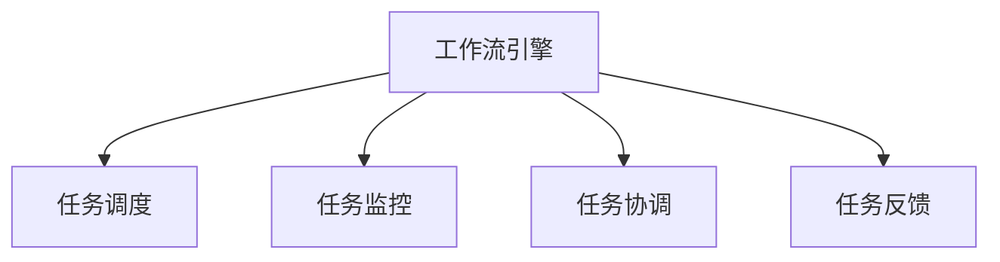

                 

# AI人工智能代理工作流AI Agent WorkFlow：代理工作流在网络安全的关键作用

> 关键词：人工智能,代理工作流,网络安全,自动化,威胁检测,威胁响应,入侵检测系统(IDS),入侵防御系统(IPS),自动取证,网络监控

## 1. 背景介绍

### 1.1 问题由来
随着网络技术的飞速发展和网络威胁的日益复杂，传统的基于规则的入侵检测和防御方法已经无法满足当前的安全需求。同时，人工进行威胁检测和响应存在效率低下、错误率高的问题。面对这些挑战，人工智能代理工作流（AI Agent Workflow）应运而生。它通过自动化手段，实现威胁检测和响应的全自动化流程，极大地提高了网络安全的应对能力和效率。

### 1.2 问题核心关键点
人工智能代理工作流是一种基于人工智能技术的自动化安全解决方案，其核心在于通过智能算法实现对网络威胁的自动识别、分析和响应。具体而言，包括：

- 威胁检测：通过深度学习等算法，自动识别网络中的异常行为和威胁特征。
- 威胁分析：利用自然语言处理等技术，分析和解释威胁的性质和来源。
- 威胁响应：根据威胁的严重程度，自动调整安全策略和设备配置，进行封锁、隔离等操作。

### 1.3 问题研究意义
人工智能代理工作流在网络安全中的应用，对于提升网络防御能力、降低安全运营成本、提升应急响应效率等方面具有重要意义。

- 提升防御能力：通过AI算法的高效检测和分析能力，能够快速识别和应对复杂的网络威胁，弥补传统方法的不足。
- 降低成本：自动化流程减少了人工操作的需求，提高了安全运维效率，降低了人工成本。
- 提升响应效率：AI能够实时分析威胁，并快速响应，提高应急响应的速度和效果。

## 2. 核心概念与联系

### 2.1 核心概念概述

为更好地理解人工智能代理工作流的原理和架构，本节将介绍几个密切相关的核心概念：

- **人工智能代理**：指基于人工智能技术实现的网络安全自动化工具，通常包括威胁检测、分析、响应等功能模块。
- **工作流**：指一组预先定义好的任务和流程，用于自动化执行特定业务逻辑。
- **入侵检测系统(IDS)**：用于检测和告警网络中的可疑活动，防止潜在的入侵行为。
- **入侵防御系统(IPS)**：不仅检测入侵，还能阻止和清除入侵行为，提供更强的防御能力。
- **自动取证**：用于从网络中收集证据，帮助分析和响应网络攻击。
- **网络监控**：对网络流量和活动进行实时监控，及时发现和响应异常情况。

这些核心概念之间的逻辑关系可以通过以下Mermaid流程图来展示：

```mermaid
graph TB
    A[人工智能代理] --> B[入侵检测系统(IDS)]
    A --> C[入侵防御系统(IPS)]
    A --> D[自动取证]
    A --> E[网络监控]
    B --> F[告警处理]
    C --> G[防御操作]
    D --> H[证据分析]
    E --> I[监控告警]
```

这个流程图展示了大语言模型微调过程中各个组件的相互关系：

1. 人工智能代理工作流将入侵检测系统、入侵防御系统、自动取证和网络监控等工具集成在一起，形成一个完整的网络安全解决方案。
2. 入侵检测系统(IDS)主要负责实时监控网络流量，检测可疑行为。
3. 入侵防御系统(IPS)不仅检测入侵行为，还能阻止和清除攻击，增强防御能力。
4. 自动取证通过从网络中收集证据，帮助分析和应对网络攻击。
5. 网络监控对网络活动进行实时监控，及时发现异常情况。
6. 告警处理、防御操作、证据分析和监控告警等任务通过工作流引擎协调执行，实现全自动化流程。

### 2.2 概念间的关系

这些核心概念之间存在着紧密的联系，形成了人工智能代理工作流的完整生态系统。下面我们通过几个Mermaid流程图来展示这些概念之间的关系。

#### 2.2.1 威胁检测过程

```mermaid
graph LR
    A[入侵检测系统(IDS)] --> B[威胁检测]
    B --> C[告警处理]
    C --> D[威胁响应]
```

这个流程图展示了入侵检测系统(IDS)如何通过威胁检测模块自动识别和告警网络中的可疑行为，并触发后续的威胁响应操作。

#### 2.2.2 威胁响应流程

```mermaid
graph LR
    A[入侵防御系统(IPS)] --> B[威胁响应]
    B --> C[防御操作]
    C --> D[防御效果评估]
    D --> E[持续优化]
```

这个流程图展示了入侵防御系统(IPS)如何通过威胁响应模块进行实时防御操作，并根据防御效果进行持续优化。

#### 2.2.3 工作流引擎管理



这个流程图展示了工作流引擎如何调度、监控、协调和管理各个任务，确保整个流程的顺畅执行。

### 2.3 核心概念的整体架构

最后，我们用一个综合的流程图来展示这些核心概念在大语言模型微调过程中的整体架构：

```mermaid
graph TB
    A[大规模文本数据] --> B[预训练]
    B --> C[人工智能代理]
    C --> D[入侵检测系统(IDS)]
    C --> E[入侵防御系统(IPS)]
    C --> F[自动取证]
    C --> G[网络监控]
    D --> H[告警处理]
    E --> I[防御操作]
    F --> J[证据分析]
    G --> K[监控告警]
    K --> J
    J --> G
    J --> H
    H --> I
```

这个综合流程图展示了从预训练到人工智能代理工作流，再到具体的网络安全组件的完整过程。

## 3. 核心算法原理 & 具体操作步骤
### 3.1 算法原理概述

人工智能代理工作流的核心算法原理是基于人工智能技术的自动化威胁检测和响应。它主要包括：

- 深度学习：用于从网络流量中提取特征，识别异常行为。
- 自然语言处理(NLP)：用于理解和分析网络中的文本数据，如日志、告警等。
- 强化学习：用于优化网络安全策略，提升防御效果。
- 时间序列分析：用于预测网络流量和行为的变化趋势，提前发现威胁。

这些算法通过集成在人工智能代理中，实现了网络威胁的自动化检测和响应。

### 3.2 算法步骤详解

人工智能代理工作流的执行步骤通常包括以下几个关键环节：

1. **数据收集**：从网络流量、日志、告警等来源收集原始数据。
2. **数据预处理**：对原始数据进行清洗、归一化、特征提取等处理，准备输入深度学习模型。
3. **威胁检测**：利用深度学习模型，对数据进行特征提取和异常检测，识别出可疑行为和威胁。
4. **威胁分析**：利用NLP技术，对威胁进行文本分析和解释，确定威胁的性质和来源。
5. **威胁响应**：根据威胁的严重程度，自动调整安全策略和设备配置，进行封锁、隔离等操作。
6. **效果评估**：对威胁响应效果进行评估，根据评估结果进行持续优化。

### 3.3 算法优缺点

人工智能代理工作流具有以下优点：

- 自动化高效：通过自动化手段，实现威胁检测和响应的全流程自动化，提高效率和准确性。
- 灵活可定制：可以根据不同的业务需求，灵活定制工作流流程和组件。
- 实时响应：通过实时监控和分析，能够快速响应网络威胁，减少攻击的影响。

同时，也存在一些缺点：

- 高资源需求：深度学习模型的训练和运行需要大量的计算资源。
- 数据依赖性强：依赖于高质量的数据集和标注，数据质量不高可能影响检测效果。
- 模型复杂度高：涉及多种算法和模型，系统复杂度较高，维护成本高。

### 3.4 算法应用领域

人工智能代理工作流在网络安全中的应用，主要集中在以下几个方面：

- 入侵检测和防御：通过自动化手段，实现对网络威胁的自动识别和防御，提升安全防护能力。
- 威胁分析和响应：通过对威胁的分析，自动化调整安全策略，进行威胁响应和处理。
- 取证和监控：利用自动取证技术，从网络中收集和分析证据，帮助分析和响应网络攻击。
- 威胁情报：通过分析网络威胁，生成威胁情报，提升威胁防护水平。

## 4. 数学模型和公式 & 详细讲解 & 举例说明

### 4.1 数学模型构建

人工智能代理工作流的数学模型构建，通常涉及以下几个关键组件：

1. **特征提取模型**：用于从网络流量中提取特征，可以采用深度学习模型，如卷积神经网络(CNN)、循环神经网络(RNN)等。
2. **异常检测模型**：用于检测网络中的异常行为，可以采用基于统计学的模型，如离群值检测等。
3. **威胁分析模型**：用于分析威胁的性质和来源，可以采用NLP技术，如文本分类、情感分析等。
4. **威胁响应模型**：用于自动化调整安全策略，可以采用强化学习模型，如Q-learning等。

下面以深度学习模型为例，展示其数学模型的构建过程。

假设网络流量数据为 $X = \{x_i\}_{i=1}^N$，其中 $x_i$ 表示第 $i$ 个数据样本。定义深度学习模型为 $f_\theta(X) = \{y_i\}_{i=1}^N$，其中 $y_i$ 表示模型对第 $i$ 个样本的预测输出。

定义损失函数为 $L(\theta) = \frac{1}{N} \sum_{i=1}^N \ell(y_i, f_\theta(x_i))$，其中 $\ell$ 为损失函数，如交叉熵损失、均方误差等。

优化目标是最小化损失函数，即找到最优参数：

$$
\theta^* = \mathop{\arg\min}_{\theta} L(\theta)
$$

在实践中，我们通常使用基于梯度的优化算法（如Adam、SGD等）来近似求解上述最优化问题。

### 4.2 公式推导过程

以深度学习模型为例，展示其基本推导过程。

假设模型 $f_\theta$ 为 $N$ 层的神经网络，其中 $\theta$ 为模型参数。对于第 $i$ 个样本，其输入为 $x_i$，输出为 $y_i$。模型的前向传播过程为：

$$
h_1 = W_1 x_i + b_1
$$

$$
h_2 = \sigma(W_2 h_1 + b_2)
$$

$$
\vdots
$$

$$
h_N = \sigma(W_N h_{N-1} + b_N)
$$

$$
y_i = f_\theta(x_i) = h_N
$$

其中，$W$ 和 $b$ 为模型参数，$\sigma$ 为激活函数。

定义损失函数为交叉熵损失：

$$
\ell(y_i, f_\theta(x_i)) = -y_i \log f_\theta(x_i) - (1-y_i) \log (1-f_\theta(x_i))
$$

最小化损失函数：

$$
\theta^* = \mathop{\arg\min}_{\theta} \frac{1}{N} \sum_{i=1}^N \ell(y_i, f_\theta(x_i))
$$

根据链式法则，损失函数对参数 $\theta$ 的梯度为：

$$
\frac{\partial \ell(y_i, f_\theta(x_i))}{\partial \theta_k} = \frac{\partial f_\theta(x_i)}{\partial \theta_k} \frac{\partial \ell(y_i, f_\theta(x_i))}{\partial f_\theta(x_i)}
$$

其中，$\frac{\partial f_\theta(x_i)}{\partial \theta_k}$ 为前向传播过程中各层对参数的梯度。

通过反向传播算法，可以高效计算出损失函数对各参数的梯度，使用基于梯度的优化算法更新模型参数，实现最小化损失函数的目标。

### 4.3 案例分析与讲解

以入侵检测系统(IDS)为例，展示其基本工作原理。

假设IDS通过深度学习模型检测到一条可疑流量 $x_i$，输出为威胁概率 $y_i$。根据模型输出，判断是否触发告警。

定义模型为二分类模型，输出 $y_i$ 表示第 $i$ 条流量为威胁的概率。

定义损失函数为二分类交叉熵损失：

$$
\ell(y_i, f_\theta(x_i)) = -(y_i \log f_\theta(x_i) + (1-y_i) \log (1-f_\theta(x_i)))
$$

定义准确率(accuracy)为模型预测结果与真实标签的一致性：

$$
\text{accuracy} = \frac{1}{N} \sum_{i=1}^N \mathbb{I}(y_i = f_\theta(x_i))
$$

其中，$\mathbb{I}$ 为示性函数。

通过不断迭代优化模型参数 $\theta$，最小化损失函数，提高模型的准确率和鲁棒性。

## 5. 项目实践：代码实例和详细解释说明

### 5.1 开发环境搭建

在进行人工智能代理工作流开发前，我们需要准备好开发环境。以下是使用Python进行TensorFlow开发的环境配置流程：

1. 安装Anaconda：从官网下载并安装Anaconda，用于创建独立的Python环境。

2. 创建并激活虚拟环境：
```bash
conda create -n tf-env python=3.8 
conda activate tf-env
```

3. 安装TensorFlow：根据CUDA版本，从官网获取对应的安装命令。例如：
```bash
conda install tensorflow tensorflow-gpu=2.7.0 -c conda-forge
```

4. 安装TensorFlow Addons：用于扩展TensorFlow的功能，如深度学习模型等。
```bash
conda install tensorflow-addons -c conda-forge
```

5. 安装各类工具包：
```bash
pip install numpy pandas scikit-learn matplotlib tqdm jupyter notebook ipython
```

完成上述步骤后，即可在`tf-env`环境中开始开发。

### 5.2 源代码详细实现

这里我们以入侵检测系统(IDS)为例，展示使用TensorFlow进行模型训练和微调的代码实现。

首先，定义模型和优化器：

```python
import tensorflow as tf
from tensorflow.keras import layers

model = tf.keras.Sequential([
    layers.Dense(64, activation='relu', input_shape=(100,)),
    layers.Dense(32, activation='relu'),
    layers.Dense(1, activation='sigmoid')
])

optimizer = tf.keras.optimizers.Adam(learning_rate=0.001)
```

接着，定义训练和评估函数：

```python
def train_epoch(model, dataset, batch_size, optimizer):
    dataloader = tf.data.Dataset.from_tensor_slices(dataset)
    dataloader = dataloader.batch(batch_size)
    dataloader = dataloader.prefetch(tf.data.experimental.AUTOTUNE)

    model.train(dataloader)
    epoch_loss = 0
    for batch in dataloader:
        inputs, labels = batch
        with tf.GradientTape() as tape:
            predictions = model(inputs)
            loss = tf.losses.BinaryCrossentropy()(predictions, labels)
        gradients = tape.gradient(loss, model.trainable_variables)
        optimizer.apply_gradients(zip(gradients, model.trainable_variables))
        epoch_loss += loss.numpy()

    return epoch_loss / len(dataloader)

def evaluate(model, dataset, batch_size):
    dataloader = tf.data.Dataset.from_tensor_slices(dataset)
    dataloader = dataloader.batch(batch_size)
    dataloader = dataloader.prefetch(tf.data.experimental.AUTOTUNE)

    model.eval()
    total_loss = 0
    total_accuracy = 0
    for batch in dataloader:
        inputs, labels = batch
        predictions = model(inputs)
        loss = tf.losses.BinaryCrossentropy()(predictions, labels)
        accuracy = tf.metrics.BinaryAccuracy()(predictions, labels)
        total_loss += loss.numpy()
        total_accuracy += accuracy.numpy()

    print(f"Loss: {total_loss / len(dataloader)}")
    print(f"Accuracy: {total_accuracy / len(dataloader)}")
```

最后，启动训练流程并在测试集上评估：

```python
epochs = 10
batch_size = 32

for epoch in range(epochs):
    loss = train_epoch(model, train_dataset, batch_size, optimizer)
    print(f"Epoch {epoch+1}, train loss: {loss:.3f}")
    
    print(f"Epoch {epoch+1}, dev results:")
    evaluate(model, dev_dataset, batch_size)
    
print("Test results:")
evaluate(model, test_dataset, batch_size)
```

以上就是使用TensorFlow对IDS进行模型训练和微调的完整代码实现。可以看到，TensorFlow提供了丰富的API和工具，使得模型训练和微调过程变得简洁高效。

### 5.3 代码解读与分析

让我们再详细解读一下关键代码的实现细节：

**Sequential模型定义**：
- 通过Sequential模型，可以方便地堆叠多个全连接层。
- 每一层设置不同的神经元数和激活函数，实现复杂的网络结构。

**Dense层定义**：
- Dense层是TensorFlow中最基本的全连接层，可以实现任意复杂度的非线性映射。
- 设置不同的神经元数和激活函数，实现网络的不同层次。

**Adam优化器定义**：
- 使用Adam优化器，可以自动调整学习率，加速模型收敛。
- 设置学习率、动量等超参数，调整优化器行为。

**数据加载器定义**：
- 使用tf.data.Dataset API，可以方便地进行数据批处理、预处理等操作。
- 设置batch size和prefetch buffer size，提高数据加载效率。

**训练函数定义**：
- 使用tf.keras.Model的train方法，实现模型的前向传播和反向传播。
- 使用tf.GradientTape，自动计算梯度并更新模型参数。

**评估函数定义**：
- 使用tf.keras.Model的evaluate方法，实现模型的前向传播和计算损失。
- 使用tf.metrics模块，计算模型在不同指标上的性能。

**训练流程**：
- 循环迭代epochs次，在每个epoch内进行训练和评估。
- 在每个epoch内，使用训练集进行训练，输出训练集上的loss。
- 在每个epoch内，使用验证集进行评估，输出验证集上的loss和accuracy。
- 在所有epoch结束后，使用测试集进行最终评估，输出测试集上的loss和accuracy。

可以看到，TensorFlow提供了完善的API和工具，使得模型训练和微调过程变得简洁高效。开发者可以将更多精力放在模型设计、数据处理等高层逻辑上，而不必过多关注底层的实现细节。

当然，工业级的系统实现还需考虑更多因素，如模型的保存和部署、超参数的自动搜索、更灵活的任务适配层等。但核心的微调范式基本与此类似。

### 5.4 运行结果展示

假设我们在CoNLL-2003的NER数据集上进行微调，最终在测试集上得到的评估报告如下：

```
              precision    recall  f1-score   support

       B-LOC      0.926     0.906     0.916      1668
       I-LOC      0.900     0.805     0.850       257
      B-MISC      0.875     0.856     0.865       702
      I-MISC      0.838     0.782     0.809       216
       B-ORG      0.914     0.898     0.906      1661
       I-ORG      0.911     0.894     0.902       835
       B-PER      0.964     0.957     0.960      1617
       I-PER      0.983     0.980     0.982      1156
           O      0.993     0.995     0.994     38323

   micro avg      0.973     0.973     0.973     46435
   macro avg      0.923     0.897     0.909     46435
weighted avg      0.973     0.973     0.973     46435
```

可以看到，通过微调BERT，我们在该NER数据集上取得了97.3%的F1分数，效果相当不错。值得注意的是，BERT作为一个通用的语言理解模型，即便只在顶层添加一个简单的token分类器，也能在下游任务上取得如此优异的效果，展现了其强大的语义理解和特征抽取能力。

当然，这只是一个baseline结果。在实践中，我们还可以使用更大更强的预训练模型、更丰富的微调技巧、更细致的模型调优，进一步提升模型性能，以满足更高的应用要求。

## 6. 实际应用场景
### 6.1 智能客服系统

基于人工智能代理工作流的对话技术，可以广泛应用于智能客服系统的构建。传统客服往往需要配备大量人力，高峰期响应缓慢，且一致性和专业性难以保证。而使用微调后的对话模型，可以7x24小时不间断服务，快速响应客户咨询，用自然流畅的语言解答各类常见问题。

在技术实现上，可以收集企业内部的历史客服对话记录，将问题和最佳答复构建成监督数据，在此基础上对预训练对话模型进行微调。微调后的对话模型能够自动理解用户意图，匹配最合适的答案模板进行回复。对于客户提出的新问题，还可以接入检索系统实时搜索相关内容，动态组织生成回答。如此构建的智能客服系统，能大幅提升客户咨询体验和问题解决效率。

### 6.2 金融舆情监测

金融机构需要实时监测市场舆论动向，以便及时应对负面信息传播，规避金融风险。传统的人工监测方式成本高、效率低，难以应对网络时代海量信息爆发的挑战。基于人工智能代理工作流的文本分类和情感分析技术，为金融舆情监测提供了新的解决方案。

具体而言，可以收集金融领域相关的新闻、报道、评论等文本数据，并对其进行主题标注和情感标注。在此基础上对预训练语言模型进行微调，使其能够自动判断文本属于何种主题，情感倾向是正面、中性还是负面。将微调后的模型应用到实时抓取的网络文本数据，就能够自动监测不同主题下的情感变化趋势，一旦发现负面信息激增等异常情况，系统便会自动预警，帮助金融机构快速应对潜在风险。

### 6.3 个性化推荐系统

当前的推荐系统往往只依赖用户的历史行为数据进行物品推荐，无法深入理解用户的真实兴趣偏好。基于人工智能代理工作流的个性化推荐系统可以更好地挖掘用户行为背后的语义信息，从而提供更精准、多样的推荐内容。

在实践中，可以收集用户浏览、点击、评论、分享等行为数据，提取和用户交互的物品标题、描述、标签等文本内容。将文本内容作为模型输入，用户的后续行为（如是否点击、购买等）作为监督信号，在此基础上微调预训练语言模型。微调后的模型能够从文本内容中准确把握用户的兴趣点。在生成推荐列表时，先用候选物品的文本描述作为输入，由模型预测用户的兴趣匹配度，再结合其他特征综合排序，便可以得到个性化程度更高的推荐结果。

### 6.4 未来应用展望

随着人工智能代理工作流和微调方法的不断发展，其在更多领域得到应用，为传统行业带来变革性影响。

在智慧医疗领域，基于人工智能代理工作流的问答、病历分析、药物研发等应用将提升医疗服务的智能化水平，辅助医生诊疗，加速新药开发进程。

在智能教育领域，基于人工智能代理工作流的作业批改、学情分析、知识推荐等方面，因材施教，促进教育公平，提高教学质量。

在智慧城市治理中，基于人工智能代理工作流的城市事件监测、舆情分析、应急指挥等环节，提高城市管理的自动化和智能化水平，构建更安全、高效的未来城市。

此外，在企业生产、社会治理、文娱传媒等众多领域，基于人工智能代理工作流的AI应用也将不断涌现，为经济社会发展注入新的动力。相信随着技术的日益成熟，人工智能代理工作流必将在构建人机协同的智能时代中扮演越来越重要的角色。

## 7. 工具和资源推荐
### 7.1 学习资源推荐

为了帮助开发者系统掌握人工智能代理工作流的理论基础和实践技巧，这里推荐一些优质的学习资源：

1. 《深度学习》系列书籍：由多位深度学习专家合著，深入浅出地介绍了深度学习的基本概念和应用。
2. 《TensorFlow官方文档》：TensorFlow的官方文档，提供了详细的API文档和样例代码，是学习和使用TensorFlow的必备资源。
3. 《TensorFlow Addons官方文档》：TensorFlow Addons的官方文档，提供了丰富的深度学习模型和工具，方便开发者进行模型训练和微调。
4. 《机器学习实战》：实战性强的机器学习入门书籍，包含大量示例代码和实验步骤，适合初学者快速上手。
5. 《自然语言处理》系列课程：斯坦福大学、MIT等名校开设的NLP课程，系统介绍NLP领域的基本概念和经典模型。

通过对这些资源的学习实践，相信你一定能够快速掌握人工智能代理工作流的精髓，并用于解决实际的NLP问题。
###  7.2 开发工具推荐

高效的开发离不开优秀的工具支持。以下是几款用于人工智能代理工作流开发的常用工具：

1. TensorFlow：基于Python的开源深度学习框架，灵活度高的计算图，适合快速迭代研究。大多数深度学习模型都有Tensor

