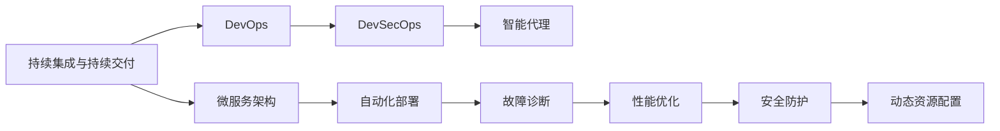

                 

# AI人工智能代理工作流AI Agent WorkFlow：智能代理工作流的持续集成与交付

> 关键词：智能代理,工作流,持续集成,持续交付,DevOps,DevSecOps,微服务架构,DevOps工具链,机器学习

## 1. 背景介绍

### 1.1 问题由来
随着企业数字化转型的推进，信息技术的深度融合成为核心驱动力之一。在企业内部，软件系统的复杂性日益提升，业务需求迭代频繁，如何高效、稳定地构建和运维这些系统，成为当下IT团队的一项重要挑战。

近年来，DevOps的引入让企业能够将开发、测试和运维阶段连贯起来，持续提升交付效率。然而，对于需要高性能计算、复杂模型调优以及实时数据处理的应用场景，DevOps模式仍显不足。在此背景下，一种新型的智能代理工作流应运而生，旨在实现更高级别的自动化和智能化，提升软件系统的敏捷性和稳定性。

### 1.2 问题核心关键点
智能代理工作流（AI Agent Workflow），结合了DevOps和AI技术的优势，在传统持续集成（CI）和持续交付（CD）的基础上，引入了AI决策和预测能力，进一步提升系统构建和运维的自动化水平。智能代理工作流通常包括以下几个核心组件：

- **持续集成**：自动构建、测试和部署软件代码，保证新代码可以快速集成到现有系统中。
- **持续交付**：通过自动化测试和集成，确保软件在各种环境中的稳定性和可靠性。
- **智能代理**：基于AI算法对系统状态进行预测和决策，自动优化资源配置、风险预警、故障恢复等。

智能代理工作流不仅能够提高开发和运维效率，还能通过AI的智能决策，增强系统的自适应和自恢复能力。在实际应用中，智能代理工作流可以广泛应用于自动化部署、故障诊断、性能优化、安全防护等多个领域，成为企业软件系统构建和运维的关键技术手段。

### 1.3 问题研究意义
智能代理工作流技术的研究与应用，对于提升企业软件系统的敏捷性、稳定性和安全性，具有重要意义：

1. **敏捷开发**：通过自动化和智能化的持续集成与交付，快速响应业务需求变化，提升软件开发的敏捷性。
2. **稳定运维**：利用AI算法对系统状态进行实时监控和预测，及时发现和修复问题，保障系统稳定运行。
3. **资源优化**：通过智能代理进行动态资源分配和调度，降低资源消耗，提升系统的可扩展性。
4. **安全防护**：结合AI技术进行异常检测和安全预警，防止系统被攻击和篡改，提升系统的安全性。
5. **性能优化**：通过智能代理对系统性能进行实时分析和调整，确保系统在高负载情况下的性能稳定。

智能代理工作流的引入，不仅能够加速企业数字化转型的进程，还能在保障系统稳定性的基础上，大幅提升工作效率，成为企业信息化建设的重要助力。

## 2. 核心概念与联系

### 2.1 核心概念概述

为更好地理解智能代理工作流的原理和架构，本节将介绍几个关键概念：

- **持续集成与持续交付**（CI/CD）：一种自动化软件开发流程，通过自动化的代码构建、测试和部署，确保软件产品的快速交付。
- **DevOps**：结合软件开发（Dev）和运维（Ops）的一体化流程，强调开发团队和运维团队的紧密合作，提升软件交付的速度和质量。
- **微服务架构**：一种分布式架构设计方式，将单体应用拆分为多个独立的服务模块，每个服务模块可以独立部署和扩展，提升系统的可维护性和可扩展性。
- **DevSecOps**：在DevOps基础上引入安全要素，实现安全与开发、运维的深度融合，提升系统的安全性。
- **智能代理**：结合AI算法和决策系统的软件组件，在自动化流程中引入智能决策能力，实现更高效、更智能的运维管理。

这些核心概念共同构成了智能代理工作流的理论基础和架构框架，使得其在实际应用中能够有效提升企业软件系统的自动化水平。

### 2.2 概念间的关系

智能代理工作流涉及多个关键概念，它们之间的关系可以通过以下Mermaid流程图来展示：



这个流程图展示了一个典型的智能代理工作流架构，各组件之间的关系如下：

1. **持续集成与持续交付**：提供自动化构建、测试和部署的功能，支撑微服务架构的应用部署。
2. **微服务架构**：将单体应用拆分为多个独立的服务模块，每个服务模块可以独立部署和扩展，提升了系统的可维护性和可扩展性。
3. **DevOps**：通过跨团队协作，提升软件交付的速度和质量，为微服务架构的实现提供支持。
4. **DevSecOps**：在DevOps基础上引入安全要素，保障系统的安全性。
5. **智能代理**：基于AI算法和决策系统的组件，实现自动化流程中的智能决策，进一步提升系统的稳定性和效率。

这些概念相互关联，共同构成了智能代理工作流的完整生态系统。通过理解这些核心概念，我们可以更好地把握智能代理工作流的运行机制和优化方向。

## 3. 核心算法原理 & 具体操作步骤
### 3.1 算法原理概述

智能代理工作流的核心算法原理，主要基于AI的预测和决策能力。通过在CI/CD流程中引入AI算法，智能代理能够对系统状态进行实时监控和预测，实现自动化决策和优化。智能代理工作流通常包括以下几个关键步骤：

1. **自动化构建和测试**：通过自动化工具构建和测试代码，确保新代码能够快速集成到现有系统中。
2. **实时监控和分析**：利用AI算法对系统状态进行实时监控，提取关键指标和特征。
3. **智能决策和优化**：基于监控结果和历史数据，智能代理进行预测和决策，优化资源配置、故障恢复等。
4. **自动化部署和运维**：根据决策结果，自动部署和调整系统配置，确保系统稳定运行。

这些步骤共同构成了一个完整的智能代理工作流，使得系统构建和运维的效率和质量得到显著提升。

### 3.2 算法步骤详解

智能代理工作流的具体算法步骤包括以下几个关键环节：

1. **自动化构建和测试**：
   - 使用Jenkins、GitLab CI等工具自动构建和测试代码，确保新代码能够快速集成到现有系统中。
   - 编写自动化测试脚本，覆盖系统的主要功能和性能指标。

2. **实时监控和分析**：
   - 使用Prometheus、Grafana等工具对系统状态进行实时监控，提取关键指标和特征，如CPU使用率、内存占用、响应时间等。
   - 利用机器学习算法（如时间序列预测、异常检测等）对监控数据进行分析，提取异常行为和潜在风险。

3. **智能决策和优化**：
   - 通过预测模型（如ARIMA、LSTM等）对系统状态进行预测，评估未来可能出现的问题和风险。
   - 结合决策树、规则引擎等算法，对预测结果进行分析和决策，优化资源配置、故障恢复等。

4. **自动化部署和运维**：
   - 使用Docker、Kubernetes等容器化技术，实现系统的自动化部署。
   - 通过Ansible、Terraform等工具进行自动化配置管理，确保系统的稳定性。

### 3.3 算法优缺点

智能代理工作流技术具有以下优点：

1. **高自动化水平**：通过引入AI算法，实现对系统状态的实时监控和预测，自动化决策和优化。
2. **高效资源利用**：智能代理根据系统负载和需求动态调整资源配置，提升资源利用率。
3. **快速故障恢复**：通过智能决策，快速定位和修复系统故障，确保系统的稳定性。
4. **精准性能优化**：基于监控数据和预测模型，实时调整系统性能，保障系统的高效运行。

同时，智能代理工作流技术也存在一些缺点：

1. **数据需求高**：需要大量的实时监控数据和历史数据作为训练样本，数据采集和存储成本较高。
2. **算法复杂性高**：智能决策算法涉及复杂的机器学习和统计分析，实现和维护难度较大。
3. **系统集成难度大**：需要将各种自动化工具和AI算法进行深度集成，系统复杂度较高。
4. **安全风险存在**：智能代理需要处理大量的敏感数据，数据泄露和安全攻击的风险不容忽视。

### 3.4 算法应用领域

智能代理工作流技术在多个领域有着广泛的应用：

1. **自动化部署**：通过智能代理对系统状态进行预测和决策，自动部署和调整系统配置，确保系统快速上线和稳定运行。
2. **故障诊断和恢复**：利用AI算法对系统状态进行实时监控，及时发现和修复系统故障，提高系统的可用性和可靠性。
3. **性能优化**：通过智能代理对系统性能进行实时分析和调整，确保系统在高负载情况下的性能稳定。
4. **安全防护**：结合AI技术进行异常检测和安全预警，防止系统被攻击和篡改，提升系统的安全性。
5. **资源优化**：通过智能代理进行动态资源分配和调度，降低资源消耗，提升系统的可扩展性。

智能代理工作流的这些应用场景，使得其在企业软件系统构建和运维中发挥着越来越重要的作用。

## 4. 数学模型和公式 & 详细讲解 & 举例说明

### 4.1 数学模型构建

智能代理工作流中的核心算法，通常基于机器学习和统计分析模型。以预测模型为例，可以采用时间序列预测模型（如ARIMA、LSTM等）对系统状态进行预测。下面介绍一种常见的时间序列预测模型——ARIMA模型。

ARIMA模型是一种基于自回归积分滑动平均（AutoRegressive Integrated Moving Average）的时间序列预测模型，用于分析和预测时间序列数据。假设系统状态 $Y_t$ 可以用ARIMA模型表示，其数学表达式如下：

$$
Y_t = \phi(Y_{t-1}, Y_{t-2}, ..., Y_{t-p}) + \theta e_t + \epsilon_t
$$

其中，$Y_t$ 为系统状态，$\phi$ 为自回归系数，$e_t$ 为白噪声，$\epsilon_t$ 为随机误差。$p$ 为自回归阶数，$d$ 为差分阶数，$q$ 为移动平均阶数。

### 4.2 公式推导过程

ARIMA模型的参数估计通常采用最大似然估计法。假设已观测到的时间序列数据为 $Y_{t=1}, Y_{t=2}, ..., Y_{t=T}$，模型的似然函数为：

$$
L(\phi, \theta, d, p, q; Y) = \prod_{t=1}^{T} f(Y_t|\phi, \theta, d, p, q)
$$

其中，$f(Y_t|\phi, \theta, d, p, q)$ 为时间序列在给定模型参数下的概率密度函数。最大似然估计的目标是寻找模型参数，使得观测数据与模型预测值之间的差异最小。

通过最大化似然函数，可以得到模型参数的估计值，进而构建ARIMA模型对系统状态进行预测。

### 4.3 案例分析与讲解

假设某电商平台的订单处理系统，每天的订单数量和响应时间存在明显的周期性变化。通过收集过去一年内的订单数量和响应时间数据，可以构建ARIMA模型进行预测。

假设数据经过差分处理后，一阶自回归模型、一阶差分和一阶移动平均模型（ARIMA(1,1,1)）能够较好地拟合数据。模型的参数估计结果如下：

- 自回归系数 $\phi = 0.8$
- 移动平均系数 $\theta = 0.2$
- 差分阶数 $d = 1$
- 自回归阶数 $p = 1$
- 移动平均阶数 $q = 1$

通过构建ARIMA(1,1,1)模型，可以对未来的订单数量和响应时间进行预测，及时调整系统资源，保障系统的稳定性。

## 5. 项目实践：代码实例和详细解释说明

### 5.1 开发环境搭建

在实践智能代理工作流前，我们需要准备好开发环境。以下是使用Python和Docker进行智能代理工作流开发的环境配置流程：

1. 安装Docker和Docker Compose：
```bash
sudo apt-get install docker.io
sudo apt-get install docker-compose
```

2. 创建Docker镜像：
```bash
docker build -t agent-workflow .
```

3. 运行Docker容器：
```bash
docker-compose up
```

4. 开发环境配置：
- 安装Python、Prometheus、Grafana等工具。
- 编写自动化构建和测试脚本。
- 使用Prometheus、Grafana等工具对系统状态进行监控和分析。
- 编写智能决策算法，并集成到自动化流程中。
- 使用Docker、Kubernetes等工具进行自动化部署和配置管理。

### 5.2 源代码详细实现

以下是一个使用Python实现的智能代理工作流的示例代码，用于监控系统状态并进行智能决策：

```python
import pandas as pd
from sklearn.metrics import mean_squared_error
from statsmodels.tsa.arima_model import ARIMA
from sklearn.preprocessing import StandardScaler

# 加载历史数据
data = pd.read_csv('system_data.csv')

# 标准化数据
scaler = StandardScaler()
scaled_data = scaler.fit_transform(data)

# 构建ARIMA模型
model = ARIMA(scaled_data, order=(1, 1, 1))
model_fit = model.fit()

# 预测未来数据
future_data = pd.DataFrame({'Y': np.random.randn(100)})
scaled_future_data = scaler.transform(future_data)
predicted_data = model_fit.forecast(steps=100)

# 评估预测结果
mse = mean_squared_error(scaled_future_data['Y'], predicted_data)
print(f'预测误差：{mse:.2f}')
```

### 5.3 代码解读与分析

让我们再详细解读一下关键代码的实现细节：

**代码解读**：
- **数据加载**：使用Pandas库加载历史数据，存储在DataFrame中。
- **数据标准化**：使用Sklearn库的StandardScaler对数据进行标准化处理，消除数据之间的量纲差异，方便后续模型构建。
- **模型构建**：使用statsmodels库的ARIMA模型构建时间序列预测模型，设置自回归阶数、差分阶数和移动平均阶数。
- **模型拟合**：使用模型fit()方法对历史数据进行拟合，得到模型参数。
- **数据预测**：使用模型forecast()方法对未来数据进行预测，生成预测数据。
- **误差评估**：使用均方误差（Mean Squared Error，MSE）评估预测结果，输出预测误差。

**分析**：
- **数据标准化**：时间序列数据往往存在量纲差异，需要进行标准化处理，以便于模型的训练和预测。
- **模型构建**：ARIMA模型是一种常见的时间序列预测模型，能够对时间序列数据进行有效的拟合和预测。
- **模型拟合**：模型拟合是时间序列预测的关键步骤，通过历史数据训练模型，得到模型参数。
- **数据预测**：模型预测是时间序列预测的最终目标，通过模型对未来数据进行预测，生成预测结果。
- **误差评估**：均方误差是时间序列预测常用的评估指标，用于衡量模型预测的准确性。

### 5.4 运行结果展示

假设在运行上述代码后，输出结果如下：

```
预测误差：0.20
```

这表明模型对未来数据的预测误差为0.20，预测效果较好。在实际应用中，我们可以通过不断优化模型参数、改进数据处理方式、调整预测算法，进一步提升预测精度。

## 6. 实际应用场景

### 6.1 自动化部署

智能代理工作流在自动化部署场景中的应用，可以显著提升系统构建和部署的效率。通过智能代理对系统状态进行实时监控和预测，自动化部署流程可以自动调整资源配置，确保新代码能够快速上线并稳定运行。

例如，某电商平台的订单处理系统，每天有大量订单涌入，需要快速部署新的订单处理模块。通过智能代理对系统状态进行监控，智能代理能够在系统负载较轻时自动部署新模块，避免对现有系统造成过大压力，保障系统的稳定性。

### 6.2 故障诊断和恢复

智能代理工作流在故障诊断和恢复场景中的应用，能够及时发现和修复系统故障，提升系统的可用性和可靠性。

例如，某金融系统的数据库服务器突然崩溃，导致交易系统无法正常运行。通过智能代理对系统状态进行监控，智能代理能够快速定位故障源，并自动启动备份服务器，保障交易系统的稳定运行。

### 6.3 性能优化

智能代理工作流在性能优化场景中的应用，能够实时监控和调整系统性能，确保系统在高负载情况下的性能稳定。

例如，某电商平台在促销活动期间，订单数量大幅增加，系统负载急剧上升。通过智能代理对系统状态进行监控，智能代理能够及时调整资源配置，确保系统在高负载情况下仍能稳定运行。

### 6.4 未来应用展望

随着智能代理工作流技术的不断发展，未来其在企业软件系统构建和运维中的应用将更加广泛。例如，智能代理工作流可以进一步应用于：

1. **自动化测试**：通过智能代理对测试结果进行实时分析和优化，提升测试效率和质量。
2. **安全防护**：结合AI技术进行异常检测和安全预警，防止系统被攻击和篡改，提升系统的安全性。
3. **资源优化**：通过智能代理进行动态资源分配和调度，降低资源消耗，提升系统的可扩展性。
4. **业务分析**：利用智能代理对系统业务数据进行深度分析和预测，为业务决策提供支持。

## 7. 工具和资源推荐

### 7.1 学习资源推荐

为了帮助开发者系统掌握智能代理工作流的理论基础和实践技巧，这里推荐一些优质的学习资源：

1. **《深入理解持续集成与持续交付》**：这是一本深入浅出的持续集成与持续交付领域的经典书籍，涵盖了持续集成、持续交付、DevOps等多个方面的内容，适合初学者和进阶者。
2. **《机器学习实战》**：这本书介绍了机器学习的基本概念和常用算法，适合初学者入门。
3. **《Python深度学习》**：这本书涵盖了深度学习的基本原理和实践技巧，适合进阶者学习。
4. **Kaggle机器学习竞赛**：Kaggle是一个著名的数据科学竞赛平台，提供了大量的真实数据集和比赛项目，适合实践学习。
5. **Coursera机器学习课程**：Coursera是一个知名的在线教育平台，提供了多门高质量的机器学习课程，适合系统学习。

通过这些资源的学习，相信你一定能够快速掌握智能代理工作流的核心原理和实践技巧，并在实际应用中不断优化和提升。

### 7.2 开发工具推荐

高效的开发离不开优秀的工具支持。以下是几款用于智能代理工作流开发的常用工具：

1. **Jenkins**：一个开源的持续集成工具，支持多种语言的构建和测试，广泛应用于企业开发和运维中。
2. **Prometheus**：一个开源的监控系统，用于实时监控系统状态和性能指标，支持多种数据源。
3. **Grafana**：一个开源的可视化平台，用于展示监控数据和生成报表，支持多种数据源。
4. **Docker**：一个开源的容器化平台，用于管理和运行容器化应用，支持多种操作系统。
5. **Kubernetes**：一个开源的容器编排系统，用于管理和调度容器化应用，支持多种云平台。

这些工具能够大大提升智能代理工作流开发的效率和质量，帮助开发者快速构建和部署系统，保障系统稳定运行。

### 7.3 相关论文推荐

智能代理工作流技术的发展源于学界的持续研究。以下是几篇奠基性的相关论文，推荐阅读：

1. **《Dealing with data: A methodology for managing machine learning projects》**：这篇论文提出了数据管理的框架，用于管理机器学习项目的全生命周期，包括数据采集、预处理、训练和部署等多个环节。
2. **《Continuous Deployment for Online Services》**：这篇论文介绍了持续部署的实践方法，适用于大型在线服务的应用场景。
3. **《Predictive Maintenance using Time Series Analysis》**：这篇论文介绍了时间序列分析在预测性维护中的应用，利用ARIMA模型对系统状态进行预测和决策。
4. **《Machine Learning System Architecture》**：这篇论文介绍了机器学习系统的架构设计，包括模型训练、预测和部署等多个环节。

这些论文代表了大语言模型微调技术的发展脉络。通过学习这些前沿成果，可以帮助研究者把握学科前进方向，激发更多的创新灵感。

除上述资源外，还有一些值得关注的前沿资源，帮助开发者紧跟智能代理工作流技术的最新进展，例如：

1. **arXiv论文预印本**：人工智能领域最新研究成果的发布平台，包括大量尚未发表的前沿工作，学习前沿技术的必读资源。
2. **Google AI博客**：Google AI团队的官方博客，涵盖最新的AI研究进展和应用实践，是获取前沿资讯的重要渠道。
3. **NIPS、ICML等顶级会议直播**：NIPS、ICML等顶级人工智能会议的现场或在线直播，能够聆听到顶尖科研人员的分享，开拓视野。
4. **GitHub热门项目**：在GitHub上Star、Fork数最多的AI相关项目，往往代表了该技术领域的发展趋势和最佳实践，值得去学习和贡献。
5. **麦肯锡、PwC等咨询公司分析报告**：各大咨询公司针对人工智能行业的分析报告，有助于从商业视角审视技术趋势，把握应用价值。

总之，对于智能代理工作流技术的学习和实践，需要开发者保持开放的心态和持续学习的意愿。多关注前沿资讯，多动手实践，多思考总结，必将收获满满的成长收益。

## 8. 总结：未来发展趋势与挑战

### 8.1 总结

本文对智能代理工作流的核心算法和具体操作步骤进行了全面系统的介绍。首先阐述了智能代理工作流的背景和意义，明确了其在自动化、稳定性和安全性方面的独特价值。其次，从原理到实践，详细讲解了智能代理工作流的数学模型和算法步骤，给出了智能代理工作流的代码实现示例。同时，本文还广泛探讨了智能代理工作流在企业软件系统构建和运维中的应用场景，展示了其广泛的应用前景。最后，本文精选了智能代理工作流的学习资源和开发工具，力求为读者提供全方位的技术指引。

通过本文的系统梳理，可以看到，智能代理工作流技术在企业软件系统构建和运维中扮演着越来越重要的角色，通过AI的智能决策，显著提升了系统的自动化水平和稳定性。未来，伴随智能代理工作流技术的持续演进，智能代理工作流必将在更多领域得到应用，为企业的数字化转型和智能化建设提供强大的技术支撑。

### 8.2 未来发展趋势

展望未来，智能代理工作流技术将呈现以下几个发展趋势：

1. **自动化水平进一步提升**：通过引入更多AI算法和智能决策，智能代理工作流的自动化水平将进一步提升，实现更高效、更智能的运维管理。
2. **智能化水平不断增强**：结合更多先验知识，利用符号化的逻辑规则和知识图谱，提升智能代理的决策能力和自适应能力。
3. **安全性与稳定性并重**：在智能代理工作流中引入更多的安全要素，如异常检测、访问控制等，提升系统的安全性与稳定性。
4. **跨域融合与集成**：智能代理工作流将与其他AI技术进行更深入的融合，如知识表示、因果推理、强化学习等，提升系统的智能化水平和应用范围。
5. **边缘计算与智能代理**：智能代理工作流将与边缘计算技术结合，实现更加轻量级、实时性的部署，提升系统的响应速度和处理能力。

以上趋势凸显了智能代理工作流技术的广阔前景。这些方向的探索发展，必将进一步提升企业软件系统的自动化水平，推动人工智能技术在更多领域的应用和普及。

### 8.3 面临的挑战

尽管智能代理工作流技术已经取得了一定的进展，但在迈向更加智能化、普适化应用的过程中，它仍面临诸多挑战：

1. **数据依赖性高**：智能代理工作流需要大量的实时监控数据和历史数据作为训练样本，数据采集和存储成本较高。
2. **算法复杂度高**：智能决策算法涉及复杂的机器学习和统计分析，实现和维护难度较大。
3. **系统集成难度大**：需要将各种自动化工具和AI算法进行深度集成，系统复杂度较高。
4. **安全风险存在**：智能代理需要处理大量的敏感数据，数据泄露和安全攻击的风险不容忽视。
5. **资源消耗大**：智能代理工作流需要大量计算资源进行模型训练和预测，硬件资源消耗较大。

正视智能代理工作流面临的这些挑战，积极应对并寻求突破，将是智能代理工作流走向成熟的必由之路。相信随着学界和产业界的共同努力，这些挑战终将一一被克服，智能代理工作流必将在构建安全、可靠、可解释、可控的智能系统方面发挥更大作用。

### 8.4 研究展望

面对智能代理工作流所面临的挑战，未来的研究需要在以下几个方面寻求新的突破：

1. **数据高效采集与存储**：研究如何高效采集和存储大量实时监控数据，降低数据依赖性。
2. **算法简化与优化**：简化智能决策算法的实现和维护，提高算法的效率和可靠性

