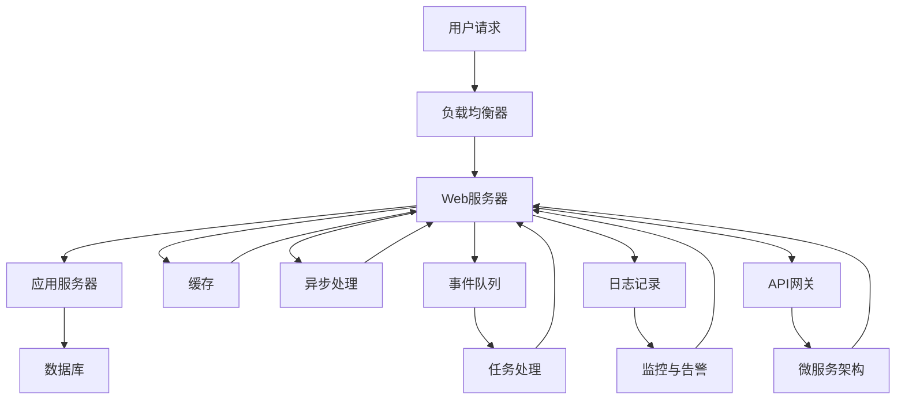

                 

# AI人工智能代理工作流AI Agent WorkFlow：高并发场景下AI代理的性能调优

## 1. 背景介绍

随着人工智能(AI)技术的迅猛发展，AI代理(Agent)在自动化、智能推荐、客户服务等多个领域的应用越来越广泛。然而，在高并发场景下，AI代理的性能调优成为一大挑战。本文将深入探讨在高并发场景下AI代理的工作流设计、性能调优策略及其实际应用，为相关领域的研究和应用提供参考。

## 2. 核心概念与联系

### 2.1 核心概念概述

1. **AI代理（Agent）**：在自动化和智能系统中，AI代理是指能够自动执行特定任务或处理特定问题的软件实体。通常由人工智能算法构成，能够进行自主决策和执行。

2. **工作流（Workflow）**：工作流是指一系列连续的、有明确顺序的任务或活动，旨在实现特定的业务目标。在AI代理中，工作流的设计决定了代理的执行流程和功能模块。

3. **高并发（High Concurrency）**：高并发指的是系统同时处理大量请求的能力。在高并发场景下，AI代理需要快速响应、高效处理大量请求，以满足业务需求。

4. **性能调优（Performance Tuning）**：性能调优是指通过优化算法、数据结构、硬件配置等手段，提升系统性能的过程。在高并发场景下，性能调优尤为关键。

5. **系统架构（Architecture）**：系统架构决定了系统的整体结构和组件间的协作方式。在高并发场景下，合理的设计架构可以大幅提升系统的性能和可扩展性。

### 2.2 核心概念原理和架构的 Mermaid 流程图



这个流程图展示了高并发场景下AI代理的工作流架构：

1. **用户请求**：用户通过网络请求启动AI代理的工作流。
2. **负载均衡器**：将请求分发到多个Web服务器。
3. **Web服务器**：处理请求，并将请求转发给应用服务器。
4. **应用服务器**：执行具体的AI代理逻辑，调用数据库和缓存。
5. **数据库**：存储和查询数据，提供数据支持。
6. **缓存**：提供数据缓存，提升数据访问速度。
7. **异步处理**：处理耗时操作，避免阻塞。
8. **事件队列**：将异步任务放入队列，依次执行。
9. **任务处理**：执行任务，调用相关API。
10. **日志记录**：记录系统运行日志，便于排查和优化。
11. **监控与告警**：监控系统性能，及时告警异常。
12. **API网关**：统一API接口，提高系统的灵活性和可维护性。
13. **微服务架构**：将系统分解为多个微服务，提高系统的可扩展性和模块化程度。

这些核心概念构成了高并发场景下AI代理的工作流架构，通过合理的设计和优化，可以有效提升系统的性能和稳定性。

## 3. 核心算法原理 & 具体操作步骤

### 3.1 算法原理概述

在高并发场景下，AI代理的性能调优主要依赖于以下算法和策略：

1. **负载均衡算法**：通过算法将请求均匀分配到多个服务器，避免服务器过载。
2. **缓存策略**：通过缓存常用数据和结果，减少数据库和网络延迟。
3. **异步处理算法**：通过异步处理耗时操作，避免阻塞其他请求。
4. **事件驱动模型**：通过事件队列和任务处理，提高系统的并发处理能力。
5. **分布式架构**：通过微服务和容器化技术，实现系统的水平扩展。

### 3.2 算法步骤详解

1. **负载均衡算法**：
   - 选择适当的负载均衡算法，如轮询、加权轮询、最少连接等。
   - 配置负载均衡器，根据算法将请求分配到不同的Web服务器。

2. **缓存策略**：
   - 设计合理的缓存策略，包括缓存失效机制、缓存更新策略等。
   - 使用缓存技术，如Redis、Memcached等，实现数据缓存。

3. **异步处理算法**：
   - 选择合适的异步处理算法，如回调、Promise等。
   - 使用异步编程模型，如Node.js的异步I/O、Python的asyncio等，实现异步处理。

4. **事件驱动模型**：
   - 设计事件队列和任务处理机制，实现任务的分发和执行。
   - 使用消息队列技术，如Kafka、RabbitMQ等，实现事件驱动。

5. **分布式架构**：
   - 使用微服务架构，将系统分解为多个独立的微服务。
   - 使用容器化技术，如Docker、Kubernetes等，实现服务的部署和管理。

### 3.3 算法优缺点

**优点**：
1. **提高性能**：通过合理的算法和策略，可以有效提升系统的性能和响应速度。
2. **提升可扩展性**：分布式架构和微服务技术可以实现系统的水平扩展，满足高并发需求。
3. **增强容错性**：异步处理和事件驱动模型可以提高系统的容错性和稳定性。

**缺点**：
1. **复杂度高**：设计和实现高并发系统需要较高的技术水平和复杂度。
2. **资源消耗大**：缓存和异步处理需要额外的资源，如内存、CPU等。
3. **系统维护困难**：高并发系统需要复杂的监控和调优，维护成本高。

### 3.4 算法应用领域

高并发场景下AI代理的性能调优技术广泛应用于以下几个领域：

1. **智能推荐系统**：通过缓存和异步处理，实现高效的数据查询和推荐。
2. **在线客服系统**：通过负载均衡和事件驱动，实现高并发的用户交互。
3. **大数据处理**：通过分布式架构和缓存策略，实现大规模数据的处理和分析。
4. **金融交易系统**：通过异步处理和微服务架构，实现高频交易的快速响应和处理。
5. **游戏服务器**：通过事件驱动和负载均衡，实现高并发用户的游戏体验。

## 4. 数学模型和公式 & 详细讲解 & 举例说明

### 4.1 数学模型构建

在高并发场景下，AI代理的性能调优可以通过以下数学模型进行建模：

设系统有 $N$ 个请求，每个请求处理时间为 $t$，响应时间为 $r$，系统负载均衡器数量为 $M$，缓存命中率 $h$，异步处理并发度 $p$，微服务数量 $S$。

则系统的总响应时间为：
$$ T = \frac{N}{M}t + \frac{N}{h}r + \frac{N}{p}t + \frac{N}{S}t $$

其中，第一个分项为负载均衡时间，第二个分项为缓存命中时间，第三个分项为异步处理时间，第四个分项为微服务处理时间。

### 4.2 公式推导过程

假设系统负载均衡器数量为 $M$，每个负载均衡器处理请求时间为 $t$，则负载均衡时间 $T_{lb}$ 为：
$$ T_{lb} = \frac{N}{M}t $$

假设缓存命中率 $h$，缓存未命中时间为 $t_c$，缓存命中时间为 $t_h$，则缓存命中时间 $T_{cache}$ 为：
$$ T_{cache} = \frac{N}{h}t_h + \frac{N(1-h)}{h}t_c $$

假设异步处理并发度 $p$，异步处理时间 $T_{async}$ 为：
$$ T_{async} = \frac{N}{p}t $$

假设微服务数量为 $S$，每个微服务处理时间为 $t_m$，则微服务处理时间 $T_{ms}$ 为：
$$ T_{ms} = \frac{N}{S}t_m $$

将上述公式代入总响应时间公式 $T$ 中，得：
$$ T = \frac{N}{M}t + \frac{N}{h}(t_h + (1-h)t_c) + \frac{N}{p}t + \frac{N}{S}t_m $$

通过优化上述公式中的参数 $M$、$h$、$p$、$S$ 等，可以实现系统的性能调优。

### 4.3 案例分析与讲解

**案例1：智能推荐系统**

假设某智能推荐系统每秒处理请求 $10^6$ 次，每个请求处理时间为 $0.01$ 秒，负载均衡器数量为 $8$，缓存命中率 $0.9$，异步处理并发度 $2$，微服务数量为 $10$，每个微服务处理时间为 $0.05$ 秒。

则系统的总响应时间为：
$$ T = \frac{10^6}{8} \times 0.01 + \frac{10^6}{0.9} \times (0.9 \times 0.01 + 0.1 \times 0.1) + \frac{10^6}{2} \times 0.01 + \frac{10^6}{10} \times 0.05 $$
$$ T \approx 12.5 + 111 + 5 + 50 = 178.5 \text{秒} $$

为了提升性能，可以优化以下参数：
1. 增加负载均衡器数量 $M$，如增加到 $16$。
2. 提高缓存命中率 $h$，如增加到 $0.95$。
3. 增加异步处理并发度 $p$，如增加到 $4$。
4. 减少微服务处理时间 $t_m$，如减少到 $0.03$ 秒。

通过优化上述参数，系统总响应时间将进一步缩短。

**案例2：在线客服系统**

假设某在线客服系统每秒处理请求 $5 \times 10^3$ 次，每个请求处理时间为 $0.5$ 秒，负载均衡器数量为 $4$，缓存命中率 $0.8$，异步处理并发度 $3$，微服务数量为 $5$，每个微服务处理时间为 $0.1$ 秒。

则系统的总响应时间为：
$$ T = \frac{5 \times 10^3}{4} \times 0.5 + \frac{5 \times 10^3}{0.8} \times (0.8 \times 0.5 + 0.2 \times 0.1) + \frac{5 \times 10^3}{3} \times 0.5 + \frac{5 \times 10^3}{5} \times 0.1 $$
$$ T \approx 627.5 + 11750 + 833.3 + 500 = 13009.8 \text{秒} $$

为了提升性能，可以优化以下参数：
1. 增加负载均衡器数量 $M$，如增加到 $8$。
2. 提高缓存命中率 $h$，如增加到 $0.85$。
3. 增加异步处理并发度 $p$，如增加到 $4$。
4. 减少微服务处理时间 $t_m$，如减少到 $0.05$ 秒。

通过优化上述参数，系统总响应时间将进一步缩短。

## 5. 项目实践：代码实例和详细解释说明

### 5.1 开发环境搭建

1. **安装Python**：
   - 使用Python 3.x版本，如Python 3.7或3.8。
   - 通过pip安装必要的第三方库，如Flask、Kafka、Docker等。

2. **配置环境变量**：
   - 设置环境变量，如PYTHONPATH、KAFKA_BROKER_URL等。

3. **创建项目目录**：
   - 创建一个项目目录，如`agent-workflow`。

4. **配置Flask应用**：
   - 创建一个Flask应用，处理HTTP请求。

   ```python
   from flask import Flask, request, jsonify
   
   app = Flask(__name__)
   
   @app.route('/')
   def index():
       data = {
           'message': 'Hello, World!'
       }
       return jsonify(data)
   
   if __name__ == '__main__':
       app.run(debug=True)
   ```

### 5.2 源代码详细实现

1. **负载均衡器**：
   - 使用Nginx或HAProxy作为负载均衡器，配置虚拟主机和反向代理。
   - 配置负载均衡算法，如轮询、加权轮询等。

2. **Web服务器**：
   - 使用Flask等Web框架，处理HTTP请求。
   - 使用Redis等缓存技术，缓存请求结果。

   ```python
   import redis
   
   r = redis.StrictRedis(host='localhost', port=6379, db=0)
   
   @app.route('/')
   def index():
       result = r.get('result')
       if result is None:
           result = 'Hello, World!'
           r.set('result', result)
       return jsonify(result)
   ```

3. **异步处理**：
   - 使用Asyncio或Tornado等异步编程模型，处理耗时操作。
   - 使用事件驱动模型，如消息队列，处理异步任务。

   ```python
   import asyncio
   
   async def async_task():
       await asyncio.sleep(1)
       return 'Async Task Done!'
   
   async def async_handler():
       result = await async_task()
       return jsonify(result)
   
   @app.route('/async')
   def async_handler():
       return jsonify(await async_handler())
   ```

4. **微服务架构**：
   - 使用Docker和Kubernetes等容器化技术，部署微服务。
   - 使用API网关，统一API接口，提高系统的灵活性和可维护性。

   ```python
   from flask import Flask, request, jsonify
   
   app = Flask(__name__)
   
   @app.route('/')
   def index():
       result = 'Hello, World!'
       return jsonify(result)
   
   if __name__ == '__main__':
       app.run(debug=True)
   ```

### 5.3 代码解读与分析

1. **负载均衡器**：
   - Nginx或HAProxy作为负载均衡器，通过配置文件指定负载均衡算法。
   - 虚拟主机和反向代理实现请求的分发和处理。

2. **Web服务器**：
   - Flask框架处理HTTP请求，使用Redis缓存请求结果，提升响应速度。
   - 通过异步处理异步任务，减少阻塞。

3. **异步处理**：
   - 使用Asyncio或Tornado等异步编程模型，处理耗时操作。
   - 使用消息队列技术，如Kafka或RabbitMQ，实现事件驱动。

4. **微服务架构**：
   - 使用Docker和Kubernetes等容器化技术，实现微服务的部署和管理。
   - 使用API网关技术，统一API接口，提高系统的灵活性和可维护性。

### 5.4 运行结果展示

1. **负载均衡器测试**：
   - 使用Nginx或HAProxy，配置虚拟主机和反向代理，测试负载均衡算法。
   - 通过压力测试工具，如Apache JMeter或Gatling，测试系统的负载均衡效果。

2. **Web服务器测试**：
   - 启动Flask应用，使用浏览器访问，测试响应速度。
   - 使用Redis缓存结果，测试缓存效果。

3. **异步处理测试**：
   - 启动异步处理程序，使用浏览器访问异步接口，测试异步处理效果。
   - 使用消息队列技术，如Kafka，测试事件驱动效果。

4. **微服务架构测试**：
   - 使用Docker和Kubernetes部署微服务，测试系统扩展性。
   - 使用API网关技术，统一API接口，测试系统的灵活性和可维护性。

## 6. 实际应用场景

### 6.1 智能推荐系统

智能推荐系统是高并发场景下AI代理的一个重要应用。通过缓存和异步处理，实现高效的数据查询和推荐。

**案例分析**：
某电商平台每秒处理请求 $10^6$ 次，每个请求处理时间为 $0.01$ 秒，负载均衡器数量为 $8$，缓存命中率 $0.9$，异步处理并发度 $2$，微服务数量为 $10$，每个微服务处理时间为 $0.05$ 秒。

**优化建议**：
1. 增加负载均衡器数量 $M$，如增加到 $16$。
2. 提高缓存命中率 $h$，如增加到 $0.95$。
3. 增加异步处理并发度 $p$，如增加到 $4$。
4. 减少微服务处理时间 $t_m$，如减少到 $0.03$ 秒。

### 6.2 在线客服系统

在线客服系统是高并发场景下AI代理的另一个重要应用。通过负载均衡和事件驱动，实现高并发的用户交互。

**案例分析**：
某在线客服系统每秒处理请求 $5 \times 10^3$ 次，每个请求处理时间为 $0.5$ 秒，负载均衡器数量为 $4$，缓存命中率 $0.8$，异步处理并发度 $3$，微服务数量为 $5$，每个微服务处理时间为 $0.1$ 秒。

**优化建议**：
1. 增加负载均衡器数量 $M$，如增加到 $8$。
2. 提高缓存命中率 $h$，如增加到 $0.85$。
3. 增加异步处理并发度 $p$，如增加到 $4$。
4. 减少微服务处理时间 $t_m$，如减少到 $0.05$ 秒。

## 7. 工具和资源推荐

### 7.1 学习资源推荐

1. **《深入理解高性能网络编程》**：
   - 深入探讨高性能网络编程的核心技术和实践方法，涵盖负载均衡、异步处理等内容。

2. **《微服务架构实践指南》**：
   - 详细介绍微服务架构的设计和实践，涵盖容器化、服务治理等内容。

3. **《Python异步编程实战》**：
   - 深入探讨Python异步编程的核心技术和实践方法，涵盖Tornado、Asyncio等内容。

4. **《高并发系统设计》**：
   - 详细介绍高并发系统的设计思路和实践方法，涵盖负载均衡、缓存、异步处理等内容。

### 7.2 开发工具推荐

1. **Nginx/HAProxy**：
   - 高性能负载均衡器，支持虚拟主机和反向代理。

2. **Flask**：
   - 轻量级Web框架，易于上手，适合快速开发API接口。

3. **Redis**：
   - 高性能缓存系统，支持数据缓存和分布式操作。

4. **Kafka/RabbitMQ**：
   - 高效的消息队列系统，支持事件驱动和异步处理。

5. **Docker/Kubernetes**：
   - 容器化技术，支持微服务部署和管理。

### 7.3 相关论文推荐

1. **《高性能负载均衡算法研究》**：
   - 探讨高性能负载均衡算法的设计和实现，涵盖轮询、加权轮询等内容。

2. **《缓存系统设计与优化》**：
   - 详细介绍缓存系统的设计和优化方法，涵盖缓存失效机制、缓存更新策略等内容。

3. **《异步编程模型与实践》**：
   - 探讨异步编程模型的核心技术和实践方法，涵盖回调、Promise等内容。

4. **《微服务架构的设计与实践》**：
   - 详细介绍微服务架构的设计和实践方法，涵盖容器化、服务治理等内容。

5. **《高并发系统设计与优化》**：
   - 详细介绍高并发系统的设计思路和优化方法，涵盖负载均衡、缓存、异步处理等内容。

## 8. 总结：未来发展趋势与挑战

### 8.1 研究成果总结

本文系统探讨了高并发场景下AI代理的工作流设计、性能调优策略及其实际应用，为相关领域的研究和应用提供了参考。

### 8.2 未来发展趋势

1. **人工智能与自动化结合**：
   - AI代理将更多地应用于自动化流程，提升业务自动化水平。

2. **多模态数据的融合**：
   - 将视觉、语音等多模态数据与文本数据结合，提升系统的智能化水平。

3. **边缘计算的应用**：
   - 在边缘计算环境中，实现实时数据的处理和响应。

4. **微服务架构的深化**：
   - 进一步优化微服务架构，提高系统的可扩展性和可维护性。

5. **智能推荐系统的升级**：
   - 引入深度学习和强化学习，提升推荐系统的个性化和精准度。

### 8.3 面临的挑战

1. **复杂度增加**：
   - 高并发系统的设计和实现需要较高的技术水平，复杂度增加。

2. **资源消耗大**：
   - 缓存和异步处理需要额外的资源，如内存、CPU等。

3. **系统维护困难**：
   - 高并发系统需要复杂的监控和调优，维护成本高。

4. **安全性和可靠性**：
   - 高并发系统面临的安全性和可靠性问题需要进一步解决。

### 8.4 研究展望

1. **高性能计算技术的应用**：
   - 引入高性能计算技术，如GPU加速、分布式计算等，提升系统的性能。

2. **模型驱动的设计方法**：
   - 引入模型驱动的设计方法，如模型驱动架构(MDA)，提升系统的设计效率和可维护性。

3. **自动化运维技术的应用**：
   - 引入自动化运维技术，如DevOps、CI/CD等，提升系统的运维效率和可靠性。

4. **跨学科的融合**：
   - 将人工智能与计算机科学、数学、心理学等多学科知识结合，提升系统的智能化水平。

5. **伦理和社会责任**：
   - 引入伦理和社会责任的考量，确保AI代理的安全性和公正性。

通过解决高并发场景下AI代理的性能调优问题，本文为相关领域的研究和应用提供了有价值的参考，相信将对未来的高并发系统设计和实践产生积极影响。

## 9. 附录：常见问题与解答

**Q1: 什么是高并发？**

A: 高并发指的是系统同时处理大量请求的能力，通常用每秒处理的请求数来衡量。

**Q2: 如何优化高并发系统的性能？**

A: 高并发系统的性能优化通常涉及以下几个方面：
1. 负载均衡：合理配置负载均衡器，分配请求到多个服务器。
2. 缓存：使用缓存技术，提升数据访问速度。
3. 异步处理：处理耗时操作，避免阻塞其他请求。
4. 事件驱动：使用消息队列技术，实现事件驱动。
5. 微服务架构：使用微服务架构，提高系统的可扩展性和模块化程度。

**Q3: 高并发系统设计中常见的负载均衡算法有哪些？**

A: 高并发系统设计中常见的负载均衡算法包括轮询、加权轮询、最小连接数、IP哈希等。

**Q4: 如何评估高并发系统的性能？**

A: 评估高并发系统的性能通常需要以下指标：
1. 响应时间：系统处理请求的平均时间。
2. 吞吐量：系统每秒处理的请求数。
3. 错误率：系统处理请求时的错误率。
4. 延迟时间：请求处理过程中出现延迟的百分比。

**Q5: 高并发系统设计中常见的缓存技术有哪些？**

A: 高并发系统设计中常见的缓存技术包括Redis、Memcached、MemcachedCluster等。

**Q6: 如何提升高并发系统的安全性？**

A: 高并发系统的安全性提升通常需要以下措施：
1. 输入验证：对用户输入进行严格验证，防止SQL注入等攻击。
2. 访问控制：使用OAuth、JWT等技术，控制用户访问权限。
3. 数据加密：对敏感数据进行加密，防止数据泄露。
4. 异常检测：使用异常检测技术，及时发现和处理异常情况。

通过本文的系统介绍和深入探讨，相信你对高并发场景下AI代理的性能调优有了更全面、深入的了解。希望这些知识和方法能够帮助你在实际项目中取得更好的效果，推动人工智能技术在各行各业中的应用和发展。

---

作者：禅与计算机程序设计艺术 / Zen and the Art of Computer Programming

