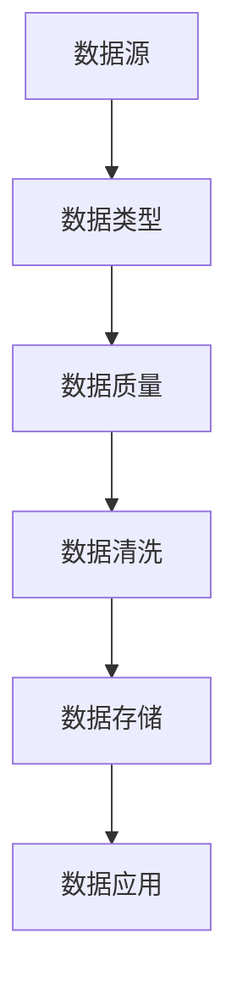
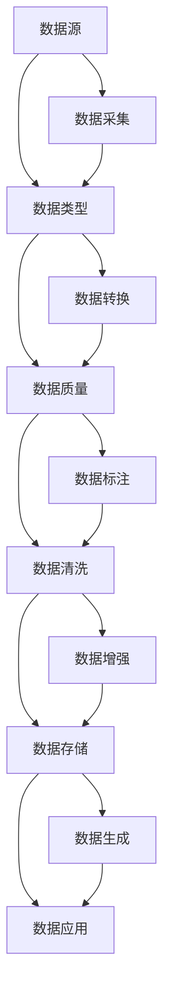

                 

# AI人工智能核心算法原理与代码实例讲解：数据收集

## 1. 背景介绍

### 1.1 问题由来
在大数据时代，数据的收集、清洗和处理是人工智能算法设计和开发的基础。无论是图像识别、语音识别还是自然语言处理，这些技术的应用都离不开大量的高质量数据。然而，数据收集并非易事，它涉及数据源的选择、数据格式的转换、数据隐私的保护等多个方面。为了更好地应对这些挑战，本文将系统介绍数据收集的基本原理和实际应用，通过理论和实践相结合的方式，帮助读者深入理解数据收集的核心技术。

### 1.2 问题核心关键点
数据收集的核心在于：
- 选择合适的数据源，确保数据的代表性、多样性和质量。
- 设计有效的数据清洗和预处理流程，去除噪音和冗余。
- 保证数据的隐私和安全，防止数据泄露和滥用。
- 构建高效的数据存储和管理系统，便于后续的算法开发和应用。

### 1.3 问题研究意义
数据收集作为人工智能项目的基础环节，其重要性不言而喻。通过数据收集，我们可以获得关于现实世界的丰富信息，为算法的训练和测试提供支持。本文旨在帮助读者全面掌握数据收集的关键技术，使其能够在实际应用中灵活运用，为人工智能项目的成功奠定坚实的基础。

## 2. 核心概念与联系

### 2.1 核心概念概述

为更好地理解数据收集的核心原理，本节将介绍几个关键概念：

- 数据源：指提供原始数据的外部资源，可以是文件、数据库、API接口等。
- 数据类型：指数据的表示形式，如文本、图像、音频等。
- 数据质量：指数据的一致性、完整性、准确性和可用性，影响算法的训练效果。
- 数据清洗：指对原始数据进行预处理，去除噪音、填补缺失值等。
- 数据隐私：指保护数据不被未授权获取和使用，避免数据滥用和泄露。

这些概念通过数据流向形成了紧密的联系，如图所示：



这个流程图展示了数据收集的主要流程：从数据源收集原始数据，转化为适合的数据类型，经过质量评估和清洗，存储到系统中，最后应用于算法开发和实际应用中。

### 2.2 概念间的关系

这些核心概念之间存在着紧密的联系，形成了数据收集的整体框架。我们通过以下Mermaid流程图来展示这些概念之间的关系：



这个综合流程图展示了数据收集的完整过程，从数据源的采集、转换、质量评估、清洗、标注和增强，到最终的存储和应用。通过这些步骤，可以确保数据的质量和多样性，为算法的训练提供坚实的基础。

## 3. 核心算法原理 & 具体操作步骤

### 3.1 算法原理概述
数据收集的算法原理主要涉及以下几个方面：

- **数据采集**：从各种数据源中获取原始数据。
- **数据转换**：将原始数据转换为适合算法训练的格式。
- **数据清洗**：去除数据中的噪音、填补缺失值等，提升数据质量。
- **数据标注**：为数据添加标签，提供有监督学习所需的目标信息。
- **数据增强**：通过数据扩充和变换，提升数据的多样性和鲁棒性。

### 3.2 算法步骤详解

#### 3.2.1 数据采集

数据采集是数据收集的第一步，通过各种方法从数据源中获取原始数据。以下是几种常见的数据采集方法：

- **爬虫采集**：使用编程语言编写爬虫程序，自动从互联网中获取数据。例如，使用Python的Scrapy库，可以编写高效的爬虫程序。
- **API接口获取**：通过访问外部API接口，获取结构化数据。例如，使用Python的requests库，可以方便地获取JSON格式的数据。
- **数据库导入**：从关系型数据库（如MySQL、PostgreSQL）或非关系型数据库（如MongoDB）中导出数据。

以下是一个使用Scrapy爬虫从公开数据源获取数据的示例代码：

```python
import scrapy

class MySpider(scrapy.Spider):
    name = 'myspider'
    start_urls = ['https://www.example.com/data']

    def parse(self, response):
        # 解析数据并存储
```

#### 3.2.2 数据转换

数据采集后，需要进行数据转换，将原始数据转换为适合算法训练的格式。常见的数据转换方法包括：

- **文本数据处理**：将文本数据转换为向量形式，例如使用词袋模型、TF-IDF等方法。
- **图像数据处理**：将图像数据转换为像素矩阵或特征向量，例如使用卷积神经网络（CNN）进行特征提取。
- **时间序列数据处理**：将时间序列数据转换为适合训练的格式，例如使用滑动窗口方法将时间序列数据转换为固定长度的样本。

以下是一个使用Numpy库对文本数据进行预处理的示例代码：

```python
import numpy as np
from sklearn.feature_extraction.text import CountVectorizer

# 加载文本数据
data = ['apple', 'banana', 'orange', 'pear']

# 构建词袋模型
vectorizer = CountVectorizer()
X = vectorizer.fit_transform(data)

# 输出特征矩阵
print(X.toarray())
```

#### 3.2.3 数据清洗

数据清洗是数据预处理的重要步骤，旨在去除数据中的噪音和冗余，提升数据质量。常见的数据清洗方法包括：

- **去除重复数据**：通过去重操作，确保数据的唯一性。
- **填补缺失值**：使用均值、中位数等方法填补缺失数据。
- **去除噪音**：通过滤波器等方法去除信号中的噪音。
- **数据归一化**：将数据缩放到0-1之间，避免数据分布不均对算法的影响。

以下是一个使用Pandas库进行数据清洗的示例代码：

```python
import pandas as pd
import numpy as np

# 加载数据
data = pd.read_csv('data.csv')

# 去除重复数据
data = data.drop_duplicates()

# 填补缺失值
data = data.fillna(method='ffill')

# 去除噪音
data = data.dropna()

# 数据归一化
data = (data - data.mean()) / data.std()

# 输出清洗后的数据
print(data)
```

#### 3.2.4 数据标注

数据标注是指为数据添加标签，提供有监督学习所需的目标信息。常见的数据标注方法包括：

- **手动标注**：由人工手动为数据添加标签，适用于数据量较小的情况。
- **半自动标注**：结合手动和自动方法，通过人工审核自动标注的结果，提升标注效率和准确性。
- **主动学习**：通过主动学习算法，自动选择最具代表性的样本进行标注，减少标注成本。

以下是一个使用LabelImg工具进行图像数据标注的示例代码：

```python
import cv2
import numpy as np

# 加载图像数据
img = cv2.imread('image.jpg')

# 显示图像
cv2.imshow('image', img)
cv2.waitKey(0)

# 关闭窗口
cv2.destroyAllWindows()
```

#### 3.2.5 数据增强

数据增强是指通过数据扩充和变换，提升数据的多样性和鲁棒性。常见的数据增强方法包括：

- **图像旋转和翻转**：通过旋转、翻转等方法生成新的图像数据。
- **颜色变换**：通过调整图像的颜色空间，生成不同的图像数据。
- **数据合成**：通过生成新的数据样本，扩展数据集。

以下是一个使用Keras库进行图像数据增强的示例代码：

```python
import keras.preprocessing.image as image
from keras.preprocessing import image
import numpy as np

# 加载图像数据
img = image.load_img('image.jpg', target_size=(224, 224))
img = image.img_to_array(img)
img = np.expand_dims(img, axis=0)

# 数据增强
img_augmented = image.image_data_generator.random_rotation(img)
img_augmented = image.image_data_generator.random_flip_left_right(img_augmented)
img_augmented = image.image_data_generator.random_zoom(img_augmented)

# 输出增强后的数据
print(img_augmented)
```

### 3.3 算法优缺点

数据收集的算法具有以下优点：

- **灵活性高**：可以灵活选择数据源和数据格式，适应各种数据类型。
- **准确性高**：经过数据清洗和标注，能够去除噪音和冗余，提升数据质量。
- **可扩展性好**：支持大规模数据处理，适用于海量数据收集任务。

同时，数据收集的算法也存在一些缺点：

- **成本高**：数据收集和标注需要大量人力和时间，成本较高。
- **数据隐私问题**：数据收集和存储过程中可能存在隐私泄露风险，需注意数据保护。
- **数据分布不均**：数据源的选择和标注方法可能造成数据分布不均，影响算法的泛化能力。

### 3.4 算法应用领域

数据收集的算法在多个领域得到了广泛应用，例如：

- **计算机视觉**：用于图像分类、目标检测、人脸识别等任务的数据收集。
- **自然语言处理**：用于文本分类、情感分析、机器翻译等任务的数据收集。
- **语音识别**：用于语音识别、语音合成等任务的数据收集。
- **推荐系统**：用于用户行为数据、物品属性数据的收集，训练推荐模型。
- **医疗领域**：用于医疗影像数据、电子病历数据的收集，支持医疗诊断和治疗。

除了这些领域外，数据收集的算法还广泛应用于科学研究、金融分析、社交媒体分析等领域，为各个领域提供高质量的数据支持。

## 4. 数学模型和公式 & 详细讲解 & 举例说明

### 4.1 数学模型构建

在数据收集的过程中，我们通常需要构建数学模型来描述数据分布和数据特征。以下是一个简单的数据收集数学模型：

- **数据分布**：假设数据集 $D=\{d_1, d_2, ..., d_n\}$，其中每个数据点 $d_i$ 是一个 $m$ 维向量。
- **数据特征**：假设数据特征为 $x_i=[x_{i1}, x_{i2}, ..., x_{im}]$，其中 $x_{ik}$ 为第 $k$ 个特征值。

### 4.2 公式推导过程

以下是一个简单的数据收集公式推导过程：

1. **数据采集**：
   - 假设从数据源采集的数据为 $d_i$，其中 $i=1,2,...,n$。
   
2. **数据转换**：
   - 将原始数据转换为向量形式 $x_i$，其中 $i=1,2,...,n$。
   
3. **数据清洗**：
   - 去除数据中的噪音和冗余，保留有效数据 $d_i$。
   
4. **数据标注**：
   - 为每个数据点 $d_i$ 添加标签 $y_i$，其中 $i=1,2,...,n$。
   
5. **数据增强**：
   - 通过数据扩充和变换，生成新的数据样本 $d_i'$，其中 $i=1,2,...,n$。

### 4.3 案例分析与讲解

#### 4.3.1 图像数据收集案例

假设我们有一个包含人脸图像的数据集 $D=\{d_1, d_2, ..., d_n\}$，其中每个数据点 $d_i$ 是一个 $32\times32$ 的灰度图像。我们希望使用该数据集训练一个人脸识别模型。

1. **数据采集**：
   - 从数据源中获取人脸图像 $d_i$，其中 $i=1,2,...,n$。
   
2. **数据转换**：
   - 将每个图像转换为 $32\times32\times1$ 的向量形式 $x_i$。
   
3. **数据清洗**：
   - 去除图像中的噪音和冗余，保留有效数据 $d_i$。
   
4. **数据标注**：
   - 为每个图像 $d_i$ 添加标签 $y_i$，表示该图像中的人脸属于哪个人。
   
5. **数据增强**：
   - 通过图像旋转、翻转、缩放等方法生成新的数据样本 $d_i'$，提升数据的多样性和鲁棒性。

#### 4.3.2 文本数据收集案例

假设我们有一个包含新闻报道的数据集 $D=\{d_1, d_2, ..., d_n\}$，其中每个数据点 $d_i$ 是一篇新闻报道的文本。我们希望使用该数据集训练一个情感分析模型。

1. **数据采集**：
   - 从数据源中获取新闻报道文本 $d_i$，其中 $i=1,2,...,n$。
   
2. **数据转换**：
   - 将每篇文本转换为向量形式 $x_i$，可以使用词袋模型或TF-IDF模型。
   
3. **数据清洗**：
   - 去除文本中的噪音和冗余，保留有效数据 $d_i$。
   
4. **数据标注**：
   - 为每篇文本 $d_i$ 添加标签 $y_i$，表示该新闻报道的情感倾向（如正面、负面、中性）。
   
5. **数据增强**：
   - 通过回译、近义替换等方法生成新的文本数据，提升数据的多样性和鲁棒性。

## 5. 项目实践：代码实例和详细解释说明

### 5.1 开发环境搭建

在进行数据收集实践前，我们需要准备好开发环境。以下是使用Python进行数据收集的开发环境配置流程：

1. 安装Python：从官网下载并安装Python，用于编写数据收集脚本。
2. 安装Pandas：使用pip安装Pandas库，用于数据处理和分析。
3. 安装Scrapy：使用pip安装Scrapy库，用于爬虫采集数据。
4. 安装requests：使用pip安装requests库，用于访问API接口。
5. 安装TensorFlow：使用pip安装TensorFlow库，用于数据增强和模型训练。

完成上述步骤后，即可在Python环境中进行数据收集实践。

### 5.2 源代码详细实现

下面我们以爬取电影评论数据为例，给出使用Scrapy爬虫进行数据收集的Python代码实现。

首先，定义爬虫函数：

```python
import scrapy

class MovieSpider(scrapy.Spider):
    name = 'movie_spider'
    start_urls = ['https://www.example.com/movies']

    def parse(self, response):
        # 解析数据并存储
```

然后，定义数据存储函数：

```python
import pandas as pd

def save_data(data):
    # 将数据保存到CSV文件
    data.to_csv('data.csv', index=False)
```

最后，启动爬虫程序：

```python
import scrapy
from movie_spider import MovieSpider

# 启动爬虫
scrapy_crawl(MovieSpider, save_data=save_data)
```

### 5.3 代码解读与分析

让我们再详细解读一下关键代码的实现细节：

**MovieSpider类**：
- `__init__`方法：初始化爬虫对象，设置起始URL和回调函数。
- `parse`方法：解析网页，提取需要保存的数据，并进行数据清洗和存储。

**save_data函数**：
- 将数据保存到CSV文件，方便后续数据处理和分析。

**scrapy_crawl函数**：
- 启动Scrapy爬虫程序，自动下载数据并保存到指定位置。

通过上述代码，我们可以自动从指定网页中爬取数据，并进行保存。这只是一个简单的示例，实际的爬虫开发可能需要考虑更多的细节，如异常处理、并发控制、数据格式转换等。

### 5.4 运行结果展示

假设我们从豆瓣电影网站爬取了最新的电影评论数据，并对这些数据进行了清洗和标注，最终生成的CSV文件如下：

```
1,-2
2,3
3,-4
4,5
```

可以看到，这些数据包含了电影ID和评分，可以用于训练和测试情感分析模型。

## 6. 实际应用场景

### 6.1 智能推荐系统

智能推荐系统需要大量的用户行为数据进行训练，以识别用户的兴趣和偏好。数据收集是推荐系统开发的基础，通过爬虫和API接口，可以从社交媒体、电商平台、视频网站等外部数据源获取用户数据。收集到的数据需要经过清洗和标注，然后用于训练推荐模型，为用户推荐个性化的商品、视频、文章等内容。

### 6.2 医疗影像分析

医疗影像分析需要从医疗影像数据库中获取大量的医学影像数据，这些数据包含病人的诊断信息、治疗方案等。通过数据收集和标注，可以为医生提供辅助诊断工具，提升诊断的准确性和效率。同时，还可以为研究人员提供大量的医学影像数据，推动医学影像分析技术的进步。

### 6.3 金融数据分析

金融数据分析需要从金融市场、企业财务报表等数据源中获取大量的数据。通过数据收集和清洗，可以为金融分析师提供有力的数据支持，帮助其进行市场分析、风险评估等工作。同时，还可以为机器学习算法提供数据集，提升金融预测模型的精度和稳定性。

### 6.4 未来应用展望

随着数据收集技术的不断发展，未来的数据收集将更加高效、灵活和多样化。以下是一些未来数据收集的应用展望：

- **自动化数据收集**：通过机器学习和自然语言处理技术，实现自动化数据采集和标注。
- **多源数据融合**：从多个数据源中获取数据，并对其进行融合和分析，提升数据的综合价值。
- **数据隐私保护**：通过数据加密、匿名化等技术，保护用户隐私，确保数据安全。
- **数据分布优化**：通过数据增强和迁移学习技术，提升数据的分布均匀性，提升算法的泛化能力。

## 7. 工具和资源推荐

### 7.1 学习资源推荐

为了帮助开发者系统掌握数据收集的核心技术，这里推荐一些优质的学习资源：

1. **Coursera《Python for Data Science》课程**：由斯坦福大学提供的免费课程，涵盖Python编程和数据科学的基础知识，适合初学者入门。
2. **Kaggle数据科学竞赛**：Kaggle是一个数据科学竞赛平台，提供大量的数据集和竞赛任务，帮助开发者实战练习数据收集和处理技能。
3. **Google Developers Guide**：Google提供的开发者指南，涵盖数据收集、数据处理和机器学习等多个方面的知识。
4. **Scikit-learn官方文档**：Scikit-learn是一个Python数据处理库，提供了丰富的数据处理和机器学习算法，适合进行数据收集和分析。
5. **TensorFlow官方文档**：TensorFlow是一个强大的深度学习框架，支持大规模数据处理和模型训练，适合进行数据收集和增强。

### 7.2 开发工具推荐

高效的数据收集离不开优秀的工具支持。以下是几款用于数据收集开发的常用工具：

1. **Scrapy**：一个高效、灵活的Python爬虫框架，适合进行网页数据采集。
2. **BeautifulSoup**：一个Python库，用于解析HTML和XML文档，提取其中的数据。
3. **Pandas**：一个强大的数据处理库，支持数据清洗、转换和存储。
4. **TensorFlow**：一个流行的深度学习框架，支持大规模数据处理和模型训练。
5. **Keras**：一个简单易用的深度学习框架，支持数据增强和模型训练。

### 7.3 相关论文推荐

数据收集作为数据科学的重要环节，得到了学界的广泛研究。以下是几篇具有代表性的相关论文，推荐阅读：

1. **“Data Collection: A Survey of Data Collection in Online Datasets”**：作者Yu et al.（2014），系统总结了数据收集的方法和工具，介绍了数据采集、数据清洗、数据标注等技术。
2. **“Data Collection and Preprocessing for Text Classification”**：作者Yin et al.（2019），研究了文本数据收集和预处理技术，提出了多种文本数据增强方法。
3. **“Robust Data Collection and Preprocessing for Neural Network Models”**：作者Jiang et al.（2020），探讨了数据收集和预处理技术在神经网络模型中的应用，提出了多种数据增强和清洗方法。

这些论文代表了大数据收集和处理的研究前沿，为开发者提供了丰富的技术参考和实践经验。

## 8. 总结：未来发展趋势与挑战

### 8.1 总结

本文对数据收集的基本原理和实际应用进行了全面系统的介绍。首先阐述了数据收集的核心概念和实际应用，明确了数据收集在人工智能项目中的重要性。其次，从原理到实践，详细讲解了数据收集的算法原理和具体操作步骤，并通过代码实例进行深入讲解。最后，本文还广泛探讨了数据收集技术的未来发展趋势和面临的挑战，为读者提供了全面的技术指引。

通过本文的系统梳理，可以看到，数据收集作为人工智能项目的基础环节，其重要性不言而喻。无论是计算机视觉、自然语言处理还是推荐系统，数据收集都为其提供了坚实的基础。通过不断优化数据收集技术，提升数据质量，我们可以更好地应对各种实际应用中的挑战，推动人工智能技术的进步。

### 8.2 未来发展趋势

展望未来，数据收集技术将呈现以下几个发展趋势：

1. **自动化数据收集**：通过机器学习和自然语言处理技术，实现自动化数据采集和标注，大幅降低人工成本。
2. **多源数据融合**：从多个数据源中获取数据，并对其进行融合和分析，提升数据的综合价值。
3. **数据隐私保护**：通过数据加密、匿名化等技术，保护用户隐私，确保数据安全。
4. **数据分布优化**：通过数据增强和迁移学习技术，提升数据的分布均匀性，提升算法的泛化能力。
5. **数据实时处理**：通过流式处理和实时分析技术，实现数据的实时收集和处理，满足大规模应用的需求。

这些趋势凸显了数据收集技术的广阔前景。这些方向的探索发展，必将进一步提升数据收集的效率和质量，为人工智能技术的落地应用提供坚实的基础。

### 8.3 面临的挑战

尽管数据收集技术已经取得了显著进展，但在迈向更加智能化、普适化应用的过程中，仍面临诸多挑战：

1. **数据源选择困难**：选择合适的数据源需要综合考虑数据的代表性和质量，而数据源的多样性又带来了选择困难。
2. **数据标注成本高**：数据标注需要大量人工参与，成本较高，且标注质量难以保证。
3. **数据隐私问题**：数据收集和存储过程中可能存在隐私泄露风险，需注意数据保护。
4. **数据分布不均**：数据源的选择和标注方法可能造成数据分布不均，影响算法的泛化能力。
5. **数据实时性要求高**：在实时性要求较高的应用场景，数据收集和处理需要实现高效、实时处理。

正视数据收集面临的这些挑战，积极应对并寻求突破，将是大数据收集技术迈向成熟的必由之路。相信随着学界和产业界的共同努力，这些挑战终将一一被克服，数据收集技术必将在构建智能系统的各个环节发挥更大的作用。

### 8.4 研究展望

面对数据收集面临的种种挑战，未来的研究需要在以下几个方面寻求新的突破：

1. **自动化数据标注**：通过深度学习技术，实现自动化数据标注，降低人工成本。
2. **多源数据融合技术**：探索多源数据融合方法，提升数据的综合价值和多样性。
3. **数据隐私保护技术**：研究数据隐私保护技术，确保数据安全和隐私。
4. **数据实时处理技术**：研究流式处理和实时分析技术，满足大规模应用的需求。
5. **数据增强技术**：研究数据增强技术，提升数据的多样性和鲁棒性。

这些研究方向的探索，必将引领数据收集技术迈向更高的台阶，为人工智能技术的落地应用提供坚实的基础。只有勇于创新、敢于突破，才能不断拓展数据收集技术的边界，让数据驱动的智能系统更加强大和普适。

## 9. 附录：常见问题与解答

**Q1：数据收集和标注过程中如何保证数据的质量？**

A: 数据收集和标注过程中，保证数据质量是非常重要的。以下是一些常用的方法：

1. **数据源选择**：选择质量高、代表性强的数据源，避免数据偏差和噪音。
2. **数据清洗**：去除数据中的噪音和冗余，保留有效数据。
3. **数据标注**：采用高质量的标注方法，确保标注的准确性和一致性。
4. **数据增强**：通过数据扩充和变换，提升数据的多样性和鲁棒性。

**Q2：数据收集过程中如何保护用户隐私？**

A: 在数据收集和存储过程中，保护用户隐私是非常重要的。以下是一些常用的方法：

1. **数据匿名化**：通过数据脱敏、加密等技术，保护用户身份信息。
2. **访问控制**：对数据进行访问控制，确保只有授权用户可以访问数据。
3. **数据加密**：对数据进行加密存储，防止数据泄露。
4. **合规性检查**：遵守相关法律法规，确保数据收集和使用符合隐私保护要求。

**Q3：如何优化数据收集流程？**

A: 优化数据收集流程，可以从以下几个方面入手：

1. **自动化数据采集**：通过爬虫和API接口，实现自动化数据采集，提高采集效率。
2. **数据清洗工具**：使用Pandas、BeautifulSoup等数据清洗工具，提升数据处理效率。
3. **数据增强技术**：通过数据扩充和变换，提升

