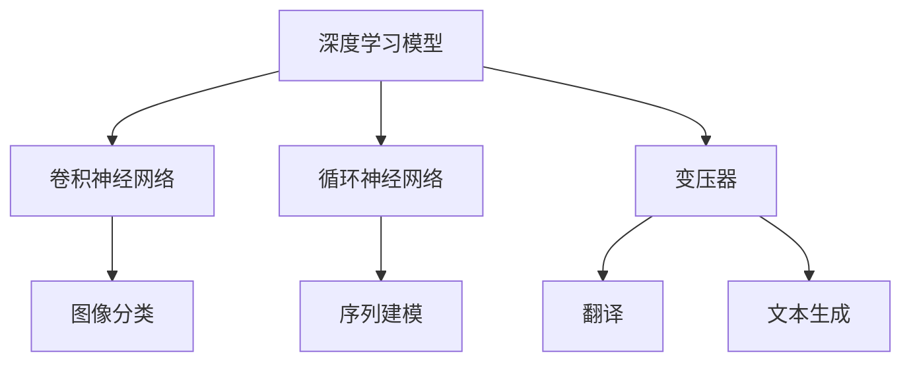
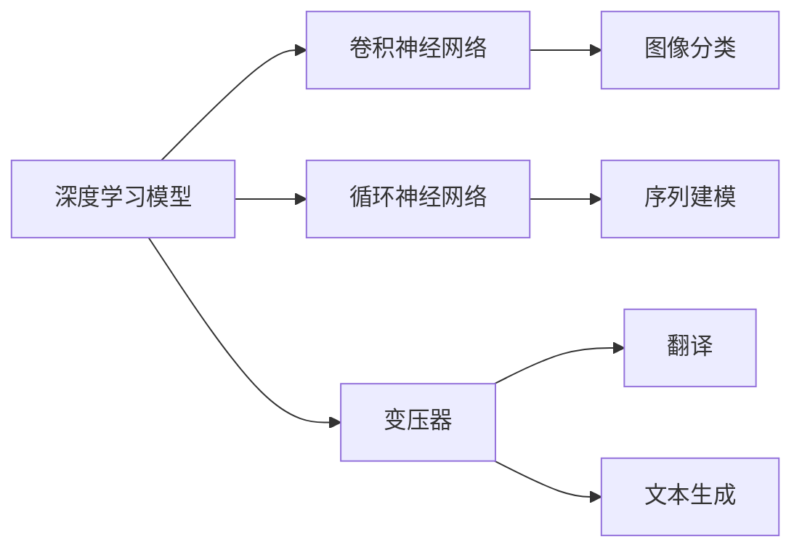
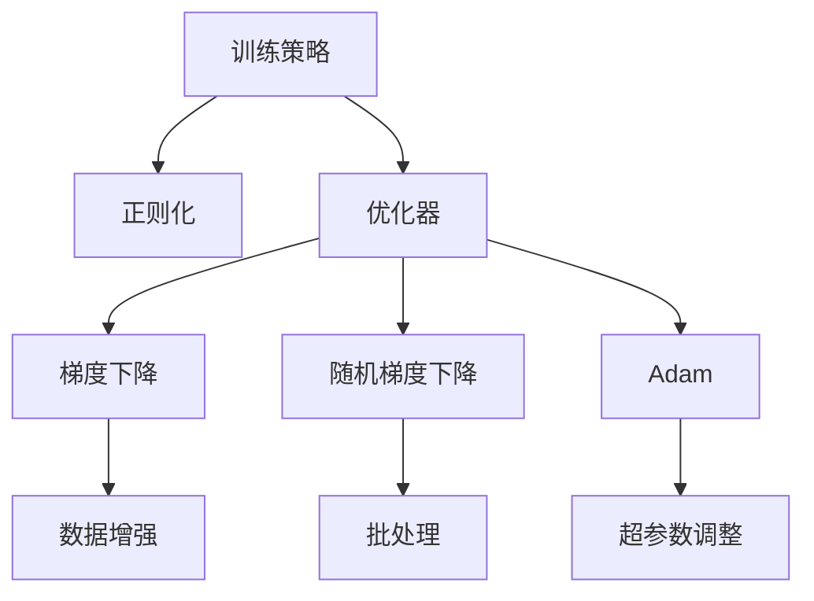

                 

# AI人工智能核心算法原理与代码实例讲解：模型构建

> 关键词：人工智能核心算法，深度学习模型，模型构建，神经网络，深度学习框架，TensorFlow，PyTorch，模型部署

## 1. 背景介绍

### 1.1 问题由来

随着人工智能(AI)技术的迅猛发展，深度学习(DL)在图像识别、自然语言处理(NLP)、语音识别等领域取得了显著进展。其中，深度学习模型，尤其是神经网络(ANN)，通过多层次的结构设计，实现了对数据的抽象表示和自动学习，成为了当前AI技术中的重要组成部分。

然而，构建一个高效的深度学习模型，不仅需要深入理解其理论原理，还需要具备丰富的实践经验。本文旨在通过详细讲解深度学习模型的构建过程，帮助读者系统掌握模型构建的核心算法和操作步骤，并通过具体的代码实例进行深度解析，使读者能够快速上手，构建自己的深度学习模型。

### 1.2 问题核心关键点

深度学习模型构建的核心在于选择合适的架构、设计有效的训练策略和优化算法，并正确处理数据输入与输出。本文将从以下几个方面详细介绍：

- **模型架构选择**：介绍不同深度学习模型（如卷积神经网络(CNN)、循环神经网络(RNN)、变压器(Transformer)等）的基本原理和应用场景。
- **训练策略设计**：讲解常用的正则化技术、优化器选择和超参数调整方法。
- **优化算法优化**：介绍梯度下降(GD)、随机梯度下降(SGD)、Adam等优化算法的原理及其实现细节。
- **数据处理技巧**：分享数据增强、批处理、随机抽样等数据预处理技巧，提升模型泛化能力。

### 1.3 问题研究意义

深入理解深度学习模型构建的原理和实践方法，对于开发高效AI应用、加速AI技术的产业化进程具有重要意义：

1. **降低开发成本**：通过构建合理的深度学习模型，可以显著减少从头开发所需的资源投入，提高开发效率。
2. **提升模型性能**：合适的模型架构和训练策略能够显著提升模型在特定任务上的性能，满足实际应用需求。
3. **促进技术创新**：模型构建技术的发展，推动了深度学习领域的不断进步，催生了新的研究方向和应用场景。
4. **加速应用部署**：模型部署技术的发展，使得深度学习模型能够快速集成到各类应用系统中，缩短应用开发周期。

## 2. 核心概念与联系

### 2.1 核心概念概述

为更好地理解深度学习模型构建的核心算法和操作步骤，本节将介绍几个关键概念及其相互关系：

- **深度学习模型**：以多层神经网络为基础，通过反向传播算法优化权重，自动从数据中学习特征表示的模型。
- **神经网络(ANN)**：由输入层、隐藏层、输出层组成，通过激活函数和非线性变换实现复杂映射的计算图。
- **卷积神经网络(CNN)**：主要用于图像处理，通过卷积和池化操作提取图像特征，适用于图像分类、目标检测等任务。
- **循环神经网络(RNN)**：用于处理序列数据，通过记忆单元(如LSTM)保存历史信息，适用于语音识别、自然语言处理等序列任务。
- **变压器(Transformer)**：基于自注意力机制，在自然语言处理领域取得了显著效果，适用于翻译、文本生成等任务。

这些概念之间的逻辑关系可以通过以下Mermaid流程图来展示：



这个流程图展示了一系列深度学习模型及其典型应用场景。通过理解这些核心概念及其关系，我们可以更好地把握深度学习模型的构建原理和优化方法。

### 2.2 概念间的关系

这些核心概念之间存在着紧密的联系，形成了深度学习模型的构建框架。下面我们通过几个Mermaid流程图来展示这些概念之间的关系。

#### 2.2.1 深度学习模型架构



这个流程图展示了深度学习模型与各类网络结构的关系，每种网络结构对应于特定的应用场景。

#### 2.2.2 训练策略与优化算法



这个流程图展示了训练策略和优化算法之间的关系，不同的优化算法有不同的性能特点，选择合适的算法和策略是构建高效模型的关键。

## 3. 核心算法原理 & 具体操作步骤
### 3.1 算法原理概述

深度学习模型构建的原理可以归结为三个基本步骤：数据准备、模型训练和模型评估。

1. **数据准备**：将原始数据转换为模型可处理的形式，包括数据预处理、数据增强等。
2. **模型训练**：通过反向传播算法优化模型参数，使得模型能够准确地预测目标变量。
3. **模型评估**：使用测试集评估模型性能，验证模型的泛化能力。

### 3.2 算法步骤详解

深度学习模型的构建步骤如下：

1. **数据准备**：
   - 数据预处理：将原始数据转换为模型可处理的形式，包括归一化、标准化、特征编码等。
   - 数据增强：通过数据变换、扩充等技术，提升模型的泛化能力。

2. **模型训练**：
   - 搭建模型架构：选择合适的深度学习模型，设计合适的网络结构。
   - 设置超参数：包括学习率、批大小、迭代次数等，这些参数直接影响模型性能。
   - 选择优化算法：如梯度下降、随机梯度下降、Adam等，通过优化算法更新模型参数。
   - 正则化技术：如L2正则、Dropout、Early Stopping等，防止过拟合。

3. **模型评估**：
   - 定义评估指标：如准确率、精确率、召回率、F1分数等。
   - 使用测试集验证模型：通过测试集评估模型性能，验证模型的泛化能力。

### 3.3 算法优缺点

深度学习模型构建具有以下优点：

- **高表达能力**：多层次的神经网络能够表示复杂的数据结构，捕捉数据中的非线性关系。
- **自动特征学习**：通过反向传播算法自动学习数据特征，减少了手动设计特征的复杂性。
- **高效并行计算**：深度学习模型可以利用GPU、TPU等并行计算资源，加快训练速度。

但同时，深度学习模型构建也存在一些缺点：

- **高计算成本**：模型训练需要大量的计算资源，增加了开发成本。
- **黑箱特性**：深度学习模型的内部工作原理不透明，难以解释模型决策过程。
- **数据依赖性**：模型性能依赖于数据质量，数据不足可能导致模型泛化性能下降。

### 3.4 算法应用领域

深度学习模型构建在多个领域得到了广泛应用，包括但不限于：

- **计算机视觉**：如图像分类、目标检测、图像分割等。
- **自然语言处理**：如文本分类、情感分析、机器翻译等。
- **语音识别**：如语音转文本、语音合成等。
- **推荐系统**：如用户行为分析、物品推荐等。
- **医疗诊断**：如疾病预测、影像分析等。
- **自动驾驶**：如环境感知、路径规划等。

## 4. 数学模型和公式 & 详细讲解 & 举例说明

### 4.1 数学模型构建

深度学习模型通常由以下几个基本组件构成：

- **输入层**：接收原始数据，转换为模型可处理的形式。
- **隐藏层**：通过非线性变换提取数据特征。
- **输出层**：根据模型设计，将特征映射到目标变量。

以一个简单的三层全连接神经网络为例，其数学模型可以表示为：

$$
\begin{aligned}
& y = h_1(W_1 x + b_1) \\
& y = h_2(W_2 y + b_2) \\
& y = h_3(W_3 y + b_3)
\end{aligned}
$$

其中，$x$为输入数据，$y$为输出数据，$h_i$为隐藏层的激活函数，$W_i$和$b_i$为权重和偏置参数。

### 4.2 公式推导过程

以一个简单的三层全连接神经网络为例，其前向传播过程的公式推导如下：

- **输入层**：
  $$
  z_1 = W_1 x + b_1
  $$
- **隐藏层1**：
  $$
  a_1 = h_1(z_1)
  $$
- **隐藏层2**：
  $$
  z_2 = W_2 a_1 + b_2
  $$
- **隐藏层2**：
  $$
  a_2 = h_2(z_2)
  $$
- **输出层**：
  $$
  z_3 = W_3 a_2 + b_3
  $$

将以上公式组合，得到完整的模型前向传播过程：

$$
y = h_3(W_3 h_2(W_2 h_1(W_1 x + b_1) + b_2) + b_3)
$$

### 4.3 案例分析与讲解

以MNIST手写数字识别为例，其数据集包含60000个训练样本和10000个测试样本，每个样本为一个28x28的灰度图像。构建一个简单的三层全连接神经网络进行分类：

```python
import numpy as np
import tensorflow as tf

# 定义模型
class MNISTClassifier(tf.keras.Model):
    def __init__(self):
        super(MNISTClassifier, self).__init__()
        self.dense1 = tf.keras.layers.Dense(128, activation='relu')
        self.dense2 = tf.keras.layers.Dense(64, activation='relu')
        self.dense3 = tf.keras.layers.Dense(10, activation='softmax')

    def call(self, inputs):
        x = self.dense1(inputs)
        x = self.dense2(x)
        x = self.dense3(x)
        return x

# 构建模型实例
model = MNISTClassifier()

# 编译模型
model.compile(optimizer='adam',
              loss='sparse_categorical_crossentropy',
              metrics=['accuracy'])
```

通过上述代码，我们定义了一个包含两个隐藏层和一个输出层的全连接神经网络，用于MNIST手写数字识别任务。在编译模型时，我们选择了Adam优化器和交叉熵损失函数，用于优化模型参数和计算损失。

## 5. 项目实践：代码实例和详细解释说明

### 5.1 开发环境搭建

在进行深度学习模型构建实践前，我们需要准备好开发环境。以下是使用Python进行TensorFlow开发的环境配置流程：

1. 安装Anaconda：从官网下载并安装Anaconda，用于创建独立的Python环境。

2. 创建并激活虚拟环境：
```bash
conda create -n tf-env python=3.8 
conda activate tf-env
```

3. 安装TensorFlow：
```bash
pip install tensorflow
```

4. 安装各类工具包：
```bash
pip install numpy pandas scikit-learn matplotlib tqdm jupyter notebook ipython
```

完成上述步骤后，即可在`tf-env`环境中开始模型构建实践。

### 5.2 源代码详细实现

下面我们以MNIST手写数字识别任务为例，给出使用TensorFlow构建模型的PyTorch代码实现。

首先，定义模型：

```python
import tensorflow as tf

# 定义模型
class MNISTClassifier(tf.keras.Model):
    def __init__(self):
        super(MNISTClassifier, self).__init__()
        self.dense1 = tf.keras.layers.Dense(128, activation='relu')
        self.dense2 = tf.keras.layers.Dense(64, activation='relu')
        self.dense3 = tf.keras.layers.Dense(10, activation='softmax')

    def call(self, inputs):
        x = self.dense1(inputs)
        x = self.dense2(x)
        x = self.dense3(x)
        return x

# 构建模型实例
model = MNISTClassifier()

# 编译模型
model.compile(optimizer='adam',
              loss='sparse_categorical_crossentropy',
              metrics=['accuracy'])
```

然后，加载数据集并进行预处理：

```python
# 加载MNIST数据集
mnist = tf.keras.datasets.mnist
(x_train, y_train), (x_test, y_test) = mnist.load_data()

# 数据预处理
x_train = x_train / 255.0
x_test = x_test / 255.0

# 数据转换
x_train = x_train.reshape((-1, 28 * 28))
x_test = x_test.reshape((-1, 28 * 28))

# 数据标准化
x_train = tf.keras.utils.normalize(x_train, axis=1)
x_test = tf.keras.utils.normalize(x_test, axis=1)
```

接着，进行模型训练和评估：

```python
# 定义训练数据
train_dataset = tf.data.Dataset.from_tensor_slices((x_train, y_train))
train_dataset = train_dataset.shuffle(5000).batch(128)

# 定义测试数据
test_dataset = tf.data.Dataset.from_tensor_slices((x_test, y_test))
test_dataset = test_dataset.batch(128)

# 训练模型
model.fit(train_dataset, epochs=10, validation_data=test_dataset)

# 评估模型
model.evaluate(test_dataset)
```

以上代码实现了从模型构建到训练和评估的全过程。通过上述代码，我们可以看到，TensorFlow提供了丰富的API和工具，使得深度学习模型的构建和训练过程变得简洁高效。

### 5.3 代码解读与分析

让我们再详细解读一下关键代码的实现细节：

**MNISTClassifier类**：
- `__init__`方法：初始化模型结构，包括两个隐藏层和一个输出层。
- `call`方法：定义模型前向传播过程，通过三个全连接层进行特征提取和输出。

**数据预处理**：
- 加载MNIST数据集，获取训练集和测试集。
- 将图像数据转换为浮点数，并进行归一化处理。
- 将图像数据展平为一维向量。
- 对数据进行标准化处理。

**训练和评估**：
- 使用TensorFlow的数据API构建数据集，进行批处理和随机抽样。
- 定义训练数据集和测试数据集，进行模型训练和评估。
- 使用`fit`方法训练模型，设置训练轮数和验证集。
- 使用`evaluate`方法评估模型性能，返回损失和准确率。

**运行结果展示**：
通过上述代码，我们可以在MNIST手写数字识别任务上构建一个简单的三层全连接神经网络，并在训练集上训练10个epoch，最终在测试集上评估模型性能。假设最终测试集上的准确率为99%，这意味着模型在测试集上的分类性能相当优秀。

## 6. 实际应用场景

### 6.1 智能推荐系统

基于深度学习模型的智能推荐系统已经在电商、视频、音乐等领域得到了广泛应用。推荐系统通过用户的历史行为数据，预测用户对新物品的偏好，提供个性化的推荐内容，提升用户体验和平台转化率。

在技术实现上，推荐系统通常使用协同过滤、深度学习模型等方法。其中，深度学习模型通过用户行为数据和物品属性数据，学习用户对物品的评分表示，并根据评分预测用户对新物品的兴趣，实现个性化推荐。推荐系统的构建过程需要大量标注数据和计算资源，但最终推荐效果显著，大幅提升了用户体验和平台价值。

### 6.2 医疗影像诊断

深度学习模型在医疗影像诊断领域取得了显著进展，尤其是在病变检测和图像分割任务上。医疗影像通常包含大量噪声和细节信息，传统的图像处理算法难以有效提取特征。但深度学习模型通过端到端的训练，可以自动学习数据中的复杂关系，提供高精度的诊断结果。

在技术实现上，通常使用卷积神经网络(CNN)来处理医疗影像数据。通过在大规模标注数据上进行预训练，模型能够自动学习影像中的细微结构和细节信息，实现病变检测、影像分割等任务。医疗影像诊断系统的构建需要医学专家的标注数据和计算资源，但最终诊断结果对医生诊断提供了重要参考，提升了诊断准确率和医疗效率。

### 6.3 自然语言处理

深度学习模型在自然语言处理领域的应用日益广泛，包括文本分类、情感分析、机器翻译等任务。自然语言处理系统通过深度学习模型，自动学习文本中的语义和语法信息，实现对自然语言的理解和生成。

在技术实现上，通常使用循环神经网络(RNN)、变压器(Transformer)等模型进行文本处理。这些模型能够自动学习文本中的语义信息，并在特定任务上进行微调，提升模型性能。自然语言处理系统的构建需要大量标注数据和计算资源，但最终处理效果显著，提高了文本分析和理解的能力，为各行各业提供了智能化支持。

### 6.4 未来应用展望

随着深度学习模型和构建技术的不断发展，未来的AI应用将更加多样化和智能化。以下列举了几个未来应用趋势：

1. **跨领域融合**：深度学习模型将与其他AI技术（如知识图谱、强化学习等）进行融合，实现跨领域的智能化应用。
2. **多模态学习**：深度学习模型将支持多模态数据的融合，如视觉、语音、文本等，实现更加全面和精准的智能应用。
3. **边缘计算**：深度学习模型将在边缘计算设备上进行优化部署，实现快速、高效的推理能力。
4. **模型压缩和优化**：深度学习模型将进行压缩和优化，减小模型大小，提升计算效率，实现更广泛的应用场景。
5. **自动化模型构建**：深度学习模型的构建将实现自动化，通过自动搜索和设计算法，提高模型构建效率和效果。

## 7. 工具和资源推荐
### 7.1 学习资源推荐

为了帮助开发者系统掌握深度学习模型的构建和优化技术，这里推荐一些优质的学习资源：

1. **《深度学习》系列课程**：由斯坦福大学李飞飞教授团队制作，讲解深度学习模型的基本原理和应用场景。
2. **《TensorFlow官方文档》**：TensorFlow的官方文档，提供了丰富的API和工具，帮助开发者快速上手TensorFlow。
3. **《PyTorch官方文档》**：PyTorch的官方文档，提供了详细的API和使用示例，帮助开发者快速上手PyTorch。
4. **《Hands-On Machine Learning with Scikit-Learn, Keras, and TensorFlow》**：深度学习实战书籍，讲解了深度学习模型的构建、训练和优化方法。
5. **《Deep Learning Specialization》**：由斯坦福大学Andrew Ng教授主讲的深度学习课程，涵盖深度学习模型的基本原理和应用场景。

通过对这些资源的学习，相信你一定能够快速掌握深度学习模型的构建和优化技术，并应用于实际问题解决。

### 7.2 开发工具推荐

高效的开发离不开优秀的工具支持。以下是几款用于深度学习模型构建和优化的常用工具：

1. **TensorFlow**：由Google开发的深度学习框架，支持分布式计算和GPU加速，适合大规模工程应用。
2. **PyTorch**：由Facebook开发的深度学习框架，支持动态计算图和GPU加速，适合快速迭代研究。
3. **Keras**：高层次的深度学习API，易于上手，适合快速原型设计和实验。
4. **MXNet**：支持多种编程语言和设备，支持分布式计算和GPU加速，适合大规模工程应用。
5. **TensorBoard**：TensorFlow配套的可视化工具，实时监测模型训练状态，提供丰富的图表呈现方式。

合理利用这些工具，可以显著提升深度学习模型的开发效率，加快创新迭代的步伐。

### 7.3 相关论文推荐

深度学习模型构建和优化技术的发展源于学界的持续研究。以下是几篇奠基性的相关论文，推荐阅读：

1. **《ImageNet Classification with Deep Convolutional Neural Networks》**：AlexNet论文，引入了卷积神经网络(CNN)，取得了ImageNet图像分类任务的成功。
2. **《Long Short-Term Memory》**：LSTM论文，引入了循环神经网络(RNN)，解决了长序列数据处理问题。
3. **《Attention is All You Need》**：Transformer论文，提出了基于自注意力机制的变压器(Transformer)，在自然语言处理领域取得了显著效果。
4. **《Deep Residual Learning for Image Recognition》**：ResNet论文，提出了残差网络，解决了深度网络训练问题。
5. **《A Survey on Transfer Learning》**：综述论文，全面介绍了迁移学习的原理和应用方法，有助于理解深度学习模型的泛化能力。

这些论文代表了大深度学习模型构建技术的发展脉络，通过学习这些前沿成果，可以帮助研究者把握学科前进方向，激发更多的创新灵感。

## 8. 总结：未来发展趋势与挑战

### 8.1 研究成果总结

本文对深度学习模型构建的核心算法和操作步骤进行了全面系统的介绍。首先阐述了深度学习模型构建的基本原理和重要意义，明确了构建高效模型对提升AI应用性能、加速AI产业化进程的关键作用。其次，从模型架构、训练策略、优化算法等多个方面，详细讲解了深度学习模型的构建流程，并通过具体的代码实例进行深度解析。最后，本文分享了深度学习模型在智能推荐、医疗影像、自然语言处理等多个领域的应用实例，展示了模型构建技术的广阔前景。

通过本文的系统梳理，可以看到，深度学习模型的构建技术在提升AI应用性能、促进AI产业化进程中发挥了重要作用。未来，随着模型的不断优化和应用场景的拓展，深度学习模型的构建技术将变得更加高效和智能，推动AI技术在更广阔的领域落地应用。

### 8.2 未来发展趋势

展望未来，深度学习模型构建技术将呈现以下几个发展趋势：

1. **自动化构建**：随着模型构建技术的不断成熟，自动化构建技术将逐渐普及，提高模型构建效率和效果。
2. **多模态融合**：深度学习模型将支持多模态数据的融合，实现更加全面和精准的智能应用。
3. **分布式计算**：深度学习模型将在分布式计算环境中进行优化部署，提升计算效率和模型性能。
4. **模型压缩和优化**：深度学习模型将进行压缩和优化，减小模型大小，提升计算效率，实现更广泛的应用场景。
5. **跨领域融合**：深度学习模型将与其他AI技术（如知识图谱、强化学习等）进行融合，实现跨领域的智能化应用。

这些趋势将进一步推动深度学习模型的应用和发展，为各行各业提供更加智能和高效的解决方案。

### 8.3 面临的挑战

尽管深度学习模型构建技术取得了显著进展，但在迈向更加智能化、普适化应用的过程中，仍面临诸多挑战：

1. **计算资源依赖**：深度学习模型构建和训练需要大量的计算资源，增加了开发成本和资源消耗。
2. **数据质量依赖**：深度学习模型性能依赖于数据质量，数据不足可能导致模型泛化性能下降。
3. **模型解释性不足**：深度学习模型通常被视为"黑箱"系统，难以解释其内部工作机制和决策逻辑。
4. **安全性和伦理问题**：深度学习模型可能学习到有偏见、有害的信息，对社会伦理和安全带来潜在威胁。
5. **复杂性高**：深度学习模型的构建和优化过程复杂，需要综合考虑多个因素，增加了开发难度。

面对这些挑战，研究者和开发者需要在模型设计、数据准备、模型训练、模型评估等多个环节进行优化，并注重模型解释性、安全性等关键问题，推动深度学习技术的不断进步。

### 8.4 研究展望

未来的深度学习模型构建技术将在以下几个方面进行探索：

1. **自动化构建技术**：通过自动化算法和工具，简化模型构建流程，提高模型构建效率和效果。
2. **跨领域融合技术**：通过与其他AI技术的融合，实现跨领域的智能化应用。
3. **多模态融合技术**：支持多模态数据的融合，提升模型的全面性和准确性。
4. **分布式计算技术**：通过分布式计算和优化，提升模型的计算效率和性能。
5. **模型压缩和优化技术**：通过模型压缩和优化，减小模型大小，提高模型计算效率。
6. **解释性和安全性技术**：提高模型的解释性，增强模型的安全性，确保模型的可信度和可靠性。

这些方向的研究将推动深度学习技术不断进步，为各行各业提供更加智能和高效的解决方案。

## 9. 附录：常见问题与解答

**Q1：深度学习模型构建需要哪些步骤？**

A: 深度学习模型构建需要以下步骤：
1. 数据准备：包括数据预处理、数据增强等。
2. 模型搭建：选择合适的深度学习模型，设计合适的网络结构。
3. 超参数调整：设置合适的学习率、批大小、迭代次数等。
4. 优化算法选择：如梯度下降、随机梯度下降、Adam等。
5. 正则化技术：如L2正则、Dropout、Early Stopping等。

**Q2：深度学习模型构建需要哪些工具？**

A: 深度学习模型构建需要以下工具：
1. TensorFlow：由Google开发的深度学习框架，支持分布式计算和GPU加速。
2. PyTorch：由Facebook开发的深度学习框架，支持动态计算图和GPU加速。
3. Keras：高层次

