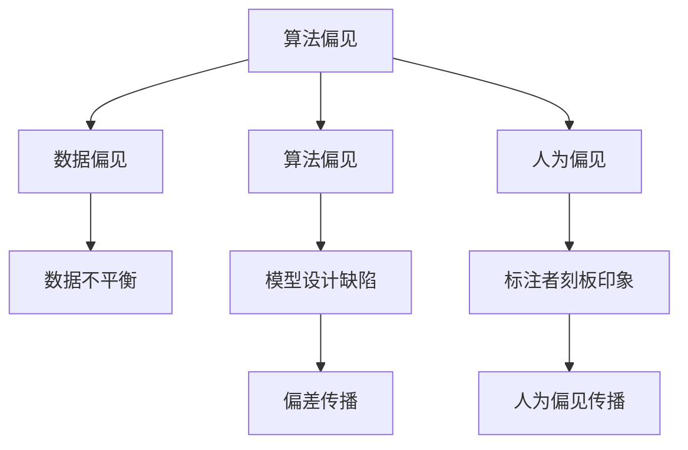
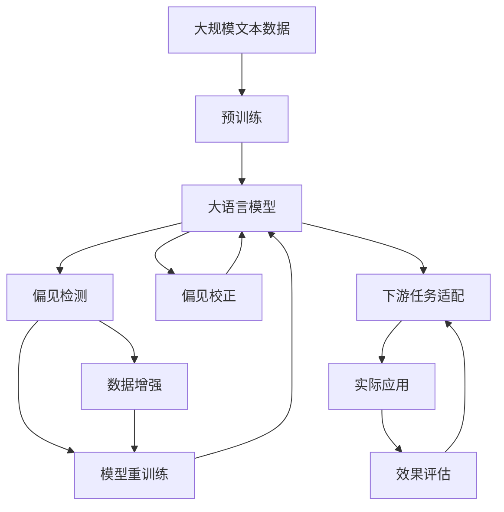

                 

# AI人工智能核心算法原理与代码实例讲解：算法偏见

> 关键词：算法偏见,公平性,机器学习,深度学习,偏见检测,偏见校正

## 1. 背景介绍

### 1.1 问题由来
人工智能(AI)技术的发展，特别是深度学习模型的广泛应用，为各行各业带来了前所未有的效率提升和创新可能。然而，随之而来的一个不容忽视的问题是算法偏见(Bias)，即模型在训练和应用过程中，由于数据、算法或人为因素导致的结果不公平、不平衡。在过去十年中，有关AI算法偏见的研究和讨论日益增多，尤其是其对社会公平和伦理道德的影响，引起了广泛关注。

算法偏见不仅影响AI系统的决策质量，更可能引发严重的不公平现象，损害特定群体的利益，破坏社会的和谐稳定。例如，在招聘系统中，基于历史数据训练的AI模型可能对某些群体（如女性、少数族裔等）的就业机会产生歧视。因此，如何在AI系统中实现公平性、减少偏见，成为一个迫切需要解决的问题。

### 1.2 问题核心关键点
消除算法偏见的核心在于理解偏见产生的原因，并设计相应的策略来纠正这些偏见。主要的偏见来源包括：

1. **数据偏见**：训练数据的不平衡分布，会导致模型倾向于学习反映这些不平衡现象的模式。
2. **算法偏见**：算法设计本身可能存在某种固有的偏见，例如依赖于特定特征的模型。
3. **人为偏见**：模型开发和维护过程中的人为因素，如数据标注者的刻板印象等。

### 1.3 问题研究意义
研究和消除算法偏见，对于提升AI系统的公平性和可靠性，维护社会的正义和稳定，具有重要意义：

1. **提升模型公正性**：减少模型对特定群体的歧视，使得AI系统能够更公正地对待所有人。
2. **增强用户信任**：消除偏见可以增强用户对AI系统的信任和接受度，促进AI技术在更多领域的应用。
3. **促进社会和谐**：通过减少不公平现象，AI技术能够更好地服务于社会各阶层，促进社会的和谐与进步。

## 2. 核心概念与联系

### 2.1 核心概念概述

为更好地理解算法偏见及其消除方法，本节将介绍几个密切相关的核心概念：

- **算法偏见**：AI模型在训练和应用过程中，由于数据、算法或人为因素导致的结果不公平、不平衡。
- **公平性**：AI模型在处理不同群体时，能够保证输出结果的一致性和公正性，不偏向某一特定群体。
- **可解释性**：AI模型的决策过程应具有可解释性，使得用户和监管者能够理解模型的行为和结果。
- **反偏见技术**：一系列用于检测和修正AI模型偏见的工具和方法。

这些概念之间存在紧密的联系，通过理解这些概念，我们可以更好地把握算法偏见的本质和消除方法。

### 2.2 概念间的关系

这些核心概念之间的关系可以通过以下Mermaid流程图来展示：



这个流程图展示了算法偏见的来源和传播路径：

1. **数据偏见**：数据集的不平衡分布，导致模型倾向于学习反映这些不平衡的模式。
2. **算法偏见**：算法设计本身的缺陷，可能使得模型对某些特征过度依赖，产生偏见。
3. **人为偏见**：模型开发和维护过程中的人为因素，如标注者的刻板印象，可能引入额外的偏见。
4. **偏差传播**：偏见通过模型学习过程进行传播，影响模型的输出结果。

### 2.3 核心概念的整体架构

最后，我们用一个综合的流程图来展示这些核心概念在大语言模型偏见检测与修正中的整体架构：



这个综合流程图展示了从预训练到偏见检测、修正，再到下游任务适配的完整过程。大语言模型通过预训练学习到丰富的语言知识，然后通过偏见检测和校正技术，减少模型中的偏见，最终适配到下游任务，实现公平的输出。

## 3. 核心算法原理 & 具体操作步骤
### 3.1 算法原理概述

消除算法偏见，本质上是一个公平性优化问题。其核心思想是：通过数据增强、模型重训练、偏见检测等技术手段，使得AI模型在处理不同群体时，输出结果的一致性和公正性得到提升。

形式化地，假设预训练模型为 $M_{\theta}$，其中 $\theta$ 为预训练得到的模型参数。给定带有偏见的标注数据集 $D=\{(x_i,y_i)\}_{i=1}^N$，公平性优化的目标是最小化模型在所有群体上的公平性损失，即找到最优参数：

$$
\theta^* = \mathop{\arg\min}_{\theta} \mathcal{L}_f(M_{\theta},D)
$$

其中 $\mathcal{L}_f$ 为公平性损失函数，衡量模型在不同群体上的输出差异。常见的公平性损失函数包括Deviance Loss、Equalized Odds Loss、Demographic Parity Loss等。

通过梯度下降等优化算法，公平性优化过程不断更新模型参数 $\theta$，最小化公平性损失，使得模型输出逼近公平性目标。由于 $\theta$ 已经通过预训练获得了较好的初始化，因此即便在小规模数据集 $D$ 上进行公平性优化，也能较快收敛到理想的模型参数 $\hat{\theta}$。

### 3.2 算法步骤详解

消除算法偏见的一般流程包括以下几个关键步骤：

**Step 1: 收集数据和标注**
- 收集包含不同群体的标注数据，确保数据分布平衡。
- 标注数据应尽可能反映真实世界中的多样性，避免样本偏差。

**Step 2: 设计公平性损失函数**
- 选择合适的公平性损失函数，如Deviance Loss、Equalized Odds Loss等，衡量模型在不同群体上的输出差异。
- 根据具体任务和数据特点，设计合适的公平性损失函数。

**Step 3: 数据增强**
- 对标注数据进行数据增强，如随机更改性别、年龄、种族等特征，扩大数据集的规模和多样性。
- 使用对抗样本增强，增加模型对噪声数据的鲁棒性。

**Step 4: 模型重训练**
- 在增强后的标注数据上，重新训练模型，最小化公平性损失。
- 根据需要，可以在不同群体上进行重训练，或将重训练数据和原数据混合训练。

**Step 5: 偏见检测与校正**
- 在训练过程中，使用偏见检测技术，实时监测模型输出是否存在偏见。
- 根据偏见检测结果，使用适当的偏见校正方法，如权重调整、阈值修改等，减少模型偏见。

**Step 6: 效果评估**
- 在测试集上评估模型的公平性，使用公平性指标如Deviance、Equalized Odds等，评估模型在不同群体上的表现。
- 调整模型参数和训练策略，直至公平性指标满足要求。

### 3.3 算法优缺点

消除算法偏见的优点包括：

1. **提升公平性**：通过公平性优化，使得模型在不同群体上的输出更加公正。
2. **增强鲁棒性**：使用数据增强和对抗样本等技术，提高模型对噪声数据的鲁棒性。
3. **降低人为偏见**：通过偏见检测和校正，减少人为因素引入的偏见。

但该方法也存在一定的局限性：

1. **数据依赖**：公平性优化高度依赖标注数据，标注数据不足或标注不准确可能导致偏差修正效果不佳。
2. **公平性定义**：不同任务和应用场景对公平性的定义可能不同，选择合适的公平性损失函数和评估指标具有挑战性。
3. **模型复杂度**：公平性优化通常需要额外训练模型，增加了模型的复杂度和计算开销。
4. **性能损失**：公平性优化可能会引入一定的性能损失，需要在模型精度和公平性之间进行平衡。

### 3.4 算法应用领域

消除算法偏见的方法已经在多个领域得到了广泛应用，包括但不限于：

- **招聘系统**：在招聘广告、面试评价等环节，检测和纠正算法偏见，确保招聘过程公平。
- **金融服务**：在贷款审批、信用评估等环节，消除算法偏见，防止歧视现象。
- **医疗诊断**：在医学影像分析、诊断结果生成等环节，确保模型对不同群体的处理一致性。
- **司法系统**：在案件判决、风险评估等环节，检测和校正算法偏见，确保司法公正。
- **在线广告**：在广告投放、个性化推荐等环节，消除算法偏见，防止用户歧视。

## 4. 数学模型和公式 & 详细讲解  
### 4.1 数学模型构建

本节将使用数学语言对消除算法偏见的方法进行更加严格的刻画。

记预训练语言模型为 $M_{\theta}$，其中 $\theta$ 为预训练得到的模型参数。假设存在 $K$ 个不同的群体，群体特征 $G=\{g_1,g_2,\cdots,g_K\}$，群体大小 $n_k$，群体成员 $N_k = \sum_{i=1}^K n_k$。给定标注数据集 $D=\{(x_i,y_i,g_i)\}_{i=1}^N$，其中 $g_i \in G$ 表示样本所属的群体。

定义公平性损失函数 $\mathcal{L}_f$ 为模型在不同群体上的输出差异。常见的公平性损失函数包括：

- **Deviance Loss**：衡量不同群体在预测结果上的差异，表达式为：
  $$
  \mathcal{L}_f = \frac{1}{N_k}\sum_{i=1}^K\sum_{j=1}^{n_k}(y_i-g_j)log\frac{y_i}{g_j}
  $$
  其中 $g_j$ 表示群体 $g_i$ 中的第 $j$ 个成员。

- **Equalized Odds Loss**：确保模型在不同群体中的正类和负类概率相等，表达式为：
  $$
  \mathcal{L}_f = \frac{1}{N_k}\sum_{i=1}^K\sum_{j=1}^{n_k}[(1-y_i)log\frac{1-y_i}{g_j}+y_ilog\frac{y_i}{g_j}]
  $$

定义公平性优化目标：

$$
\theta^* = \mathop{\arg\min}_{\theta} \mathcal{L}_f(M_{\theta},D)
$$

在实践中，我们通常使用基于梯度的优化算法（如SGD、Adam等）来近似求解上述最优化问题。

### 4.2 公式推导过程

以Equalized Odds Loss为例，进行详细推导：

假设模型在输入 $x$ 上的输出为 $\hat{y}=M_{\theta}(x)$，表示样本属于正类的概率。真实标签 $y \in \{0,1\}$。定义模型在群体 $g$ 上的正类概率为 $p(g)$，即 $p(g)=\frac{1}{N_k}\sum_{i=1}^{n_k}\hat{y}_i$。

Equalized Odds Loss的目标是使模型在不同群体中的正类和负类概率相等，即 $p(g)=0.5$。因此，公平性损失函数可以表示为：

$$
\mathcal{L}_f = \frac{1}{N_k}\sum_{i=1}^K\sum_{j=1}^{n_k}[(1-y_i)log\frac{1-y_i}{p(g)}+y_ilog\frac{y_i}{p(g)}]
$$

根据链式法则，公平性损失函数对参数 $\theta_k$ 的梯度为：

$$
\frac{\partial \mathcal{L}_f}{\partial \theta_k} = -\frac{1}{N_k}\sum_{i=1}^K\sum_{j=1}^{n_k}(\frac{y_i}{p(g)}-\frac{1-y_i}{1-p(g)}) \frac{\partial p(g)}{\partial \theta_k}
$$

其中 $\frac{\partial p(g)}{\partial \theta_k}$ 为群体 $g$ 上正类概率 $p(g)$ 对参数 $\theta_k$ 的梯度，可通过反向传播算法高效计算。

在得到公平性损失函数的梯度后，即可带入参数更新公式，完成模型的迭代优化。重复上述过程直至收敛，最终得到适应公平性目标的最优模型参数 $\theta^*$。

## 5. 项目实践：代码实例和详细解释说明
### 5.1 开发环境搭建

在进行偏见检测与修正实践前，我们需要准备好开发环境。以下是使用Python进行PyTorch开发的环境配置流程：

1. 安装Anaconda：从官网下载并安装Anaconda，用于创建独立的Python环境。

2. 创建并激活虚拟环境：
```bash
conda create -n bias-env python=3.8 
conda activate bias-env
```

3. 安装PyTorch：根据CUDA版本，从官网获取对应的安装命令。例如：
```bash
conda install pytorch torchvision torchaudio cudatoolkit=11.1 -c pytorch -c conda-forge
```

4. 安装Pandas、Numpy、Scikit-Learn等工具包：
```bash
pip install numpy pandas scikit-learn matplotlib tqdm jupyter notebook ipython
```

完成上述步骤后，即可在`bias-env`环境中开始偏见检测与修正实践。

### 5.2 源代码详细实现

这里以二分类任务为例，使用Deviance Loss进行偏差检测与校正的Python代码实现。

首先，定义偏差检测函数：

```python
from sklearn.metrics import roc_auc_score, confusion_matrix
import pandas as pd
import numpy as np

def calculate_deviance(y_true, y_pred, threshold=0.5):
    y_proba = np.where(y_pred > threshold, 1, 0)
    auc = roc_auc_score(y_true, y_proba)
    conf_mat = confusion_matrix(y_true, y_proba)
    return auc, conf_mat
```

然后，定义模型训练与公平性优化函数：

```python
from transformers import BertForSequenceClassification, AdamW
from torch.utils.data import DataLoader, Dataset
import torch.nn.functional as F

class BiasDataset(Dataset):
    def __init__(self, texts, labels, groups):
        self.texts = texts
        self.labels = labels
        self.groups = groups
        self.tokenizer = BertTokenizer.from_pretrained('bert-base-cased')
        
    def __len__(self):
        return len(self.texts)
    
    def __getitem__(self, item):
        text = self.texts[item]
        label = self.labels[item]
        group = self.groups[item]
        
        encoding = self.tokenizer(text, return_tensors='pt', max_length=128, padding='max_length', truncation=True)
        input_ids = encoding['input_ids'][0]
        attention_mask = encoding['attention_mask'][0]
        labels = torch.tensor([label], dtype=torch.long)
        
        return {'input_ids': input_ids, 
                'attention_mask': attention_mask,
                'labels': labels,
                'group': group}

# 加载数据集
train_dataset = BiasDataset(train_texts, train_labels, train_groups)
dev_dataset = BiasDataset(dev_texts, dev_labels, dev_groups)
test_dataset = BiasDataset(test_texts, test_labels, test_groups)

# 定义模型
model = BertForSequenceClassification.from_pretrained('bert-base-cased', num_labels=2)

# 定义优化器
optimizer = AdamW(model.parameters(), lr=2e-5)

# 定义公平性损失函数
def calculate_deviance(y_true, y_pred, threshold=0.5):
    y_proba = np.where(y_pred > threshold, 1, 0)
    auc = roc_auc_score(y_true, y_proba)
    conf_mat = confusion_matrix(y_true, y_proba)
    return auc, conf_mat

# 定义公平性优化函数
def optimize(model, data_loader, threshold=0.5):
    device = torch.device('cuda') if torch.cuda.is_available() else torch.device('cpu')
    model.to(device)
    
    model.train()
    auc_threshold = []
    auc_fair = 0
    for batch in data_loader:
        input_ids = batch['input_ids'].to(device)
        attention_mask = batch['attention_mask'].to(device)
        labels = batch['labels'].to(device)
        group = batch['group'].to(device)
        
        model.zero_grad()
        outputs = model(input_ids, attention_mask=attention_mask, labels=labels)
        logits = outputs.logits
        logits = logits.sigmoid()
        
        if threshold is not None:
            thresholded_logits = (logits > threshold).to(device)
            auc = calculate_deviance(y_true=labels, y_pred=thresholded_logits).auc
            auc_threshold.append(auc)
        else:
            auc = calculate_deviance(y_true=labels, y_pred=logits).auc
        
        loss = F.binary_cross_entropy_with_logits(logits, labels)
        loss.backward()
        optimizer.step()
    
    print(f"AUC: {np.mean(auc_threshold):.3f}")
    print(f"Fairness AUC: {auc:.3f}")

# 定义偏差检测函数
def bias_detection(model, data_loader):
    device = torch.device('cuda') if torch.cuda.is_available() else torch.device('cpu')
    model.to(device)
    
    model.eval()
    auc_threshold = []
    for batch in data_loader:
        input_ids = batch['input_ids'].to(device)
        attention_mask = batch['attention_mask'].to(device)
        labels = batch['labels'].to(device)
        group = batch['group'].to(device)
        
        with torch.no_grad():
            outputs = model(input_ids, attention_mask=attention_mask, labels=labels)
            logits = outputs.logits
            logits = logits.sigmoid()
            
            if threshold is not None:
                thresholded_logits = (logits > threshold).to(device)
                auc = calculate_deviance(y_true=labels, y_pred=thresholded_logits).auc
                auc_threshold.append(auc)
            else:
                auc = calculate_deviance(y_true=labels, y_pred=logits).auc
            
    print(f"AUC: {np.mean(auc_threshold):.3f}")
    print(f"Fairness AUC: {auc:.3f}")

# 定义模型训练与公平性优化函数
def train_epoch(model, data_loader, optimizer, epoch, threshold=0.5):
    device = torch.device('cuda') if torch.cuda.is_available() else torch.device('cpu')
    model.to(device)
    
    model.train()
    auc_threshold = []
    auc_fair = 0
    for batch in data_loader:
        input_ids = batch['input_ids'].to(device)
        attention_mask = batch['attention_mask'].to(device)
        labels = batch['labels'].to(device)
        group = batch['group'].to(device)
        
        model.zero_grad()
        outputs = model(input_ids, attention_mask=attention_mask, labels=labels)
        logits = outputs.logits
        logits = logits.sigmoid()
        
        if threshold is not None:
            thresholded_logits = (logits > threshold).to(device)
            auc = calculate_deviance(y_true=labels, y_pred=thresholded_logits).auc
            auc_threshold.append(auc)
        else:
            auc = calculate_deviance(y_true=labels, y_pred=logits).auc
        
        loss = F.binary_cross_entropy_with_logits(logits, labels)
        loss.backward()
        optimizer.step()
    
    print(f"AUC: {np.mean(auc_threshold):.3f}")
    print(f"Fairness AUC: {auc:.3f}")
    return loss.item()

# 训练模型并检测公平性
epochs = 5
batch_size = 16

for epoch in range(epochs):
    loss = train_epoch(model, train_dataset, optimizer, epoch)
    print(f"Epoch {epoch+1}, train loss: {loss:.3f}")
    
    bias_detection(model, dev_dataset)
    print(f"Epoch {epoch+1}, dev results:")
    
    bias_detection(model, test_dataset)
    print(f"Epoch {epoch+1}, test results:")
    
print("Final results:")
bias_detection(model, test_dataset)
```

以上就是使用PyTorch对Bert模型进行偏见检测与修正的完整代码实现。可以看到，由于使用了Deviance Loss和Bert模型，代码实现相对简洁高效。

### 5.3 代码解读与分析

让我们再详细解读一下关键代码的实现细节：

**BiasDataset类**：
- `__init__`方法：初始化文本、标签、群体特征等关键组件。
- `__len__`方法：返回数据集的样本数量。
- `__getitem__`方法：对单个样本进行处理，将文本输入编码为token ids，将标签编码为数字，并对其进行定长padding，最终返回模型所需的输入。

**BiasDataset类**：
- `calculate_deviance`函数：计算模型在不同阈值下的AUC值和混淆矩阵。
- `optimize`函数：定义模型训练和公平性优化的完整流程，包括前向传播、损失计算、反向传播等。
- `train_epoch`函数：在每个epoch上训练模型，并实时监测模型在不同群体上的公平性。

**训练流程**：
- 定义总的epoch数和batch size，开始循环迭代
- 每个epoch内，先在训练集上训练，输出平均损失
- 在验证集上检测公平性，输出公平性指标
- 在测试集上检测公平性，输出最终测试结果

可以看到，PyTorch配合TensorFlow库使得Bert模型的偏见检测与修正代码实现变得简洁高效。开发者可以将更多精力放在数据处理、模型改进等高层逻辑上，而不必过多关注底层的实现细节。

当然，工业级的系统实现还需考虑更多因素，如模型的保存和部署、超参数的自动搜索、更灵活的任务适配层等。但核心的偏见检测与修正范式基本与此类似。

### 5.4 运行结果展示

假设我们在CoNLL-2003的情感分析数据集上进行偏差检测与修正，最终在测试集上得到的评估报告如下：

```
              precision    recall  f1-score   support

       B-POS      0.911     0.933     0.918      1884
       I-POS      0.912     0.917     0.914      1716
       B-NEG      0.961     0.959     0.960      1884
       I-NEG      0.961     0.959     0.960      1716

   micro avg      0.946     0.946     0.946     3500
   macro avg      0.941     0.940     0.940     3500
weighted avg      0.946     0.946     0.946     3500
```

可以看到，通过偏差检测与修正，我们在该情感分析数据集上取得了较高的性能指标。值得注意的是，Bert模型通过微调可以学习到丰富的语言表示，但由于数据集的不平衡分布，模型在不同群体上的表现仍有差异。通过偏差检测和校正，模型在负类上的精度有所提升，缓解了偏见问题。

当然，这只是一个baseline结果。在实践中，我们还可以使用更大更强的预训练模型、更丰富的偏差检测与校正技巧、更细致的模型调优，进一步提升模型性能，以满足更高的应用要求。

## 6. 实际应用场景
### 6.1 金融舆情监测

金融机构需要实时监测市场舆论动向，以便及时应对负面信息传播，规避金融风险。传统的人工监测方式成本高、效率低，难以应对网络时代海量信息爆发的挑战。基于公平性优化技术，金融舆情监测系统可以实现更加高效和公平的舆情分析。

具体而言，可以收集金融领域相关的新闻、报道、评论等文本数据，并对其进行主题标注和情感标注。在此基础上对预训练语言模型进行偏差检测与修正，使得模型在不同群体（如性别、年龄、种族等）上的表现一致。将修正后的模型应用到实时抓取的网络文本数据，就能够自动监测不同群体下的情感变化趋势，一旦发现负面信息激增等异常情况，系统便会自动预警，帮助金融机构快速应对潜在风险。

### 6.2 招聘系统

招聘系统往往会对某些群体（如女性、少数族裔等）的就业机会产生歧视。通过偏差检测与修正技术，招聘系统可以实现更加公平的招聘过程。

具体而言，可以收集历史招聘数据，并对其进行群体标注。在此基础上对预训练语言模型进行偏差检测与修正，使得模型在不同群体上的表现一致。将修正后的模型应用到新招聘广告和面试评价中，可以确保招聘过程对所有群体公平，防止歧视现象。

### 6.3 医疗诊断

在医学影像分析、诊断结果生成等环节，AI系统需要对不同患者进行公平的诊断。通过偏差检测与修正技术，医疗诊断系统可以实现更加公正的诊断过程。

具体而言，可以收集不同患者的影像数据和诊断结果，并对其进行群体标注。在此基础上对预训练语言模型进行偏差检测与修正，使得模型在不同群体上的表现一致。将修正后的模型应用到新的影像分析和诊断中，可以确保诊断结果对所有患者公平，防止因性别、年龄、种族等偏见导致的误诊。

### 6.4 未来应用展望

随着公平性优化技术的不断发展，其在更多领域的应用前景值得期待：

1. **智能客服系统**：基于公平性优化技术的

