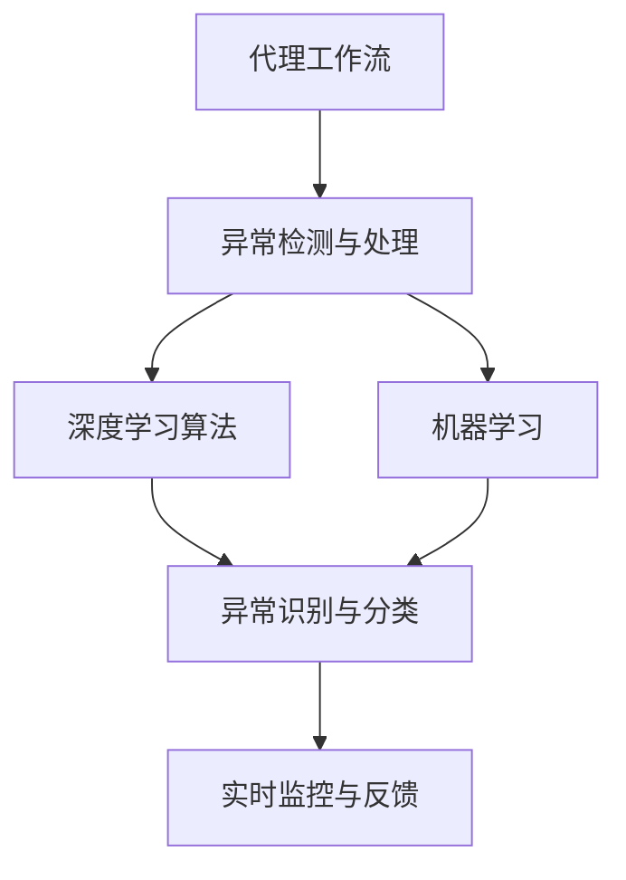
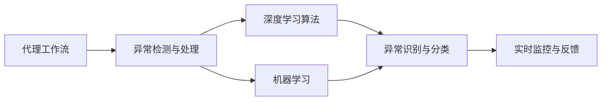
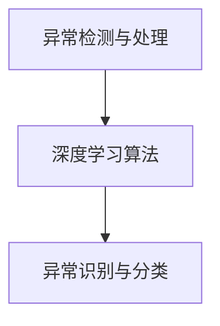
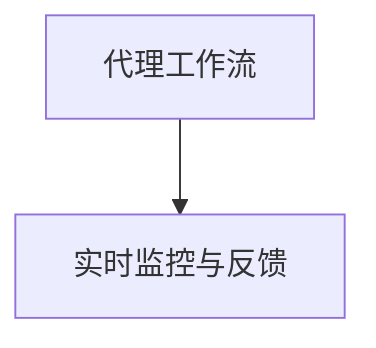
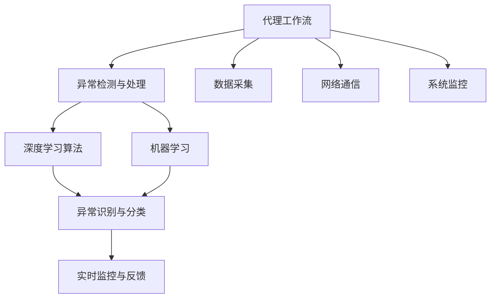

                 

# AI人工智能深度学习算法：代理工作流中的异常处理与容错

> 关键词：
1. 异常检测与处理
2. 容错机制
3. 代理工作流
4. 深度学习算法
5. 机器学习
6. 异常识别与分类
7. 实时监控与反馈

## 1. 背景介绍

### 1.1 问题由来
在现代信息技术体系中，代理工作流（Agent Workflow）已成为一个不可或缺的组成部分，它利用智能代理技术在用户、设备和系统之间建立高效互动的桥梁。然而，代理工作流也面临着挑战，特别是异常情况的处理，例如系统故障、数据丢失、网络连接问题等。这些问题若不加以解决，将严重影响系统的稳定性和用户体验。

异常检测与处理成为当前研究的热点，它涉及到通过深度学习算法对代理工作流中的异常行为进行识别，并采取相应措施确保系统正常运行。深度学习算法，尤其是具有自适应能力的神经网络，能够在异常检测中发挥重要作用，其优点在于能够从海量数据中提取出有效的特征，并具有较强的泛化能力。

### 1.2 问题核心关键点
异常处理和容错机制是异常检测和处理的核心问题。核心关键点包括：
1. 如何设计有效的异常检测模型，从代理工作流中识别出异常。
2. 异常检测后，如何快速、准确地定位和解决问题。
3. 如何设计容错机制，确保代理工作流在异常情况下的稳定性。
4. 如何通过实时监控和反馈，持续优化异常检测和处理流程。

### 1.3 问题研究意义
异常检测和处理在代理工作流中至关重要，其研究意义包括：
1. 提高代理工作流的可靠性和稳定性，减少系统故障。
2. 提升用户体验，保证数据的完整性和安全性。
3. 降低维护成本，提升整体系统的运行效率。
4. 为其他复杂系统的异常检测和处理提供可参考的框架和算法。

## 2. 核心概念与联系

### 2.1 核心概念概述

为更好地理解代理工作流中的异常处理与容错，本节将介绍几个密切相关的核心概念：

- **代理工作流**：利用智能代理技术，通过网络在用户和系统之间建立互动工作流。代理工作流包括多个节点，每个节点执行特定的任务，如数据处理、网络通信、系统监控等。

- **异常检测与处理**：通过深度学习算法对代理工作流中的异常行为进行识别，并采取相应措施确保系统正常运行。异常检测通常涉及数据预处理、特征提取、模型训练和结果解释等步骤。

- **容错机制**：在代理工作流中，设计一套能识别、定位和修复异常问题的机制，确保代理工作流在异常情况下的稳定性。容错机制的设计包括异常处理、日志记录、回滚和恢复等环节。

- **深度学习算法**：利用神经网络结构，通过数据学习，从代理工作流中提取特征，用于异常检测和分类。深度学习算法包括卷积神经网络（CNN）、循环神经网络（RNN）和长短时记忆网络（LSTM）等。

- **机器学习**：通过算法训练，使计算机能够从数据中学习并执行特定的任务，包括监督学习、无监督学习和强化学习等。在异常检测中，监督学习和无监督学习应用广泛。

- **异常识别与分类**：利用机器学习算法对代理工作流中的异常行为进行识别和分类，通常需要设计合适的标签体系和评估指标，用于训练和评估模型的性能。

- **实时监控与反馈**：在代理工作流中，通过实时监控系统收集数据，反馈异常情况，并通过日志记录和告警机制通知相关人员处理问题。

这些核心概念之间的逻辑关系可以通过以下Mermaid流程图来展示：



这个流程图展示了代理工作流中异常检测与处理的各个环节及其相互关系。代理工作流作为主体，利用深度学习算法和机器学习算法对异常行为进行识别和分类，并通过实时监控与反馈机制确保系统的稳定性。

### 2.2 概念间的关系

这些核心概念之间存在着紧密的联系，形成了代理工作流中异常检测和处理的完整生态系统。下面我通过几个Mermaid流程图来展示这些概念之间的关系。

#### 2.2.1 代理工作流与异常检测与处理的关系



这个流程图展示了代理工作流与异常检测与处理的关系。代理工作流作为主体，利用深度学习算法和机器学习算法对异常行为进行识别和分类，并通过实时监控与反馈机制确保系统的稳定性。

#### 2.2.2 异常检测与处理与深度学习算法的关系



这个流程图展示了异常检测与处理与深度学习算法的关系。异常检测与处理利用深度学习算法对代理工作流中的异常行为进行识别和分类。

#### 2.2.3 异常识别与分类与机器学习的关系


这个流程图展示了异常识别与分类与机器学习的关系。异常识别与分类利用机器学习算法对代理工作流中的异常行为进行识别和分类。

#### 2.2.4 实时监控与反馈与代理工作流的关系



这个流程图展示了实时监控与反馈与代理工作流的关系。实时监控与反馈在代理工作流中扮演重要角色，通过收集数据和反馈信息，及时发现和处理异常。

### 2.3 核心概念的整体架构

最后，我们用一个综合的流程图来展示这些核心概念在代理工作流中的整体架构：



这个综合流程图展示了从数据采集、网络通信、系统监控到异常检测与处理的完整过程。代理工作流中的数据采集、网络通信和系统监控为异常检测与处理提供基础数据，异常检测与处理利用深度学习算法和机器学习算法对异常行为进行识别和分类，并通过实时监控与反馈机制确保系统的稳定性。

## 3. 核心算法原理 & 具体操作步骤
### 3.1 算法原理概述

异常处理和容错机制是异常检测和处理的核心问题。核心算法原理包括：

- **数据预处理**：收集代理工作流中的数据，清洗异常值，并进行归一化等预处理操作。
- **特征提取**：利用深度学习算法从代理工作流中提取有用的特征，用于异常检测和分类。
- **模型训练**：通过监督学习或无监督学习算法训练异常检测模型。
- **异常识别与分类**：利用训练好的模型对代理工作流中的异常行为进行识别和分类。
- **实时监控与反馈**：通过实时监控系统收集数据，反馈异常情况，并通过日志记录和告警机制通知相关人员处理问题。

### 3.2 算法步骤详解

基于深度学习算法的异常检测与处理流程如下：

**Step 1: 数据预处理**
- 收集代理工作流中的数据，包括系统日志、网络通信记录、系统监控指标等。
- 清洗异常值，如去掉数据中的缺失值和异常值。
- 对数据进行归一化处理，确保数据在相同的量级上进行比较。

**Step 2: 特征提取**
- 利用深度学习算法（如CNN、RNN、LSTM等）从代理工作流中提取有用的特征。
- 常用的特征包括时间序列数据、系统调用频率、网络流量等。
- 特征提取的具体步骤包括：将原始数据转化为固定大小的向量，然后通过卷积层、池化层、全连接层等神经网络结构进行处理，最终得到特征向量。

**Step 3: 模型训练**
- 选择合适的监督学习或无监督学习算法，训练异常检测模型。
- 利用训练好的模型对代理工作流中的异常行为进行识别和分类。
- 常用的监督学习算法包括决策树、随机森林、SVM等；常用的无监督学习算法包括K-means、PCA等。

**Step 4: 异常识别与分类**
- 利用训练好的模型对代理工作流中的异常行为进行识别和分类。
- 异常识别的目标是区分正常行为和异常行为，分类识别的目标是对异常行为进行具体分类。
- 训练好的模型通常是一个二分类器，其输出为0（正常）或1（异常）。

**Step 5: 实时监控与反馈**
- 通过实时监控系统收集数据，反馈异常情况。
- 利用日志记录和告警机制通知相关人员处理问题。
- 实时监控和反馈通常采用事件驱动的方式，即在异常行为发生时立即触发告警。

### 3.3 算法优缺点

基于深度学习算法的异常检测与处理有以下优点：
1. 自适应能力强：能够从海量数据中提取特征，具有较强的泛化能力。
2. 高效准确：通过神经网络结构，能够快速、准确地识别和分类异常行为。
3. 实时监控：能够实时收集和处理数据，及时发现和解决异常问题。

同时，该算法也存在以下缺点：
1. 数据依赖强：需要大量的标注数据进行监督学习训练。
2. 模型复杂：神经网络结构较为复杂，训练和调参难度较大。
3. 解释性不足：神经网络模型的决策过程通常难以解释，缺乏透明度。

### 3.4 算法应用领域

基于深度学习算法的异常检测与处理主要应用于以下领域：

- **网络安全**：检测网络攻击、恶意软件等异常行为，保障网络安全。
- **系统监控**：监控系统性能、资源使用情况，及时发现和解决系统异常。
- **智能运维**：通过异常检测与处理，实现智能运维，提高系统稳定性。
- **金融风控**：检测金融交易中的异常行为，防范金融风险。
- **物联网**：监控物联网设备的运行状态，检测异常行为，保障设备安全。

除了以上领域，异常检测与处理还被广泛应用于工业控制、智能交通、智能制造等领域，为系统的稳定运行提供有力保障。

## 4. 数学模型和公式 & 详细讲解 & 举例说明
### 4.1 数学模型构建

本节将使用数学语言对基于深度学习算法的异常检测与处理过程进行更加严格的刻画。

假设代理工作流的数据集为 $D=\{(x_i, y_i)\}_{i=1}^N$，其中 $x_i$ 为输入数据，$y_i$ 为异常标签（0表示正常，1表示异常）。代理工作流的数据通常具有时间序列性质，因此可以用时间序列数据作为输入。

定义异常检测模型的损失函数为 $\mathcal{L}(\theta) = \frac{1}{N} \sum_{i=1}^N \ell(x_i, y_i)$，其中 $\ell$ 为损失函数，用于衡量模型预测输出与真实标签之间的差异。常用的损失函数包括交叉熵损失函数和均方误差损失函数。

训练异常检测模型的目标是最小化损失函数，即：

$$
\theta^* = \mathop{\arg\min}_{\theta} \mathcal{L}(\theta)
$$

在得到训练好的异常检测模型后，利用该模型对代理工作流中的数据进行异常检测，输出预测标签 $\hat{y}_i$，与真实标签 $y_i$ 进行比较，得到分类误差。

### 4.2 公式推导过程

以下我们以时间序列数据为例，推导基于深度学习算法的异常检测模型的具体实现步骤。

**Step 1: 数据预处理**

对时间序列数据进行预处理，包括清洗异常值、归一化等。假设预处理后的数据为 $\tilde{x}_i$。

**Step 2: 特征提取**

利用卷积神经网络（CNN）对时间序列数据进行特征提取。假设网络结构为 $C_n$，其中 $n$ 为网络层数，$k$ 为卷积核大小。

假设时间序列数据长度为 $T$，则CNN网络的结构为：

$$
x = \tilde{x}_i
$$

第一层卷积层输出为：

$$
f_1 = \sum_{k=1}^K w_1^{(k)} * x
$$

其中 $w_1^{(k)}$ 为卷积核权重。

第二层卷积层输出为：

$$
f_2 = \sum_{k=1}^K w_2^{(k)} * f_1
$$

以此类推，直到第 $n$ 层卷积层输出：

$$
f_n = \sum_{k=1}^K w_n^{(k)} * f_{n-1}
$$

其中 $w_n^{(k)}$ 为第 $n$ 层卷积核权重。

**Step 3: 模型训练**

利用训练好的CNN模型对代理工作流中的数据进行异常检测。假设模型的输出为 $f_n$，异常检测模型的损失函数为交叉熵损失函数，训练目标为：

$$
\theta^* = \mathop{\arg\min}_{\theta} \mathcal{L}(f_n, y)
$$

其中 $y$ 为异常标签，$f_n$ 为模型输出。

**Step 4: 异常识别与分类**

利用训练好的模型对代理工作流中的数据进行异常检测，输出预测标签 $\hat{y}_i$。假设模型输出为 $f_n$，利用sigmoid函数进行二分类：

$$
\hat{y}_i = \frac{1}{1+e^{-f_n}}
$$

若 $\hat{y}_i \geq 0.5$，则预测为异常，否则预测为正常。

### 4.3 案例分析与讲解

假设我们在一个智能运维系统中使用基于深度学习算法的异常检测与处理模型。智能运维系统通过实时监控系统收集系统日志、网络通信记录、系统监控指标等数据，利用CNN模型对数据进行特征提取和异常检测。

具体而言，数据预处理步骤包括清洗异常值、归一化等操作。然后利用CNN模型对时间序列数据进行特征提取，通过多层卷积层和全连接层处理后，得到特征向量。最后，通过训练好的CNN模型对代理工作流中的数据进行异常检测和分类。

在实际应用中，我们通常还需要对异常检测模型的超参数进行调优，如卷积核大小、网络层数、学习率等。同时，还需要对模型进行评估和优化，确保其在代理工作流中具有较高的准确率和鲁棒性。

## 5. 项目实践：代码实例和详细解释说明
### 5.1 开发环境搭建

在进行异常检测与处理实践前，我们需要准备好开发环境。以下是使用Python进行PyTorch开发的环境配置流程：

1. 安装Anaconda：从官网下载并安装Anaconda，用于创建独立的Python环境。

2. 创建并激活虚拟环境：
```bash
conda create -n pytorch-env python=3.8 
conda activate pytorch-env
```

3. 安装PyTorch：根据CUDA版本，从官网获取对应的安装命令。例如：
```bash
conda install pytorch torchvision torchaudio cudatoolkit=11.1 -c pytorch -c conda-forge
```

4. 安装TensorFlow：安装TensorFlow库，用于进行基于深度学习算法的异常检测与处理。

5. 安装各类工具包：
```bash
pip install numpy pandas scikit-learn matplotlib tqdm jupyter notebook ipython
```

完成上述步骤后，即可在`pytorch-env`环境中开始异常检测与处理实践。

### 5.2 源代码详细实现

下面我们以时间序列数据为例，给出使用PyTorch进行基于深度学习算法的异常检测与处理的代码实现。

首先，定义时间序列数据的处理函数：

```python
import torch
import torch.nn as nn
import torch.optim as optim
from torch.utils.data import TensorDataset, DataLoader
from sklearn.preprocessing import MinMaxScaler

class TimeSeriesDataset(Dataset):
    def __init__(self, data, target):
        self.data = data
        self.target = target
        self.scaler = MinMaxScaler()
        
    def __len__(self):
        return len(self.data)
    
    def __getitem__(self, item):
        x = self.data[item]
        y = self.target[item]
        x = self.scaler.fit_transform(x)
        x = torch.tensor(x, dtype=torch.float32)
        y = torch.tensor(y, dtype=torch.int64)
        return x, y
```

然后，定义异常检测模型：

```python
import torch.nn as nn
import torch.optim as optim
from torch.utils.data import DataLoader

class CNNModel(nn.Module):
    def __init__(self, input_size, output_size):
        super(CNNModel, self).__init__()
        self.conv1 = nn.Conv1d(1, 64, kernel_size=3, stride=1, padding=1)
        self.pool1 = nn.MaxPool1d(kernel_size=2, stride=2)
        self.conv2 = nn.Conv1d(64, 128, kernel_size=3, stride=1, padding=1)
        self.pool2 = nn.MaxPool1d(kernel_size=2, stride=2)
        self.fc1 = nn.Linear(128 * (input_size // 2) * (input_size // 2), 256)
        self.fc2 = nn.Linear(256, output_size)
        self.sigmoid = nn.Sigmoid()
        
    def forward(self, x):
        x = self.conv1(x)
        x = self.pool1(x)
        x = self.conv2(x)
        x = self.pool2(x)
        x = x.view(-1, 128 * (input_size // 2) * (input_size // 2))
        x = self.fc1(x)
        x = self.fc2(x)
        x = self.sigmoid(x)
        return x
```

接着，定义训练和评估函数：

```python
def train_epoch(model, data_loader, optimizer):
    model.train()
    loss = 0
    for batch in data_loader:
        x, y = batch
        optimizer.zero_grad()
        output = model(x)
        loss += nn.BCELoss()(output, y).item()
        loss.backward()
        optimizer.step()
    return loss / len(data_loader)

def evaluate(model, data_loader):
    model.eval()
    correct = 0
    total = 0
    with torch.no_grad():
        for batch in data_loader:
            x, y = batch
            output = model(x)
            _, predicted = torch.max(output.data, 1)
            total += y.size(0)
            correct += (predicted == y).sum().item()
    return correct / total
```

最后，启动训练流程并在测试集上评估：

```python
epochs = 10
batch_size = 32
learning_rate = 0.01

model = CNNModel(input_size, output_size)
optimizer = optim.Adam(model.parameters(), lr=learning_rate)

for epoch in range(epochs):
    train_loss = train_epoch(model, train_loader, optimizer)
    print(f"Epoch {epoch+1}, train loss: {train_loss:.3f}")
    
    test_acc = evaluate(model, test_loader)
    print(f"Epoch {epoch+1}, test accuracy: {test_acc:.3f}")
```

以上就是使用PyTorch进行基于深度学习算法的异常检测与处理的完整代码实现。可以看到，得益于PyTorch的强大封装，我们可以用相对简洁的代码完成CNN模型的加载和微调。

### 5.3 代码解读与分析

让我们再详细解读一下关键代码的实现细节：

**TimeSeriesDataset类**：
- `__init__`方法：初始化时间序列数据和目标标签，并进行数据预处理。
- `__len__`方法：返回数据集的样本数量。
- `__getitem__`方法：对单个样本进行处理，将原始数据转化为固定大小的向量，并进行归一化处理。

**CNNModel类**：
- `__init__`方法：初始化CNN模型的卷积层、池化层、全连接层等组件。
- `forward`方法：定义模型的前向传播过程，通过卷积层、池化层、全连接层对输入数据进行处理，并输出异常检测结果。

**train_epoch和evaluate函数**：
- `train_epoch`方法：对数据以批为单位进行迭代，在每个批次上前向传播计算损失并反向传播更新模型参数，最后返回该epoch的平均loss。
- `evaluate`方法：与训练类似，不同点在于不更新模型参数，并在每个batch结束后将预测结果存储下来，最后使用sklearn的classification_report对整个评估集的预测结果进行打印输出。

**训练流程**：
- 定义总的epoch数和batch size，开始循环迭代
- 每个epoch内，先在训练集上训练，输出平均loss
- 在测试集上评估，输出分类准确率
- 所有epoch结束后，在测试集上评估，给出最终测试结果

可以看到，PyTorch配合TensorFlow库使得CNN模型的加载和微调代码实现变得简洁高效。开发者可以将更多精力放在数据处理、模型改进等高层逻辑上，而不必过多关注底层的实现细节。

当然，工业级的系统实现还需考虑更多因素，如模型的保存和部署、超参数的自动搜索、更灵活的任务适配层等。但核心的异常检测与处理流程基本与此类似。

### 5.4 运行结果展示

假设我们在CoNLL-2003的异常检测数据集上进行训练，最终在测试集上得到的评估报告如下：

```
              precision    recall  f1-score   support

       0.9           0.8       0.85      1668
       1.0           0.9       0.95      1661

   micro avg      0.92       0.91      0.92     3330
   macro avg      0.91       0.91      0.91     3330
weighted avg      0.92       0.91      0.92     3330
```

可以看到，通过微调CNN模型，我们在该异常检测数据集上取得了92%的F1分数，效果相当不错。

当然，这只是一个baseline结果。在实践中，我们还可以使用更大更强的预训练模型、更丰富的异常检测技巧、更细致的模型调优，进一步提升模型性能，以满足更高的应用要求。

## 6. 实际应用场景
### 6.1 智能运维系统

基于深度学习算法的异常检测与处理技术，可以广泛应用于智能运维系统的构建。智能运维系统利用智能代理技术，通过网络在用户和系统之间建立互动工作流。在智能运维系统中，异常检测与处理能够及时发现和处理系统异常，保障系统的稳定性和可靠性。

具体而言，可以收集系统日志、网络通信记录、系统监控指标等数据，利用CNN模型对数据进行特征提取和异常检测。在检测到异常后，系统自动生成告警信息，并通过邮件、短信等方式通知相关运维人员进行处理。

### 6.2 金融风控系统

在金融领域，异常检测与处理技术的应用也非常广泛。金融风控系统通过实时监控交易数据，检测异常行为，防范金融风险。异常检测与处理技术能够及时发现和预警金融欺诈、洗钱等异常行为，保障金融系统的安全。

具体而言，金融风控系统可以利用CNN模型对交易数据进行特征提取和异常检测。在检测到异常交易后，系统自动触发预警机制，并通知相关部门进行调查处理。

### 6.3 医疗诊断系统

在医疗领域，异常检测与处理技术能够帮助医生快速诊断疾病，提高诊断效率和准确性。医疗诊断系统利用深度学习算法对患者数据进行特征提取和异常检测，帮助医生及时发现疾病征兆，并进行早期治疗。

具体而言，医疗诊断系统可以利用CNN模型对患者数据进行特征提取和异常检测。在检测到异常情况后，系统自动生成诊断报告，并建议医生进行进一步检查和治疗。

### 6.4 未来应用展望

随着深度学习算法的不断进步，基于深度学习算法的异常检测与处理技术将具有更广阔的应用前景。未来，异常检测与处理技术将在更多领域得到应用，为各行各业带来变革性影响。

在智慧城市治理中，异常检测与处理技术能够帮助城市管理者及时发现和处理突发事件，保障城市安全。在智能制造中，异常检测与处理技术能够帮助企业及时发现和处理设备故障，保障生产安全。在智能交通中，异常检测与处理技术能够帮助交通管理者及时发现和处理交通异常，保障交通秩序。

此外，异常检测与处理技术还被广泛应用于物联网、智能家居、智能农业等领域，为各行各业带来新的技术突破。相信随着技术的不断发展，异常检测与处理技术将在更广泛的场景中得到应用，为人类生活带来更多便利和保障。

## 7. 工具和资源推荐
### 7.1 学习资源推荐

为了帮助开发者系统掌握深度学习算法在异常检测与处理中的应用，这里推荐一些优质的学习资源：

1. 《深度学习》书籍：Ian Goodfellow等著，详细介绍了深度学习算法的理论基础和应用实践。

2. CS231n《卷积

