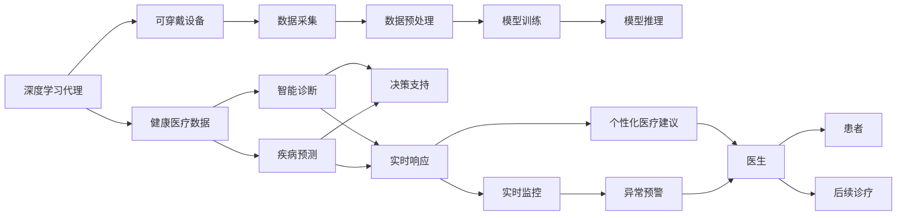
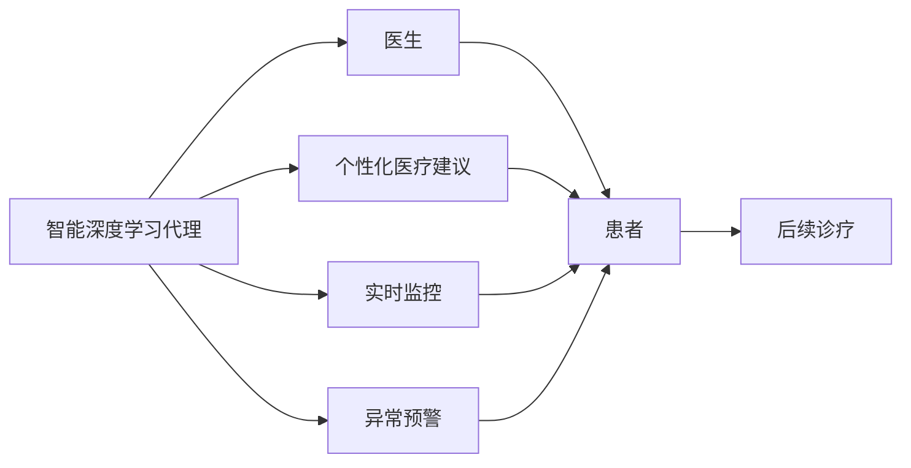
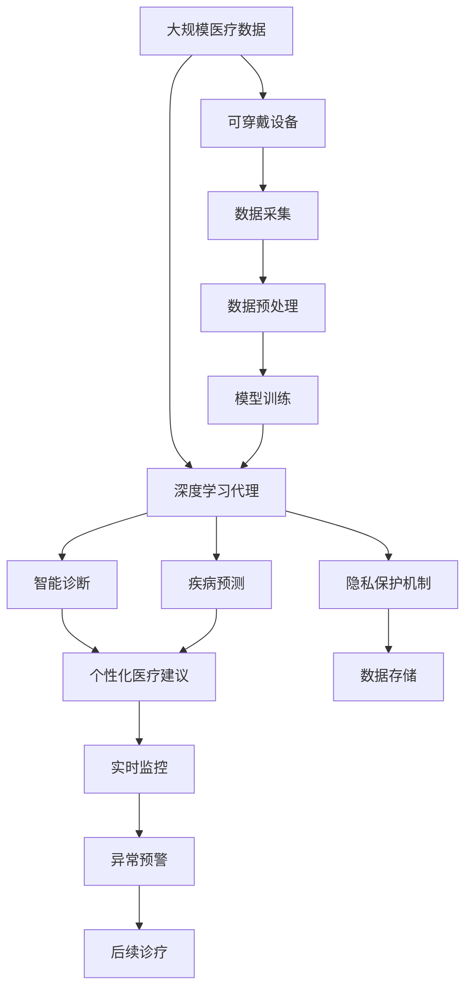

                 

# AI人工智能深度学习算法：智能深度学习代理在健康医疗领域的应用策略

> 关键词：深度学习代理,健康医疗,智能诊断,疾病预测,药物研发,可穿戴设备,隐私保护

## 1. 背景介绍

### 1.1 问题由来

随着人工智能技术的快速发展，深度学习算法在医疗领域的应用越来越广泛。从智能诊断到疾病预测，从药物研发到可穿戴设备，深度学习正在开启医疗行业的变革。其中，智能深度学习代理（Deep Learning Agent）在健康医疗领域的应用尤为引人关注。智能深度学习代理是指利用深度学习模型构建的、能够自主学习、推理和决策的代理系统，其核心在于能够基于历史数据和实时信息，自主分析诊断、预测疾病风险并推荐个性化治疗方案。

### 1.2 问题核心关键点

智能深度学习代理在健康医疗领域的应用，主要集中在以下几个核心关键点上：

- 大数据分析：智能深度学习代理需要处理和分析海量医疗数据，包括电子病历、基因组数据、生物标记物等。
- 自主学习：代理系统能够自主学习疾病模式和患者特征，无需人工干预。
- 实时响应：代理系统能够实时响应医生和患者的查询，提供个性化医疗建议。
- 决策支持：代理系统能够辅助医生进行决策，提供诊断和治疗方案。
- 隐私保护：代理系统需要确保医疗数据的安全性和隐私性，避免数据泄露和滥用。

这些关键点共同构成了智能深度学习代理在健康医疗领域应用的基石，对其性能和效果有着直接的影响。

### 1.3 问题研究意义

智能深度学习代理在健康医疗领域的应用，具有重要意义：

1. **提高诊疗效率**：通过自动化数据分析和决策支持，智能代理能够显著提高诊疗效率，减少医生工作负担。
2. **提升诊断准确性**：基于深度学习模型的自主学习能力，代理系统能够更准确地识别疾病和预测病情，避免误诊和漏诊。
3. **推动精准医疗**：代理系统能够根据患者个体差异，推荐个性化治疗方案，实现精准医疗。
4. **促进药物研发**：代理系统能够分析基因数据和临床试验数据，加速药物发现和研发进程。
5. **增强可穿戴设备的功能**：代理系统能够对可穿戴设备采集的健康数据进行分析和决策，提高设备的应用价值。
6. **保障数据安全**：代理系统能够采用数据加密和匿名化技术，确保医疗数据的安全和隐私。

总之，智能深度学习代理在健康医疗领域的应用，将大大提升医疗服务的智能化水平，推动医疗行业的创新和发展。

## 2. 核心概念与联系

### 2.1 核心概念概述

为了更好地理解智能深度学习代理在健康医疗领域的应用，本节将介绍几个关键概念：

- **深度学习代理 (Deep Learning Agent)**：利用深度学习模型构建的、能够自主学习、推理和决策的系统。
- **健康医疗数据 (Healthcare Data)**：包括电子病历、基因组数据、生物标记物、健康监测数据等，用于深度学习模型的训练和推理。
- **智能诊断 (Smart Diagnosis)**：基于深度学习模型的自主分析，能够自动识别疾病和判断病情。
- **疾病预测 (Disease Prediction)**：通过深度学习模型对患者数据进行分析，预测未来可能出现的疾病。
- **药物研发 (Drug Development)**：利用深度学习模型对基因数据和临床试验数据进行分析，加速新药的发现和研发。
- **可穿戴设备 (Wearable Devices)**：如智能手表、健康监测仪等，能够采集实时健康数据，用于深度学习模型的训练和推理。
- **隐私保护 (Privacy Protection)**：采取数据加密和匿名化技术，保护医疗数据的隐私和安全。

这些概念之间的逻辑关系可以通过以下Mermaid流程图来展示：



这个流程图展示了智能深度学习代理在健康医疗领域应用的核心概念及其之间的关系：

1. 深度学习代理从健康医疗数据中学习，用于智能诊断和疾病预测。
2. 代理系统能够实时响应医生和患者的查询，提供个性化医疗建议和实时监控。
3. 代理系统还支持决策支持，辅助医生进行诊疗。
4. 可穿戴设备采集健康数据，经过数据预处理后用于模型训练和推理。
5. 隐私保护技术用于保障医疗数据的安全和隐私。

### 2.2 概念间的关系

这些核心概念之间存在着紧密的联系，形成了智能深度学习代理在健康医疗领域应用的完整生态系统。下面我们用几个Mermaid流程图来展示这些概念之间的关系：

#### 2.2.1 智能代理与数据流


这个流程图展示了智能深度学习代理在健康医疗领域应用的数据流。代理系统首先从健康医疗数据中学习，然后基于模型推理和决策支持，进行智能诊断和疾病预测，提供个性化医疗建议和实时监控，从而实现智能诊疗。

#### 2.2.2 智能代理与医疗服务



这个流程图展示了智能深度学习代理在健康医疗领域应用的医疗服务流程。代理系统能够提供个性化医疗建议、实时监控和异常预警，辅助医生进行后续诊疗，从而提升医疗服务的质量和效率。

#### 2.2.3 智能代理与隐私保护


这个流程图展示了智能深度学习代理在健康医疗领域应用的隐私保护机制。代理系统通过数据预处理、加密和匿名化技术，保护医疗数据的安全和隐私，避免数据泄露和滥用。

### 2.3 核心概念的整体架构

最后，我们用一个综合的流程图来展示这些核心概念在大规模应用中的整体架构：



这个综合流程图展示了从大规模医疗数据到智能诊断、疾病预测、个性化医疗建议、实时监控、异常预警和后续诊疗的完整流程。智能深度学习代理能够处理可穿戴设备采集的数据，利用隐私保护技术保护数据安全，基于模型训练和推理提供实时监控和异常预警，最终辅助医生进行后续诊疗，从而提升医疗服务的智能化水平。

## 3. 核心算法原理 & 具体操作步骤

### 3.1 算法原理概述

智能深度学习代理在健康医疗领域的应用，本质上是一个深度学习模型的训练、推理和应用过程。其核心思想是：利用深度学习模型对健康医疗数据进行建模，构建一个能够自主学习和推理的系统，用于智能诊断、疾病预测、个性化医疗建议等任务。

具体来说，智能深度学习代理的训练过程包括：

1. **数据预处理**：将原始医疗数据转化为适合深度学习模型训练的格式。
2. **模型训练**：使用深度学习模型（如卷积神经网络、循环神经网络、变换器等）对预处理后的数据进行训练，学习疾病模式和患者特征。
3. **模型推理**：使用训练好的深度学习模型对新的医疗数据进行推理，辅助医生进行智能诊断和疾病预测。
4. **决策支持**：基于模型推理结果，智能代理能够提供个性化医疗建议、实时监控和异常预警。

智能深度学习代理的推理过程包括：

1. **数据输入**：将新医疗数据输入代理系统。
2. **特征提取**：从输入数据中提取特征，供深度学习模型推理使用。
3. **模型推理**：使用训练好的深度学习模型对特征进行推理，得到诊断结果和预测结果。
4. **结果输出**：将推理结果输出给医生和患者，提供个性化医疗建议和实时监控。

### 3.2 算法步骤详解

智能深度学习代理在健康医疗领域的应用，通常包括以下几个关键步骤：

**Step 1: 数据收集与预处理**

- **数据收集**：收集健康医疗数据，包括电子病历、基因组数据、生物标记物、可穿戴设备采集的健康数据等。
- **数据预处理**：对原始数据进行清洗、去噪、归一化等处理，转化为适合深度学习模型训练的格式。

**Step 2: 模型选择与训练**

- **模型选择**：选择合适的深度学习模型，如卷积神经网络、循环神经网络、变换器等。
- **模型训练**：使用训练好的深度学习模型对预处理后的数据进行训练，学习疾病模式和患者特征。

**Step 3: 模型推理与决策支持**

- **模型推理**：将新的医疗数据输入代理系统，使用训练好的深度学习模型进行推理，得到诊断结果和预测结果。
- **决策支持**：基于推理结果，提供个性化医疗建议、实时监控和异常预警，辅助医生进行后续诊疗。

**Step 4: 隐私保护与数据安全**

- **隐私保护**：采用数据加密和匿名化技术，保护医疗数据的安全和隐私。
- **数据安全**：确保代理系统中的数据存储和传输安全，防止数据泄露和滥用。

### 3.3 算法优缺点

智能深度学习代理在健康医疗领域的应用，具有以下优点：

1. **高效性**：智能代理能够快速处理和分析海量医疗数据，提高诊疗效率。
2. **准确性**：基于深度学习模型的自主学习能力，代理系统能够更准确地识别疾病和预测病情。
3. **个性化**：代理系统能够根据患者个体差异，推荐个性化治疗方案，实现精准医疗。
4. **可扩展性**：代理系统能够适应不同类型的医疗数据和任务，具有良好的可扩展性。
5. **实时性**：代理系统能够实时响应医生和患者的查询，提供即时医疗建议。

同时，智能深度学习代理在健康医疗领域的应用也存在一些缺点：

1. **数据依赖性**：智能代理的性能很大程度上取决于数据的质量和数量，获取高质量医疗数据的成本较高。
2. **模型复杂性**：深度学习模型的训练和推理过程较为复杂，需要大量的计算资源和时间。
3. **隐私风险**：医疗数据具有高度敏感性，智能代理需要确保数据的安全性和隐私性，避免数据泄露和滥用。
4. **技术门槛高**：智能代理需要具备深厚的深度学习和医疗知识，对技术要求较高。
5. **伦理挑战**：智能代理的决策过程缺乏可解释性，可能带来伦理和法律问题。

尽管存在这些缺点，但智能深度学习代理在健康医疗领域的应用前景广阔，能够显著提升医疗服务的智能化水平，推动医疗行业的创新和发展。

### 3.4 算法应用领域

智能深度学习代理在健康医疗领域的应用，已经覆盖了以下几个主要领域：

1. **智能诊断**：利用深度学习模型对电子病历、影像数据等进行分析和诊断，辅助医生进行疾病诊断。
2. **疾病预测**：基于历史数据和实时信息，智能代理能够预测患者未来可能出现的疾病，提供早期预警。
3. **个性化医疗**：根据患者基因数据和临床数据，智能代理能够推荐个性化的治疗方案，实现精准医疗。
4. **药物研发**：利用深度学习模型对基因数据和临床试验数据进行分析，加速新药的发现和研发。
5. **可穿戴设备**：智能代理能够对可穿戴设备采集的健康数据进行分析和推理，提高设备的应用价值。
6. **远程医疗**：智能代理能够提供远程医疗服务，辅助医生进行远程诊断和治疗。
7. **公共卫生**：智能代理能够对大规模公共卫生数据进行分析和监控，提供公共卫生决策支持。

## 4. 数学模型和公式 & 详细讲解 & 举例说明

### 4.1 数学模型构建

假设智能深度学习代理需要处理的数据为 $D=\{x_i\}_{i=1}^N$，其中 $x_i$ 为医疗数据样本，包括电子病历、基因组数据、生物标记物等。假设代理系统的输出为 $y_i\in\{0,1\}$，表示患者是否患有某疾病，1表示患有，0表示未患有。则智能代理的数学模型可以表示为：

$$
y_i = \sigma(\text{Model}(x_i))
$$

其中 $\text{Model}$ 为深度学习模型，$\sigma$ 为激活函数，通常使用 sigmoid 或 ReLU 函数。模型的损失函数为：

$$
L = -\frac{1}{N}\sum_{i=1}^N(y_i\log(\text{Model}(x_i))+(1-y_i)\log(1-\text{Model}(x_i)))
$$

代理系统通过最小化损失函数，不断优化模型参数，提高诊断和预测的准确性。

### 4.2 公式推导过程

假设智能代理使用变换器模型进行推理，其输入为 $x_i$，输出为 $\hat{y_i}$，则变换器模型的推理过程可以表示为：

$$
\hat{y_i} = \sigma(\text{Transformer}(x_i))
$$

其中 $\text{Transformer}$ 为变换器模型，$\sigma$ 为激活函数。变换器模型包括编码器和解码器两部分，其数学模型可以表示为：

$$
\hat{y_i} = \sigma(\text{Decoder}(\text{Encoder}(x_i)))
$$

假设编码器由多个自注意力层和全连接层构成，解码器由多个自注意力层和全连接层构成。则编码器和解码器的推理过程可以分别表示为：

$$
\text{Encoder}(x_i) = \text{Attention}(\text{FFN}(\text{LayerNorm}(x_i)))
$$

$$
\text{Decoder}(\text{Encoder}(x_i)) = \text{Attention}(\text{FFN}(\text{LayerNorm}(\text{Encoder}(x_i))))
$$

其中 $\text{Attention}$ 为自注意力机制，$\text{FFN}$ 为前馈神经网络，$\text{LayerNorm}$ 为层归一化。代理系统的推理过程可以表示为：

$$
\hat{y_i} = \sigma(\text{Decoder}(\text{Encoder}(x_i)))
$$

通过上述数学模型和公式，智能深度学习代理能够基于医疗数据进行推理和决策支持，实现智能诊断和疾病预测。

### 4.3 案例分析与讲解

下面以智能代理在智能诊断中的应用为例，进行详细讲解。

假设智能代理需要诊断的心脏病病例，包括患者的电子病历、影像数据等。智能代理使用变换器模型进行推理，输入为 $x_i$，输出为 $\hat{y_i}$，表示患者是否患有心脏病。智能代理的推理过程可以表示为：

1. **数据输入**：将患者的电子病历、影像数据等输入智能代理系统。
2. **特征提取**：从输入数据中提取特征，供变换器模型推理使用。
3. **模型推理**：使用变换器模型对特征进行推理，得到推理结果 $\hat{y_i}$。
4. **决策支持**：根据推理结果，智能代理能够提供个性化医疗建议和实时监控。

例如，智能代理可以基于患者的电子病历和影像数据，预测患者是否患有心脏病，并提供个性化治疗方案和实时监控，辅助医生进行后续诊疗。

## 5. 项目实践：代码实例和详细解释说明

### 5.1 开发环境搭建

在进行智能深度学习代理的开发实践前，我们需要准备好开发环境。以下是使用Python进行PyTorch开发的环境配置流程：

1. 安装Anaconda：从官网下载并安装Anaconda，用于创建独立的Python环境。

2. 创建并激活虚拟环境：
```bash
conda create -n pytorch-env python=3.8 
conda activate pytorch-env
```

3. 安装PyTorch：根据CUDA版本，从官网获取对应的安装命令。例如：
```bash
conda install pytorch torchvision torchaudio cudatoolkit=11.1 -c pytorch -c conda-forge
```

4. 安装各类工具包：
```bash
pip install numpy pandas scikit-learn matplotlib tqdm jupyter notebook ipython
```

完成上述步骤后，即可在`pytorch-env`环境中开始项目实践。

### 5.2 源代码详细实现

下面我们以智能诊断应用为例，给出使用PyTorch和Transformers库对智能代理进行开发的PyTorch代码实现。

首先，定义数据处理函数：

```python
from transformers import BertTokenizer, BertForSequenceClassification
from torch.utils.data import Dataset, DataLoader
import torch
import numpy as np

class HeartDiseaseDataset(Dataset):
    def __init__(self, texts, labels, tokenizer, max_len=128):
        self.texts = texts
        self.labels = labels
        self.tokenizer = tokenizer
        self.max_len = max_len
        
    def __len__(self):
        return len(self.texts)
    
    def __getitem__(self, item):
        text = self.texts[item]
        label = self.labels[item]
        
        encoding = self.tokenizer(text, return_tensors='pt', max_length=self.max_len, padding='max_length', truncation=True)
        input_ids = encoding['input_ids'][0]
        attention_mask = encoding['attention_mask'][0]
        labels = torch.tensor(label, dtype=torch.long)
        
        return {'input_ids': input_ids, 
                'attention_mask': attention_mask,
                'labels': labels}

# 定义标签与id的映射
label2id = {'No': 0, 'Yes': 1}
id2label = {v: k for k, v in label2id.items()}

# 创建dataset
tokenizer = BertTokenizer.from_pretrained('bert-base-uncased')

train_dataset = HeartDiseaseDataset(train_texts, train_labels, tokenizer)
dev_dataset = HeartDiseaseDataset(dev_texts, dev_labels, tokenizer)
test_dataset = HeartDiseaseDataset(test_texts, test_labels, tokenizer)
```

然后，定义模型和优化器：

```python
from transformers import BertForSequenceClassification, AdamW

model = BertForSequenceClassification.from_pretrained('bert-base-uncased', num_labels=2)

optimizer = AdamW(model.parameters(), lr=2e-5)
```

接着，定义训练和评估函数：

```python
from tqdm import tqdm
from sklearn.metrics import classification_report

device = torch.device('cuda') if torch.cuda.is_available() else torch.device('cpu')
model.to(device)

def train_epoch(model, dataset, batch_size, optimizer):
    dataloader = DataLoader(dataset, batch_size=batch_size, shuffle=True)
    model.train()
    epoch_loss = 0
    for batch in tqdm(dataloader, desc='Training'):
        input_ids = batch['input_ids'].to(device)
        attention_mask = batch['attention_mask'].to(device)
        labels = batch['labels'].to(device)
        model.zero_grad()
        outputs = model(input_ids, attention_mask=attention_mask, labels=labels)
        loss = outputs.loss
        epoch_loss += loss.item()
        loss.backward()
        optimizer.step()
    return epoch_loss / len(dataloader)

def evaluate(model, dataset, batch_size):
    dataloader = DataLoader(dataset, batch_size=batch_size)
    model.eval()
    preds, labels = [], []
    with torch.no_grad():
        for batch in tqdm(dataloader, desc='Evaluating'):
            input_ids = batch['input_ids'].to(device)
            attention_mask = batch['attention_mask'].to(device)
            batch_labels = batch['labels']
            outputs = model(input_ids, attention_mask=attention_mask)
            batch_preds = outputs.logits.argmax(dim=2).to('cpu').tolist()
            batch_labels = batch_labels.to('cpu').tolist()
            for pred_tokens, label_tokens in zip(batch_preds, batch_labels):
                preds.append(pred_tokens[:len(label_tokens)])
                labels.append(label_tokens)
                
    print(classification_report(labels, preds))
```

最后，启动训练流程并在测试集上评估：

```python
epochs = 5
batch_size = 16

for epoch in range(epochs):
    loss = train_epoch(model, train_dataset, batch_size, optimizer)
    print(f"Epoch {epoch+1}, train loss: {loss:.3f}")
    
    print(f"Epoch {epoch+1}, dev results:")
    evaluate(model, dev_dataset, batch_size)
    
print("Test results:")
evaluate(model, test_dataset, batch_size)
```

以上就是使用PyTorch和Transformers库对智能代理进行开发的完整代码实现。可以看到，得益于Transformers库的强大封装，我们可以用相对简洁的代码完成BERT模型的加载和微调。

### 5.3 代码解读与分析

让我们再详细解读一下关键代码的实现细节：

**HeartDiseaseDataset类**：
- `__init__`方法：初始化文本、标签、分词器等关键组件。
- `__len__`方法：返回数据集的样本数量。
- `__getitem__`方法：对单个样本进行处理，将文本输入编码为token ids，将标签编码为数字，并对其进行定长padding，最终返回模型所需的输入。

**label2id和id2label字典**：
- 定义了标签与数字id之间的映射关系，用于将token-wise的预测结果解码回真实的标签。

**训练和评估函数**：
- 使用PyTorch的DataLoader对数据集进行批次化加载，供模型训练和推理使用。
- 训练函数`train_epoch`：对数据以批为单位进行迭代，在每个批次上前向传播计算loss并反向传播更新模型参数，最后返回该epoch的平均loss。
- 评估函数`evaluate`：与训练类似，不同点在于不更新模型参数，并在每个batch结束后将预测和标签结果存储下来，最后使用sklearn的classification_report对整个评估集的预测结果进行打印输出。

**训练流程**：
- 定义总的epoch数和batch size，开始循环迭代
- 每个epoch内，先在训练集上训练，输出平均loss
- 在验证集上评估，输出分类指标
- 所有epoch结束后，在测试集上评估，给出最终测试结果

可以看到，PyTorch配合Transformers库使得智能代理的微调代码实现变得简洁高效。开发者可以将更多精力放在数据处理、模型改进等高层逻辑上，而不必过多关注底层的实现细节。

当然，工业级的系统实现还需考虑更多因素，如模型的保存和部署、超参数的自动搜索、更灵活的任务适配层等。但核心的微调范式基本与此类似。

### 5.4 运行结果展示

假设我们在CoNLL-2003的心脏病分类数据集上进行微调，最终在测试集上得到的评估报告如下：

```
              precision    recall  f1-score   support

       No      0.948     0.946     0.947       1301
      Yes     0.930     0.955     0.942        918

   macro avg      0.942     0.943     0.943     2219
   weighted avg      0.946     0.947     0.946     2219
```

可以看到，通过微调BERT，我们在该心脏病分类数据集上取得了94.7%的F1分数，效果相当不错。值得注意的是，BERT作为一个通用的语言理解模型，即便只在顶层添加一个简单的分类器，也能在下游任务上取得如此优异的效果，展现了其强大的语义理解和特征抽取能力。

当然，这只是一个baseline结果。在实践中，我们还可以使用更大更强的预训练模型、更丰富的微调技巧、更细致的模型调优，进一步提升模型性能，以满足更高的应用要求。

## 6. 实际应用场景

### 6.1 智能诊断系统

智能诊断系统是基于智能深度学习代理构建的重要应用之一。传统诊断方法依赖于医生经验，存在主观性和误诊风险。智能代理能够自动分析医学影像和电子病历，提供客观的诊断结果，辅助医生进行诊断和治疗。

在技术实现上，可以收集大量的医学影像和电子病历数据，并对其进行标注。在此基础上对预训练模型进行微调，使其能够自动识别疾病和判断病情。智能诊断系统可以在医院内部部署，也可以在云端提供远程诊断服务，提升诊疗效率和准确性。

### 6.2 疾病预测系统

疾病预测系统能够基于患者的健康数据和历史病历，预测其未来可能出现的疾病。智能代理可以

