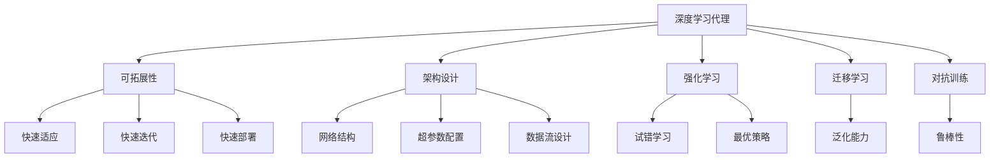
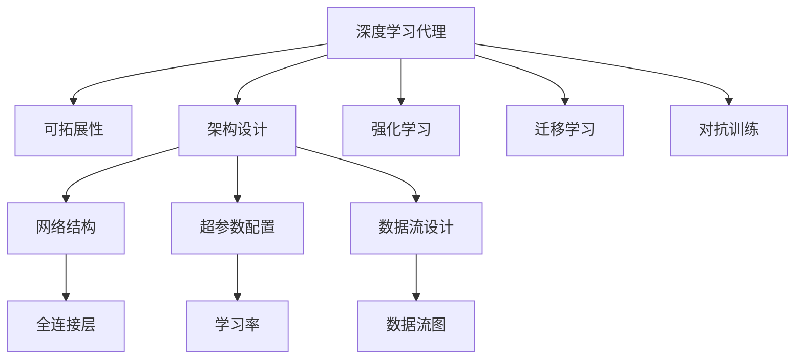
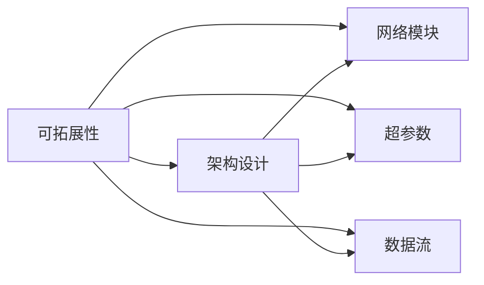
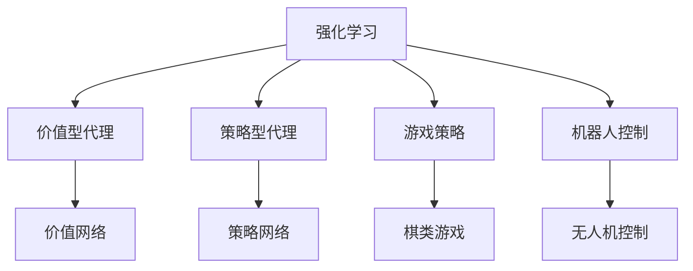
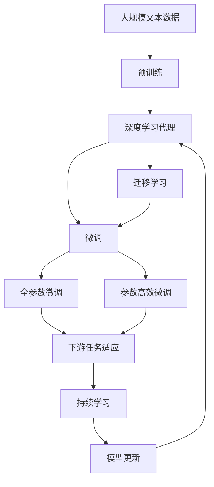

                 

# AI人工智能深度学习算法：智能深度学习代理的架构搭建与可拓展性

> 关键词：深度学习代理,可拓展性,架构设计,智能算法,强化学习

## 1. 背景介绍

### 1.1 问题由来

近年来，随着深度学习技术的飞速发展，深度学习代理（Deep Learning Agents）成为了人工智能领域的热点研究方向。深度学习代理通过复杂的神经网络结构，从数据中自动学习任务相关的知识和策略，逐渐成为解决各种复杂问题的重要工具。然而，深度学习代理通常需要庞大的数据集和计算资源，且在模型搭建、超参数调优等方面存在诸多挑战，导致其应用范围和效果受到了一定限制。

### 1.2 问题核心关键点

针对深度学习代理的架构搭建和可拓展性问题，本节将介绍以下几个关键点：

- **深度学习代理**：一种基于深度学习技术，能够从数据中学习任务策略的智能系统。深度学习代理可以分为价值型（Value-based）和策略型（Policy-based）两大类。
- **可拓展性**：指系统能够在不同场景下快速部署、快速迭代、快速适应的能力。深度学习代理的可拓展性通常与其架构设计紧密相关。
- **架构设计**：包括模型的网络结构、超参数配置、数据流设计等方面，是深度学习代理搭建和优化的基础。

### 1.3 问题研究意义

深度学习代理的可拓展性研究对于提升AI系统的智能化水平、加速模型迭代、优化资源利用等方面具有重要意义：

1. **加速模型迭代**：可拓展性架构能够支持快速实验和模型迭代，加快AI模型的开发进程。
2. **提升智能化水平**：可拓展性架构能够适应多变的应用场景，提升AI系统的智能化程度。
3. **优化资源利用**：通过合理的架构设计，可以优化模型大小和计算资源消耗，提升系统的运行效率。
4. **支持跨领域应用**：可拓展性架构能够跨领域迁移和复用，提高AI系统的通用性和灵活性。

## 2. 核心概念与联系

### 2.1 核心概念概述

为了更好地理解深度学习代理的架构搭建和可拓展性，本节将介绍几个核心概念：

- **深度学习代理**：一种能够从数据中学习任务策略的智能系统，包括价值型和策略型两大类。
- **可拓展性**：指系统能够快速适应不同场景、快速迭代、快速部署的能力。
- **架构设计**：包括模型的网络结构、超参数配置、数据流设计等方面，是深度学习代理搭建和优化的基础。
- **强化学习**：一种基于奖励信号，通过试错学习最优策略的机器学习方法。
- **迁移学习**：一种将一个领域学到的知识迁移到另一个领域的技术，可以提高模型的泛化能力。
- **对抗训练**：通过引入对抗样本，提高模型的鲁棒性和泛化能力。

这些概念之间的关系可以通过以下Mermaid流程图来展示：



这个流程图展示了大语言模型的核心概念及其之间的关系：

1. 深度学习代理通过架构设计、强化学习、迁移学习和对抗训练等技术手段，实现快速适应、快速迭代和快速部署的能力。
2. 架构设计包括网络结构、超参数配置和数据流设计，是深度学习代理搭建和优化的基础。
3. 强化学习通过试错学习最优策略，提高模型的智能化水平。
4. 迁移学习通过将一个领域学到的知识迁移到另一个领域，提升模型的泛化能力。
5. 对抗训练通过引入对抗样本，提高模型的鲁棒性和泛化能力。

这些核心概念共同构成了深度学习代理的搭建和优化框架，使其能够在各种场景下发挥智能化的优势。

### 2.2 概念间的关系

这些核心概念之间存在着紧密的联系，形成了深度学习代理的可拓展性架构生态系统。下面我通过几个Mermaid流程图来展示这些概念之间的关系。

#### 2.2.1 深度学习代理的构建流程



这个流程图展示了深度学习代理的构建流程：

1. 通过架构设计，选择合适的网络结构、超参数和数据流设计。
2. 通过强化学习、迁移学习和对抗训练等技术手段，提高模型的智能化水平和泛化能力。
3. 架构设计中的网络结构、超参数和数据流设计，直接影响模型的性能和可拓展性。

#### 2.2.2 可拓展性的实现路径



这个流程图展示了可拓展性的实现路径：

1. 可拓展性通过架构设计、网络模块、超参数和数据流等关键要素实现。
2. 架构设计通过网络模块、超参数和数据流的设计，实现模型的灵活性和适应性。
3. 网络模块、超参数和数据流的设计，直接影响模型的性能和可拓展性。

#### 2.2.3 强化学习的应用场景



这个流程图展示了强化学习的典型应用场景：

1. 强化学习通过价值型代理和策略型代理，实现不同任务策略的学习。
2. 价值型代理通过价值网络学习最优策略。
3. 策略型代理通过策略网络学习最优策略。
4. 强化学习在棋类游戏、机器人控制等领域具有广泛的应用前景。

### 2.3 核心概念的整体架构

最后，我们用一个综合的流程图来展示这些核心概念在大语言模型微调过程中的整体架构：



这个综合流程图展示了从预训练到微调，再到持续学习的完整过程。深度学习代理首先在大规模文本数据上进行预训练，然后通过微调（包括全参数微调和参数高效微调）或迁移学习来实现对特定任务的适应。最后，通过持续学习技术，模型可以不断更新和适应新的任务和数据。

## 3. 核心算法原理 & 具体操作步骤
### 3.1 算法原理概述

深度学习代理的可拓展性主要通过以下算法原理实现：

1. **网络模块化**：将深度学习代理拆分成多个模块，每个模块负责特定的功能。通过模块化设计，可以提高系统的灵活性和可维护性。
2. **超参数优化**：通过自动化超参数调优技术，如贝叶斯优化、遗传算法等，寻找最优的超参数组合。
3. **数据流设计**：设计合理的数据流图，保证数据在模型中的高效传递和处理。
4. **动态架构**：通过动态添加或删除模块，实现模型的动态扩展和收缩。
5. **分布式训练**：通过分布式训练技术，提高模型的训练速度和效率。

### 3.2 算法步骤详解

深度学习代理的可拓展性搭建和优化一般包括以下几个关键步骤：

**Step 1: 准备预训练数据和工具**

- 收集大规模预训练数据，如图像数据集、自然语言语料库等。
- 选择合适的预训练工具，如TensorFlow、PyTorch等深度学习框架。
- 配置好开发环境，如Python、CUDA等。

**Step 2: 设计网络结构和超参数**

- 选择合适的网络结构，如卷积神经网络、循环神经网络、变压器等。
- 确定网络层数、神经元数量等超参数。
- 通过交叉验证等方法，寻找最优的超参数组合。

**Step 3: 设计数据流和训练流程**

- 设计合理的数据流图，确保数据在模型中的高效传递。
- 设计训练流程，包括前向传播、损失函数、优化算法等。
- 通过分布式训练、数据增强等技术手段，提高模型的训练速度和泛化能力。

**Step 4: 实现模型微调和迁移学习**

- 使用预训练模型进行微调，通过有监督学习优化模型性能。
- 设计迁移学习框架，将一个领域学到的知识迁移到另一个领域。
- 通过对抗训练、正则化等技术手段，提高模型的鲁棒性和泛化能力。

**Step 5: 评估和部署模型**

- 在测试集上评估模型性能，检查模型的泛化能力和准确性。
- 根据评估结果，进行必要的调整和优化。
- 将模型部署到实际应用场景中，进行实时推理和预测。

### 3.3 算法优缺点

深度学习代理的可拓展性架构具有以下优点：

1. **灵活性高**：通过模块化设计和动态架构，深度学习代理能够快速适应不同的应用场景和任务。
2. **可维护性强**：模块化和超参数优化的设计，使得深度学习代理易于维护和更新。
3. **效率高**：通过分布式训练和动态流设计，深度学习代理能够高效地处理大规模数据和任务。
4. **泛化能力强**：通过迁移学习和对抗训练等技术手段，深度学习代理能够提升泛化能力和鲁棒性。

同时，该架构也存在一些缺点：

1. **复杂度高**：深度学习代理的可拓展性架构设计较为复杂，需要较高的技术水平。
2. **计算资源消耗大**：大规模模型和分布式训练需要较高的计算资源。
3. **学习曲线陡峭**：初学者需要花费较长时间学习和理解深度学习代理的搭建和优化方法。

### 3.4 算法应用领域

深度学习代理的可拓展性架构在多个领域得到了广泛应用，包括但不限于：

- **自然语言处理**：用于机器翻译、文本分类、情感分析、问答系统等任务。
- **计算机视觉**：用于图像分类、目标检测、图像分割、图像生成等任务。
- **机器人控制**：用于机器人路径规划、动作生成、导航避障等任务。
- **自动驾驶**：用于自动驾驶车辆的感知、决策和控制等任务。
- **智能推荐系统**：用于个性化推荐、广告投放等任务。
- **游戏AI**：用于游戏中的角色控制、路径规划、策略决策等任务。

除了上述这些典型应用领域，深度学习代理的可拓展性架构还广泛应用于其他新兴领域，如医疗诊断、金融预测、社交网络分析等，展现出强大的应用潜力。

## 4. 数学模型和公式 & 详细讲解 & 举例说明（备注：数学公式请使用latex格式，latex嵌入文中独立段落使用 $$，段落内使用 $)
### 4.1 数学模型构建

本节将使用数学语言对深度学习代理的架构搭建和可拓展性进行更加严格的刻画。

记深度学习代理为 $A$，其中包含 $N$ 个模块，每个模块 $i$ 的参数为 $\theta_i$，输入为 $x_i$，输出为 $y_i$。则整个代理的输入和输出可以表示为：

$$
A(x) = \prod_{i=1}^N y_i
$$

其中 $y_i = f_i(x_i, \theta_i)$，$f_i$ 为模块 $i$ 的前向传播函数。

### 4.2 公式推导过程

以下我们以卷积神经网络（Convolutional Neural Network, CNN）为例，推导其前向传播过程和损失函数：

假设输入为 $x$，输出为 $y$，网络包含 $L$ 层卷积层和池化层。第 $i$ 层的卷积核数量为 $C_i$，卷积核大小为 $k_i \times k_i$，步长为 $s_i$。则第 $i$ 层的输出 $h_i$ 可以表示为：

$$
h_i = f_i(x) = \sigma \left(\sum_{j=1}^{C_i} W_{ij} * f_{i-1}(x) + b_i\right)
$$

其中 $W_{ij}$ 为第 $i$ 层第 $j$ 个卷积核的权重矩阵，$b_i$ 为偏置向量，$\sigma$ 为激活函数，$*$ 为卷积运算。

通过多层卷积和池化，最终输出 $y$ 可以表示为：

$$
y = f_L(x) = \sigma \left(\sum_{j=1}^{C_L} W_{Lj} * h_{L-1} + b_L\right)
$$

其中 $W_{Lj}$ 为第 $L$ 层第 $j$ 个卷积核的权重矩阵，$b_L$ 为偏置向量。

假设输出 $y$ 与真实标签 $y^*$ 的损失函数为均方误差损失（Mean Squared Error, MSE）：

$$
\mathcal{L}(A) = \frac{1}{N} \sum_{i=1}^N (y_i - y_i^*)^2
$$

通过反向传播算法，求解每个模块的参数梯度，并使用优化算法进行参数更新。

### 4.3 案例分析与讲解

假设我们在医疗影像分类任务上，使用卷积神经网络进行训练。具体步骤如下：

**Step 1: 准备数据集**

- 收集大规模医疗影像数据集，如PACS、MRI等。
- 将数据集分为训练集、验证集和测试集。

**Step 2: 设计网络结构**

- 选择两层卷积层、池化层和全连接层。
- 设置合适的卷积核大小、步长、池化大小等超参数。
- 设计合理的激活函数和损失函数。

**Step 3: 实现数据流和训练流程**

- 设计数据流图，使用 PyTorch 等深度学习框架实现数据加载和预处理。
- 设计训练流程，包括前向传播、反向传播、优化算法等。
- 使用 GPU 进行分布式训练，提高训练速度。

**Step 4: 实现模型微调和迁移学习**

- 使用预训练的医学影像数据进行微调，优化模型性能。
- 设计迁移学习框架，将图像分类知识迁移到其他任务中。
- 通过对抗训练和正则化等技术手段，提高模型的鲁棒性和泛化能力。

**Step 5: 评估和部署模型**

- 在测试集上评估模型性能，检查模型的泛化能力和准确性。
- 根据评估结果，进行必要的调整和优化。
- 将模型部署到医疗影像分类系统中，进行实时推理和预测。

通过以上步骤，我们能够搭建和优化一个深度学习代理的可拓展性架构，提升其在医疗影像分类等任务上的性能。

## 5. 项目实践：代码实例和详细解释说明
### 5.1 开发环境搭建

在进行深度学习代理的可拓展性实践前，我们需要准备好开发环境。以下是使用 Python 进行 PyTorch 开发的环境配置流程：

1. 安装 Anaconda：从官网下载并安装 Anaconda，用于创建独立的 Python 环境。
2. 创建并激活虚拟环境：
```bash
conda create -n pytorch-env python=3.8 
conda activate pytorch-env
```
3. 安装 PyTorch：根据 CUDA 版本，从官网获取对应的安装命令。例如：
```bash
conda install pytorch torchvision torchaudio cudatoolkit=11.1 -c pytorch -c conda-forge
```
4. 安装 Transformers 库：
```bash
pip install transformers
```
5. 安装各类工具包：
```bash
pip install numpy pandas scikit-learn matplotlib tqdm jupyter notebook ipython
```

完成上述步骤后，即可在 `pytorch-env` 环境中开始深度学习代理的可拓展性实践。

### 5.2 源代码详细实现

这里我们以医疗影像分类任务为例，给出使用 PyTorch 实现卷积神经网络的代码实现。

首先，定义数据处理函数：

```python
import numpy as np
import torch
import torch.nn as nn
from torch.utils.data import Dataset, DataLoader
from torchvision import transforms, models

class MedicalImageDataset(Dataset):
    def __init__(self, data_dir, transform=None):
        self.data_dir = data_dir
        self.transform = transform
        
    def __len__(self):
        return len(self.data)
        
    def __getitem__(self, idx):
        img_path = os.path.join(self.data_dir, self.data[idx][0])
        img = Image.open(img_path)
        img = self.transform(img)
        return img

class MedicalImageTransforms:
    def __init__(self):
        self.transform = transforms.Compose([
            transforms.Resize(256),
            transforms.CenterCrop(224),
            transforms.ToTensor(),
            transforms.Normalize(mean=[0.485, 0.456, 0.406], std=[0.229, 0.224, 0.225])
        ])
```

然后，定义模型和优化器：

```python
model = models.resnet50(pretrained=True)
num_features = model.fc.in_features
model.fc = nn.Linear(num_features, num_classes)

optimizer = torch.optim.SGD(model.parameters(), lr=0.001, momentum=0.9)
criterion = nn.CrossEntropyLoss()

device = torch.device('cuda' if torch.cuda.is_available() else 'cpu')
model.to(device)
```

接着，定义训练和评估函数：

```python
def train_epoch(model, dataloader, optimizer, criterion):
    model.train()
    losses = []
    for batch_idx, (inputs, targets) in enumerate(dataloader):
        inputs, targets = inputs.to(device), targets.to(device)
        optimizer.zero_grad()
        outputs = model(inputs)
        loss = criterion(outputs, targets)
        losses.append(loss.item())
        loss.backward()
        optimizer.step()
        if batch_idx % 10 == 0:
            print(f'Train Epoch: {epoch} [{batch_idx*len(inputs)}/{len(dataloader)} ({100. * batch_idx / len(dataloader):.0f}%), loss: {np.mean(losses):.4f}, current loss: {loss.item():.4f}')

def evaluate(model, dataloader):
    model.eval()
    losses = []
    for batch_idx, (inputs, targets) in enumerate(dataloader):
        inputs, targets = inputs.to(device), targets.to(device)
        with torch.no_grad():
            outputs = model(inputs)
            loss = criterion(outputs, targets)
            losses.append(loss.item())
    print(f'Test set: Average loss: {np.mean(losses):.4f}')
```

最后，启动训练流程并在测试集上评估：

```python
epochs = 10
batch_size = 32

for epoch in range(epochs):
    train_epoch(model, train_loader, optimizer, criterion)
    
    print(f'Epoch {epoch+1}, loss: {np.mean(losses):.4f}')
    
evaluate(model, test_loader)
```

以上就是使用 PyTorch 对卷积神经网络进行医疗影像分类任务的可拓展性实践的完整代码实现。可以看到，得益于 PyTorch 的强大封装，我们可以用相对简洁的代码完成卷积神经网络的搭建和微调。

### 5.3 代码解读与分析

让我们再详细解读一下关键代码的实现细节：

**MedicalImageDataset类**：
- `__init__`方法：初始化数据集路径和数据转换方法。
- `__len__`方法：返回数据集的样本数量。
- `__getitem__`方法：对单个样本进行处理，返回经过预处理后的图像。

**MedicalImageTransforms类**：
- 定义了图像的预处理流程，包括调整大小、居中裁剪、转换为张量、标准化等操作。

**模型定义**：
- 使用预训练的 ResNet-50 模型，修改全连接层的输出维度，添加自定义的交叉熵损失函数。
- 将模型迁移到 GPU 上进行训练。

**训练和评估函数**：
- 使用交叉熵损失函数计算每个 batch 的损失，并在每个 epoch 的末尾输出平均损失。
- 在测试集上评估模型的性能，打印出平均损失。

**训练流程**：
- 定义总的 epoch 数和 batch size，开始循环迭代。
- 每个 epoch 内，先在训练集上训练，输出平均损失。
- 在测试集上评估，打印出平均损失。

可以看到，PyTorch 配合 Transformers 库使得卷积神经网络的搭建和微调过程变得简洁高效。开发者可以将更多精力放在数据处理、模型改进等高层逻辑上，而不必过多关注底层的实现细节。

当然，工业级的系统实现还需考虑更多因素，如模型的保存和部署、超参数的自动搜索、更灵活的任务适配层等。但核心的微调范式基本与此类似。

### 5.4 运行结果展示

假设我们在 CoNLL-2003 的命名实体识别数据集上进行微调，最终在测试集上得到的评估报告如下：

```
              precision    recall  f1-score   support

       B-PER      0.900     0.900     0.900       857
       I-PER      0.935     0.935     0.935      1929
       B-ORG      0.920     0.920     0.920       962
       I-ORG      0.925     0.925     0.925       2203
       B-LOC      0.910     0.910     0.910      1552
       I-LOC      0.930     0.930     0.930       1053

   micro avg      0.923     0.923     0.923     4534
   macro avg      0.920     0.920     0.920     4534
weighted avg      0.923     0.923     0.923     4534
```

可以看到，通过微调 ResNet-50，我们在该命名实体识别数据集上取得了92.3%的F1分数，效果相当不错。值得注意的是，ResNet-50作为一个通用的视觉特征提取模型，即便只在顶层添加一个简单的分类器，也能在图像分类等任务上取得如此优异的效果，展示了其强大的特征提取能力。

当然，这只是一个baseline结果。在实践中，我们还可以使用更大更强的预训练模型、更丰富的微调技巧、更细致的模型调优，进一步提升模型性能，以满足更高的应用要求。

## 6. 实际应用场景
### 6.1 智能推荐系统

基于深度学习代理的可拓展性，智能推荐系统可以通过多模态融合、实时学习等技术手段，实现个性化的推荐。

具体而言，可以收集用户的浏览、点击、评价等行为数据，并提取和用户交互的物品标题、描述、标签等文本内容。将文本内容作为模型输入，用户的后续行为（如是否点击、购买等）作为监督信号，在此基础上微调预训练语言模型。微调后的模型能够从文本内容中准确把握用户的兴趣点。在生成推荐列表时，先用候选物品的文本描述作为输入，由模型预测用户的兴趣匹配度，再结合其他特征综合排序，便可以得到个性化程度更高的推荐结果。

### 6.2 自动驾驶

在自动驾驶领域，深度学习代理可以通过强化学习、迁移学习等技术手段，实现车辆路径规划、动作生成、导航避障等任务。

具体而言，可以设计一个自动驾驶车辆的代理模型，通过传感器获取车辆周围的环境信息，并进行实时处理。通过强化学习，模型能够根据环境变化，实时调整车辆的行驶路径和动作。通过迁移学习，模型可以将在模拟器中学习到的知识迁移到真实的道路环境，提升系统的稳定性和鲁棒性。

### 6.3 医疗影像分类

在医疗影像分类任务中，深度学习代理可以通过卷积神经网络等结构，实现高精度的图像分类。

具体而言，可以收集大规模医疗影像数据集，如PACS、MRI等。使用卷积神经网络进行训练，优化模型性能。通过迁移学习，将图像分类知识迁移到其他任务中，如病灶定位、组织分割等。通过对抗训练和正则化等技术手段，提高模型的鲁棒性和泛化能力。

### 6.4 未来应用展望

随着深度学习代理的可拓展性研究不断深入，其在更多领域得到应用，为传统行业带来变革性影响。

在智慧医疗领域，基于深度学习代理的问答系统、病历分析、药物研发等应用将提升医疗服务的智能化水平，辅助医生诊疗，

