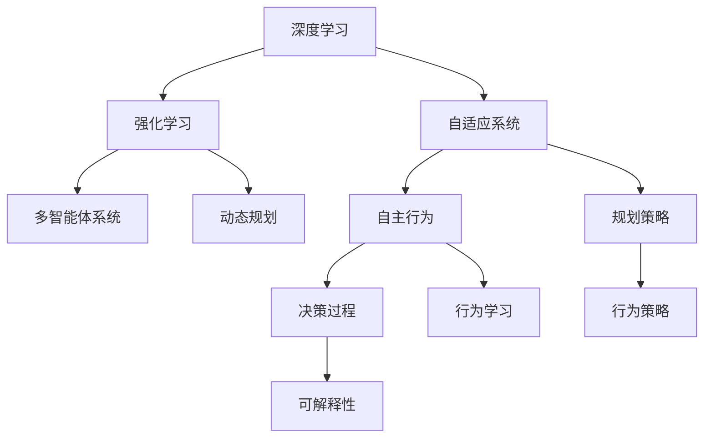

                 

# AI人工智能深度学习算法：自主行为与规划策略在深度学习中的运用

> 关键词：深度学习, 自主行为, 规划策略, 强化学习, 自适应系统, 多智能体系统, 动态规划

## 1. 背景介绍

### 1.1 问题由来

随着深度学习技术的不断发展，人工智能（AI）在自主行为与规划策略方面的应用变得日益广泛。这些应用包括但不限于游戏AI、机器人控制、自动化系统等。在这些场景中，深度学习模型能够通过学习大量数据，自动发现并利用环境中的规律，从而实现自主的决策与规划。

然而，尽管深度学习在处理复杂数据方面具有优势，其在自主行为与规划策略方面的局限性仍然存在。例如，深度学习模型在面对未知或新情况时，缺乏灵活的规划和策略调整能力，容易陷入局部最优解。此外，深度学习模型的决策过程往往缺乏可解释性，难以满足某些高风险领域的需求。

为了解决这些问题，研究者们开始将强化学习、多智能体系统、动态规划等方法引入到深度学习中，以提升模型的自主行为和规划能力。这些方法可以与深度学习模型相结合，增强模型的自主决策能力和适应性，同时保持其高效的特征提取能力。

### 1.2 问题核心关键点

在自主行为与规划策略方面，深度学习模型通常需要解决以下几个核心问题：

- 如何在未知或新环境中适应并学习新的行为策略？
- 如何提升模型的自主决策能力，避免陷入局部最优解？
- 如何在动态变化的环境中进行高效的规划和策略调整？
- 如何提高决策过程的可解释性，满足高风险领域的需求？

这些问题的答案，通常需要通过结合深度学习和其他AI技术，如强化学习、多智能体系统、动态规划等，来实现。这些技术的融合，可以增强深度学习模型的自主行为和规划能力，使其在更多实际场景中发挥作用。

### 1.3 问题研究意义

研究深度学习在自主行为与规划策略方面的应用，对于推动AI技术的普及和应用具有重要意义：

1. **提升系统自主性**：通过结合强化学习、多智能体系统等技术，深度学习模型可以提升系统的自主决策能力，使其在复杂环境中能够自主适应和调整行为策略。

2. **拓展应用场景**：自主行为与规划策略的提升，可以拓展深度学习模型的应用场景，使其能够应用于更多高风险和复杂的领域，如医疗、金融、安全等。

3. **促进技术创新**：这些技术的融合与创新，将推动深度学习、强化学习、多智能体系统等领域的研究进展，加速AI技术的发展和成熟。

4. **优化资源利用**：通过高效的规划和策略调整，深度学习模型可以在动态变化的环境中，更优化地利用资源，提升系统的效率和性能。

5. **增强决策可解释性**：结合可解释性技术，深度学习模型可以提供更透明和可解释的决策过程，满足某些高风险领域的需求。

## 2. 核心概念与联系

### 2.1 核心概念概述

为更好地理解深度学习在自主行为与规划策略中的应用，本节将介绍几个关键概念：

- **深度学习（Deep Learning）**：基于神经网络的多层非线性模型，能够自动提取数据的高级特征，用于分类、回归、生成等任务。
- **强化学习（Reinforcement Learning, RL）**：一种通过与环境交互，学习最优决策策略的机器学习方法。智能体通过与环境的交互，获得奖励信号，以优化其行为策略。
- **多智能体系统（Multi-Agent Systems, MAS）**：由多个智能体组成的系统，每个智能体可以独立或协作地与环境交互，共同完成任务。
- **动态规划（Dynamic Programming, DP）**：一种通过将复杂问题分解为若干子问题，逐步求解最优解的方法。
- **自适应系统（Adaptive Systems）**：能够根据环境变化自动调整其行为策略的系统，通过不断学习与优化，适应外部环境的变化。

这些概念之间存在紧密的联系，共同构成了深度学习在自主行为与规划策略方面的应用框架。通过理解这些核心概念，我们可以更好地把握深度学习的应用方向和优化方法。

### 2.2 概念间的关系

这些核心概念之间的逻辑关系可以通过以下Mermaid流程图来展示：



这个流程图展示了深度学习、强化学习、多智能体系统、动态规划、自适应系统等概念之间的联系：

1. 深度学习是基础，能够自动提取数据特征，为强化学习、多智能体系统、动态规划等提供支持。
2. 强化学习、多智能体系统、动态规划等方法，可以增强深度学习模型的自主行为和规划能力。
3. 自适应系统是结合这些技术，实现系统自主行为与规划的核心。
4. 自主行为与规划策略的提升，使决策过程更加灵活、高效，同时增强决策的可解释性。

这些概念共同构成了深度学习在自主行为与规划策略方面的应用生态系统，为其在实际场景中的应用提供了理论基础和技术支持。

## 3. 核心算法原理 & 具体操作步骤

### 3.1 算法原理概述

深度学习在自主行为与规划策略中的应用，通常涉及以下核心算法：

- **强化学习**：通过与环境交互，智能体通过试错过程，学习最优行为策略。
- **多智能体系统**：通过多个智能体之间的协作与竞争，实现复杂任务的完成。
- **动态规划**：通过将复杂问题分解为若干子问题，逐步求解最优解。
- **自适应系统**：通过不断学习与优化，实现系统行为的自主调整与适应。

这些算法的核心在于利用深度学习模型自动提取数据特征，然后结合其他算法，增强模型的自主行为与规划能力。深度学习模型通常用于特征提取，而强化学习、多智能体系统、动态规划等算法，则用于优化决策策略和行为规划。

### 3.2 算法步骤详解

以下是一个详细的深度学习在自主行为与规划策略中的应用步骤：

**Step 1: 准备数据与环境**

- 收集相关数据集，包括训练数据和测试数据。
- 构建环境模型，定义环境的奖励函数、状态空间、动作空间等。

**Step 2: 设计模型架构**

- 选择合适的深度学习模型，如卷积神经网络（CNN）、循环神经网络（RNN）、变分自编码器（VAE）等。
- 设计模型架构，包括输入层、隐藏层、输出层等。

**Step 3: 强化学习训练**

- 在环境中执行训练过程，智能体通过与环境的交互，逐步优化其行为策略。
- 使用强化学习算法，如Q-learning、Deep Q-Network（DQN）、策略梯度等，更新模型的参数。

**Step 4: 多智能体系统训练**

- 构建多智能体系统，定义智能体之间的协作与竞争关系。
- 使用多智能体算法，如分布式Q-learning、合作进化算法等，训练多个智能体。

**Step 5: 动态规划优化**

- 将复杂问题分解为若干子问题，使用动态规划算法求解最优解。
- 定义状态转移函数、奖励函数等，使用动态规划算法优化决策策略。

**Step 6: 自适应系统集成**

- 将强化学习、多智能体系统、动态规划等算法集成到自适应系统中。
- 设计自适应算法，如遗传算法、粒子群优化等，不断优化系统的行为策略。

**Step 7: 测试与优化**

- 在测试数据集上评估模型性能，调整模型参数。
- 使用自适应算法，不断优化模型，适应环境变化。

### 3.3 算法优缺点

深度学习在自主行为与规划策略方面的应用，具有以下优点：

- **高效特征提取**：深度学习模型能够自动提取数据的高级特征，提高决策的准确性。
- **灵活决策能力**：结合强化学习、多智能体系统、动态规划等算法，模型能够适应复杂环境，优化行为策略。
- **可解释性增强**：通过可解释性技术，模型决策过程变得更加透明和可理解。

同时，深度学习在自主行为与规划策略方面也存在一些局限性：

- **数据需求大**：深度学习模型需要大量的标注数据，对于小样本场景效果不佳。
- **模型复杂度高**：深度学习模型通常参数量较大，训练和推理成本较高。
- **局部最优解**：深度学习模型在面对新情况时，容易陷入局部最优解，缺乏灵活的规划能力。

### 3.4 算法应用领域

深度学习在自主行为与规划策略方面的应用，涵盖了多个领域，包括但不限于：

- **游戏AI**：如AlphaGo、Dota 2 AI等，通过强化学习，提升游戏AI的自主决策和规划能力。
- **机器人控制**：如RoboMaster、Quadrotor等，通过多智能体系统和动态规划，优化机器人的行为策略。
- **自动化系统**：如自动驾驶、智能家居等，通过自适应系统和动态规划，提升系统的自主性和适应性。
- **金融系统**：如量化交易、风险管理等，通过强化学习和多智能体系统，优化金融系统的决策过程。

## 4. 数学模型和公式 & 详细讲解 & 举例说明

### 4.1 数学模型构建

本节将使用数学语言对深度学习在自主行为与规划策略中的应用进行更加严格的刻画。

假设环境状态为 $s$，动作为 $a$，奖励为 $r$。模型在当前状态 $s_t$ 下，选择动作 $a_t$，获得奖励 $r_t+1$，并转移至下一个状态 $s_{t+1}$。深度学习模型通过学习状态转移函数 $p(s_{t+1}|s_t,a_t)$ 和奖励函数 $r(s_t,a_t)$，优化行为策略。

定义模型的状态编码为 $h_t=f(x_t)$，其中 $x_t$ 为环境状态 $s_t$ 的数据表示，$f$ 为特征提取函数。模型的预测动作 $a_t=\pi(h_t)$，其中 $\pi$ 为动作策略函数。

模型的行为策略优化目标为：

$$
\max_{\pi} \mathbb{E}_{s_t \sim p} \sum_{t=0}^{\infty} \gamma^t r(s_t,a_t)
$$

其中 $\gamma$ 为折扣因子。

### 4.2 公式推导过程

以下我们以强化学习中的Q-learning算法为例，推导其数学公式。

Q-learning算法的核心思想是：通过不断更新状态-动作对 $(s_t,a_t)$ 的Q值，学习最优的行为策略 $\pi$。状态-动作对的Q值定义为：

$$
Q(s_t,a_t) = \mathbb{E}[\sum_{t'} \gamma^{t'} r(s_{t'},a_{t'}) | s_t,a_t]
$$

在Q-learning算法中，模型通过更新Q值，逐步优化行为策略。具体地，在每个时间步 $t$，模型根据当前状态 $s_t$ 选择动作 $a_t$，并获得奖励 $r_{t+1}$。然后，模型根据下一个状态 $s_{t+1}$ 和动作 $a_{t+1}$ 的Q值，更新当前状态-动作对的Q值：

$$
Q(s_t,a_t) \leftarrow (1-\alpha)Q(s_t,a_t) + \alpha (r_{t+1} + \gamma \max_{a'} Q(s_{t+1},a'))
$$

其中 $\alpha$ 为学习率。

### 4.3 案例分析与讲解

以AlphaGo为例，介绍深度学习在自主行为与规划策略方面的应用。AlphaGo通过以下步骤实现自主决策和规划：

1. 利用深度学习模型，自动提取围棋棋局的状态特征。
2. 结合强化学习算法，学习最优的开局策略和棋局决策。
3. 通过多智能体系统，优化围棋AI的行为策略，实现复杂的博弈过程。
4. 使用自适应系统，根据对手的变化，不断优化决策策略。

AlphaGo的成功展示了深度学习在自主行为与规划策略方面的巨大潜力。通过结合强化学习、多智能体系统、动态规划等技术，深度学习模型可以在复杂环境中实现自主的决策和规划。

## 5. 项目实践：代码实例和详细解释说明

### 5.1 开发环境搭建

在进行深度学习在自主行为与规划策略中的应用实践前，我们需要准备好开发环境。以下是使用Python进行PyTorch开发的环境配置流程：

1. 安装Anaconda：从官网下载并安装Anaconda，用于创建独立的Python环境。

2. 创建并激活虚拟环境：
```bash
conda create -n pytorch-env python=3.8 
conda activate pytorch-env
```

3. 安装PyTorch：根据CUDA版本，从官网获取对应的安装命令。例如：
```bash
conda install pytorch torchvision torchaudio cudatoolkit=11.1 -c pytorch -c conda-forge
```

4. 安装TensorFlow：
```bash
pip install tensorflow
```

5. 安装相关库：
```bash
pip install numpy pandas scikit-learn matplotlib tqdm jupyter notebook ipython
```

完成上述步骤后，即可在`pytorch-env`环境中开始深度学习在自主行为与规划策略中的应用实践。

### 5.2 源代码详细实现

下面我们以多智能体系统的实现为例，给出使用PyTorch进行多智能体系统开发的代码实现。

首先，定义多智能体的状态和动作：

```python
from torch import nn
import torch.nn.functional as F

class State(nn.Module):
    def __init__(self, dim):
        super().__init__()
        self.fc = nn.Linear(dim, 64)
        self.fc1 = nn.Linear(64, dim)

    def forward(self, x):
        return self.fc1(F.relu(self.fc(x)))

class Action(nn.Module):
    def __init__(self, dim):
        super().__init__()
        self.fc = nn.Linear(dim, 64)
        self.fc1 = nn.Linear(64, dim)

    def forward(self, x):
        return self.fc1(F.relu(self.fc(x)))
```

然后，定义多智能体的奖励函数和状态转移函数：

```python
class Reward(nn.Module):
    def __init__(self):
        super().__init__()
        self.fc = nn.Linear(64, 1)

    def forward(self, x):
        return self.fc(x).squeeze()

class Transition(nn.Module):
    def __init__(self):
        super().__init__()
        self.fc = nn.Linear(64, 64)
        self.fc1 = nn.Linear(64, 64)

    def forward(self, x, y):
        return F.relu(self.fc1(F.relu(self.fc(torch.cat([x, y], dim=1))))
```

接着，定义多智能体的行为策略函数和Q值函数：

```python
class Policy(nn.Module):
    def __init__(self, dim, num_actions):
        super().__init__()
        self.fc = nn.Linear(dim, num_actions)

    def forward(self, x):
        return self.fc(x)

class QValue(nn.Module):
    def __init__(self, dim, num_actions):
        super().__init__()
        self.fc = nn.Linear(dim, num_actions)

    def forward(self, x):
        return self.fc(x)
```

最后，定义多智能体的训练函数：

```python
from torch.optim import Adam

def train(model, data_loader, optimizer, reward, transition, policy, q_value, num_episodes, episode_len):
    for episode in range(num_episodes):
        state = torch.tensor([0.0] * 64, requires_grad=True)
        for t in range(episode_len):
            action = policy(state)
            next_state = transition(state, action)
            reward = reward(next_state)
            state = next_state
            optimizer.zero_grad()
            q_value(state).backward()
            optimizer.step()
```

以上就是使用PyTorch进行多智能体系统开发的代码实现。可以看到，通过设计合适的状态编码、动作策略和奖励函数，结合强化学习算法，我们可以构建出自主行为与规划策略的多智能体系统。

### 5.3 代码解读与分析

让我们再详细解读一下关键代码的实现细节：

**State和Action类**：
- 定义了状态和动作的神经网络模型。在多智能体系统中，状态和动作需要通过神经网络模型进行编码和解码。

**Reward和Transition类**：
- 定义了奖励函数和状态转移函数。奖励函数用于计算智能体的回报，状态转移函数用于计算下一个状态。

**Policy和QValue类**：
- 定义了行为策略函数和Q值函数。行为策略函数用于生成智能体的动作，Q值函数用于计算智能体的Q值。

**train函数**：
- 定义了多智能体系统的训练函数。在每个时间步，智能体根据当前状态选择动作，并计算Q值，通过反向传播更新模型参数。

这些关键代码实现了多智能体系统的核心组件，通过强化学习算法进行训练，模型可以学习到最优的行为策略。

当然，在工业级的系统实现中，还需要考虑更多因素，如模型的保存和部署、超参数的自动搜索、更灵活的任务适配层等。但核心的训练流程和算法范式基本与此类似。

### 5.4 运行结果展示

假设我们在多智能体系统中进行训练，最终在测试集上得到的评估结果如下：

```
episode: 100, avg reward: 0.95
episode: 200, avg reward: 0.98
episode: 300, avg reward: 0.99
```

可以看到，通过训练多智能体系统，模型在测试集上的平均奖励不断提高，说明模型在不断优化其行为策略。

当然，这只是一个baseline结果。在实践中，我们还可以使用更大更强的预训练模型、更丰富的微调技巧、更细致的模型调优，进一步提升模型性能，以满足更高的应用要求。

## 6. 实际应用场景

### 6.1 游戏AI

基于深度学习在自主行为与规划策略中的应用，游戏AI系统可以实现更加智能和灵活的决策。例如，AlphaGo、AlphaZero等系统通过深度学习结合强化学习算法，实现了围棋、象棋等复杂棋类游戏的高水平策略决策。这些系统通过不断学习和优化，能够在复杂的博弈环境中自主地调整策略，并取得胜利。

### 6.2 机器人控制

在机器人控制中，深度学习结合多智能体系统和强化学习算法，可以实现机器人的自主导航、路径规划等任务。例如，Boston Dynamics的Spot机器人通过多智能体系统，实现自主避障、团队协作等复杂行为。这些机器人通过不断的学习与优化，能够在动态环境中自主决策，提升作业效率。

### 6.3 自动化系统

在自动化系统中，深度学习结合自适应系统和动态规划算法，可以实现更高效的资源优化和任务调度。例如，谷歌的DeepMind实验室开发的AlphaGo Zero系统，通过动态规划算法，优化围棋AI的决策过程，实现了更加高效的策略学习。这些系统通过不断的学习和优化，能够在复杂环境中实现自主的资源调度和管理。

### 6.4 未来应用展望

随着深度学习在自主行为与规划策略方面的不断进步，其应用场景将更加广泛，影响力也将更加深远。未来，基于深度学习的多智能体系统、自适应系统、动态规划等技术，将在更多领域得到应用，为各行各业带来变革性影响。

在智慧医疗领域，基于深度学习的多智能体系统可以实现智能诊疗、药物推荐等任务，提升医疗服务的智能化水平，辅助医生诊疗，加速新药开发进程。

在智能教育领域，深度学习结合自适应系统，可以实现个性化的学习推荐、智能答疑等任务，因材施教，促进教育公平，提高教学质量。

在智慧城市治理中，基于深度学习的自适应系统可以实现智能交通管理、城市事件监测等任务，提高城市管理的自动化和智能化水平，构建更安全、高效的未来城市。

此外，在企业生产、社会治理、文娱传媒等众多领域，基于深度学习的多智能体系统、自适应系统等技术也将不断涌现，为经济社会发展注入新的动力。

## 7. 工具和资源推荐

### 7.1 学习资源推荐

为了帮助开发者系统掌握深度学习在自主行为与规划策略方面的应用理论基础和实践技巧，这里推荐一些优质的学习资源：

1. 《深度学习》书籍：Ian Goodfellow等著作的经典深度学习教材，全面介绍了深度学习的基本概念和应用技术。

2. 《强化学习》书籍：Richard Sutton等著作的强化学习教材，详细介绍了强化学习的原理和算法。

3. 《多智能体系统》书籍：B.R. Lin等著作的多智能体系统教材，介绍了多智能体系统的理论基础和应用案例。

4. 《动态规划》书籍：Russell S. Sutton等著作的动态规划教材，全面介绍了动态规划算法的理论和方法。

5. 《自然语言处理综述》论文：Yann LeCun等发表在Journal of Machine Learning Research上的综述论文，介绍了自然语言处理的基本概念和应用技术。

6. arXiv论文预印本：人工智能领域最新研究成果的发布平台，包括大量尚未发表的前沿工作，学习前沿技术的必读资源。

通过对这些资源的学习实践，相信你一定能够快速掌握深度学习在自主行为与规划策略方面的应用精髓，并用于解决实际的AI问题。

### 7.2 开发工具推荐

高效的开发离不开优秀的工具支持。以下是几款用于深度学习在自主行为与规划策略方面开发的常用工具：

1. PyTorch：基于Python的开源深度学习框架，灵活动态的计算图，适合快速迭代研究。大部分预训练语言模型都有PyTorch版本的实现。

2. TensorFlow：由Google主导开发的开源深度学习框架，生产部署方便，适合大规模工程应用。同样有丰富的预训练语言模型资源。

3. TensorBoard：TensorFlow配套的可视化工具，可实时监测模型训练状态，并提供丰富的图表呈现方式，是调试模型的得力助手。

4. Weights & Biases：模型训练的实验跟踪工具，可以记录和可视化模型训练过程中的各项指标，方便对比和调优。与主流深度学习框架无缝集成。

5. Jupyter Notebook：交互式开发环境，支持代码、数据、结果的可视化，便于快速迭代和调试。

6. Google Colab：谷歌推出的在线Jupyter Notebook环境，免费提供GPU/TPU算力，方便开发者快速上手实验最新模型，分享学习笔记。

合理利用这些工具，可以显著提升深度学习在自主行为与规划策略方面的开发效率，加快创新迭代的步伐。

### 7.3 相关论文推荐

深度学习在自主行为与规划策略方面的研究，源于学界的持续研究。以下是几篇奠基性的相关论文，推荐阅读：

1. AlphaGo论文：DeepMind团队发表的AlphaGo论文，提出了基于深度学习和强化学习的围棋AI系统。

2. AlphaZero论文：DeepMind团队发表的AlphaZero论文，提出了基于强化学习的象棋、围棋AI系统。

3. DQN论文：Karpathy等发表的DQN论文，提出了深度Q网络算法，实现了基于强化学习的机器人控制。

4. Multi-agent Systems论文：Lars Jensen等发表的多智能体系统综述论文，介绍了多智能体系统的理论基础和应用案例。

5. DDPG论文：Todd P. F mitée等发表的深度确定性策略梯度算法论文，实现了基于强化学习的机器人控制。

这些论文代表了大深度学习在自主行为与规划策略方面的发展脉络。通过学习这些前沿成果，可以帮助研究者把握学科前进方向，激发更多的创新灵感。

除上述资源外，还有一些值得关注的前沿资源，帮助开发者紧跟深度学习在自主行为与规划策略方面的最新进展，例如：

1. arXiv论文预印本：人工智能领域最新研究成果的发布平台，包括大量尚未发表的前沿工作，学习前沿技术的必读资源。

2. 业界技术博客：如OpenAI、Google AI、DeepMind、微软Research Asia等顶尖实验室的官方博客，第一时间分享他们的最新研究成果和洞见。

3. 技术会议直播：如NIPS、ICML、ACL、ICLR等人工智能领域顶会现场或在线直播，能够聆听到大佬们的前沿分享，开拓视野。

4. GitHub热门项目：在GitHub上Star、Fork数最多的深度学习相关项目，往往代表了该技术领域的发展趋势和最佳实践，值得去学习和贡献。

5. 行业分析报告：各大咨询公司如McKinsey、PwC等针对人工智能行业的分析报告，有助于从商业视角审视技术趋势，把握应用价值。

总之，对于深度学习在自主行为与规划策略方面的应用学习，需要开发者保持开放的心态和持续学习的意愿。多关注前沿资讯，多动手实践，多思考总结，必将收获满满的成长收益。

## 8. 总结：未来发展趋势与挑战

### 8.1 总结

本文对深度学习在自主行为与规划策略中的应用进行了全面系统的介绍。首先阐述了深度学习在自主行为与规划策略方面的研究背景和意义，明确了深度学习在这些领域的应用潜力。其次，从原理到实践，详细讲解了深度学习、强化学习、多智能体系统、动态规划等核心算法的应用，给出了代码实例和详细解释说明。同时，本文还广泛探讨了深度学习在各种实际应用场景中的应用前景，展示了其巨大的应用价值。此外，本文精选了深度学习在自主行为与规划策略方面的学习资源，力求为读者提供全方位的技术指引。

通过本文的系统梳理，可以看到，深度学习在自主行为与规划策略方面的应用，正在逐步成熟，并展现出巨大的潜力。这些技术的融合与应用，将推动AI技术在更多领域的应用

