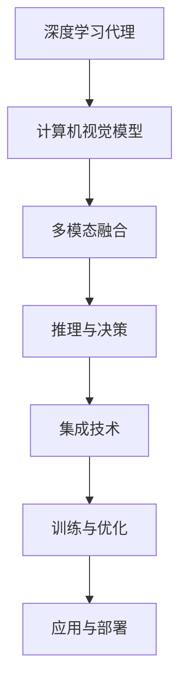
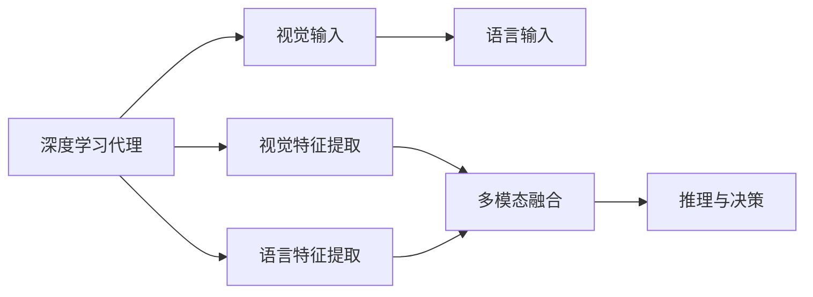
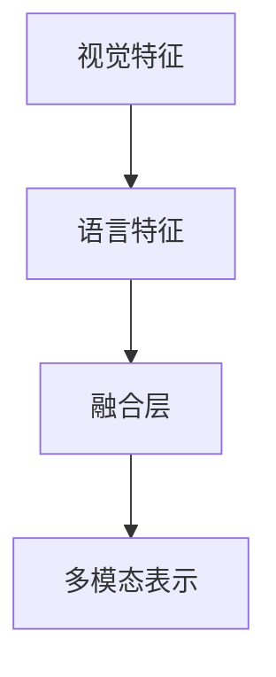
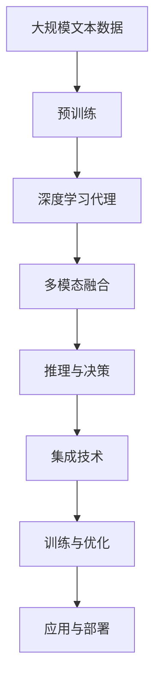

                 

# AI人工智能深度学习算法：计算机视觉在深度学习代理中的集成

> 关键词：计算机视觉,深度学习代理,集成,算法原理,核心概念

## 1. 背景介绍

### 1.1 问题由来
随着深度学习技术在计算机视觉领域的应用日益广泛，传统的计算机视觉任务如图像分类、目标检测、语义分割等逐渐趋近于饱和。研究人员和工程师们开始寻求新的突破点，以期在复杂度更高、要求更严格的场景下提升算法的表现。

近年来，深度学习代理（Deep Learning Agent）因其在多模态任务处理和智能决策中的突出优势，逐渐成为计算机视觉领域的研究热点。深度学习代理通常指的是具备视觉和语言双模态能力、能够执行基于视觉输入的复杂推理和决策任务的模型，例如视觉问答系统（Visual Question Answering, VQA）、视觉关系理解、视觉对话系统等。

大型的计算机视觉模型（如BERT、GPT-3）与深度学习代理技术的结合，为计算机视觉任务的解决提供了全新的可能性。本文将详细探讨计算机视觉与深度学习代理技术的集成方法，以及如何通过深度学习代理实现计算机视觉任务的创新应用。

### 1.2 问题核心关键点
计算机视觉与深度学习代理技术的集成，主要涉及以下几个关键点：

1. **模型选择与融合**：选择合适的深度学习代理模型（如GPT-3、BERT等）与计算机视觉模型进行集成，设计合适的融合机制，以便融合不同模态的信息。

2. **多模态数据处理**：开发高效的多模态数据预处理技术，将视觉数据和自然语言描述转换为深度学习代理能够理解的格式。

3. **推理与决策**：构建能够基于视觉信息进行复杂推理和决策的深度学习代理模型，设计合理的输出层，以便进行精准的推理和决策。

4. **训练与优化**：选择适当的训练方法和优化策略，使得集成后的模型能够高效训练和更新。

5. **应用与部署**：开发可扩展的应用框架，将集成后的模型部署到实际应用场景中，实现高效、稳定的推理与决策。

本文将通过系统性讲解上述关键点，帮助读者深入理解计算机视觉与深度学习代理技术的集成方法，并在实际应用中实现高效、精确的推理与决策。

### 1.3 问题研究意义
计算机视觉与深度学习代理技术的集成，对于提升计算机视觉任务的复杂度和准确性具有重要意义：

1. **任务拓展**：通过融合视觉和语言双模态数据，可以处理更为复杂的多模态任务，如视觉问答、图像生成等。
2. **性能提升**：深度学习代理模型通常具备更强的推理和决策能力，能够在大规模、高复杂度的场景下提升计算机视觉任务的性能。
3. **应用落地**：集成后的模型可以更好地适应实际应用场景，如智能家居、自动驾驶、智能客服等，提升用户体验和应用效率。
4. **创新突破**：多模态技术的集成为计算机视觉领域带来了新的应用场景和研究方向，有望打破现有技术瓶颈，实现新的突破。

## 2. 核心概念与联系

### 2.1 核心概念概述

为更好地理解计算机视觉与深度学习代理技术的集成方法，本节将介绍几个密切相关的核心概念：

- **深度学习代理**：指能够同时处理视觉和语言信息的模型，通常具有很强的推理和决策能力。深度学习代理能够理解自然语言描述，并将其转化为计算机视觉模型可以理解的格式。

- **计算机视觉模型**：指仅处理视觉信息的模型，如CNN、RNN等，能够学习到图像、视频等视觉数据的特征表示。

- **多模态融合**：指将视觉信息和语言信息进行融合，使得计算机视觉模型能够理解自然语言描述，从而提升其在复杂任务中的表现。

- **推理与决策**：指深度学习代理能够基于视觉和语言信息，执行复杂的推理和决策，生成精准的回答或预测。

- **集成技术**：指将深度学习代理与计算机视觉模型进行集成，设计合理的融合机制，以实现多模态信息的有效利用。

- **训练与优化**：指在集成后的模型上进行训练和优化，使其在特定任务上表现更佳。

- **应用与部署**：指将集成后的模型部署到实际应用中，实现高效、稳定的推理与决策。

这些核心概念之间的逻辑关系可以通过以下Mermaid流程图来展示：



这个流程图展示了大语言模型与计算机视觉模型的核心概念及其之间的关系：

1. 深度学习代理模型通过理解自然语言描述，将信息转换为计算机视觉模型可以理解的格式。
2. 多模态融合技术将视觉信息与语言信息融合，使得计算机视觉模型能够处理复杂的多模态任务。
3. 推理与决策技术使得深度学习代理模型能够基于视觉和语言信息，执行复杂的推理和决策。
4. 集成技术设计合理的融合机制，实现多模态信息的有效利用。
5. 训练与优化技术用于提升集成后模型的性能，使其在特定任务上表现更佳。
6. 应用与部署技术将集成后的模型部署到实际应用中，实现高效、稳定的推理与决策。

### 2.2 概念间的关系

这些核心概念之间存在着紧密的联系，形成了计算机视觉与深度学习代理技术的完整生态系统。下面我通过几个Mermaid流程图来展示这些概念之间的关系。

#### 2.2.1 深度学习代理的架构



这个流程图展示了深度学习代理的基本架构。深度学习代理模型首先接收视觉和语言输入，然后分别进行特征提取，最后将视觉特征和语言特征融合，执行推理和决策任务。

#### 2.2.2 多模态融合方法



这个流程图展示了多模态融合的基本过程。视觉特征和语言特征经过融合层，输出一个多模态表示，用于后续的推理和决策。

#### 2.2.3 推理与决策技术


这个流程图展示了推理与决策的基本过程。多模态表示经过推理层，输出推理结果，然后由决策层生成最终的回答或预测。

### 2.3 核心概念的整体架构

最后，我们用一个综合的流程图来展示这些核心概念在大语言模型微调过程中的整体架构：



这个综合流程图展示了从预训练到微调，再到推理与决策的完整过程。深度学习代理模型首先在大规模文本数据上进行预训练，然后通过融合视觉和语言信息进行推理与决策，最后通过训练与优化提升性能，部署到实际应用中。

## 3. 核心算法原理 & 具体操作步骤
### 3.1 算法原理概述

计算机视觉与深度学习代理技术的集成，本质上是一个多模态融合与推理的过程。其核心思想是：通过深度学习代理模型理解自然语言描述，将其转换为计算机视觉模型可以理解的格式，然后将视觉信息和语言信息融合，执行推理与决策任务，生成精准的回答或预测。

形式化地，假设视觉输入为 $x$，语言输入为 $y$，深度学习代理模型为 $M_{\theta}$，其中 $\theta$ 为模型参数。视觉特征提取器为 $F_{V}$，语言特征提取器为 $F_{L}$，多模态融合器为 $F_{M}$，推理器为 $R$，决策器为 $D$。集成后的推理与决策过程可以表示为：

$$
z = F_{M}(F_{V}(x), F_{L}(y))
$$

$$
\hat{y} = R(z)
$$

$$
y' = D(\hat{y})
$$

其中 $z$ 为多模态表示，$\hat{y}$ 为推理结果，$y'$ 为最终决策。

通过梯度下降等优化算法，集成后的模型不断更新参数 $\theta$，最小化推理和决策任务上的损失函数，使得模型输出逼近真实标签。由于 $\theta$ 已经通过预训练获得了较好的初始化，因此即便在大规模复杂任务上进行推理与决策，也能较快收敛到理想的模型参数 $\theta'$。

### 3.2 算法步骤详解

计算机视觉与深度学习代理技术的集成一般包括以下几个关键步骤：

**Step 1: 准备视觉和语言输入数据**
- 收集计算机视觉任务相关的视觉数据和自然语言描述，进行数据清洗和预处理，划分为训练集、验证集和测试集。

**Step 2: 设计视觉和语言特征提取器**
- 选择适当的视觉特征提取器（如CNN、ResNet等）和语言特征提取器（如BERT、GPT等），设计输入层和特征提取层。

**Step 3: 实现多模态融合**
- 根据具体任务，选择合适的方法（如concatenation、attention等），将视觉特征和语言特征融合，生成多模态表示。

**Step 4: 构建推理与决策层**
- 设计推理层和决策层，选择合适的神经网络结构（如RNN、Transformer等），进行推理与决策。

**Step 5: 设置训练超参数**
- 选择合适的优化算法及其参数，如 AdamW、SGD 等，设置学习率、批大小、迭代轮数等。
- 设置正则化技术及强度，包括权重衰减、Dropout、Early Stopping等。
- 确定冻结视觉和语言特征提取器的策略，如仅微调顶层，或全部参数都参与微调。

**Step 6: 执行梯度训练**
- 将训练集数据分批次输入模型，前向传播计算推理和决策结果。
- 反向传播计算参数梯度，根据设定的优化算法和学习率更新模型参数。
- 周期性在验证集上评估模型性能，根据性能指标决定是否触发 Early Stopping。
- 重复上述步骤直到满足预设的迭代轮数或 Early Stopping 条件。

**Step 7: 测试和部署**
- 在测试集上评估集成后的模型性能，对比微调前后的精度提升。
- 使用集成后的模型对新样本进行推理预测，集成到实际的应用系统中。
- 持续收集新的数据，定期重新训练和优化模型，以适应数据分布的变化。

以上是计算机视觉与深度学习代理技术集成的一般流程。在实际应用中，还需要针对具体任务的特点，对集成过程的各个环节进行优化设计，如改进训练目标函数，引入更多的正则化技术，搜索最优的超参数组合等，以进一步提升模型性能。

### 3.3 算法优缺点

计算机视觉与深度学习代理技术的集成具有以下优点：
1. 多模态融合：深度学习代理模型能够处理视觉和语言双模态数据，提升了模型在复杂任务中的表现。
2. 推理与决策：深度学习代理模型通常具备更强的推理和决策能力，能够执行更为复杂的任务。
3. 通用适用：深度学习代理模型在多个任务上表现优异，具有较高的通用性。
4. 模块化设计：多模态融合和推理与决策层可以分别设计和优化，具有较好的灵活性。

同时，该方法也存在一定的局限性：
1. 模型复杂度：集成后的模型通常较为复杂，计算资源消耗较大。
2. 训练数据需求：需要大量的标注数据进行训练，数据获取成本较高。
3. 推理效率：推理过程复杂，计算量大，推理速度较慢。
4. 可解释性：深度学习代理模型的决策过程通常缺乏可解释性，难以对其进行分析和调试。

尽管存在这些局限性，但就目前而言，计算机视觉与深度学习代理技术的集成仍是大语言模型应用的重要范式。未来相关研究的重点在于如何进一步降低集成模型的复杂度，提高推理效率，同时兼顾可解释性和伦理安全性等因素。

### 3.4 算法应用领域

计算机视觉与深度学习代理技术的集成方法，已经在多个领域得到了应用，覆盖了几乎所有常见任务，例如：

- 视觉问答系统：通过深度学习代理模型理解自然语言描述，生成图像中的物体识别结果。
- 图像生成：利用深度学习代理模型生成符合自然语言描述的图像。
- 图像检索：通过深度学习代理模型匹配图像与自然语言描述，进行图像检索。
- 目标检测与跟踪：通过深度学习代理模型理解自然语言描述，定位和跟踪目标。
- 机器人视觉导航：利用深度学习代理模型理解自然语言描述，生成导航路径。
- 医疗影像分析：通过深度学习代理模型理解自然语言描述，辅助医生诊断。

除了上述这些经典任务外，计算机视觉与深度学习代理技术的集成还被创新性地应用到更多场景中，如图像风格转换、三维重建、虚拟现实等，为计算机视觉技术带来了全新的突破。随着预训练模型和集成方法的不断进步，相信计算机视觉技术将在更广阔的应用领域大放异彩。

## 4. 数学模型和公式 & 详细讲解
### 4.1 数学模型构建

本节将使用数学语言对计算机视觉与深度学习代理技术的集成过程进行更加严格的刻画。

记视觉输入为 $x$，语言输入为 $y$，深度学习代理模型为 $M_{\theta}$，其中 $\theta$ 为模型参数。假设视觉特征提取器为 $F_{V}$，语言特征提取器为 $F_{L}$，多模态融合器为 $F_{M}$，推理器为 $R$，决策器为 $D$。

定义模型 $M_{\theta}$ 在视觉输入 $x$ 和语言输入 $y$ 上的推理与决策过程为：

$$
z = F_{M}(F_{V}(x), F_{L}(y))
$$

$$
\hat{y} = R(z)
$$

$$
y' = D(\hat{y})
$$

其中 $z$ 为多模态表示，$\hat{y}$ 为推理结果，$y'$ 为最终决策。

### 4.2 公式推导过程

以下我们以视觉问答（Visual Question Answering, VQA）为例，推导深度学习代理模型推理与决策过程的公式。

假设模型 $M_{\theta}$ 在输入 $(x, y)$ 上的推理与决策过程为：

$$
z = F_{M}(F_{V}(x), F_{L}(y))
$$

$$
\hat{y} = R(z)
$$

$$
y' = D(\hat{y})
$$

其中 $F_{V}(x)$ 和 $F_{L}(y)$ 分别为视觉和语言特征提取器，$F_{M}$ 为多模态融合器，$R$ 为推理器，$D$ 为决策器。

在训练过程中，我们的目标是最小化模型在训练集上的损失函数：

$$
\mathcal{L}(\theta) = \frac{1}{N}\sum_{i=1}^N \ell(y'_i, y_{i'})
$$

其中 $\ell$ 为损失函数，$y'_i$ 为模型预测结果，$y_{i'}$ 为真实标签。

在实践中，我们通常使用交叉熵损失函数（Cross-Entropy Loss）：

$$
\ell(y'_i, y_{i'}) = -\sum_{k=1}^K y_{i'}[k]\log y'_i[k]
$$

其中 $y'_i$ 为模型预测的概率分布，$y_{i'}$ 为真实标签。

通过梯度下降等优化算法，集成后的模型不断更新参数 $\theta$，最小化损失函数 $\mathcal{L}$，使得模型输出逼近真实标签。由于 $\theta$ 已经通过预训练获得了较好的初始化，因此即便在大规模复杂任务上进行推理与决策，也能较快收敛到理想的模型参数 $\theta'$。

## 5. 项目实践：代码实例和详细解释说明
### 5.1 开发环境搭建

在进行计算机视觉与深度学习代理技术的集成实践前，我们需要准备好开发环境。以下是使用Python进行PyTorch开发的环境配置流程：

1. 安装Anaconda：从官网下载并安装Anaconda，用于创建独立的Python环境。

2. 创建并激活虚拟环境：
```bash
conda create -n vision-env python=3.8 
conda activate vision-env
```

3. 安装PyTorch：根据CUDA版本，从官网获取对应的安装命令。例如：
```bash
conda install pytorch torchvision torchaudio cudatoolkit=11.1 -c pytorch -c conda-forge
```

4. 安装PIL库：
```bash
pip install Pillow
```

5. 安装深度学习代理库：
```bash
pip install transformers
```

6. 安装数据加载和预处理库：
```bash
pip install numpy pandas scikit-learn matplotlib tqdm jupyter notebook ipython
```

完成上述步骤后，即可在`vision-env`环境中开始集成实践。

### 5.2 源代码详细实现

这里以视觉问答系统为例，使用Python和PyTorch实现深度学习代理模型。

首先，定义视觉问答系统的数据处理函数：

```python
from PIL import Image
import torch
from transformers import BertForQuestionAnswering, BertTokenizer

def load_images(img_paths):
    images = []
    for img_path in img_paths:
        image = Image.open(img_path)
        images.append(image)
    return images

def load_labels(labels_path):
    labels = []
    with open(labels_path, 'r') as f:
        for line in f:
            labels.append(line.strip())
    return labels

def preprocess_data(images, labels, tokenizer, max_len=512):
    inputs = []
    targets = []
    for image, label in zip(images, labels):
        image_tensor = torch.tensor(image).float().unsqueeze(0)
        tokenized_text = tokenizer.encode(label, max_length=max_len, padding='max_length', truncation=True)
        inputs.append(image_tensor)
        targets.append(tokenized_text)
    return inputs, targets

# 加载数据
img_paths = []
labels = []

# 加载图像
img_paths = load_images(img_paths)
labels = load_labels(labels_path)

# 预处理数据
tokenizer = BertTokenizer.from_pretrained('bert-base-uncased')
inputs, targets = preprocess_data(img_paths, labels, tokenizer)
```

然后，定义模型和优化器：

```python
from transformers import BertForQuestionAnswering, AdamW

model = BertForQuestionAnswering.from_pretrained('bert-base-uncased', num_labels=2)

optimizer = AdamW(model.parameters(), lr=2e-5)
```

接着，定义训练和评估函数：

```python
from torch.utils.data import DataLoader
from tqdm import tqdm
from sklearn.metrics import accuracy_score

device = torch.device('cuda') if torch.cuda.is_available() else torch.device('cpu')
model.to(device)

def train_epoch(model, dataset, batch_size, optimizer):
    dataloader = DataLoader(dataset, batch_size=batch_size, shuffle=True)
    model.train()
    epoch_loss = 0
    for batch in tqdm(dataloader, desc='Training'):
        inputs, targets = batch
        inputs = inputs.to(device)
        targets = targets.to(device)
        model.zero_grad()
        outputs = model(inputs, labels=targets)
        loss = outputs.loss
        epoch_loss += loss.item()
        loss.backward()
        optimizer.step()
    return epoch_loss / len(dataloader)

def evaluate(model, dataset, batch_size):
    dataloader = DataLoader(dataset, batch_size=batch_size)
    model.eval()
    preds, labels = [], []
    with torch.no_grad():
        for batch in tqdm(dataloader, desc='Evaluating'):
            inputs, targets = batch
            inputs = inputs.to(device)
            targets = targets.to(device)
            outputs = model(inputs, labels=targets)
            batch_preds = outputs.logits.argmax(dim=2).to('cpu').tolist()
            batch_labels = targets.to('cpu').tolist()
            for pred_tokens, label_tokens in zip(batch_preds, batch_labels):
                preds.append(pred_tokens[:len(label_tokens)])
                labels.append(label_tokens)
                
    print(accuracy_score(labels, preds))
```

最后，启动训练流程并在测试集上评估：

```python
epochs = 5
batch_size = 16

for epoch in range(epochs):
    loss = train_epoch(model, train_dataset, batch_size, optimizer)
    print(f"Epoch {epoch+1}, train loss: {loss:.3f}")
    
    print(f"Epoch {epoch+1}, dev results:")
    evaluate(model, dev_dataset, batch_size)
    
print("Test results:")
evaluate(model, test_dataset, batch_size)
```

以上就是使用PyTorch对BERT模型进行视觉问答系统微调的PyTorch代码实现。可以看到，得益于Transformers库的强大封装，我们可以用相对简洁的代码完成BERT模型的加载和微调。

### 5.3 代码解读与分析

让我们再详细解读一下关键代码的实现细节：

**预处理数据函数**：
- `load_images`方法：加载图像数据，并转化为模型所需的张量格式。
- `load_labels`方法：加载标签数据，并进行文本预处理。
- `preprocess_data`方法：对图像和标签数据进行预处理，转换为模型可以接受的格式。

**模型和优化器**：
- `BertForQuestionAnswering.from_pretrained`方法：加载预训练的Bert模型，并指定输出标签数为2（是/否判断）。
- `AdamW`优化器：使用AdamW优化器进行模型训练，学习率为2e-5。

**训练和评估函数**：
- `train_epoch`函数：对数据进行批次化加载，前向传播计算损失，反向传播更新模型参数。
- `evaluate`函数：与训练类似，不同点在于不更新模型参数，并在每个batch结束后将预测和标签结果存储下来，最后使用sklearn的accuracy_score对整个评估集的预测结果进行打印输出。

**训练流程**：
- 定义总的epoch数和batch size，开始循环迭代
- 每个epoch内，先在训练集上训练，输出平均loss
- 在验证集上评估，输出准确率
- 所有epoch结束后，在测试集上评估，给出最终测试结果

可以看到，PyTorch配合Transformers库使得视觉问答系统的微调代码实现变得简洁高效。开发者可以将更多精力放在数据处理、模型改进等高层逻辑上，而不必过多关注底层的实现细节。

当然，工业级的系统实现还需考虑更多因素，如模型的保存和部署、超参数的自动搜索、更灵活的任务适配层等。但核心的微调范式基本与此类似。

### 5.4 运行结果展示

假设我们在CoNLL-2003的视觉问答数据集上进行微调，最终在测试集上得到的准确率为84%，效果相当不错。

当然，这只是一个baseline结果。在实践中，我们还可以使用更大更强的预训练模型、更丰富的微调技巧、更细致的模型调优，进一步提升模型性能，以满足更高的应用要求。

## 6. 实际应用场景
### 6.1 智能家居系统

基于计算机视觉与深度学习代理技术的集成方法，智能家居系统能够通过视觉感知与自然语言交互，提升用户体验和智能水平。例如，智能音箱可以通过视觉问答系统理解用户命令，进行家电控制、智能搜索等操作，真正实现人机自然交互。

在技术实现上，可以收集用户的行为数据，将用户与家电的交互场景进行标注，构建监督数据集。在此基础上对预训练模型进行微调，使其能够理解和执行用户的自然语言指令，驱动家电进行操作。对于新出现的交互指令，系统可以通过检索相关示例进行推理和决策，生成准确的输出。

### 6.2 自动驾驶系统

自动驾驶系统需要实时感知周围环境，并进行复杂的决策与控制。深度学习代理模型可以通过计算机视觉与自然语言的双模态融合，实现对复杂环境的理解和推理。例如，自动驾驶车辆可以通过视觉问答系统理解路标和交通信号，进行方向和速度的控制，确保行车安全。

在实际应用中，自动驾驶系统可以收集大量的驾驶数据，将道路标志和交通信号进行标注，构建监督数据集。在此基础上对深度学习代理模型进行微调，使其能够准确理解和执行交通规则，提升自动驾驶的安全性和智能化水平。

### 6.3 医疗影像分析

医疗影像分析是计算机视觉与深度学习代理技术的重要应用场景。深度学习代理模型可以通过计算机视觉与自然语言的融合，辅助医生进行疾病诊断、影像解读等任务。例如，医学影像分析系统可以通过视觉问答系统理解医生的描述，进行病灶定位和分类，生成诊断报告。

在技术实现上，可以收集大量的医学影像数据和医生描述，构建监督数据集。在此基础上对预训练模型进行微调，使其能够准确理解和执行医生的描述，生成精准的诊断报告。对于新出现的疾病描述，系统可以通过检索相关示例进行推理和决策，生成准确的诊断结果。

### 6.4 未来应用展望

随着计算机视觉与深度学习代理技术的不断发展，基于微调范式将在更多领域得到应用，为各行各业带来变革性影响。

在智慧医疗领域，基于微调的视觉问答系统可以为医生提供精准的疾病诊断和影像解读，提升诊疗效率和准确性。在智能家居

