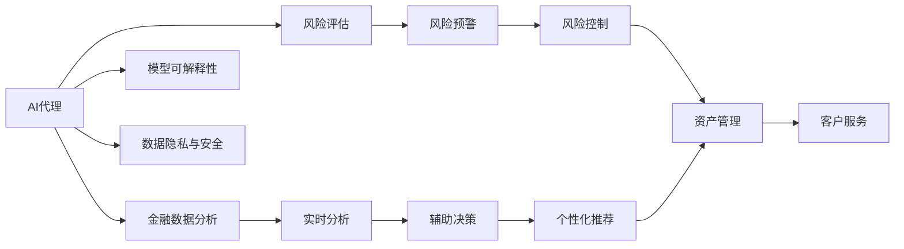
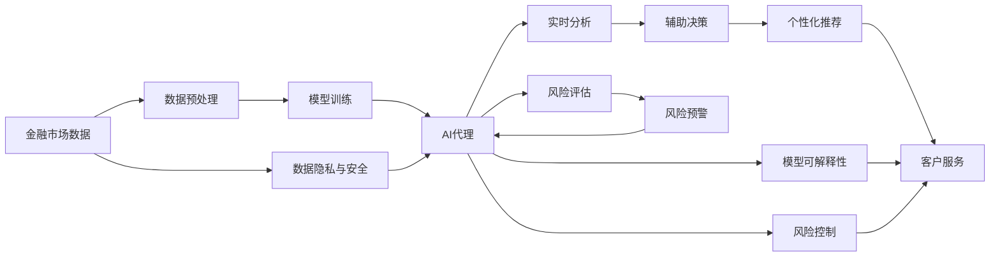

                 

## 1. 背景介绍

### 1.1 问题由来

随着人工智能技术在各行各业的深入应用，AI代理在金融服务领域的作用日益凸显。金融服务作为一个高度依赖于数据分析和决策的行业，AI代理通过自动化、智能化的方式，极大地提升了服务效率和质量。然而，金融服务本身的高风险特性，使得AI代理在使用过程中也面临着诸多风险挑战。

### 1.2 问题核心关键点

AI代理在金融服务中的应用主要涉及以下几个方面：

- **自动化决策支持**：AI代理能够对大量复杂的金融数据进行实时分析和处理，辅助人工决策，提高决策效率和准确性。
- **风险评估与管理**：通过深度学习模型对金融风险进行预测和评估，实现风险控制和资产管理。
- **客户服务**：AI代理能够全天候提供金融咨询服务，解答客户疑问，提升客户体验。
- **智能投顾**：AI代理通过学习用户的历史交易数据和偏好，提供个性化的投资建议和策略。

这些应用场景的核心问题在于：

- **数据隐私与安全**：金融数据涉及个人隐私和商业机密，AI代理在处理这些数据时需要严格遵守数据保护法规。
- **模型鲁棒性**：金融市场的复杂性和不确定性要求AI代理的模型具有高度的鲁棒性和泛化能力。
- **可解释性**：金融决策对透明度和可解释性的要求较高，AI代理的输出需要易于理解和解释。
- **合规性**：金融服务的合规性要求AI代理的操作必须符合各类法律法规和行业标准。
- **效率与成本**：金融服务对时效性和成本控制有较高要求，AI代理需要在保证性能的前提下，尽量降低运行成本。

### 1.3 问题研究意义

研究AI代理在金融服务中的工作流程与风险评估，对于提升金融服务的智能化水平、保障金融数据安全、增强决策透明度和合规性具有重要意义。具体而言：

- **提升服务效率**：通过AI代理的自动化处理，减少人工操作，提高服务响应速度。
- **降低运营成本**：AI代理可以优化资源配置，降低人力和运营成本。
- **增强风险管理能力**：通过精确的风险评估和预测，辅助风险控制和资产管理。
- **改善客户体验**：AI代理能够全天候提供高效、个性化的服务，提升客户满意度。
- **促进合规与监管**：AI代理的操作透明，便于监管机构进行合规性检查。

## 2. 核心概念与联系

### 2.1 核心概念概述

为了更好地理解AI代理在金融服务中的应用，本节将介绍几个密切相关的核心概念：

- **AI代理**：指利用人工智能技术，通过算法自动化执行金融服务中各类任务的智能体。AI代理可以处理各种金融数据，提供实时分析和决策支持。
- **金融数据分析**：指对金融市场数据、交易数据、财务报表等进行深度挖掘和分析，提取有价值的信息和规律。
- **风险评估**：指通过量化方法对金融风险进行评估和预测，以辅助风险管理决策。
- **模型可解释性**：指AI代理所使用的模型，能够清晰地解释其决策逻辑和推理过程。
- **数据隐私与安全**：指在处理金融数据时，确保数据隐私不被泄露，防止数据安全威胁。

这些核心概念之间的逻辑关系可以通过以下Mermaid流程图来展示：



这个流程图展示了大语言模型微调过程中各个核心概念之间的关系：

1. AI代理通过金融数据分析提供实时分析、辅助决策和个性化推荐等服务。
2. 风险评估辅助风险预警和风险控制，保障资产安全。
3. 模型可解释性确保AI代理的决策过程透明，符合合规要求。
4. 数据隐私与安全保护金融数据的完整性和用户隐私。

### 2.2 概念间的关系

这些核心概念之间存在着紧密的联系，形成了AI代理在金融服务中的完整生态系统。下面通过几个Mermaid流程图来展示这些概念之间的关系。

#### 2.2.1 AI代理的工作流程


这个流程图展示了AI代理在金融服务中的工作流程：

1. 收集金融市场数据。
2. 对数据进行预处理和特征提取。
3. 使用深度学习模型进行训练，构建AI代理。
4. 利用训练好的模型进行实时分析和决策支持。
5. 根据分析结果，提供个性化推荐服务。
6. 通过客户服务系统，与用户进行互动。

#### 2.2.2 数据隐私与安全


这个流程图展示了数据隐私与安全的保护机制：

1. 对金融数据进行加密处理。
2. 控制对数据的访问权限。
3. 对数据访问进行监控和审计。

#### 2.2.3 风险评估与管理


这个流程图展示了风险评估与管理的流程：

1. 收集历史风险数据。
2. 使用深度学习模型训练风险评估模型。
3. 利用训练好的模型进行风险预测。
4. 根据风险预警结果，进行风险控制。

### 2.3 核心概念的整体架构

最后，我们用一个综合的流程图来展示这些核心概念在大语言模型微调过程中的整体架构：



这个综合流程图展示了从数据预处理到风险控制、客户服务的完整过程。AI代理通过金融数据分析提供实时分析、辅助决策和个性化推荐等服务，同时通过风险评估和管理，保障金融资产的安全。同时，AI代理的操作透明，符合合规要求，数据隐私和安全得到保障。

## 3. 核心算法原理 & 具体操作步骤

### 3.1 算法原理概述

AI代理在金融服务中的应用，本质上是一个基于人工智能的决策支持系统。其核心算法包括金融数据分析、深度学习模型训练、风险评估和决策支持等。

#### 3.1.1 金融数据分析

金融数据分析主要涉及以下几个步骤：

1. **数据收集**：收集金融市场数据、交易数据、财务报表等。
2. **数据预处理**：对数据进行清洗、归一化、去重等处理，确保数据质量。
3. **特征提取**：从数据中提取出有意义的特征，如价格变化、成交量、波动率等。

#### 3.1.2 深度学习模型训练

深度学习模型训练主要包括：

1. **模型选择**：选择合适的深度学习模型，如卷积神经网络、循环神经网络、Transformer等。
2. **模型训练**：使用金融数据对模型进行训练，调整模型参数，提高模型精度。
3. **模型评估**：通过测试集对模型进行评估，选择性能最好的模型。

#### 3.1.3 风险评估

风险评估主要包括以下步骤：

1. **风险特征提取**：从金融数据中提取出风险特征，如波动率、VaR等。
2. **风险模型训练**：使用历史风险数据训练风险评估模型。
3. **风险预测**：利用训练好的模型对未来风险进行预测。
4. **风险控制**：根据风险预测结果，制定相应的风险管理策略。

#### 3.1.4 决策支持

决策支持主要涉及以下几个步骤：

1. **数据输入**：将金融数据输入AI代理。
2. **模型推理**：AI代理根据金融数据进行推理和计算。
3. **决策输出**：根据推理结果，生成决策建议或执行自动决策。

### 3.2 算法步骤详解

#### 3.2.1 金融数据分析

1. **数据收集**
   - 收集金融市场数据、交易数据、财务报表等。
   - 使用Web爬虫、API接口等方式获取数据。
   - 将数据存储到数据库或分布式存储系统中。

2. **数据预处理**
   - 清洗数据，去除重复、无效、异常值。
   - 归一化数据，如将价格数据转化为标准化数值。
   - 去重处理，避免重复数据影响分析结果。

3. **特征提取**
   - 使用统计方法提取基础特征，如均值、标准差、峰度等。
   - 使用技术方法提取高级特征，如波动率、相关性矩阵等。
   - 将提取的特征存储为特征矩阵，供后续模型使用。

#### 3.2.2 深度学习模型训练

1. **模型选择**
   - 选择适合的深度学习模型，如卷积神经网络、循环神经网络、Transformer等。
   - 根据任务特点，选择合适的模型架构和层数。
   - 确定合适的损失函数和优化器。

2. **模型训练**
   - 使用训练集对模型进行训练，调整模型参数。
   - 使用Adam、SGD等优化器进行模型优化。
   - 设置合适的学习率和迭代轮数。

3. **模型评估**
   - 使用测试集对模型进行评估，计算准确率、召回率、F1分数等指标。
   - 比较不同模型的性能，选择最优模型。
   - 保存训练好的模型，供后续使用。

#### 3.2.3 风险评估

1. **风险特征提取**
   - 从金融数据中提取出风险特征，如波动率、VaR等。
   - 使用统计方法提取基础风险特征。
   - 使用机器学习方法提取高级风险特征。

2. **风险模型训练**
   - 使用历史风险数据训练风险评估模型。
   - 使用回归、分类等算法训练模型。
   - 使用交叉验证等技术进行模型调优。

3. **风险预测**
   - 使用训练好的模型对未来风险进行预测。
   - 计算预测结果的置信区间，评估风险水平。
   - 根据预测结果，制定相应的风险管理策略。

#### 3.2.4 决策支持

1. **数据输入**
   - 将金融数据输入AI代理。
   - 对数据进行预处理，确保数据质量。
   - 将数据转化为模型所需格式。

2. **模型推理**
   - 使用训练好的模型对输入数据进行推理。
   - 计算模型的输出结果。
   - 生成推理报告或决策建议。

3. **决策输出**
   - 根据推理结果，生成决策建议或执行自动决策。
   - 将决策结果输出到相关系统或显示给用户。
   - 记录决策过程，便于后续分析和审计。

### 3.3 算法优缺点

AI代理在金融服务中的应用，具有以下优点：

1. **高效性**：AI代理能够实时处理大量金融数据，提高决策效率。
2. **精准性**：深度学习模型能够学习复杂的金融规律，提高决策精度。
3. **灵活性**：AI代理可以根据不同任务，灵活选择模型和算法。
4. **可扩展性**：AI代理可以扩展到多领域、多业务场景，具有较高的应用价值。

同时，AI代理也存在以下缺点：

1. **数据依赖性**：AI代理依赖于高质量的金融数据，数据获取成本较高。
2. **模型复杂性**：深度学习模型结构复杂，训练和调试难度较大。
3. **风险因素**：金融市场的不确定性可能影响AI代理的预测结果。
4. **可解释性不足**：深度学习模型的决策过程难以解释，缺乏透明度。

### 3.4 算法应用领域

AI代理在金融服务中的应用主要包括以下几个领域：

1. **风险管理**：通过深度学习模型对金融风险进行预测和评估，辅助风险控制和资产管理。
2. **投资决策**：利用AI代理进行投资组合管理、交易策略制定等，提高投资回报率。
3. **信用评估**：通过AI代理对客户信用进行评估，辅助贷款审批和信用评级。
4. **客户服务**：AI代理提供全天候金融咨询服务，解答客户疑问，提升客户体验。
5. **市场营销**：利用AI代理进行客户行为分析，制定精准的营销策略。
6. **合规管理**：AI代理辅助监管机构进行合规性检查，确保金融服务符合法律法规。

## 4. 数学模型和公式 & 详细讲解  
### 4.1 数学模型构建

本节将使用数学语言对AI代理在金融服务中的应用进行更加严格的刻画。

假设AI代理在金融服务中需要处理的数据为 $x_1, x_2, \dots, x_n$，其中 $n$ 为数据量。设AI代理的深度学习模型为 $f_{\theta}(x)$，其中 $\theta$ 为模型参数。

定义AI代理在数据 $x$ 上的损失函数为 $L(f_{\theta}(x), y)$，其中 $y$ 为模型预测结果，$L$ 为损失函数，通常使用均方误差或交叉熵等。AI代理的目标是最小化损失函数，即找到最优参数：

$$
\theta^* = \mathop{\arg\min}_{\theta} \sum_{i=1}^n L(f_{\theta}(x_i), y_i)
$$

在实践中，我们通常使用基于梯度的优化算法（如Adam、SGD等）来近似求解上述最优化问题。设 $\eta$ 为学习率，则参数的更新公式为：

$$
\theta \leftarrow \theta - \eta \nabla_{\theta}L(f_{\theta}(x))
$$

其中 $\nabla_{\theta}L(f_{\theta}(x))$ 为损失函数对模型参数的梯度，可通过反向传播算法高效计算。

### 4.2 公式推导过程

以下我们以回归任务为例，推导均方误差损失函数及其梯度的计算公式。

假设AI代理在输入 $x$ 上的输出为 $\hat{y}=f_{\theta}(x)$，表示模型对数据的预测值。真实标签为 $y$。则均方误差损失函数定义为：

$$
L(f_{\theta}(x), y) = \frac{1}{n}\sum_{i=1}^n (y_i - \hat{y}_i)^2
$$

将其代入经验风险公式，得：

$$
\mathcal{L}(\theta) = \frac{1}{n}\sum_{i=1}^n (y_i - f_{\theta}(x_i))^2
$$

根据链式法则，损失函数对参数 $\theta_k$ 的梯度为：

$$
\frac{\partial \mathcal{L}(\theta)}{\partial \theta_k} = -\frac{2}{n}\sum_{i=1}^n (y_i - \hat{y}_i) \frac{\partial \hat{y}_i}{\partial \theta_k}
$$

其中 $\frac{\partial \hat{y}_i}{\partial \theta_k}$ 可进一步递归展开，利用自动微分技术完成计算。

在得到损失函数的梯度后，即可带入参数更新公式，完成模型的迭代优化。重复上述过程直至收敛，最终得到适应金融任务的最优模型参数 $\theta^*$。

## 5. 项目实践：代码实例和详细解释说明

### 5.1 开发环境搭建

在进行AI代理实践前，我们需要准备好开发环境。以下是使用Python进行TensorFlow开发的环境配置流程：

1. 安装Anaconda：从官网下载并安装Anaconda，用于创建独立的Python环境。

2. 创建并激活虚拟环境：
```bash
conda create -n tf-env python=3.8 
conda activate tf-env
```

3. 安装TensorFlow：根据CUDA版本，从官网获取对应的安装命令。例如：
```bash
conda install tensorflow -c conda-forge -c pytorch -c anaconda
```

4. 安装各类工具包：
```bash
pip install numpy pandas scikit-learn matplotlib tqdm jupyter notebook ipython
```

完成上述步骤后，即可在`tf-env`环境中开始AI代理实践。

### 5.2 源代码详细实现

这里我们以信用评估任务为例，给出使用TensorFlow进行AI代理开发的PyTorch代码实现。

首先，定义信用评估任务的输入和输出：

```python
import tensorflow as tf
from tensorflow.keras import layers, models

# 定义输入层
input_layer = layers.Input(shape=(5, ), name='input_layer')

# 定义输出层
output_layer = layers.Dense(1, activation='sigmoid', name='output_layer')

# 定义模型
model = models.Model(inputs=input_layer, outputs=output_layer)
```

接着，定义模型训练的相关参数：

```python
# 定义优化器
optimizer = tf.keras.optimizers.Adam(learning_rate=0.001)

# 定义损失函数
loss_function = tf.keras.losses.BinaryCrossentropy()

# 定义评估指标
metrics = [tf.keras.metrics.BinaryAccuracy(name='accuracy')]
```

然后，进行模型的训练和评估：

```python
# 编译模型
model.compile(optimizer=optimizer, loss=loss_function, metrics=metrics)

# 加载数据集
train_dataset = tf.data.Dataset.from_tensor_slices((train_X, train_y))
train_dataset = train_dataset.shuffle(buffer_size=1000).batch(batch_size=32)

val_dataset = tf.data.Dataset.from_tensor_slices((val_X, val_y))
val_dataset = val_dataset.shuffle(buffer_size=1000).batch(batch_size=32)

test_dataset = tf.data.Dataset.from_tensor_slices((test_X, test_y))
test_dataset = test_dataset.shuffle(buffer_size=1000).batch(batch_size=32)

# 训练模型
model.fit(train_dataset, epochs=num_epochs, validation_data=val_dataset)

# 评估模型
model.evaluate(test_dataset)
```

最后，启动训练流程并输出评估结果：

```python
num_epochs = 10
batch_size = 32

# 训练模型
model.fit(train_dataset, epochs=num_epochs, validation_data=val_dataset)

# 评估模型
model.evaluate(test_dataset)

# 输出评估结果
print(f'Accuracy: {model.evaluate(test_dataset)[1]}')
```

以上就是使用TensorFlow对信用评估任务进行AI代理微调的完整代码实现。可以看到，得益于TensorFlow的强大封装，我们可以用相对简洁的代码完成AI代理的模型训练和评估。

### 5.3 代码解读与分析

让我们再详细解读一下关键代码的实现细节：

**输入层和输出层**：
- `input_layer`：定义输入层的维度为5，代表输入数据为5维。
- `output_layer`：定义输出层为一个单节点，使用sigmoid激活函数，代表输出为二分类问题。

**模型定义**：
- `model`：使用`Input`和`Dense`层定义模型结构，输出层节点数为一个，使用sigmoid激活函数。

**训练参数**：
- `optimizer`：使用Adam优化器，学习率为0.001。
- `loss_function`：使用二元交叉熵损失函数，适合二分类问题。
- `metrics`：定义评估指标为准确率。

**数据集加载**：
- `train_dataset`：加载训练数据集，并进行shuffle和batch处理。
- `val_dataset`：加载验证数据集，并进行shuffle和batch处理。
- `test_dataset`：加载测试数据集，并进行shuffle和batch处理。

**模型训练**：
- `model.fit`：使用训练集进行模型训练，设置epoch数和验证集。
- `model.evaluate`：使用测试集进行模型评估，输出准确率。

**代码运行结果展示**：
- `print(f'Accuracy: {model.evaluate(test_dataset)[1]}')`：输出模型在测试集上的准确率。

可以看到，TensorFlow提供了简单易用的API，使得AI代理的模型训练和评估变得非常直观。开发者只需关注模型结构、损失函数、优化器等关键参数，无需过多关注底层实现细节。

当然，工业级的系统实现还需考虑更多因素，如模型的保存和部署、超参数的自动搜索、更灵活的任务适配层等。但核心的AI代理微调范式基本与此类似。

## 6. 实际应用场景

### 6.1 智能投顾系统

AI代理在金融服务中最典型的应用场景之一是智能投顾系统。智能投顾系统能够利用AI代理对用户的历史交易数据进行分析，提供个性化的投资建议和策略，辅助用户进行资产管理。

具体而言，智能投顾系统主要包括以下几个步骤：

1. **数据收集**：收集用户的历史交易数据、资产配置、风险偏好等。
2. **数据处理**：对数据进行清洗、归一化、特征提取等处理，确保数据质量。
3. **模型训练**：使用历史数据训练深度学习模型，如RNN、LSTM、Transformer等。
4. **投资建议**：根据用户的历史交易数据和当前市场情况，生成个性化的投资建议。
5. **风险评估**：利用风险评估模型对投资建议进行风险评估，确保投资安全。
6. **用户体验**：通过用户界面，展示投资建议和风险评估结果，与用户互动。

通过智能投顾系统，用户能够获得实时、精准的投资建议，提升投资回报率。AI代理的应用极大地提高了投资决策的效率和准确性，也为投资市场的稳健运行提供了有力保障。

### 6.2 金融市场风险预警系统

AI代理在金融服务中的另一个重要应用是金融市场风险预警系统。金融市场的波动性和不确定性要求金融机构能够实时监测市场风险，及时采取应对措施。

具体而言，金融市场风险预警系统主要包括以下几个步骤：

1. **数据收集**：收集金融市场的各类数据，如股票价格、利率、汇率等。
2. **数据处理**：对数据进行清洗、归一化、特征提取等处理，确保数据质量。
3. **风险评估**：使用深度学习模型对市场风险进行评估和预测，如使用LSTM、RNN等模型进行预测。
4. **风险预警**：根据风险评估结果，及时发出风险预警信号。
5. **风险控制**：根据预警信号，采取相应的风险控制措施，如卖出仓位、调整资产配置等。
6. **用户体验**：通过用户界面，展示风险预警结果和控制建议，与用户互动。

通过金融市场风险预警系统，金融机构能够实时监测市场风险，及时采取应对措施，保障金融资产的安全。AI代理的应用极大提升了风险预警的效率和准确性，也为金融市场的稳健运行提供了有力保障。

### 6.3 信用评估系统

AI代理在金融服务中的另一个重要应用是信用评估系统。信用评估系统能够利用AI代理对用户的信用状况进行分析，辅助金融机构进行贷款审批和信用评级。

具体而言，信用评估系统主要包括以下几个步骤：

1. **数据收集**：收集用户的个人信息、财务数据、信用记录等。
2. **数据处理**：对数据进行清洗、归一化、特征提取等处理，确保数据质量。
3. **模型训练**：使用历史数据训练深度学习模型，如RNN、LSTM、Transformer等。
4. **信用评估**：根据用户的个人信息和财务数据，生成信用评估结果。
5. **风险评估**：利用风险评估模型对信用评估结果进行风险评估，确保贷款审批和信用评级过程的安全性。
6. **用户体验**：通过用户界面，展示信用评估结果和风险评估结果，与用户互动。

通过信用评估系统，金融机构能够实时分析用户的信用状况，辅助贷款审批和信用评级，降低坏账风险。AI代理的应用极大提升了信用评估的效率和准确性，也为金融市场的稳健运行提供了有力保障。

## 7. 工具和资源推荐

### 7.1 学习资源推荐

为了帮助开发者系统掌握AI代理在金融服务中的应用，这里推荐一些优质的学习资源：

1. TensorFlow官方文档：TensorFlow的官方文档，详细介绍了TensorFlow的各个模块和功能，是学习AI代理开发的必备资料。
2. PyTorch官方文档：PyTorch的官方文档，涵盖了深度学习模型的搭建和优化技巧，是学习AI代理开发的另一个重要资源。
3. CS229《机器学习》课程：斯坦福大学开设的机器学习经典课程，系统讲解了机器学习的基本概念和算法，适合初学者入门。
4. Deep Learning Specialization：由Andrew Ng主持的深度学习专项课程，涵盖了深度学习模型的理论和实践，是学习AI代理开发的全面资源。
5. Kaggle：Kaggle是一个数据科学竞赛平台，提供了大量的金融数据集和竞赛题目，适合实践AI代理的应用。

通过对这些资源的学习实践，相信你一定能够快速掌握AI代理在金融服务中的工作流程和风险评估方法，并用于解决实际的金融问题。

### 7.2 

