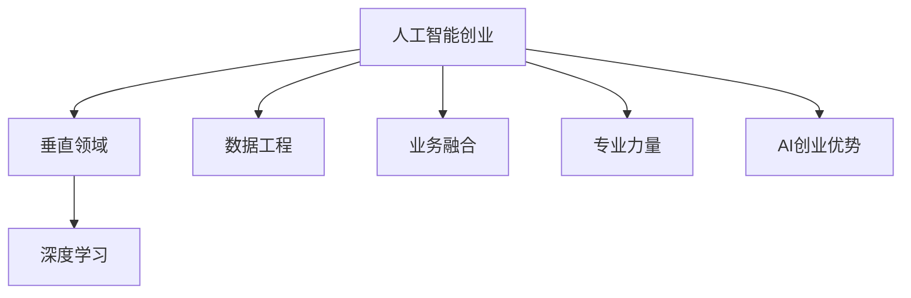
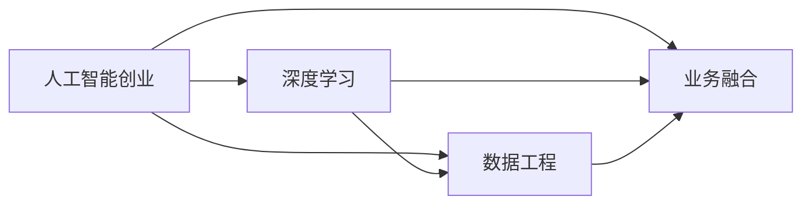
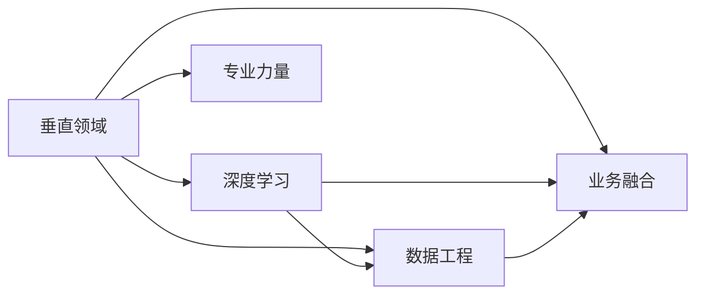

                 

# AI创业优势：垂直领域专业力量

> 关键词：人工智能创业, 垂直领域专业力量, 深度学习, 数据工程, 业务融合

## 1. 背景介绍

### 1.1 问题由来
近年来，人工智能(AI)技术的迅猛发展为各行各业带来了深刻的变革。从自动驾驶、机器人到医疗影像、金融风控，AI技术正逐步渗透到各个领域，带来新的商业模式和应用场景。然而，AI技术的广泛应用并非一蹴而就，而是在不断的实践和优化中逐渐成熟的。特别是在AI创业领域，如何将AI技术成功落地并产生商业价值，成为众多创业者关注的焦点。

### 1.2 问题核心关键点
AI创业的关键在于如何将AI技术与具体行业深度融合，提供切实可行的解决方案。这不仅要求创业者具备深厚的技术背景，还需要在行业应用上有深入的理解和洞察。垂直领域的AI创业，由于涉及特定的业务场景和数据类型，需要采用定制化的解决方案，才能真正实现技术赋能和业务提升。

### 1.3 问题研究意义
深入研究垂直领域的专业力量，对于指导AI创业实践、提升AI技术的行业应用价值，具有重要意义：

1. 降低应用开发成本。通过引入垂直领域的专家力量，可以大幅减少从头开发所需的资源投入，提升开发效率。
2. 提升模型效果。垂直领域的AI模型更能适配具体的业务需求，产生更好的应用效果。
3. 加速产品迭代。借助垂直领域的业务经验，能够快速定位问题、调整方案，缩短产品开发周期。
4. 推动行业升级。AI技术在垂直领域的应用，可以促进传统行业数字化转型，提升整体竞争力。
5. 带来技术创新。垂直领域的AI创业，催生了许多前沿技术和新应用场景，推动了AI技术的发展。

## 2. 核心概念与联系

### 2.1 核心概念概述

为了更好地理解垂直领域AI创业的优势，本节将介绍几个核心概念：

- 人工智能创业(AI Startup)：基于人工智能技术，通过创新应用，探索新的商业模式和业务机会的创业活动。
- 垂直领域(A vertically focused area)：指特定行业的细分领域，如医疗、教育、金融、农业等。
- 深度学习(Deep Learning)：一类基于神经网络的机器学习方法，通过多层次特征提取，实现复杂模式的识别和预测。
- 数据工程(Data Engineering)：通过数据收集、清洗、存储、管理等技术，为AI模型提供高质量的数据支持。
- 业务融合(Business Integration)：将AI技术融入具体业务流程，提升业务效率和决策质量。
- 专业力量(Professional Expertise)：特定领域的专业知识和经验，能够为AI创业提供方向性和技术性指导。

这些核心概念之间的联系可以通过以下Mermaid流程图来展示：



这个流程图展示了AI创业与垂直领域、深度学习、数据工程、业务融合和专业力量之间的联系，共同构成了AI创业的核心生态。通过理解这些核心概念，我们可以更好地把握AI创业的优势和挑战。

### 2.2 概念间的关系

这些核心概念之间存在着紧密的联系，形成了AI创业的完整框架。下面我们通过几个Mermaid流程图来展示这些概念之间的关系。

#### 2.2.1 AI创业的核心架构



这个流程图展示了AI创业的核心架构，包括深度学习、数据工程和业务融合。深度学习是AI创业的核心技术手段，数据工程为模型训练提供高质量的数据支持，业务融合则是将AI技术应用到实际业务场景中。

#### 2.2.2 垂直领域与AI创业的关系



这个流程图展示了垂直领域与AI创业的关系。垂直领域的专业力量可以为AI创业提供方向性指导，帮助选择合适的技术路径和应用场景。同时，AI创业也可以帮助垂直领域提升自动化水平，优化业务流程。

#### 2.2.3 数据工程与AI创业的关系


这个流程图展示了数据工程与AI创业的关系。高质量的数据工程是AI创业的基础，通过数据清洗、特征提取等技术，为深度学习模型提供更可靠的数据输入。

## 3. 核心算法原理 & 具体操作步骤
### 3.1 算法原理概述

垂直领域的AI创业，其核心在于如何将AI技术深度融合到具体业务中。基于深度学习的AI模型，需要大量的高质量数据和计算资源进行训练。同时，这些模型在特定领域的应用效果，很大程度上取决于数据的质量和模型的泛化能力。因此，垂直领域的AI创业，需要在模型训练、数据工程、业务融合等多个环节进行优化，以提升整体效果。

### 3.2 算法步骤详解

垂直领域的AI创业，一般包括以下几个关键步骤：

**Step 1: 数据收集与预处理**
- 收集垂直领域的相关数据，包括文本、图像、视频等。
- 对数据进行清洗、去重、标注等预处理操作，确保数据质量和一致性。

**Step 2: 模型选择与训练**
- 选择合适的深度学习模型，如卷积神经网络(CNN)、循环神经网络(RNN)、长短期记忆网络(LSTM)等。
- 在训练集中对模型进行参数优化，通过反向传播算法更新权重。

**Step 3: 模型评估与调优**
- 在验证集上评估模型性能，通过调整超参数（如学习率、批大小等）和模型结构，提升模型精度。
- 引入正则化技术，如L2正则、Dropout等，防止过拟合。

**Step 4: 模型部署与应用**
- 将训练好的模型部署到实际应用系统中，进行生产环境测试。
- 根据反馈不断优化模型，提升模型在实际业务场景中的表现。

**Step 5: 持续学习与更新**
- 通过在线学习或增量学习，持续优化模型参数，适应业务需求变化。
- 定期重新训练模型，更新模型知识库，确保模型性能稳定。

以上是垂直领域AI创业的一般流程。在具体实践中，还需要根据行业特点和数据特性，进行更加灵活的优化和调整。

### 3.3 算法优缺点

垂直领域AI创业具有以下优点：

1. 技术针对性更强：垂直领域的AI模型针对特定业务需求进行优化，能够产生更好的应用效果。
2. 行业经验丰富：创业团队往往具有丰富的行业经验，能够更好地理解业务需求，提供切实的解决方案。
3. 数据价值更高：垂直领域的数据具有高度的行业相关性，能够在训练中产生更高的数据价值。
4. 快速迭代优化：通过不断优化模型和业务融合方案，能够快速响应市场变化。

同时，垂直领域AI创业也存在一些缺点：

1. 数据获取困难：特定领域的数据获取难度较大，数据量可能不足以满足深度学习模型的需求。
2. 技术壁垒较高：垂直领域的AI创业需要深入的技术积累，对创业团队的技术能力要求较高。
3. 行业特殊性较强：特定领域的应用场景和业务流程可能与其他领域差异较大，需要定制化的解决方案。
4. 初始成本较高：特定领域的垂直AI创业可能需要定制化的解决方案，初始成本较高。

### 3.4 算法应用领域

垂直领域的AI创业，已经在多个行业得到了广泛应用，例如：

- 医疗影像分析：利用深度学习模型进行病灶检测、病理分析等，提升医疗诊断的准确性和效率。
- 金融风险评估：通过深度学习模型进行信用评分、欺诈检测等，提升金融风控的准确性和时效性。
- 智能制造：利用深度学习模型进行质量检测、故障预测等，提升制造业的自动化和智能化水平。
- 教育智能化：通过深度学习模型进行学生行为分析、智能推荐等，提升教育质量和学习效果。
- 农业智能化：利用深度学习模型进行农作物识别、病虫害预测等，提升农业生产的智能化水平。

这些领域的应用展示了垂直领域AI创业的广阔前景和巨大潜力。随着AI技术在各行业的不断深化应用，垂直领域的AI创业将带来更多的创新和突破。

## 4. 数学模型和公式 & 详细讲解 & 举例说明

### 4.1 数学模型构建

在垂直领域AI创业中，深度学习模型是最核心的技术手段。以下是常用的数学模型和公式：

- 卷积神经网络(CNN)：用于处理图像数据，其基本结构包括卷积层、池化层和全连接层。
- 循环神经网络(RNN)：用于处理序列数据，如文本、时间序列等，通过记忆单元保留序列信息。
- 长短期记忆网络(LSTM)：一种改进的RNN结构，通过门控机制抑制长序列信息的衰减。
- 深度神经网络(DNN)：用于处理大规模数据，通过多层神经网络进行特征提取和分类。

### 4.2 公式推导过程

以卷积神经网络(CNN)为例，其核心公式如下：

$$
y = \sigma(\sum_{i=1}^n w_i x_i + b)
$$

其中，$x_i$表示输入数据的第$i$个特征，$w_i$表示对应的权重参数，$b$表示偏置项，$\sigma$表示激活函数，$y$表示输出结果。

在训练过程中，使用梯度下降等优化算法，不断调整权重参数$w_i$和偏置项$b$，以最小化损失函数：

$$
L = \frac{1}{N} \sum_{i=1}^N (y_i - \hat{y_i})^2
$$

其中，$y_i$表示真实标签，$\hat{y_i}$表示模型预测结果。

### 4.3 案例分析与讲解

以医疗影像分析为例，利用卷积神经网络(CNN)进行病灶检测。首先收集大量的医疗影像数据，将其标注为正常和异常两类。然后使用CNN模型对影像数据进行特征提取和分类，通过反向传播算法更新模型参数，不断提升模型精度。最终，在测试集上评估模型性能，生成病灶检测报告。

## 5. 项目实践：代码实例和详细解释说明
### 5.1 开发环境搭建

在进行垂直领域AI创业项目开发前，我们需要准备好开发环境。以下是使用Python进行Keras开发的环境配置流程：

1. 安装Anaconda：从官网下载并安装Anaconda，用于创建独立的Python环境。

2. 创建并激活虚拟环境：
```bash
conda create -n pytorch-env python=3.8 
conda activate pytorch-env
```

3. 安装Keras：
```bash
pip install keras
```

4. 安装各类工具包：
```bash
pip install numpy pandas scikit-learn matplotlib tqdm jupyter notebook ipython
```

完成上述步骤后，即可在`pytorch-env`环境中开始项目开发。

### 5.2 源代码详细实现

这里以医疗影像分析项目为例，给出使用Keras对卷积神经网络进行病灶检测的代码实现。

```python
import numpy as np
from keras.models import Sequential
from keras.layers import Conv2D, MaxPooling2D, Flatten, Dense

# 定义数据集
train_data = np.load('train_data.npy')
train_labels = np.load('train_labels.npy')
test_data = np.load('test_data.npy')
test_labels = np.load('test_labels.npy')

# 数据预处理
train_data = train_data / 255.0
test_data = test_data / 255.0

# 定义模型
model = Sequential()
model.add(Conv2D(32, (3, 3), activation='relu', input_shape=(256, 256, 1)))
model.add(MaxPooling2D((2, 2)))
model.add(Conv2D(64, (3, 3), activation='relu'))
model.add(MaxPooling2D((2, 2)))
model.add(Flatten())
model.add(Dense(64, activation='relu'))
model.add(Dense(1, activation='sigmoid'))

# 编译模型
model.compile(optimizer='adam', loss='binary_crossentropy', metrics=['accuracy'])

# 训练模型
model.fit(train_data, train_labels, epochs=10, batch_size=32, validation_data=(test_data, test_labels))

# 评估模型
test_loss, test_acc = model.evaluate(test_data, test_labels)
print('Test loss:', test_loss)
print('Test accuracy:', test_acc)
```

以上代码展示了如何使用Keras搭建一个简单的卷积神经网络，进行医疗影像的病灶检测任务。可以看到，Keras提供了高度简洁的API，可以方便快捷地实现各种深度学习模型。

### 5.3 代码解读与分析

让我们再详细解读一下关键代码的实现细节：

**数据集定义**：
- `train_data`和`train_labels`表示训练集的数据和标签，`test_data`和`test_labels`表示测试集的数据和标签。

**数据预处理**：
- 将数据进行归一化处理，将像素值统一缩放到0-1范围内。

**模型定义**：
- 使用`Sequential`容器定义模型结构，包括卷积层、池化层、全连接层等。
- 使用`Conv2D`层进行卷积操作，`MaxPooling2D`层进行池化操作。

**模型编译**：
- 使用`adam`优化器进行参数更新，`binary_crossentropy`损失函数用于二分类问题。

**模型训练**：
- 使用`fit`方法进行模型训练，设置训练轮数和批大小。

**模型评估**：
- 使用`evaluate`方法在测试集上评估模型性能，输出损失和准确率。

## 6. 实际应用场景
### 6.1 医疗影像分析

垂直领域的AI创业，在医疗影像分析方面具有巨大潜力。传统医疗影像诊断往往需要大量经验丰富的医生，成本高且效率低。基于深度学习的AI模型，能够在医疗影像中自动识别病灶、标记异常区域，提升诊断的准确性和速度。

具体而言，可以收集大量的医疗影像数据，利用CNN模型进行特征提取和分类，生成病灶检测报告。同时，可以通过在线学习不断优化模型，适应新的影像类型和病灶形态。这种AI驱动的影像分析系统，可以大幅降低医生的工作负担，提升医疗服务质量。

### 6.2 金融风险评估

垂直领域的AI创业，在金融风险评估方面同样大有可为。传统的金融风险评估依赖于大量人工审核和复杂的计算模型，过程繁琐且准确性难以保证。利用深度学习模型，可以从大量的金融交易数据中自动识别风险信号，实时预测金融风险。

具体而言，可以收集金融交易数据，利用LSTM模型对交易行为进行建模，识别异常交易和欺诈行为。同时，可以通过增量学习不断优化模型，适应新的交易模式和风险变化。这种AI驱动的风险评估系统，能够显著提升金融风控的效率和准确性。

### 6.3 智能制造

垂直领域的AI创业，在智能制造方面也有广泛应用。传统的制造业生产过程复杂，质量检测和故障预测需要大量人力和设备投入。基于深度学习的AI模型，能够实时监测生产设备和产品状态，提高生产效率和产品质量。

具体而言，可以收集制造业的生产数据，利用CNN模型进行质量检测和故障预测，实时反馈生产异常。同时，可以通过在线学习不断优化模型，适应新的生产场景和设备类型。这种AI驱动的生产管理系统，能够大幅提升制造业的自动化和智能化水平。

### 6.4 教育智能化

垂直领域的AI创业，在教育智能化方面也具有巨大的潜力。传统的教育方式往往依赖于教师的经验和学生的自主学习能力，效果难以保证。利用深度学习模型，可以自动分析学生的学习行为和表现，提供个性化的教育推荐和学习资源。

具体而言，可以收集学生的学习数据，利用RNN模型对学生的行为进行建模，生成个性化的学习计划和推荐。同时，可以通过在线学习不断优化模型，适应不同学生的学习需求和背景。这种AI驱动的教育系统，能够大幅提升教育质量和学生学习效果。

## 7. 工具和资源推荐
### 7.1 学习资源推荐

为了帮助开发者系统掌握垂直领域AI创业的理论基础和实践技巧，这里推荐一些优质的学习资源：

1. 《深度学习：基础、算法与应用》书籍：系统介绍深度学习的理论和实践，涵盖卷积神经网络、循环神经网络等常用模型。
2. 《数据科学与人工智能：入门、原理与应用》课程：由知名教授主讲，涵盖数据工程、深度学习等基本概念和应用。
3. 《AI创业：从0到1》书籍：由创业成功人士撰写，分享AI创业的经验和教训，提供实用的商业指导。
4. Coursera《深度学习专项课程》：由斯坦福大学和Google等机构提供，涵盖深度学习的理论和实践，适合自学和进阶。
5. Udacity《深度学习纳米学位》：由Coursera和Google联合提供，涵盖深度学习、数据工程等核心内容，提供实战项目和导师指导。

通过对这些资源的学习实践，相信你一定能够系统掌握垂直领域AI创业的技术框架和应用方法，为创业成功奠定坚实基础。

### 7.2 开发工具推荐

高效的开发离不开优秀的工具支持。以下是几款用于垂直领域AI创业开发的常用工具：

1. Keras：高度简洁的深度学习框架，易于上手，适合快速迭代研究。Keras提供了丰富的API，可以快速搭建各种深度学习模型。
2. TensorFlow：由Google主导的深度学习框架，生产部署方便，适合大规模工程应用。TensorFlow提供了灵活的计算图和高效的计算资源管理。
3. PyTorch：基于Python的深度学习框架，灵活动态的计算图，适合快速迭代研究。PyTorch提供了丰富的优化器和正则化技术，便于模型训练和优化。
4. Weights & Biases：模型训练的实验跟踪工具，可以记录和可视化模型训练过程中的各项指标，方便对比和调优。
5. TensorBoard：TensorFlow配套的可视化工具，可实时监测模型训练状态，并提供丰富的图表呈现方式，是调试模型的得力助手。
6. Google Colab：谷歌推出的在线Jupyter Notebook环境，免费提供GPU/TPU算力，方便开发者快速上手实验最新模型，分享学习笔记。

合理利用这些工具，可以显著提升垂直领域AI创业项目的开发效率，加快创新迭代的步伐。

### 7.3 相关论文推荐

垂直领域AI创业的研究源于学界的持续研究。以下是几篇奠基性的相关论文，推荐阅读：

1. AlexNet：卷积神经网络在图像分类任务上的突破，奠定了深度学习在图像处理领域的地位。
2. RNNs for Sequential Data：提出循环神经网络，用于处理序列数据的经典模型，在文本处理中得到广泛应用。
3. LSTM：一种改进的循环神经网络结构，通过门控机制抑制长序列信息的衰减，提高了序列建模的准确性。
4. DNN for Image Recognition：提出深度神经网络，用于大规模图像识别的经典模型，在计算机视觉领域取得了显著效果。

这些论文代表了大规模深度学习模型的发展脉络。通过学习这些前沿成果，可以帮助研究者把握学科前进方向，激发更多的创新灵感。

除上述资源外，还有一些值得关注的前沿资源，帮助开发者紧跟垂直领域AI创业技术的最新进展，例如：

1. arXiv论文预印本：人工智能领域最新研究成果的发布平台，包括大量尚未发表的前沿工作，学习前沿技术的必读资源。
2. 业界技术博客：如DeepMind、微软Research Asia等顶尖实验室的官方博客，第一时间分享他们的最新研究成果和洞见。
3. 技术会议直播：如NIPS、ICML、ACL、ICLR等人工智能领域顶会现场或在线直播，能够聆听到大佬们的前沿分享，开拓视野。
4. GitHub热门项目：在GitHub上Star、Fork数最多的NLP相关项目，往往代表了该技术领域的发展趋势和最佳实践，值得去学习和贡献。
5. 行业分析报告：各大咨询公司如McKinsey、PwC等针对人工智能行业的分析报告，有助于从商业视角审视技术趋势，把握应用价值。

总之，对于垂直领域AI创业技术的学习和实践，需要开发者保持开放的心态和持续学习的意愿。多关注前沿资讯，多动手实践，多思考总结，必将收获满满的成长收益。

## 8. 总结：未来发展趋势与挑战
### 8.1 总结

本文对垂直领域AI创业方法进行了全面系统的介绍。首先阐述了垂直领域AI创业的背景和意义，明确了在垂直领域引入AI技术，可以显著提升业务效率和决策质量。其次，从原理到实践，详细讲解了垂直领域AI创业的关键步骤，给出了具体的代码实现和解释。同时，本文还广泛探讨了垂直领域AI创业在医疗、金融、制造、教育等领域的实际应用，展示了垂直领域AI创业的巨大潜力。此外，本文精选了垂直领域AI创业的学习资源，力求为读者提供全方位的技术指引。

通过本文的系统梳理，可以看到，垂直领域AI创业具有很强的技术针对性和业务价值，能够显著提升各行业的自动化和智能化水平。未来，伴随AI技术在各行业的不断深化应用，垂直领域的AI创业必将成为推动行业数字化转型的重要力量。

### 8.2 未来发展趋势

展望未来，垂直领域AI创业将呈现以下几个发展趋势：

1. 模型规模持续增大：随着算力成本的下降和数据规模的扩张，深度学习模型参数量还将持续增长。超大规模模型蕴含的丰富知识，有望支撑更加复杂多变的业务需求。
2. 算法多样性增加：垂直领域AI创业将涌现更多参数高效、计算高效的微调方法，在保证模型效果的同时，减小资源消耗。
3. 持续学习成为常态：模型需要不断学习新知识以保持性能，增量学习、在线学习等技术将广泛应用。
4. 数据工程的重要性提升：高质量的数据工程将成为垂直领域AI创业的关键，数据清洗、特征工程等技术将持续优化。
5. 业务融合深度增强：AI技术将更深入地融入业务流程，提升业务效率和决策质量。

以上趋势凸显了垂直领域AI创业的广阔前景。这些方向的探索发展，必将进一步提升AI技术的行业应用价值，为各行业带来更强的赋能效果。

### 8.3 面临的挑战

尽管垂直领域AI创业已经取得了显著成果，但在迈向更加智能化、普适化应用的过程中，它仍面临诸多挑战：

1. 数据获取困难：特定领域的数据获取难度较大，数据量可能不足以满足深度学习模型的需求。
2. 技术壁垒较高：垂直领域的AI创业需要深入的技术积累，对创业团队的技术能力要求较高。
3. 行业特殊性较强：特定领域的应用场景和业务流程可能与其他领域差异较大，需要定制化的解决方案。
4. 初始成本较高：特定领域的垂直AI创业可能需要定制化的解决方案，初始成本较高。

### 8.4 未来突破

面对垂直领域AI创业所面临的种种挑战，未来的研究需要在以下几个方面寻求新的突破：

1. 探索无监督和半监督学习：摆脱对大规模标注数据的依赖，利用自监督学习、主动学习等无监督和半监督范式，最大限度利用非结构化数据，实现更加灵活高效的创业。
2. 研究参数高效和计算高效的微调方法：开发更加参数高效的微调方法，在固定大部分预训练参数的同时，只更新极少量的任务相关参数。同时优化模型计算图，减少前向传播和反向传播的资源消耗，实现更加轻量级、实时性的部署。
3. 融合因果分析和博弈论工具：将因果分析方法引入AI创业，识别出模型决策的关键特征，增强输出解释的因果性和逻辑性。借助博弈论工具刻画人机交互过程，主动探索并规避模型的脆弱点，提高系统稳定性。
4. 纳入伦理道德约束：在模型训练目标中引入伦理导向的评估指标，过滤和惩罚有偏见、有害的输出倾向。同时加强人工干预和审核，建立模型行为的监管机制，确保输出符合人类价值观和伦理道德。
5. 提升数据工程能力：高质量的数据工程是垂直领域AI创业的基础，需要深入研究数据清洗、特征提取等技术，提升数据的质量和可用性。

这些研究方向的探索，必将引领垂直领域AI创业技术迈向更高的台阶，为各行业带来更强的赋能效果。

## 9. 附录：常见问题与解答
### Q1: 垂直领域AI创业是否适用于所有行业？
A: 垂直领域AI创业在绝大多数行业都有广泛的应用前景。具体是否适用，取决于行业对自动化和智能化的需求以及可获取的数据资源。例如，医疗、金融、制造等对数据和智能化有较高需求的行业，垂直领域AI创业无疑具有很大的潜力。但一些传统行业，如农业、零售等，由于数据获取难度较大，垂直领域AI创业的推广应用需要更多的时间和资源投入。

### Q2: 垂直领域AI创业的核心技术是什么？
A: 垂直领域AI创业的核心技术是深度学习模型，特别是卷积神经网络(CNN)、循环神经网络(RNN)、长短期记忆网络(LSTM)等。这些模型能够自动从数据中学习特征，提取复杂的模式，进行分类、预测等任务。同时，数据工程也是垂直领域AI创业的重要组成部分，通过数据清洗、特征工程等技术，为模型训练提供高质量的数据支持。

### Q3: 垂直领域AI创业的优缺点有哪些？
A: 垂直领域AI创业的优点包括技术针对性更强、行业经验丰富、数据价值更高、快速迭代优化等。缺点则包括数据获取困难、技术壁垒较高、行业特殊性较强、初始成本较高。这些优缺点需要开发者在实际应用中权衡考虑。

### Q4: 垂直领域AI创业的未来

