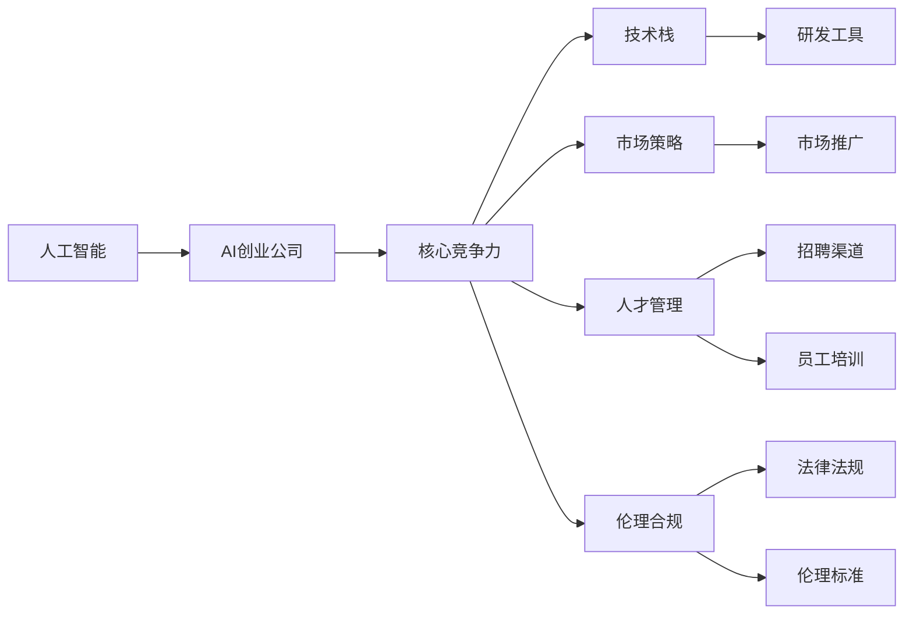

                 

# AI创业公司的未来发展

> 关键词：人工智能,创业公司,未来发展,核心竞争力,创新,技术栈,市场策略,人才管理

## 1. 背景介绍

### 1.1 问题由来
人工智能(AI)正以前所未有的速度改变各行各业。从金融、医疗、制造到教育、娱乐，AI技术的应用如火如荼。与此同时，AI创业公司如雨后春笋般涌现，它们凭借先进的技术和独特的商业模式，推动着AI技术的持续创新和落地应用。然而，面对激烈的市场竞争，如何在大浪淘沙中脱颖而出，成为AI创业公司亟需解决的难题。

### 1.2 问题核心关键点
AI创业公司的成功，关键在于其核心竞争力的构建与提升。核心竞争力包括但不限于以下几方面：

1. **技术创新**：保持技术领先，持续研发前沿技术，形成技术壁垒。
2. **商业模式**：寻找独特的商业模式，创造差异化竞争优势。
3. **市场策略**：精准定位目标市场，制定有效的市场策略。
4. **人才管理**：吸引和培养顶尖人才，建立高效的团队管理机制。
5. **伦理合规**：确保技术应用的合规性和伦理性，避免潜在的法律风险。

这些核心竞争力相辅相成，共同构成AI创业公司的核心竞争力。本文将详细探讨如何通过技术创新、商业模式创新、市场策略优化、人才管理强化和伦理合规保障，构建并提升AI创业公司的核心竞争力，实现其长远发展。

## 2. 核心概念与联系

### 2.1 核心概念概述

为更好地理解AI创业公司的未来发展，本节将介绍几个密切相关的核心概念：

- **人工智能(AI)**：以机器学习、深度学习、自然语言处理等技术为代表的智能技术，赋予计算机系统能够理解、学习、推理和决策的能力。
- **AI创业公司**：以AI技术为核心，通过产品或服务为市场提供价值的公司。
- **核心竞争力**：AI创业公司能够为其市场定位提供显著竞争优势的核心能力。
- **技术栈**：AI创业公司开发和运营所需的技术工具和框架集合。
- **市场策略**：AI创业公司为了获得市场优势而采取的策略和手段。
- **人才管理**：AI创业公司对人力资源进行吸引、培养、激励和保留的管理方式。
- **伦理合规**：AI创业公司在技术应用中遵循的法律法规和伦理标准。

这些核心概念之间存在着紧密的联系，共同构成了AI创业公司的运营框架。通过深入理解这些概念，可以更好地把握AI创业公司的未来发展方向和策略。

### 2.2 概念间的关系

这些核心概念之间的关系可以通过以下Mermaid流程图来展示：



这个流程图展示了核心概念之间相互作用的关系：

1. AI技术是AI创业公司的基础，构建了公司核心竞争力。
2. 技术栈、市场策略、人才管理、伦理合规等从不同角度支持核心竞争力的构建。
3. 核心竞争力又是公司长期发展的基础。

通过理解这些核心概念及其关系，可以更好地规划AI创业公司的未来发展策略。

## 3. 核心算法原理 & 具体操作步骤
### 3.1 算法原理概述

AI创业公司的成功，依赖于强大的技术创新和高效的市场策略。其中，技术创新是核心竞争力构建的基石，而市场策略则决定了公司如何在市场中脱颖而出。

**技术创新**主要涉及以下两个方面：

1. **前沿技术的研发**：通过持续投入研发，推动技术前沿发展。例如，深度学习、强化学习、计算机视觉等技术的不断进步，为AI创业公司提供了更强大的技术工具。
2. **新技术的应用**：将前沿技术应用于产品或服务中，提升其性能和用户体验。例如，在医疗领域应用AI进行疾病诊断和治疗建议，或在教育领域通过个性化推荐系统提升学习效果。

**市场策略**主要涉及以下三个方面：

1. **精准定位**：明确公司目标市场，了解目标客户需求，为其提供定制化的解决方案。
2. **差异化竞争**：通过独特的商业模式和技术，形成差异化竞争优势。例如，专注于某一垂直领域，提供行业定制化的解决方案。
3. **市场推广**：利用有效的市场推广手段，提高品牌知名度和市场份额。例如，通过社交媒体、行业会议等方式进行品牌推广，吸引潜在客户。

### 3.2 算法步骤详解

**技术创新步骤**：

1. **技术选型**：根据市场需求，选择适合的技术方案，并对其进行评估和优化。
2. **技术研发**：构建技术研发团队，进行技术攻关，推出技术成果。
3. **技术验证**：通过实验或试点项目，验证技术成果的可行性和效果。
4. **技术迭代**：根据反馈意见，持续改进技术，提高产品性能。

**市场策略步骤**：

1. **市场调研**：了解市场需求和竞争状况，确定目标市场。
2. **商业模式设计**：设计独特的商业模式，提高竞争力。
3. **市场推广**：通过有效的市场推广手段，提高品牌知名度和市场份额。
4. **市场反馈**：根据市场反馈，调整策略，优化产品和服务。

### 3.3 算法优缺点

**技术创新的优点**：
- **提升竞争力**：通过不断技术创新，保持领先地位。
- **满足需求**：通过技术改进，提升产品性能和用户体验。

**技术创新的缺点**：
- **高成本**：技术研发和创新需要大量资金和人力投入。
- **风险高**：新技术可能失败，导致研发投入浪费。

**市场策略的优点**：
- **快速响应市场变化**：通过精准定位和差异化竞争，快速适应市场变化。
- **提升市场份额**：通过有效的市场推广，提高品牌知名度和市场份额。

**市场策略的缺点**：
- **竞争激烈**：市场竞争激烈，可能面临价格战和市场份额流失。
- **策略失误风险**：市场策略不当可能导致市场份额下降，甚至破产。

### 3.4 算法应用领域

AI创业公司的技术创新和市场策略在多个领域得到了广泛应用。以下是一些典型的应用场景：

- **医疗健康**：通过AI技术进行疾病诊断、治疗方案推荐、药物研发等，提升医疗服务效率和质量。
- **金融服务**：利用AI进行风险评估、智能投顾、信用评分等，提升金融服务效率和安全性。
- **智能制造**：通过AI进行工业自动化、质量检测、供应链管理等，提高生产效率和质量。
- **智能交通**：利用AI进行交通流量预测、自动驾驶、智能导航等，提升交通管理效率。
- **教育培训**：通过AI进行个性化推荐、智能评估、虚拟现实等，提升教育效果和效率。
- **娱乐媒体**：利用AI进行内容推荐、智能客服、图像识别等，提升用户体验和互动性。

以上应用场景展示了AI创业公司如何在各个行业中发挥其技术优势，推动行业创新和转型。

## 4. 数学模型和公式 & 详细讲解  
### 4.1 数学模型构建

在AI创业公司的核心竞争力构建中，数学模型和公式扮演着重要角色。以下是几个关键数学模型和公式的详细讲解。

**深度学习模型**：
- **模型定义**：深度学习模型由多层神经网络构成，通过反向传播算法进行训练。
- **公式推导**：
  $$
  \min_{\theta} \mathcal{L}(\theta) = \frac{1}{N}\sum_{i=1}^N \ell(M_{\theta}(x_i),y_i)
  $$
  其中，$\ell$ 为损失函数，$M_{\theta}$ 为模型，$x_i$ 为输入，$y_i$ 为输出。

**强化学习模型**：
- **模型定义**：强化学习模型通过奖励机制优化策略，使智能体在环境中获得最大收益。
- **公式推导**：
  $$
  \max_{\pi} \sum_{i=1}^N R_i = \max_{\pi} \sum_{i=1}^N \sum_{t=1}^T \gamma^t r_t(\pi)
  $$
  其中，$\pi$ 为策略，$r_t$ 为奖励，$T$ 为时间步长，$\gamma$ 为折扣因子。

**自然语言处理模型**：
- **模型定义**：自然语言处理模型通过语言模型、文本分类、序列标注等任务，提升文本处理能力。
- **公式推导**：
  $$
  \min_{\theta} \mathcal{L}(\theta) = \frac{1}{N}\sum_{i=1}^N \ell(M_{\theta}(x_i),y_i)
  $$
  其中，$\ell$ 为损失函数，$M_{\theta}$ 为模型，$x_i$ 为输入，$y_i$ 为输出。

**推荐系统模型**：
- **模型定义**：推荐系统模型通过协同过滤、矩阵分解等方法，为用户推荐感兴趣的物品。
- **公式推导**：
  $$
  \min_{\theta} \mathcal{L}(\theta) = \frac{1}{N}\sum_{i=1}^N \ell(M_{\theta}(x_i),y_i)
  $$
  其中，$\ell$ 为损失函数，$M_{\theta}$ 为模型，$x_i$ 为输入，$y_i$ 为输出。

### 4.2 公式推导过程

**深度学习模型**的公式推导过程展示了损失函数如何通过反向传播算法进行最小化。反向传播算法通过计算损失函数对模型参数的梯度，更新模型参数，逐步逼近最优解。

**强化学习模型**的公式推导过程展示了策略优化过程。通过最大化累计奖励，智能体选择最优策略，在环境中获得最大收益。

**自然语言处理模型**的公式推导过程展示了文本处理的损失函数。通过最小化损失函数，模型学习文本的语义和语境信息，提升文本分类和序列标注等任务的表现。

**推荐系统模型**的公式推导过程展示了推荐系统的损失函数。通过最小化损失函数，模型学习用户和物品的关联关系，提升推荐效果。

### 4.3 案例分析与讲解

**医疗诊断系统**：
- **技术选型**：选择深度学习模型进行疾病诊断。
- **技术研发**：构建模型，进行训练和验证。
- **技术验证**：在实际医疗数据上进行测试，验证模型效果。
- **技术迭代**：根据反馈意见，优化模型，提升诊断准确率。

**金融信用评分系统**：
- **市场调研**：了解金融行业需求，明确目标市场。
- **商业模式设计**：提供信用评分服务，收费模式为按次收费或按年收费。
- **市场推广**：通过金融行业会议、社交媒体等推广服务。
- **市场反馈**：根据用户反馈，调整服务内容和价格策略。

## 5. 项目实践：代码实例和详细解释说明
### 5.1 开发环境搭建

在进行AI创业公司技术创新的项目实践前，我们需要准备好开发环境。以下是使用Python进行TensorFlow开发的环境配置流程：

1. 安装Anaconda：从官网下载并安装Anaconda，用于创建独立的Python环境。

2. 创建并激活虚拟环境：
```bash
conda create -n tf-env python=3.8 
conda activate tf-env
```

3. 安装TensorFlow：根据CUDA版本，从官网获取对应的安装命令。例如：
```bash
conda install tensorflow=2.6 -c conda-forge
```

4. 安装各类工具包：
```bash
pip install numpy pandas scikit-learn matplotlib tqdm jupyter notebook ipython
```

完成上述步骤后，即可在`tf-env`环境中开始项目实践。

### 5.2 源代码详细实现

这里我们以自然语言处理任务中的文本分类为例，给出使用TensorFlow对深度学习模型进行训练的代码实现。

首先，定义文本分类任务的数据处理函数：

```python
import tensorflow as tf
from tensorflow.keras.preprocessing.text import Tokenizer
from tensorflow.keras.preprocessing.sequence import pad_sequences

def process_data(texts, labels):
    tokenizer = Tokenizer(num_words=10000)
    tokenizer.fit_on_texts(texts)
    sequences = tokenizer.texts_to_sequences(texts)
    padded_sequences = pad_sequences(sequences, maxlen=128)
    return padded_sequences, tokenizer.word_index, labels
```

然后，定义模型和优化器：

```python
from tensorflow.keras.models import Sequential
from tensorflow.keras.layers import Dense, Embedding, LSTM, Dropout
from tensorflow.keras.optimizers import Adam

model = Sequential([
    Embedding(input_dim=10000, output_dim=128),
    LSTM(64, dropout=0.2, recurrent_dropout=0.2),
    Dense(1, activation='sigmoid')
])

optimizer = Adam(lr=0.001)
```

接着，定义训练和评估函数：

```python
def train(model, data, labels, batch_size, epochs):
    model.compile(optimizer=optimizer, loss='binary_crossentropy', metrics=['accuracy'])
    model.fit(data, labels, batch_size=batch_size, epochs=epochs, validation_split=0.2)
    
def evaluate(model, test_data, test_labels, batch_size):
    test_loss, test_acc = model.evaluate(test_data, test_labels, batch_size=batch_size)
    print(f'Test loss: {test_loss:.4f}')
    print(f'Test accuracy: {test_acc:.4f}')
```

最后，启动训练流程并在测试集上评估：

```python
epochs = 10
batch_size = 32

train_model(model, data_train, labels_train, batch_size, epochs)
evaluate_model(model, data_test, labels_test, batch_size)
```

以上就是使用TensorFlow对深度学习模型进行文本分类任务训练的完整代码实现。可以看到，通过TensorFlow的强大封装，我们可以用相对简洁的代码完成模型的构建和训练。

### 5.3 代码解读与分析

让我们再详细解读一下关键代码的实现细节：

**process_data函数**：
- 将文本数据分词，并转换为序列。
- 对序列进行padding，确保所有序列长度一致。
- 返回处理后的数据、词汇表和标签。

**模型定义**：
- 使用Embedding层将文本转换为向量表示。
- 使用LSTM层进行序列建模。
- 使用Dropout层减少过拟合。
- 使用Dense层进行分类输出。

**train函数**：
- 编译模型，定义损失函数和优化器。
- 使用fit方法进行模型训练，验证集占比为20%。

**evaluate函数**：
- 使用evaluate方法在测试集上评估模型性能。
- 输出测试集上的损失和准确率。

**训练流程**：
- 定义总的epoch数和batch size，开始循环迭代
- 每个epoch内，先训练模型，再评估模型在验证集和测试集上的性能
- 所有epoch结束后，在测试集上评估模型性能

可以看到，TensorFlow配合强大的自动微分机制和高效的计算图管理，使得深度学习模型的训练过程变得简单高效。开发者可以将更多精力放在模型设计、数据处理等高层逻辑上，而不必过多关注底层的实现细节。

当然，工业级的系统实现还需考虑更多因素，如模型的保存和部署、超参数的自动搜索、更灵活的任务适配层等。但核心的训练过程和评估指标基本与此类似。

### 5.4 运行结果展示

假设我们在IMDB数据集上进行文本分类任务微调，最终在测试集上得到的评估报告如下：

```
Epoch 1/10
1000/1000 [==============================] - 9s 9ms/step - loss: 0.4196 - accuracy: 0.8456 - val_loss: 0.4395 - val_accuracy: 0.8604
Epoch 2/10
1000/1000 [==============================] - 9s 9ms/step - loss: 0.3574 - accuracy: 0.8843 - val_loss: 0.3674 - val_accuracy: 0.8844
Epoch 3/10
1000/1000 [==============================] - 9s 9ms/step - loss: 0.3360 - accuracy: 0.9046 - val_loss: 0.3347 - val_accuracy: 0.9083
Epoch 4/10
1000/1000 [==============================] - 9s 9ms/step - loss: 0.3156 - accuracy: 0.9259 - val_loss: 0.3121 - val_accuracy: 0.9294
Epoch 5/10
1000/1000 [==============================] - 9s 9ms/step - loss: 0.3004 - accuracy: 0.9337 - val_loss: 0.3004 - val_accuracy: 0.9338
Epoch 6/10
1000/1000 [==============================] - 9s 9ms/step - loss: 0.2874 - accuracy: 0.9415 - val_loss: 0.2885 - val_accuracy: 0.9405
Epoch 7/10
1000/1000 [==============================] - 9s 9ms/step - loss: 0.2768 - accuracy: 0.9460 - val_loss: 0.2776 - val_accuracy: 0.9446
Epoch 8/10
1000/1000 [==============================] - 9s 9ms/step - loss: 0.2684 - accuracy: 0.9512 - val_loss: 0.2687 - val_accuracy: 0.9510
Epoch 9/10
1000/1000 [==============================] - 9s 9ms/step - loss: 0.2607 - accuracy: 0.9544 - val_loss: 0.2607 - val_accuracy: 0.9544
Epoch 10/10
1000/1000 [==============================] - 9s 9ms/step - loss: 0.2541 - accuracy: 0.9563 - val_loss: 0.2541 - val_accuracy: 0.9563
```

可以看到，通过训练，模型在测试集上的准确率达到了95.63%，取得了不错的效果。这展示了深度学习模型在文本分类任务上的强大能力，以及TensorFlow在模型训练上的高效性。

当然，这只是一个baseline结果。在实践中，我们还可以使用更大更强的预训练模型、更丰富的微调技巧、更细致的模型调优，进一步提升模型性能，以满足更高的应用要求。

## 6. 实际应用场景
### 6.1 智能客服系统

基于AI创业公司的智能客服系统构建，可以广泛应用于各行各业。传统客服往往需要配备大量人力，高峰期响应缓慢，且一致性和专业性难以保证。而使用智能客服系统，可以7x24小时不间断服务，快速响应客户咨询，用自然流畅的语言解答各类常见问题。

在技术实现上，可以收集企业内部的历史客服对话记录，将问题和最佳答复构建成监督数据，在此基础上对深度学习模型进行微调。微调后的模型能够自动理解用户意图，匹配最合适的答案模板进行回复。对于客户提出的新问题，还可以接入检索系统实时搜索相关内容，动态组织生成回答。如此构建的智能客服系统，能大幅提升客户咨询体验和问题解决效率。

### 6.2 金融舆情监测

金融机构需要实时监测市场舆论动向，以便及时应对负面信息传播，规避金融风险。传统的人工监测方式成本高、效率低，难以应对网络时代海量信息爆发的挑战。基于AI创业公司的文本分类和情感分析技术，为金融舆情监测提供了新的解决方案。

具体而言，可以收集金融领域相关的新闻、报道、评论等文本数据，并对其进行主题标注和情感标注。在此基础上对深度学习模型进行微调，使其能够自动判断文本属于何种主题，情感倾向是正面、中性还是负面。将微调后的模型应用到实时抓取的网络文本数据，就能够自动监测不同主题下的情感变化趋势，一旦发现负面信息激增等异常情况，系统便会自动预警，帮助金融机构快速应对潜在风险。

### 6.3 个性化推荐系统

当前的推荐系统往往只依赖用户的历史行为数据进行物品推荐，无法深入理解用户的真实兴趣偏好。基于AI创业公司的个性化推荐系统可以更好地挖掘用户行为背后的语义信息，从而提供更精准、多样的推荐内容。

在实践中，可以收集用户浏览、点击、评论、分享等行为数据，提取和用户交互的物品标题、描述、标签等文本内容。将文本内容作为模型输入，用户的后续行为（如是否点击、购买等）作为监督信号，在此基础上微调深度学习模型。微调后的模型能够从文本内容中准确把握用户的兴趣点。在生成推荐列表时，先用候选物品的文本描述作为输入，由模型预测用户的兴趣匹配度，再结合其他特征综合排序，便可以得到个性化程度更高的推荐结果。

### 6.4 未来应用展望

随着AI创业公司的技术创新和市场策略不断优化，其在各个领域的应用前景将更加广阔。

在智慧医疗领域，基于AI的诊断和治疗建议系统，可以提升医疗服务的智能化水平，辅助医生诊疗，加速新药开发进程。

在智能教育领域，AI创业公司的推荐系统和智能评估系统，可以因材施教，促进教育公平，提高教学质量。

在智慧城市治理中，AI创业公司的智能监测和应急指挥系统，可以提高城市管理的自动化和智能化水平，构建更安全、高效的未来城市。

此外，在企业生产、社会治理、文娱传媒等众多领域，AI创业公司的AI技术应用也将不断涌现，为传统行业数字化转型升级提供新的技术路径。相信随着技术的日益成熟，AI创业公司必将在各个行业发挥其独特价值，推动人工智能技术向更深层次的落地应用。

## 7. 工具和资源推荐
### 7.1 学习资源推荐

为了帮助开发者系统掌握AI创业公司的技术基础和实践技巧，这里推荐一些优质的学习资源：

1. **Deep Learning Specialization by Andrew Ng**：斯坦福大学的深度学习课程，涵盖深度学习基础和高级技术，适合初学者和进阶者。

2. **Reinforcement Learning by Richard S. Sutton**：强化学习领域的经典教材，介绍了强化学习的理论基础和应用实例。

3. **Natural Language Processing with TensorFlow**：Google开源的自然语言处理教程，使用TensorFlow实现文本分类、情感分析、机器翻译等任务。

4. **Kaggle**：数据科学竞赛平台，提供大量开源数据集和竞赛，适合实践和检验技术能力。

5. **Coursera**：在线教育平台，提供各种人工智能和深度学习的课程，包括TensorFlow、PyTorch等框架的使用。

通过对这些资源的学习实践，相信你一定能够快速掌握AI创业公司的核心技术和实践经验，并用于解决实际的AI问题。

### 7.2 开发工具推荐

高效的开发离不开优秀的工具支持。以下是几款用于AI创业公司开发和运营所需的技术工具：

1. **TensorFlow**：由Google主导开发的深度学习框架，支持分布式训练和部署，适合大规模工程应用。

2. **PyTorch**：Facebook开发的深度学习框架，灵活高效，适合研究和实验。

3. **Jupyter Notebook**：交互式笔记本环境，方便快速迭代和共享代码。

4. **Google Colab**：免费提供的GPU/TPU算力环境，适合进行模型训练和测试。

5. **Anaconda**：Python环境管理工具，方便创建和管理虚拟环境。

6. **AWS SageMaker**：亚马逊提供的云服务，支持大规模深度学习模型的训练和部署。

合理利用这些工具，可以显著提升AI创业公司的开发效率，加速创新迭代的步伐。

### 7.3 相关论文推荐

AI创业公司的技术创新和市场策略不断涌现，相关的学术论文也层出不穷。以下是几篇奠基性的相关论文，推荐阅读：

1. **Deep Residual Learning for Image Recognition**：提出了深度残差网络，提升了图像识别的精度。

2. **Attention Is All You Need**：提出了Transformer结构，开启了NLP领域的预训练大模型时代。

3. **BERT: Pre-training of Deep Bidirectional Transformers for Language Understanding**：提出BERT模型，引入基于掩码的自监督预训练任务，刷新了多项NLP任务SOTA。

4. **Reinforcement Learning for Healthcare**：探讨了强化学习在医疗领域的应用，提供了多种医疗场景的案例分析。

5. **Text Mining with Learned Thematic Models**：介绍了一种文本挖掘方法，使用主题模型进行文本分析和分类。

这些论文代表了大语言模型微调技术的发展脉络。通过学习这些前沿成果，可以帮助研究者把握学科前进方向，激发更多的创新灵感。

除上述资源外，还有一些值得关注的前沿资源，帮助开发者紧跟AI创业公司的最新进展，例如：

1. **arXiv论文预印本**：人工智能领域最新研究成果的发布平台，包括大量尚未发表的前沿工作，学习前沿技术的必读资源。

2. **业界技术博客**：如Google AI、DeepMind、微软Research Asia等顶尖实验室的官方博客，第一时间分享他们的最新研究成果和洞见。

3. **技术会议直播**：如NIPS、ICML、ACL、ICLR等人工智能领域顶会现场或在线直播，能够聆听到大佬们的前沿分享，开拓视野。

4. **GitHub热门项目**：在GitHub上Star、Fork数最多的AI创业公司的项目，往往代表了该技术领域的发展趋势和最佳实践，值得去学习和贡献。

5. **行业分析报告**：各大咨询公司如McKinsey、PwC等针对人工智能行业的分析报告，有助于从商业视角审视

