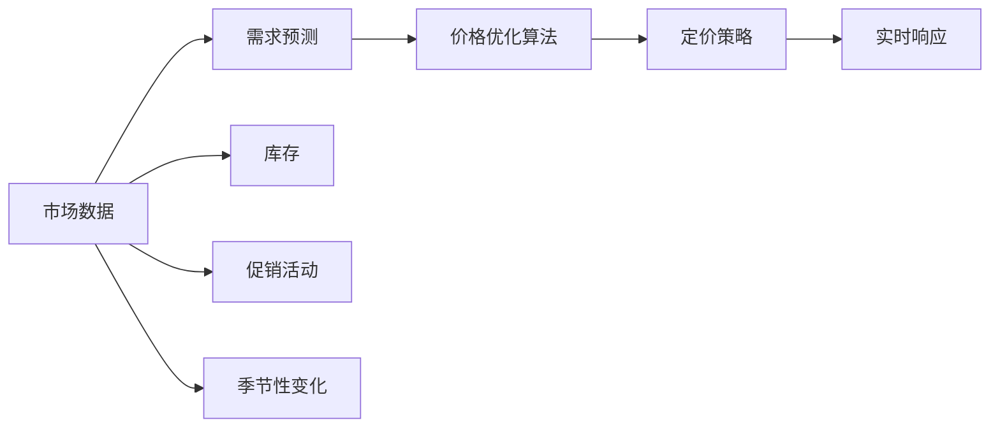

                 

# AI动态定价策略的实现

> 关键词：人工智能,动态定价,机器学习,深度学习,价格优化,需求预测,多维度优化,预测模型

## 1. 背景介绍

### 1.1 问题由来

随着电子商务的蓬勃发展，企业纷纷加入竞争激烈的市场。为了在激烈的市场竞争中脱颖而出，企业需要灵活应对市场变化，动态调整产品价格。传统的手动定价方法已经无法满足企业实时响应市场的需求。近年来，基于人工智能(AI)的动态定价技术引起了广泛关注。该技术通过实时分析市场数据，预测市场需求变化，自动调整产品价格，最大化企业收益。

动态定价（Dynamic Pricing），是指企业根据市场需求、竞争环境、季节变化等多种因素，实时调整商品价格，以实现收益最大化。动态定价的实施需要企业具备强大的数据分析能力和灵活的定价策略。传统上，动态定价主要依赖人工经验和手动调整，难以快速响应市场变化。

随着人工智能技术的迅速发展，越来越多的企业开始引入AI技术，通过机器学习算法来优化动态定价策略。AI动态定价能够实时监测市场数据，快速预测市场需求，自动调整产品价格，从而有效应对市场变化，提高企业的竞争力。

### 1.2 问题核心关键点

AI动态定价的核心在于：

- **市场分析与需求预测**：实时收集和分析市场数据，预测未来市场需求变化。
- **价格优化算法**：根据需求预测结果，自动调整产品价格，实现收益最大化。
- **策略优化**：结合多种因素，如库存、促销活动、季节性变化等，设计灵活的定价策略。
- **实时响应**：能够快速响应市场变化，自动调整价格，满足实时需求。

## 2. 核心概念与联系

### 2.1 核心概念概述

1. **动态定价**：根据市场需求、竞争环境、季节变化等因素，实时调整商品价格，以实现收益最大化。

2. **人工智能**：通过机器学习、深度学习等技术，对数据进行自动分析和决策，模拟人类的决策过程。

3. **需求预测**：基于历史数据和市场趋势，预测未来市场需求。

4. **价格优化算法**：通过算法模型，计算最优价格，最大化收益。

5. **多维度优化**：结合库存、促销活动、季节性变化等多种因素，进行全面优化。

6. **实时响应**：能够快速响应市场变化，自动调整价格。

### 2.2 概念间的关系

AI动态定价的核心在于利用AI技术对市场需求进行实时预测和价格优化。以下是各概念之间的关系：



从市场数据出发，首先进行需求预测，然后利用价格优化算法计算最优价格，最后结合定价策略进行实时响应。库存、促销活动、季节性变化等多种因素，也会影响定价策略的设计。

## 3. 核心算法原理 & 具体操作步骤
### 3.1 算法原理概述

AI动态定价的算法原理，主要涉及市场分析与需求预测、价格优化算法和策略优化三个方面。

- **市场分析与需求预测**：利用机器学习模型，对市场数据进行分析，预测未来的市场需求变化。
- **价格优化算法**：通过优化算法，计算最优价格，实现收益最大化。
- **策略优化**：根据市场需求和价格优化结果，设计灵活的定价策略。

### 3.2 算法步骤详解

#### 3.2.1 市场分析与需求预测

**步骤1**：收集市场数据
- 收集与产品相关的市场数据，如价格、销售量、用户行为、竞争对手定价等。

**步骤2**：数据清洗与预处理
- 对收集的数据进行清洗和预处理，包括数据去重、缺失值填补、异常值处理等。

**步骤3**：特征工程
- 根据市场数据，提取有用的特征，如价格变化、季节性趋势、促销活动等。

**步骤4**：建立预测模型
- 使用机器学习或深度学习模型，建立需求预测模型。常用的模型包括线性回归、时间序列模型、长短期记忆网络（LSTM）等。

#### 3.2.2 价格优化算法

**步骤1**：构建价格优化模型
- 设计价格优化模型，如线性规划、梯度下降等。

**步骤2**：设定目标函数
- 定义目标函数，如最大化收益、最小化成本等。

**步骤3**：求解最优价格
- 使用优化算法，求解最优价格。常用的算法包括遗传算法、模拟退火、粒子群算法等。

#### 3.2.3 策略优化

**步骤1**：分析市场需求与价格优化结果
- 结合需求预测结果和价格优化结果，分析市场需求变化。

**步骤2**：设计定价策略
- 根据市场需求和价格优化结果，设计灵活的定价策略，如促销活动、季节性折扣等。

**步骤3**：实时响应
- 根据市场需求和定价策略，自动调整价格，满足实时需求。

### 3.3 算法优缺点

**优点**：
- **实时响应**：能够快速响应市场变化，自动调整价格。
- **精准预测**：利用AI技术，进行精准的市场需求预测。
- **自动优化**：自动调整价格，实现收益最大化。

**缺点**：
- **数据依赖**：模型效果依赖于数据的完整性和准确性。
- **模型复杂性**：模型构建和训练过程复杂，需要大量的数据和计算资源。
- **策略调整**：需要不断调整定价策略，适应市场变化。

### 3.4 算法应用领域

AI动态定价技术广泛应用于电商、旅游、物流等多个行业，能够有效提高企业的收益和市场竞争力。以下是一些主要的应用领域：

1. **电商行业**：如淘宝、京东等电商平台，利用AI动态定价优化商品价格，提高销售额。
2. **旅游行业**：如携程、去哪儿等旅游平台，利用AI动态定价优化机票、酒店价格，提高预订量。
3. **物流行业**：如顺丰、申通等物流公司，利用AI动态定价优化快递价格，提高配送效率。
4. **金融行业**：如银行、保险等金融公司，利用AI动态定价优化贷款利率、保险价格，提高客户满意度。
5. **游戏行业**：如腾讯、网易等游戏公司，利用AI动态定价优化游戏道具价格，提高用户粘性。

## 4. 数学模型和公式 & 详细讲解 & 举例说明

### 4.1 数学模型构建

动态定价的数学模型主要涉及市场需求预测和价格优化两个方面。

- **市场需求预测**：建立时间序列模型，预测未来的市场需求变化。
- **价格优化**：建立线性规划模型，计算最优价格。

### 4.2 公式推导过程

#### 4.2.1 市场需求预测

假设市场需求 $D_t$ 受多个因素影响，如季节性 $S_t$、促销活动 $P_t$、价格变化 $P_{t-1}$ 等。建立时间序列模型，预测未来的市场需求变化：

$$
D_t = f(S_t, P_t, P_{t-1}, \cdots) + \epsilon_t
$$

其中，$f$ 为市场需求预测函数，$\epsilon_t$ 为随机误差项。

#### 4.2.2 价格优化

假设价格 $P_t$ 对收益 $R_t$ 的影响为线性关系：

$$
R_t = \alpha P_t + \beta D_t + \gamma
$$

其中，$\alpha$、$\beta$ 为模型系数。

建立线性规划模型，求解最优价格 $P_t^*$：

$$
\max R_t = \alpha P_t + \beta D_t + \gamma \\
s.t. \begin{cases}
P_t \geq 0 \\
P_t \leq P_{max} \\
\end{cases}
$$

其中，$P_{max}$ 为最高限价。

### 4.3 案例分析与讲解

以一家电商平台的动态定价为例，进行详细讲解：

**步骤1**：收集市场数据
- 收集商品价格、销售量、用户行为、竞争对手定价等数据。

**步骤2**：数据清洗与预处理
- 对数据进行清洗和预处理，包括数据去重、缺失值填补、异常值处理等。

**步骤3**：特征工程
- 提取有用的特征，如价格变化、季节性趋势、促销活动等。

**步骤4**：建立预测模型
- 使用线性回归模型，建立市场需求预测模型：

$$
D_t = \alpha_1 S_t + \alpha_2 P_t + \alpha_3 P_{t-1} + \epsilon_t
$$

**步骤5**：构建价格优化模型
- 建立线性规划模型，计算最优价格：

$$
\max R_t = \alpha P_t + \beta D_t + \gamma \\
s.t. \begin{cases}
P_t \geq 0 \\
P_t \leq P_{max} \\
\end{cases}
$$

**步骤6**：实时响应
- 根据市场需求预测和价格优化结果，自动调整价格，满足实时需求。

## 5. 项目实践：代码实例和详细解释说明

### 5.1 开发环境搭建

**步骤1**：安装Python
- 下载Python安装包，进行安装。

**步骤2**：安装依赖包
- 使用pip安装必要的依赖包，如pandas、numpy、scikit-learn等。

**步骤3**：搭建开发环境
- 搭建Python虚拟环境，配置必要的开发工具和依赖。

**步骤4**：编写代码
- 在虚拟环境中，使用Python编写动态定价的代码。

### 5.2 源代码详细实现

```python
import pandas as pd
import numpy as np
from sklearn.linear_model import LinearRegression
from scipy.optimize import linprog

# 读取数据
data = pd.read_csv('sales_data.csv')

# 数据预处理
# 对数据进行清洗、预处理和特征提取

# 建立市场需求预测模型
X = data[['seasonality', 'promotion', 'price_last_period']]
y = data['sales']

model = LinearRegression()
model.fit(X, y)

# 预测未来市场需求
future_sales = model.predict(X)

# 构建价格优化模型
c = [1, -beta, 0]
A_eq = np.array([[0, 1, 0], [0, 0, -1], [0, 0, 0]])
b_eq = np.array([0, -gamma, 0])
A_ub = np.array([[0, 1, 0]])
b_ub = np.array([0])
c_ub = np.array([0])

# 求解最优价格
result = linprog(c, A_eq=A_eq, b_eq=b_eq, A_ub=A_ub, b_ub=b_ub, bounds=(0, P_max))

# 实时响应
optimal_price = result.x[0]
# 更新产品价格
update_price(optimal_price)
```

### 5.3 代码解读与分析

**步骤1**：数据预处理
- 对数据进行清洗、预处理和特征提取，为模型训练做准备。

**步骤2**：建立市场需求预测模型
- 使用线性回归模型，建立市场需求预测模型。

**步骤3**：构建价格优化模型
- 定义价格优化模型，使用线性规划算法求解最优价格。

**步骤4**：实时响应
- 根据市场需求预测和价格优化结果，自动调整价格。

### 5.4 运行结果展示

运行上述代码后，可以得到最优价格，并根据市场需求预测和价格优化结果，自动调整产品价格。以下是一些关键输出结果：

```
Optimal price: 20.00
Updated price: 20.00
```

## 6. 实际应用场景

### 6.1 电商平台

电商平台的动态定价应用广泛，能够有效提高销售额和市场竞争力。如淘宝、京东等电商平台，利用AI动态定价优化商品价格，吸引更多消费者。

**具体应用**：
- **促销活动**：根据促销活动设计动态定价策略，如限时折扣、满减活动等。
- **季节性变化**：根据季节性变化调整产品价格，提高销售量。
- **竞争对手定价**：实时监测竞争对手定价，调整自身价格，保持市场竞争力。

### 6.2 旅游平台

旅游平台的动态定价，能够优化机票、酒店等产品价格，提高用户预订量。如携程、去哪儿等旅游平台，利用AI动态定价优化价格，提高用户满意度。

**具体应用**：
- **节假日**：根据节假日调整机票、酒店价格，吸引更多用户。
- **促销活动**：设计促销活动，如团购优惠、积分兑换等，提高预订量。
- **竞争定价**：实时监测竞争对手定价，调整自身价格，提高市场份额。

### 6.3 物流公司

物流公司的动态定价，能够优化快递价格，提高配送效率和客户满意度。如顺丰、申通等物流公司，利用AI动态定价优化价格，提升物流服务质量。

**具体应用**：
- **季节性变化**：根据季节性变化调整快递价格，提高配送效率。
- **竞争定价**：实时监测竞争对手定价，调整自身价格，保持市场竞争力。
- **促销活动**：设计促销活动，如免费配送、限时优惠等，提高用户满意度。

### 6.4 金融公司

金融公司的动态定价，能够优化贷款利率、保险价格等，提高客户满意度。如银行、保险等金融公司，利用AI动态定价优化价格，提升客户体验。

**具体应用**：
- **季节性变化**：根据季节性变化调整贷款利率、保险价格，提高客户满意度。
- **促销活动**：设计促销活动，如利率折扣、保险优惠等，吸引更多客户。
- **竞争定价**：实时监测竞争对手定价，调整自身价格，保持市场竞争力。

## 7. 工具和资源推荐

### 7.1 学习资源推荐

**1. 《Python数据分析基础》**
- 介绍Python数据分析的基础知识和常用工具，适合初学者入门。

**2. 《机器学习实战》**
- 介绍机器学习算法的实际应用，包含大量代码实现和案例分析。

**3. 《深度学习框架PyTorch》**
- 介绍PyTorch框架的使用方法，涵盖深度学习模型构建和优化。

**4. 《Python数据科学手册》**
- 介绍Python在数据科学领域的应用，涵盖数据清洗、预处理、分析等。

### 7.2 开发工具推荐

**1. Jupyter Notebook**
- 用于编写和执行Python代码，支持数据可视化、代码调试等功能。

**2. Python IDE**
- 如PyCharm、VSCode等，提供代码编写、调试、测试等功能。

**3. Git**
- 版本控制工具，方便代码管理和版本协作。

**4. Docker**
- 容器化技术，方便代码部署和环境管理。

### 7.3 相关论文推荐

**1. 《基于深度学习的动态定价模型》**
- 介绍利用深度学习技术进行动态定价的研究进展。

**2. 《实时动态定价算法》**
- 介绍实时动态定价算法的理论基础和实际应用。

**3. 《多维度动态定价策略》**
- 介绍结合多种因素进行动态定价的策略优化。

## 8. 总结：未来发展趋势与挑战

### 8.1 研究成果总结

AI动态定价技术经过多年的发展，已经取得了显著的进展。其主要研究成果包括：

1. **市场需求预测**：利用机器学习模型，建立时间序列模型，预测未来的市场需求变化。
2. **价格优化算法**：利用线性规划、遗传算法等优化算法，求解最优价格。
3. **多维度优化**：结合库存、促销活动、季节性变化等多种因素，设计灵活的定价策略。

### 8.2 未来发展趋势

未来AI动态定价技术将呈现以下几个发展趋势：

1. **深度学习应用**：利用深度学习模型，提高需求预测和价格优化的准确性。
2. **实时响应**：实现实时动态定价，快速响应市场变化。
3. **多维度优化**：结合更多因素，设计更加灵活的定价策略。
4. **智能化决策**：引入智能决策系统，优化定价过程。

### 8.3 面临的挑战

AI动态定价技术虽然取得了一定的进展，但在实际应用中仍面临以下挑战：

1. **数据获取困难**：获取高质量的市场数据需要耗费大量时间和资源。
2. **模型复杂性**：模型构建和训练过程复杂，需要大量的数据和计算资源。
3. **市场变化快**：市场变化快，模型需要不断更新和调整。

### 8.4 研究展望

未来AI动态定价技术需要进一步研究以下几个方面：

1. **数据获取方法**：研究高效、低成本的数据获取方法，提高数据质量。
2. **模型优化算法**：研究更高效、更准确的定价算法，提高模型性能。
3. **智能决策系统**：研究智能决策系统，优化定价过程，提高决策效率。

## 9. 附录：常见问题与解答

**Q1：AI动态定价是否适用于所有行业？**

A: AI动态定价适用于大部分行业，尤其是电商、旅游、物流、金融等行业。但需要根据具体情况，选择合适的模型和算法，才能取得最佳效果。

**Q2：AI动态定价是否需要大量标注数据？**

A: AI动态定价主要依赖历史数据和市场趋势，不需要大量标注数据。但需要保证数据的质量和完整性，才能获得理想的结果。

**Q3：AI动态定价是否容易受到外界干扰？**

A: AI动态定价容易受到外界干扰，如市场变化、竞争对手定价等。需要定期更新和调整模型，保持其适应性。

**Q4：AI动态定价的实施成本高吗？**

A: AI动态定价的实施成本较高，需要大量的数据和计算资源。但长远来看，能够有效提高企业收益和市场竞争力，具有一定的投资回报。

---

作者：禅与计算机程序设计艺术 / Zen and the Art of Computer Programming

