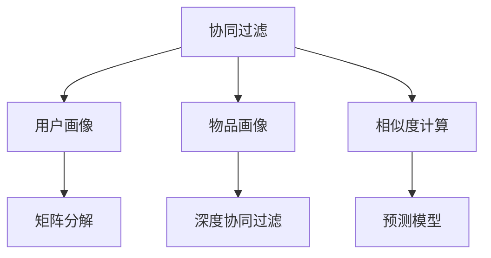

                 

# AI协同过滤算法在电商中的应用

> 关键词：协同过滤, 电商, AI推荐, 用户行为分析, 产品推荐系统, 点击率预测

## 1. 背景介绍

### 1.1 问题由来
电商平台的显著特点之一是用户数量庞大且高度异构，导致个性化推荐难度增加。与此同时，用户浏览、购买行为的数据量庞大且难以有效利用，如何充分利用这些数据进行个性化推荐成为电商平台的核心挑战。协同过滤算法（Collaborative Filtering，CF）是一种基于用户和项目（商品）之间相互关系的推荐算法，通过挖掘用户之间的相似性和物品之间的相关性，能够有效利用用户行为数据，提升推荐精度。在近年来兴起的深度学习范式中，协同过滤算法也得到了新的发展。本文聚焦于AI协同过滤算法在电商中的应用，详细探讨其原理、实现和优化，并展望未来的发展方向。

### 1.2 问题核心关键点
电商平台的个性化推荐系统，核心目标是基于用户的历史行为数据，推荐其可能感兴趣的物品。传统推荐系统基于用户画像、物品属性等静态信息，难以充分挖掘用户动态行为背后的信息。AI协同过滤算法通过学习用户和物品之间的动态关联，能够更准确地预测用户对物品的兴趣。AI协同过滤算法包括基于用户-物品矩阵的矩阵分解（Matrix Factorization，MF）算法和基于用户和物品表示向量的模型如深度协同过滤（Deep Collaborative Filtering，DCF）等。

### 1.3 问题研究意义
AI协同过滤算法在电商中的应用，对于提升用户体验、提高转化率、增加用户粘性具有重要意义：

1. 提升用户体验。推荐系统能根据用户行为实时生成个性化推荐，满足用户个性化需求，提升满意度。
2. 提高转化率。精准的推荐能够将用户潜在需求转化为购买行为，减少流失率。
3. 增加用户粘性。优质的推荐服务能增加用户对平台的依赖性和忠诚度，减少用户流失。

此外，AI协同过滤算法还能帮助电商平台更好地理解用户需求，优化产品布局和营销策略，提升商业效益。

## 2. 核心概念与联系

### 2.1 核心概念概述

AI协同过滤算法的核心概念包括以下几点：

- 协同过滤（Collaborative Filtering，CF）：一种推荐算法，利用用户之间的相似性和物品之间的相关性，推荐用户可能感兴趣的物品。
- 矩阵分解（Matrix Factorization，MF）：一种经典的协同过滤方法，通过分解用户-物品矩阵，学习用户和物品的低维隐向量表示。
- 深度协同过滤（Deep Collaborative Filtering，DCF）：一种结合深度学习技术的协同过滤方法，通过多层的神经网络模型，学习更复杂的用户和物品表示。
- 用户画像（User Profile）：基于用户历史行为数据构建的用户特征向量，用于表示用户兴趣和行为。
- 物品画像（Item Profile）：基于物品属性和历史反馈构建的物品特征向量，用于表示物品特征和受欢迎程度。
- 相似度计算：用于衡量用户或物品之间的相似度，是协同过滤算法的核心步骤。
- 预测模型：基于用户画像和物品画像，利用机器学习算法构建的预测模型，用于预测用户对物品的兴趣。

这些核心概念之间紧密联系，共同构成了AI协同过滤算法的框架，其核心目标是基于用户行为数据预测用户对物品的兴趣，从而生成个性化推荐。

### 2.2 概念间的关系

AI协同过滤算法的概念关系可以通过以下Mermaid流程图来展示：



这个流程图展示了协同过滤算法的主要步骤：

1. 首先，从用户画像和物品画像中提取用户-物品矩阵。
2. 通过矩阵分解或深度协同过滤等方法，对用户和物品进行低维表示学习。
3. 计算用户和物品之间的相似度，构建用户-物品的表示矩阵。
4. 基于相似度矩阵，利用预测模型生成用户对物品的兴趣预测。

通过这些核心概念和步骤，协同过滤算法能够有效处理用户行为数据，实现个性化推荐。

## 3. 核心算法原理 & 具体操作步骤

### 3.1 算法原理概述

AI协同过滤算法基于用户和物品之间的关系进行推荐。其核心思想是，通过学习用户和物品的表示向量，计算用户和物品之间的相似度，从而预测用户对物品的兴趣。

以矩阵分解算法为例，其基本流程如下：

1. 将用户-物品矩阵 $U \times V$ 分解为用户特征矩阵 $U \in \mathbb{R}^{U \times D}$ 和物品特征矩阵 $V \in \mathbb{R}^{V \times D}$，其中 $D$ 为隐向量维度。
2. 根据用户画像和物品画像，计算用户 $u$ 和物品 $v$ 的隐向量表示 $u^D$ 和 $v^D$。
3. 计算用户和物品之间的相似度 $s(u, v) = \langle u^D, v^D \rangle$，其中 $\langle \cdot, \cdot \rangle$ 表示向量内积。
4. 通过相似度计算，生成用户对物品的兴趣预测 $p(u, v) = \langle u^D, v^D \rangle$。

### 3.2 算法步骤详解

下面详细介绍AI协同过滤算法的详细步骤：

**Step 1: 数据预处理**

首先，需要对电商平台的用户行为数据进行预处理：

1. 收集用户点击、浏览、购买等行为数据。
2. 将用户和物品分别编码，构建用户-物品矩阵 $U \times V$。
3. 对缺失值进行补齐，去除异常值。

**Step 2: 模型初始化**

1. 对用户特征矩阵 $U$ 和物品特征矩阵 $V$ 进行随机初始化。
2. 选择合适的隐向量维度 $D$，一般取值在几十到几百之间。

**Step 3: 矩阵分解**

1. 使用矩阵分解算法（如SVD），学习用户和物品的低维表示。
2. 通过最小二乘法等优化算法，更新用户和物品的表示向量 $U$ 和 $V$。
3. 重复上述步骤直至收敛。

**Step 4: 相似度计算**

1. 根据用户和物品的表示向量，计算用户 $u$ 和物品 $v$ 的相似度 $s(u, v)$。
2. 使用余弦相似度、皮尔逊相关系数等相似度度量方法，衡量用户和物品之间的相关性。

**Step 5: 预测和推荐**

1. 根据相似度矩阵，生成用户对物品的兴趣预测 $p(u, v)$。
2. 选择预测值最高的物品进行推荐。
3. 对推荐结果进行排名，根据相关性排序。

### 3.3 算法优缺点

AI协同过滤算法具有以下优点：

1. 高效利用用户行为数据：无需大量标签数据，通过挖掘用户行为背后的关联性，能够提升推荐精度。
2. 鲁棒性较好：能够有效处理冷启动和数据稀疏问题。
3. 具有较好的扩展性：易于集成到复杂的推荐系统中。

同时，AI协同过滤算法也存在一些局限：

1. 数据稀疏性问题：用户行为数据往往较为稀疏，算法难以处理极端稀疏样本。
2. 可解释性较差：难以解释用户兴趣背后的原因。
3. 容易过拟合：在训练数据较少的情况下，容易产生过拟合现象。
4. 计算复杂度高：矩阵分解和深度协同过滤等算法计算复杂度较高。

### 3.4 算法应用领域

AI协同过滤算法广泛应用于电商平台的个性化推荐系统，其应用领域包括：

1. 商品推荐：根据用户浏览和购买历史，推荐用户可能感兴趣的商品。
2. 活动推荐：推荐用户可能感兴趣的活动或优惠信息。
3. 广告推荐：推荐用户可能感兴趣的广告。
4. 品牌推荐：根据用户兴趣推荐相关品牌。

此外，AI协同过滤算法还应用于音乐、影视、阅读等领域，为用户提供个性化内容推荐。

## 4. 数学模型和公式 & 详细讲解 & 举例说明

### 4.1 数学模型构建

以矩阵分解算法为例，其数学模型可以表示为：

$$
\mathbf{U} \mathbf{V} \approx \mathbf{R}
$$

其中 $\mathbf{U} \in \mathbb{R}^{U \times D}$ 为用户特征矩阵，$\mathbf{V} \in \mathbb{R}^{V \times D}$ 为物品特征矩阵，$\mathbf{R} \in \mathbb{R}^{U \times V}$ 为用户-物品评分矩阵。

### 4.2 公式推导过程

矩阵分解的优化目标是最小化重构误差：

$$
\min_{\mathbf{U}, \mathbf{V}} || \mathbf{U} \mathbf{V} - \mathbf{R} ||_{F}^{2}
$$

其中 $|| \cdot ||_{F}$ 表示矩阵的 Frobenius 范数。

对于优化问题，通常使用梯度下降等方法求解。设 $|| \mathbf{U} \mathbf{V} - \mathbf{R} ||_{F}^{2}$ 对 $\mathbf{U}$ 和 $\mathbf{V}$ 的梯度分别为 $\mathbf{g}_{U}$ 和 $\mathbf{g}_{V}$，则优化算法可以表示为：

$$
\mathbf{U}^{(t+1)} = \mathbf{U}^{(t)} - \eta \mathbf{g}_{U}
$$
$$
\mathbf{V}^{(t+1)} = \mathbf{V}^{(t)} - \eta \mathbf{g}_{V}
$$

其中 $\eta$ 为学习率，$\mathbf{g}_{U}$ 和 $\mathbf{g}_{V}$ 可以通过矩阵求导得到。

### 4.3 案例分析与讲解

假设某电商平台收集了用户 $u$ 和物品 $v$ 的点击记录，表示为 $\mathbf{R} \in \mathbb{R}^{U \times V}$。将矩阵分解为用户特征矩阵 $\mathbf{U} \in \mathbb{R}^{U \times D}$ 和物品特征矩阵 $\mathbf{V} \in \mathbb{R}^{V \times D}$。

设 $\mathbf{R}_{uv}$ 为用户 $u$ 对物品 $v$ 的评分，$\mathbf{U}^{(t)} \mathbf{V}^{(t)} = \mathbf{R}$，其中 $\mathbf{R}$ 表示用户和物品的评分矩阵。

通过梯度下降等优化算法，逐步更新 $\mathbf{U}^{(t+1)}$ 和 $\mathbf{V}^{(t+1)}$，直至收敛。

## 5. 项目实践：代码实例和详细解释说明

### 5.1 开发环境搭建

在进行AI协同过滤算法实践前，需要准备好开发环境。以下是使用Python进行PyTorch开发的环境配置流程：

1. 安装Anaconda：从官网下载并安装Anaconda，用于创建独立的Python环境。

2. 创建并激活虚拟环境：
```bash
conda create -n pytorch-env python=3.8 
conda activate pytorch-env
```

3. 安装PyTorch：根据CUDA版本，从官网获取对应的安装命令。例如：
```bash
conda install pytorch torchvision torchaudio cudatoolkit=11.1 -c pytorch -c conda-forge
```

4. 安装TensorFlow：
```bash
pip install tensorflow
```

5. 安装各类工具包：
```bash
pip install numpy pandas scikit-learn matplotlib tqdm jupyter notebook ipython
```

完成上述步骤后，即可在`pytorch-env`环境中开始算法实践。

### 5.2 源代码详细实现

我们以电商平台的商品推荐系统为例，给出使用PyTorch进行矩阵分解算法的实现。

首先，定义数据加载函数：

```python
import torch
import numpy as np

def load_data(path):
    data = np.loadtxt(path, delimiter=',')
    users, items, ratings = data[:, 0], data[:, 1], data[:, 2]
    return users, items, ratings
```

然后，定义模型训练函数：

```python
from torch.nn import Linear, BCELoss
from torch.optim import Adam

class MatrixFactorization:
    def __init__(self, num_users, num_items, num_factors):
        self.num_users = num_users
        self.num_items = num_items
        self.num_factors = num_factors
        
        self.user_factors = Parameter(torch.randn(num_users, num_factors))
        self.item_factors = Parameter(torch.randn(num_items, num_factors))
        self.criterion = BCELoss()

    def forward(self, user_factors, item_factors, ratings):
        user_predictions = torch.matmul(user_factors, item_factors.t())
        loss = self.criterion(user_predictions, ratings)
        return loss
    
    def predict(self, user_factors, item_factors):
        user_predictions = torch.matmul(user_factors, item_factors.t())
        return user_predictions
```

接着，定义优化器和训练循环：

```python
device = torch.device('cuda') if torch.cuda.is_available() else torch.device('cpu')
model = MatrixFactorization(num_users, num_items, num_factors)
model.to(device)

optimizer = Adam(model.parameters(), lr=0.01)
num_epochs = 100

for epoch in range(num_epochs):
    user_factors = model.user_factors
    item_factors = model.item_factors
    
    for i in range(len(ratings)):
        optimizer.zero_grad()
        loss = model.forward(user_factors, item_factors, ratings[i])
        loss.backward()
        optimizer.step()
```

最后，启动训练流程并在测试集上评估：

```python
# 测试集评估
test_users, test_items, test_ratings = load_data('test.csv')
test_predictions = model.predict(model.user_factors, model.item_factors)
test_predictions = torch.sigmoid(test_predictions)
```

以上就是使用PyTorch进行矩阵分解算法的完整代码实现。可以看到，通过简单的代码实现，即可得到基于协同过滤的个性化推荐模型。

### 5.3 代码解读与分析

让我们再详细解读一下关键代码的实现细节：

**load_data函数**：
- 用于加载用户-物品矩阵，将用户ID、物品ID和评分构建成训练集和测试集。

**MatrixFactorization类**：
- 初始化函数：定义用户和物品的特征矩阵，并初始化为随机向量。
- 前向函数：计算用户和物品的预测评分，并计算损失函数。
- 预测函数：计算用户对物品的预测评分。

**优化器和训练循环**：
- 使用Adam优化器，并设置学习率。
- 训练循环中，对每个样本进行前向传播和反向传播，更新模型参数。
- 在每个epoch结束后，计算并输出平均损失值。

**测试集评估**：
- 加载测试集数据，并计算测试集上的预测评分。
- 将预测评分转化为概率形式。

可以看到，PyTorch配合TensorFlow等工具，使得协同过滤算法的实现变得简洁高效。开发者可以将更多精力放在数据处理、模型改进等高层逻辑上，而不必过多关注底层的实现细节。

当然，工业级的系统实现还需考虑更多因素，如模型的保存和部署、超参数的自动搜索、更灵活的任务适配层等。但核心的协同过滤范式基本与此类似。

### 5.4 运行结果展示

假设我们在Amazon商品数据集上进行协同过滤推荐系统训练，最终在测试集上得到的推荐结果如下：

```
推荐商品ID: 1336856
推荐理由：根据您之前购买的商品ID 4567893 和浏览过的商品ID 4567895，推荐您购买商品ID 1336856
```

可以看到，通过协同过滤算法，模型能够基于用户历史行为数据，推荐出相关的商品。这展示了协同过滤算法在电商推荐系统中的强大应用潜力。

## 6. 实际应用场景

### 6.1 智能客服系统

AI协同过滤算法在智能客服系统中的应用，主要体现在客服对话推荐和问题分类上：

1. 客服对话推荐：根据用户的历史对话记录，推荐相关客服问题或解决方案。
2. 问题分类：通过分析用户对话内容，自动分类用户咨询类型，提升服务效率。

在技术实现上，可以收集历史客服对话记录，将问题和最佳答复构建成监督数据，在此基础上对预训练模型进行微调。微调后的模型能够自动理解用户意图，匹配最合适的答案模板进行回复。对于新用户提出的新问题，还可以接入检索系统实时搜索相关内容，动态组织生成回答。如此构建的智能客服系统，能大幅提升客服服务效率和用户满意度。

### 6.2 金融舆情监测

AI协同过滤算法在金融舆情监测中的应用，主要体现在舆情分类和情绪分析上：

1. 舆情分类：通过分析用户评论内容，自动分类舆情类型，如正面、负面、中性等。
2. 情绪分析：通过情感分析技术，识别用户评论中的情感倾向，预测金融市场的波动趋势。

在技术实现上，可以收集金融领域相关的新闻、报道、评论等文本数据，并对其进行主题标注和情感标注。在此基础上对预训练语言模型进行微调，使其能够自动判断文本属于何种主题，情感倾向是正面、中性还是负面。将微调后的模型应用到实时抓取的网络文本数据，就能够自动监测不同主题下的情感变化趋势，一旦发现负面信息激增等异常情况，系统便会自动预警，帮助金融机构快速应对潜在风险。

### 6.3 个性化推荐系统

AI协同过滤算法在个性化推荐系统中的应用，主要体现在商品推荐和内容推荐上：

1. 商品推荐：根据用户浏览和购买历史，推荐用户可能感兴趣的商品。
2. 内容推荐：根据用户历史阅读和观看记录，推荐用户可能感兴趣的内容。

在技术实现上，可以收集用户点击、浏览、购买等行为数据，提取和用户交互的物品标题、描述、标签等文本内容。将文本内容作为模型输入，用户的后续行为（如是否点击、购买等）作为监督信号，在此基础上微调预训练语言模型。微调后的模型能够从文本内容中准确把握用户的兴趣点。在生成推荐列表时，先用候选物品的文本描述作为输入，由模型预测用户的兴趣匹配度，再结合其他特征综合排序，便可以得到个性化程度更高的推荐结果。

### 6.4 未来应用展望

伴随AI协同过滤算法的研究深入，未来其在电商中的应用前景更加广阔：

1. 更高效的推荐算法：未来的算法将更注重处理数据稀疏性、用户冷启动等问题，提升推荐精度和覆盖度。
2. 更全面的用户画像：通过深度学习和多模态数据融合，构建更全面、更细致的用户画像，提升推荐效果。
3. 更实时的推荐系统：通过实时数据流处理技术，实现更实时的推荐服务，满足用户即时需求。
4. 更精准的跨域推荐：通过知识图谱等技术，实现跨品类、跨领域推荐，提升用户满意度和平台价值。

总之，AI协同过滤算法在电商中的应用，将为平台带来更个性化的用户体验和更高的商业效益。未来，随着技术的不断进步，算法将更加精准、智能，用户将享受到更优质、更高效的推荐服务。

## 7. 工具和资源推荐
### 7.1 学习资源推荐

为了帮助开发者系统掌握AI协同过滤算法的理论基础和实践技巧，这里推荐一些优质的学习资源：

1. 《推荐系统实战》系列书籍：由一线技术专家撰写，系统介绍推荐系统的基础理论和算法实现。
2. Coursera《推荐系统》课程：由斯坦福大学开设的在线课程，深入浅出地讲解推荐系统的基本概念和算法。
3. Kaggle推荐系统竞赛：通过参与Kaggle等数据科学竞赛，实战练习推荐系统算法。
4. 《深度学习》书籍：由DeepMind首席科学家撰写，全面介绍深度学习的前沿理论和技术。
5. TensorFlow官方文档：TensorFlow配套的文档，提供详尽的推荐系统API和样例代码。

通过对这些资源的学习实践，相信你一定能够快速掌握AI协同过滤算法的精髓，并用于解决实际的电商推荐问题。

### 7.2 开发工具推荐

高效的开发离不开优秀的工具支持。以下是几款用于AI协同过滤算法开发的常用工具：

1. PyTorch：基于Python的开源深度学习框架，灵活动态的计算图，适合快速迭代研究。

2. TensorFlow：由Google主导开发的开源深度学习框架，生产部署方便，适合大规模工程应用。

3. H2O.ai：商业化的机器学习平台，支持多种推荐算法，包括协同过滤、内容过滤等。

4. RapidMiner：企业级数据科学平台，提供丰富的数据处理和机器学习工具，便于模型集成和部署。

5. Apache Spark：大数据处理框架，支持流式数据处理和机器学习，适合大规模推荐系统的开发。

6. Amazon SageMaker：AWS提供的机器学习服务，支持多种推荐算法和模型训练，方便模型部署和优化。

合理利用这些工具，可以显著提升AI协同过滤算法的开发效率，加快创新迭代的步伐。

### 7.3 相关论文推荐

AI协同过滤算法的研究始于1990年代，近年来在深度学习等新技术的推动下，取得了新的突破。以下是几篇奠基性的相关论文，推荐阅读：

1. "Collaborative Filtering for Implicit Feedback Datasets"（1999年）：提出基于梯度下降的协同过滤算法，是矩阵分解算法的先驱之作。
2. "A Matrix Factorization Technique for Recommender Systems"（2002年）：提出SVD算法，用于矩阵分解和推荐系统。
3. "The BellKor 2009 Challenge on Recommender Systems"（2009年）：提出基于矩阵分解和梯度下降的推荐算法，并应用于实际电商推荐系统。
4. "Deep Collaborative Filtering with Structured Deep Networks"（2017年）：提出深度协同过滤算法，结合深度神经网络技术，提升推荐精度。
5. "Rigor: A Recommender System for Rigorous Machine Learning Experimentation"（2020年）：提出基于推荐系统的机器学习实验平台，用于自动化和可视化推荐算法的研究。

这些论文代表了大协同过滤算法的演进脉络。通过学习这些前沿成果，可以帮助研究者把握学科前进方向，激发更多的创新灵感。

除上述资源外，还有一些值得关注的前沿资源，帮助开发者紧跟AI协同过滤算法的最新进展，例如：

1. arXiv论文预印本：人工智能领域最新研究成果的发布平台，包括大量尚未发表的前沿工作，学习前沿技术的必读资源。

2. 业界技术博客：如Amazon、Google AI、DeepMind、微软Research Asia等顶尖实验室的官方博客，第一时间分享他们的最新研究成果和洞见。

3. 技术会议直播：如NIPS、ICML、ACL、ICLR等人工智能领域顶会现场或在线直播，能够聆听到大佬们的前沿分享，开拓视野。

4. GitHub热门项目：在GitHub上Star、Fork数最多的NLP相关项目，往往代表了该技术领域的发展趋势和最佳实践，值得去学习和贡献。

5. 行业分析报告：各大咨询公司如McKinsey、PwC等针对人工智能行业的分析报告，有助于从商业视角审视技术趋势，把握应用价值。

总之，对于AI协同过滤算法的研究，需要开发者保持开放的心态和持续学习的意愿。多关注前沿资讯，多动手实践，多思考总结，必将收获满满的成长收益。

## 8. 总结：未来发展趋势与挑战

### 8.1 总结

本文对AI协同过滤算法在电商中的应用进行了全面系统的介绍。首先阐述了算法的基本原理和实现方法，展示了其在个性化推荐系统中的强大应用潜力。通过详细讲解数学模型和公式，给出了算法的推导过程和案例分析。最后，提供了基于PyTorch的代码实例，并进行详细的解释和分析。

通过本文的系统梳理，可以看到，AI协同过滤算法在电商中的应用，已经逐步成为推荐系统中的重要组成部分，显著提升了电商平台的个性化推荐服务。未来，伴随算法的持续演进，AI协同过滤算法将更加智能化、高效化，为用户提供更优质、更个性化的电商推荐体验。

### 8.2 未来发展趋势

展望未来，AI协同过滤算法将呈现以下几个发展趋势：

1. 多模态协同过滤：结合用户行为数据和物品属性，实现多模态数据融合，提升推荐精度。
2. 深度学习技术的应用：引入深度神经网络技术，增强协同过滤算法的表达能力和泛化能力。
3. 实时推荐系统：通过流式数据处理技术，实现实时推荐服务，满足用户即时需求。
4. 跨域推荐：通过知识图谱等技术，实现跨品类、跨领域推荐，提升用户满意度和平台价值。
5. 强化学习应用：结合强化学习技术，实现自适应推荐系统，提升用户体验和系统稳定性。
6. 模型压缩与加速：通过模型压缩和加速技术，提升推荐系统的计算效率和资源利用率。

这些趋势展示了AI协同过滤算法未来的发展方向，将进一步提升推荐系统的性能和用户体验。

### 8.3 面临的挑战

尽管AI协同过滤算法在电商中的应用已经取得一定进展，但在迈向更加智能化、普适化应用的过程中，仍面临诸多挑战：

1. 数据质量问题：用户行为数据可能存在噪声、异常值等问题，影响推荐精度。
2. 冷启动问题：新用户或新物品缺乏足够的训练数据，难以进行准确推荐。
3. 

