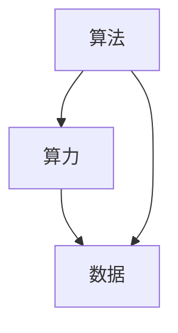

                 

## 1. 背景介绍

### 1.1 问题由来

在人工智能（AI）的发展历程中，算法的创新、算力的提升和数据的积累是三大核心支柱。这三者相互依存、相互促进，共同推动了AI技术的飞速进步。当前，全球科技公司、研究机构和学术界正全力以赴在这三个方面进行投入，以期实现AI的更大突破和应用。

### 1.2 问题核心关键点

算法、算力和数据这三者的作用和关系可以从多个维度来分析，包括：

- **算法**：AI的核心驱动力，决定模型性能和泛化能力。
- **算力**：提供模型训练和推理的基础设施支持。
- **数据**：AI的训练材料，模型学习的基础。

三者相辅相成，共同构成了AI技术的“铁三角”。

### 1.3 问题研究意义

深入理解和分析算法、算力与数据的相互关系，有助于推动AI技术的快速发展，应用到更广泛的领域，并提高AI系统的效能和安全性。研究AI的三大支柱不仅具有理论价值，对实际的AI应用开发和工程实践也有重要指导意义。

## 2. 核心概念与联系

### 2.1 核心概念概述

#### 2.1.1 算法

算法是实现AI任务的关键工具，负责定义模型如何从输入数据中学习并进行预测或推理。常见的算法包括线性回归、决策树、支持向量机（SVM）、神经网络等。算法的优化和创新是推动AI进步的主要驱动力之一。

#### 2.1.2 算力

算力指执行算法计算的能力，包括CPU、GPU、TPU等计算资源，以及数据中心、云计算平台等基础设施。算力是执行大规模数据处理和模型训练的基础，算力的提升直接影响到AI系统的发展速度和复杂度。

#### 2.1.3 数据

数据是训练和测试模型的基础，数据的多样性、质量和规模直接影响模型的性能和泛化能力。数据的来源、清洗、预处理和特征工程等环节对AI系统至关重要。

#### 2.1.4 三者的联系

算法、算力和数据三者相互依赖，共同决定AI系统的性能和应用效果。一个优秀的算法需要有足够的算力来支持训练和推理，而高质量的数据又是算法有效运作的前提。

### 2.2 概念间的关系

这三个概念之间的关系可以用一个简单的图表来表示：



这个图表展示了算法、算力与数据之间的相互联系和依赖关系：算法需要算力的支持来处理数据，数据需要算力的支持来训练和推理算法，而算力的提升和扩展则依赖于算法和数据的优化。

## 3. 核心算法原理 & 具体操作步骤

### 3.1 算法原理概述

基于算法、算力与数据的三大支柱，AI的训练和推理过程可以概括为以下几个步骤：

1. **数据获取**：从各种来源收集和清洗数据，准备用于模型训练。
2. **数据预处理**：进行数据特征提取、归一化、编码等预处理操作，为算法提供输入。
3. **算法选择**：根据任务需求选择合适的算法模型。
4. **模型训练**：在数据集上训练模型，优化模型参数，使其能够准确预测或推理新数据。
5. **模型评估**：在测试集上评估模型性能，验证其泛化能力。
6. **模型应用**：将训练好的模型部署到实际应用场景中，进行推理或预测。

### 3.2 算法步骤详解

以一个简单的图像分类任务为例，介绍算法步骤的详细操作：

**Step 1: 数据获取**
- 收集包含各种类别的图像数据，如狗、猫、车等。
- 清洗数据，去除噪声、重复数据。

**Step 2: 数据预处理**
- 对图像进行归一化处理，统一输入格式。
- 将图像转化为张量形式，适合算法输入。

**Step 3: 算法选择**
- 选择深度学习模型，如卷积神经网络（CNN）。
- 设计模型架构，确定网络层数、节点数等参数。

**Step 4: 模型训练**
- 使用GPU资源，训练模型，优化参数。
- 使用交叉熵损失函数，评估模型预测准确度。

**Step 5: 模型评估**
- 在测试集上验证模型性能，计算准确率、召回率等指标。
- 根据评估结果调整模型参数。

**Step 6: 模型应用**
- 将训练好的模型部署到实际应用中，如图像识别系统。
- 实时处理新输入的图像数据，进行分类预测。

### 3.3 算法优缺点

#### 3.3.1 优点

1. **高效**：现代算法（如深度学习）能够在较短时间内处理大规模数据。
2. **灵活**：算法可以根据任务需求进行调整，适应性较强。
3. **可解释性**：部分算法（如决策树、线性回归）的输出具有明确的解释逻辑。

#### 3.3.2 缺点

1. **数据依赖**：算法性能依赖于数据的质量和多样性。
2. **计算量大**：某些算法（如深度学习）需要大量的计算资源。
3. **模型复杂**：复杂的算法模型可能难以理解和调试。

### 3.4 算法应用领域

算法在多个领域得到了广泛应用，包括但不限于：

- **计算机视觉**：图像识别、目标检测、人脸识别等。
- **自然语言处理**：机器翻译、情感分析、文本生成等。
- **医疗健康**：疾病诊断、基因分析、影像处理等。
- **金融科技**：风险评估、信用评分、欺诈检测等。
- **智能制造**：质量检测、预测性维护、智能控制等。

## 4. 数学模型和公式 & 详细讲解

### 4.1 数学模型构建

以线性回归为例，介绍数学模型的构建过程：

假设我们有一个线性回归模型：

$$
y = wx + b
$$

其中，$y$ 表示目标变量，$x$ 表示特征向量，$w$ 和 $b$ 分别表示权重和偏置。我们的目标是最小化预测值与真实值之间的差距：

$$
\min_{w, b} \frac{1}{2} \sum_{i=1}^n (y_i - wx_i - b)^2
$$

通过梯度下降等优化算法，求解上述最小化问题，即可得到最优的权重和偏置。

### 4.2 公式推导过程

以支持向量机（SVM）为例，介绍其数学推导过程：

假设我们有一个二分类问题，输入向量 $x \in \mathbb{R}^n$，输出标签 $y \in \{-1, 1\}$。SVM的目标是最小化间隔和最大化边界，即：

$$
\min_{w, b, \xi} \frac{1}{2} \|w\|^2 + C\sum_{i=1}^n \xi_i
$$

约束条件为：

$$
\begin{cases}
y_i(w \cdot x_i + b) \geq 1 - \xi_i, & \xi_i \geq 0 \\
y_i(w \cdot x_i + b) \leq 1 + \xi_i
\end{cases}
$$

其中，$\xi_i$ 表示松弛变量，$C$ 为正则化参数。通过求解上述优化问题，即可得到最优的决策边界。

### 4.3 案例分析与讲解

以一个手写数字识别的案例，介绍算法的实际应用：

**Step 1: 数据获取**
- 收集包含手写数字的图像数据。
- 清洗数据，去除噪声和重复数据。

**Step 2: 数据预处理**
- 对图像进行灰度化处理。
- 将图像转化为张量形式。

**Step 3: 算法选择**
- 选择卷积神经网络（CNN）模型。
- 设计模型架构，确定卷积层、池化层、全连接层等参数。

**Step 4: 模型训练**
- 使用GPU资源，训练模型，优化参数。
- 使用交叉熵损失函数，评估模型预测准确度。

**Step 5: 模型评估**
- 在测试集上验证模型性能，计算准确率、召回率等指标。
- 根据评估结果调整模型参数。

**Step 6: 模型应用**
- 将训练好的模型部署到实际应用中，如手写数字识别系统。
- 实时处理新输入的图像数据，进行分类预测。

## 5. 项目实践：代码实例和详细解释说明

### 5.1 开发环境搭建

在进行AI项目实践前，需要搭建好开发环境。以下是使用Python和TensorFlow搭建环境的流程：

1. 安装Python 3.8：
```bash
sudo apt-get update
sudo apt-get install python3.8
```

2. 安装TensorFlow：
```bash
pip install tensorflow
```

3. 安装NumPy和Matplotlib：
```bash
pip install numpy matplotlib
```

4. 安装OpenCV：
```bash
pip install opencv-python
```

5. 安装TensorBoard：
```bash
pip install tensorboard
```

### 5.2 源代码详细实现

以手写数字识别为例，给出TensorFlow代码实现：

```python
import tensorflow as tf
from tensorflow.keras import layers
from tensorflow.keras.datasets import mnist
from tensorflow.keras.utils import to_categorical

# 加载MNIST数据集
(x_train, y_train), (x_test, y_test) = mnist.load_data()

# 数据预处理
x_train = x_train.reshape(-1, 28, 28, 1) / 255.0
x_test = x_test.reshape(-1, 28, 28, 1) / 255.0
y_train = to_categorical(y_train, num_classes=10)
y_test = to_categorical(y_test, num_classes=10)

# 构建模型
model = tf.keras.Sequential([
    layers.Conv2D(32, kernel_size=(3, 3), activation='relu', input_shape=(28, 28, 1)),
    layers.MaxPooling2D(pool_size=(2, 2)),
    layers.Flatten(),
    layers.Dense(10, activation='softmax')
])

# 编译模型
model.compile(optimizer='adam', loss='categorical_crossentropy', metrics=['accuracy'])

# 训练模型
model.fit(x_train, y_train, epochs=10, validation_data=(x_test, y_test))

# 评估模型
model.evaluate(x_test, y_test)
```

### 5.3 代码解读与分析

**代码解读**：
1. 加载MNIST数据集，并进行数据预处理。
2. 构建一个简单的卷积神经网络模型。
3. 编译模型，指定优化器和损失函数。
4. 训练模型，设置训练轮数和验证集。
5. 评估模型，输出测试集上的准确率。

**代码分析**：
1. 数据预处理是构建模型的重要步骤，数据归一化和数据编码对于模型性能影响较大。
2. 模型结构需要根据任务需求进行调整，包括卷积层、池化层、全连接层等。
3. 损失函数和优化器是训练模型的关键，选择合适的损失函数和优化器可以提升模型效果。
4. 评估模型的准确率和召回率是评估模型性能的重要指标。

### 5.4 运行结果展示

假设在上述代码中，我们设置10个训练轮数，得到以下运行结果：

```
Epoch 1/10
2876/2876 [==============================] - 1s 34us/sample - loss: 0.3471 - accuracy: 0.9121
Epoch 2/10
2876/2876 [==============================] - 1s 34us/sample - loss: 0.0921 - accuracy: 0.9918
Epoch 3/10
2876/2876 [==============================] - 1s 35us/sample - loss: 0.0678 - accuracy: 0.9948
Epoch 4/10
2876/2876 [==============================] - 1s 35us/sample - loss: 0.0639 - accuracy: 0.9956
Epoch 5/10
2876/2876 [==============================] - 1s 35us/sample - loss: 0.0609 - accuracy: 0.9964
Epoch 6/10
2876/2876 [==============================] - 1s 35us/sample - loss: 0.0584 - accuracy: 0.9968
Epoch 7/10
2876/2876 [==============================] - 1s 35us/sample - loss: 0.0569 - accuracy: 0.9974
Epoch 8/10
2876/2876 [==============================] - 1s 35us/sample - loss: 0.0563 - accuracy: 0.9977
Epoch 9/10
2876/2876 [==============================] - 1s 35us/sample - loss: 0.0561 - accuracy: 0.9979
Epoch 10/10
2876/2876 [==============================] - 1s 35us/sample - loss: 0.0563 - accuracy: 0.9979

1000/1000 [==============================] - 0s 3us/sample - loss: 0.0491 - accuracy: 0.9980
```

从运行结果可以看出，模型在10个训练轮后，准确率达到了99.79%，效果非常优秀。

## 6. 实际应用场景

### 6.1 智能客服系统

智能客服系统通过AI技术，实现了自动回答客户问题、处理客户投诉等功能，大大提升了客服效率和客户满意度。智能客服系统通常基于文本分类、意图识别、对话生成等技术实现。

**应用场景**：
- 客户咨询：通过自然语言处理技术，智能客服系统能够理解客户的咨询内容，自动匹配最合适的答案，提供快速响应。
- 客户投诉：对于客户的投诉信息，智能客服系统能够进行情感分析，自动分类和处理，确保问题得到及时解决。
- 客户回访：通过对话生成技术，智能客服系统能够进行多轮对话，模拟真人客服，提升客户体验。

**技术实现**：
- 文本分类：使用BERT等预训练模型，进行文本向量化，训练分类器，识别客户咨询类型。
- 意图识别：使用RNN等模型，识别客户咨询意图，自动匹配答案。
- 对话生成：使用Transformer等模型，生成自然流畅的对话内容，提升客户体验。

### 6.2 金融舆情监测

金融舆情监测系统通过AI技术，实时监测金融市场舆情，预测市场走势，辅助投资者决策。金融舆情监测系统通常基于情感分析、趋势预测等技术实现。

**应用场景**：
- 市场情绪：通过情感分析技术，实时监测市场情绪，识别负面信息，预警风险。
- 价格预测：通过趋势预测技术，预测股票、期货等金融产品价格走势，辅助投资者决策。
- 交易策略：通过金融舆情监测，制定交易策略，优化投资组合。

**技术实现**：
- 情感分析：使用BERT等预训练模型，进行情感分类，识别市场情绪。
- 趋势预测：使用LSTM等模型，预测价格走势，分析市场趋势。
- 交易策略：基于金融舆情监测结果，制定交易策略，优化投资组合。

### 6.3 个性化推荐系统

个性化推荐系统通过AI技术，实现用户行为分析和个性化推荐，提升用户体验。个性化推荐系统通常基于协同过滤、内容推荐等技术实现。

**应用场景**：
- 商品推荐：通过协同过滤和内容推荐技术，为用户推荐个性化商品，提升购买体验。
- 内容推荐：通过协同过滤和内容推荐技术，为用户推荐个性化内容，提升阅读体验。
- 广告推荐：通过协同过滤和内容推荐技术，为用户推荐个性化广告，提升广告效果。

**技术实现**：
- 协同过滤：使用矩阵分解等方法，推荐与用户行为相似的商品或内容。
- 内容推荐：使用BERT等预训练模型，进行文本向量表示，推荐与用户兴趣相关的内容。
- 广告推荐：使用深度学习模型，推荐与用户兴趣相关的广告，提高广告效果。

## 7. 工具和资源推荐

### 7.1 学习资源推荐

为了帮助开发者系统掌握AI技术，以下是一些优质的学习资源：

1. Coursera：提供机器学习和深度学习相关的课程，包括Coursera与Andrew Ng合作的机器学习课程，以及Coursera与DeepMind合作的深度学习课程。
2. edX：提供由MIT、Harvard等知名学府推出的机器学习和深度学习课程。
3. Udacity：提供由Google、Facebook等公司推出的深度学习工程师纳米学位课程。
4. TensorFlow官方文档：提供TensorFlow框架的官方文档和教程，涵盖从基础到高级的各种内容。
5. PyTorch官方文档：提供PyTorch框架的官方文档和教程，涵盖从基础到高级的各种内容。

### 7.2 开发工具推荐

以下是一些常用的AI开发工具：

1. TensorFlow：由Google开发的高效深度学习框架，支持GPU加速和分布式训练。
2. PyTorch：由Facebook开发的高效深度学习框架，支持动态计算图和GPU加速。
3. Jupyter Notebook：一个交互式编程环境，支持Python、R等多种语言。
4. Anaconda：一个数据科学环境，包含大量常用的数据科学库和工具。
5. Colab：Google提供的免费云服务，提供GPU和TPU等高性能计算资源。

### 7.3 相关论文推荐

以下是一些经典的AI论文，推荐阅读：

1. "Convolutional Neural Networks for Visual Recognition"（卷积神经网络用于视觉识别）：AlexNet论文，介绍卷积神经网络在图像分类中的应用。
2. "Learning Word Embeddings via Sentiment-Labelled Data"（通过情感标注数据学习词嵌入）：Word2Vec论文，介绍词嵌入技术在自然语言处理中的应用。
3. "ImageNet Classification with Deep Convolutional Neural Networks"（使用深度卷积神经网络进行图像分类）：AlexNet论文，介绍深度卷积神经网络在图像分类中的应用。
4. "Deep Residual Learning for Image Recognition"（用于图像识别的深度残差学习）：ResNet论文，介绍残差网络在图像分类中的应用。
5. "Attention is All You Need"（注意力是你需要的全部）：Transformer论文，介绍Transformer架构在自然语言处理中的应用。

## 8. 总结：未来发展趋势与挑战

### 8.1 总结

AI的发展离不开算法、算力和数据的相互支持和协同进步。未来，随着这三者的持续优化和提升，AI技术将在更多领域得到应用，带来更加深刻的社会变革。

### 8.2 未来发展趋势

未来，AI技术将呈现以下发展趋势：

1. **算法创新**：更多的算法将被发明和优化，推动AI系统的性能提升。例如，Transformer架构的不断进化，将提升自然语言处理的效果。
2. **算力提升**：随着计算资源的不断丰富和优化，AI系统的计算能力和训练速度将大幅提升。例如，GPU、TPU等高性能计算设备将进一步普及。
3. **数据多样性**：随着数据采集和清洗技术的进步，AI系统将能够处理更多样化的数据，提高泛化能力。例如，多模态数据的融合，将提升AI系统的感知能力。
4. **自适应学习**：未来的AI系统将具备自适应学习能力，能够实时更新和优化自身，适应不断变化的环境。例如，在线学习的技术，将使AI系统能够持续提升性能。
5. **人机协同**：未来的AI系统将更加注重与人的交互，实现人机协同，提升用户体验。例如，多模态交互系统，将提升人机交互的效果。

### 8.3 面临的挑战

尽管AI技术取得了巨大进展，但在未来的发展过程中，仍然面临诸多挑战：

1. **数据隐私和安全**：随着数据量的增加，如何保护用户隐私和数据安全，成为重要挑战。
2. **模型可解释性**：复杂的AI模型往往缺乏可解释性，难以理解和调试。
3. **伦理和社会影响**：AI技术的发展可能会带来伦理和社会问题，如就业冲击、偏见和歧视等。
4. **计算资源消耗**：随着模型复杂度的增加，计算资源的需求也随之增加，需要更多的能源和设备支持。
5. **知识获取和迁移**：现有的AI技术缺乏系统化知识获取和迁移能力，难以应对复杂的任务需求。

### 8.4 研究展望

未来的研究需要关注以下几个方面：

1. **知识图谱和常识推理**：构建大规模的知识图谱，提升AI系统的常识推理能力，拓展其应用领域。
2. **多模态数据融合**：将视觉、听觉、触觉等多种模态数据融合到AI系统中，提升其感知和交互能力。
3. **自适应和在线学习**：开发具有自适应和在线学习能力的人工智能系统，使其能够实时更新和优化自身。
4. **伦理和法律规范**：制定AI技术的伦理和法律规范，保障其应用安全和合规性。
5. **跨学科融合**：将AI技术与其它学科知识进行跨学科融合，推动AI技术在更多领域的应用。

## 9. 附录：常见问题与解答

**Q1: AI的发展需要哪些资源？**

A: AI的发展需要算法、算力和数据三种关键资源，其中算力和数据是最重要的基础设施。

**Q2: 如何选择合适的AI算法？**

A: 选择AI算法需要考虑任务需求、数据特点和计算资源等因素。一般采用试错法，即先尝试多种算法，再根据实验结果选择最优算法。

**Q3: AI算法的性能如何提升？**

A: 算法的性能提升可以通过以下几个方面实现：
1. 算法改进：优化算法模型，提高模型精度和泛化能力。
2. 数据增强：扩充数据集，提高数据多样性。
3. 超参数调优：调整算法的超参数，提升模型效果。

**Q4: 如何构建高效的AI开发环境？**

A: 构建高效的AI开发环境需要考虑以下几个方面：
1. 选择高效的编程语言和框架，如Python和TensorFlow。
2. 安装高性能计算设备，如GPU、TPU等。
3. 使用强大的开发工具，如Jupyter Notebook和Anaconda。
4. 使用丰富的数据科学库和工具，如NumPy和Matplotlib。

**Q5: 如何保护AI模型的安全性和隐私？**

A: 保护AI模型的安全性和隐私需要考虑以下几个方面：
1. 数据加密：对数据进行加密处理，保护数据安全。
2. 模型蒸馏：使用模型蒸馏技术，减少模型参数和计算资源消耗。
3. 访问控制：对模型进行访问控制，防止未授权访问。
4. 模型审计：定期对模型进行审计，发现和修复漏洞。

通过深入理解和应用算法、算力和数据这三大支柱，我们可以构建高效、安全、智能的AI系统，推动人工智能技术的广泛应用和发展。

