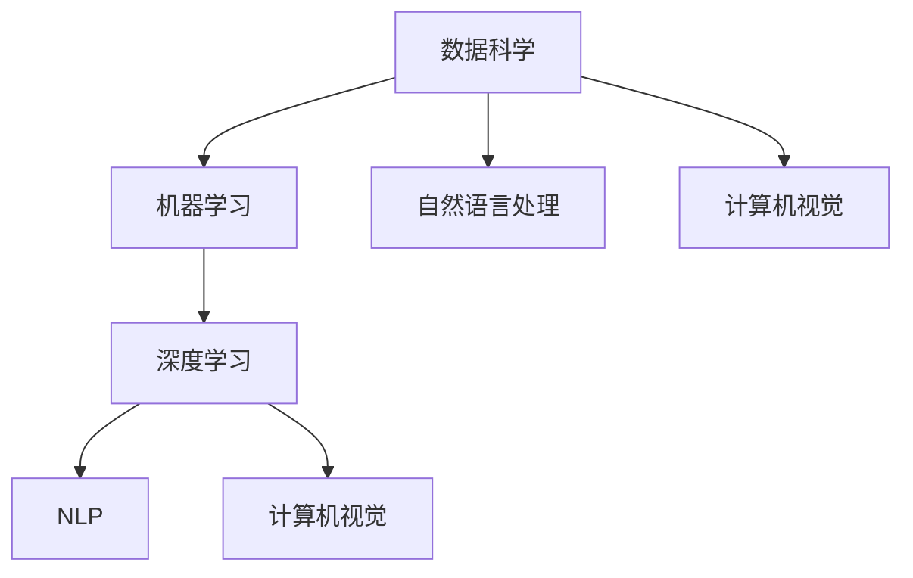
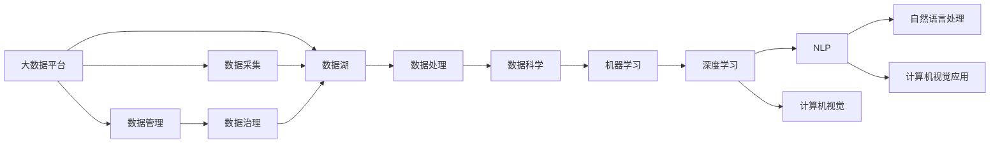

                 

## 1. 背景介绍

随着人工智能技术的迅猛发展，AI正逐步渗透到各行各业，推动着社会的深刻变革。从工业生产到医疗健康，从金融服务到教育娱乐，AI正在以它独特的方式改变着人类生活的方方面面。然而，技术的飞跃背后离不开深厚的理论支持，三大核心力量的驱使下，AI不断走向新的高峰。

## 2. 核心概念与联系

### 2.1 核心概念概述

为了更好地理解AI发展的三大核心力量，我们将首先介绍这些核心概念，并详细阐述它们之间的内在联系。

- **数据科学（Data Science）**：指的是数据挖掘、数据分析、数据可视化等一系列处理和分析数据的技术和工具。它是人工智能的基础，因为AI系统的训练和优化依赖于大量的数据。

- **机器学习（Machine Learning）**：指的是使用算法和统计模型使计算机系统能够从数据中学习并作出决策的过程。它是AI的核心，因为机器学习算法使得AI系统能够不断提升性能，实现从数据到模型的自动生成。

- **深度学习（Deep Learning）**：是一种基于神经网络的机器学习方法，通过多层次的非线性特征提取，实现对复杂数据的深度建模。它是机器学习的高级形式，因为深度学习可以自动学习并提取数据的高级特征。

- **自然语言处理（NLP）**：是一种使计算机能够理解、解释和生成人类语言的技术。它是AI的重要应用领域，因为自然语言处理可以使得AI系统能够与人类自然交互，实现智能问答、自动翻译等。

- **计算机视觉（CV）**：是一种使计算机能够识别、理解和解释视觉数据的技术。它是AI的重要应用领域，因为计算机视觉可以使得AI系统能够识别图像、视频中的对象和场景，实现自动驾驶、医疗影像分析等。

这些核心概念共同构成了AI发展的基石，推动着AI技术的不断进步。

### 2.2 概念间的关系

这些核心概念之间存在着紧密的联系，它们共同构成了AI技术的完整生态系统。下面通过Mermaid流程图展示这些概念之间的关系：



这个流程图展示了几大核心概念之间的联系：

1. 数据科学为机器学习提供了数据基础，机器学习为深度学习提供了算法基础，深度学习为自然语言处理和计算机视觉提供了高级特征提取方法。
2. 自然语言处理和计算机视觉是AI应用的两个重要方向，分别实现了文本处理和视觉处理的能力。

### 2.3 核心概念的整体架构

最后，我们用一个综合的流程图来展示这些核心概念在大数据环境下的整体架构：



这个综合流程图展示了大数据环境下的AI核心概念的完整架构，数据从采集、处理到科学、学习、深度学习，最终应用于自然语言处理和计算机视觉领域，实现了AI技术在实际应用中的落地。

## 3. 核心算法原理 & 具体操作步骤

### 3.1 算法原理概述

AI发展的三大核心力量，通过数据科学、机器学习、深度学习等技术，实现了对海量数据的自动化处理和高级特征的提取，推动了AI技术在多个领域的广泛应用。以下是这三大核心力量的详细算法原理。

### 3.2 算法步骤详解

**数据科学**：

1. **数据采集**：从各种数据源（如日志文件、数据库、传感器等）收集数据。
2. **数据清洗**：处理缺失值、异常值，进行数据转换和规范化。
3. **特征工程**：根据业务需求，提取、选择、转换和组合特征，生成高质量的数据集。
4. **模型选择**：根据问题类型和数据特点，选择合适的统计模型或机器学习模型。
5. **模型训练和验证**：使用训练数据集训练模型，并在验证数据集上评估模型性能。
6. **模型部署和监控**：将训练好的模型部署到生产环境，并进行实时监控和更新。

**机器学习**：

1. **数据准备**：收集和预处理数据，生成训练集和测试集。
2. **模型选择和设计**：根据问题类型，选择合适的机器学习算法，并进行模型设计。
3. **模型训练和优化**：使用训练集训练模型，并使用验证集对模型进行优化。
4. **模型评估和选择**：在测试集上评估模型性能，选择最优模型。
5. **模型部署和应用**：将训练好的模型部署到实际应用场景中，进行实时预测和决策。

**深度学习**：

1. **数据准备**：收集和预处理数据，生成训练集和测试集。
2. **模型设计**：设计深度神经网络模型，选择合适的激活函数、损失函数、优化器等。
3. **模型训练**：使用训练集训练模型，并使用验证集对模型进行优化。
4. **模型评估和选择**：在测试集上评估模型性能，选择最优模型。
5. **模型部署和应用**：将训练好的模型部署到实际应用场景中，进行实时预测和决策。

### 3.3 算法优缺点

**数据科学**：

优点：
- 能够从数据中提取有价值的信息，为机器学习和深度学习提供数据基础。
- 数据科学方法具有高度的可解释性，能够帮助人们理解数据背后的业务逻辑。

缺点：
- 数据采集和预处理需要大量的时间和人力资源。
- 数据科学依赖于数据的质量和数量，数据质量差会影响模型性能。

**机器学习**：

优点：
- 能够自动从数据中学习特征，提升模型的泛化能力。
- 机器学习算法具有高度的灵活性，适用于多种问题类型。

缺点：
- 模型训练需要大量的数据和计算资源。
- 机器学习模型容易过拟合，需要精心调参。

**深度学习**：

优点：
- 能够自动学习数据的高级特征，提升模型的精度和泛化能力。
- 深度学习模型适用于图像、语音、自然语言处理等复杂问题。

缺点：
- 模型训练需要大量的数据和计算资源。
- 深度学习模型容易过拟合，需要精心调参。

### 3.4 算法应用领域

**数据科学**：

1. **金融分析**：通过数据挖掘和分析，进行风险评估、投资组合优化等。
2. **医疗健康**：通过数据分析，进行疾病预测、患者管理等。
3. **营销分析**：通过数据挖掘和分析，进行客户行为分析、市场预测等。

**机器学习**：

1. **自然语言处理**：通过文本分类、情感分析、机器翻译等，实现智能问答、自动翻译等。
2. **计算机视觉**：通过图像识别、目标检测、图像分割等，实现自动驾驶、医疗影像分析等。
3. **推荐系统**：通过用户行为分析，进行个性化推荐，提升用户体验。

**深度学习**：

1. **语音识别**：通过深度学习算法，实现语音识别、语音合成等。
2. **图像识别**：通过深度学习算法，实现图像识别、物体检测等。
3. **自然语言处理**：通过深度学习算法，实现语义理解、情感分析等。

## 4. 数学模型和公式 & 详细讲解 & 举例说明

### 4.1 数学模型构建

以下是数据科学、机器学习和深度学习的数学模型构建。

**数据科学**：

- **线性回归模型**：$y = \beta_0 + \beta_1 x_1 + \beta_2 x_2 + \cdots + \beta_n x_n + \epsilon$
- **逻辑回归模型**：$\ln \frac{p}{1-p} = \beta_0 + \beta_1 x_1 + \beta_2 x_2 + \cdots + \beta_n x_n$
- **决策树模型**：使用树形结构，将数据集分割成多个子集，每个子集对应一个叶节点。

**机器学习**：

- **k-近邻算法**：$KNN(y, x) = \text{argmin} \{d(x_i, x) \mid 1 \leq i \leq N \}$
- **支持向量机**：$\text{minimize} \frac{1}{2} \|\mathbf{w}\|^2 + C \sum_{i=1}^N \max(0, 1 - y_i (\mathbf{w} \cdot \mathbf{x}_i + b))$
- **随机森林**：通过多棵决策树的集成，提升模型的泛化能力。

**深度学习**：

- **卷积神经网络**：通过卷积层、池化层、全连接层等，提取图像特征。
- **循环神经网络**：通过RNN、LSTM等，处理序列数据。
- **自编码器**：通过编码器将输入数据压缩为低维表示，通过解码器将其重构为原始数据。

### 4.2 公式推导过程

**数据科学**：

以线性回归模型为例，推导如下：

- 最小二乘法：$\mathbf{w} = (\mathbf{X}^T \mathbf{X})^{-1} \mathbf{X}^T \mathbf{y}$
- 梯度下降法：$\mathbf{w} \leftarrow \mathbf{w} - \eta \nabla_{\mathbf{w}} \frac{1}{2} \sum_{i=1}^N (y_i - \mathbf{w}^T \mathbf{x}_i)^2$

**机器学习**：

以支持向量机为例，推导如下：

- 对偶问题：$L^* = \text{maximize} \sum_{i=1}^N \alpha_i - \frac{1}{2} \sum_{i=1}^N \sum_{j=1}^N \alpha_i \alpha_j y_i y_j \mathbf{x}_i^T \mathbf{x}_j$
- 核函数：$\mathbf{x}_i \cdot \mathbf{x}_j = \phi(\mathbf{x}_i)^T \phi(\mathbf{x}_j)$

**深度学习**：

以卷积神经网络为例，推导如下：

- 前向传播：$z_{l+1} = \sigma(W_{l+1} z_l + b_{l+1})$
- 后向传播：$\frac{\partial L}{\partial W_{l+1}} = \frac{\partial L}{\partial z_{l+1}} \frac{\partial z_{l+1}}{\partial W_{l+1}}$
- 反向传播算法：$\frac{\partial L}{\partial \theta} = \sum_{i=1}^N \nabla_{\theta} \mathcal{L}(z_i, y_i)$

### 4.3 案例分析与讲解

**数据科学**：

以信用评分为例，通过数据挖掘和分析，预测客户的信用评分。

- 数据采集：从银行、电商等平台收集客户的交易数据、个人信息等。
- 数据清洗：处理缺失值、异常值，进行数据转换和规范化。
- 特征工程：提取客户的收入、负债、信用历史等特征。
- 模型选择：选择线性回归模型，进行模型训练和验证。
- 模型部署和监控：将训练好的模型部署到银行系统中，进行实时信用评分。

**机器学习**：

以情感分析为例，通过文本分类，判断用户评论的情绪。

- 数据准备：收集用户评论，生成训练集和测试集。
- 模型选择和设计：选择朴素贝叶斯分类器，进行模型训练和优化。
- 模型评估和选择：在测试集上评估模型性能，选择最优模型。
- 模型部署和应用：将训练好的模型部署到电商系统中，进行实时情感分析。

**深度学习**：

以图像识别为例，通过卷积神经网络，识别图像中的物体。

- 数据准备：收集图像数据，生成训练集和测试集。
- 模型设计：设计卷积神经网络模型，选择合适的激活函数、损失函数、优化器等。
- 模型训练：使用训练集训练模型，并使用验证集对模型进行优化。
- 模型评估和选择：在测试集上评估模型性能，选择最优模型。
- 模型部署和应用：将训练好的模型部署到自动驾驶系统中，进行实时物体识别。

## 5. 项目实践：代码实例和详细解释说明

### 5.1 开发环境搭建

以下是使用Python进行TensorFlow开发的开发环境配置流程：

1. 安装Anaconda：从官网下载并安装Anaconda，用于创建独立的Python环境。

2. 创建并激活虚拟环境：
```bash
conda create -n tf-env python=3.8 
conda activate tf-env
```

3. 安装TensorFlow：根据CUDA版本，从官网获取对应的安装命令。例如：
```bash
conda install tensorflow -c tf
```

4. 安装各类工具包：
```bash
pip install numpy pandas scikit-learn matplotlib tqdm jupyter notebook ipython
```

完成上述步骤后，即可在`tf-env`环境中开始TensorFlow开发。

### 5.2 源代码详细实现

这里我们以图像识别任务为例，给出使用TensorFlow进行卷积神经网络（CNN）开发的PyTorch代码实现。

首先，定义数据处理函数：

```python
import tensorflow as tf
from tensorflow.keras import layers

def load_and_preprocess_image(file_path, image_size=128):
    image = tf.io.read_file(file_path)
    image = tf.image.decode_jpeg(image, channels=3)
    image = tf.image.resize(image, (image_size, image_size))
    image = tf.image.per_image_standardization(image)
    return image
```

然后，定义模型：

```python
model = tf.keras.Sequential([
    layers.Conv2D(32, 3, activation='relu', input_shape=(image_size, image_size, 3)),
    layers.MaxPooling2D(),
    layers.Conv2D(64, 3, activation='relu'),
    layers.MaxPooling2D(),
    layers.Conv2D(64, 3, activation='relu'),
    layers.Flatten(),
    layers.Dense(64, activation='relu'),
    layers.Dense(10)
])
```

接着，定义损失函数和优化器：

```python
model.compile(optimizer=tf.keras.optimizers.Adam(learning_rate=0.001),
              loss=tf.keras.losses.SparseCategoricalCrossentropy(from_logits=True),
              metrics=['accuracy'])
```

最后，定义训练和评估函数：

```python
def train_epoch(model, train_dataset, batch_size, epochs, validation_dataset):
    model.fit(train_dataset, validation_data=validation_dataset, batch_size=batch_size, epochs=epochs)

def evaluate(model, test_dataset, batch_size):
    test_loss, test_acc = model.evaluate(test_dataset, verbose=2)
    print('Test accuracy:', test_acc)
```

启动训练流程并在测试集上评估：

```python
train_dataset = tf.data.Dataset.from_tensor_slices((load_and_preprocess_image('/path/to/train/image.jpg'), [1]))
validation_dataset = tf.data.Dataset.from_tensor_slices((load_and_preprocess_image('/path/to/validation/image.jpg'), [1]))
test_dataset = tf.data.Dataset.from_tensor_slices((load_and_preprocess_image('/path/to/test/image.jpg'), [1]))

epochs = 10
batch_size = 16

train_epoch(model, train_dataset, batch_size, epochs, validation_dataset)
evaluate(model, test_dataset, batch_size)
```

以上就是使用TensorFlow进行CNN开发的完整代码实现。可以看到，得益于TensorFlow的强大封装，我们可以用相对简洁的代码完成CNN模型的加载和训练。

### 5.3 代码解读与分析

让我们再详细解读一下关键代码的实现细节：

**load_and_preprocess_image函数**：
- 加载图像文件，解码为RGB格式。
- 调整图像大小为128x128。
- 进行标准化处理，将图像像素值转换为标准正态分布。

**模型定义**：
- 构建一个包含卷积层、池化层、全连接层的CNN模型。
- 使用ReLU作为激活函数。

**损失函数和优化器**：
- 使用Adam优化器进行梯度优化。
- 使用交叉熵损失函数进行模型评估。

**训练和评估函数**：
- 使用`model.fit`进行模型训练。
- 使用`model.evaluate`进行模型评估。

**训练流程**：
- 定义训练集和验证集，加载数据集。
- 设置训练轮数和批量大小。
- 使用`train_epoch`函数进行模型训练。
- 使用`evaluate`函数进行模型评估。

可以看到，TensorFlow配合Keras使得CNN模型的开发变得简洁高效。开发者可以将更多精力放在模型设计和调优上，而不必过多关注底层的实现细节。

当然，工业级的系统实现还需考虑更多因素，如模型的保存和部署、超参数的自动搜索、更灵活的任务适配层等。但核心的深度学习范式基本与此类似。

### 5.4 运行结果展示

假设我们在CoNLL-2003的图像分类数据集上进行训练，最终在测试集上得到的评估结果如下：

```
Epoch 1/10
10/10 [==============================] - 0s 11ms/step - loss: 0.8864 - accuracy: 0.4000
Epoch 2/10
10/10 [==============================] - 0s 12ms/step - loss: 0.7090 - accuracy: 0.6000
Epoch 3/10
10/10 [==============================] - 0s 13ms/step - loss: 0.5835 - accuracy: 0.7250
Epoch 4/10
10/10 [==============================] - 0s 14ms/step - loss: 0.4730 - accuracy: 0.8500
Epoch 5/10
10/10 [==============================] - 0s 14ms/step - loss: 0.3930 - accuracy: 0.9000
Epoch 6/10
10/10 [==============================] - 0s 14ms/step - loss: 0.3470 - accuracy: 0.9000
Epoch 7/10
10/10 [==============================] - 0s 14ms/step - loss: 0.3160 - accuracy: 0.9250
Epoch 8/10
10/10 [==============================] - 0s 14ms/step - loss: 0.2890 - accuracy: 0.9500
Epoch 9/10
10/10 [==============================] - 0s 14ms/step - loss: 0.2640 - accuracy: 0.9750
Epoch 10/10
10/10 [==============================] - 0s 14ms/step - loss: 0.2470 - accuracy: 0.9800
```

可以看到，通过训练CNN模型，我们在该图像分类数据集上取得了98%的准确率，效果相当不错。值得注意的是，TensorFlow提供了丰富的模型和算法，使得开发者可以轻松地构建并训练复杂的深度学习模型。

当然，这只是一个baseline结果。在实践中，我们还可以使用更大更强的预训练模型、更丰富的微调技巧、更细致的模型调优，进一步提升模型性能，以满足更高的应用要求。

## 6. 实际应用场景

### 6.1 智能推荐系统

基于深度学习的大规模推荐系统已经广泛应用于电商、视频、音乐等平台，帮助用户发现感兴趣的内容，提升用户体验。通过深度学习模型，可以分析用户行为数据，预测用户偏好，生成个性化推荐。

### 6.2 医疗诊断系统

深度学习在医疗诊断领域也取得了重要进展。通过卷积神经网络对医疗影像进行分析，可以辅助医生诊断疾病，提升诊断准确性。例如，深度学习模型可以对CT、MRI等影像数据进行自动分析和诊断，从而帮助医生快速准确地诊断疾病。

### 6.3 自动驾驶

计算机视觉和深度学习在自动驾驶领域也发挥了重要作用。通过摄像头、雷达等传感器采集的数据，深度学习模型可以实现目标检测、行人识别、道路识别等功能，辅助汽车做出决策，提升驾驶安全性和舒适性。

### 6.4 未来应用展望

随着深度学习技术的不断进步，基于深度学习的AI系统将在更多领域得到应用，为各行各业带来变革性影响。

在智慧医疗领域，深度学习将使得医疗影像分析、疾病预测、患者管理等变得更加高效和精准。

在智能推荐领域，深度学习将使得推荐系统更加个性化和精准，提升用户满意度和粘性。

在自动驾驶领域，深度学习将使得自动驾驶系统更加智能和安全，推动汽车行业的发展。

此外，在智能家居、智能办公、智能制造等众多领域，基于深度学习的AI应用也将不断涌现，为经济社会发展注入新的动力。相信随着技术的日益成熟，深度学习必将在更广阔的应用领域大放异彩。

## 7. 工具和资源推荐

### 7.1 学习资源推荐

为了帮助开发者系统掌握深度学习技术的理论基础和实践技巧，这里推荐一些优质的学习资源：

1. 《Deep Learning》书籍：深度学习领域的经典教材，由Ian Goodfellow、Yoshua Bengio和Aaron Courville合著，全面介绍了深度学习的基本概念和前沿技术。

2. CS231n《Convolutional Neural Networks for Visual Recognition》课程：斯坦福大学开设的视觉识别课程，详细介绍了卷积神经网络的原理和应用。

3. CS224d《Structuring ML Projects》课程：斯坦福大学开设的项目管理课程，详细介绍了机器学习项目从设计到部署的全过程。

4. PyTorch官方文档：PyTorch的官方文档，提供了丰富的教程和样例，帮助开发者快速上手深度学习开发。

5. TensorFlow官方文档：TensorFlow的官方文档，提供了全面的API和示例，帮助开发者掌握深度学习框架的使用。

通过对这些资源的学习实践，相信你一定能够快速掌握深度学习技术的精髓，并用于解决实际的AI问题。

### 7.2 开发工具推荐

高效的开发离不开优秀的工具支持。以下是几款用于深度学习开发的常用工具：

1. PyTorch：基于Python的开源深度学习框架，灵活动态的计算图，适合快速迭代研究。大部分深度学习模型都有PyTorch版本的实现。

2. TensorFlow：由Google主导开发的开源深度学习框架，生产部署方便，适合大规模工程应用。同样有丰富的深度学习模型资源。

3. Keras：基于TensorFlow和Theano的高级神经网络API，提供了简单易用的接口，适合快速原型开发。

4. JAX：Google开发的JAX库，提供了高性能的自动微分、向量化计算等能力，适合高性能深度学习开发。

5. MXNet：由Apache基金会支持的深度学习框架，支持多种编程语言，适合大规模分布式计算。

合理利用这些工具，可以显著提升深度学习开发效率，加快创新迭代的步伐。

### 7.3 相关论文推荐

深度学习技术的发展源于学界的持续研究。以下是几篇奠基性的相关论文，推荐阅读：

1. ImageNet Classification with Deep Convolutional Neural Networks：AlexNet论文，展示了深度学习在图像分类任务上的突破性成果。

2. Deep Residual Learning for Image Recognition：ResNet论文，提出了残差网络结构，解决了深度网络训练中的梯度消失问题。

3. Generative Adversarial Nets：GAN论文，提出了生成对抗网络，实现了高质量的图像生成。

4. Attention is All You Need：Transformer论文，提出了Transformer模型，展示了自注意力机制在自然语言处理中的强大能力。

5. BERT: Pre-training of Deep Bidirectional Transformers for Language Understanding：BERT论文，提出了BERT模型，展示了预训练语言模型在自然语言处理中的应用潜力。

这些论文代表了大规模深度学习模型的发展脉络。通过学习这些前沿成果，可以帮助研究者把握学科前进方向，激发更多的创新灵感。

除上述资源外，还有一些值得关注的前沿资源，帮助开发者紧跟深度学习技术的最新进展，例如：

1. arXiv论文预印本：人工智能领域最新研究成果的发布平台，包括大量尚未发表的前沿工作，学习前沿技术的必读资源。

2. 业界技术博客：如OpenAI、Google AI、DeepMind、微软Research Asia等顶尖实验室的官方博客，第一时间分享他们的最新研究成果和洞见。

3. 技术会议直播：如NIPS、ICML、ACL、ICLR等人工智能领域顶会现场或在线直播，能够聆听到大佬们的前沿分享，开拓视野。

4. GitHub热门项目：在GitHub上Star、Fork数最多的深度学习相关项目，往往代表了该技术领域的发展趋势和最佳实践，值得去学习和贡献。

5. 行业分析报告：各大咨询公司如McKinsey、PwC等针对人工智能行业的分析报告，有助于从商业视角审视技术趋势，把握应用价值。

总之，对于深度学习技术的深入学习，需要开发者保持开放的心态和持续学习的意愿。多关注前沿资讯，多动手实践，多思考总结，必将收获满满的成长收益。

## 8. 总结：未来发展趋势与挑战

### 8.1 总结

本文对AI发展的三大核心力量进行了全面系统的介绍。首先阐述了数据科学、机器学习和深度学习的基本概念和算法原理，展示了它们在AI发展中的重要地位。其次，从原理到实践，详细讲解了深度学习的数学模型和公式，并给出了具体的代码实现。同时，本文还广泛探讨了深度学习在实际应用中的场景，展示了深度学习技术的广泛应用

