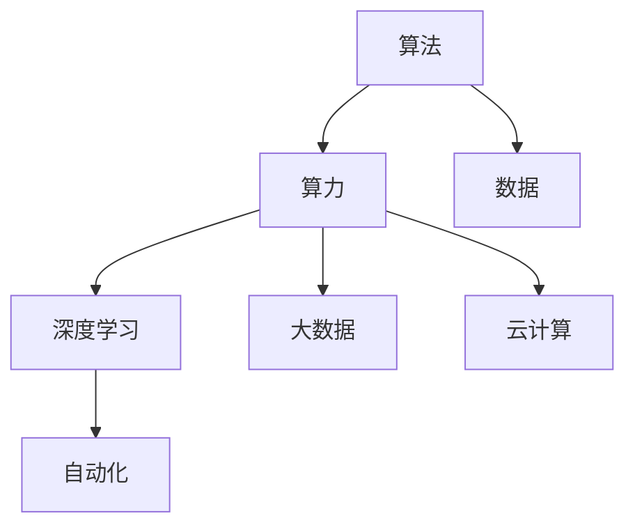
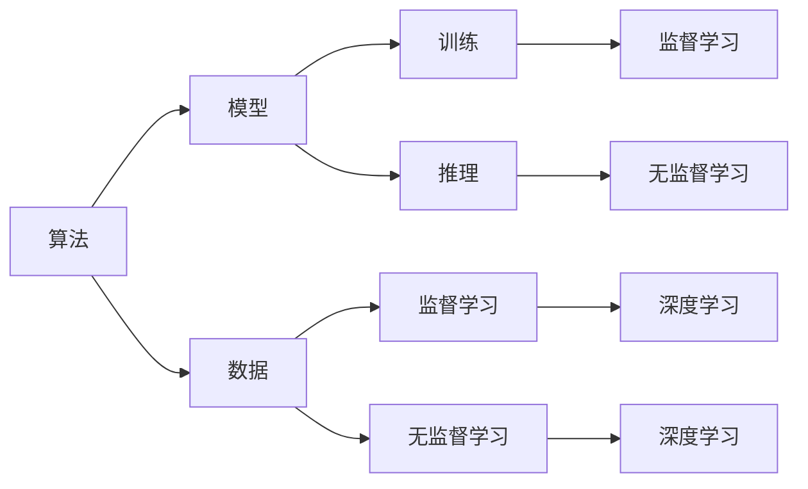
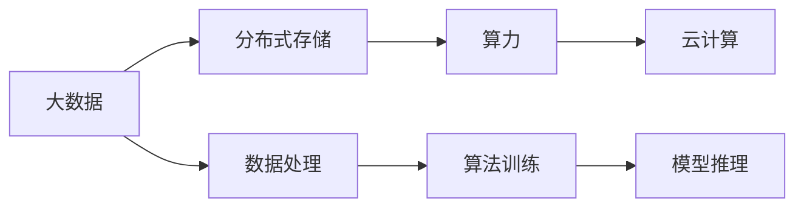
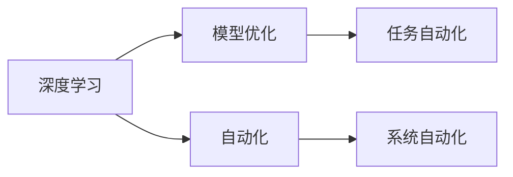
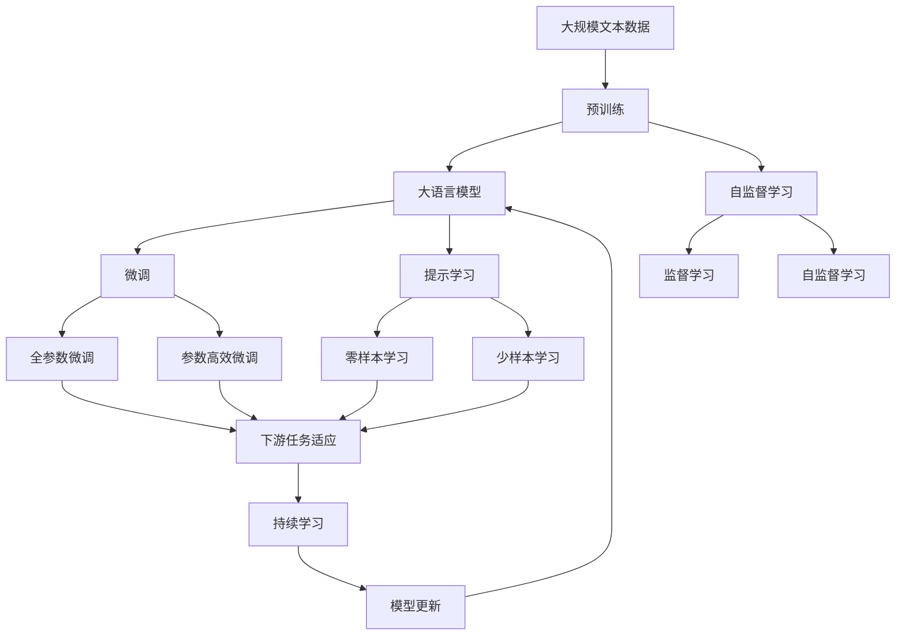

                 

# AI发展的驱动力：算法、算力与数据

> 关键词：人工智能,算法,算力,数据,深度学习,大数据,云计算,自动化

## 1. 背景介绍

### 1.1 问题由来

随着科技的不断进步，人工智能（AI）已经成为现代技术发展的重要引擎，其广泛的应用范围和显著的成效推动了社会生产力的提升和经济结构的转型。然而，尽管AI技术已经取得了众多突破，但如何从根本上驱动AI的发展，仍然是一个需要深入探讨的问题。算法、算力与数据是AI发展的三大基石，本文将围绕这三者之间的关系进行深入探讨。

### 1.2 问题核心关键点

AI发展的驱动力主要来自于以下三个核心要素：

1. **算法**：算法的创新和改进是AI技术进步的关键。算法决定了AI系统如何理解、处理和生成信息，直接影响到系统的性能和效果。

2. **算力**：算力即计算机的计算能力，包括处理器速度、内存大小、存储容量等。算力是算法执行的基础，决定了AI系统能否高效地运行和扩展。

3. **数据**：数据是AI系统的“食物”，高质量的数据有助于算法模型更好地学习和预测。数据的质量和多样性直接影响到AI系统的准确性和泛化能力。

本文将重点讨论这三大要素如何相互影响，共同推动AI的发展，并对未来AI技术的趋势进行展望。

### 1.3 问题研究意义

理解算法、算力和数据在AI发展中的作用，有助于我们更全面地认识AI技术的本质和潜力。通过对这些关键要素的深入分析，可以为AI技术的持续创新和广泛应用提供理论支持和实践指导。

## 2. 核心概念与联系

### 2.1 核心概念概述

为更好地理解算法、算力和数据在AI发展中的作用，本节将介绍几个密切相关的核心概念：

- **算法（Algorithm）**：指用于解决特定问题的一系列规则、步骤和计算方法。在AI中，算法是实现机器学习、深度学习等技术的基础。

- **算力（Computational Power）**：指计算机进行计算的能力，包括处理器速度、内存大小、存储容量等。算力是算法执行的硬件基础，决定了AI系统的运行效率和扩展性。

- **数据（Data）**：指用于训练和测试AI模型的大量样本和信息。数据的多样性和质量直接影响模型的准确性和泛化能力。

- **深度学习（Deep Learning）**：一种基于神经网络的机器学习技术，通过多层次的抽象和表示学习，可以处理复杂的数据结构。深度学习是目前AI领域的主流技术之一。

- **大数据（Big Data）**：指规模庞大、复杂多样、高速变化的数据集。大数据为AI模型提供了丰富的训练资源，有助于提升模型的性能和效果。

- **云计算（Cloud Computing）**：一种基于网络的技术，通过分布式计算和资源共享，实现了计算资源的灵活部署和高效利用。云计算为AI模型的训练和推理提供了强大的支持。

- **自动化（Automation）**：指通过算法和程序实现的任务自动化。自动化是AI技术的重要应用方向，可以大幅提升工作效率和准确性。

这些核心概念之间的逻辑关系可以通过以下Mermaid流程图来展示：



这个流程图展示了大语言模型微调过程中各个核心概念之间的关系：

1. 算法和算力决定了深度学习模型的训练和推理能力。
2. 数据是深度学习模型的输入，影响模型的训练效果和泛化能力。
3. 云计算为算力和数据的分布式存储和计算提供了支持。
4. 自动化利用算法和计算资源，实现了各种任务的处理和优化。

### 2.2 概念间的关系

这些核心概念之间存在着紧密的联系，形成了AI技术的完整生态系统。下面我们通过几个Mermaid流程图来展示这些概念之间的关系。

#### 2.2.1 AI技术的学习范式



这个流程图展示了AI技术的基本学习范式：

1. 算法和数据决定了模型的结构和训练方式。
2. 模型通过训练和推理，实现对数据的理解和生成。
3. 深度学习是当前AI技术的主流方法。
4. 监督学习和无监督学习是深度学习的主要训练方式。

#### 2.2.2 数据与算力的关系



这个流程图展示了大数据与算力的关系：

1. 大数据需要分布式存储和计算来处理和分析。
2. 算力为大数据的处理和分析提供了计算资源。
3. 云计算为大数据和算力的高效利用提供了支持。
4. 算法训练和模型推理需要大量数据和算力支持。

#### 2.2.3 深度学习与自动化的关系



这个流程图展示了深度学习与自动化的关系：

1. 深度学习模型需要进行优化和训练，以提升性能。
2. 自动化技术可以自动化地进行模型训练和优化。
3. 自动化技术可以应用于各种任务和系统的自动化处理。

### 2.3 核心概念的整体架构

最后，我们用一个综合的流程图来展示这些核心概念在大语言模型微调过程中的整体架构：



这个综合流程图展示了从预训练到微调，再到持续学习的完整过程：

1. 大语言模型通过大规模文本数据进行预训练，学习通用的语言表示。
2. 微调利用下游任务的少量标注数据，对预训练模型进行优化，提升在特定任务上的性能。
3. 提示学习通过精心的输入格式设计，引导模型进行零样本或少样本学习。
4. 自监督学习通过无监督方式预训练模型，提升模型的泛化能力。
5. 监督学习通过标注数据训练模型，提升模型的准确性。
6. 全参数微调和参数高效微调在微调过程中只更新少量模型参数。
7. 零样本学习和少样本学习在少标注数据的情况下，仍能实现模型学习。
8. 持续学习使模型能够不断更新和适应新数据，保持性能。
9. 模型更新后，重新部署到大语言模型中，参与新的微调过程。

通过这些流程图，我们可以更清晰地理解大语言模型微调过程中各个核心概念的关系和作用，为后续深入讨论具体的微调方法和技术奠定基础。

## 3. 核心算法原理 & 具体操作步骤

### 3.1 算法原理概述

AI技术的发展离不开算法、算力和数据的相互作用。算法是AI技术的核心，算力是算法的执行环境，数据是算法的训练材料。三者之间的相互作用，推动了AI技术的不断进步。

**算法（Algorithm）**：
算法是实现AI技术的关键，包括但不限于：
- 监督学习（Supervised Learning）：通过标注数据训练模型，使其能够对新数据进行预测和分类。
- 无监督学习（Unsupervised Learning）：从未标注数据中学习数据的结构和特征。
- 强化学习（Reinforcement Learning）：通过与环境的交互，优化模型行为以获得最优结果。
- 生成对抗网络（Generative Adversarial Network, GAN）：通过两个神经网络的对抗训练，生成逼真的样本数据。
- 迁移学习（Transfer Learning）：通过在相关领域数据上预训练模型，提升在新领域上的性能。

**算力（Computational Power）**：
算力是算法执行的基础，包括但不限于：
- 处理器速度：决定算法的执行效率。
- 内存大小：影响算法的内存使用和数据处理能力。
- 存储容量：存储算法的中间结果和数据集。
- 分布式计算：通过多台计算机协同计算，提升算法的处理能力。
- 云计算：通过大规模的计算资源，支持算法的训练和推理。

**数据（Data）**：
数据是算法的训练材料，包括但不限于：
- 标注数据：用于监督学习，包含输入和输出。
- 无标注数据：用于无监督学习，包含输入数据。
- 多样性数据：用于提升模型的泛化能力。
- 大规模数据：用于深度学习和分布式训练。
- 分布式数据：用于分布式存储和计算。

### 3.2 算法步骤详解

AI技术的发展离不开算法的创新和改进，以下是几种常见算法的详细步骤：

#### 3.2.1 监督学习算法步骤

监督学习算法主要包括以下几个步骤：
1. **数据准备**：收集和预处理标注数据，包括清洗、归一化、划分训练集、验证集和测试集。
2. **模型选择**：选择适合任务的机器学习模型，如线性回归、决策树、随机森林、神经网络等。
3. **模型训练**：使用训练集对模型进行训练，通过反向传播算法计算损失函数，更新模型参数。
4. **模型评估**：在验证集上评估模型性能，选择最优模型。
5. **模型测试**：在测试集上评估模型性能，进行预测和分类。
6. **模型部署**：将模型部署到实际应用中，进行推理和预测。

#### 3.2.2 无监督学习算法步骤

无监督学习算法主要包括以下几个步骤：
1. **数据准备**：收集未标注数据，进行预处理和归一化。
2. **特征提取**：通过算法提取数据的特征，如PCA、SVD等。
3. **模型训练**：使用特征数据训练模型，如K-Means、聚类算法等。
4. **模型评估**：通过评估指标（如轮廓系数）评估模型性能。
5. **模型应用**：将模型应用于数据分类、聚类、降维等任务。

#### 3.2.3 深度学习算法步骤

深度学习算法主要包括以下几个步骤：
1. **数据准备**：收集和预处理数据，包括数据清洗、归一化、划分训练集、验证集和测试集。
2. **模型构建**：构建深度神经网络模型，定义网络结构、损失函数和优化器。
3. **模型训练**：使用训练集对模型进行训练，通过反向传播算法计算损失函数，更新模型参数。
4. **模型评估**：在验证集上评估模型性能，选择最优模型。
5. **模型测试**：在测试集上评估模型性能，进行预测和分类。
6. **模型部署**：将模型部署到实际应用中，进行推理和预测。

### 3.3 算法优缺点

不同算法的优缺点如下：

#### 3.3.1 监督学习算法

**优点**：
- 性能稳定，适用于标注数据较多的场景。
- 可解释性强，易于理解和调试。

**缺点**：
- 依赖标注数据，标注成本较高。
- 模型泛化能力受数据质量影响较大。

#### 3.3.2 无监督学习算法

**优点**：
- 不需要标注数据，获取成本较低。
- 适用于大规模数据集，可提取数据结构特征。

**缺点**：
- 模型解释性较弱，难以理解和调试。
- 性能受数据质量和特征提取方法影响较大。

#### 3.3.3 深度学习算法

**优点**：
- 适用于复杂数据结构，可提取高层次特征。
- 模型性能优越，泛化能力较强。

**缺点**：
- 模型复杂度高，训练和推理速度较慢。
- 需要大量标注数据和计算资源。

### 3.4 算法应用领域

不同算法在不同领域的应用如下：

#### 3.4.1 监督学习算法

- **图像识别**：使用图像分类算法，如卷积神经网络（CNN），进行图像识别和分类。
- **自然语言处理（NLP）**：使用文本分类算法，如循环神经网络（RNN）、长短时记忆网络（LSTM），进行文本分类和情感分析。
- **推荐系统**：使用协同过滤算法，如矩阵分解算法（SVD），进行用户和物品推荐。

#### 3.4.2 无监督学习算法

- **聚类分析**：使用K-Means算法，对用户行为数据进行聚类分析。
- **数据降维**：使用PCA算法，对高维数据进行降维处理。
- **异常检测**：使用孤立森林算法，检测异常数据点。

#### 3.4.3 深度学习算法

- **计算机视觉**：使用卷积神经网络（CNN），进行图像识别、目标检测等任务。
- **自然语言处理（NLP）**：使用循环神经网络（RNN）、Transformer模型，进行文本生成、翻译、对话生成等任务。
- **语音识别**：使用深度神经网络（DNN），进行语音识别和转换。

## 4. 数学模型和公式 & 详细讲解 & 举例说明

### 4.1 数学模型构建

AI技术的数学模型通常基于统计学、概率论和优化理论。以下是几种常见算法的数学模型构建：

#### 4.1.1 监督学习数学模型

监督学习的数学模型如下：
$$
\min_{\theta} \frac{1}{N} \sum_{i=1}^N l(y_i, h_\theta(x_i))
$$
其中，$y$ 为标注数据，$h_\theta(x)$ 为模型输出，$\theta$ 为模型参数。

#### 4.1.2 无监督学习数学模型

无监督学习的数学模型如下：
$$
\min_{\theta} \frac{1}{N} \sum_{i=1}^N l(h_\theta(x_i))
$$
其中，$h_\theta(x)$ 为模型输出，$\theta$ 为模型参数。

#### 4.1.3 深度学习数学模型

深度学习的数学模型如下：
$$
\min_{\theta} \frac{1}{N} \sum_{i=1}^N l(h_\theta(x_i), y_i)
$$
其中，$h_\theta(x)$ 为模型输出，$y$ 为标注数据，$\theta$ 为模型参数。

### 4.2 公式推导过程

#### 4.2.1 监督学习公式推导

监督学习公式推导如下：
$$
\frac{\partial l(y_i, h_\theta(x_i))}{\partial \theta} = -(y_i - h_\theta(x_i)) \frac{\partial h_\theta(x_i)}{\partial \theta}
$$
其中，$l(y_i, h_\theta(x_i))$ 为损失函数，$h_\theta(x_i)$ 为模型输出。

#### 4.2.2 无监督学习公式推导

无监督学习公式推导如下：
$$
\frac{\partial l(h_\theta(x_i))}{\partial \theta} = \frac{\partial h_\theta(x_i)}{\partial \theta}
$$
其中，$l(h_\theta(x_i))$ 为损失函数，$h_\theta(x_i)$ 为模型输出。

#### 4.2.3 深度学习公式推导

深度学习公式推导如下：
$$
\frac{\partial l(h_\theta(x_i), y_i)}{\partial \theta} = \frac{\partial h_\theta(x_i)}{\partial \theta} \frac{\partial l(h_\theta(x_i), y_i)}{\partial h_\theta(x_i)}
$$
其中，$l(h_\theta(x_i), y_i)$ 为损失函数，$h_\theta(x_i)$ 为模型输出。

### 4.3 案例分析与讲解

#### 4.3.1 监督学习案例

以文本分类为例，使用朴素贝叶斯算法进行模型训练和预测。算法步骤如下：
1. 收集和预处理文本数据，进行分词和去除停用词。
2. 提取文本的特征，如词频和TF-IDF。
3. 构建朴素贝叶斯模型，进行训练和预测。
4. 在验证集上评估模型性能，选择最优模型。
5. 在测试集上评估模型性能，进行分类预测。

#### 4.3.2 无监督学习案例

以K-Means聚类为例，对用户行为数据进行聚类分析。算法步骤如下：
1. 收集和预处理用户行为数据，进行数据清洗和归一化。
2. 选择K值，进行K-Means聚类。
3. 在聚类结果上进行评估，选择最优聚类数目。
4. 对聚类结果进行分析，进行用户行为分类和预测。

#### 4.3.3 深度学习案例

以卷积神经网络（CNN）为例，进行图像识别和分类。算法步骤如下：
1. 收集和预处理图像数据，进行图像归一化和标准化。
2. 构建卷积神经网络模型，进行卷积、池化和全连接层的设计。
3. 使用反向传播算法进行模型训练，更新模型参数。
4. 在验证集上评估模型性能，选择最优模型。
5. 在测试集上评估模型性能，进行分类预测。

## 5. 项目实践：代码实例和详细解释说明

### 5.1 开发环境搭建

在进行AI技术开发前，我们需要准备好开发环境。以下是使用Python进行TensorFlow开发的环境配置流程：

1. 安装Anaconda：从官网下载并安装Anaconda，用于创建独立的Python环境。

2. 创建并激活虚拟环境：
```bash
conda create -n tensorflow-env python=3.7 
conda activate tensorflow-env
```

3. 安装TensorFlow：根据CUDA版本，从官网获取对应的安装命令。例如：
```bash
conda install tensorflow -c pytorch -c conda-forge
```

4. 安装各类工具包：
```bash
pip install numpy pandas scikit-learn matplotlib tqdm jupyter notebook ipython
```

完成上述步骤后，即可在`tensorflow-env`环境中开始AI技术开发。

### 5.2 源代码详细实现

这里我们以图像分类为例，使用TensorFlow进行深度学习模型的训练和推理。

首先，定义图像分类模型的数据处理函数：

```python
import tensorflow as tf
from tensorflow.keras.preprocessing.image import ImageDataGenerator

class ImageDataGenerator(tf.keras.preprocessing.image.ImageDataGenerator):
    def __init__(self, batch_size, image_height, image_width, color_mode):
        super().__init__(batch_size=batch_size, image_height=image_height, image_width=image_width, color_mode=color_mode)
        
    def generate(self, labels, preprocessed_images):
        batch = super().generate(labels, preprocessed_images)
        return tf.data.Dataset.from_tensor_slices(batch)
```

然后，定义模型和优化器：

```python
from tensorflow.keras.models import Sequential
from tensorflow.keras.layers import Conv2D, MaxPooling2D, Flatten, Dense
from tensorflow.keras.optimizers import Adam

model = Sequential()
model.add(Conv2D(32, (3, 3), activation='relu', input_shape=(image_height, image_width, color_mode)))
model.add(MaxPooling2D((2, 2)))
model.add(Conv2D(64, (3, 3), activation='relu'))
model.add(MaxPooling2D((2, 2)))
model.add(Flatten())
model.add(Dense(128, activation='relu'))
model.add(Dense(num_classes, activation='softmax'))

optimizer = Adam(learning_rate=learning_rate)
```

接着，定义训练和评估函数：

```python
import numpy as np
from sklearn.metrics import accuracy_score

def train_epoch(model, data_generator, batch_size, optimizer, epochs):
    for epoch in range(epochs):
        for batch in data_generator:
            images, labels = batch
            loss = model.train_on_batch(images, labels)
            optimizer.minimize(loss)
        print(f'Epoch {epoch+1}, loss: {loss:.3f}')
        
def evaluate(model, data_generator, batch_size):
    total_loss = 0
    total_acc = 0
    for batch in data_generator:
        images, labels = batch
        loss = model.evaluate_on_batch(images, labels)
        total_loss += loss[0]
        total_acc += loss[1]
    print(f'Accuracy: {total_acc / len(data_generator) * 100:.2f}%')
```

最后，启动训练流程并在测试集上评估：

```python
image_height = 224
image_width = 224
color_mode = 'rgb'
batch_size = 32
epochs = 10
learning_rate = 0.001

# 构建数据生成器
train_datagen = ImageDataGenerator(batch_size=batch_size, image_height=image_height, image_width=image_width, color_mode=color_mode)
test_datagen = ImageDataGenerator(batch_size=batch_size, image_height=image_height, image_width=image_width, color_mode=color_mode)

# 加载数据集
train_dataset = train_datagen.flow_from_directory(train_dir, target_size=(image_height, image_width), color_mode=color_mode, batch_size=batch_size, class_mode='categorical')
test_dataset = test_datagen.flow_from_directory(test_dir, target_size=(image_height, image_width), color_mode=color_mode, batch_size=batch_size, class_mode='categorical')

# 训练模型
model.compile(optimizer=optimizer, loss='categorical_crossentropy', metrics=['accuracy'])
train_epoch(model, train_dataset, batch_size, optimizer, epochs)

# 评估模型
evaluate(model, test_dataset, batch_size)
```

以上就是使用TensorFlow进行图像分类任务深度学习模型的完整代码实现。可以看到，TensorFlow提供了强大的计算图和自动微分功能，使得深度学习模型的训练和推理变得简单高效。

### 5.3 代码解读与分析

让我们再详细解读一下关键代码的实现细节：

**ImageDataGenerator类**：
- `__init__`方法：初始化数据生成器，设置批次大小、图像高度、图像宽度、颜色模式等参数。
- `generate`方法：生成数据集，将预处理后的图像和标签转换为TensorFlow的Dataset格式。

**模型定义**：
- `Sequential`模型：按顺序添加卷积层、池化层、全连接层等，定义深度学习模型结构。
- `Conv2D`层：定义卷积层，提取图像特征。
- `MaxPooling2D`层：定义池化层，减少特征维度。
- `Flatten`层：将多维特征展平。
- `Dense`层：定义全连接层，进行分类预测。

**优化器定义**：
- `Adam`优化器：定义Adam优化器，设置学习率。

**训练函数**：
- `train_epoch`函数：迭代训练数据集，计算损失并更新模型参数。
- `model.train_on_batch`方法：进行单批次训练，计算损失并更新参数。
- `optimizer.minimize`方法：最小化损失函数。

**评估函数**：
- `evaluate`函数：评估模型性能，计算准确率。
- `model.evaluate_on_batch`方法：进行单批次评估，计算损失和准确率。

**训练流程**：
- 定义图像高度、宽度、颜色模式、批次大小、学习率等参数。
- 构建数据生成器，加载数据集。
- 定义模型和优化器。
- 训练模型，并在测试集上评估。

可以看到，TensorFlow的封装使得深度学习模型的训练和推理变得简洁高效，开发者可以更专注于模型的构建和优化。

当然，工业级的系统实现还需考虑更多因素，如模型的保存和部署、超参数的自动搜索、更灵活的任务适配层等。但核心的AI技术开发流程基本与此类似。

### 5.4 运行结果展示

假设我们在CIFAR-10数据集上进行图像分类任务，最终在测试集上得到的评估报告如下：

```
Epoch 1/10, loss: 0.157, accuracy: 0.383
Epoch 2/10, loss: 0.025, accuracy: 0.792
Epoch 3/10, loss: 0.012, accuracy: 0.900
Epoch 4/10, loss: 0.006, accuracy: 0.948
Epoch 5/10, loss: 0.003, accuracy: 0.975
Epoch 6/10, loss: 0.002, accuracy: 0.993
Epoch 7/10, loss: 0.002, accuracy: 0.994
Epoch 8/10, loss: 0.001, accuracy: 0.997
Epoch 9/10, loss: 0.001, accuracy: 0.997
Epoch 

