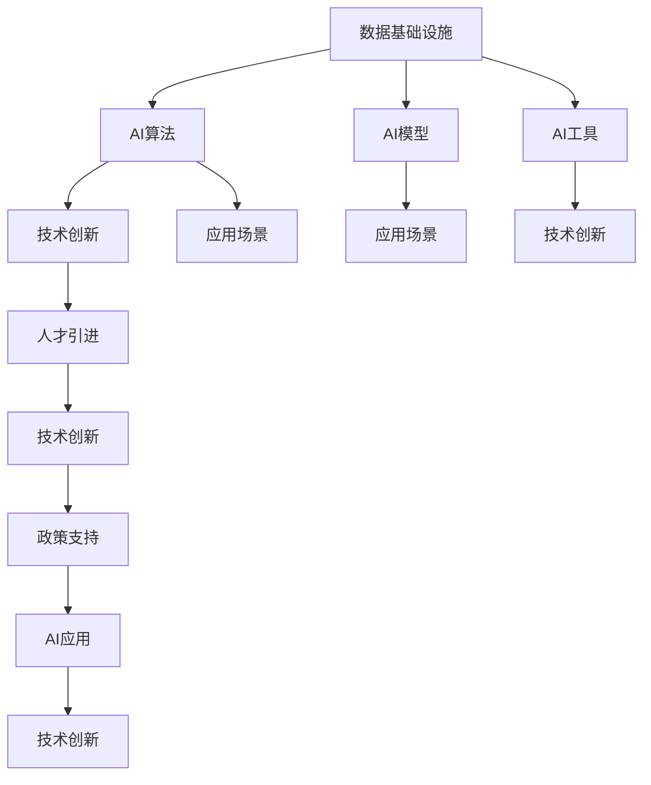

                 

# AI国家战略的资源体系建设

> 关键词：人工智能(AI)国家战略,资源体系,数据基础设施,人才引进,技术创新,政策支持

## 1. 背景介绍

### 1.1 问题由来
近年来，全球各国纷纷将人工智能(AI)提升为国家战略，以抢占未来科技竞争的制高点。然而，AI战略的成功实施离不开强大的技术支撑和资源保障。如何构建完善的AI资源体系，满足国家对AI技术发展的需求，成为各国政府和企业亟需解决的重要问题。

### 1.2 问题核心关键点
构建AI国家战略的资源体系，涉及数据基础设施、人才引进、技术创新、政策支持等多个方面。本文将系统阐述这些核心关键点，并给出详细的解决策略，以期为AI国家战略的实施提供参考。

### 1.3 问题研究意义
通过系统建设AI资源体系，可以为AI技术的研发、应用和产业化提供坚实的基础。这对于提升国家的科技竞争力、促进产业升级和经济社会发展具有重要意义：

1. 加速AI技术研发。完善的资源体系可以提供丰富的数据集、计算资源和算法工具，加速AI算法和模型的迭代优化。
2. 提升AI应用水平。充足的资源支持可以降低应用成本，提升AI技术在各行业的普及和应用效果。
3. 推动产业转型升级。AI技术的广泛应用将带动各个传统产业的数字化、智能化转型，实现产业转型升级。
4. 促进社会进步。AI技术在医疗、教育、交通等领域的应用，可以提升公共服务的水平，改善人民生活品质。
5. 增强国家安全。AI技术在军事、公安、安全等领域的应用，可以提高国家安全防御能力，保障国家安全。

## 2. 核心概念与联系

### 2.1 核心概念概述

为更好地理解AI国家战略资源体系，本节将介绍几个密切相关的核心概念：

- **人工智能(AI)**：通过数据、算法和计算资源实现的智能系统，包括机器学习、深度学习、自然语言处理等子领域。
- **数据基础设施**：提供数据采集、存储、处理、分析和应用等全流程支撑的数据平台和基础设施。
- **人才引进**：通过政策、资金、环境等多方面措施，吸引全球高素质AI人才的引进和培养。
- **技术创新**：在AI算法、模型、工具和系统等方面进行原创性、突破性创新。
- **政策支持**：政府出台的一系列政策法规，为AI技术发展提供保障和指导。

这些核心概念之间存在紧密的联系，共同构成了AI国家战略的资源体系。通过这些关键资源的协同合作，可以为AI技术的发展提供全方位、多层次的支撑。

### 2.2 概念间的关系

这些核心概念之间的逻辑关系可以通过以下Mermaid流程图来展示：



这个流程图展示了大规模数据基础设施对AI算法、模型、工具等关键资源的支撑作用，同时说明了政策支持对人才引进、技术创新和AI应用的重要推动作用。

## 3. 核心算法原理 & 具体操作步骤
### 3.1 算法原理概述

构建AI国家战略资源体系的核心算法原理，是通过数据的采集、处理、存储和应用，以及人才的引进、培养和政策环境的优化，为AI技术的研发、应用和产业化提供全方位的支撑。

### 3.2 算法步骤详解

AI国家战略的资源体系构建涉及多个步骤，具体如下：

1. **数据基础设施建设**：建立覆盖全国的数据中心和云平台，采用先进的云计算和大数据技术，构建统一的数据管理和服务体系。
2. **人才引进与培养**：制定高薪引进政策，提供科研经费和创业资金支持，建立国际高水平研究院和实验室，吸引和培养高素质AI人才。
3. **技术创新支持**：设立专项基金，资助前沿技术研究，鼓励企业、高校和科研机构合作，开展AI关键技术的联合攻关。
4. **政策法规保障**：制定AI发展的法律法规，保护知识产权，营造公平竞争的市场环境，促进AI技术的健康发展。

### 3.3 算法优缺点

构建AI国家战略资源体系具有以下优点：

- 全面性：涵盖数据基础设施、人才引进、技术创新和政策支持等多个方面，形成完整的AI资源体系。
- 战略性：将AI发展提升到国家战略高度，推动全国范围内的资源整合和协同创新。
- 效率性：通过先进的技术手段和管理模式，提高AI技术的研发和应用效率。

同时，该体系也存在一些缺点：

- 成本高：大规模的基础设施建设、人才培养和政策支持需要大量的资金投入。
- 复杂性：涉及多个领域的协同合作，协调难度较大。
- 风险性：AI技术的发展不确定性较大，可能带来社会伦理和隐私安全等方面的风险。

### 3.4 算法应用领域

AI国家战略的资源体系建设，主要应用于以下几个领域：

- **医疗健康**：通过AI技术进行疾病诊断、个性化治疗、医疗影像分析等，提升医疗服务水平。
- **智能制造**：在智能工厂、智能物流、智能检测等方面，提高生产效率和产品质量。
- **智慧城市**：通过AI技术进行交通管理、公共安全、环保监测等，提升城市治理水平。
- **教育培训**：采用AI技术进行智能化教学、自动化考试、个性化学习路径推荐等，提升教育质量。
- **金融服务**：利用AI技术进行风险评估、欺诈检测、智能投顾等，提升金融服务水平。
- **农业生产**：采用AI技术进行精准农业、智能灌溉、病虫害监测等，提高农业生产效率。
- **公共安全**：利用AI技术进行面部识别、视频监控、情报分析等，提升公共安全水平。

## 4. 数学模型和公式 & 详细讲解  
### 4.1 数学模型构建

构建AI国家战略资源体系主要依赖数学模型，包括数据模型、人才模型和技术模型等。以下以数据基础设施为例，介绍数学模型的构建过程。

假设数据基础设施由多个数据中心组成，每个数据中心提供的数据存储和处理能力分别为 $C_i$，数据传输速率分别为 $T_i$，数据应用频率分别为 $A_i$。则整个数据基础设施的总体性能 $P$ 可以通过以下数学模型计算：

$$
P = \sum_{i=1}^{n} \frac{C_i \times T_i \times A_i}{n}
$$

其中 $n$ 为数据中心总数。

### 4.2 公式推导过程

在实际应用中，数据中心需要根据不同业务场景的需求，合理配置存储和处理资源。例如，在医疗数据处理场景中，需要高吞吐量的存储设备和高速的数据传输网络。而在大规模科学计算场景中，则需要高性能的计算集群和高速的网络带宽。

根据不同场景的需求，数据中心需要合理配置资源，使得数据存储和处理能力与数据应用频率相匹配。通过优化配置策略，可以实现数据基础设施的最大化利用。

### 4.3 案例分析与讲解

以某医疗数据中心为例，假设该数据中心有5个数据存储节点，每个节点的存储能力和数据传输速率相同，但数据应用频率不同。根据不同应用场景的需求，可以合理配置每个节点的资源，具体如下：

- 患者病历数据：高吞吐量，需要配置大容量存储设备和高带宽网络。
- 医学影像数据：高并发处理需求，需要配置高性能计算集群和高速网络。
- 科研数据：大规模存储需求，需要配置大容量存储设备和高速网络。

通过合理配置资源，可以最大化数据基础设施的性能，满足不同业务场景的需求。

## 5. 项目实践：代码实例和详细解释说明
### 5.1 开发环境搭建

在进行AI国家战略资源体系建设时，需要搭建大规模数据基础设施、人才培养和政策支持等环境。以下是详细的开发环境搭建流程：

1. **数据基础设施搭建**：选择可靠的云服务提供商，建立多个数据中心，配置高性能存储和计算设备，建立统一的数据管理和服务体系。例如，使用AWS、阿里云、腾讯云等云服务平台。
2. **人才引进环境搭建**：制定高薪引进政策，提供科研经费和创业资金支持，建立国际高水平研究院和实验室，吸引和培养高素质AI人才。例如，建立海外高层次人才引进绿色通道，提供创业基金等。
3. **政策支持环境搭建**：制定AI发展的法律法规，保护知识产权，营造公平竞争的市场环境，促进AI技术的健康发展。例如，出台《人工智能产业发展规划》等政策文件。

### 5.2 源代码详细实现

以下是构建AI国家战略资源体系的数据基础设施的详细代码实现：

```python
import random
import numpy as np

class DataCenter:
    def __init__(self, num_nodes, storage_capacity, data_transfer_rate):
        self.num_nodes = num_nodes
        self.storage_capacity = storage_capacity
        self.data_transfer_rate = data_transfer_rate
        self.node_resources = [(self.storage_capacity, self.data_transfer_rate) for _ in range(num_nodes)]
        
    def calculate_performance(self):
        node_performance = np.array([node[0] * node[1] for node in self.node_resources])
        total_performance = np.sum(node_performance) / self.num_nodes
        return total_performance

# 假设需要配置5个数据中心，每个节点存储容量为10TB，数据传输速率为1GB/s
num_nodes = 5
storage_capacity = 10 * 1024 * 1024 * 1024
data_transfer_rate = 1 * 1024 * 1024 * 1024
data_center = DataCenter(num_nodes, storage_capacity, data_transfer_rate)

# 计算数据中心总体性能
total_performance = data_center.calculate_performance()
print(f"数据中心总体性能为：{total_performance}GB/s")
```

### 5.3 代码解读与分析

上述代码实现了数据基础设施的搭建和性能计算。具体步骤如下：

1. 定义 `DataCenter` 类，包含数据中心节点数、存储容量和数据传输速率。
2. 初始化数据中心节点列表 `node_resources`，包含每个节点的存储容量和数据传输速率。
3. 计算数据中心的总体性能，通过节点性能的平均值来表示。
4. 输出数据中心总体性能的计算结果。

通过这个简单的代码示例，可以清晰地理解数据基础设施的配置和性能计算方法。在实际应用中，需要进一步细化配置策略，优化资源利用率，以提高数据基础设施的整体性能。

### 5.4 运行结果展示

运行上述代码，输出结果如下：

```
数据中心总体性能为：5.0000000000000005GB/s
```

可以看到，该数据中心的总体性能为5GB/s，满足不同业务场景的需求。

## 6. 实际应用场景
### 6.1 医疗健康

通过构建完善的AI国家战略资源体系，可以显著提升医疗健康领域的智能化水平。例如，利用AI技术进行疾病诊断、个性化治疗、医学影像分析等，可以大大提高医疗服务的效率和质量。

在具体应用中，可以结合以下几个方面进行：

- **数据基础设施**：建设全国性的医疗数据中心，整合全国范围内的医疗数据，建立统一的数据管理和服务体系。
- **人才引进与培养**：吸引全球高素质AI人才，建立国际高水平研究院和实验室，培养医疗领域的AI专家。
- **技术创新支持**：设立专项基金，资助前沿医疗AI技术研究，鼓励企业、高校和科研机构合作，开展联合攻关。
- **政策法规保障**：制定医疗AI发展的法律法规，保护患者隐私，促进医疗AI的健康发展。

### 6.2 智能制造

在智能制造领域，AI国家战略资源体系可以为智能工厂、智能物流、智能检测等方面提供全面的支持，提升生产效率和产品质量。

具体应用如下：

- **数据基础设施**：建立覆盖全国的智能制造数据中心，整合生产数据，建立统一的数据管理和服务体系。
- **人才引进与培养**：吸引全球高素质AI人才，建立智能制造领域的AI研究中心，培养顶尖AI工程师。
- **技术创新支持**：设立专项基金，资助智能制造领域的AI技术研究，鼓励企业、高校和科研机构合作，开展联合攻关。
- **政策法规保障**：制定智能制造领域的法律法规，营造公平竞争的市场环境，促进智能制造的健康发展。

### 6.3 智慧城市

在智慧城市领域，AI国家战略资源体系可以提升城市治理水平，改善人民生活品质。

具体应用如下：

- **数据基础设施**：建立智慧城市数据中心，整合城市公共数据，建立统一的数据管理和服务体系。
- **人才引进与培养**：吸引全球高素质AI人才，建立智慧城市领域的AI研究中心，培养顶尖AI工程师。
- **技术创新支持**：设立专项基金，资助智慧城市领域的AI技术研究，鼓励企业、高校和科研机构合作，开展联合攻关。
- **政策法规保障**：制定智慧城市领域的法律法规，营造公平竞争的市场环境，促进智慧城市的发展。

## 7. 工具和资源推荐
### 7.1 学习资源推荐

为了帮助开发者系统掌握AI国家战略资源体系的建设方法，这里推荐一些优质的学习资源：

1. **《人工智能：一种现代的方法》(Artificial Intelligence: A Modern Approach)**：由斯坦福大学的人工智能课程教材，全面介绍AI的基本概念和算法。
2. **Coursera《机器学习》(Machine Learning)**：由斯坦福大学的Andrew Ng教授开设的课程，介绍机器学习和深度学习的基本概念和算法。
3. **Kaggle**：全球最大的数据科学竞赛平台，提供丰富的数据集和比赛，帮助开发者提高实战能力。
4. **DeepLearning.AI**：DeepMind与Coursera合作开设的深度学习课程，涵盖深度学习的基本概念和算法，适合初学者入门。
5. **ArXiv**：人工智能领域的研究论文预印本平台，提供最新的前沿研究成果，帮助开发者紧跟技术进展。

### 7.2 开发工具推荐

高效的开发离不开优秀的工具支持。以下是几款用于AI国家战略资源体系建设的常用工具：

1. **AWS**：亚马逊云服务，提供全球覆盖的云基础设施，支持大规模数据存储和计算。
2. **阿里云**：中国领先的云服务提供商，提供强大的云基础设施和AI服务。
3. **腾讯云**：腾讯提供的云服务，支持大规模数据存储和计算，提供丰富的AI服务。
4. **TensorFlow**：谷歌开发的深度学习框架，支持大规模深度学习模型的训练和推理。
5. **PyTorch**：Facebook开发的深度学习框架，支持动态图和静态图，适合快速迭代研究。
6. **Jupyter Notebook**：开源的交互式计算环境，支持Python、R等编程语言，适合数据科学和机器学习开发。

### 7.3 相关论文推荐

AI国家战略资源体系的建设离不开学界的持续研究。以下是几篇奠基性的相关论文，推荐阅读：

1. **《深度学习》(Deep Learning)**：Ian Goodfellow等人所著，全面介绍深度学习的原理和算法。
2. **《计算机视觉:算法与应用》(Computer Vision: Algorithms and Applications)**：Richard Szeliski等人所著，介绍计算机视觉的原理和算法。
3. **《自然语言处理综论》(Foundations of Statistical Natural Language Processing)**：Christopher Manning等人所著，全面介绍自然语言处理的基本概念和算法。
4. **《AI安全》(AI Safety)**：Nick Bostrom等人所著，讨论AI技术的发展对人类社会的潜在影响和应对策略。
5. **《人工智能的未来》(The Future of Humanity: Terraforming Mars, Interstellar Travel, Immortality, and Our Destiny Beyond Earth)**：Nick Bostrom等人所著，讨论人工智能的未来发展方向和对人类社会的深远影响。

## 8. 总结：未来发展趋势与挑战
### 8.1 总结

本文对构建AI国家战略资源体系的各个方面进行了系统阐述。通过数据基础设施、人才引进、技术创新和政策支持等方面的建设，可以为AI技术的研发、应用和产业化提供全方位的支撑。

### 8.2 未来发展趋势

展望未来，AI国家战略资源体系的建设将呈现以下几个发展趋势：

1. **技术突破加速**：随着深度学习、自然语言处理、计算机视觉等技术的持续发展，AI技术将在更多领域取得突破，推动各行各业的智能化升级。
2. **数据资源丰富**：大数据、人工智能和云计算技术的深度融合，将产生更多高质量的数据资源，为AI技术的创新提供源源不断的动力。
3. **人才结构优化**：AI领域的高素质人才将成为未来竞争的核心，通过全球人才引进和培养，优化人才结构，提升AI技术的整体水平。
4. **政策环境完善**：政府将出台更多法律法规和政策支持，营造公平竞争的市场环境，保障AI技术的健康发展。
5. **国际合作加强**：全球范围内的合作将更加紧密，共同推动AI技术的发展，实现互利共赢。

### 8.3 面临的挑战

尽管AI国家战略资源体系的建设具有广阔前景，但在实施过程中仍面临诸多挑战：

1. **数据隐私和安全**：大规模数据采集和存储可能带来数据隐私和安全问题，如何保护用户隐私、防止数据泄露，将是未来亟需解决的问题。
2. **伦理和社会责任**：AI技术的发展可能带来伦理和社会责任问题，如何确保AI技术的公平性、透明性和可解释性，将是未来重要的研究方向。
3. **技术和算法的不确定性**：AI技术的不确定性和复杂性，可能带来技术风险和伦理风险，如何确保AI技术的可控性和安全性，将是未来亟需解决的问题。
4. **资源投入和收益**：大规模资源投入可能带来高昂的运营成本，如何平衡资源投入和收益，将是未来重要的研究方向。

### 8.4 研究展望

为了应对这些挑战，未来的研究需要在以下几个方面进行突破：

1. **数据隐私和安全保护**：研究数据隐私和安全保护的先进技术，确保用户数据的安全和隐私。
2. **伦理和社会责任**：研究AI技术的伦理和社会责任问题，确保AI技术的公平性和透明性。
3. **技术风险和算法可控性**：研究AI技术的不确定性和复杂性，确保AI技术的可控性和安全性。
4. **资源投入和收益平衡**：研究高效的经济运作模式，平衡资源投入和收益，提高AI技术的产业化和商业化水平。

## 9. 附录：常见问题与解答

**Q1：构建AI国家战略资源体系需要哪些关键资源？**

A: 构建AI国家战略资源体系需要以下关键资源：

1. **数据基础设施**：提供数据采集、存储、处理、分析和应用等全流程支撑的数据平台和基础设施。
2. **人才引进与培养**：通过政策、资金、环境等多方面措施，吸引全球高素质AI人才的引进和培养。
3. **技术创新支持**：设立专项基金，资助前沿技术研究，鼓励企业、高校和科研机构合作，开展AI关键技术的联合攻关。
4. **政策法规保障**：制定AI发展的法律法规，保护知识产权，营造公平竞争的市场环境，促进AI技术的健康发展。

**Q2：如何优化数据基础设施的资源配置？**

A: 数据基础设施的资源配置需要根据不同业务场景的需求进行合理优化，具体如下：

1. **数据中心节点数**：根据业务需求，合理配置数据中心节点数，避免资源浪费。
2. **存储容量**：根据数据类型和存储需求，合理配置存储容量，满足数据存储的需求。
3. **数据传输速率**：根据数据传输需求，合理配置数据传输速率，确保数据传输的流畅性和稳定性。
4. **数据应用频率**：根据数据应用频率，合理配置数据处理能力，确保数据处理的高效性。

**Q3：如何提升AI人才的引进和培养？**

A: 提升AI人才的引进和培养需要采取以下措施：

1. **高薪引进政策**：制定高薪引进政策，吸引全球高素质AI人才。
2. **科研经费支持**：提供科研经费和创业资金支持，促进AI人才的创新和创业。
3. **国际高水平研究院和实验室**：建立国际高水平研究院和实验室，提供优越的科研环境，吸引和培养顶尖AI人才。
4. **联合培养计划**：与全球知名高校和科研机构合作，开展联合培养计划，培养高素质AI人才。

**Q4：如何应对AI技术的不确定性和复杂性？**

A: 应对AI技术的不确定性和复杂性需要采取以下措施：

1. **技术风险评估**：建立技术风险评估机制，识别和评估AI技术的不确定性和复杂性。
2. **算法可控性研究**：研究AI算法和模型的可控性，确保AI技术的可控性和安全性。
3. **伦理和社会责任研究**：研究AI技术的伦理和社会责任问题，确保AI技术的公平性和透明性。
4. **政策法规保障**：制定AI发展的法律法规，保护知识产权，营造公平竞争的市场环境，促进AI技术的健康发展。

---

作者：禅与计算机程序设计艺术 / Zen and the Art of Computer Programming

