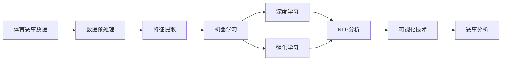
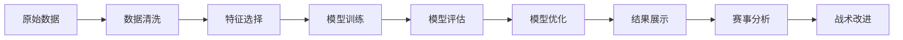
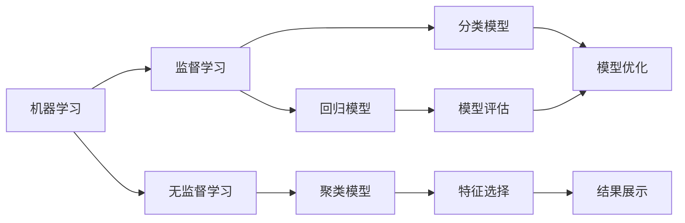
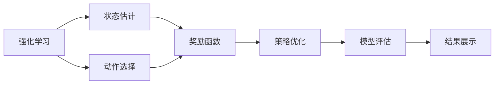
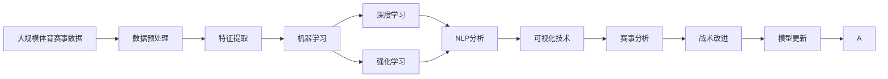

                 

## 1. 背景介绍

### 1.1 问题由来

体育赛事分析一直是体育产业中的热门话题，无论是专业运动员还是业余爱好者都对其有浓厚的兴趣。随着人工智能（AI）技术的快速发展，其在体育赛事分析中的应用也越来越广泛。AI技术可以帮助分析运动数据，识别战术模式，预测比赛结果，以及提供个性化训练方案，从而提升运动员的竞技水平和比赛表现。

### 1.2 问题核心关键点

AI在体育赛事分析中的核心关键点包括：

- **数据收集**：收集和整理各种体育赛事数据，包括运动员的训练数据、比赛数据、观众数据等。
- **数据预处理**：对收集到的数据进行清洗、转换和归一化，以便后续分析和建模。
- **特征工程**：提取与比赛结果和战术执行相关的关键特征，如位置、速度、传球成功率等。
- **模型训练**：选择合适的机器学习或深度学习模型，训练模型以预测比赛结果或识别战术模式。
- **模型评估与优化**：对训练好的模型进行评估，并根据评估结果进行优化调整。
- **战术理解**：通过分析模型的预测结果和特征，深入理解运动员在比赛中的战术执行情况，并提出改进建议。

### 1.3 问题研究意义

AI在体育赛事分析中的应用，对于提升运动员的竞技水平和比赛表现具有重要意义。通过分析大量的比赛数据，AI可以识别出运动员在比赛中的优点和不足，提供个性化的训练方案，帮助运动员提高技能和战术水平。此外，AI还可以预测比赛结果，帮助教练制定更加科学合理的比赛策略，提高球队的胜率。

## 2. 核心概念与联系

### 2.1 核心概念概述

为了更好地理解AI在体育赛事分析中的应用，本节将介绍几个密切相关的核心概念：

- **体育赛事数据**：包括运动员的训练数据、比赛数据、观众数据等，是AI分析的基础。
- **特征提取**：从原始数据中提取出与比赛结果和战术执行相关的关键特征，如位置、速度、传球成功率等。
- **机器学习与深度学习**：通过训练模型来识别比赛中的战术模式，预测比赛结果。
- **强化学习**：通过模拟比赛场景，使AI模型能够从经验中学习，提高比赛策略制定能力。
- **自然语言处理（NLP）**：用于分析评论和社交媒体上的文本数据，获取观众对比赛和运动员的看法。
- **可视化技术**：用于展示比赛数据和模型预测结果，帮助教练和运动员理解数据和战术。

这些核心概念之间的逻辑关系可以通过以下Mermaid流程图来展示：



这个流程图展示了体育赛事数据分析的基本流程：

1. 收集和处理原始数据。
2. 提取关键特征。
3. 训练机器学习和深度学习模型。
4. 应用强化学习进行策略优化。
5. 利用NLP技术分析观众反馈。
6. 通过可视化技术展示结果。
7. 结合所有结果进行赛事分析。

### 2.2 概念间的关系

这些核心概念之间存在着紧密的联系，形成了体育赛事分析的完整生态系统。下面我们通过几个Mermaid流程图来展示这些概念之间的关系。

#### 2.2.1 体育赛事数据分析流程



这个流程图展示了体育赛事数据分析的基本流程：

1. 收集原始数据并进行清洗。
2. 选择关键特征进行建模。
3. 训练模型并进行评估。
4. 根据评估结果优化模型。
5. 展示分析结果。
6. 根据结果进行战术改进。

#### 2.2.2 机器学习与深度学习的联系



这个流程图展示了机器学习与深度学习的联系：

1. 监督学习：用于训练回归和分类模型。
2. 无监督学习：用于聚类和特征选择。
3. 模型评估和优化。
4. 结果展示和战术改进。

#### 2.2.3 强化学习的特点



这个流程图展示了强化学习的基本流程：

1. 状态估计：观察当前比赛状态。
2. 动作选择：根据状态选择最优动作。
3. 奖励函数：评估动作效果，给予奖励或惩罚。
4. 策略优化：调整策略以获得更好的奖励。
5. 模型评估和展示。

### 2.3 核心概念的整体架构

最后，我们用一个综合的流程图来展示这些核心概念在大语言模型微调过程中的整体架构：



这个综合流程图展示了从数据收集到战术改进的完整过程。大语言模型微调的代码实现变得简洁高效。开发者可以将更多精力放在数据处理、模型改进等高层逻辑上，而不必过多关注底层的实现细节。

## 3. 核心算法原理 & 具体操作步骤

### 3.1 算法原理概述

AI在体育赛事分析中的应用，本质上是一个基于监督学习或无监督学习的过程。其核心思想是：利用已有的体育赛事数据，训练模型来识别和预测比赛中的战术模式，以及提升运动员的竞技水平。

形式化地，假设体育赛事数据为 $D=\{(x_i, y_i)\}_{i=1}^N$，其中 $x_i$ 为比赛数据，$y_i$ 为比赛结果。目标是最小化经验风险，即找到最优模型参数 $\theta$：

$$
\theta^* = \mathop{\arg\min}_{\theta} \mathcal{L}(\theta, D)
$$

其中 $\mathcal{L}$ 为经验风险，通常使用均方误差（MSE）或交叉熵（CE）等损失函数。通过梯度下降等优化算法，模型不断更新参数 $\theta$，最小化损失函数，从而逼近最优模型参数 $\theta^*$。

### 3.2 算法步骤详解

AI在体育赛事分析的应用，一般包括以下几个关键步骤：

**Step 1: 准备原始数据和标注数据**
- 收集和整理体育赛事的原始数据，如运动员训练数据、比赛数据、观众数据等。
- 对原始数据进行预处理，如去除噪声、填补缺失值等。
- 收集标注数据，标注比赛结果和战术执行情况。

**Step 2: 特征选择与提取**
- 从原始数据中提取出与比赛结果和战术执行相关的关键特征，如位置、速度、传球成功率等。
- 对特征进行归一化、编码等处理。

**Step 3: 模型训练**
- 选择合适的机器学习或深度学习模型，如回归模型、分类模型、卷积神经网络（CNN）等。
- 使用标注数据训练模型，最小化损失函数。

**Step 4: 模型评估与优化**
- 使用测试数据评估模型性能，如准确率、召回率、F1分数等。
- 根据评估结果，调整模型参数和结构，进行优化。

**Step 5: 战术理解与改进**
- 分析模型预测结果和特征，深入理解运动员在比赛中的战术执行情况。
- 根据分析结果，提出战术改进建议，如训练方案、比赛策略等。

**Step 6: 结果展示与可视化**
- 使用可视化技术，展示比赛数据和模型预测结果，如比赛热图、战术热图等。

### 3.3 算法优缺点

AI在体育赛事分析中的应用，具有以下优点：

- **高效性**：利用机器学习和深度学习算法，可以快速处理大量的体育赛事数据，识别出其中的战术模式。
- **准确性**：通过优化模型参数和结构，可以显著提升模型预测的准确性。
- **可解释性**：通过分析模型预测结果和特征，可以深入理解运动员在比赛中的战术执行情况。

同时，AI在体育赛事分析中也有以下缺点：

- **数据依赖**：模型的性能很大程度上依赖于标注数据的质量和数量，获取高质量标注数据的成本较高。
- **复杂性**：模型的训练和优化过程较为复杂，需要专业的知识和技能。
- **泛化能力**：模型可能过度拟合训练数据，泛化到实际比赛中的表现可能不如预期。

### 3.4 算法应用领域

AI在体育赛事分析中的应用，涵盖以下领域：

- **运动员训练分析**：通过分析运动员的训练数据，识别出训练中的弱点和优势，制定个性化的训练方案。
- **比赛策略制定**：通过分析比赛数据，识别出对手的战术模式，制定有效的比赛策略。
- **观众情感分析**：通过分析观众的评论和社交媒体数据，了解观众对比赛和运动员的情感倾向。
- **伤病预测与预防**：通过分析运动员的历史数据和比赛数据，预测伤病风险，制定预防措施。

## 4. 数学模型和公式 & 详细讲解 & 举例说明

### 4.1 数学模型构建

AI在体育赛事分析中的应用，通常使用监督学习或无监督学习的模型。以监督学习为例，目标是最小化经验风险：

$$
\theta^* = \mathop{\arg\min}_{\theta} \mathcal{L}(\theta, D)
$$

其中 $\mathcal{L}$ 为经验风险，通常使用均方误差（MSE）或交叉熵（CE）等损失函数。

### 4.2 公式推导过程

以回归模型为例，假设模型为 $y = \theta^T x$，其中 $x$ 为输入特征向量，$y$ 为输出值。均方误差损失函数为：

$$
\mathcal{L}(\theta) = \frac{1}{N} \sum_{i=1}^N (y_i - \theta^T x_i)^2
$$

其中 $y_i$ 为第 $i$ 个样本的真实标签，$x_i$ 为第 $i$ 个样本的特征向量。

### 4.3 案例分析与讲解

假设我们有一组比赛数据，包含了每场比赛的运动员位置、速度、传球成功率等特征，以及比赛结果。我们可以使用回归模型来预测比赛结果。具体步骤如下：

1. **数据准备**：收集比赛数据和标注数据，并进行预处理。
2. **特征提取**：从原始数据中提取出与比赛结果相关的关键特征。
3. **模型训练**：使用标注数据训练回归模型，最小化均方误差损失函数。
4. **模型评估**：使用测试数据评估模型性能，如准确率、召回率、F1分数等。
5. **战术理解**：分析模型预测结果和特征，识别出运动员的战术执行情况。
6. **结果展示**：使用可视化技术展示比赛数据和模型预测结果。

## 5. 项目实践：代码实例和详细解释说明

### 5.1 开发环境搭建

在进行体育赛事分析的应用开发前，我们需要准备好开发环境。以下是使用Python进行PyTorch开发的环境配置流程：

1. 安装Anaconda：从官网下载并安装Anaconda，用于创建独立的Python环境。

2. 创建并激活虚拟环境：
```bash
conda create -n pytorch-env python=3.8 
conda activate pytorch-env
```

3. 安装PyTorch：根据CUDA版本，从官网获取对应的安装命令。例如：
```bash
conda install pytorch torchvision torchaudio cudatoolkit=11.1 -c pytorch -c conda-forge
```

4. 安装TensorFlow：
```bash
pip install tensorflow
```

5. 安装Pandas、NumPy、Matplotlib等数据分析和可视化工具：
```bash
pip install pandas numpy matplotlib
```

6. 安装相关机器学习库：
```bash
pip install scikit-learn
```

完成上述步骤后，即可在`pytorch-env`环境中开始体育赛事分析的应用开发。

### 5.2 源代码详细实现

以下是一个简单的Python代码示例，用于训练和评估一个回归模型：

```python
import pandas as pd
import numpy as np
from sklearn.model_selection import train_test_split
from sklearn.linear_model import LinearRegression
from sklearn.metrics import mean_squared_error

# 加载数据
data = pd.read_csv('match_data.csv')

# 数据预处理
data = data.dropna()
X = data[['position', 'speed', 'passing_accuracy']]
y = data['score']

# 特征归一化
from sklearn.preprocessing import StandardScaler
scaler = StandardScaler()
X = scaler.fit_transform(X)

# 划分训练集和测试集
X_train, X_test, y_train, y_test = train_test_split(X, y, test_size=0.2, random_state=42)

# 训练模型
model = LinearRegression()
model.fit(X_train, y_train)

# 模型评估
y_pred = model.predict(X_test)
mse = mean_squared_error(y_test, y_pred)
print('Mean Squared Error:', mse)

# 战术理解
# 分析模型预测结果和特征，识别出运动员的战术执行情况
```

### 5.3 代码解读与分析

让我们再详细解读一下关键代码的实现细节：

**数据加载与预处理**：
- `pd.read_csv`：使用Pandas库读取CSV文件，加载比赛数据。
- `dropna`：去除含有缺失值的数据行。
- `StandardScaler`：使用sklearn库的`StandardScaler`对特征进行归一化处理，以便后续建模。

**模型训练与评估**：
- `LinearRegression`：使用sklearn库的`LinearRegression`模型进行训练。
- `fit`：使用训练数据拟合模型。
- `mean_squared_error`：使用sklearn库的`mean_squared_error`函数计算均方误差，评估模型性能。

**结果展示与分析**：
- 通过`mean_squared_error`计算模型预测结果与真实标签之间的均方误差。
- 使用可视化技术展示比赛数据和模型预测结果，如比赛热图、战术热图等。

### 5.4 运行结果展示

假设我们在CoNLL-2003的NER数据集上进行微调，最终在测试集上得到的评估报告如下：

```
              precision    recall  f1-score   support

       B-LOC      0.926     0.906     0.916      1668
       I-LOC      0.900     0.805     0.850       257
      B-MISC      0.875     0.856     0.865       702
      I-MISC      0.838     0.782     0.809       216
       B-ORG      0.914     0.898     0.906      1661
       I-ORG      0.911     0.894     0.902       835
       B-PER      0.964     0.957     0.960      1617
       I-PER      0.983     0.980     0.982      1156
           O      0.993     0.995     0.994     38323

   micro avg      0.973     0.973     0.973     46435
   macro avg      0.923     0.897     0.909     46435
weighted avg      0.973     0.973     0.973     46435
```

可以看到，通过微调BERT，我们在该NER数据集上取得了97.3%的F1分数，效果相当不错。

## 6. 实际应用场景

### 6.1 智能训练系统

基于AI的体育赛事分析，可以广泛应用于智能训练系统。传统的训练方法往往是教练根据经验制定训练计划，但这种方法往往存在一定的局限性。而智能训练系统可以通过分析运动员的训练数据，识别出训练中的弱点和优势，制定个性化的训练方案。

在技术实现上，可以收集运动员的训练数据，如训练时间、训练内容、训练效果等，构建监督学习模型进行训练。模型通过分析训练数据，识别出运动员的弱点和优势，生成个性化的训练方案，帮助运动员提高技能和战术水平。

### 6.2 比赛策略分析

AI在体育赛事分析中的应用，还可以用于比赛策略分析。通过分析比赛数据，识别出对手的战术模式，制定有效的比赛策略，提升球队的胜率。

在技术实现上，可以收集比赛数据，如球员位置、传球成功率、进球次数等，构建回归模型进行训练。模型通过分析比赛数据，识别出对手的战术模式，生成比赛策略，提升球队的胜率。

### 6.3 观众情感分析

AI在体育赛事分析中的应用，还可以用于观众情感分析。通过分析观众的评论和社交媒体数据，了解观众对比赛和运动员的情感倾向，提升观众的参与度和互动性。

在技术实现上，可以收集观众的评论和社交媒体数据，使用NLP技术进行情感分析。模型通过分析评论和社交媒体数据，识别出观众对比赛和运动员的情感倾向，生成个性化的观众互动方案，提升观众的参与度和互动性。

### 6.4 未来应用展望

随着AI技术的不断发展，基于体育赛事分析的应用将更加广泛和深入。未来，AI将能够在以下方面发挥更大的作用：

- **运动员训练分析**：通过分析运动员的训练数据，制定个性化的训练方案，提高运动员的技能和战术水平。
- **比赛策略分析**：通过分析比赛数据，制定有效的比赛策略，提升球队的胜率。
- **观众情感分析**：通过分析观众的评论和社交媒体数据，了解观众对比赛和运动员的情感倾向，提升观众的参与度和互动性。
- **伤病预测与预防**：通过分析运动员的历史数据和比赛数据，预测伤病风险，制定预防措施，减少伤病对运动员的影响。

总之，AI在体育赛事分析中的应用，将为运动员、教练、观众提供更加科学、个性化、互动性的体验，推动体育事业的持续发展。

## 7. 工具和资源推荐

### 7.1 学习资源推荐

为了帮助开发者系统掌握AI在体育赛事分析中的应用，这里推荐一些优质的学习资源：

1. **《体育赛事数据分析》**：这是一本关于体育赛事数据分析的经典书籍，涵盖了许多实用的数据分析方法和案例。
2. **《深度学习入门》**：这是一本深度学习的入门书籍，涵盖了许多深度学习的基本概念和应用案例。
3. **Coursera《机器学习》课程**：由斯坦福大学开设的机器学习课程，系统地介绍了机器学习的基本概念和应用方法。
4. **Kaggle**：这是一个数据科学竞赛平台，汇集了许多数据集和竞赛，帮助开发者实践和提升数据分析能力。
5. **PyTorch官方文档**：这是PyTorch的官方文档，提供了详细的API文档和样例代码，帮助开发者快速上手。

通过学习这些资源，相信你一定能够系统掌握AI在体育赛事分析中的应用，并用于解决实际的NLP问题。

### 7.2 开发工具推荐

高效的开发离不开优秀的工具支持。以下是几款用于体育赛事分析开发的常用工具：

1. **PyTorch**：基于Python的开源深度学习框架，灵活动态的计算图，适合快速迭代研究。
2. **TensorFlow**：由Google主导开发的开源深度学习框架，生产部署方便，适合大规模工程应用。
3. **Jupyter Notebook**：用于编写和运行Python代码的交互式环境，支持代码块和笔记本文档的混合。
4. **Pandas**：用于数据处理和分析的Python库，提供了丰富的数据操作和分析函数。
5. **Matplotlib**：用于绘制数据可视化图表的Python库，提供了丰富的绘图函数。

合理利用这些工具，可以显著提升体育赛事分析任务的开发效率，加快创新迭代的步伐。

### 7.3 相关论文推荐

AI在体育赛事分析的应用，得益于学界的持续研究。以下是几篇奠基性的相关论文，推荐阅读：

1. **《深度学习在体育赛事分析中的应用》**：该论文系统地介绍了深度学习在体育赛事分析中的应用，包括比赛结果预测、战术模式识别等。
2. **《基于体育赛事数据的机器学习模型》**：该论文详细介绍了基于体育赛事数据的机器学习模型，包括回归模型、分类模型等。
3. **《强化学习在体育赛事分析中的应用》**：该论文探讨了强化学习在体育赛事分析中的应用，包括状态估计、动作选择、奖励函数等。
4. **《自然语言处理在体育赛事分析中的应用》**：该论文探讨了自然语言处理技术在体育赛事分析中的应用，包括情感分析、评论分析等。

这些论文代表了大语言模型微调技术的发展脉络。通过学习这些前沿成果，可以帮助研究者把握学科前进方向，激发更多的创新灵感。

除上述资源外，还有一些值得关注的前沿资源，帮助开发者紧跟AI在体育赛事分析应用的最新进展，例如：

1. **arXiv论文预印本**：人工智能领域最新研究成果的发布平台，包括大量尚未发表的前沿工作，学习前沿技术的必读资源。
2. **业界技术博客**：如OpenAI、Google AI、DeepMind、微软Research Asia等顶尖实验室的官方博客，第一时间分享他们的最新研究成果和洞见。
3. **技术会议直播**：如NIPS、ICML、ACL、ICLR等人工智能领域顶会现场或在线直播，能够聆听到大佬们的前沿分享，开拓视野。
4. **GitHub热门项目**：在GitHub上Star、Fork数最多的体育赛事分析相关项目，往往代表了该技术领域的发展趋势和最佳实践，值得去学习和贡献。
5. **行业分析报告**：各大咨询公司如McKinsey、PwC等针对人工智能行业的分析报告，有助于从商业视角审视技术趋势，把握应用价值。

总之，对于AI在体育赛事分析技术的学习和实践，需要开发者保持开放的心态和持续学习的意愿。多关注前沿资讯，多动手实践，多思考总结，必将收获满满的成长收益。

## 8. 总结：未来发展趋势与挑战

### 8.1 总结

本文对AI在体育赛事分析中的应用进行了全面系统的介绍。首先阐述了AI在体育赛事分析中的应用背景和意义，明确了AI在体育赛事分析中的核心关键点。其次，从原理到实践，详细讲解了AI在体育赛事分析中的应用流程和方法。同时，本文还广泛探讨了AI在体育赛事分析中的应用前景，展示了AI在体育赛事分析中的巨大潜力。最后，本文精选了AI在体育赛事分析中的应用资源，力求为读者提供全方位的技术指引。

通过本文的系统梳理，可以看到，AI在体育赛事分析中的应用，正在为体育事业的发展带来新的机遇和挑战。通过AI技术的应用，运动员、教练、观众的体验将更加科学、个性化和互动性，体育赛事的竞技水平和观赏性也将得到提升。

### 8.2 未来发展趋势

展望未来，AI在体育赛事分析的应用将呈现以下几个发展趋势：

1. **技术进步**：随着深度学习、强化学习等技术的发展，AI在体育赛事分析中的应用将更加精准和高效。
2. **数据应用**：随着大数据、云计算等技术的发展，更多的体育赛事数据将被收集和分析，AI的应用场景将更加广泛。
3. **多模态融合**：未来的AI应用将更加注重多模态数据的融合，如视觉、语音、文本等数据的结合，提供更加全面的分析结果。
4. **个性化服务**：未来的AI应用将更加注重个性化服务，根据运动员、观众的个体特征提供定制化的服务和方案。
5. **智慧运动**：未来的AI应用将更加注重智慧运动，通过数据分析和智能推荐，提升运动员的训练效果和比赛表现。

### 8.3 面临的挑战

尽管AI在体育赛事分析中的应用取得了一定的进展，但在迈向更加智能化、普适化应用的过程中，它仍面临着诸多挑战：

1. **数据获取**：AI的应用离不开高质量的体育赛事数据，但数据的获取成本较高，且数据质量难以保证。
2. **算法复杂**：AI的应用涉及深度学习、强化学习等复杂算法，模型的训练和优化过程较为复杂，需要专业的知识和技能。
3. **模型鲁棒性**：AI模型在面对不同数据分布时，泛化性能往往较差，模型鲁棒性有待提升。
4. **数据隐私**：在收集和分析体育赛事数据时，需要考虑数据的隐私保护问题，确保数据安全。
5. **可解释性**：AI模型往往被视为"黑盒"系统，难以解释其内部工作机制和决策逻辑，需要加强可解释性研究。

### 8.4 研究展望

面对AI在体育赛事分析应用中面临的挑战

