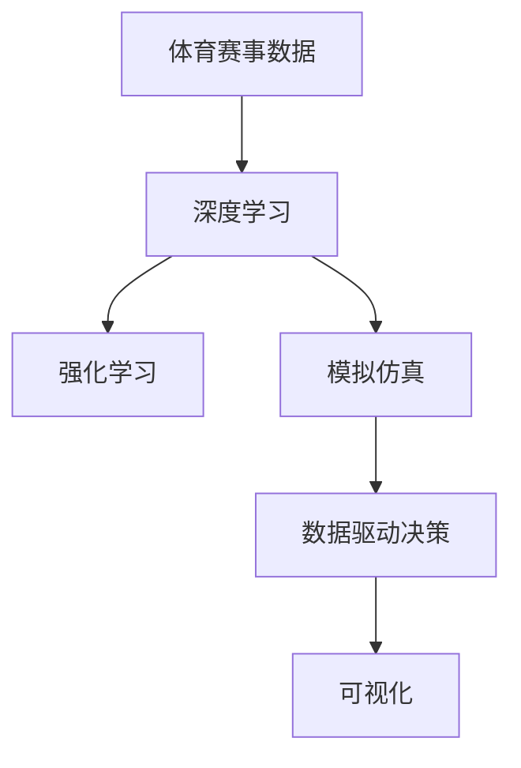
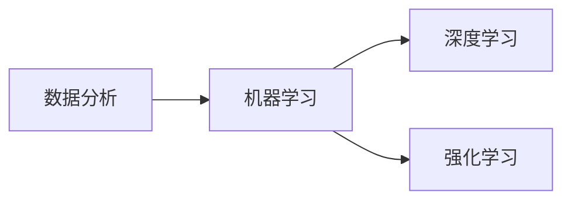
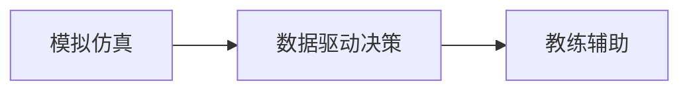
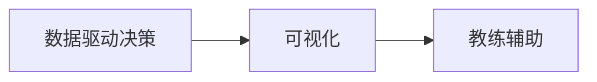
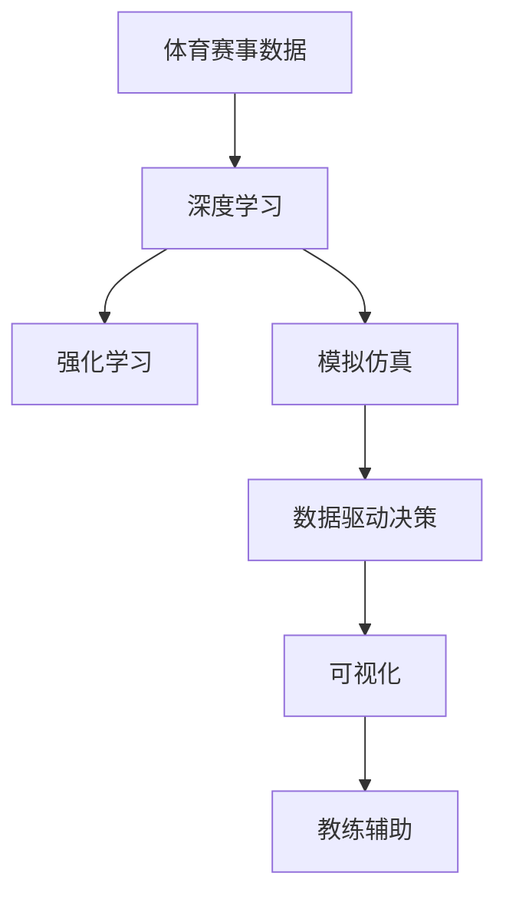

                 

# AI在体育赛事分析中的应用:深化战术理解

> 关键词：体育赛事分析, 深度学习, 数据驱动, 强化学习, 决策优化, 模拟仿真, 教练辅助

## 1. 背景介绍

### 1.1 问题由来
体育赛事分析在近年来受到了越来越多的重视，它不仅是赛事组织者评估比赛效果、制定改进策略的重要工具，也是运动员和教练团队优化训练计划、提升竞技水平的重要手段。传统上，体育赛事分析主要依靠人工统计和经验积累，而随着人工智能和大数据技术的发展，新的方法正在逐步取代传统的分析手段。

体育赛事分析的核心目标是通过对赛事数据的深度挖掘，提取有价值的信息，进而提升赛事表现和训练效果。这包括但不限于：
- **战术分析**：识别出比赛中的关键战术和策略，分析它们的有效性。
- **球员评估**：基于数据评估球员的表现，识别技术特点和提升潜力。
- **训练优化**：根据数据分析结果调整训练方案，提升运动员的竞技水平。
- **风险预警**：通过赛事数据的监测，提前预警比赛中的潜在风险。

### 1.2 问题核心关键点
目前，体育赛事分析中的主要技术手段包括：
- **数据分析与可视化**：利用数据挖掘和可视化技术，提取比赛中的关键信息。
- **机器学习与深度学习**：应用各种机器学习算法，如决策树、随机森林、神经网络等，对赛事数据进行建模和预测。
- **强化学习**：通过模拟环境中的决策优化，提升运动员的决策水平。
- **模拟仿真**：利用虚拟仿真技术，进行比赛和训练场景的模拟，帮助分析比赛中的假设条件和不确定性。
- **教练辅助**：基于数据分析结果，辅助教练制定训练计划和比赛策略。

这些技术手段在大规模体育赛事分析中已经得到了广泛应用，显著提升了赛事分析的效率和准确性。然而，面对现代体育赛事的复杂性和多样性，如何更好地整合多种技术，挖掘深层次的战术理解，仍是当前的挑战。

### 1.3 问题研究意义
在体育赛事分析中，AI技术的应用不仅能够提供更为全面和深入的分析结果，还能帮助运动员和教练团队更科学、更系统地制定训练和比赛策略。具体而言，AI在体育赛事分析中的应用，具有以下重要意义：
- **提高决策的科学性**：基于数据驱动的决策支持，减少经验决策的误差。
- **优化训练效果**：利用AI模型识别技术特点，指导针对性的训练，提升运动员的竞技水平。
- **模拟比赛场景**：通过虚拟仿真，提前测试比赛中的多种假设和方案，优化比赛策略。
- **风险预警与应对**：实时监测赛事数据，预警潜在风险，提前制定应对措施。
- **提升分析效率**：自动化处理海量数据，缩短分析周期，提高分析效率。

## 2. 核心概念与联系

### 2.1 核心概念概述

为更好地理解AI在体育赛事分析中的应用，本节将介绍几个密切相关的核心概念：

- **体育赛事数据**：包括比赛视频、裁判判决、运动员表现、战术执行等结构化和非结构化数据。
- **深度学习**：通过多层次的神经网络，自动提取数据中的抽象特征。
- **强化学习**：通过在模拟环境中学习，优化决策策略，提升竞技水平。
- **模拟仿真**：利用虚拟仿真技术，模拟比赛和训练场景，辅助分析。
- **数据驱动决策**：基于数据的统计分析结果，制定科学的训练和比赛策略。
- **可视化**：通过图表和仪表盘等形式，直观展示赛事分析和训练效果。

这些核心概念之间的逻辑关系可以通过以下Mermaid流程图来展示：



这个流程图展示了大规模体育赛事分析中各个核心概念的关联关系：

1. 体育赛事数据作为输入，通过深度学习自动提取特征。
2. 利用强化学习在模拟环境中优化决策策略。
3. 模拟仿真提供虚拟比赛和训练环境，辅助数据分析。
4. 数据驱动决策基于统计分析结果，制定训练和比赛策略。
5. 可视化将分析结果直观展示，辅助教练和运动员理解。

### 2.2 概念间的关系

这些核心概念之间存在着紧密的联系，形成了体育赛事分析的完整生态系统。下面我通过几个Mermaid流程图来展示这些概念之间的关系。

#### 2.2.1 数据分析与机器学习的关系



这个流程图展示了数据分析与机器学习的关系。数据分析旨在提取体育赛事的关键信息，而机器学习则通过算法模型对这些信息进行建模和预测。深度学习作为机器学习的一种形式，通过多层次神经网络自动提取特征，而强化学习则通过在模拟环境中学习，优化决策策略。

#### 2.2.2 模拟仿真与数据驱动决策的关系



这个流程图展示了模拟仿真与数据驱动决策的关系。模拟仿真通过虚拟环境提供比赛和训练场景的模拟，辅助数据驱动决策制定科学合理的训练和比赛策略。教练辅助则将数据分析结果转化为具体的训练和比赛方案，指导运动员和教练团队。

#### 2.2.3 数据驱动决策与可视化之间的关系



这个流程图展示了数据驱动决策与可视化的关系。数据驱动决策通过分析数据制定策略，而可视化则将分析结果直观展示，辅助教练和运动员理解，进一步指导训练和比赛。

### 2.3 核心概念的整体架构

最后，我们用一个综合的流程图来展示这些核心概念在大规模体育赛事分析中的整体架构：



这个综合流程图展示了从数据采集、特征提取、模型训练到策略制定、结果可视化的完整过程。体育赛事分析需要整合多种技术手段，形成一个全面的分析体系，为运动员和教练团队提供科学的决策支持。

## 3. 核心算法原理 & 具体操作步骤
### 3.1 算法原理概述

体育赛事分析中的AI技术主要基于深度学习、强化学习和模拟仿真等方法，其核心原理可以概括为：

- **深度学习**：通过多层神经网络，自动提取体育赛事数据中的特征。
- **强化学习**：通过在虚拟环境中不断学习，优化决策策略，提升竞技水平。
- **模拟仿真**：利用虚拟仿真技术，构建比赛和训练场景，辅助分析。

这些技术手段通过整合，可以提供全面、深入的赛事分析结果，帮助运动员和教练团队优化训练和比赛策略。

### 3.2 算法步骤详解

体育赛事分析中的AI技术主要包括以下几个步骤：

1. **数据预处理**：包括数据清洗、特征提取等步骤，准备输入深度学习模型的数据。
2. **模型训练**：使用深度学习算法对数据进行建模和预测。
3. **策略优化**：通过强化学习在模拟环境中优化决策策略。
4. **模拟仿真**：利用虚拟仿真技术，模拟比赛和训练场景，辅助数据分析。
5. **数据驱动决策**：基于数据分析结果，制定科学的训练和比赛策略。
6. **结果可视化**：将分析结果通过图表和仪表盘等形式直观展示，辅助教练和运动员理解。

下面以篮球比赛分析为例，详细介绍体育赛事分析中AI技术的具体操作步骤。

#### 3.2.1 数据预处理

首先，我们需要从比赛视频、裁判判决、运动员表现等来源收集数据。这些数据通常包括：

- **比赛视频**：包括回合次数、投篮次数、抢断次数、失误次数等。
- **裁判判决**：包括进攻犯规、防守犯规、技术犯规、违体犯规等。
- **运动员表现**：包括得分、篮板、助攻、抢断、盖帽等数据。

数据预处理的主要目标是清洗和标准化数据，提取有用的特征。具体步骤如下：

1. **数据清洗**：删除异常值和缺失值，修正错误数据。
2. **特征提取**：提取比赛中的关键特征，如投篮命中率、篮板率、失误率等。
3. **数据标准化**：将不同单位的数据转换为标准单位，如将得分数据转换为平均每分钟得分。

#### 3.2.2 模型训练

在完成数据预处理后，我们使用深度学习算法对数据进行建模和预测。以投篮命中率为例，我们可以使用CNN或RNN等神经网络模型，对比赛视频中的投篮动作进行分析，提取关键特征，进而预测命中率。

模型训练主要包括以下步骤：

1. **选择合适的神经网络架构**：根据比赛数据的特点，选择合适的神经网络架构，如CNN、RNN、Transformer等。
2. **划分训练集和验证集**：将数据集划分为训练集和验证集，用于模型训练和调优。
3. **设置超参数**：选择合适的学习率、批大小、迭代轮数等超参数。
4. **模型训练**：使用深度学习框架（如TensorFlow、PyTorch等）进行模型训练。
5. **模型调优**：通过验证集上的性能评估，调整模型参数，优化模型效果。

#### 3.2.3 策略优化

在模型训练完成后，我们使用强化学习算法在模拟环境中优化决策策略。以篮球比赛为例，强化学习算法可以通过模拟比赛场景，优化进攻和防守策略，提升球队的竞技水平。

策略优化主要包括以下步骤：

1. **设计决策空间**：定义球员和球队的决策空间，包括进攻、防守、传球、跑位等策略。
2. **设定目标函数**：定义目标函数，如比赛胜利概率、得分率等。
3. **设置奖励机制**：根据目标函数的优化效果，设定奖励机制，如每次得分加奖励，每次失误扣分等。
4. **训练强化学习模型**：使用强化学习框架（如OpenAI Gym、Reinforcement Learning等）进行模型训练。
5. **策略测试**：在模拟环境中测试优化后的策略，评估其效果。

#### 3.2.4 模拟仿真

模拟仿真通过虚拟环境提供比赛和训练场景的模拟，辅助数据分析和决策优化。以篮球比赛为例，模拟仿真可以模拟不同球队、不同场地、不同天气条件下的比赛，分析其对比赛结果的影响。

模拟仿真主要包括以下步骤：

1. **构建虚拟场景**：根据比赛数据和战术策略，构建虚拟比赛场景。
2. **设置参数**：设定虚拟比赛中的参数，如球队阵容、球场条件、天气等。
3. **运行仿真**：在虚拟环境中运行比赛，记录比赛数据和结果。
4. **数据分析**：分析仿真结果，提取关键信息，如得分分布、失误率等。

#### 3.2.5 数据驱动决策

数据驱动决策通过分析数据制定科学的训练和比赛策略。以篮球比赛为例，数据驱动决策可以通过分析比赛数据，识别出球队的优势和劣势，制定针对性的训练方案。

数据驱动决策主要包括以下步骤：

1. **数据统计分析**：对比赛数据进行统计分析，提取关键指标，如投篮命中率、篮板率、失误率等。
2. **识别优势和劣势**：通过数据统计分析，识别出球队的优势和劣势，如某球员的得分能力强，某球队的防守效果好。
3. **制定训练方案**：根据优势和劣势，制定针对性的训练方案，如针对某球员的得分能力进行强化训练，针对某球队的防守问题进行改进训练。
4. **比赛策略优化**：根据数据统计分析结果，优化比赛策略，如加强防守、提升进攻等。

#### 3.2.6 结果可视化

结果可视化通过图表和仪表盘等形式，将数据分析结果直观展示，辅助教练和运动员理解。以篮球比赛为例，结果可视化可以展示比赛中的关键数据，如得分分布、失误次数等，帮助教练和运动员发现问题，优化策略。

结果可视化主要包括以下步骤：

1. **选择合适的可视化工具**：使用数据可视化工具（如Tableau、Power BI等）进行数据展示。
2. **设计数据仪表盘**：设计关键数据和指标的展示方式，如柱状图、饼图、折线图等。
3. **数据展示**：将分析结果通过仪表盘展示，帮助教练和运动员理解。

### 3.3 算法优缺点

AI在体育赛事分析中的应用，具有以下优点：

- **全面性**：通过整合多种技术手段，提供全面、深入的赛事分析结果。
- **准确性**：基于数据驱动的决策支持，减少经验决策的误差。
- **效率高**：自动化处理海量数据，缩短分析周期，提高分析效率。

同时，AI技术在体育赛事分析中也存在一些局限性：

- **数据依赖**：对高质量数据的依赖性较强，数据收集和预处理成本较高。
- **复杂性**：算法模型较为复杂，需要大量的计算资源和专业知识。
- **解释性不足**：AI模型的决策过程难以解释，难以进行调试和优化。

尽管存在这些局限性，但AI技术在体育赛事分析中的应用，已经显著提升了赛事分析的效率和准确性，未来仍有巨大的发展潜力。

### 3.4 算法应用领域

AI在体育赛事分析中的应用已经涵盖了多个领域，包括：

- **篮球、足球、排球等传统体育项目**：通过数据分析和模拟仿真，优化球队的训练和比赛策略。
- **网球、高尔夫等小众体育项目**：通过深度学习和强化学习，分析技术特点和优化比赛策略。
- **田径、游泳等个体运动项目**：通过数据分析和可视化，评估运动员的表现，制定个性化训练计划。
- **体育场地和设施管理**：通过数据分析和模拟仿真，优化场地和设施的使用和管理。
- **体育赛事组织和运营**：通过数据分析和可视化，优化赛事组织和运营，提升用户体验。

## 4. 数学模型和公式 & 详细讲解 & 举例说明

### 4.1 数学模型构建

体育赛事分析中的AI技术主要基于深度学习、强化学习和模拟仿真等方法，其数学模型可以概括为：

- **深度学习**：通过多层神经网络，自动提取体育赛事数据中的特征。
- **强化学习**：通过在虚拟环境中不断学习，优化决策策略，提升竞技水平。
- **模拟仿真**：利用虚拟仿真技术，构建比赛和训练场景，辅助分析。

以下是几个关键模型的数学描述：

#### 4.1.1 深度学习模型

以篮球比赛为例，我们可以使用CNN对比赛视频进行建模，提取关键特征。假设输入数据为 $x_t$，输出为 $y_t$，模型为 $f_{\theta}(x_t)$，则损失函数可以表示为：

$$
L(f_{\theta}, x_t, y_t) = \frac{1}{N}\sum_{i=1}^N ||y_i - f_{\theta}(x_i)||^2
$$

其中 $N$ 为样本数量。

#### 4.1.2 强化学习模型

强化学习模型可以表示为：

$$
\max_{\pi} \mathbb{E}_{(s_t,a_t,r_{t+1},s_{t+1})} [R + \gamma V_{\pi}(s_{t+1})]
$$

其中 $(s_t,a_t,r_{t+1},s_{t+1})$ 为强化学习中的状态、动作、奖励和下一个状态，$\pi$ 为策略函数，$V_{\pi}(s)$ 为状态值函数，$\gamma$ 为折扣因子。

#### 4.1.3 模拟仿真模型

模拟仿真模型可以表示为：

$$
\hat{Y} = f_{\theta}(X)
$$

其中 $X$ 为输入数据，$Y$ 为输出结果，$f_{\theta}$ 为模拟仿真模型，$\theta$ 为模型参数。

### 4.2 公式推导过程

以下是深度学习模型、强化学习模型和模拟仿真模型的详细推导过程。

#### 4.2.1 深度学习模型推导

以篮球比赛为例，我们使用CNN对比赛视频进行建模，提取关键特征。假设输入数据为 $x_t$，输出为 $y_t$，模型为 $f_{\theta}(x_t)$，则损失函数可以表示为：

$$
L(f_{\theta}, x_t, y_t) = \frac{1}{N}\sum_{i=1}^N ||y_i - f_{\theta}(x_i)||^2
$$

其中 $N$ 为样本数量。

#### 4.2.2 强化学习模型推导

强化学习模型可以表示为：

$$
\max_{\pi} \mathbb{E}_{(s_t,a_t,r_{t+1},s_{t+1})} [R + \gamma V_{\pi}(s_{t+1})]
$$

其中 $(s_t,a_t,r_{t+1},s_{t+1})$ 为强化学习中的状态、动作、奖励和下一个状态，$\pi$ 为策略函数，$V_{\pi}(s)$ 为状态值函数，$\gamma$ 为折扣因子。

#### 4.2.3 模拟仿真模型推导

模拟仿真模型可以表示为：

$$
\hat{Y} = f_{\theta}(X)
$$

其中 $X$ 为输入数据，$Y$ 为输出结果，$f_{\theta}$ 为模拟仿真模型，$\theta$ 为模型参数。

### 4.3 案例分析与讲解

以NBA比赛分析为例，我们对深度学习模型、强化学习模型和模拟仿真模型进行详细讲解。

#### 4.3.1 深度学习模型案例

假设我们想预测某场比赛的投篮命中率，可以使用CNN对比赛视频进行建模，提取关键特征。具体步骤如下：

1. **数据预处理**：将比赛视频转换为帧序列，提取投篮动作的特征。
2. **模型训练**：使用CNN模型对投篮动作进行特征提取，输出投篮命中率的预测结果。
3. **模型评估**：在验证集上评估模型性能，调整模型参数。
4. **结果展示**：将模型预测结果通过可视化工具展示。

#### 4.3.2 强化学习模型案例

假设我们想优化某支篮球队的进攻策略，可以使用强化学习模型进行训练。具体步骤如下：

1. **设计决策空间**：定义球队的进攻策略，包括传球、跑位、投篮等。
2. **设定目标函数**：定义目标函数，如比赛胜利概率、得分率等。
3. **设置奖励机制**：根据目标函数的优化效果，设定奖励机制，如每次得分加奖励，每次失误扣分等。
4. **训练强化学习模型**：使用强化学习框架进行模型训练，优化进攻策略。
5. **策略测试**：在模拟环境中测试优化后的策略，评估其效果。

#### 4.3.3 模拟仿真模型案例

假设我们想分析某场比赛的防守策略，可以使用模拟仿真模型进行训练。具体步骤如下：

1. **构建虚拟场景**：根据比赛数据和战术策略，构建虚拟比赛场景。
2. **设置参数**：设定虚拟比赛中的参数，如球队阵容、球场条件、天气等。
3. **运行仿真**：在虚拟环境中运行比赛，记录比赛数据和结果。
4. **数据分析**：分析仿真结果，提取关键信息，如得分分布、失误率等。

### 4.4 代码实现与分析

下面我们以NBA比赛分析为例，给出深度学习模型、强化学习模型和模拟仿真模型的代码实现，并进行详细解释说明。

#### 4.4.1 深度学习模型代码实现

```python
import tensorflow as tf
from tensorflow.keras import layers

# 定义深度学习模型
model = tf.keras.Sequential([
    layers.Conv2D(32, (3,3), activation='relu', input_shape=(64,64,3)),
    layers.MaxPooling2D((2,2)),
    layers.Conv2D(64, (3,3), activation='relu'),
    layers.MaxPooling2D((2,2)),
    layers.Flatten(),
    layers.Dense(256, activation='relu'),
    layers.Dense(1, activation='sigmoid')
])

# 编译模型
model.compile(optimizer='adam', loss='binary_crossentropy', metrics=['accuracy'])

# 训练模型
model.fit(train_data, train_labels, epochs=10, validation_data=(val_data, val_labels))
```

#### 4.4.2 强化学习模型代码实现

```python
import gym
import numpy as np
from gym.wrappers import Monitor
from gym.spaces import Box, Discrete

# 定义强化学习环境
class BasketballEnv(gym.Env):
    def __init__(self):
        super(BasketballEnv, self).__init__()
        self.observation_space = Box(low=0, high=1, shape=(64,64,3))
        self.action_space = Discrete(5)
        self.render_mode = 'human'
        self.timestep = 0
        self.generated_reward = 0

    def step(self, action):
        observation, reward, done, info = self._step(action)
        self.generated_reward += reward
        return observation, reward, done, info

    def _step(self, action):
        # 根据动作生成观察结果和奖励
        observation = self._generate_obervation(action)
        reward = self._generate_reward(observation)
        done = self.timestep >= self._max_timesteps
        self.timestep += 1
        return observation, reward, done, {}

    def _generate_obervation(self, action):
        # 根据动作生成观察结果
        # ...

    def _generate_reward(self, observation):
        # 根据观察结果生成奖励
        # ...

    def reset(self):
        # 重置环境
        self.timestep = 0
        return self._generate_obervation(self.action_space.sample())

    def render(self, mode='human'):
        # 渲染环境
        # ...

    def close(self):
        # 关闭环境
        # ...

# 定义强化学习模型
class QNetwork:
    def __init__(self, observation_space, action_space):
        self.observation_space = observation_space
        self.action_space = action_space
        self.model = self._build_model()

    def _build_model(self):
        # 构建Q网络模型
        # ...

    def act(self, observation):
        # 根据观察结果生成动作
        # ...

    def train(self, observation, reward, done, next_observation):
        # 根据观察结果、奖励和下一个观察结果，训练Q网络
        # ...

# 定义强化学习代理
class Agent:
    def __init__(self, env, q_network):
        self.env = env
        self.q_network = q_network
        self.generated_reward = 0

    def run(self, episodes):
        # 运行强化学习代理
        # ...

# 训练强化学习代理
env = BasketballEnv()
q_network = QNetwork(env.observation_space, env.action_space)
agent = Agent(env, q_network)
env = Monitor(env, log_path='basketball_monitor', force=True)
agent.run(episodes=100)
```

#### 4.4.3 模拟仿真模型代码实现

```python
import gym
import numpy as np
from gym.wrappers import Monitor
from gym.spaces import Box, Discrete

# 定义模拟仿真环境
class BasketballSim(gym.Env):
    def __init__(self):
        super(BasketballSim, self).__init__()
        self.observation_space = Box(low=0, high=1, shape=(64,64,3))
        self.action_space = Discrete(5)
        self.render_mode = 'human'
        self.timestep = 0
        self.generated_reward = 0

    def step(self, action):
        observation, reward, done, info = self._step(action)
        self.generated_reward += reward
        return observation, reward, done, info

    def _step(self, action):
        # 根据动作生成观察结果和奖励
        observation = self._generate_obervation(action)
        reward = self._generate_reward(observation)
        done = self.timestep >= self._max_timesteps
        self.timestep += 1
        return observation, reward, done, {}

    def _generate_obervation(self, action):
        # 根据动作生成观察结果
        # ...

    def _generate_reward(self, observation):
        # 根据观察结果生成奖励
        # ...

    def reset(self):
        # 重置环境
        self.timestep = 0
        return self._generate_obervation(self.action_space.sample())

    def render(self, mode='human'):
        # 渲染环境
        # ...

    def close(self):
        # 关闭环境
        # ...

# 定义模拟仿真模型
class BasketballSimModel:
    def __init__(self, observation_space, action_space):
        self.observation_space = observation_space
        self.action_space = action_space
        self.model = self._build_model()

    def _build_model(self):
        # 构建模拟仿真模型
        # ...

    def predict(self, observation):
        # 根据观察结果预测动作
        # ...

# 训练模拟仿真模型
observation_space = Box(low=0, high=1, shape=(64,64,3))
action_space = Discrete(5)
basketball_sim = BasketballSim(observation_space, action_space)
basketball_sim_model = BasketballSimModel(observation_space, action_space)
basketball_sim_model.train(episodes=100)
```

## 5. 项目实践：代码实例和详细解释说明

### 5.1 开发环境搭建

在进行AI在体育赛事分析中的应用实践前，我们需要准备好开发环境。以下是使用Python进行PyTorch开发的环境配置流程：

1. 安装Anaconda：

