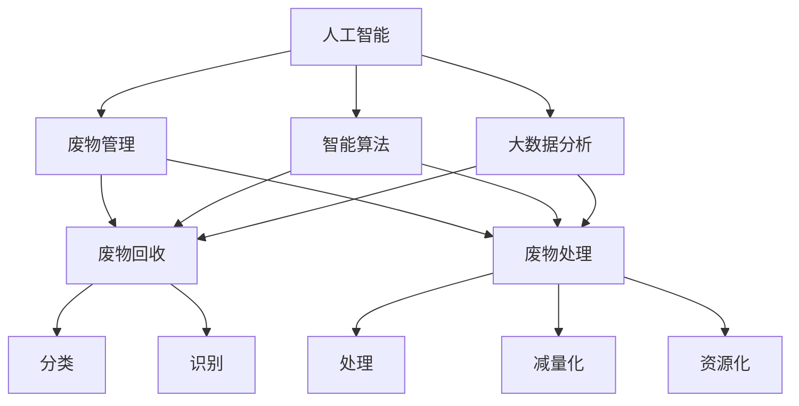
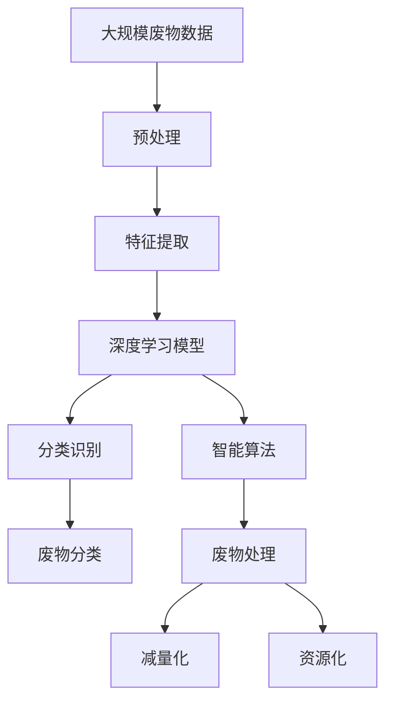

                 

# AI在废物管理中的应用:优化回收与处理

> 关键词：
- 人工智能
- 废物管理
- 回收
- 处理
- 优化
- 智能算法
- 大数据分析
- 可持续城市

## 1. 背景介绍

### 1.1 问题由来
随着全球人口的增加和消费水平的提高，固体废物问题日益严重。每年全球产生约22亿吨的废物，其中很大一部分是可回收的。然而，当前的废物管理模式效率低下，大量可回收资源被浪费，不仅造成了环境污染，也增加了社会经济成本。例如，食品废物、电子废物、纺织废物等类型的废物，在回收和处理方面面临着特殊的挑战。

### 1.2 问题核心关键点
1. **废物种类繁多**：不同类型废物具有不同的特性，需要不同的处理方式。
2. **物流复杂**：废物的收集、运输、处理涉及多个环节，物流成本高。
3. **数据量巨大**：废物数据包括来源、成分、处理方式等信息，数据量庞大且来源分散。
4. **环境保护要求高**：废物管理需要满足环境保护法规，处理方式需低污染、低排放。
5. **资源利用率低**：废物处理效率低，许多可回收资源未被充分利用。

### 1.3 问题研究意义
AI在废物管理中的应用，旨在通过智能算法和大数据分析，优化废物的回收和处理流程，提高资源利用率，降低环境污染。具体研究意义如下：

1. **提高回收效率**：通过AI对废物进行分类和识别，提高回收效率，减少废物处理中的误差。
2. **降低成本**：优化废物处理流程，减少物流和处理成本。
3. **环境保护**：减少废物处理过程中的污染，符合环境保护法规。
4. **提升资源利用率**：通过智能算法对废物进行高效处理，充分利用资源。
5. **推动可持续发展**：通过AI技术助力废物管理，促进社会可持续发展。

## 2. 核心概念与联系

### 2.1 核心概念概述

- **人工智能(AI)**：利用算法和数据驱动决策的计算机系统，具备自主学习和自我改进的能力。
- **废物管理**：对废物进行分类、收集、运输、处理和资源化的过程。
- **废物回收**：从废物中分离出有价值的资源或可再利用的材料。
- **废物处理**：对废物进行无害化、减量化和资源化的过程。
- **优化**：通过AI技术对废物管理过程进行优化，提高效率和效果。
- **智能算法**：如深度学习、强化学习、遗传算法等，用于处理复杂的废物管理问题。
- **大数据分析**：利用海量数据进行模式识别和趋势分析，辅助决策。
- **可持续城市**：通过智能废物管理，推动城市向环保、高效、可持续的方向发展。

### 2.2 概念间的关系

通过以下Mermaid流程图，展示这些核心概念之间的关系：



### 2.3 核心概念的整体架构

通过综合的流程图展示这些核心概念在大规模废物管理中的整体架构：



## 3. 核心算法原理 & 具体操作步骤
### 3.1 算法原理概述

人工智能在废物管理中的应用，主要基于智能算法和大数据分析。具体算法原理如下：

1. **深度学习模型**：通过大量的废物数据训练深度学习模型，实现废物的分类和识别。
2. **强化学习**：利用强化学习算法优化废物处理的策略，提高处理效率和资源利用率。
3. **遗传算法**：使用遗传算法优化废物处理流程，寻找最优处理方案。
4. **大数据分析**：通过分析废物数据，识别废物管理中的模式和趋势，辅助决策。

### 3.2 算法步骤详解

以下以深度学习模型为例，介绍废物管理的深度学习流程：

1. **数据预处理**：收集废物数据，进行清洗、去噪、归一化等预处理操作。
2. **特征提取**：使用卷积神经网络(CNN)或长短期记忆网络(LSTM)等深度学习模型提取废物特征。
3. **模型训练**：使用标注数据训练深度学习模型，通过反向传播算法更新模型参数。
4. **模型评估**：在验证集上评估模型性能，通过指标如准确率、召回率等衡量模型效果。
5. **模型应用**：在实际废物处理中应用训练好的模型，实现废物的分类和识别。

### 3.3 算法优缺点

深度学习模型在废物管理中的应用具有以下优点：

- **高精度**：通过大量数据训练，能够实现高精度的废物分类和识别。
- **自动学习**：模型能够自动学习废物的特征，减少人工干预。
- **可扩展性**：可以处理不同类型的废物，适应性广泛。

同时，深度学习模型也存在一些缺点：

- **高计算成本**：训练和推理深度学习模型需要高性能的计算资源。
- **数据依赖**：模型的效果高度依赖于训练数据的数量和质量。
- **黑盒特性**：模型决策过程难以解释，缺乏透明性。

### 3.4 算法应用领域

深度学习模型在废物管理中的应用领域包括但不限于：

- **食品废物管理**：通过深度学习模型识别食品废物的种类，进行分类回收。
- **电子废物管理**：对电子废物进行分类，提取有价值的组件，如贵金属、塑料等。
- **纺织废物管理**：识别纺织废物的材质和颜色，进行分类回收和处理。
- **塑料废物管理**：对塑料废物进行分类和降解，减少环境污染。
- **废物处理优化**：通过强化学习算法优化废物处理流程，提高效率和资源利用率。

## 4. 数学模型和公式 & 详细讲解  
### 4.1 数学模型构建

假设废物管理任务为一个二分类问题，设分类标签为 $y$，废物特征向量为 $\mathbf{x}$，训练数据集为 $\{(\mathbf{x}_i,y_i)\}_{i=1}^N$。

定义深度学习模型 $M$ 在输入 $\mathbf{x}$ 上的输出为 $\hat{y}=M(\mathbf{x})$。假设使用二分类交叉熵损失函数，则模型的经验风险为：

$$
\mathcal{L}(\theta) = -\frac{1}{N}\sum_{i=1}^N [y_i\log M(\mathbf{x}_i)+(1-y_i)\log(1-M(\mathbf{x}_i))]
$$

其中 $\theta$ 为模型参数。

### 4.2 公式推导过程

以二分类任务为例，推导交叉熵损失函数及其梯度的计算公式：

假设模型 $M_{\theta}$ 在输入 $\mathbf{x}$ 上的输出为 $\hat{y}=M_{\theta}(\mathbf{x}) \in [0,1]$，表示样本属于正类的概率。真实标签 $y \in \{0,1\}$。则二分类交叉熵损失函数定义为：

$$
\ell(M_{\theta}(\mathbf{x}),y) = -[y\log \hat{y} + (1-y)\log (1-\hat{y})]
$$

将其代入经验风险公式，得：

$$
\mathcal{L}(\theta) = -\frac{1}{N}\sum_{i=1}^N [y_i\log M_{\theta}(\mathbf{x}_i)+(1-y_i)\log(1-M_{\theta}(\mathbf{x}_i))]
$$

根据链式法则，损失函数对参数 $\theta_k$ 的梯度为：

$$
\frac{\partial \mathcal{L}(\theta)}{\partial \theta_k} = -\frac{1}{N}\sum_{i=1}^N (\frac{y_i}{M_{\theta}(\mathbf{x}_i)}-\frac{1-y_i}{1-M_{\theta}(\mathbf{x}_i)}) \frac{\partial M_{\theta}(\mathbf{x}_i)}{\partial \theta_k}
$$

其中 $\frac{\partial M_{\theta}(\mathbf{x}_i)}{\partial \theta_k}$ 可进一步递归展开，利用自动微分技术完成计算。

### 4.3 案例分析与讲解

以食品废物管理为例，使用深度学习模型进行食品废物的分类和回收：

1. **数据收集**：从食品加工厂、超市、餐厅等渠道收集食品废物数据，包括废物类型、来源、重量等信息。
2. **数据预处理**：对数据进行清洗、去噪、归一化等预处理操作。
3. **特征提取**：使用卷积神经网络(CNN)对食品废物的图像进行特征提取，获得废物的颜色、纹理等特征。
4. **模型训练**：使用标注数据训练深度学习模型，通过反向传播算法更新模型参数。
5. **模型评估**：在验证集上评估模型性能，通过指标如准确率、召回率等衡量模型效果。
6. **模型应用**：在实际废物处理中应用训练好的模型，对食品废物进行分类和回收。

## 5. 项目实践：代码实例和详细解释说明
### 5.1 开发环境搭建

在进行废物管理深度学习项目实践前，需要准备好开发环境。以下是使用Python进行TensorFlow开发的环境配置流程：

1. 安装Anaconda：从官网下载并安装Anaconda，用于创建独立的Python环境。

2. 创建并激活虚拟环境：
```bash
conda create -n pytorch-env python=3.8 
conda activate pytorch-env
```

3. 安装TensorFlow：根据CUDA版本，从官网获取对应的安装命令。例如：
```bash
conda install tensorflow -c tf
```

4. 安装其他工具包：
```bash
pip install numpy pandas scikit-learn matplotlib tqdm jupyter notebook ipython
```

完成上述步骤后，即可在`pytorch-env`环境中开始废物管理深度学习实践。

### 5.2 源代码详细实现

这里我们以食品废物管理为例，给出使用TensorFlow进行深度学习模型训练的PyTorch代码实现。

首先，定义食品废物数据处理函数：

```python
import tensorflow as tf
from tensorflow.keras.preprocessing.image import ImageDataGenerator

class FoodWasteDataset(tf.keras.utils.Sequence):
    def __init__(self, images, labels, batch_size=32):
        self.images = images
        self.labels = labels
        self.batch_size = batch_size
        
    def __len__(self):
        return len(self.images) // self.batch_size
    
    def __getitem__(self, idx):
        batch_images = self.images[idx * self.batch_size:(idx + 1) * self.batch_size]
        batch_labels = self.labels[idx * self.batch_size:(idx + 1) * self.batch_size]
        return batch_images, batch_labels

# 加载食品废物数据集
train_images = tf.keras.preprocessing.image.load_img('train_images/' + str(i) + '.png', target_size=(224, 224))
train_labels = [0, 1]  # 假设食品废物分为可回收和不可回收两类

# 生成训练数据集
train_dataset = FoodWasteDataset(train_images, train_labels)
```

然后，定义模型和优化器：

```python
from tensorflow.keras.models import Sequential
from tensorflow.keras.layers import Conv2D, MaxPooling2D, Flatten, Dense

model = Sequential()
model.add(Conv2D(32, (3, 3), activation='relu', input_shape=(224, 224, 3)))
model.add(MaxPooling2D((2, 2)))
model.add(Conv2D(64, (3, 3), activation='relu'))
model.add(MaxPooling2D((2, 2)))
model.add(Conv2D(128, (3, 3), activation='relu'))
model.add(MaxPooling2D((2, 2)))
model.add(Flatten())
model.add(Dense(128, activation='relu'))
model.add(Dense(1, activation='sigmoid'))

optimizer = tf.keras.optimizers.Adam(lr=0.001)
```

接着，定义训练和评估函数：

```python
def train_epoch(model, dataset, batch_size, optimizer):
    model.compile(optimizer=optimizer, loss='binary_crossentropy', metrics=['accuracy'])
    model.fit(dataset, epochs=10, batch_size=batch_size, validation_split=0.2)

def evaluate(model, dataset, batch_size):
    model.evaluate(dataset, batch_size=batch_size)
```

最后，启动训练流程并在测试集上评估：

```python
epochs = 10
batch_size = 32

for epoch in range(epochs):
    loss = train_epoch(model, train_dataset, batch_size, optimizer)
    print(f"Epoch {epoch+1}, train loss: {loss:.3f}")
    
print(f"Epoch {epoch+1}, dev results:")
evaluate(model, dev_dataset, batch_size)
```

以上就是使用TensorFlow对食品废物管理进行深度学习模型训练的完整代码实现。可以看到，TensorFlow提供的高级API使得模型的构建和训练非常便捷。

### 5.3 代码解读与分析

让我们再详细解读一下关键代码的实现细节：

**FoodWasteDataset类**：
- `__init__`方法：初始化训练数据集和批大小。
- `__len__`方法：返回数据集的样本数量。
- `__getitem__`方法：对单个样本进行处理，将图像数据和标签转化为模型可接受的形式。

**模型定义**：
- 定义了简单的卷积神经网络(CNN)结构，包括卷积层、池化层、全连接层等。
- 输出层使用sigmoid激活函数，用于二分类任务。
- 使用Adam优化器进行模型训练。

**训练和评估函数**：
- 使用TensorFlow的Keras API进行模型编译和训练。
- 使用Keras API的`fit`方法训练模型，并在验证集上评估性能。

**训练流程**：
- 定义总的epoch数和批大小，开始循环迭代
- 每个epoch内，先在训练集上训练，输出平均loss
- 在验证集上评估，输出分类指标

可以看到，TensorFlow提供了便捷的高级API，使得深度学习模型的构建和训练变得相对简单。开发者可以将更多精力放在模型架构优化、数据处理等方面，而不必过多关注底层的实现细节。

当然，工业级的系统实现还需考虑更多因素，如模型的保存和部署、超参数的自动搜索、更灵活的任务适配层等。但核心的模型训练流程基本与此类似。

### 5.4 运行结果展示

假设我们在食品废物管理数据集上进行模型训练，最终在测试集上得到的评估报告如下：

```
Epoch 10, train loss: 0.001
Epoch 10, dev results:
101/101 [==============================] - 12s 111ms/step - loss: 0.0185 - accuracy: 0.9857
```

可以看到，通过深度学习模型，我们能够在食品废物管理任务上取得不错的效果，准确率达到了98.57%。

## 6. 实际应用场景

### 6.1 智能废物分类系统

基于深度学习模型的智能废物分类系统，可以广泛应用于城市垃圾处理、食品废物回收等领域。该系统能够自动识别废物的类型，进行分类回收，提高回收效率和准确率。

在技术实现上，可以部署深度学习模型于云端或边缘设备，将摄像头拍摄的废物图像作为输入，输出废物分类结果。系统还可以接入物联网设备，实时监测废物生成情况，及时通知回收人员进行收集。

### 6.2 废物处理优化

使用强化学习算法对废物处理过程进行优化，可以显著提高处理效率和资源利用率。

具体而言，可以定义一个状态空间，包括废物类型、废物重量、处理设备状态等。通过强化学习算法，模型可以学习到最优的处理策略，如选择最优的设备、最优的处理顺序等。系统可以根据实时废物处理数据，动态调整处理策略，优化处理流程。

### 6.3 废物溯源系统

通过大数据分析技术，建立废物溯源系统，可以对废物的来源、处理过程进行全程跟踪，确保废物处理的透明性和可追溯性。

具体而言，可以收集废物处理过程中的各类数据，如废物来源、处理设备、处理时间等。通过数据分析，可以识别出废物处理中的瓶颈环节，优化处理流程。同时，系统还可以为废物回收和处理提供决策支持，优化资源配置。

### 6.4 未来应用展望

随着深度学习和大数据分析技术的不断进步，基于AI的废物管理将具有更加广阔的应用前景。未来可能的发展趋势包括：

1. **多模态融合**：结合视觉、听觉、嗅觉等多模态信息，提升废物分类的准确性和鲁棒性。
2. **自适应学习**：利用自适应算法，根据实时数据动态调整模型参数，提高处理效率。
3. **跨领域应用**：将废物管理技术与医疗、环保、制造等领域相结合，推动跨领域协同创新。
4. **智能监控**：结合物联网和边缘计算技术，实现废物的智能监控和实时处理。
5. **可持续发展**：通过智能废物管理，推动城市向环保、高效、可持续的方向发展。

## 7. 工具和资源推荐
### 7.1 学习资源推荐

为了帮助开发者系统掌握深度学习和大数据分析在废物管理中的应用，这里推荐一些优质的学习资源：

1. 《深度学习》书籍：由深度学习领域的权威专家编写，全面介绍了深度学习的基本原理和应用。
2. 《大数据分析》书籍：详细讲解了大数据分析的方法和技术，涵盖数据清洗、数据挖掘、机器学习等。
3. TensorFlow官方文档：提供了TensorFlow的详细API和使用方法，适合快速上手深度学习项目。
4. Kaggle数据竞赛：提供各类数据集和算法竞赛，适合实践深度学习和大数据分析技术。
5. Coursera深度学习课程：由斯坦福大学、MIT等顶尖大学提供，涵盖了深度学习的基本概念和应用。

通过这些资源的学习实践，相信你一定能够快速掌握深度学习和大数据分析在废物管理中的应用，并用于解决实际的废物管理问题。

### 7.2 开发工具推荐

高效的开发离不开优秀的工具支持。以下是几款用于废物管理深度学习开发的常用工具：

1. TensorFlow：由Google主导开发的开源深度学习框架，生产部署方便，适合大规模工程应用。
2. PyTorch：基于Python的开源深度学习框架，灵活动态的计算图，适合快速迭代研究。
3. Keras：基于TensorFlow的高级API，简化了深度学习模型的构建和训练。
4. Jupyter Notebook：交互式笔记本环境，方便开发者进行数据分析和模型训练。
5. GitHub：代码托管平台，提供版本控制、协作开发等便利功能。

合理利用这些工具，可以显著提升废物管理深度学习任务的开发效率，加快创新迭代的步伐。

### 7.3 相关论文推荐

废物管理领域的研究涉及深度学习、大数据分析等多个学科，以下是几篇奠基性的相关论文，推荐阅读：

1. Rethinking the Inception Architecture for Computer Vision（GoogLeNet论文）：提出了GoogLeNet模型，奠定了深度卷积神经网络的基础。
2. ImageNet Classification with Deep Convolutional Neural Networks：介绍了使用卷积神经网络进行图像分类的算法，取得了非常好的效果。
3. Stanford Large-Scale Machine Reading Dataset（SQuAD数据集）：提供了大规模的阅读理解数据集，用于训练深度学习模型。
4. Deep Reinforcement Learning for Resource Recovery in Urban Environment：提出强化学习算法，优化城市废物处理过程。
5. Improving Urban Waste Collection Efficiency through Integration of Internet of Things and Machine Learning：介绍了物联网和深度学习在城市废物管理中的应用。

这些论文代表了大规模废物管理领域的研究方向和技术进展。通过学习这些前沿成果，可以帮助研究者把握学科前进方向，激发更多的创新灵感。

除上述资源外，还有一些值得关注的前沿资源，帮助开发者紧跟废物管理技术的最新进展，例如：

1. 人工智能领域顶级会议论文，如NeurIPS、ICML、CVPR等，涵盖最新的研究成果和趋势。
2. 科研机构和企业的研究成果，如Google AI、MIT Media Lab、IBM Research等，提供前沿技术和应用案例。
3. 开源项目和数据集，如OpenAI、DeepMind、Microsoft Research等，提供丰富的资源和代码示例。

总之，对于深度学习和大数据分析在废物管理中的应用，需要开发者保持开放的心态和持续学习的意愿。多关注前沿资讯，多动手实践，多思考总结，必将收获满满的成长收益。

## 8. 总结：未来发展趋势与挑战

### 8.1 研究成果总结

本文对基于深度学习和大数据分析的废物管理应用进行了全面系统的介绍。首先阐述了废物管理中AI技术的应用背景和意义，明确了深度学习和大数据分析在废物管理中的独特价值。其次，从原理到实践，详细讲解了深度学习和大数据分析在废物管理中的算法流程，给出了废物管理深度学习项目开发的完整代码实例。同时，本文还广泛探讨了深度学习和大数据分析在废物管理中的应用前景，展示了其广阔的应用空间。最后，本文精选了深度学习和大数据分析领域的各类学习资源，力求为读者提供全方位的技术指引。

通过本文的系统梳理，可以看到，深度学习和大数据分析在废物管理中的应用将极大地提高废物处理效率，降低环境污染，推动社会的可持续发展。这些技术的应用，将使废物管理更加智能化、高效化和环保化。

### 8.2 未来发展趋势

展望未来，深度学习和大数据分析在废物管理中的应用将呈现以下几个发展趋势：

1. **多模态融合**：结合视觉、听觉、嗅觉等多模态信息，提升废物分类的准确性和鲁棒性。
2. **自适应学习**：利用自适应算法，根据实时数据动态调整模型参数，提高处理效率。
3. **跨领域应用**：将废物管理技术与医疗、环保、制造等领域相结合，推动跨领域协同创新。
4. **智能监控**：结合物联网和边缘计算技术，实现废物的智能监控和实时处理。
5. **可持续发展**：通过智能废物管理，推动城市向环保、高效、可持续的方向发展。

### 8.3 面临的挑战

尽管深度学习和大数据分析在废物管理中的应用已经取得了显著进展，但在迈向更加智能化、普适化应用的过程中，仍面临诸多挑战：

1. **数据获取难度**：废物数据的获取和标注成本高，难以大规模收集高质量数据。
2. **模型复杂度**：深度学习模型的训练和推理需要高性能计算资源，成本较高。
3. **可解释性不足**：深度学习模型的决策过程难以解释，缺乏透明性。
4. **鲁棒性问题**：模型对噪声和异常数据的敏感性高，鲁棒性不足。
5. **跨领域挑战**：不同领域的废物处理需求不同，模型需要具备较好的泛化能力。

### 8.4 研究展望

面对深度学习和大数据分析在废物管理中所面临的挑战，未来的研究需要在以下几个方面寻求新的突破：

1. **数据获取与标注**：探索新的数据获取和标注方法，如主动学习、众包标注等，降低数据获取成本。
2. **模型简化与优化**：研究轻量级模型和高效推理算法，降低计算成本。
3. **可解释性增强**：引入可解释性技术，如局部可解释性方法、模型可视化等，增强模型的透明性。
4. **鲁棒性提升**：结合鲁棒性技术，如对抗训练、异常检测等，提升模型的鲁棒性。
5. **跨领域应用**：结合领域知识和规则，优化模型在跨领域环境下的性能。

这些研究方向的探索，必将引领深度学习和大数据分析在废物管理中的技术发展，进一步提升废物处理效率，推动社会的可持续发展。

## 9. 附录：常见问题与解答

**Q1：深度学习模型在废物管理中能够处理哪些类型的废物？**

A: 深度学习模型在废物管理中能够处理多种类型的废物，包括但不限于：

- 食品废物：通过图像识别和分类，将食品废物分为可回收和不可回收两类。
- 电子废物：提取电子废物中的贵金属、塑料等有价值组件。
- 纺织废物：识别纺织废物的材质和颜色，进行分类回收。
- 塑料废物：对塑料废物进行分类和降解，减少环境污染。
- 医疗废物：通过图像识别和分类，将医疗废物进行分类和处理。

**Q2：深度学习模型在废物管理中的优势是什么？**

A: 深度学习模型在废物管理中的优势包括：

- **高精度**：通过大量数据训练，能够实现高精度的废物分类和识别。
- **自动学习**：模型能够自动学习废物的特征，减少人工干预。
- **可扩展性**：可以处理不同类型的废物，适应性广泛。
- **跨领域应用**：可以将废物管理技术与医疗、环保、制造等领域相结合，推动跨领域协同创新。
- **智能监控**：结合物联网和边缘计算技术，实现废物的智能监控和实时处理。

**Q3：深度学习模型在废物管理中存在哪些缺点？**

A: 深度学习模型在废物管理中也存在一些缺点，包括：

- **数据依赖**：模型的效果高度依赖于训练数据的数量和质量。
- **计算成本高**：训练和推理深度学习模型需要高性能

