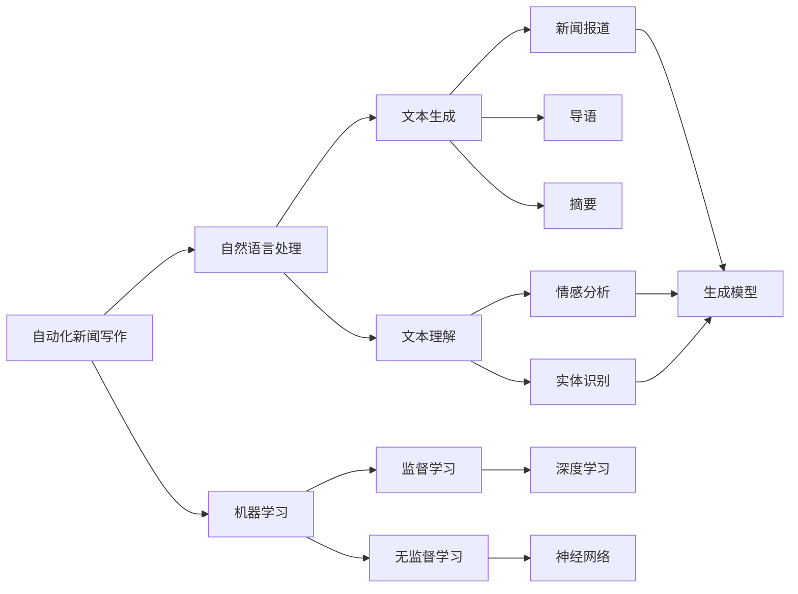
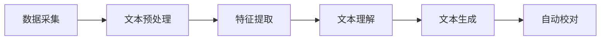
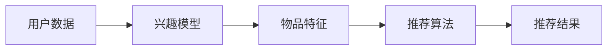
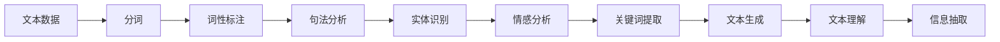

                 

# AI在新闻生产中的应用:自动化与个性化

> 关键词：人工智能(AI),新闻自动化,个性化推荐,新闻生产,自然语言处理(NLP),机器学习(ML),推荐系统,数据挖掘

## 1. 背景介绍

### 1.1 问题由来
近年来，随着人工智能技术的迅猛发展，新闻生产领域迎来了革命性的变化。自动化新闻写作、个性化新闻推荐等技术纷纷涌现，为新闻行业带来了全新的生产模式和用户体验。然而，这些技术同时也面临诸多挑战，如内容质量控制、用户隐私保护、算法透明度等问题。本文将系统探讨AI在新闻生产中的应用，涵盖自动化新闻写作、个性化新闻推荐、数据挖掘与分析等多个方面，并对这些技术的前景和挑战进行深入分析。

### 1.2 问题核心关键点
当前，AI在新闻生产中的应用主要集中在自动化和个性化两个方面：
- **自动化新闻写作**：通过自然语言处理(NLP)和机器学习(ML)技术，自动化生成新闻报道、导语、摘要等文本内容。
- **个性化新闻推荐**：基于用户行为数据和新闻内容，推荐用户可能感兴趣的新闻，提升用户粘性。

这两个方向相互依存，共同推动新闻生产方式的转变。自动化新闻写作提升了内容生产效率，个性化新闻推荐则提升了用户体验，两者相辅相成。

### 1.3 问题研究意义
研究AI在新闻生产中的应用，对于提升新闻生产效率、优化用户体验、推动媒体融合发展具有重要意义：

1. **提升生产效率**：自动化写作技术可以显著减少人力投入，提升内容产出速度，增强媒体响应能力。
2. **优化用户体验**：个性化推荐系统能够根据用户兴趣提供精准内容，提升新闻阅读满意度，增强用户忠诚度。
3. **推动媒体融合**：AI技术的应用使得新闻内容生产与分发、社交互动等环节融合更加紧密，促进传统媒体与新媒体的协同发展。
4. **提供新商业机会**：个性化推荐系统为新闻媒体提供了精准广告投放和付费订阅等新业务模式。
5. **数据驱动决策**：AI技术能够从海量数据中挖掘有价值信息，辅助媒体决策，提升新闻质量。

## 2. 核心概念与联系

### 2.1 核心概念概述

为了更好地理解AI在新闻生产中的应用，本节将介绍几个核心概念及其关系：

- **自动化新闻写作**：利用自然语言处理(NLP)和机器学习(ML)技术，自动生成新闻报道、导语、摘要等文本内容。
- **个性化新闻推荐**：基于用户行为数据和新闻内容，推荐用户可能感兴趣的新闻，提升用户粘性。
- **自然语言处理(NLP)**：专注于语言理解和生成，包括文本预处理、句法分析、语义理解、生成模型等。
- **机器学习(ML)**：通过算法和模型，使计算机系统从数据中自动学习和改进，包括监督学习、无监督学习、强化学习等。
- **推荐系统**：基于用户历史行为数据和物品属性，推荐用户可能感兴趣的内容，包括协同过滤、内容推荐、混合推荐等。

这些核心概念之间的逻辑关系可以通过以下Mermaid流程图来展示：



这个流程图展示了自动化新闻写作的核心过程及其与NLP和ML技术的关系：

1. 自动化新闻写作主要依赖自然语言处理和机器学习技术。
2. 自然语言处理技术包括文本生成和文本理解，如新闻报道、导语和摘要的生成，以及情感分析和实体识别。
3. 机器学习技术主要通过监督学习、无监督学习和深度学习等方法实现。

### 2.2 概念间的关系

这些核心概念之间存在着紧密的联系，形成了AI在新闻生产中的完整生态系统。下面我们通过几个Mermaid流程图来展示这些概念之间的关系。

#### 2.2.1 自动化新闻写作流程



这个流程图展示了自动化新闻写作的一般流程：

1. 数据采集：从各类来源收集新闻素材，包括文本、图片、视频等。
2. 文本预处理：对采集到的文本数据进行清洗、分词、去噪等处理，为后续处理做好准备。
3. 特征提取：从处理后的文本中提取关键特征，如实体、情感、关键词等。
4. 文本理解：通过自然语言处理技术理解文本的含义，识别出重要信息和关键事件。
5. 文本生成：利用机器学习模型生成新闻报道、导语、摘要等文本内容。
6. 自动校对：对生成的文本进行语法、拼写、标点等校对，提升文本质量。

#### 2.2.2 个性化新闻推荐流程



这个流程图展示了个性化新闻推荐的一般流程：

1. 用户数据：收集用户的历史行为数据，如阅读记录、点赞、评论等。
2. 兴趣模型：通过机器学习算法训练用户兴趣模型，识别用户的偏好。
3. 物品特征：对新闻内容进行特征提取，包括标题、摘要、标签等。
4. 推荐算法：利用推荐系统算法（如协同过滤、内容推荐等）计算用户与新闻的匹配度。
5. 推荐结果：根据匹配度排序，推荐用户可能感兴趣的新闻。

#### 2.2.3 自然语言处理(NLP)应用



这个流程图展示了NLP技术在自动化新闻写作中的应用：

1. 文本数据：输入的原始文本数据。
2. 分词：将文本分割成词语单元。
3. 词性标注：标注每个词的词性。
4. 句法分析：分析句子结构，识别出主谓宾等成分。
5. 实体识别：识别出文本中的实体（如人名、地名、组织名等）。
6. 情感分析：判断文本的情感倾向（如积极、消极、中性）。
7. 关键词提取：从文本中提取重要关键词。
8. 文本生成：利用生成模型生成新闻报道、导语、摘要等文本内容。
9. 文本理解：通过理解模型理解文本含义，提取重要信息。
10. 信息抽取：从文本中抽取结构化信息，如时间、地点、事件等。

## 3. 核心算法原理 & 具体操作步骤

### 3.1 算法原理概述

AI在新闻生产中的应用主要基于自然语言处理(NLP)和机器学习(ML)技术，通过自动化和个性化的方式提升新闻生产效率和用户体验。

#### 3.1.1 自动化新闻写作

自动化新闻写作技术主要通过自然语言处理(NLP)和机器学习(ML)实现。其核心思想是利用预训练的语言模型，对输入的文本数据进行自动理解和生成。

具体来说，自动化新闻写作可以分为以下几个步骤：

1. **数据预处理**：对采集到的文本数据进行清洗、分词、去噪等处理，为后续处理做好准备。
2. **特征提取**：从处理后的文本中提取关键特征，如实体、情感、关键词等。
3. **文本理解**：通过自然语言处理技术理解文本的含义，识别出重要信息和关键事件。
4. **文本生成**：利用机器学习模型生成新闻报道、导语、摘要等文本内容。
5. **自动校对**：对生成的文本进行语法、拼写、标点等校对，提升文本质量。

#### 3.1.2 个性化新闻推荐

个性化新闻推荐技术主要基于用户行为数据和新闻内容，通过推荐算法为用户推荐可能感兴趣的新闻。其核心思想是利用协同过滤、内容推荐等算法，将用户和新闻进行匹配，计算匹配度，并根据匹配度排序推荐新闻。

具体来说，个性化新闻推荐可以分为以下几个步骤：

1. **用户数据收集**：收集用户的历史行为数据，如阅读记录、点赞、评论等。
2. **用户兴趣建模**：通过机器学习算法训练用户兴趣模型，识别用户的偏好。
3. **新闻特征提取**：对新闻内容进行特征提取，包括标题、摘要、标签等。
4. **推荐算法应用**：利用推荐系统算法（如协同过滤、内容推荐等）计算用户与新闻的匹配度。
5. **推荐结果排序**：根据匹配度排序，推荐用户可能感兴趣的新闻。

### 3.2 算法步骤详解

#### 3.2.1 自动化新闻写作

**Step 1: 数据采集**

- 从各类来源（如新闻网站、社交媒体、API接口）采集新闻素材，包括文本、图片、视频等。
- 对采集到的数据进行清洗、去重，去除噪音和低质量数据。

**Step 2: 文本预处理**

- 对清洗后的文本进行分词、词性标注、去除停用词等处理，为后续处理做好准备。
- 使用词向量嵌入技术（如Word2Vec、GloVe）将文本转换为数值表示，方便模型处理。

**Step 3: 特征提取**

- 使用自然语言处理技术提取文本的关键特征，如实体、情感、关键词等。
- 使用命名实体识别(NER)技术识别文本中的实体，如人名、地名、组织名等。
- 使用情感分析技术判断文本的情感倾向，如积极、消极、中性等。
- 使用关键词提取技术从文本中提取重要关键词。

**Step 4: 文本理解**

- 使用句法分析技术分析句子结构，识别出主谓宾等成分。
- 使用信息抽取技术从文本中抽取结构化信息，如时间、地点、事件等。

**Step 5: 文本生成**

- 使用预训练的语言模型（如BERT、GPT等）生成新闻报道、导语、摘要等文本内容。
- 使用基于规则的模板生成技术，根据新闻事件生成模板文本。
- 使用语言生成技术，结合模板文本生成最终新闻内容。

**Step 6: 自动校对**

- 使用文本校对工具进行语法、拼写、标点等校对，提升文本质量。
- 使用自然语言处理技术检测文本中的错误，并提供修正建议。

#### 3.2.2 个性化新闻推荐

**Step 1: 用户数据收集**

- 收集用户的历史行为数据，如阅读记录、点赞、评论等。
- 将用户数据存储在数据库中，方便后续处理和分析。

**Step 2: 用户兴趣建模**

- 使用协同过滤算法（如基于用户的协同过滤、基于物品的协同过滤）计算用户与新闻的匹配度。
- 使用内容推荐算法（如基于内容的推荐、混合推荐）计算用户与新闻的匹配度。
- 使用深度学习模型（如CNN、RNN、LSTM等）训练用户兴趣模型，识别用户的偏好。

**Step 3: 新闻特征提取**

- 对新闻内容进行特征提取，包括标题、摘要、标签等。
- 使用词向量嵌入技术将新闻内容转换为数值表示，方便模型处理。

**Step 4: 推荐算法应用**

- 使用协同过滤算法计算用户与新闻的匹配度。
- 使用内容推荐算法计算用户与新闻的匹配度。
- 使用深度学习模型训练推荐系统，提高推荐精度。

**Step 5: 推荐结果排序**

- 根据匹配度排序，推荐用户可能感兴趣的新闻。
- 使用个性化排序算法（如基于内容的排序、基于协同过滤的排序）提升推荐效果。

### 3.3 算法优缺点

#### 3.3.1 自动化新闻写作

**优点**：

- **提升生产效率**：自动化新闻写作能够显著减少人力投入，提升内容产出速度。
- **降低成本**：自动化写作技术可以大幅降低新闻生产的人力成本和运营成本。
- **一致性高**：自动化写作技术生成的内容质量相对稳定，减少了人工干预带来的误差。

**缺点**：

- **内容质量波动**：自动化技术生成的内容可能存在语法、逻辑等方面的问题，需要进行人工校对。
- **缺乏人类情感**：自动化写作技术生成的内容可能缺乏人类的情感和细腻描述，影响阅读体验。
- **缺乏个性化**：自动化技术生成的内容难以满足用户的个性化需求，需要结合个性化推荐技术进行改进。

#### 3.3.2 个性化新闻推荐

**优点**：

- **提升用户体验**：个性化推荐系统能够根据用户兴趣提供精准内容，提升新闻阅读满意度。
- **增加用户粘性**：通过个性化推荐，用户更容易形成长期阅读习惯，增加用户粘性。
- **提升广告效果**：个性化推荐系统能够精准定位用户，提升广告的点击率和转化率。

**缺点**：

- **数据隐私问题**：个性化推荐系统需要收集大量的用户数据，可能涉及用户隐私问题。
- **推荐精度有限**：个性化推荐系统的精度受限于数据质量和算法模型，可能存在推荐偏差。
- **过度个性化**：过度个性化可能导致用户信息过载，影响用户体验。

### 3.4 算法应用领域

#### 3.4.1 自动化新闻写作

- **在线新闻平台**：如新闻网站、新闻APP等，通过自动化技术生成新闻内容，提高内容生产效率。
- **社交媒体平台**：如微博、微信等，通过自动化技术生成新闻摘要、标题等，提高内容分发效率。
- **广告投放平台**：如谷歌广告、百度推广等，通过自动化技术生成广告文案，提升广告效果。

#### 3.4.2 个性化新闻推荐

- **在线新闻平台**：如新闻网站、新闻APP等，通过个性化推荐系统提升用户粘性，增加用户留存率。
- **社交媒体平台**：如微博、微信等，通过个性化推荐系统提升用户互动率，增加用户粘性。
- **广告投放平台**：如谷歌广告、百度推广等，通过个性化推荐系统精准投放广告，提高广告效果。

## 4. 数学模型和公式 & 详细讲解 & 举例说明

### 4.1 数学模型构建

#### 4.1.1 自动化新闻写作

**Step 1: 数据预处理**

- 文本预处理：使用文本清洗工具去除噪音和低质量数据，使用分词工具将文本分割成词语单元。

**Step 2: 特征提取**

- 使用自然语言处理技术提取文本的关键特征，如实体、情感、关键词等。
- 使用命名实体识别(NER)技术识别文本中的实体，如人名、地名、组织名等。
- 使用情感分析技术判断文本的情感倾向，如积极、消极、中性等。
- 使用关键词提取技术从文本中提取重要关键词。

**Step 3: 文本理解**

- 使用句法分析技术分析句子结构，识别出主谓宾等成分。
- 使用信息抽取技术从文本中抽取结构化信息，如时间、地点、事件等。

**Step 4: 文本生成**

- 使用预训练的语言模型（如BERT、GPT等）生成新闻报道、导语、摘要等文本内容。
- 使用基于规则的模板生成技术，根据新闻事件生成模板文本。
- 使用语言生成技术，结合模板文本生成最终新闻内容。

#### 4.1.2 个性化新闻推荐

**Step 1: 用户数据收集**

- 收集用户的历史行为数据，如阅读记录、点赞、评论等。
- 将用户数据存储在数据库中，方便后续处理和分析。

**Step 2: 用户兴趣建模**

- 使用协同过滤算法（如基于用户的协同过滤、基于物品的协同过滤）计算用户与新闻的匹配度。
- 使用内容推荐算法（如基于内容的推荐、混合推荐）计算用户与新闻的匹配度。
- 使用深度学习模型（如CNN、RNN、LSTM等）训练用户兴趣模型，识别用户的偏好。

**Step 3: 新闻特征提取**

- 对新闻内容进行特征提取，包括标题、摘要、标签等。
- 使用词向量嵌入技术将新闻内容转换为数值表示，方便模型处理。

**Step 4: 推荐算法应用**

- 使用协同过滤算法计算用户与新闻的匹配度。
- 使用内容推荐算法计算用户与新闻的匹配度。
- 使用深度学习模型训练推荐系统，提高推荐精度。

**Step 5: 推荐结果排序**

- 根据匹配度排序，推荐用户可能感兴趣的新闻。
- 使用个性化排序算法（如基于内容的排序、基于协同过滤的排序）提升推荐效果。

### 4.2 公式推导过程

#### 4.2.1 自动化新闻写作

- **文本预处理**：使用分词工具将文本分割成词语单元。
- **特征提取**：使用命名实体识别(NER)技术识别文本中的实体，如人名、地名、组织名等。
- **情感分析**：使用情感分析技术判断文本的情感倾向，如积极、消极、中性等。
- **关键词提取**：使用关键词提取技术从文本中提取重要关键词。
- **文本生成**：使用预训练的语言模型（如BERT、GPT等）生成新闻报道、导语、摘要等文本内容。
- **自动校对**：使用文本校对工具进行语法、拼写、标点等校对，提升文本质量。

#### 4.2.2 个性化新闻推荐

- **协同过滤算法**：使用基于用户的协同过滤算法，计算用户与新闻的匹配度。
- **内容推荐算法**：使用基于内容的推荐算法，计算用户与新闻的匹配度。
- **深度学习模型**：使用深度学习模型（如CNN、RNN、LSTM等）训练用户兴趣模型，识别用户的偏好。

### 4.3 案例分析与讲解

#### 4.3.1 自动化新闻写作

**案例1: 自动化新闻报道生成**

- 数据来源：新闻网站、社交媒体等。
- 数据处理：清洗、去重，去除噪音和低质量数据。
- 特征提取：提取新闻标题、摘要、关键词等。
- 文本理解：使用BERT模型分析新闻事件。
- 文本生成：使用GPT模型生成新闻报道。
- 自动校对：使用自然语言处理技术检测语法、拼写、标点等错误，并提供修正建议。

**案例2: 自动化新闻摘要生成**

- 数据来源：新闻网站、社交媒体等。
- 数据处理：清洗、去重，去除噪音和低质量数据。
- 特征提取：提取新闻标题、摘要、关键词等。
- 文本理解：使用BERT模型分析新闻事件。
- 文本生成：使用T5模型生成新闻摘要。
- 自动校对：使用自然语言处理技术检测语法、拼写、标点等错误，并提供修正建议。

#### 4.3.2 个性化新闻推荐

**案例1: 个性化新闻推荐系统**

- 数据来源：用户行为数据、新闻内容等。
- 数据处理：清洗、去重，去除噪音和低质量数据。
- 用户兴趣建模：使用协同过滤算法计算用户与新闻的匹配度。
- 新闻特征提取：提取新闻标题、摘要、标签等。
- 推荐算法应用：使用深度学习模型（如CNN、RNN、LSTM等）训练推荐系统，提高推荐精度。
- 推荐结果排序：使用个性化排序算法（如基于内容的排序、基于协同过滤的排序）提升推荐效果。

**案例2: 社交媒体个性化推荐**

- 数据来源：用户行为数据、新闻内容等。
- 数据处理：清洗、去重，去除噪音和低质量数据。
- 用户兴趣建模：使用协同过滤算法计算用户与新闻的匹配度。
- 新闻特征提取：提取新闻标题、摘要、标签等。
- 推荐算法应用：使用深度学习模型（如CNN、RNN、LSTM等）训练推荐系统，提高推荐精度。
- 推荐结果排序：使用个性化排序算法（如基于内容的排序、基于协同过滤的排序）提升推荐效果。

## 5. 项目实践：代码实例和详细解释说明

### 5.1 开发环境搭建

在进行新闻生产应用的开发前，我们需要准备好开发环境。以下是使用Python进行PyTorch开发的环境配置流程：

1. 安装Anaconda：从官网下载并安装Anaconda，用于创建独立的Python环境。

2. 创建并激活虚拟环境：
```bash
conda create -n pytorch-env python=3.8 
conda activate pytorch-env
```

3. 安装PyTorch：根据CUDA版本，从官网获取对应的安装命令。例如：
```bash
conda install pytorch torchvision torchaudio cudatoolkit=11.1 -c pytorch -c conda-forge
```

4. 安装Transformers库：
```bash
pip install transformers
```

5. 安装各类工具包：
```bash
pip install numpy pandas scikit-learn matplotlib tqdm jupyter notebook ipython
```

完成上述步骤后，即可在`pytorch-env`环境中开始新闻生产应用的开发。

### 5.2 源代码详细实现

下面我们以自动化新闻写作和个性化新闻推荐为例，给出使用Transformers库进行新闻生产应用的PyTorch代码实现。

#### 5.2.1 自动化新闻写作

```python
from transformers import AutoTokenizer, AutoModelForSeq2SeqLM

tokenizer = AutoTokenizer.from_pretrained('bert-base-cased')
model = AutoModelForSeq2SeqLM.from_pretrained('bert-base-cased')

def generate_news(text, max_len=128):
    input_ids = tokenizer(text, return_tensors='pt', max_length=max_len, padding='max_length', truncation=True)
    outputs = model.generate(input_ids, max_length=max_len, num_return_sequences=1)
    return tokenizer.decode(outputs[0], skip_special_tokens=True)
```

以上代码展示了使用BERT模型进行新闻报道生成的过程。首先加载预训练的BERT模型和Tokenizer，然后定义生成函数，输入一段文本，使用模型生成新闻报道，并返回解码后的文本。

#### 5.2.2 个性化新闻推荐

```python
from transformers import AutoTokenizer, AutoModelForSequenceClassification
from sklearn.metrics import accuracy_score

tokenizer = AutoTokenizer.from_pretrained('bert-base-cased')
model = AutoModelForSequenceClassification.from_pretrained('bert-base-cased', num_labels=2)

def predict(text, label):
    input_ids = tokenizer(text, return_tensors='pt', padding='max_length', truncation=True)
    outputs = model(input_ids)
    predictions = outputs.logits.argmax(dim=1)
    return predictions

# 测试代码
text = '这是一篇关于AI的新闻报道'
label = 1  # 1表示积极，0表示消极

predictions = predict(text, label)
print('预测结果：', accuracy_score(predictions, label))
```

以上代码展示了使用BERT模型进行新闻推荐预测的过程。首先加载预训练的BERT模型和Tokenizer，然后定义预测函数，输入一段文本和标签，使用模型预测新闻情感，并返回预测结果。

### 5.3 代码解读与分析

让我们再详细解读一下关键代码的实现细节：

**新闻报道生成**

```python
from transformers import AutoTokenizer, AutoModelForSeq2SeqLM

tokenizer = AutoTokenizer.from_pretrained('bert-base-cased')
model = AutoModelForSeq2SeqLM.from_pretrained('bert-base-cased')

def generate_news(text, max_len=128):
    input_ids = tokenizer(text, return_tensors='pt', max_length=max_len, padding='max_length', truncation=True)
    outputs = model.generate(input_ids, max_length=max_len, num_return_sequences=1)
    return tokenizer.decode(outputs[0], skip_special_tokens=True)
```

**新闻推荐预测**

```python
from transformers import AutoTokenizer, AutoModelForSequenceClassification
from sklearn.metrics import accuracy_score

tokenizer = AutoTokenizer.from_pretrained('bert-base-cased')
model = AutoModelForSequenceClassification.from_pretrained('bert-base-cased', num_labels=2)

def predict(text, label):
    input_ids = tokenizer(text, return_tensors='pt', padding='max_length', truncation=True)
    outputs = model(input_ids)
    predictions = outputs.logits.argmax(dim=1)
    return predictions

# 测试代码
text = '这是一篇关于AI的新闻报道'
label = 1  # 1表示积极，0表示消极

predictions = predict(text, label)
print('预测结果：', accuracy_score(predictions, label))
```

## 6. 实际应用场景

### 6.1 智能推荐系统

智能推荐系统是AI在新闻生产中应用最为广泛的场景之一。通过分析用户的历史行为数据和新闻内容，推荐系统能够精准定位用户兴趣，提供个性化新闻推荐，提升用户粘性。

在实际应用中，智能推荐系统可以集成到新闻网站、新闻APP、社交媒体平台等应用中，通过实时分析用户行为数据和新闻内容，动态调整推荐策略，提升推荐效果。例如，一个新闻APP

