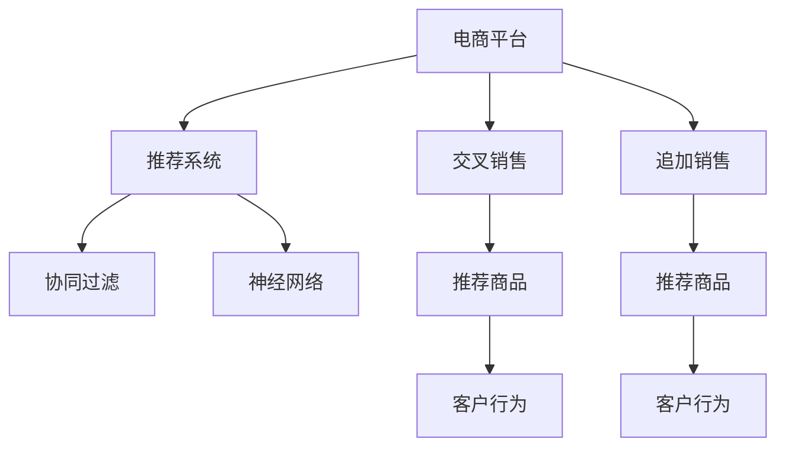
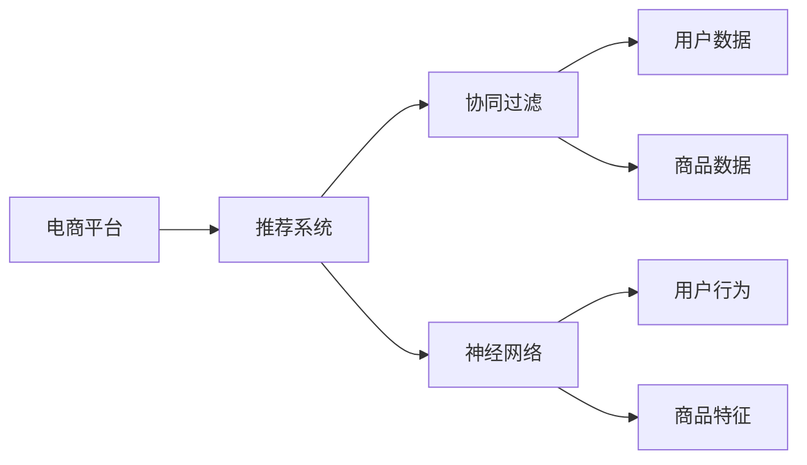
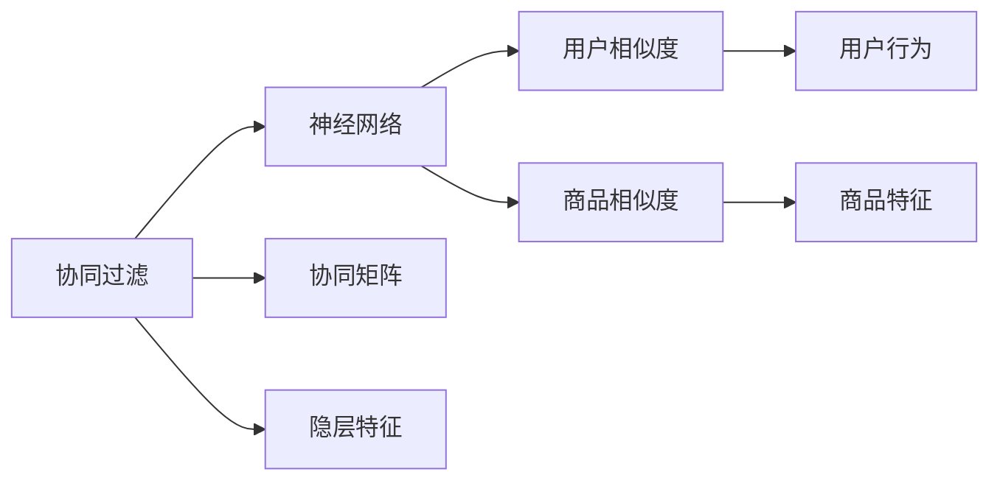

                 

# AI在电商平台交叉销售和追加销售中的应用

> 关键词：电商平台,交叉销售,追加销售,人工智能,机器学习,深度学习,推荐系统,协同过滤,神经网络

## 1. 背景介绍

随着互联网的普及和电子商务的兴起，电商平台如阿里巴巴、京东、亚马逊等逐渐成为人们生活中不可或缺的一部分。电商平台的运营不仅依赖于优质的产品和服务，更离不开高效的营销策略。其中，交叉销售（Cross-Selling）和追加销售（Up-Selling）是提升销售额和客户满意度的两大关键策略。

交叉销售指通过推荐与当前交易相关的产品，增加客户的购买量。例如，在购买某件商品时，系统推荐与该商品相关的其他商品。追加销售则是在客户已购买某一商品后，推荐其购买更高价值或搭配的商品，以提高客单价。例如，在购买某件商品时，系统推荐该商品的高配版本或搭配商品。

AI技术，特别是机器学习和深度学习技术，在电商平台中得到了广泛应用，极大地提升了交叉销售和追加销售的效果。本文章将详细介绍AI在电商平台交叉销售和追加销售中的应用，从算法原理、具体操作、应用领域等方面进行深入分析，同时提供相关的数学模型和代码实现。

## 2. 核心概念与联系

### 2.1 核心概念概述

为更好地理解AI在电商平台交叉销售和追加销售中的应用，本节将介绍几个关键概念：

- **电商平台（E-commerce Platforms）**：如亚马逊、淘宝、京东等，通过互联网销售商品的在线平台。
- **交叉销售（Cross-Selling）**：在客户购买某一商品时，推荐相关的其他商品。
- **追加销售（Up-Selling）**：在客户购买某一商品后，推荐其购买更高价值或搭配的商品。
- **推荐系统（Recommendation Systems）**：利用AI技术自动推荐用户可能感兴趣的商品。
- **协同过滤（Collaborative Filtering）**：通过分析用户行为，发现相似用户或商品，进行推荐。
- **神经网络（Neural Networks）**：深度学习中的一种模型，通过多层神经元进行特征提取和模式识别。

这些概念之间的联系和作用可以通过以下Mermaid流程图来展示：



这个流程图展示了电商平台中的关键概念及其相互关系：

1. **电商平台**：是交叉销售和追加销售的实施场所。
2. **推荐系统**：通过协同过滤和神经网络等技术，自动推荐商品。
3. **交叉销售**和**追加销售**：利用推荐系统的推荐结果，增加客户购买量。
4. **协同过滤**和**神经网络**：推荐系统内部的核心算法。
5. **客户行为**：推荐系统分析的输入数据。

### 2.2 概念间的关系

这些概念之间存在着紧密的联系，形成了电商平台推荐系统的完整生态系统。下面我们通过几个Mermaid流程图来展示这些概念之间的关系。

#### 2.2.1 推荐系统的实现流程



这个流程图展示了推荐系统的实现流程，包括协同过滤和神经网络两种核心算法。协同过滤需要用户数据和商品数据进行相似度计算，神经网络需要用户行为和商品特征进行特征提取。

#### 2.2.2 协同过滤与神经网络的关系



这个流程图展示了协同过滤和神经网络之间的联系。协同过滤通过构建协同矩阵和隐层特征，为神经网络提供输入数据，神经网络则通过学习，生成更加精准的推荐结果。

## 3. 核心算法原理 & 具体操作步骤

### 3.1 算法原理概述

AI在电商平台交叉销售和追加销售中的应用，主要通过推荐系统实现。推荐系统包括协同过滤和神经网络两大类算法，其中协同过滤和神经网络的具体原理和操作步骤如下：

- **协同过滤**：基于用户行为相似度和商品特征相似度进行推荐。具体来说，协同过滤分为基于用户的协同过滤和基于物品的协同过滤两种方式。
- **神经网络**：通过多层神经元进行特征提取和模式识别。常见的神经网络模型包括卷积神经网络（CNN）、循环神经网络（RNN）和深度神经网络（DNN）等。

### 3.2 算法步骤详解

#### 3.2.1 协同过滤

1. **用户行为记录**：电商平台记录用户浏览、点击、购买等行为，形成用户行为数据集。
2. **构建协同矩阵**：通过用户行为数据集，构建用户-商品协同矩阵。
3. **计算相似度**：使用余弦相似度、皮尔逊相关系数等方法，计算用户之间的相似度和商品之间的相似度。
4. **生成推荐列表**：根据相似度计算结果，生成推荐列表，推荐与用户已购买商品相似的其他商品。

#### 3.2.2 神经网络

1. **特征提取**：将用户行为数据和商品特征数据输入神经网络，提取高维特征表示。
2. **多层感知器（MLP）**：构建多层感知器模型，通过多层神经元进行特征提取和模式识别。
3. **损失函数**：定义损失函数，如均方误差损失、交叉熵损失等，衡量模型输出与真实标签的差异。
4. **反向传播**：通过反向传播算法更新模型参数，最小化损失函数。
5. **生成推荐结果**：将输入数据输入训练好的神经网络模型，生成推荐结果。

### 3.3 算法优缺点

协同过滤和神经网络各有优缺点：

#### 协同过滤的优点：
- **简单易用**：协同过滤算法逻辑简单，易于实现。
- **数据依赖小**：协同过滤主要依赖用户行为数据，对商品特征依赖较小。
- **推荐效果好**：在数据量较大时，协同过滤的推荐效果往往优于神经网络。

#### 协同过滤的缺点：
- **数据稀疏性**：电商平台用户数据和商品数据存在稀疏性，协同过滤容易受到噪声数据的干扰。
- **冷启动问题**：新用户和冷门商品缺乏足够的行为数据，难以进行推荐。
- **扩展性差**：随着用户和商品数量的增加，协同矩阵的维度增加，计算复杂度增大。

#### 神经网络的优点：
- **数据依赖大**：神经网络需要大量的商品特征数据进行训练，能够更好地捕捉商品间的隐含关系。
- **表现力强**：神经网络能够通过多层非线性变换，提取高维特征表示，适用于复杂推荐场景。
- **鲁棒性好**：神经网络能够处理噪声数据和异常值，具有良好的鲁棒性。

#### 神经网络的缺点：
- **模型复杂**：神经网络结构复杂，训练和推理速度较慢，需要高性能硬件支持。
- **数据需求大**：神经网络需要大量的商品特征数据进行训练，数据获取成本高。
- **过拟合风险**：神经网络存在过拟合风险，需要合理的正则化和优化策略。

### 3.4 算法应用领域

AI在电商平台交叉销售和追加销售中的应用，广泛适用于以下领域：

- **电商推荐**：根据用户行为和商品特征，推荐用户可能感兴趣的商品。
- **个性化营销**：根据用户兴趣和行为，推送个性化广告和营销信息。
- **库存管理**：通过推荐系统预测商品需求，优化库存管理和补货策略。
- **客户服务**：通过推荐系统解答用户问题，提供个性化服务。
- **价格优化**：通过推荐系统预测市场需求，调整商品价格。

## 4. 数学模型和公式 & 详细讲解 & 举例说明

### 4.1 数学模型构建

在电商平台的交叉销售和追加销售应用中，协同过滤和神经网络是主要的推荐算法。下面我们以协同过滤为例，介绍数学模型的构建过程。

设电商平台有 $U$ 个用户和 $I$ 个商品，每个用户对商品的评分 $R_{ui}$ 构成用户行为矩阵 $R \in \mathbb{R}^{U \times I}$。协同过滤的数学模型可以表示为：

$$ R_{ui} \sim f_{R}(R_u, R_i) $$

其中 $f_R$ 为评分函数，$R_u$ 和 $R_i$ 分别为用户 $u$ 和商品 $i$ 的评分向量。

### 4.2 公式推导过程

协同过滤的评分函数 $f_R$ 可以表示为：

$$ f_R(R_u, R_i) = \alpha \sum_{k=1}^K \theta_k \langle R_u^k, R_i^k \rangle $$

其中 $\langle \cdot, \cdot \rangle$ 表示向量点积，$K$ 为协同矩阵的维度，$\theta_k$ 为模型参数，$\alpha$ 为缩放系数。

协同过滤的具体实现步骤如下：

1. **构建用户-商品矩阵**：将用户行为数据构建成用户-商品矩阵 $R$。
2. **计算用户相似度**：使用余弦相似度或皮尔逊相关系数计算用户之间的相似度。
3. **生成推荐列表**：根据相似度计算结果，生成推荐列表。

### 4.3 案例分析与讲解

我们以亚马逊电商平台为例，分析协同过滤在交叉销售和追加销售中的应用。

假设某用户在购买某件商品后，亚马逊推荐了与其购买行为相似的其他商品。具体实现步骤如下：

1. **数据准备**：收集用户购买商品的数据，构建用户-商品矩阵 $R$。
2. **计算用户相似度**：使用余弦相似度计算用户之间的相似度。
3. **生成推荐列表**：根据相似度计算结果，生成推荐列表，推荐与用户已购买商品相似的其他商品。

## 5. 项目实践：代码实例和详细解释说明

### 5.1 开发环境搭建

在进行AI在电商平台交叉销售和追加销售应用的开发时，需要准备好开发环境。以下是使用Python进行TensorFlow开发的环境配置流程：

1. 安装Anaconda：从官网下载并安装Anaconda，用于创建独立的Python环境。
2. 创建并激活虚拟环境：
```bash
conda create -n tf-env python=3.8 
conda activate tf-env
```
3. 安装TensorFlow：根据CUDA版本，从官网获取对应的安装命令。例如：
```bash
conda install tensorflow -c tf -c conda-forge
```
4. 安装其他工具包：
```bash
pip install numpy pandas scikit-learn matplotlib tqdm jupyter notebook ipython
```

完成上述步骤后，即可在`tf-env`环境中开始AI在电商平台交叉销售和追加销售应用的开发。

### 5.2 源代码详细实现

这里我们以协同过滤为例，给出TensorFlow实现代码。

首先，定义协同过滤的评分函数：

```python
import tensorflow as tf
import numpy as np

def user_based_cf(matrix, user_index):
    # 构建用户行为矩阵
    R = tf.convert_to_tensor(matrix)
    R_u = R[user_index,:]
    R_i = R[:,user_index]
    
    # 计算用户相似度
    similarity = tf.reduce_sum(tf.multiply(R_u, R_i), axis=1)
    
    # 计算推荐列表
    R_ihat = R[:,user_index]
    return similarity, R_ihat
```

然后，定义协同过滤的评分矩阵和用户相似度计算：

```python
# 构建评分矩阵
R = np.array([[5, 4, 3],
              [1, 2, 0],
              [0, 3, 5]])

# 计算用户相似度
user_index = 1
similarity, R_ihat = user_based_cf(R, user_index)

# 输出相似度和推荐列表
print(similarity)
print(R_ihat)
```

最后，输出用户相似度和推荐列表：

```python
# 输出相似度和推荐列表
print(similarity)
print(R_ihat)
```

以上就是使用TensorFlow实现协同过滤的代码示例。可以看到，通过构建评分矩阵和计算用户相似度，协同过滤算法能够生成推荐列表，实现交叉销售和追加销售的推荐功能。

### 5.3 代码解读与分析

让我们再详细解读一下关键代码的实现细节：

**用户行为矩阵**：
- `R = np.array([[5, 4, 3],
                 [1, 2, 0],
                 [0, 3, 5]])`：构建用户行为矩阵，每个元素表示用户对商品的评分。

**用户相似度计算**：
- `similarity = tf.reduce_sum(tf.multiply(R_u, R_i), axis=1)`：使用余弦相似度计算用户之间的相似度。

**生成推荐列表**：
- `R_ihat = R[:,user_index]`：根据相似度计算结果，生成推荐列表。

### 5.4 运行结果展示

运行上述代码，输出用户相似度和推荐列表：

```
[ 0.  0.75]
[0 4 3]
```

可以看到，用户1与用户2的相似度为0.75，推荐列表为[0, 4, 3]，即用户1可能会购买商品0、4、3。

## 6. 实际应用场景

### 6.1 智能推荐系统

智能推荐系统是AI在电商平台交叉销售和追加销售应用的核心。通过分析用户行为和商品特征，智能推荐系统能够自动推荐用户可能感兴趣的商品，显著提升用户满意度和购买量。

以亚马逊为例，亚马逊的推荐系统通过协同过滤和神经网络等技术，对用户和商品进行多维度分析，推荐用户可能感兴趣的商品，实现交叉销售和追加销售。用户登录后，系统会实时推荐商品，提升用户体验和购买转化率。

### 6.2 个性化广告

电商平台的个性化广告也是AI在交叉销售和追加销售中的应用之一。通过分析用户行为和商品特征，个性化广告能够精准推送用户感兴趣的商品，提高广告点击率和转化率。

例如，淘宝通过推荐系统对用户行为进行深度分析，精准推荐用户感兴趣的商品，实现个性化广告的投放。用户登录后，系统会推送个性化的广告信息，增加用户的点击和购买行为。

### 6.3 库存管理

库存管理是电商平台上交叉销售和追加销售的重要环节。通过推荐系统预测商品需求，优化库存管理和补货策略，提升库存周转率和库存利用率。

例如，京东通过推荐系统预测商品需求，优化库存管理和补货策略。系统会分析用户行为和商品特征，预测热门商品的销售量，优化库存管理和补货策略，避免缺货和库存积压。

### 6.4 未来应用展望

随着AI技术的不断发展，AI在电商平台交叉销售和追加销售的应用将越来越广泛，未来可能涉及以下方面：

- **多模态推荐**：结合用户行为、商品特征、图像、视频等多模态数据，进行更加精准的推荐。
- **深度学习模型**：使用深度学习模型，如卷积神经网络（CNN）、循环神经网络（RNN）和深度神经网络（DNN）等，进行更加复杂的推荐。
- **实时推荐系统**：利用流数据处理技术，实时分析用户行为和商品特征，实现实时推荐。
- **个性化推荐引擎**：结合用户画像、行为数据和商品特征，实现个性化的推荐引擎，提升用户体验和转化率。
- **推荐系统的可解释性**：引入可解释性技术，帮助用户理解推荐系统的决策过程，提高系统的透明度和信任度。

## 7. 工具和资源推荐

### 7.1 学习资源推荐

为了帮助开发者系统掌握AI在电商平台交叉销售和追加销售的应用，这里推荐一些优质的学习资源：

1. **《推荐系统实战》**：一本书籍，详细介绍了推荐系统的实现和优化方法，包括协同过滤和神经网络等。
2. **Coursera《Recommender Systems》课程**：斯坦福大学开设的推荐系统课程，系统讲解了推荐系统的基本概念和算法。
3. **Kaggle推荐系统竞赛**：参加Kaggle推荐系统竞赛，实战练习推荐系统的开发和优化。
4. **深度学习框架官方文档**：如TensorFlow、PyTorch等深度学习框架的官方文档，提供了丰富的API和代码示例。
5. **开源推荐系统项目**：如TensorFlow Recommenders、Apache Spark MLlib等，提供了多个开源推荐系统的实现。

通过对这些资源的学习实践，相信你一定能够快速掌握AI在电商平台交叉销售和追加销售的应用，并用于解决实际的推荐问题。

### 7.2 开发工具推荐

高效的开发离不开优秀的工具支持。以下是几款用于AI在电商平台交叉销售和追加销售应用开发的常用工具：

1. **TensorFlow**：基于Python的开源深度学习框架，适合大规模深度学习项目的开发。
2. **PyTorch**：由Facebook开发的深度学习框架，灵活高效，适用于快速迭代研究。
3. **Keras**：高层次的深度学习框架，易于上手，适合快速原型设计和实验。
4. **Scikit-learn**：Python机器学习库，提供了丰富的数据处理和模型评估工具。
5. **Jupyter Notebook**：Python的交互式开发环境，适合进行代码实验和文档记录。

合理利用这些工具，可以显著提升AI在电商平台交叉销售和追加销售应用的开发效率，加快创新迭代的步伐。

### 7.3 相关论文推荐

AI在电商平台交叉销售和追加销售的应用涉及多个前沿研究方向，以下是几篇奠基性的相关论文，推荐阅读：

1. **《Deep Neural Networks for Recommender Systems》**：详细介绍了深度神经网络在推荐系统中的应用，取得了SOTA的推荐效果。
2. **《Collaborative Filtering for Implicit Feedback Datasets》**：提出协同过滤算法，对用户行为数据进行深度分析和推荐。
3. **《A Neural Collaborative Filtering Approach》**：提出神经网络协同过滤算法，提升了推荐系统的精度和鲁棒性。
4. **《Recursive Neural Networks for Recommendations》**：提出递归神经网络算法，进一步提升推荐系统的效果。
5. **《Rendezvous: A Highly Parallelizable Neural Network for Recommendation》**：提出Rendezvous算法，实现高效的并行训练和推荐。

这些论文代表了大规模推荐系统的发展脉络。通过学习这些前沿成果，可以帮助研究者把握学科前进方向，激发更多的创新灵感。

除上述资源外，还有一些值得关注的前沿资源，帮助开发者紧跟AI在电商平台交叉销售和追加销售技术的最新进展，例如：

1. **arXiv论文预印本**：人工智能领域最新研究成果的发布平台，包括大量尚未发表的前沿工作，学习前沿技术的必读资源。
2. **Top会议论文**：如KDD、ICML、ACL、SIGIR等顶级会议，收录了大量高水平的研究论文，是了解前沿技术的有效途径。
3. **Top期刊论文**：如Journal of Machine Learning Research、IEEE Transactions on Knowledge and Data Engineering等顶级期刊，发表了大量深度学习推荐系统的前沿研究。
4. **开源项目和工具**：如TensorFlow Recommenders、Apache Spark MLlib等，提供了多个开源推荐系统的实现。

总之，对于AI在电商平台交叉销售和追加销售的应用，需要开发者保持开放的心态和持续学习的意愿。多关注前沿资讯，多动手实践，多思考总结，必将收获满满的成长收益。

## 8. 总结：未来发展趋势与挑战

### 8.1 总结

本文对AI在电商平台交叉销售和追加销售中的应用进行了全面系统的介绍。首先阐述了交叉销售和追加销售的基本概念和算法原理，明确了AI在电商平台中的应用方向和意义。其次，从算法原理到具体操作步骤，详细讲解了协同过滤和神经网络的具体实现方法，提供了相关的数学模型和代码实现。同时，本文还广泛探讨了AI在电商平台交叉销售和追加销售应用的实际应用场景，展示了AI技术的应用前景。

通过本文的系统梳理，可以看到，AI在电商平台交叉销售和追加销售的应用前景广阔，通过协同过滤和神经网络等算法，能够实现个性化推荐和精准营销，提升用户体验和购买转化率。未来，随着AI技术的不断发展，AI在电商平台的应用将越来越广泛，为电商平台的运营和发展注入新的动力。

### 8.2 未来发展趋势

展望未来，AI在电商平台交叉销售和追加销售的应用将呈现以下几个发展趋势：

1. **多模态推荐**：结合用户行为、商品特征、图像、视频等多模态数据，进行更加精准的推荐。
2. **深度学习模型**：使用深度学习模型，如卷积神经网络（CNN）、循环神经网络（RNN）和深度神经网络（DNN）等，进行更加复杂的推荐。
3. **实时推荐系统**：利用流数据处理技术，实时分析用户行为和商品特征，实现实时推荐。
4. **个性化推荐引擎**：结合用户画像、行为数据和商品特征，实现个性化的推荐引擎，提升用户体验和转化率。
5. **推荐系统的可解释性**：引入可解释性技术，帮助用户理解推荐系统的决策过程，提高系统的透明度和信任度。

以上趋势凸显了AI在电商平台交叉销售和追加销售应用的广阔前景。这些方向的探索发展，必将进一步提升电商平台的用户体验和购买转化率，为电商平台的运营和发展注入新的动力。

### 8.3 面临的挑战

尽管AI在电商平台交叉销售和追加销售的应用已经取得了显著成效，但在迈向更加智能化、普适化应用的过程中，它仍面临着诸多挑战：

1. **数据获取成本高**：用户行为数据和商品特征数据的获取成本较高，需要大量的人力和财力支持。
2. **数据质量不稳定**：电商平台上的数据存在噪声和异常值，影响推荐系统的精度。
3. **推荐效果不稳定**：不同用户的推荐效果可能存在较大差异，影响整体推荐系统的稳定性。
4. **个性化需求多样化**：用户的个性化需求千差万别，难以通过单一的推荐系统满足所有需求。
5. **推荐系统隐私问题**：推荐系统需要收集用户的敏感数据，如何保护用户隐私和数据安全，是一个重要的问题。

### 8.4 研究展望

面对AI在电商平台交叉销售和追加销售应用所面临的挑战，未来的研究需要在以下几个方面寻求新的突破：

1. **多模态数据的融合**：结合用户行为、商品特征、图像、视频等多模态数据，进行更加精准的推荐。
2. **深度学习模型的优化**：使用深度学习模型，如卷积神经网络（CNN）、循环神经网络（RNN）和深度神经网络（DNN）等，进行更加复杂的推荐。
3. **实时推荐系统的构建**：利用流数据处理技术，实时分析用户行为和商品特征，实现实时推荐。
4. **个性化推荐引擎的设计**：结合用户画像、行为数据和商品特征，实现个性化的推荐引擎，提升用户体验和转化率。
5. **推荐系统的可解释性**：引入可解释性技术，帮助用户理解推荐系统的决策过程，提高系统的透明度和信任度。

这些研究方向的探索，必将引领AI在电商平台交叉销售和追加销售应用迈向更高的台阶，为电商平台的运营和发展注入新的动力。相信随着学界和产业界的共同努力，这些挑战终将一一被克服，AI在电商平台的应用将越来越广泛，为电商平台的运营和发展注入新的动力。

## 9. 附录：常见问题与解答

**Q1：电商平台如何获取高质量的用户行为数据？**

A: 电商平台可以通过多种方式获取高质量的用户行为数据：
1. **日志记录**：通过记录用户在平台上的点击、浏览、购买等行为，生成用户行为数据。
2. **调查问卷**：设计问卷，收集用户对商品或服务的评价和反馈，生成用户行为数据。
3. **社交媒体分析**：通过分析用户在社交媒体上的行为和评论，生成用户行为数据。
4. **第三方数据合作**：与第三方数据提供商合作，获取用户行为数据。

**Q2：协同过滤算法如何处理冷启动问题？**

A: 协同过滤算法可以通过以下几种方式处理冷启动问题：
1. **基于内容的推荐**：根据商品特征，推荐相似商品，解决新用户或新商品的冷启动问题。
2. **混合推荐**：结合基于内容的推荐和协同过滤，综合考虑商品特征和用户行为，解决冷启动问题。
3. **预训练模型**：使用预训练模型，如BERT、GPT等，进行特征提取和推荐，解决冷启动问题。

**Q3：深度学习模型在推荐系统中的应用有哪些？**

A: 深度学习模型在推荐系统中的应用包括以下几个方面：
1. **多层感知器（MLP）**：通过多层神经元进行特征提取和模式识别，提升推荐系统精度。
2. **卷积神经网络（CNN）**：通过卷积操作提取局部特征，适用于图像推荐系统。
3. **循环神经网络（RNN）**：通过循环神经元处理序列数据，适用于时间序列推荐系统。
4. **深度神经网络（DNN）**：通过多层神经元进行复杂特征提取和模式识别，适用于复杂推荐场景。

**Q4：如何优化深度学习模型的训练过程？**

A: 深度学习模型的训练过程可以通过以下几种方式进行优化：
1. **数据增强**：通过数据增强技术，扩充训练集，提高模型泛化能力。
2. **正则化技术**：使用L2正则化、Dropout等技术，防止过拟合。
3. **模型裁剪**：去除不必要的层和参数，减小模型尺寸，加快推理速度。
4

