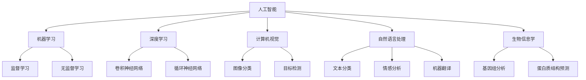
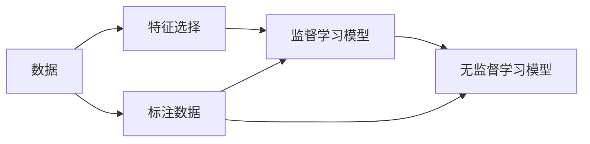
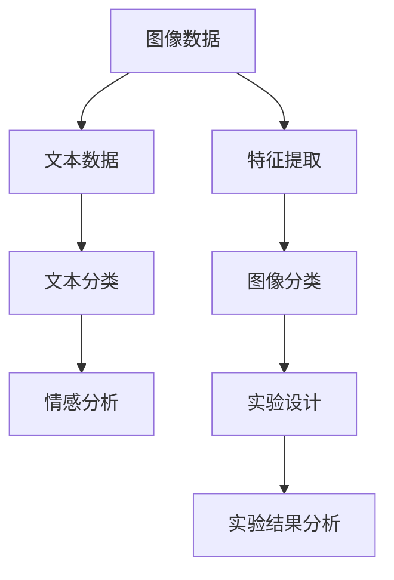
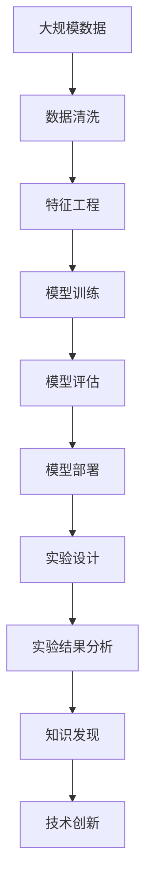

                 

# AI在科学研究中的应用

## 1. 背景介绍

### 1.1 问题由来
人工智能（AI）作为当今最前沿的技术之一，已经逐渐渗透到各个领域，包括科学研究。AI技术的迅猛发展，为科学研究带来了新的工具和方法，极大地提升了科研效率和准确性。在生物信息学、天文学、材料科学、化学等多个学科，AI技术已经成为不可或缺的研究工具。本文将探讨AI在科学研究中的应用，包括其核心概念、算法原理、具体操作、数学模型、项目实践、实际应用场景、工具和资源推荐、未来发展趋势与挑战、常见问题与解答等。

### 1.2 问题核心关键点
AI在科学研究中的应用，主要体现在数据处理、模型构建、结果分析等方面。AI技术可以自动分析海量数据，发现隐藏的模式和规律，辅助研究人员进行科学发现。同时，AI还可以构建复杂的计算模型，预测实验结果，优化实验设计，提高科研效率。本文将从这些方面详细介绍AI在科学研究中的应用。

### 1.3 问题研究意义
AI在科学研究中的应用，对于提升科研效率、发现新知识、推动技术创新具有重要意义。AI技术可以处理和分析大量复杂的实验数据，从海量的文献中挖掘有价值的信息，辅助研究人员进行科学发现。通过AI技术的辅助，科学家们可以更快地进行实验设计，预测实验结果，优化实验过程，从而在更短的时间内取得更多的研究成果。同时，AI技术还可以在医学、环境科学等高风险领域，提供更为安全和精准的解决方案。

## 2. 核心概念与联系

### 2.1 核心概念概述

为更好地理解AI在科学研究中的应用，本节将介绍几个密切相关的核心概念：

- 人工智能（Artificial Intelligence, AI）：指通过算法和计算机程序模拟人类智能的技术，包括机器学习、自然语言处理、计算机视觉等方向。
- 机器学习（Machine Learning, ML）：指通过算法让计算机自动学习，不断优化模型以提高预测或决策的准确性。
- 深度学习（Deep Learning, DL）：指通过多层神经网络构建复杂模型，自动学习和提取数据特征的技术。
- 计算机视觉（Computer Vision, CV）：指通过算法让计算机识别、分析和理解图像和视频内容的技术。
- 自然语言处理（Natural Language Processing, NLP）：指让计算机理解和处理自然语言的技术，包括文本分类、情感分析、机器翻译等方向。
- 生物信息学（Bioinformatics）：指应用计算机技术分析和解读生物学数据，如基因序列、蛋白质结构等。

这些核心概念之间的逻辑关系可以通过以下Mermaid流程图来展示：



这个流程图展示了一些核心概念及其之间的关系：

1. 人工智能作为最广泛的概念，涵盖了机器学习、深度学习、计算机视觉、自然语言处理等多个方向。
2. 机器学习和深度学习是人工智能的两个重要分支，前者主要通过有监督学习进行模型优化，后者通过多层神经网络构建复杂模型。
3. 计算机视觉主要聚焦于图像和视频数据的处理和分析，包括图像分类、目标检测等。
4. 自然语言处理主要处理文本数据，包括文本分类、情感分析、机器翻译等。
5. 生物信息学主要应用计算机技术分析生物学数据，如基因组分析和蛋白质结构预测。

这些核心概念共同构成了AI在科学研究中的应用基础，为科研人员提供了强大的工具和方法。

### 2.2 概念间的关系

这些核心概念之间存在着紧密的联系，形成了AI在科学研究中的应用生态系统。下面我们通过几个Mermaid流程图来展示这些概念之间的关系。

#### 2.2.1 AI在科学研究中的应用范式


这个流程图展示了AI在科学研究中常用的应用范式，包括数据采集、数据清洗、特征工程、模型训练、模型评估、模型部署、实验设计、实验结果分析等步骤。

#### 2.2.2 机器学习与深度学习在科学研究中的应用



这个流程图展示了机器学习与深度学习在科学研究中的应用流程。从数据采集和特征选择开始，通过有监督或无监督学习模型训练，输出预测结果或潜在模式，并评估模型性能，最后部署模型进行实际应用。

#### 2.2.3 计算机视觉与自然语言处理在科学研究中的应用



这个流程图展示了计算机视觉与自然语言处理在科学研究中的应用。通过特征提取，构建图像分类和文本分类模型，辅助科研人员进行实验设计和结果分析。

### 2.3 核心概念的整体架构

最后，我们用一个综合的流程图来展示这些核心概念在大语言模型微调过程中的整体架构：



这个综合流程图展示了从数据采集到知识发现的完整过程。科学家们通过数据清洗、特征工程、模型训练、模型评估、模型部署等步骤，辅助实验设计和结果分析，从而发现新知识，推动技术创新。

## 3. 核心算法原理 & 具体操作步骤
### 3.1 算法原理概述

AI在科学研究中的应用，主要依赖于机器学习、深度学习和自然语言处理等算法。这些算法通过自动学习，发现数据中的隐藏模式和规律，辅助科研人员进行科学发现。本文将详细介绍这些算法的原理和操作步骤。

### 3.2 算法步骤详解

#### 3.2.1 机器学习算法步骤

机器学习算法的典型流程包括数据预处理、模型训练、模型评估和模型应用。具体步骤如下：

1. **数据预处理**：
   - 数据采集：获取所需数据集，包括实验数据、文献数据、公共数据等。
   - 数据清洗：去除噪声、填补缺失值、处理异常值等，保证数据质量。
   - 特征选择：从原始数据中提取有意义的特征，包括数值型、分类型等特征。

2. **模型训练**：
   - 选择模型：根据任务需求，选择合适的机器学习模型，如线性回归、决策树、支持向量机等。
   - 分割数据集：将数据集划分为训练集和测试集，一般使用80/20的比例。
   - 训练模型：使用训练集对模型进行优化，调整模型参数，使其最大化训练集上的表现。

3. **模型评估**：
   - 评估指标：根据任务需求，选择合适的评估指标，如准确率、召回率、F1分数等。
   - 验证模型：使用测试集对模型进行验证，评估模型在新数据上的表现。

4. **模型应用**：
   - 模型部署：将训练好的模型部署到实际应用环境中，如科研平台、实验室系统等。
   - 实时应用：在实际应用场景中，使用模型进行预测或决策，辅助科研人员进行实验设计、数据分析等工作。

#### 3.2.2 深度学习算法步骤

深度学习算法的典型流程包括数据预处理、模型训练、模型评估和模型应用。具体步骤如下：

1. **数据预处理**：
   - 数据采集：获取所需数据集，包括实验数据、文献数据、公共数据等。
   - 数据清洗：去除噪声、填补缺失值、处理异常值等，保证数据质量。
   - 特征选择：从原始数据中提取有意义的特征，包括数值型、分类型等特征。

2. **模型训练**：
   - 选择模型：根据任务需求，选择合适的深度学习模型，如卷积神经网络、循环神经网络等。
   - 分割数据集：将数据集划分为训练集和测试集，一般使用80/20的比例。
   - 训练模型：使用训练集对模型进行优化，调整模型参数，使其最大化训练集上的表现。

3. **模型评估**：
   - 评估指标：根据任务需求，选择合适的评估指标，如准确率、召回率、F1分数等。
   - 验证模型：使用测试集对模型进行验证，评估模型在新数据上的表现。

4. **模型应用**：
   - 模型部署：将训练好的模型部署到实际应用环境中，如科研平台、实验室系统等。
   - 实时应用：在实际应用场景中，使用模型进行预测或决策，辅助科研人员进行实验设计、数据分析等工作。

#### 3.2.3 自然语言处理算法步骤

自然语言处理算法的典型流程包括文本预处理、模型训练、模型评估和模型应用。具体步骤如下：

1. **文本预处理**：
   - 文本清洗：去除停用词、标点符号等，保证文本质量。
   - 分词处理：将文本分割成单词或短语，便于后续处理。
   - 向量化处理：将文本转换为数值型特征，便于模型处理。

2. **模型训练**：
   - 选择模型：根据任务需求，选择合适的自然语言处理模型，如文本分类模型、情感分析模型等。
   - 分割数据集：将数据集划分为训练集和测试集，一般使用80/20的比例。
   - 训练模型：使用训练集对模型进行优化，调整模型参数，使其最大化训练集上的表现。

3. **模型评估**：
   - 评估指标：根据任务需求，选择合适的评估指标，如准确率、召回率、F1分数等。
   - 验证模型：使用测试集对模型进行验证，评估模型在新数据上的表现。

4. **模型应用**：
   - 模型部署：将训练好的模型部署到实际应用环境中，如科研平台、实验室系统等。
   - 实时应用：在实际应用场景中，使用模型进行预测或决策，辅助科研人员进行实验设计、数据分析等工作。

### 3.3 算法优缺点

AI在科学研究中的应用，具有以下优点：

- **高效性**：AI算法可以处理和分析海量数据，发现隐藏的模式和规律，辅助科研人员进行科学发现。
- **自动化**：AI算法可以自动化完成数据清洗、特征选择、模型训练等步骤，节省科研人员的时间和精力。
- **精度高**：AI算法通过自动学习和优化，具有较高的预测和决策精度，可以辅助科研人员进行实验设计和数据分析。

同时，AI在科学研究中还存在以下缺点：

- **数据质量依赖**：AI算法的性能依赖于高质量的数据集，数据质量差可能导致模型性能下降。
- **模型复杂性**：AI算法通常需要构建复杂的模型，模型调试和优化较为困难。
- **解释性不足**：AI算法通常是"黑盒"模型，难以解释其内部工作机制和决策逻辑。

尽管存在这些缺点，但AI在科学研究中的应用已经成为不可逆转的趋势，具有巨大的应用潜力。未来，随着AI技术的不断进步，其优点将进一步凸显，缺点也将得到改善。

### 3.4 算法应用领域

AI在科学研究中的应用，已经涵盖了生物信息学、天文学、材料科学、化学等多个领域。具体应用领域包括：

- **生物信息学**：AI技术可以处理和分析海量基因组数据，辅助发现基因突变、疾病关联等生物信息。
- **天文学**：AI技术可以处理和分析宇宙观测数据，发现新天体、星系等宇宙现象。
- **材料科学**：AI技术可以预测材料性能，优化材料设计和制备过程，加速新材料的发现和应用。
- **化学**：AI技术可以预测化学反应结果，优化实验设计和合成路径，提高实验效率和成功率。

## 4. 数学模型和公式 & 详细讲解 & 举例说明

### 4.1 数学模型构建

AI在科学研究中的应用，主要依赖于机器学习、深度学习和自然语言处理等算法。这些算法通过自动学习，发现数据中的隐藏模式和规律，辅助科研人员进行科学发现。

#### 4.1.1 机器学习模型构建

机器学习模型通常包括线性回归、决策树、支持向量机等。以线性回归为例，其数学模型可以表示为：

$$
y = \theta^T x + b
$$

其中，$y$为预测结果，$x$为输入特征向量，$\theta$为模型参数，$b$为截距项。模型参数$\theta$的优化目标是最大化训练集的预测误差，可以通过梯度下降等优化算法实现。

#### 4.1.2 深度学习模型构建

深度学习模型通常包括卷积神经网络、循环神经网络等。以卷积神经网络为例，其数学模型可以表示为：

$$
h_{l+1} = \sigma(\mathbf{W}_lh_l + \mathbf{b}_l)
$$

其中，$h_{l+1}$为下一层的输入，$h_l$为当前层的输出，$\mathbf{W}_l$和$\mathbf{b}_l$为模型参数，$\sigma$为激活函数。深度学习模型通过多层次的特征提取和组合，实现对复杂数据的建模。

#### 4.1.3 自然语言处理模型构建

自然语言处理模型通常包括文本分类模型、情感分析模型等。以文本分类模型为例，其数学模型可以表示为：

$$
P(y_i|x) = \frac{\exp(x_i^T\theta_i)}{\sum_{j=1}^K \exp(x_j^T\theta_j)}
$$

其中，$x$为文本特征向量，$\theta_i$为模型参数，$y_i$为文本类别。自然语言处理模型通过自动学习和优化，发现文本数据中的隐藏模式和规律，辅助科研人员进行文本分析和分类。

### 4.2 公式推导过程

#### 4.2.1 机器学习公式推导

以线性回归为例，推导模型参数$\theta$的优化目标函数。假设训练集为$(x_1, y_1), (x_2, y_2), \ldots, (x_n, y_n)$，其中$x_i$为输入特征向量，$y_i$为预测结果。模型参数$\theta$的优化目标是最大化训练集的预测误差，可以通过梯度下降等优化算法实现。具体步骤如下：

1. **损失函数**：
   $$
   \mathcal{L}(\theta) = \frac{1}{2n} \sum_{i=1}^n (y_i - \theta^T x_i)^2
   $$

2. **梯度计算**：
   $$
   \nabla_{\theta} \mathcal{L}(\theta) = -\frac{1}{n} \sum_{i=1}^n (y_i - \theta^T x_i)x_i
   $$

3. **优化算法**：
   $$
   \theta_{t+1} = \theta_t - \eta \nabla_{\theta} \mathcal{L}(\theta_t)
   $$

其中，$\eta$为学习率，控制参数更新的步长。通过迭代优化，逐步调整模型参数，使其最大化训练集上的表现。

#### 4.2.2 深度学习公式推导

以卷积神经网络为例，推导模型参数$\theta$的优化目标函数。假设训练集为$(x_1, y_1), (x_2, y_2), \ldots, (x_n, y_n)$，其中$x_i$为输入图像，$y_i$为预测结果。模型参数$\theta$的优化目标是最大化训练集的预测误差，可以通过梯度下降等优化算法实现。具体步骤如下：

1. **损失函数**：
   $$
   \mathcal{L}(\theta) = \frac{1}{2n} \sum_{i=1}^n (y_i - h_{l+1}^T x_i)^2
   $$

2. **梯度计算**：
   $$
   \nabla_{\theta} \mathcal{L}(\theta) = -\frac{1}{n} \sum_{i=1}^n (y_i - h_{l+1}^T x_i) \nabla_{\theta} h_{l+1}
   $$

3. **优化算法**：
   $$
   \theta_{t+1} = \theta_t - \eta \nabla_{\theta} \mathcal{L}(\theta_t)
   $$

其中，$h_{l+1}$为下一层的输出，$x_i$为输入图像。通过迭代优化，逐步调整模型参数，使其最大化训练集上的表现。

#### 4.2.3 自然语言处理公式推导

以文本分类模型为例，推导模型参数$\theta$的优化目标函数。假设训练集为$(x_1, y_1), (x_2, y_2), \ldots, (x_n, y_n)$，其中$x_i$为文本特征向量，$y_i$为文本类别。模型参数$\theta_i$的优化目标是最大化训练集的预测误差，可以通过梯度下降等优化算法实现。具体步骤如下：

1. **损失函数**：
   $$
   \mathcal{L}(\theta) = \frac{1}{n} \sum_{i=1}^n \log \frac{\exp(x_i^T\theta_i)}{\sum_{j=1}^K \exp(x_j^T\theta_j)}
   $$

2. **梯度计算**：
   $$
   \nabla_{\theta_i} \mathcal{L}(\theta) = \frac{1}{n} \sum_{i=1}^n (y_i - \frac{\exp(x_i^T\theta_i)}{\sum_{j=1}^K \exp(x_j^T\theta_j)})
   $$

3. **优化算法**：
   $$
   \theta_{t+1} = \theta_t - \eta \nabla_{\theta} \mathcal{L}(\theta_t)
   $$

其中，$x_i$为文本特征向量，$y_i$为文本类别。通过迭代优化，逐步调整模型参数，使其最大化训练集上的表现。

### 4.3 案例分析与讲解

#### 4.3.1 基因组数据分析

基因组数据分析是AI在生物信息学中的一个重要应用领域。研究人员可以通过AI技术，处理和分析海量基因组数据，辅助发现基因突变、疾病关联等生物信息。以基因组分类为例，研究人员可以使用支持向量机等算法，构建分类模型对基因组数据进行分类和预测。具体步骤如下：

1. **数据预处理**：
   - 数据采集：获取所需的基因组数据集。
   - 数据清洗：去除噪声、填补缺失值、处理异常值等，保证数据质量。
   - 特征选择：从原始数据中提取有意义的特征，如基因序列、基因表达等。

2. **模型训练**：
   - 选择模型：根据任务需求，选择合适的机器学习模型，如支持向量机等。
   - 分割数据集：将数据集划分为训练集和测试集，一般使用80/20的比例。
   - 训练模型：使用训练集对模型进行优化，调整模型参数，使其最大化训练集上的表现。

3. **模型评估**：
   - 评估指标：根据任务需求，选择合适的评估指标，如准确率、召回率、F1分数等。
   - 验证模型：使用测试集对模型进行验证，评估模型在新数据上的表现。

4. **模型应用**：
   - 模型部署：将训练好的模型部署到实际应用环境中，如科研平台、实验室系统等。
   - 实时应用：在实际应用场景中，使用模型进行基因组分类和预测，辅助科研人员进行基因组数据分析。

#### 4.3.2 宇宙观测数据分析

宇宙观测数据分析是AI在天文学中的一个重要应用领域。研究人员可以通过AI技术，处理和分析宇宙观测数据，发现新天体、星系等宇宙现象。以星系分类为例，研究人员可以使用卷积神经网络等算法，构建分类模型对星系数据进行分类和预测。具体步骤如下：

1. **数据预处理**：
   - 数据采集：获取所需的宇宙观测数据集。
   - 数据清洗：去除噪声、填补缺失值、处理异常值等，保证数据质量。
   - 特征选择：从原始数据中提取有意义的特征，如星系图像、光谱信息等。

2. **模型训练**：
   - 选择模型：根据任务需求，选择合适的深度学习模型，如卷积神经网络等。
   - 分割数据集：将数据集划分为训练集和测试集，一般使用80/20的比例。
   - 训练模型：使用训练集对模型进行优化，调整模型参数，使其最大化训练集上的表现。

3. **模型评估**：
   - 评估指标：根据任务需求，选择合适的评估指标，如准确率、召回率、F1分数等。
   - 验证模型：使用测试集对模型进行验证，评估模型在新数据上的表现。

4. **模型应用**：
   - 模型部署：将训练好的模型部署到实际应用环境中，如科研平台、实验室系统等。
   - 实时应用：在实际应用场景中，使用模型进行星系分类和预测，辅助科研人员进行宇宙观测数据分析。

#### 4.3.3 材料科学数据分析

材料科学数据分析是AI在材料科学中的一个重要应用领域。研究人员可以通过AI技术，处理和分析海量材料数据，预测材料性能，优化材料设计和制备过程，加速新材料的发现和应用。以材料性能预测为例，研究人员可以使用神经网络等算法，构建预测模型对材料性能进行预测。具体步骤如下：

1. **数据预处理**：
   - 数据采集：获取所需的材料数据集。
   - 数据清洗：去除噪声、填补缺失值、处理异常值等，保证数据质量。
   - 特征选择：从原始数据中提取有意义的特征，如材料成分、结构信息等。

2. **模型训练**：
   - 选择模型：根据任务需求，选择合适的深度学习模型，如神经网络等。
   - 分割数据集：将数据集划分为训练集和测试集，一般使用80/20的比例。
   - 训练模型：使用训练集对模型进行优化，调整模型参数，使其最大化训练集上的表现。

3. **模型评估**：
   - 评估指标：根据任务需求，选择合适的评估指标，如准确率、召回率、F1分数等。
   - 验证模型：使用测试集对模型进行验证，评估模型在新数据上的表现。

4. **模型应用**：
   - 模型部署：将训练好的模型部署到实际应用环境中，如科研平台、实验室系统等。
   - 实时应用：在实际应用场景中，使用模型进行材料性能预测，辅助科研人员进行材料设计和制备。

## 5. 项目实践：代码实例和详细解释说明

### 5.1 开发环境搭建

在进行AI项目实践前，我们需要准备好开发环境。以下是使用Python进行Scikit-learn开发的环境配置流程：

1. 安装Anaconda：从官网下载并安装Anaconda，用于创建独立的Python环境。

2. 创建并激活虚拟环境：
```bash
conda create -n pyenv python=3.8 
conda activate pyenv
```

3. 安装Scikit-learn：
```bash
pip install scikit-learn
```

4. 安装各类工具包：
```bash
pip install numpy pandas scikit-learn matplotlib tqdm jupyter notebook ipython
```

完成上述步骤后，即可在`pyenv`环境中开始AI项目实践。

### 5.2 源代码详细实现

这里我们以基因组分类为例，给出使用Scikit-learn进行支持向量机训练的PyTorch代码实现。

首先，定义基因组数据集：

```python
from sklearn.datasets import load_breast_cancer
from sklearn.model_selection import train_test_split
from sklearn.svm import SVC
import numpy as np

# 加载数据集
data = load_breast_cancer()
X = data.data
y = data.target

# 分割数据集
X_train, X_test, y_train, y_test = train_test_split(X, y, test_size=0.2, random_state=42)

# 创建支持向量机模型
svm = SVC(kernel='linear', C=1.0)

# 训练模型
svm.fit(X_train, y_train)

# 预测结果
y_pred = svm.predict(X_test)

# 评估模型
from sklearn.metrics import accuracy_score
accuracy = accuracy_score(y_test, y_pred)
print("Accuracy:", accuracy)
```

然后，定义训练和评估函数：

```python
from sklearn.model_selection import GridSearchCV
from sklearn.metrics import classification_report

def train_model(X_train, y_train):
    # 创建支持向量

