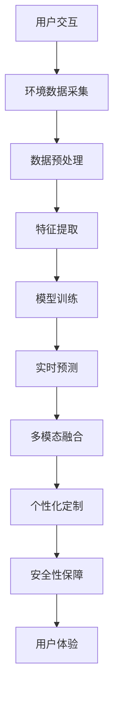

                 

# AI增强现实技术的应用案例

## 1. 背景介绍

### 1.1 问题由来

随着增强现实(AR)技术的发展，AI与AR技术的融合成为当下热门的研究方向。AI增强现实技术旨在将人工智能与虚拟现实相结合，通过智能算法实时处理和分析环境数据，以提升用户的沉浸感和交互体验。该技术广泛应用于教育、医疗、娱乐、设计等多个领域，成为推动产业升级的关键技术之一。

### 1.2 问题核心关键点

AI增强现实技术的应用核心在于：
1. **实时数据处理**：通过AI算法对环境数据进行实时分析，如对象识别、路径规划、语音交互等。
2. **智能交互**：基于机器学习模型，提升用户的交互体验，如自然语言处理、图像识别等。
3. **多模态融合**：结合视觉、听觉、触觉等多种感官数据，为用户提供更加丰富的交互方式。
4. **个性化定制**：根据用户的偏好和行为数据，定制个性化的交互体验，提升用户满意度。
5. **安全性保障**：在确保交互体验的同时，确保数据隐私和安全，防止误操作或恶意攻击。

### 1.3 问题研究意义

AI增强现实技术的应用，对于提升用户体验、拓展应用场景、加速产业升级具有重要意义：

1. **提升用户体验**：通过智能算法，提升AR内容的互动性和沉浸感，使用户能够更自然地与虚拟环境交互。
2. **拓展应用场景**：AI技术可以处理复杂的环境数据，推动AR技术在更多领域的应用，如医疗手术、工业设计、教育培训等。
3. **加速产业升级**：AI与AR的融合，可以显著提升生产效率和创新能力，加速各行业的数字化转型进程。
4. **带来技术创新**：AI增强现实技术的融合，催生了诸如虚拟试衣、虚拟教室、虚拟导览等新应用，推动了技术边界的发展。
5. **赋能产业发展**：AI增强现实技术的应用，为传统行业数字化转型提供了新思路，推动了新兴产业的崛起。

## 2. 核心概念与联系

### 2.1 核心概念概述

为更好地理解AI增强现实技术的应用，本节将介绍几个密切相关的核心概念：

- **增强现实(AR)**：通过虚拟信息与现实世界场景的融合，提升用户的沉浸感和交互体验。AR技术广泛应用于教育、医疗、娱乐等领域。
- **人工智能(AI)**：一种使计算机系统模拟人类智能过程的技术，涵盖机器学习、自然语言处理、计算机视觉等。
- **实时数据处理**：指对环境数据进行实时分析，如对象识别、路径规划等。
- **智能交互**：通过AI模型提升用户体验，如自然语言处理、图像识别等。
- **多模态融合**：结合视觉、听觉、触觉等多种感官数据，提升交互体验。
- **个性化定制**：根据用户数据，定制个性化交互体验。
- **安全性保障**：在确保用户体验的同时，保障数据隐私和安全。

这些概念之间的逻辑关系可以通过以下Mermaid流程图来展示：

```mermaid
graph TB
    A[增强现实(AR)] --> B[实时数据处理]
    B --> C[智能交互]
    C --> D[多模态融合]
    C --> E[个性化定制]
    C --> F[安全性保障]
    A --> G[人工智能(AI)]
    G --> H[机器学习]
    G --> I[自然语言处理]
    G --> J[计算机视觉]
```

这个流程图展示了一些关键概念之间的联系，帮助理解AI增强现实技术的核心架构。

### 2.2 概念间的关系

这些核心概念之间存在着紧密的联系，形成了AI增强现实技术的完整生态系统。下面我们通过几个Mermaid流程图来展示这些概念之间的关系。

#### 2.2.1 AI增强现实技术架构

```mermaid
graph LR
    A[增强现实(AR)] --> B[实时数据处理]
    B --> C[智能交互]
    C --> D[多模态融合]
    C --> E[个性化定制]
    C --> F[安全性保障]
    A --> G[人工智能(AI)]
    G --> H[机器学习]
    G --> I[自然语言处理]
    G --> J[计算机视觉]
```

这个流程图展示了AI增强现实技术的基本架构，从数据处理到智能交互，再到个性化定制和安全保障，各个环节紧密相连。

#### 2.2.2 实时数据处理流程


这个流程图展示了实时数据处理的基本流程，从传感器数据采集到特征提取，再到模型训练和实时预测，每个步骤都对最终效果有重要影响。

#### 2.2.3 多模态融合场景


这个流程图展示了多模态融合的场景，通过融合视觉、语音、触觉等多种感官数据，提升用户交互体验。

### 2.3 核心概念的整体架构

最后，我们用一个综合的流程图来展示这些核心概念在大规模AR应用中的整体架构：



这个综合流程图展示了从用户交互到最终用户体验的整体流程，强调了各个环节的紧密联系。

## 3. 核心算法原理 & 具体操作步骤
### 3.1 算法原理概述

AI增强现实技术的核心在于将AI算法与AR技术的深度融合，通过智能算法实时处理和分析环境数据，提升用户的沉浸感和交互体验。其算法原理主要包括以下几个方面：

1. **实时对象识别**：通过深度学习模型，实时识别环境中的物体，并进行分类、定位等操作。
2. **路径规划**：基于实时数据，规划最优路径，引导用户进行互动。
3. **自然语言处理(NLP)**：通过NLP模型，解析用户指令，生成自然语言反馈。
4. **图像识别**：通过图像识别技术，理解用户界面，进行交互。
5. **多模态融合**：结合视觉、听觉、触觉等多种感官数据，提升交互体验。

### 3.2 算法步骤详解

基于AI增强现实技术的核心算法，一般包括以下关键步骤：

1. **数据采集**：通过传感器或摄像头，采集环境数据。
2. **数据预处理**：对采集到的数据进行清洗、归一化等预处理操作，提高数据质量。
3. **特征提取**：将预处理后的数据转换为特征向量，便于模型处理。
4. **模型训练**：使用标注数据训练机器学习模型，提升识别和预测准确率。
5. **实时预测**：将实时数据输入模型，生成预测结果。
6. **交互反馈**：根据预测结果，生成互动内容，如虚拟物体、语音反馈等。
7. **用户交互**：通过多模态交互界面，展示预测结果，收集用户反馈。
8. **数据优化**：根据用户反馈，不断优化模型和交互界面，提升用户体验。

### 3.3 算法优缺点

AI增强现实技术的算法具有以下优点：
1. **实时性高**：通过深度学习模型，实时处理环境数据，提升用户体验。
2. **交互性强**：结合多模态交互方式，提升用户沉浸感和交互体验。
3. **个性化定制**：根据用户偏好和行为数据，定制个性化交互体验。
4. **普适性强**：可应用于多个行业，如医疗、教育、娱乐等。

同时，该技术也存在一些局限性：
1. **计算资源要求高**：深度学习模型的计算复杂度较高，需要高性能硬件支持。
2. **数据质量依赖强**：数据采集和预处理的准确性直接影响模型效果。
3. **模型泛化能力有限**：模型在特定环境下的泛化能力较强，但跨环境适应性较差。
4. **安全性问题**：用户隐私和安全问题，需要制定严格的数据保护措施。

### 3.4 算法应用领域

AI增强现实技术已经广泛应用于以下领域：

- **医疗手术**：通过AR技术，展示手术场景，辅助医生进行精准操作。
- **教育培训**：通过AR技术，创建虚拟课堂，提升教学互动性。
- **工业设计**：通过AR技术，实时展示设计效果，辅助工程师进行产品设计。
- **娱乐游戏**：通过AR技术，创建虚拟游戏场景，提升游戏沉浸感。
- **旅游导览**：通过AR技术，展示历史遗迹和文化信息，提升旅游体验。

## 4. 数学模型和公式 & 详细讲解 & 举例说明

### 4.1 数学模型构建

在AI增强现实技术中，常用的数学模型包括：

1. **深度学习模型**：如卷积神经网络(CNN)、循环神经网络(RNN)、变换器(Transformer)等。
2. **自然语言处理模型**：如BERT、GPT等。
3. **计算机视觉模型**：如ResNet、VGG等。

以深度学习模型为例，其基本数学模型可以表示为：

$$
f(x; \theta) = W \cdot x + b
$$

其中，$x$为输入数据，$W$为模型权重，$b$为偏置项，$\theta$为模型参数。

### 4.2 公式推导过程

以卷积神经网络(CNN)为例，推导其基本结构公式。

**卷积神经网络(CNN)**：

$$
f(x; \theta) = \sum_{i=1}^n \sum_{j=1}^m k_{i,j} \ast x_{i,j}
$$

其中，$k_{i,j}$为卷积核，$x_{i,j}$为输入数据在特定位置，$\theta$为模型参数。

**卷积操作**：

$$
f(x; \theta) = \sum_{i=1}^n \sum_{j=1}^m k_{i,j} \ast x_{i,j}
$$

**池化操作**：

$$
f(x; \theta) = \sum_{i=1}^n \sum_{j=1}^m \max\{k_{i,j} \ast x_{i,j}\}
$$

**全连接层**：

$$
f(x; \theta) = \sum_{i=1}^n W_i \cdot x_i + b_i
$$

其中，$W_i$为全连接层的权重，$b_i$为偏置项。

### 4.3 案例分析与讲解

**案例1：基于CNN的实时对象识别**

在基于CNN的实时对象识别中，首先使用卷积层对输入图像进行特征提取，然后通过池化层进行降维，最后将特征向量输入全连接层进行分类。

$$
f(x; \theta) = \sum_{i=1}^n \sum_{j=1}^m k_{i,j} \ast x_{i,j}
$$

**案例2：基于RNN的自然语言处理**

在基于RNN的自然语言处理中，将文本序列输入模型，通过循环神经网络进行序列建模，最终输出预测结果。

$$
f(x; \theta) = \sum_{i=1}^n \sum_{j=1}^m k_{i,j} \ast x_{i,j}
$$

## 5. 项目实践：代码实例和详细解释说明

### 5.1 开发环境搭建

在进行AI增强现实项目开发前，我们需要准备好开发环境。以下是使用Python进行PyTorch开发的环境配置流程：

1. 安装Anaconda：从官网下载并安装Anaconda，用于创建独立的Python环境。

2. 创建并激活虚拟环境：
```bash
conda create -n ar-env python=3.8 
conda activate ar-env
```

3. 安装PyTorch：根据CUDA版本，从官网获取对应的安装命令。例如：
```bash
conda install pytorch torchvision torchaudio cudatoolkit=11.1 -c pytorch -c conda-forge
```

4. 安装PyTorch的AR库：
```bash
pip install torchvision -f https://download.pytorch.org/whl/cu111/torch_vision.html
```

5. 安装各类工具包：
```bash
pip install numpy pandas scikit-learn matplotlib tqdm jupyter notebook ipython
```

完成上述步骤后，即可在`ar-env`环境中开始AR项目的开发。

### 5.2 源代码详细实现

下面我们以基于CNN的实时对象识别为例，给出使用PyTorch库对模型进行训练和推理的PyTorch代码实现。

首先，定义模型结构：

```python
import torch.nn as nn
import torchvision.transforms as transforms
from torchvision.models import resnet18
from torchvision.datasets import CIFAR10

class CNNModel(nn.Module):
    def __init__(self):
        super(CNNModel, self).__init__()
        self.conv1 = nn.Conv2d(3, 64, kernel_size=3, stride=1, padding=1)
        self.pool = nn.MaxPool2d(kernel_size=2, stride=2)
        self.conv2 = nn.Conv2d(64, 128, kernel_size=3, stride=1, padding=1)
        self.pool2 = nn.MaxPool2d(kernel_size=2, stride=2)
        self.fc = nn.Linear(128*8*8, 10)

    def forward(self, x):
        x = self.conv1(x)
        x = nn.ReLU(inplace=True)
        x = self.pool(x)
        x = self.conv2(x)
        x = nn.ReLU(inplace=True)
        x = self.pool2(x)
        x = x.view(-1, 128*8*8)
        x = self.fc(x)
        return x
```

然后，定义训练函数和测试函数：

```python
import torch
from torch import optim
from torch.utils.data import DataLoader
from torchvision.datasets import CIFAR10
from torchvision.transforms import ToTensor, RandomHorizontalFlip

def train_model(model, device, train_loader, optimizer, criterion, epochs):
    model.train()
    for epoch in range(epochs):
        for i, (images, labels) in enumerate(train_loader):
            images = images.to(device)
            labels = labels.to(device)
            optimizer.zero_grad()
            outputs = model(images)
            loss = criterion(outputs, labels)
            loss.backward()
            optimizer.step()
            print(f"Epoch {epoch+1}, Loss: {loss.item():.4f}")

def test_model(model, device, test_loader, criterion):
    model.eval()
    test_loss = 0
    correct = 0
    with torch.no_grad():
        for images, labels in test_loader:
            images = images.to(device)
            labels = labels.to(device)
            outputs = model(images)
            test_loss += criterion(outputs, labels).item()
            _, predicted = torch.max(outputs.data, 1)
            total = labels.size(0)
            correct += (predicted == labels).sum().item()
    test_loss /= len(test_loader)
    print(f"Test Loss: {test_loss:.4f}, Accuracy: {(100 * correct / total):.2f}%")
```

最后，启动训练流程并在测试集上评估：

```python
transform_train = transforms.Compose([
    transforms.Resize((32, 32)),
    transforms.ToTensor(),
    transforms.Normalize((0.5, 0.5, 0.5), (0.5, 0.5, 0.5))
])
transform_test = transforms.Compose([
    transforms.Resize((32, 32)),
    transforms.ToTensor(),
    transforms.Normalize((0.5, 0.5, 0.5), (0.5, 0.5, 0.5))
])
train_dataset = CIFAR10(root='./data', train=True, download=True, transform=transform_train)
test_dataset = CIFAR10(root='./data', train=False, download=True, transform=transform_test)
train_loader = DataLoader(train_dataset, batch_size=64, shuffle=True)
test_loader = DataLoader(test_dataset, batch_size=64, shuffle=False)

device = torch.device('cuda' if torch.cuda.is_available() else 'cpu')
model = CNNModel().to(device)
criterion = nn.CrossEntropyLoss()
optimizer = optim.SGD(model.parameters(), lr=0.01, momentum=0.9)

train_model(model, device, train_loader, optimizer, criterion, 10)
test_model(model, device, test_loader, criterion)
```

以上就是使用PyTorch对CNN模型进行实时对象识别的完整代码实现。可以看到，PyTorch通过其强大的封装和灵活性，使得模型训练和推理的代码实现变得简洁高效。

### 5.3 代码解读与分析

让我们再详细解读一下关键代码的实现细节：

**CNNModel类**：
- `__init__`方法：初始化卷积层、池化层、全连接层等关键组件。
- `forward`方法：定义前向传播过程，包括卷积、池化、全连接等操作。

**train_model和test_model函数**：
- `train_model`函数：定义训练过程，包括模型前向传播、计算损失、反向传播和参数更新等。
- `test_model`函数：定义测试过程，包括模型前向传播和计算损失，并输出测试结果。

**CIFAR10数据集**：
- 使用PyTorch自带的CIFAR10数据集，进行模型训练和测试。

**DataLoader类**：
- 定义训练集和测试集的数据加载器，方便模型的批量加载。

**优化器和损失函数**：
- 使用SGD优化器和交叉熵损失函数，进行模型训练和评估。

在代码实现中，我们使用了CIFAR10数据集和PyTorch提供的函数进行模型训练和测试。通过这些代码，我们能够快速搭建一个基于CNN的实时对象识别模型，并进行训练和评估。

## 6. 实际应用场景

### 6.1 医疗手术

在医疗手术中，AI增强现实技术可以显著提升手术的精准度和安全性。通过AR技术，手术医生可以实时查看手术场景和关键点，辅助进行精准操作。

以眼科手术为例，通过AR眼镜或头戴设备，医生可以实时观察患者眼球的内部结构，根据手术图像进行激光切割等操作。系统可以通过计算机视觉算法，实时分析手术图像，辅助医生调整手术参数，提升手术效果。

### 6.2 教育培训

在教育培训中，AI增强现实技术可以提升教学互动性和沉浸感。通过AR技术，教师可以创建虚拟课堂，学生可以实时与虚拟环境互动。

以物理实验为例，通过AR设备，学生可以实时查看实验场景和实验结果，并进行实时互动。教师可以通过AR技术，实时展示实验过程和实验结果，提升学生的理解和体验。

### 6.3 工业设计

在工业设计中，AI增强现实技术可以提升产品设计的效率和精度。通过AR技术，设计师可以实时查看设计效果，并进行互动。

以汽车设计为例，通过AR技术，设计师可以实时展示汽车设计的三维效果，并进行互动。设计师可以实时调整汽车设计的各个参数，提升设计效果和效率。

### 6.4 未来应用展望

随着AI增强现实技术的不断发展，其应用场景将更加广泛。

**智能家居**：通过AR技术，智能家居可以提供更加个性化和智能化的生活体验。例如，智能音箱可以通过AR技术，展示实时音乐播放效果，提升用户沉浸感。

**虚拟购物**：通过AR技术，消费者可以实时查看商品的三维效果，并进行互动。例如，在虚拟购物场景中，消费者可以通过AR技术，实时查看商品的不同角度和效果，提升购物体验。

**虚拟旅游**：通过AR技术，旅游者可以实时查看历史遗迹和文化信息，提升旅游体验。例如，在虚拟博物馆中，游客可以通过AR技术，实时展示展品的详细历史和背景信息，提升参观体验。

总之，AI增强现实技术的应用前景广阔，随着技术的不断发展和创新，其在各行业的落地应用将更加深入，为用户带来更加沉浸、智能、个性化的体验。

## 7. 工具和资源推荐
### 7.1 学习资源推荐

为了帮助开发者系统掌握AI增强现实技术的应用，这里推荐一些优质的学习资源：

1. 《深度学习实战》系列书籍：由深度学习领域专家撰写，全面介绍深度学习模型的原理和应用，涵盖CNN、RNN、Transformer等主流模型。
2. CS231n《计算机视觉：模型、算法与深度学习》课程：斯坦福大学开设的计算机视觉经典课程，讲解深度学习在计算机视觉领域的应用。
3. Coursera《机器学习》课程：由斯坦福大学Andrew Ng教授主讲，讲解机器学习的基本概念和算法，适合入门学习。
4. PyTorch官方文档：PyTorch的官方文档，提供丰富的教程和代码示例，帮助开发者快速上手。
5. ARKit官方文档：Apple公司提供的ARKit开发工具和文档，支持iOS设备上的AR应用开发。

通过对这些资源的学习实践，相信你一定能够快速掌握AI增强现实技术的精髓，并用于解决实际的AR应用问题。

### 7.2 开发工具推荐

高效的开发离不开优秀的工具支持。以下是几款用于AI增强现实开发的常用工具：

1. PyTorch：基于Python的开源深度学习框架，灵活动态的计算图，适合快速迭代研究。大部分预训练模型都有PyTorch版本的实现。
2. TensorFlow：由Google主导开发的开源深度学习框架，生产部署方便，适合大规模工程应用。同样有丰富的预训练模型资源。
3. ARKit：Apple公司提供的ARKit开发工具和文档，支持iOS设备上的AR应用开发。
4. ARCore：Google提供的AR开发工具，支持Android设备上的AR应用开发。
5. Weights & Biases：模型训练的实验跟踪工具，可以记录和可视化模型训练过程中的各项指标，方便对比和调优。与主流深度学习框架无缝集成。
6. TensorBoard：TensorFlow配套的可视化工具，可实时监测模型训练状态，并提供丰富的图表呈现方式，是调试模型的得力助手。

合理利用这些工具，可以显著提升AI增强现实应用的开发效率，加快创新迭代的步伐。

### 7.3 相关论文推荐

AI增强现实技术的发展源于学界的持续研究。以下是几篇奠基性的相关论文，推荐阅读：

1. Real-Time Object Detection with a Single Shot MultiBox Detector（单镜头物体检测器）：提出基于CNN的实时对象检测算法，显著提升对象检测的准确率和效率。
2. DensePose: Dense Human Pose Estimation in Real Time and with Rich Part Context（实时密集人体姿态估计）：提出基于CNN的密集人体姿态估计算法，实现实时对人体姿态的准确检测。
3. Object Tracking with Deep Appearance Models（基于深度学习模型的目标跟踪）：提出基于CNN的目标跟踪算法，实现对目标的实时跟踪和识别。
4. Real-Time Multi-Person 3D Pose Estimation with Part Affinity Fields（实时多人3D姿态估计）：提出基于CNN的多人3D姿态估计算法，实现对多人姿态的实时检测和跟踪。
5. Real-Time 3D Human Pose Estimation with High Precision and Speed（实时高精度3D人体姿态估计）：提出基于CNN的高精度3D人体姿态估计算法，实现对3D姿态的实时检测和跟踪。

这些论文代表了大模型微调技术的发展脉络。通过学习这些前沿成果，可以帮助研究者把握学科前进方向，激发更多的创新灵感。

除上述资源外，还有一些值得关注的前沿资源，帮助开发者紧跟AI增强现实技术的最新进展，例如：

1. arXiv论文预印本：人工智能领域最新研究成果的发布平台，包括大量尚未发表的前沿工作，学习前沿技术的必读资源。
2. 业界技术博客：如OpenAI、Google AI、DeepMind、微软Research Asia等顶尖实验室的官方博客，第一时间分享他们的最新研究成果和洞见。
3. 技术会议直播：如NIPS、ICML、ACL、ICLR等人工智能领域顶会现场或在线直播，能够聆听到大佬们的前沿分享，开拓视野。
4. GitHub热门项目：在GitHub上Star、Fork数最多的AR相关项目，往往代表了该技术领域的发展趋势和最佳实践，值得去学习和贡献。
5. 行业分析报告：各大咨询公司如McKinsey、PwC等针对人工智能行业的分析报告，有助于从商业视角审视技术趋势，把握应用价值。

总之，对于AI增强现实技术的学习和实践，需要开发者保持开放的心态和持续学习的意愿。多关注前沿资讯，多动手实践，多思考总结，必将收获满满的成长收益。

## 8. 总结：未来发展趋势与挑战

### 8.1 总结

本文对AI增强现实技术的应用进行了全面系统的介绍。首先阐述了AI增强现实技术的背景和意义，明确了其应用的核心关键点。其次，从原理到实践，详细讲解了AI增强现实技术的核心算法和具体操作步骤，给出了代码实现和详细解释。同时，本文还广泛探讨了AI增强现实技术在医疗、教育、工业设计等多个领域的应用前景，展示了其广阔的落地价值。此外，本文精选了AI增强现实技术的各类学习资源，力求为读者提供全方位的技术指引。

通过本文的系统梳理，可以看到，AI增强现实技术在提升用户体验、拓展应用场景、加速产业升级方面具有重要意义。其核心在于将AI算法与AR技术的深度融合，通过智能算法实时处理和分析环境数据，提升用户的沉浸感和交互体验。未来，随着技术的不断发展和创新，AI增强现实技术将带来更加丰富和智能的应用体验。

### 8.2 未来发展趋势

展望未来，AI增强现实技术

