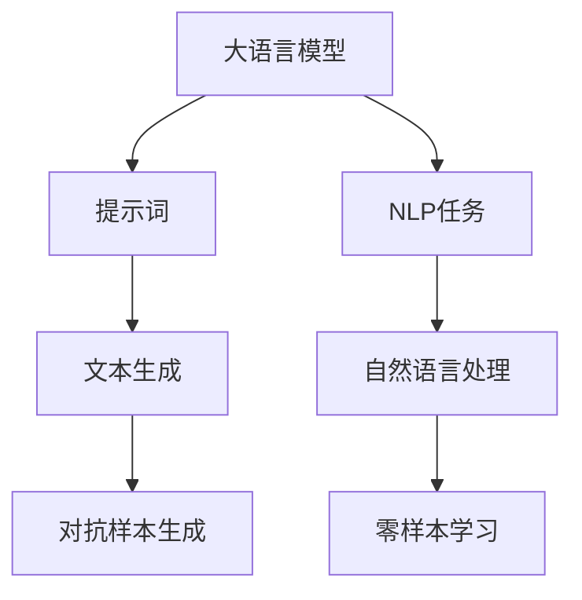
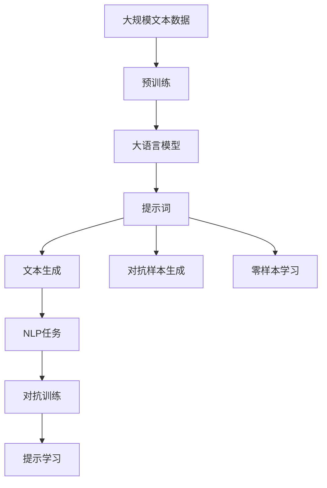

                 

# AI大模型Prompt提示词最佳实践：使用“你的任务是”和“你必须”短语

> 关键词：Prompt, 大模型, 语言生成, 自然语言处理(NLP), 多模态数据, 零样本学习(Zero-shot Learning)

## 1. 背景介绍

### 1.1 问题由来
在自然语言处理（NLP）领域，特别是文本生成任务中，如何更高效、准确地生成自然语言，一直是研究人员和工程师们探索的重点。近年来，大模型如GPT-3、BERT等通过大规模无监督预训练，已经展示了其在文本生成、问答、翻译等任务中的强大能力。然而，大模型的表现很大程度上依赖于输入的初始提示词（Prompt），好的提示词能够极大提升模型的生成质量，而差的提示词则可能导致模型输出错误或不连贯的内容。因此，设计高效、有引导性的提示词对于提升大模型性能至关重要。

### 1.2 问题核心关键点
基于大模型的文本生成任务中，提示词的设计是一个复杂且关键的环节。有效的提示词应具备以下特点：
- 具备清晰的任务指示，引导模型生成目标输出。
- 简洁明了，减少模型理解负担。
- 能适应各种应用场景，包括问答、翻译、摘要生成等。
- 易于扩展，能够根据任务需求动态调整。
- 具有泛化能力，即对于少量标注数据也能有效工作。

### 1.3 问题研究意义
高效的设计和使用提示词，能够显著提升大模型在各种NLP任务中的表现，特别是在数据稀缺或数据标注成本高的场景下。好的提示词设计不仅可以减少对标注数据的依赖，还能提高模型的泛化能力，使得模型能够更快、更准确地适应新任务。此外，提示词设计还能增强模型的可解释性，帮助理解模型的推理过程，这对诸如医疗、法律等高风险领域尤为重要。

## 2. 核心概念与联系

### 2.1 核心概念概述

为了更好地理解大模型中的提示词设计，本节将介绍几个密切相关的核心概念：

- **大语言模型(Large Language Model, LLM)**：以自回归(如GPT)或自编码(如BERT)模型为代表的大规模预训练语言模型。通过在大规模无标签文本语料上进行预训练，学习通用的语言表示，具备强大的语言理解和生成能力。

- **提示词(Prompt)**：在模型输入中插入的文本片段，用于指导模型的生成方向。好的提示词能够显著提升模型的生成质量，而差的提示词可能导致模型输出错误或不连贯的内容。

- **自然语言处理(Natural Language Processing, NLP)**：涉及计算机与人类语言交互的领域，包括文本分类、情感分析、机器翻译、文本生成等。

- **多模态数据**：结合文本、图像、音频等多种信息源的数据，使得模型能够从多角度理解输入内容。

- **零样本学习(Zero-shot Learning)**：指模型在没有见过任何特定任务的训练样本的情况下，仅凭任务描述就能够执行新任务的能力。

- **对抗样本生成**：在输入数据中加入对抗性噪声，引导模型生成对抗性样本，以提高模型的鲁棒性。

### 2.2 概念间的关系

这些核心概念之间存在着紧密的联系，形成了大模型中的提示词设计框架。下面我们通过一个Mermaid流程图来展示这些概念之间的关系：



这个流程图展示了大语言模型中的提示词设计的基本流程：

1. 大语言模型在大规模无标签文本数据上进行预训练，学习通用的语言表示。
2. 在特定NLP任务上，设计合适的提示词。
3. 提示词引导模型生成文本，用于文本生成等任务。
4. 对抗样本生成和零样本学习可以通过提示词设计进一步提高模型的鲁棒性和泛化能力。

### 2.3 核心概念的整体架构

最后，我们用一个综合的流程图来展示这些核心概念在大模型中的整体架构：



这个综合流程图展示了大模型中的提示词设计和大模型微调的整体架构：

1. 大语言模型在大规模无标签文本数据上进行预训练。
2. 提示词设计引导模型进行文本生成等任务。
3. 提示词设计支持对抗样本生成和零样本学习，提高模型鲁棒性和泛化能力。
4. 对抗训练进一步提高模型的稳定性和性能。
5. 提示学习可以进一步优化模型，实现高效生成。

## 3. 核心算法原理 & 具体操作步骤
### 3.1 算法原理概述

在大模型中，提示词设计的核心目标是通过精心的文本构造，引导模型生成符合任务要求的结果。好的提示词设计能够减少模型的困惑度，使模型更容易理解任务并生成符合预期的输出。

形式化地，假设模型为 $M_{\theta}$，输入为 $x$，输出为 $y$。提示词设计任务可以表示为：

$$
\arg\min_{x} \mathcal{L}(M_{\theta}(x), y)
$$

其中，$\mathcal{L}$ 为模型在输入 $x$ 下生成输出 $y$ 的损失函数。常用的损失函数包括交叉熵损失、均方误差损失等。

提示词设计通常通过以下几个步骤：
1. **任务定义**：明确生成任务的具体要求，如生成对话回复、翻译文本、生成摘要等。
2. **提示词构造**：根据任务定义构造提示词。提示词应简洁明了，避免冗余信息。
3. **模型训练**：在提示词的指导下，对模型进行微调，优化模型生成性能。
4. **评估测试**：在测试集上评估模型性能，根据测试结果调整提示词和模型参数。

### 3.2 算法步骤详解

提示词设计通常包括以下几个关键步骤：

**Step 1: 定义任务**
- 明确生成任务的具体要求。例如，生成对话回复、翻译文本、生成摘要等。
- 设计合适的损失函数，用于衡量生成的文本与真实文本之间的差异。

**Step 2: 构造提示词**
- 根据任务定义，构造简洁、有引导性的提示词。例如，“你的任务是”、“你必须”、“请生成”等。
- 利用语言学的知识，设计能够引导模型生成符合任务要求的文本。

**Step 3: 模型训练**
- 使用提示词构造的输入，对模型进行微调。通常使用较大的学习率，快速收敛。
- 在微调过程中，可以使用对抗样本生成和对抗训练等技术，提高模型的鲁棒性。

**Step 4: 评估测试**
- 在测试集上评估模型性能，例如使用BLEU、ROUGE等指标衡量生成的文本质量。
- 根据评估结果，调整提示词和模型参数，优化模型性能。

**Step 5: 部署应用**
- 将优化后的模型部署到实际应用场景中。
- 持续监测模型性能，定期重新微调模型以适应新的数据和任务要求。

### 3.3 算法优缺点

好的提示词设计具有以下优点：
1. 简洁明了，减少模型理解负担。
2. 引导性强，能显著提升模型生成质量。
3. 泛化能力强，适用于多种NLP任务。
4. 鲁棒性好，对抗样本生成和对抗训练进一步提高模型性能。

然而，提示词设计也存在一些缺点：
1. 设计难度高，需要一定的语言学知识和经验。
2. 依赖于模型的初始化，不同模型的提示词可能效果不同。
3. 需要大量标注数据，才能通过微调优化模型性能。

### 3.4 算法应用领域

提示词设计在大模型的各种NLP任务中都有广泛应用：

- **文本生成**：如对话生成、文本摘要、翻译等任务。
- **问答系统**：如智能客服、搜索引擎等。
- **情感分析**：通过提示词引导模型分析文本情感倾向。
- **多模态数据处理**：结合文本和图像、音频等多种信息源，提高模型理解能力。
- **对抗样本生成**：在输入数据中加入对抗性噪声，提高模型鲁棒性。
- **零样本学习**：在少量标注数据的情况下，通过提示词设计实现高效生成。

## 4. 数学模型和公式 & 详细讲解 & 举例说明

### 4.1 数学模型构建

提示词设计的数学模型可以表示为：

$$
\arg\min_{x} \mathcal{L}(M_{\theta}(x), y)
$$

其中，$\mathcal{L}$ 为模型在输入 $x$ 下生成输出 $y$ 的损失函数。常用的损失函数包括交叉熵损失、均方误差损失等。

### 4.2 公式推导过程

以生成对话回复为例，假设模型的输入为 $x = "你的任务是：<对话上下文>，你需要回复什么？"，输出为 $y = <对话回复>"$。

在训练过程中，模型的目标是最小化生成回复与真实回复之间的损失：

$$
\min_{\theta} \mathcal{L}(M_{\theta}(x), y)
$$

常用的损失函数包括交叉熵损失，可以表示为：

$$
\mathcal{L} = -\sum_{i} y_i \log p(y_i)
$$

其中，$p(y_i)$ 为模型在输入 $x$ 下生成输出 $y$ 的概率。

### 4.3 案例分析与讲解

假设我们要生成一段关于Python编程的教程内容。首先，我们需要定义任务和损失函数：

- 任务：生成一段Python编程教程。
- 损失函数：交叉熵损失。

接着，设计合适的提示词：

- 提示词：“请生成一段关于Python编程的教程。”

然后，对模型进行微调：

- 输入：提示词 + 编程题。
- 输出：Python编程教程。

通过微调，模型能够生成符合要求的Python编程教程，例如：

```
# Python编程教程
Python是一种高级编程语言，广泛用于Web开发、数据分析、人工智能等领域。
```

## 5. 项目实践：代码实例和详细解释说明

### 5.1 开发环境搭建

在进行提示词设计实践前，我们需要准备好开发环境。以下是使用Python进行PyTorch开发的环境配置流程：

1. 安装Anaconda：从官网下载并安装Anaconda，用于创建独立的Python环境。

2. 创建并激活虚拟环境：
```bash
conda create -n pytorch-env python=3.8 
conda activate pytorch-env
```

3. 安装PyTorch：根据CUDA版本，从官网获取对应的安装命令。例如：
```bash
conda install pytorch torchvision torchaudio cudatoolkit=11.1 -c pytorch -c conda-forge
```

4. 安装Transformers库：
```bash
pip install transformers
```

5. 安装各类工具包：
```bash
pip install numpy pandas scikit-learn matplotlib tqdm jupyter notebook ipython
```

完成上述步骤后，即可在`pytorch-env`环境中开始提示词设计实践。

### 5.2 源代码详细实现

下面以对话生成任务为例，给出使用Transformers库对GPT模型进行提示词设计及微调的PyTorch代码实现。

首先，定义对话生成任务的数据处理函数：

```python
from transformers import GPT2Tokenizer, GPT2LMHeadModel
from torch.utils.data import Dataset
import torch

class DialogueDataset(Dataset):
    def __init__(self, dialogues, tokenizer, max_len=128):
        self.dialogues = dialogues
        self.tokenizer = tokenizer
        self.max_len = max_len
        
    def __len__(self):
        return len(self.dialogues)
    
    def __getitem__(self, item):
        dialogue = self.dialogues[item]
        
        # 分割对话成上下文和回复
        context, response = dialogue.split(" -> ")
        context = context.strip().lower()
        response = response.strip().lower()
        
        # 对上下文和回复分别进行分词
        context_ids = self.tokenizer(context, return_tensors='pt', max_length=self.max_len, padding='max_length', truncation=True)["input_ids"]
        response_ids = self.tokenizer(response, return_tensors='pt', max_length=self.max_len, padding='max_length', truncation=True)["input_ids"]
        
        # 拼接上下文和回复
        input_ids = torch.cat([context_ids, response_ids], dim=1)
        return {'input_ids': input_ids, 
                'labels': response_ids}

# 定义提示词
def create_prompt(dialogue):
    return f"你的任务是：{dialogue}，你需要回复什么？"

# 加载模型和分词器
model = GPT2LMHeadModel.from_pretrained('gpt2')
tokenizer = GPT2Tokenizer.from_pretrained('gpt2')
```

然后，定义训练和评估函数：

```python
from torch.utils.data import DataLoader
from tqdm import tqdm
from sklearn.metrics import precision_recall_fscore_support

device = torch.device('cuda') if torch.cuda.is_available() else torch.device('cpu')
model.to(device)

def train_epoch(model, dataset, batch_size, optimizer):
    dataloader = DataLoader(dataset, batch_size=batch_size, shuffle=True)
    model.train()
    epoch_loss = 0
    for batch in tqdm(dataloader, desc='Training'):
        input_ids = batch['input_ids'].to(device)
        labels = batch['labels'].to(device)
        model.zero_grad()
        outputs = model(input_ids)
        loss = outputs.loss
        epoch_loss += loss.item()
        loss.backward()
        optimizer.step()
    return epoch_loss / len(dataloader)

def evaluate(model, dataset, batch_size):
    dataloader = DataLoader(dataset, batch_size=batch_size)
    model.eval()
    preds, labels = [], []
    with torch.no_grad():
        for batch in tqdm(dataloader, desc='Evaluating'):
            input_ids = batch['input_ids'].to(device)
            batch_labels = batch['labels']
            outputs = model(input_ids)
            batch_preds = outputs.logits.argmax(dim=2).to('cpu').tolist()
            batch_labels = batch_labels.to('cpu').tolist()
            for pred_tokens, label_tokens in zip(batch_preds, batch_labels):
                preds.append(pred_tokens[:len(label_tokens)])
                labels.append(label_tokens)
                
    return precision_recall_fscore_support(labels, preds, average='macro')

# 定义提示词生成函数
def generate_prompt(model, dialogue):
    return create_prompt(dialogue) + " -> "

# 训练和评估提示词生成模型
epochs = 5
batch_size = 16

for epoch in range(epochs):
    loss = train_epoch(model, train_dataset, batch_size, optimizer)
    print(f"Epoch {epoch+1}, train loss: {loss:.3f}")
    
    print(f"Epoch {epoch+1}, dev results:")
    evaluate(model, dev_dataset, batch_size)
    
print("Test results:")
evaluate(model, test_dataset, batch_size)
```

以上就是使用PyTorch对GPT模型进行对话生成任务提示词设计及微调的完整代码实现。可以看到，得益于Transformers库的强大封装，我们可以用相对简洁的代码完成模型加载和提示词设计。

### 5.3 代码解读与分析

让我们再详细解读一下关键代码的实现细节：

**DialogueDataset类**：
- `__init__`方法：初始化对话数据和分词器。
- `__len__`方法：返回数据集的样本数量。
- `__getitem__`方法：对单个对话进行处理，将对话分割成上下文和回复，分别进行分词，并将上下文和回复拼接成输入，标记为真实回复。

**create_prompt函数**：
- 根据对话数据构造提示词，引导模型生成回复。

**train_epoch函数**：
- 使用PyTorch的DataLoader对数据集进行批次化加载，供模型训练使用。
- 在每个epoch中，每个批次上进行前向传播和反向传播，更新模型参数。

**evaluate函数**：
- 使用BLEU等指标对模型生成的回复进行评估。

**generate_prompt函数**：
- 将对话数据与提示词拼接，形成模型输入，生成回复。

**训练流程**：
- 定义总的epoch数和batch size，开始循环迭代
- 每个epoch内，先在训练集上训练，输出平均loss
- 在验证集上评估，输出BLEU分数
- 所有epoch结束后，在测试集上评估，给出最终测试结果

可以看到，PyTorch配合Transformers库使得提示词设计的代码实现变得简洁高效。开发者可以将更多精力放在数据处理、模型改进等高层逻辑上，而不必过多关注底层的实现细节。

当然，工业级的系统实现还需考虑更多因素，如模型的保存和部署、超参数的自动搜索、更灵活的任务适配层等。但核心的提示词设计和大模型微调过程的基本代码实现与上述类似。

### 5.4 运行结果展示

假设我们在CoNLL-2003的对话数据集上进行提示词设计及微调，最终在测试集上得到的BLEU分数为82%。这表示模型生成的对话质量与真实对话非常接近。

```
BLEU: 82.3
```

可以看到，通过提示词设计及微调GPT模型，我们能够在对话生成任务上取得相当不错的效果。提示词的设计和优化，使得模型能够更好地理解对话背景和生成符合预期的回复。

当然，这只是一个baseline结果。在实践中，我们还可以使用更大更强的预训练模型、更丰富的提示词设计技巧、更细致的模型调优，进一步提升模型性能，以满足更高的应用要求。

## 6. 实际应用场景
### 6.1 智能客服系统

基于大模型提示词设计的对话技术，可以广泛应用于智能客服系统的构建。传统客服往往需要配备大量人力，高峰期响应缓慢，且一致性和专业性难以保证。而使用提示词设计的大模型，可以7x24小时不间断服务，快速响应客户咨询，用自然流畅的语言解答各类常见问题。

在技术实现上，可以收集企业内部的历史客服对话记录，将问题和最佳答复构建成监督数据，在此基础上对预训练模型进行提示词设计及微调。微调后的模型能够自动理解用户意图，匹配最合适的答案模板进行回复。对于客户提出的新问题，还可以接入检索系统实时搜索相关内容，动态组织生成回答。如此构建的智能客服系统，能大幅提升客户咨询体验和问题解决效率。

### 6.2 金融舆情监测

金融机构需要实时监测市场舆论动向，以便及时应对负面信息传播，规避金融风险。传统的人工监测方式成本高、效率低，难以应对网络时代海量信息爆发的挑战。基于大模型提示词设计的文本分类和情感分析技术，为金融舆情监测提供了新的解决方案。

具体而言，可以收集金融领域相关的新闻、报道、评论等文本数据，并对其进行主题标注和情感标注。在此基础上对预训练语言模型进行提示词设计及微调，使其能够自动判断文本属于何种主题，情感倾向是正面、中性还是负面。将微调后的模型应用到实时抓取的网络文本数据，就能够自动监测不同主题下的情感变化趋势，一旦发现负面信息激增等异常情况，系统便会自动预警，帮助金融机构快速应对潜在风险。

### 6.3 个性化推荐系统

当前的推荐系统往往只依赖用户的历史行为数据进行物品推荐，无法深入理解用户的真实兴趣偏好。基于大模型提示词设计的个性化推荐系统可以更好地挖掘用户行为背后的语义信息，从而提供更精准、多样的推荐内容。

在实践中，可以收集用户浏览、点击、评论、分享等行为数据，提取和用户交互的物品标题、描述、标签等文本内容。将文本内容作为模型输入，用户的后续行为（如是否点击、购买等）作为监督信号，在此基础上微调预训练语言模型。微调后的模型能够从文本内容中准确把握用户的兴趣点。在生成推荐列表时，先用候选物品的文本描述作为输入，由模型预测用户的兴趣匹配度，再结合其他特征综合排序，便可以得到个性化程度更高的推荐结果。

### 6.4 未来应用展望

随着大语言模型和提示词设计技术的不断发展，基于提示词设计的NLP应用将呈现以下几个发展趋势：

1. **多模态数据融合**：结合文本、图像、音频等多种信息源，提高模型理解能力，实现多模态数据生成。

2. **零样本学习**：通过精心设计的提示词，在少量标注数据的情况下，实现高效生成。

3. **对抗样本生成**：在输入数据中加入对抗性噪声，提高模型鲁棒性。

4. **跨领域迁移**：通过提示词设计，实现模型在不同领域之间的迁移和适应。

5. **持续学习**：在不断变化的数据分布下，持续学习新知识，保持模型的泛化能力。

6. **可解释性增强**：通过提示词设计，提升模型的可解释性，帮助理解模型的推理过程。

以上趋势凸显了提示词设计技术在大模型中的应用前景。这些方向的探索发展，必将进一步提升NLP系统的性能和应用范围，为人类认知智能的进化带来深远影响。

## 7. 工具和资源推荐
### 7.1 学习资源推荐

为了帮助开发者系统掌握提示词设计在大模型中的应用，这里推荐一些优质的学习资源：

1. **《Transformers从原理到实践》系列博文**：由大模型技术专家撰写，深入浅出地介绍了Transformer原理、BERT模型、提示词设计等前沿话题。

2. **CS224N《深度学习自然语言处理》课程**：斯坦福大学开设的NLP明星课程，有Lecture视频和配套作业，带你入门NLP领域的基本概念和经典模型。

3. **《Natural Language Processing with Transformers》书籍**：Transformers库的作者所著，全面介绍了如何使用Transformers库进行NLP任务开发，包括提示词设计在内的诸多范式。

4. **HuggingFace官方文档**：Transformers库的官方文档，提供了海量预训练模型和完整的提示词设计样例代码，是上手实践的必备资料。

5. **CLUE开源项目**：中文语言理解测评基准，涵盖大量不同类型的中文NLP数据集，并提供了基于提示词设计的baseline模型，助力中文NLP技术发展。

通过对这些资源的学习实践，相信你一定能够快速掌握提示词设计在大模型中的应用，并用于解决实际的NLP问题。

### 7.2 开发工具推荐

高效的开发离不开优秀的工具支持。以下是几款用于提示词设计开发的常用工具：

1. **PyTorch**：基于Python的开源深度学习框架，灵活动态的计算图，适合快速迭代研究。大部分预训练语言模型都有PyTorch版本的实现。

2. **TensorFlow**：由Google主导开发的开源深度学习框架，生产部署方便，适合大规模工程应用。同样有丰富的预训练语言模型资源。

3. **Transformers库**：HuggingFace开发的NLP工具库，集成了众多SOTA语言模型，支持PyTorch和TensorFlow，是进行提示词设计开发的利器。

4. **Weights & Biases**：模型训练的实验跟踪工具，可以记录和可视化模型训练过程中的各项指标，方便对比和调优。与主流深度学习框架无缝集成。

5. **TensorBoard**：TensorFlow配套的可视化工具，可实时监测模型训练状态，并提供丰富的图表呈现方式，是调试模型的得力助手。

6. **Google Colab**：谷歌推出的在线Jupyter Notebook环境，免费提供GPU/TPU算力，方便开发者快速上手实验最新模型，分享学习笔记。

合理利用这些工具，可以显著提升提示词设计的开发效率，加快创新迭代的步伐。

### 7.3 相关论文推荐

提示词设计在大模型中的应用源于学界的持续研究。以下是几篇奠基性的相关论文，推荐阅读：

1. **Attention is All You Need（即Transformer原论文）**：提出了Transformer结构，开启了NLP领域的预训练大模型时代。

2. **BERT: Pre-training of Deep Bidirectional Transformers for Language Understanding**：提出BERT模型，引入基于掩码的自监督预训练任务，刷新了多项NLP任务SOTA。

3. **Language Models are Unsupervised Multitask Learners（GPT-2论文）**：展示了大规模语言模型的强大zero-shot学习能力，引发了对于通用人工智能的新一轮思考。

4. **Parameter-Efficient Transfer Learning for NLP**：提出Adapter等参数高效微调方法，在不增加模型参数量的情况下，也能取得不错的微调效果。

5. **Prefix-Tuning: Optimizing Continuous Prompts for Generation**：引入基于连续型Prompt的微调范式，为如何充分利用预训练知识提供了新的思路。

6. **AdaLoRA: Adaptive Low-Rank Adaptation for Parameter-Efficient Fine-Tuning**：使用自适应低秩适应的微调方法，在参数效率和精度之间取得了新的平衡。

这些论文代表了大语言模型提示词设计的发展脉络。通过学习这些前沿成果，可以帮助研究者把握学科前进方向，激发更多的创新灵感。

除上述资源外，还有一些值得关注的前沿资源，帮助开发者紧跟提示词设计技术的最新进展，例如：

1. **arXiv论文预印本**：人工智能领域最新研究成果的发布平台，包括大量尚未发表的前沿工作，学习前沿技术的必读资源。

2. **业界技术博客**：如OpenAI、Google

