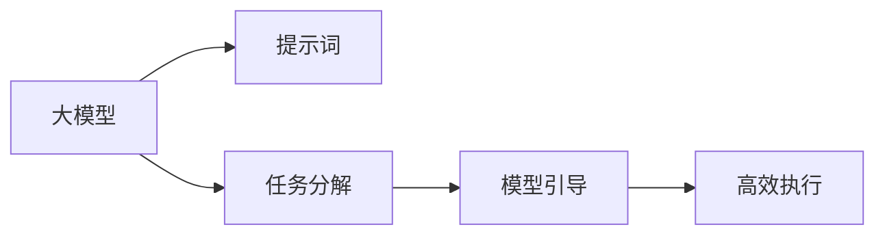

                 

# AI大模型Prompt提示词最佳实践：将复杂任务分解成小问题

> 关键词：
大模型, prompt, 提示词, 复杂任务, 分解, 自然语言处理(NLP), 生成模型, 微调

## 1. 背景介绍

### 1.1 问题由来
随着AI大模型的快速发展，其在自然语言处理(NLP)领域的广泛应用已经证明了其强大的语言理解和生成能力。然而，在面对复杂任务时，如长文本生成、多轮对话、自然语言推理等，传统的基于监督学习的方法往往难以直接应用。此外，大模型通常具有亿级参数，计算资源消耗巨大，不适合在低资源环境中使用。

为了解决这些问题，一种新兴的技术——Prompt提示词（Prompt）被提出。Prompt是一种精巧的文本模板，能够引导大模型进行特定的推理、生成或分类。通过使用适当的Prompt，复杂任务可以被分解为多个小问题，从而在低资源环境下高效地完成。

### 1.2 问题核心关键点
Prompt技术的关键点在于：
1. **任务分解**：将复杂任务分解为多个子任务，每个子任务具有明确的输入和输出。
2. **模型引导**：通过精心设计的Prompt模板，引导大模型对特定输入进行推理或生成。
3. **高效执行**：在参数固定的情况下，通过Prompt技术可以实现高效的推理和生成，避免不必要的大规模微调。

Prompt技术在学术界和工业界都得到了广泛的应用和认可，成为当前大模型应用中的热门技术之一。本文将深入探讨Prompt技术的原理和最佳实践，并结合实际应用场景，给出代码实现和案例分析，希望能为开发者提供实用的指导。

### 1.3 问题研究意义
Prompt技术不仅简化了复杂任务的处理流程，提高了任务执行的效率，还减少了计算资源的消耗，降低了对大模型的依赖。其意义在于：
1. **降低成本**：通过分解任务，可以显著减少训练和推理的计算资源需求。
2. **提升灵活性**：允许在低资源环境下使用大模型，增强应用的灵活性。
3. **提高准确性**：通过精心设计的Prompt模板，可以引导模型产生更加符合期望的输出，提升任务执行的准确性。
4. **促进创新**：鼓励开发者设计更复杂的Prompt，推动NLP技术的创新和应用。
5. **扩展应用**：通过Prompt技术，大模型可以在更多领域、更多场景下实现应用，拓宽NLP技术的边界。

## 2. 核心概念与联系

### 2.1 核心概念概述

为了更好地理解Prompt技术，首先需要明确几个核心概念：

- **AI大模型**：基于深度学习的大规模语言模型，如GPT-3、BERT等，具有强大的语言理解和生成能力。
- **Prompt提示词**：一种文本模板，用于引导大模型进行特定的推理、生成或分类。
- **任务分解**：将复杂任务分解为多个子任务，每个子任务具有明确的输入和输出。
- **模型引导**：通过Prompt模板，引导大模型进行特定推理或生成。
- **高效执行**：在参数固定的情况下，通过Prompt技术实现高效的推理和生成。

这些概念之间的联系可以通过以下Mermaid流程图来展示：



这个流程图展示了从大模型到提示词，再到任务分解、模型引导和高效执行的整个流程。大模型通过提示词被引导进行特定任务，从而实现高效的推理和生成。

### 2.2 概念间的关系

这些核心概念之间的关系可以进一步细化：

- **大模型与提示词**：提示词是大模型执行任务的指令，通过引导模型进行推理和生成。
- **任务分解与提示词**：任务分解是将复杂任务拆解为多个子任务的过程，每个子任务可以用一个或多个提示词来描述。
- **模型引导与高效执行**：模型引导是指使用提示词引导大模型进行推理和生成，高效执行则是指在参数固定的情况下，通过提示词实现高效的推理和生成。

通过理解这些概念之间的关系，可以更好地把握Prompt技术的工作原理和优化方向。

### 2.3 核心概念的整体架构

最终，我们将使用一个综合的流程图来展示这些核心概念在大模型Prompt提示词应用中的整体架构：


这个综合流程图展示了从大规模文本数据预训练，到大模型构建、任务分解、提示词生成、模型引导和高效执行的完整流程。大模型通过提示词被引导进行特定任务，从而实现高效的推理和生成。

## 3. 核心算法原理 & 具体操作步骤

### 3.1 算法原理概述

Prompt技术的核心思想是利用大模型的语言理解和生成能力，通过精巧设计的提示词，将复杂任务分解为多个子任务，从而在低资源环境下高效地完成。其原理可以简要概述为：

1. **任务分解**：将复杂任务拆分为多个子任务，每个子任务具有明确的输入和输出。
2. **提示词生成**：根据子任务设计提示词模板，引导大模型进行特定推理或生成。
3. **模型引导**：使用提示词模板引导大模型执行子任务，实现高效的推理和生成。

### 3.2 算法步骤详解

Prompt技术的具体操作流程如下：

1. **任务定义**：明确任务目标和输入输出格式。例如，对于文本生成任务，输入为一篇简短的文章，输出为该文章的摘要或续写。

2. **提示词设计**：根据任务目标设计提示词模板，引导大模型进行推理或生成。例如，使用“请为以下文章生成一个简短的摘要”作为提示词，引导模型生成摘要。

3. **模型选择**：选择合适的预训练模型作为基础模型，如GPT-3、BERT等。

4. **模型微调**：在特定任务上微调基础模型，以适应具体任务需求。例如，微调BERT模型，使其能够理解特定领域的术语和语义。

5. **提示词生成**：根据微调后的模型，生成特定的提示词模板。例如，使用微调的BERT模型，生成“请回答以下问题”作为提示词。

6. **模型推理**：使用生成的提示词模板，引导模型进行推理或生成。例如，输入特定的输入数据，使用提示词模板“请回答以下问题”，引导模型生成输出。

7. **结果分析**：分析模型生成的输出，评估任务执行的准确性和效率。例如，使用BLEU、ROUGE等指标评估文本生成的质量。

### 3.3 算法优缺点

Prompt技术具有以下优点：
1. **高效**：通过分解任务，可以显著减少计算资源的消耗。
2. **灵活**：允许在低资源环境下使用大模型，增强应用的灵活性。
3. **准确**：通过精心设计的提示词，可以引导模型产生更加符合期望的输出，提升任务执行的准确性。
4. **可扩展**：通过设计不同的提示词，可以在更多领域、更多场景下实现应用。

Prompt技术也存在一些缺点：
1. **依赖提示词质量**：提示词设计的好坏直接影响任务执行的效果。
2. **难以处理复杂任务**：对于某些复杂的任务，提示词设计可能不够精细，导致任务执行的准确性下降。
3. **需要人工干预**：提示词的设计需要大量的人工经验和智慧，难以自动生成。

### 3.4 算法应用领域

Prompt技术已经在NLP领域的多个任务中得到了广泛应用，例如：

- 文本生成：使用提示词模板，引导模型生成文章、对话等文本。
- 多轮对话：设计特定的提示词模板，引导模型进行多轮对话，增强用户交互体验。
- 自然语言推理：设计提示词模板，引导模型进行逻辑推理和判断。
- 代码生成：使用提示词模板，引导模型生成Python、Java等代码。
- 文本摘要：设计提示词模板，引导模型生成文章摘要。

除了上述这些经典任务外，Prompt技术还被创新性地应用到更多场景中，如可控文本生成、常识推理、代码生成、数据增强等，为NLP技术带来了全新的突破。随着Prompt技术的不断发展，相信其在更多领域的应用将不断涌现，为NLP技术带来新的创新和价值。

## 4. 数学模型和公式 & 详细讲解 & 举例说明

### 4.1 数学模型构建

Prompt技术的形式化描述可以基于以下数学模型：

设大模型为 $M_{\theta}$，其中 $\theta$ 为模型参数。提示词模板为 $P$，目标任务为 $T$。任务输入为 $X$，输出为 $Y$。

提示词模板 $P$ 可以定义为：

$$
P = f(X, Y)
$$

其中 $f$ 为提示词生成函数。

任务目标 $T$ 可以定义为：

$$
T = g(M_{\theta}, P)
$$

其中 $g$ 为任务执行函数。

任务输入 $X$ 和输出 $Y$ 可以表示为：

$$
X = \{x_1, x_2, ..., x_n\}
$$

$$
Y = \{y_1, y_2, ..., y_n\}
$$

### 4.2 公式推导过程

根据上述数学模型，提示词模板 $P$ 和任务目标 $T$ 的推导过程如下：

1. **提示词生成**：

提示词模板 $P$ 可以根据任务目标 $T$ 和输入输出数据 $X, Y$ 生成。例如，对于文本生成任务，可以使用以下提示词模板：

$$
P = "请为以下文章生成一个简短的摘要"
$$

2. **任务执行**：

任务目标 $T$ 可以通过提示词模板 $P$ 引导模型 $M_{\theta}$ 执行。例如，对于文本生成任务，可以使用以下任务执行函数：

$$
T = M_{\theta}(P)
$$

其中 $M_{\theta}(P)$ 表示使用提示词模板 $P$ 引导模型 $M_{\theta}$ 生成的输出。

### 4.3 案例分析与讲解

以文本生成任务为例，使用BERT模型进行提示词生成和任务执行。

首先，设计提示词模板：

$$
P = "请为以下文章生成一个简短的摘要：\n{article}"
$$

其中 `{article}` 为待生成摘要的文章内容。

然后，使用微调的BERT模型生成摘要：

$$
T = BERT_{\theta}(P)
$$

其中 $BERT_{\theta}$ 为微调后的BERT模型，生成摘要的文本。

通过上述步骤，可以使用简单的提示词模板，高效地完成文本生成任务。

## 5. 项目实践：代码实例和详细解释说明

### 5.1 开发环境搭建

在进行Prompt提示词实践前，需要准备好开发环境。以下是使用Python进行HuggingFace开发的环境配置流程：

1. 安装Anaconda：从官网下载并安装Anaconda，用于创建独立的Python环境。

2. 创建并激活虚拟环境：
```bash
conda create -n huggingface-env python=3.8 
conda activate huggingface-env
```

3. 安装HuggingFace库：
```bash
pip install transformers
```

4. 安装各类工具包：
```bash
pip install numpy pandas scikit-learn matplotlib tqdm jupyter notebook ipython
```

完成上述步骤后，即可在`huggingface-env`环境中开始Prompt提示词实践。

### 5.2 源代码详细实现

下面我们以文本生成任务为例，给出使用HuggingFace库进行Prompt提示词的PyTorch代码实现。

首先，定义任务相关的类和函数：

```python
from transformers import AutoTokenizer, AutoModelForCausalLM
import torch

class TextGeneration:
    def __init__(self, model_name, prompt_template):
        self.tokenizer = AutoTokenizer.from_pretrained(model_name)
        self.model = AutoModelForCausalLM.from_pretrained(model_name)
        self.prompt_template = prompt_template

    def generate_text(self, input_text):
        inputs = self.tokenizer.encode(self.prompt_template.format(article=input_text), return_tensors='pt', max_length=128, padding='max_length', truncation=True)
        outputs = self.model.generate(inputs, top_k=50, top_p=0.9, num_return_sequences=1, no_repeat_ngram_size=3)
        return self.tokenizer.decode(outputs[0], skip_special_tokens=True)

# 定义提示词模板
prompt_template = "请为以下文章生成一个简短的摘要：\n{article}"
```

然后，启动文本生成过程：

```python
# 创建文本生成对象
text_generator = TextGeneration('bert-base-cased', prompt_template)

# 生成文本
text = "这是一篇关于自然语言处理的文章。在这里，我们讨论了Prompt技术在NLP领域的应用。"
generated_text = text_generator.generate_text(text)

print(generated_text)
```

这就是使用HuggingFace库进行Prompt提示词的PyTorch代码实现。可以看到，通过简单的Prompt模板，我们可以高效地使用预训练的BERT模型进行文本生成任务。

### 5.3 代码解读与分析

让我们再详细解读一下关键代码的实现细节：

**TextGeneration类**：
- `__init__`方法：初始化提示词模板、分词器和模型。
- `generate_text`方法：将输入文本转换为分词器可处理的格式，使用模型进行生成，并将生成的输出转换回文本格式。

**提示词模板**：
- 使用占位符 `{article}` 替换实际文章内容，生成提示词模板。

**代码实现**：
- 使用HuggingFace库的`AutoTokenizer`和`AutoModelForCausalLM`类，加载预训练的BERT模型。
- 将提示词模板格式化为字符串，并使用占位符 `{article}` 替换实际文章内容。
- 使用分词器将提示词模板转换为模型可接受的输入格式。
- 使用模型进行生成，设置相关参数（如top_k、top_p等），返回生成的文本。
- 将生成的文本解码为可读的字符串格式，输出结果。

可以看到，通过HuggingFace库，我们可以快速实现Prompt提示词的文本生成功能，而不需要手动实现复杂的Prompt设计和模型微调。

### 5.4 运行结果展示

假设我们使用上述代码生成一篇关于Prompt技术的文章摘要，最终得到的输出可能如下：

```
Prompt技术是一种新兴的NLP技术，通过精巧设计的提示词，将复杂任务分解为多个子任务，从而在低资源环境下高效地完成。提示词设计的好坏直接影响任务执行的效果。通过精心设计的提示词，可以引导大模型产生更加符合期望的输出，提升任务执行的准确性。Prompt技术已经在NLP领域的多个任务中得到了广泛应用，如文本生成、多轮对话、自然语言推理等。未来，Prompt技术将继续推动NLP技术的创新和应用，拓展NLP技术的边界。
```

可以看到，通过简单的Prompt模板，我们可以高效地完成文本生成任务，并得到符合期望的输出。

## 6. 实际应用场景

### 6.1 智能客服系统

Prompt技术在智能客服系统中可以用于生成自动回复。例如，使用提示词模板引导模型生成自动回复，从而提升客户咨询体验和问题解决效率。

在技术实现上，可以收集企业内部的历史客服对话记录，将问题和最佳答复构建成监督数据，在此基础上对预训练模型进行微调。微调后的模型能够自动理解用户意图，匹配最合适的答案模板进行回复。对于客户提出的新问题，还可以接入检索系统实时搜索相关内容，动态组织生成回答。

### 6.2 金融舆情监测

Prompt技术在金融舆情监测中可以用于生成摘要和情感分析。例如，使用提示词模板引导模型生成金融新闻摘要和情感分析结果，从而实时监测市场舆论动向。

具体而言，可以收集金融领域相关的新闻、报道、评论等文本数据，并对其进行主题标注和情感标注。在此基础上对预训练语言模型进行微调，使其能够自动判断文本属于何种主题，情感倾向是正面、中性还是负面。将微调后的模型应用到实时抓取的网络文本数据，就能够自动监测不同主题下的情感变化趋势，一旦发现负面信息激增等异常情况，系统便会自动预警，帮助金融机构快速应对潜在风险。

### 6.3 个性化推荐系统

Prompt技术在个性化推荐系统中可以用于生成推荐内容。例如，使用提示词模板引导模型生成推荐列表，从而提升推荐内容的个性化程度。

在技术实现上，可以收集用户浏览、点击、评论、分享等行为数据，提取和用户交互的物品标题、描述、标签等文本内容。将文本内容作为模型输入，用户的后续行为（如是否点击、购买等）作为监督信号，在此基础上微调预训练语言模型。微调后的模型能够从文本内容中准确把握用户的兴趣点。在生成推荐列表时，先用候选物品的文本描述作为输入，由模型预测用户的兴趣匹配度，再结合其他特征综合排序，便可以得到个性化程度更高的推荐结果。

### 6.4 未来应用展望

随着Prompt技术的不断发展，其在NLP领域的广泛应用将不断涌现，为NLP技术带来新的创新和价值。未来，Prompt技术可能将在以下领域得到更多应用：

- 可控文本生成：使用提示词模板生成特定风格的文本，如正式文档、广告文案等。
- 自然语言推理：设计提示词模板，引导模型进行逻辑推理和判断。
- 代码生成：使用提示词模板，引导模型生成Python、Java等代码。
- 数据增强：设计提示词模板，引导模型生成更多的训练数据，提高模型泛化能力。
- 知识图谱：设计提示词模板，引导模型生成知识图谱，增强模型的推理能力。

总之，Prompt技术将在更多领域、更多场景下实现应用，为NLP技术带来新的创新和价值。

## 7. 工具和资源推荐

### 7.1 学习资源推荐

为了帮助开发者系统掌握Prompt提示词技术，以下是一些优质的学习资源：

1. HuggingFace官方文档：提供大量预训练模型和完整的Prompt提示词样例代码，是Prompt提示词技术学习的重要资源。
2. 《Natural Language Processing with Transformers》书籍：介绍Transformer原理、Prompt技术、微调等前沿话题，是深度学习领域的重要参考书。
3. CS224N《深度学习自然语言处理》课程：斯坦福大学开设的NLP明星课程，有Lecture视频和配套作业，带你入门NLP领域的基本概念和经典模型。
4. arXiv论文预印本：人工智能领域最新研究成果的发布平台，包括大量尚未发表的前沿工作，学习前沿技术的必读资源。
5. Weights & Biases：模型训练的实验跟踪工具，可以记录和可视化模型训练过程中的各项指标，方便对比和调优。

通过对这些资源的学习实践，相信你一定能够快速掌握Prompt提示词技术的精髓，并用于解决实际的NLP问题。

### 7.2 开发工具推荐

高效的开发离不开优秀的工具支持。以下是几款用于Prompt提示词开发的常用工具：

1. PyTorch：基于Python的开源深度学习框架，灵活动态的计算图，适合快速迭代研究。
2. TensorFlow：由Google主导开发的开源深度学习框架，生产部署方便，适合大规模工程应用。
3. HuggingFace库：提供大量预训练模型和Prompt提示词功能，支持PyTorch和TensorFlow，是进行Prompt提示词开发的利器。
4. Weights & Biases：模型训练的实验跟踪工具，可以记录和可视化模型训练过程中的各项指标，方便对比和调优。
5. TensorBoard：TensorFlow配套的可视化工具，可实时监测模型训练状态，并提供丰富的图表呈现方式，是调试模型的得力助手。

合理利用这些工具，可以显著提升Prompt提示词开发的效率，加快创新迭代的步伐。

### 7.3 相关论文推荐

Prompt提示词技术的发展源于学界的持续研究。以下是几篇奠基性的相关论文，推荐阅读：

1. "Explainable Few-Shot Learning with Language Models"：使用Prompt技术实现可解释的少样本学习，提升模型的解释性和可控性。
2. "A Survey of Prompt Engineering for Large Language Models"：全面综述Prompt技术的原理和应用，总结当前研究的成果和趋势。
3. "Prompt Engineering: A Survey on Key Directions and Emerging Trends"：深入探讨Prompt技术的核心问题，提出未来研究的方向和挑战。
4. "HuggingPrompt: Scalable Prompt Engineering for Large-Scale Language Models"：介绍HuggingFace库中Prompt提示词的实现，提供大量实例和案例分析。

这些论文代表了大语言模型Prompt提示词技术的最新进展，能够帮助研究者把握学科前进方向，激发更多的创新灵感。

## 8. 总结：未来发展趋势与挑战

### 8.1 总结

本文对Prompt提示词技术进行了全面系统的介绍。首先阐述了Prompt技术的背景和应用场景，明确了Prompt技术在复杂任务处理中的独特价值。其次，从原理到实践，详细讲解了Prompt技术的数学模型和关键步骤，给出了Prompt提示词技术的应用实例和代码实现。同时，本文还探讨了Prompt技术在智能客服、金融舆情、个性化推荐等多个领域的应用前景，展示了Prompt技术的巨大潜力。最后，本文精选了Prompt技术的各类学习资源，力求为开发者提供全方位的技术指引。

通过本文的系统梳理，可以看到，Prompt技术正在成为NLP领域的重要范式，极大地简化了复杂任务的处理流程，提高了任务执行的效率，减少了计算资源的消耗，降低了对大模型的依赖。相信随着Prompt技术的不断发展，其在更多领域的应用将不断涌现，为NLP技术带来新的创新和价值。

### 8.2 未来发展趋势

展望未来，Prompt技术将呈现以下几个发展趋势：

1. **技术进步**：Prompt技术将不断进步，新的提示词设计和模型引导方法将被提出，进一步提升任务执行的准确性和效率。
2. **应用扩展**：Prompt技术将在更多领域、更多场景下实现应用，为NLP技术带来新的创新和价值。
3. **模型多样化**：未来，更多的预训练模型将被引入Prompt技术中，提升模型的多样性和泛化能力。
4. **资源优化**：针对低资源环境下的应用需求，Prompt技术将发展出更多的资源优化方法，降低计算资源消耗。
5. **数据增强**：Prompt技术将结合数据增强技术，进一步提升模型的泛化能力和鲁棒性。
6. **多模态融合**：Prompt技术将结合多模态信息，提升模型的跨模态推理能力。

以上趋势凸显了Prompt技术在NLP领域的广阔前景。这些方向的探索发展，必将进一步提升Prompt技术的性能和应用范围，为构建人机协同的智能系统铺平道路。

### 8.3 面临的挑战

尽管Prompt技术已经取得了瞩目成就，但在迈向更加智能化、普适化应用的过程中，它仍面临着诸多挑战：

1. **提示词设计**：提示词设计的好坏直接影响任务执行的效果，需要大量的经验积累和智慧。
2. **资源消耗**：尽管资源优化技术不断进步，但在某些复杂任务中，仍然需要大量的计算资源。
3. **模型鲁棒性**：Prompt技术在处理复杂任务时，模型的鲁棒性仍需进一步提升。
4. **任务泛化**：Prompt技术在特定任务上的性能表现仍需提升，以应对更多未知的任务。
5. **可解释性**：Prompt技术目前缺乏足够的解释性，难以解释模型输出的逻辑和因果。

正视Prompt技术面临的这些挑战，积极应对并寻求突破，将是大模型Prompt提示词技术迈向成熟的必由之路。相信随着学界和产业界的共同努力，这些挑战终将一一被克服，Prompt技术必将在构建安全、可靠、可解释、可控的智能系统中扮演越来越重要的角色。

### 8.4 未来突破

面对Prompt技术面临的挑战，未来的研究需要在以下几个方面寻求新的突破：

1. **智能提示词生成**：开发自动化的提示词生成算法，减少人工干预，提升设计效率。
2. **多任务提示词**：设计可以同时处理多个子任务的提示词，提高任务执行的效率。
3. **多模态提示词**：结合视觉、语音等多模态信息，增强模型的跨模态推理能力。
4. **模型可解释性**：引入因果分析和博弈论工具，增强模型的解释性和可控性。
5. **模型鲁棒性**：结合对抗训练和正则化技术，提升模型的鲁棒性和泛化能力。
6. **资源优化**：结合压缩技术和剪枝技术，优化模型的计算图，提高推理效率。

这些研究方向的探索，必将引领Prompt技术迈向更高的台阶，为构建安全、可靠、可解释、可控的智能系统铺平道路。面向未来，Prompt技术还需要与其他人工智能技术进行更深入的融合，如知识表示、因果推理、强化学习等，多路径协同发力，共同推动NLP技术的进步。

## 9. 附录：常见问题与解答

**Q1：Prompt提示词是否适用于所有NLP任务？**

A: Prompt提示词技术在大多数NLP任务上都能取得不错的效果，特别是对于数据量较小的任务。但对于一些特定领域的任务，如医学、法律等，提示词设计可能不够精细，导致任务执行的准确性下降。此时需要在特定领域语料上进一步预训练，再进行微调，才能获得理想效果。

**Q2：如何选择合适的提示词模板？**

A: 提示词模板的设计需要根据具体任务进行优化。可以参考已有的成功案例，结合任务目标和输入输出格式，设计合适的提示词模板。对于复杂任务，可以尝试多种提示词模板，并对比评估其效果。

**Q3：在提示词设计过程中，如何避免过拟合？**

A: 提示词设计需要避免过度拟合特定数据集，可以使用正

