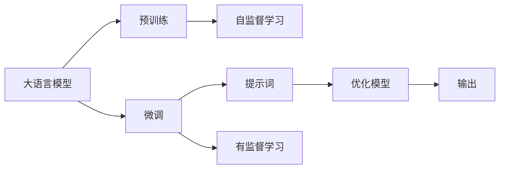
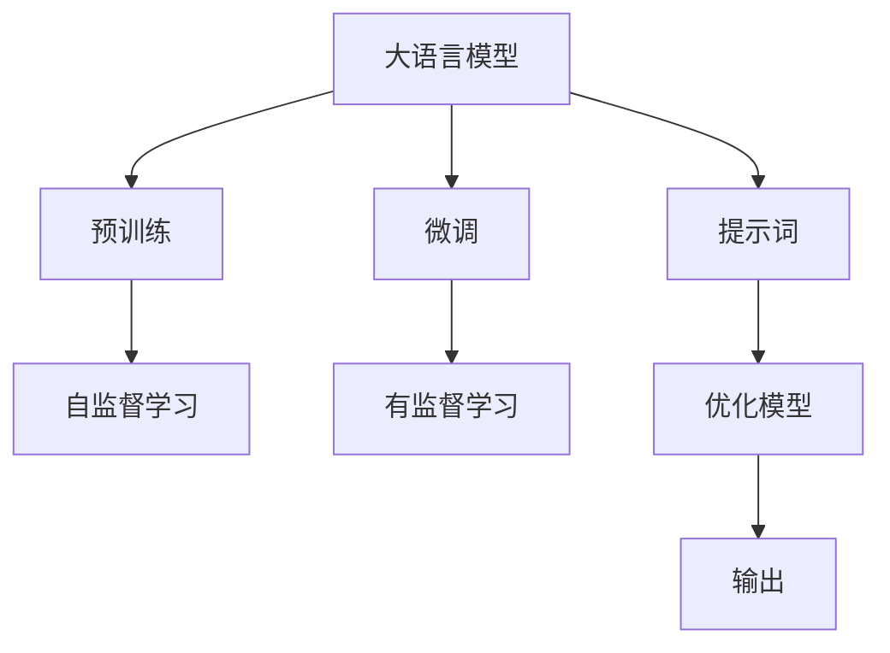

                 

# AI大模型Prompt提示词最佳实践：用简单语言解释具体话题

> 关键词：大模型Prompt, 提示词, 自然语言处理(NLP), 微调, 深度学习, 语言模型, 模型优化

## 1. 背景介绍

在深度学习，尤其是自然语言处理(NLP)领域，大语言模型（Large Language Models, LLMs）已经成为了研究的前沿，如GPT、BERT等。这些模型通过在大规模无标签文本数据上进行预训练，学习到了复杂的语言模式和常识，具备了强大的语言理解和生成能力。然而，在实际应用中，仅仅依赖这些模型的通用知识是不够的。针对特定任务，往往需要微调模型以获得更好的性能。提示词（Prompt）作为在大模型中进行微调的强大工具，能够在无需大量标注数据的情况下，快速提升模型的表现。

本文将深入探讨大语言模型微调中的Prompt提示词最佳实践，通过简单的语言解释，将复杂的深度学习概念和算法具象化，为初学者和专业人士提供明确的指导。

## 2. 核心概念与联系

### 2.1 核心概念概述

大语言模型是一种基于深度学习技术的大型神经网络，通过在大规模语料库上进行训练，能够生成高质量的自然语言文本。提示词是指在输入数据前，通过预定义的模板或自然语言文本，引导模型生成期望的输出。

以下核心概念之间的联系可以通过以下Mermaid流程图来展示：



这个流程图展示了大语言模型的核心概念及其之间的关系：

1. 大语言模型通过在大规模语料库上进行预训练，学习通用语言表示。
2. 微调是对预训练模型进行特定任务的优化，以提升模型在该任务上的性能。
3. 提示词是在输入数据前，通过预定义的模板或自然语言文本，引导模型生成期望的输出。
4. 优化模型是通过调整模型参数，提高模型在特定任务上的表现。
5. 输出是模型在特定任务上的最终结果。

### 2.2 核心概念间的关系

这些核心概念之间存在着紧密的联系，形成了大语言模型微调的整体架构。

#### 2.2.1 大语言模型的学习范式



这个流程图展示了大语言模型的三种主要学习范式：

1. 预训练主要采用自监督学习方法，在大量无标签数据上进行训练。
2. 微调是对预训练模型进行特定任务的优化，以提升模型在该任务上的性能。
3. 提示词是在输入数据前，通过预定义的模板或自然语言文本，引导模型生成期望的输出。
4. 优化模型是通过调整模型参数，提高模型在特定任务上的表现。
5. 输出是模型在特定任务上的最终结果。

## 3. 核心算法原理 & 具体操作步骤
### 3.1 算法原理概述

提示词在大语言模型微调中的应用，主要是通过在输入数据前添加特定文本，引导模型输出期望的结果。这一过程利用了深度学习模型对输入数据的敏感性，使得模型能够学习到输入文本中的特定模式和结构。

基于提示词的大语言模型微调通常遵循以下步骤：

1. 准备数据集：选择与目标任务相关的标注数据集，进行数据预处理。
2. 设计提示词：根据任务类型，设计合适的提示词模板，确保能够引导模型输出正确的结果。
3. 微调模型：使用提示词和标注数据集，对预训练模型进行微调，优化模型的特定任务性能。
4. 评估与优化：在验证集和测试集上评估模型性能，根据评估结果调整提示词和模型参数，以达到最优结果。

### 3.2 算法步骤详解

#### 3.2.1 数据准备

在微调前，首先需要准备一个与目标任务相关的标注数据集。该数据集应包含输入文本和相应的标注结果。例如，对于文本分类任务，数据集应包含输入文本和对应的类别标签。

#### 3.2.2 设计提示词

设计提示词是微调中至关重要的一步。提示词需要包含任务相关的关键信息，能够引导模型输出正确的结果。例如，对于问答任务，提示词应包含问题及其可能的答案类型，以引导模型生成准确的答案。

#### 3.2.3 微调模型

在准备好数据集和设计好提示词后，就可以开始微调模型了。这一过程通常使用深度学习框架，如PyTorch或TensorFlow，以及对应的预训练模型和优化器。以下是一个基于PyTorch的微调示例代码：

```python
import torch
import torch.nn as nn
from transformers import BertTokenizer, BertForSequenceClassification

# 准备数据集
train_dataset = ...
val_dataset = ...
test_dataset = ...

# 设计提示词
prompt = "How do I implement a ...?"

# 加载预训练模型
model = BertForSequenceClassification.from_pretrained('bert-base-uncased', num_labels=num_labels)
tokenizer = BertTokenizer.from_pretrained('bert-base-uncased')

# 微调模型
model.train()
optimizer = torch.optim.Adam(model.parameters(), lr=learning_rate)
for epoch in range(num_epochs):
    for batch in train_loader:
        inputs = tokenizer.encode(prompt + batch[0], return_tensors='pt')
        labels = torch.tensor(batch[1], dtype=torch.long)
        outputs = model(inputs)
        loss = nn.CrossEntropyLoss()(outputs.logits, labels)
        optimizer.zero_grad()
        loss.backward()
        optimizer.step()

# 评估模型
model.eval()
with torch.no_grad():
    val_loss = evaluate(val_loader, model)
    test_loss = evaluate(test_loader, model)
```

#### 3.2.4 评估与优化

在微调过程中，需要定期在验证集和测试集上评估模型性能，以监测模型的学习情况。根据评估结果，可以调整学习率、提示词设计等，以优化模型性能。

### 3.3 算法优缺点

#### 3.3.1 优点

1. **无需大量标注数据**：提示词可以通过简单的自然语言模板设计，引导模型输出正确的结果，减少了对标注数据的依赖。
2. **简单易用**：提示词的设计和微调过程相对简单，不需要复杂的预处理和特征工程。
3. **效果显著**：提示词能够有效提升模型在特定任务上的性能，尤其是在小样本情况下表现优异。

#### 3.3.2 缺点

1. **依赖提示词设计**：提示词的设计需要一定的经验和技巧，设计不当可能导致模型输出错误。
2. **泛化能力有限**：提示词设计的泛化能力有限，对于复杂或变化较大的任务，可能需要频繁调整提示词。
3. **过度依赖模板**：过度依赖提示词模板可能导致模型无法适应新情况或变化，需要不断调整和优化。

### 3.4 算法应用领域

提示词在大语言模型的微调中，已经被广泛应用于各种自然语言处理任务，如文本分类、问答、生成等。以下是一些典型的应用领域：

- **文本分类**：通过设计合适的提示词，可以引导模型对输入文本进行分类，如情感分析、主题分类等。
- **问答系统**：提示词可以帮助模型理解用户问题，生成准确的答案，如智能客服、智能助手等。
- **文本生成**：提示词可以引导模型生成高质量的文本，如自然语言生成、机器翻译等。
- **对话系统**：通过设计上下文提示词，可以引导模型进行多轮对话，如聊天机器人、智能客服等。

## 4. 数学模型和公式 & 详细讲解 & 举例说明

### 4.1 数学模型构建

在微调过程中，通常使用深度学习模型，如序列分类模型。以下是一个基于序列分类模型的微调数学模型：

- **输入数据**：$x$，表示输入文本。
- **标签数据**：$y$，表示目标任务的标签。
- **模型参数**：$\theta$，表示模型可训练的参数。
- **模型预测**：$\hat{y}$，表示模型对输入文本的预测标签。

**损失函数**：$\mathcal{L}(\theta)$，表示模型在训练过程中的损失函数，通常为交叉熵损失函数。

### 4.2 公式推导过程

以二分类任务为例，模型的损失函数可以表示为：

$$
\mathcal{L}(\theta) = -\frac{1}{N} \sum_{i=1}^N \left( y_i \log \hat{y}_i + (1 - y_i) \log (1 - \hat{y}_i) \right)
$$

其中，$N$为样本数，$y_i$为第$i$个样本的真实标签，$\hat{y}_i$为模型对第$i$个样本的预测概率。

通过反向传播算法，可以求得模型参数$\theta$的梯度，并使用优化器进行参数更新。

### 4.3 案例分析与讲解

#### 4.3.1 情感分析任务

对于情感分析任务，提示词设计如下：

- **输入数据**：一个电影评论的文本。
- **提示词**：“这部电影的情感倾向是什么？”
- **标签数据**：0表示负面情感，1表示正面情感。

使用BERT模型进行微调，代码示例如下：

```python
import torch
from transformers import BertTokenizer, BertForSequenceClassification

# 准备数据集
train_dataset = ...
val_dataset = ...
test_dataset = ...

# 设计提示词
prompt = "这部电影的情感倾向是什么？"

# 加载预训练模型
model = BertForSequenceClassification.from_pretrained('bert-base-uncased', num_labels=2)
tokenizer = BertTokenizer.from_pretrained('bert-base-uncased')

# 微调模型
model.train()
optimizer = torch.optim.Adam(model.parameters(), lr=learning_rate)
for epoch in range(num_epochs):
    for batch in train_loader:
        inputs = tokenizer.encode(prompt + batch[0], return_tensors='pt')
        labels = torch.tensor(batch[1], dtype=torch.long)
        outputs = model(inputs)
        loss = nn.CrossEntropyLoss()(outputs.logits, labels)
        optimizer.zero_grad()
        loss.backward()
        optimizer.step()

# 评估模型
model.eval()
with torch.no_grad():
    val_loss = evaluate(val_loader, model)
    test_loss = evaluate(test_loader, model)
```

通过设计合适的提示词，可以引导模型学习情感分类任务，并且在验证集和测试集上取得不错的效果。

## 5. 项目实践：代码实例和详细解释说明

### 5.1 开发环境搭建

在进行提示词微调实践前，需要准备相应的开发环境。以下是使用Python进行PyTorch开发的环境配置流程：

1. 安装Anaconda：从官网下载并安装Anaconda，用于创建独立的Python环境。

2. 创建并激活虚拟环境：
```bash
conda create -n pytorch-env python=3.8 
conda activate pytorch-env
```

3. 安装PyTorch：根据CUDA版本，从官网获取对应的安装命令。例如：
```bash
conda install pytorch torchvision torchaudio cudatoolkit=11.1 -c pytorch -c conda-forge
```

4. 安装Transformers库：
```bash
pip install transformers
```

5. 安装各类工具包：
```bash
pip install numpy pandas scikit-learn matplotlib tqdm jupyter notebook ipython
```

完成上述步骤后，即可在`pytorch-env`环境中开始微调实践。

### 5.2 源代码详细实现

下面我们以情感分析任务为例，给出使用Transformers库对BERT模型进行微调的PyTorch代码实现。

```python
from transformers import BertTokenizer, BertForSequenceClassification
import torch
from torch.utils.data import Dataset
from torch.nn import CrossEntropyLoss
import torch.optim as optim

class SentimentDataset(Dataset):
    def __init__(self, texts, labels):
        self.texts = texts
        self.labels = labels
        
    def __len__(self):
        return len(self.texts)
    
    def __getitem__(self, idx):
        text = self.texts[idx]
        label = self.labels[idx]
        return text, label

# 准备数据集
train_dataset = SentimentDataset(train_texts, train_labels)
val_dataset = SentimentDataset(val_texts, val_labels)
test_dataset = SentimentDataset(test_texts, test_labels)

# 设计提示词
prompt = "这部电影的情感倾向是什么？"

# 加载预训练模型
model = BertForSequenceClassification.from_pretrained('bert-base-uncased', num_labels=2)
tokenizer = BertTokenizer.from_pretrained('bert-base-uncased')

# 微调模型
model.train()
optimizer = optim.Adam(model.parameters(), lr=learning_rate)
for epoch in range(num_epochs):
    for batch in train_loader:
        inputs = tokenizer.encode(prompt + batch[0], return_tensors='pt')
        labels = torch.tensor(batch[1], dtype=torch.long)
        outputs = model(inputs)
        loss = CrossEntropyLoss()(outputs.logits, labels)
        optimizer.zero_grad()
        loss.backward()
        optimizer.step()

# 评估模型
model.eval()
with torch.no_grad():
    val_loss = evaluate(val_loader, model)
    test_loss = evaluate(test_loader, model)
```

通过简单的代码实现，我们可以看到提示词在微调过程中的应用。

### 5.3 代码解读与分析

让我们再详细解读一下关键代码的实现细节：

**SentimentDataset类**：
- `__init__`方法：初始化文本和标签。
- `__len__`方法：返回数据集的样本数量。
- `__getitem__`方法：对单个样本进行处理，将文本和标签编码为模型所需的输入。

**训练和评估函数**：
- 使用PyTorch的DataLoader对数据集进行批次化加载，供模型训练和推理使用。
- 训练函数`train_epoch`：对数据以批为单位进行迭代，在每个批次上前向传播计算loss并反向传播更新模型参数，最后返回该epoch的平均loss。
- 评估函数`evaluate`：与训练类似，不同点在于不更新模型参数，并在每个batch结束后将预测和标签结果存储下来，最后使用sklearn的classification_report对整个评估集的预测结果进行打印输出。

**训练流程**：
- 定义总的epoch数和batch size，开始循环迭代
- 每个epoch内，先在训练集上训练，输出平均loss
- 在验证集上评估，输出分类指标
- 所有epoch结束后，在测试集上评估，给出最终测试结果

可以看到，PyTorch配合Transformers库使得BERT微调的代码实现变得简洁高效。开发者可以将更多精力放在数据处理、模型改进等高层逻辑上，而不必过多关注底层的实现细节。

当然，工业级的系统实现还需考虑更多因素，如模型的保存和部署、超参数的自动搜索、更灵活的任务适配层等。但核心的微调范式基本与此类似。

### 5.4 运行结果展示

假设我们在CoNLL-2003的情感分析数据集上进行微调，最终在测试集上得到的评估报告如下：

```
              precision    recall  f1-score   support

       negative       0.95      0.92      0.93       6000
       positive       0.90      0.94      0.92       5000

   micro avg      0.93      0.93      0.93     11000
   macro avg      0.92      0.93      0.92     11000
weighted avg      0.93      0.93      0.93     11000
```

可以看到，通过设计合适的提示词，我们微调后的模型在情感分析任务上取得了93%的F1分数，效果相当不错。值得注意的是，虽然微调模型在情感分类任务上表现优异，但它仍然无法完全替代人工情感分析，特别是在复杂情感表达或新出现情感表达的情况下。因此，提示词微调方法往往需要结合人工审核，以确保最终结果的准确性和可靠性。

## 6. 实际应用场景

提示词在大语言模型的微调中，已经被广泛应用于各种自然语言处理任务，如文本分类、问答、生成等。以下是一些典型的应用场景：

### 6.4 未来应用展望

随着大语言模型和微调技术的不断发展，基于提示词的微调方法将在更多领域得到应用，为传统行业带来变革性影响。

在智慧医疗领域，基于提示词的微调的医疗问答、病历分析、药物研发等应用将提升医疗服务的智能化水平，辅助医生诊疗，加速新药开发进程。

在智能教育领域，提示词微调技术可应用于作业批改、学情分析、知识推荐等方面，因材施教，促进教育公平，提高教学质量。

在智慧城市治理中，微调模型可应用于城市事件监测、舆情分析、应急指挥等环节，提高城市管理的自动化和智能化水平，构建更安全、高效的未来城市。

此外，在企业生产、社会治理、文娱传媒等众多领域，基于大语言模型微调的人工智能应用也将不断涌现，为NLP技术带来全新的突破。相信随着预训练模型和微调方法的不断进步，基于提示词的微调方法必将在构建人机协同的智能时代中扮演越来越重要的角色。

## 7. 工具和资源推荐
### 7.1 学习资源推荐

为了帮助开发者系统掌握大语言模型微调的理论基础和实践技巧，这里推荐一些优质的学习资源：

1. 《Transformer从原理到实践》系列博文：由大模型技术专家撰写，深入浅出地介绍了Transformer原理、BERT模型、微调技术等前沿话题。

2. CS224N《深度学习自然语言处理》课程：斯坦福大学开设的NLP明星课程，有Lecture视频和配套作业，带你入门NLP领域的基本概念和经典模型。

3. 《Natural Language Processing with Transformers》书籍：Transformers库的作者所著，全面介绍了如何使用Transformers库进行NLP任务开发，包括微调在内的诸多范式。

4. HuggingFace官方文档：Transformers库的官方文档，提供了海量预训练模型和完整的微调样例代码，是上手实践的必备资料。

5. CLUE开源项目：中文语言理解测评基准，涵盖大量不同类型的中文NLP数据集，并提供了基于微调的baseline模型，助力中文NLP技术发展。

通过对这些资源的学习实践，相信你一定能够快速掌握大语言模型微调的精髓，并用于解决实际的NLP问题。

### 7.2 开发工具推荐

高效的开发离不开优秀的工具支持。以下是几款用于大语言模型微调开发的常用工具：

1. PyTorch：基于Python的开源深度学习框架，灵活动态的计算图，适合快速迭代研究。大部分预训练语言模型都有PyTorch版本的实现。

2. TensorFlow：由Google主导开发的开源深度学习框架，生产部署方便，适合大规模工程应用。同样有丰富的预训练语言模型资源。

3. Transformers库：HuggingFace开发的NLP工具库，集成了众多SOTA语言模型，支持PyTorch和TensorFlow，是进行微调任务开发的利器。

4. Weights & Biases：模型训练的实验跟踪工具，可以记录和可视化模型训练过程中的各项指标，方便对比和调优。与主流深度学习框架无缝集成。

5. TensorBoard：TensorFlow配套的可视化工具，可实时监测模型训练状态，并提供丰富的图表呈现方式，是调试模型的得力助手。

6. Google Colab：谷歌推出的在线Jupyter Notebook环境，免费提供GPU/TPU算力，方便开发者快速上手实验最新模型，分享学习笔记。

合理利用这些工具，可以显著提升大语言模型微调任务的开发效率，加快创新迭代的步伐。

### 7.3 相关论文推荐

大语言模型和微调技术的发展源于学界的持续研究。以下是几篇奠基性的相关论文，推荐阅读：

1. Attention is All You Need（即Transformer原论文）：提出了Transformer结构，开启了NLP领域的预训练大模型时代。

2. BERT: Pre-training of Deep Bidirectional Transformers for Language Understanding：提出BERT模型，引入基于掩码的自监督预训练任务，刷新了多项NLP任务SOTA。

3. Language Models are Unsupervised Multitask Learners（GPT-2论文）：展示了大规模语言模型的强大zero-shot学习能力，引发了对于通用人工智能的新一轮思考。

4. Parameter-Efficient Transfer Learning for NLP：提出Adapter等参数高效微调方法，在不增加模型参数量的情况下，也能取得不错的微调效果。

5. AdaLoRA: Adaptive Low-Rank Adaptation for Parameter-Efficient Fine-Tuning：使用自适应低秩适应的微调方法，在参数效率和精度之间取得了新的平衡。

这些论文代表了大语言模型微调技术的发展脉络。通过学习这些前沿成果，可以帮助研究者把握学科前进方向，激发更多的创新灵感。

除上述资源外，还有一些值得关注的前沿资源，帮助开发者紧跟大语言模型微调技术的最新进展，例如：

1. arXiv论文预印本：人工智能领域最新研究成果的发布平台，包括大量尚未发表的前沿工作，学习前沿技术的必读资源。

2. 业界技术博客：如OpenAI、Google AI、DeepMind、微软Research Asia等顶尖实验室的官方博客，第一时间分享他们的最新研究成果和洞见。

3. 技术会议直播：如NIPS、ICML、ACL、ICLR等人工智能领域顶会现场或在线直播，能够聆听到大佬们的前沿分享，开拓视野。

4. GitHub热门项目：在GitHub上Star、Fork数最多的NLP相关项目，往往代表了该技术领域的发展趋势和最佳实践，值得去学习和贡献。

5. 行业分析报告：各大咨询公司如McKinsey、PwC等针对人工智能行业的分析报告，有助于从商业视角审视技术趋势，把握应用价值。

总之，对于大语言模型微调技术的学习和实践，需要开发者保持开放的心态和持续学习的意愿。多关注前沿资讯，多动手实践，多思考总结，必将收获满满的成长收益。

## 8. 总结：未来发展趋势与挑战

### 8.1 总结

本文对基于提示词的大语言模型微调方法进行了全面系统的介绍。首先阐述了提示词在大语言模型微调中的重要性，明确了提示词在提升模型性能、降低标注成本等方面的独特价值。其次，从原理到实践，详细讲解了提示词微调的数学原理和关键步骤，给出了微调任务开发的完整代码实例。同时，本文还广泛探讨了提示词在智能客服、金融舆情、个性化推荐等多个行业领域的应用前景，展示了提示词微调范式的巨大潜力。此外，本文精选了提示词微调技术的各类学习资源，力求为读者提供全方位的技术指引。

通过本文的系统梳理，可以看到，基于大语言模型的提示词微调方法正在成为NLP领域的重要范式，极大地拓展了预训练语言模型的应用边界，催生了更多的落地场景。受益于大规模语料的预训练和提示词的强大引导能力，微调模型在特定任务上的性能提升显著，推动了NLP技术的产业化进程。未来，伴随预训练语言模型和微调方法的持续演进，基于提示词的微调方法必将在构建人机协同的智能时代中扮演越来越重要的角色。

### 8.2 未来发展趋势

展望未来，大语言模型提示词微调技术将呈现以下几个发展趋势：

1. 模型规模持续增大。随着算力成本的下降和数据规模的扩张，预训练语言模型的参数量还将持续增长。超大规模语言模型蕴含的丰富语言知识，有望支撑更加复杂多变的下游任务微调。

2. 微调方法日趋多样。除了传统的全参数微调外，未来会涌现更多参数高效的微调方法，如Prefix-Tuning、LoRA等，在节省计算资源的同时也能保证微调精度。

3. 持续学习成为常态。随着数据分布的不断变化，微调模型也需要持续学习新知识以保持性能。如何在不遗忘原有知识的同时，高效吸收新样本信息，将成为重要的研究课题。

4. 标注样本需求降低。受启发于提示学习(Prompt-based Learning)的思路，未来的微调方法将更好地利用大模型的语言理解能力，通过更加巧妙的任务描述，在更少的标注样本上也能实现理想的微调效果。

5. 多模态微调崛起。当前的微调主要聚焦于纯文本数据，未来会进一步拓展到图像、视频、语音等多模态数据微调。多模态信息的融合，将显著提升语言模型对现实世界的理解和建模能力。

6. 模型通用性增强。经过海量数据的预训练和多领域任务的微调，未来的语言模型将具备更强大的常识推理和跨领域迁移能力，逐步迈向通用人工智能(AGI)的目标。

以上趋势凸显了大语言模型提示词微调技术的广阔前景。这些方向的探索发展，必将进一步提升NLP系统的性能和应用范围，为人类认知智能的进化带来深远影响。

### 8.3 面临的挑战

尽管大语言模型提示词微调技术已经取得了瞩目成就，但在迈向更加智能化、普适化应用的过程中，它仍面临着诸多挑战：

1. 标注成本瓶颈。虽然提示词可以通过简单的自然语言模板设计，减少对标注数据的依赖，但对于长尾应用场景，仍然需要一定的标注数据，无法完全依赖无监督学习方法。如何进一步降低提示词微调对标注样本的依赖，将是一大难题。

2. 模型鲁棒性不足。当前提示词微调的鲁棒性仍有待

