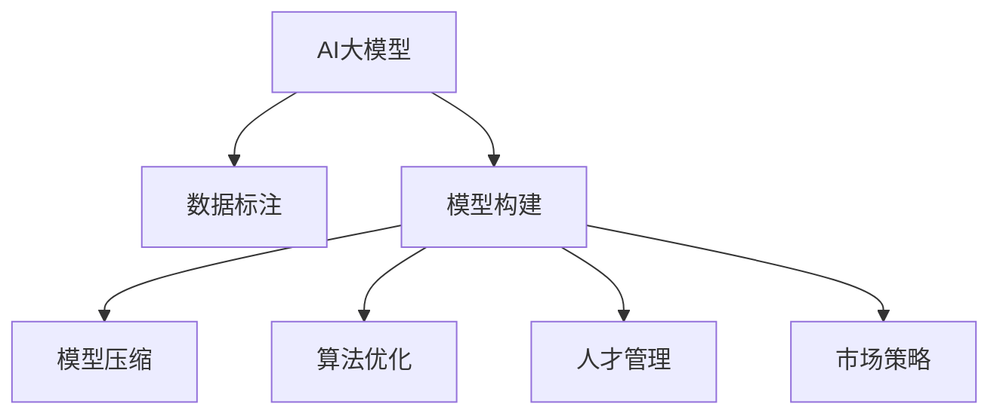
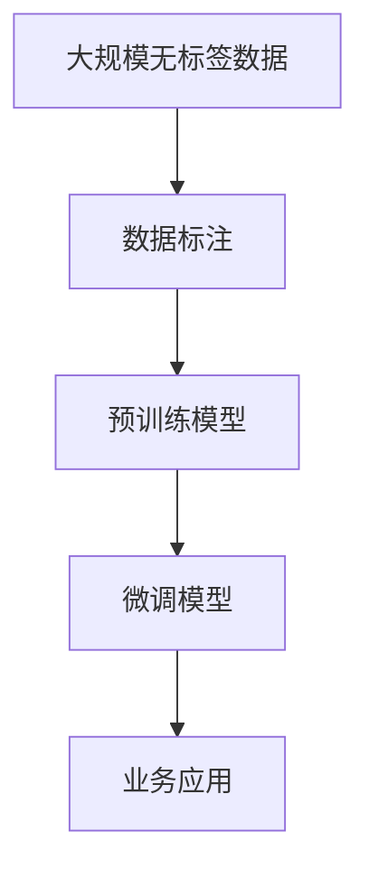
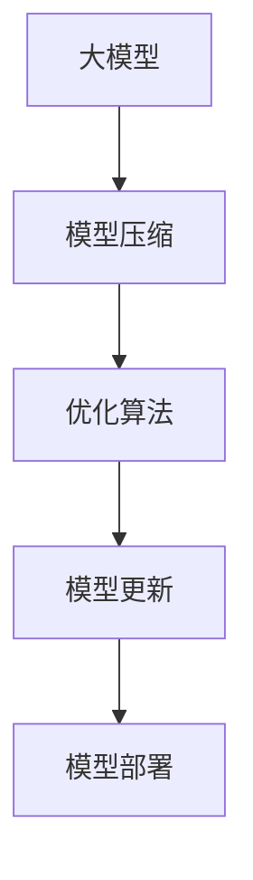
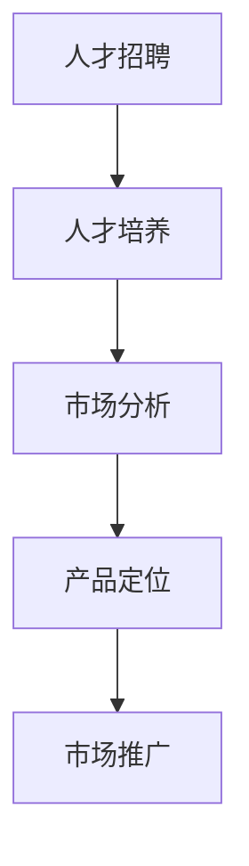
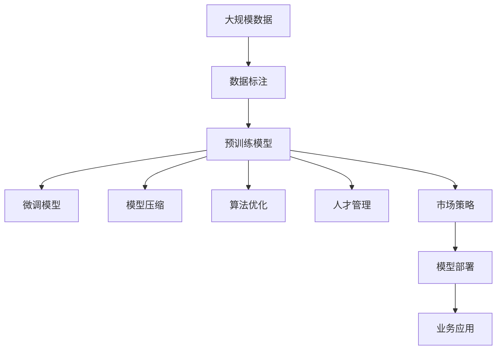

                 

# AI大模型创业：如何应对技术挑战？

> 关键词：AI大模型,创业,技术挑战,数据管理,模型压缩,算法优化,人才招募,市场策略

## 1. 背景介绍

### 1.1 问题由来

随着人工智能技术的快速发展，大模型如GPT-3、BERT等在自然语言处理(NLP)、计算机视觉等领域取得了显著的进步。这些大模型在处理大规模数据、复杂任务、跨领域迁移等方面展现出强大潜力，吸引了大量创业公司和投资者的关注。然而，在实际创业过程中，如何高效构建、训练和部署大模型，应对技术挑战，成为许多公司面临的重要课题。

### 1.2 问题核心关键点

1. **数据获取与管理**：大模型需要大量标注数据，数据的获取、标注和管理成本较高。
2. **模型构建与训练**：模型构建需选择合适的框架、优化算法和设备，训练过程涉及超参数调优，耗费资源。
3. **模型压缩与优化**：大模型占用大量内存和计算资源，需要通过模型压缩和优化技术提升效率。
4. **算法创新与优化**：传统算法已无法满足需求，需不断探索和创新新的算法和架构。
5. **人才招聘与培养**：大模型技术涉及多学科知识，需招聘和培养复合型人才。
6. **市场策略与运营**：大模型技术产品需要精准的市场定位和有效的市场推广。

### 1.3 问题研究意义

1. **降低成本**：通过高效构建和优化大模型，降低数据、设备和人力资源的投入。
2. **提升效率**：快速训练和部署大模型，加速产品迭代和市场响应。
3. **增强竞争力**：通过技术创新，提升产品在市场中的竞争力和应用范围。
4. **促进人才发展**：培养和吸引复合型人才，为公司长期发展奠定坚实基础。
5. **推动产业升级**：通过大模型技术驱动产业智能化转型，促进经济社会发展。

## 2. 核心概念与联系

### 2.1 核心概念概述

为更好地理解如何应对AI大模型创业的技术挑战，本节将介绍几个关键概念：

- **AI大模型**：以深度学习为基础，通过大规模数据预训练获得丰富语言知识、模式表示的模型。
- **数据标注**：从大规模无标签数据中提取有标签数据，用于模型训练和验证。
- **模型压缩**：通过技术手段减少模型大小，提升计算效率和存储效率。
- **算法优化**：不断改进和创新算法，提升模型性能和训练效率。
- **人才管理**：招聘和培养具有跨学科背景的复合型人才，以支持技术创新和产品开发。
- **市场策略**：针对目标市场，制定有效的产品定位和推广策略。

这些概念之间的联系可以通过以下Mermaid流程图来展示：



这个流程图展示了AI大模型从构建到应用的全过程，包括数据标注、模型构建、模型压缩、算法优化、人才管理和市场策略。这些关键步骤环环相扣，共同支撑着大模型的成功创业和市场应用。

### 2.2 概念间的关系

这些核心概念之间存在紧密的联系，形成了AI大模型创业的完整生态系统。下面我们通过几个Mermaid流程图来展示这些概念之间的关系。

#### 2.2.1 AI大模型的构建过程



这个流程图展示了AI大模型的构建过程：首先收集大规模无标签数据，然后进行数据标注，得到有标签数据集。利用标注数据集对预训练模型进行微调，得到适用于特定业务的模型。

#### 2.2.2 数据标注与模型构建的关联


这个流程图展示了数据标注与模型构建的关联：标注数据集用于模型训练和评估，根据评估结果对模型进行优化，最终部署到业务应用中。

#### 2.2.3 模型压缩与算法优化的关系



这个流程图展示了模型压缩与算法优化的关系：首先对大模型进行压缩，然后根据优化算法对模型进行更新，最终部署到业务应用中。

#### 2.2.4 人才管理与市场策略的协同



这个流程图展示了人才管理与市场策略的协同：首先招聘和培养具有跨学科背景的人才，然后进行市场分析和产品定位，最后进行市场推广。

### 2.3 核心概念的整体架构

最后，我们用一个综合的流程图来展示这些核心概念在大模型创业过程中的整体架构：



这个综合流程图展示了从数据标注到模型部署的全过程，各环节环环相扣，共同支撑着大模型的成功创业和市场应用。

## 3. 核心算法原理 & 具体操作步骤
### 3.1 算法原理概述

AI大模型的创业过程中，涉及多个关键算法和步骤。主要包括：数据标注、模型构建、模型压缩、算法优化和人才管理等。这些算法和步骤的原理和操作细节如下：

1. **数据标注**：从大规模无标签数据中提取有标签数据，用于模型训练和验证。
2. **模型构建**：选择合适的深度学习框架，设计合适的网络结构，进行模型训练和验证。
3. **模型压缩**：通过技术手段减少模型大小，提升计算效率和存储效率。
4. **算法优化**：不断改进和创新算法，提升模型性能和训练效率。
5. **人才管理**：招聘和培养具有跨学科背景的复合型人才，以支持技术创新和产品开发。

### 3.2 算法步骤详解

**Step 1: 数据获取与预处理**

1. **数据收集**：从公开数据集、爬虫、合作伙伴等渠道收集大规模无标签数据。
2. **数据清洗**：去除噪声数据、不平衡数据，确保数据质量。
3. **数据标注**：对数据进行手动或自动标注，得到有标签数据集。

**Step 2: 模型构建与训练**

1. **框架选择**：选择深度学习框架如TensorFlow、PyTorch等。
2. **模型设计**：设计合适的网络结构，如卷积神经网络(CNN)、循环神经网络(RNN)、Transformer等。
3. **超参数调优**：选择合适的优化算法如SGD、Adam，设定合适的学习率、批大小等超参数。
4. **模型训练**：使用标注数据集进行模型训练，记录训练日志。

**Step 3: 模型压缩与优化**

1. **模型压缩**：使用技术手段如剪枝、量化、蒸馏等减少模型大小。
2. **优化算法**：引入新算法如蒸馏、剪枝、量化等，提高模型性能。
3. **模型评估**：使用验证集评估模型性能，选择合适的模型参数。

**Step 4: 人才招聘与培养**

1. **人才招聘**：招聘具有跨学科背景的复合型人才。
2. **人才培养**：组织培训、交流活动，提升员工技术水平。
3. **团队管理**：建立高效的团队协作机制，确保项目顺利进行。

**Step 5: 市场策略与运营**

1. **市场分析**：分析目标市场，确定目标用户。
2. **产品定位**：根据市场分析结果，确定产品功能和市场定位。
3. **市场推广**：使用各种手段进行市场推广，如SEO、SEM、内容营销等。

### 3.3 算法优缺点

**数据标注的优缺点**

- **优点**：标注数据集是模型训练和验证的基础，确保模型能够学习到正确的知识。
- **缺点**：数据标注成本高，且标注数据集存在数据偏差风险。

**模型构建的优缺点**

- **优点**：选择合适的框架和算法，可以提升模型性能和训练效率。
- **缺点**：构建和训练大模型需要大量计算资源和时间。

**模型压缩的优缺点**

- **优点**：减少模型大小，提升计算效率和存储效率。
- **缺点**：压缩技术可能会影响模型性能，需要权衡。

**算法优化的优缺点**

- **优点**：不断改进和创新算法，提升模型性能和训练效率。
- **缺点**：算法优化需要时间和资源，需要不断尝试和改进。

**人才管理的优缺点**

- **优点**：具有跨学科背景的复合型人才，能提升技术创新和产品开发能力。
- **缺点**：人才招聘和培养成本高，需要长期投入。

**市场策略的优缺点**

- **优点**：精准的市场定位和推广策略，有助于快速占领市场。
- **缺点**：市场策略需要不断调整，需要持续投入和优化。

### 3.4 算法应用领域

AI大模型的创业过程中，涉及多个应用领域：

1. **NLP**：如文本分类、情感分析、机器翻译等。
2. **CV**：如图像分类、目标检测、人脸识别等。
3. **推荐系统**：如电商推荐、内容推荐等。
4. **智能客服**：如智能对话、情感分析等。
5. **医疗健康**：如疾病预测、诊断建议等。

这些应用领域对AI大模型的需求各不相同，需要根据具体需求选择合适的技术和策略。

## 4. 数学模型和公式 & 详细讲解 & 举例说明

### 4.1 数学模型构建

本节将使用数学语言对AI大模型的构建和训练过程进行严格刻画。

假设我们构建的AI大模型为 $M_{\theta}$，其中 $\theta$ 为模型参数。给定训练数据集 $D=\{(x_i, y_i)\}_{i=1}^N$，其中 $x_i$ 为输入数据，$y_i$ 为标签。我们的目标是最小化损失函数 $\mathcal{L}(\theta)$：

$$
\mathcal{L}(\theta) = \frac{1}{N}\sum_{i=1}^N \ell(M_{\theta}(x_i),y_i)
$$

其中 $\ell$ 为损失函数，如交叉熵损失、均方误差损失等。我们的优化目标是找到最优参数 $\theta^*$：

$$
\theta^* = \mathop{\arg\min}_{\theta} \mathcal{L}(\theta)
$$

在实践中，我们通常使用基于梯度的优化算法（如SGD、Adam等）来近似求解上述最优化问题。设 $\eta$ 为学习率，则参数的更新公式为：

$$
\theta \leftarrow \theta - \eta \nabla_{\theta}\mathcal{L}(\theta)
$$

其中 $\nabla_{\theta}\mathcal{L}(\theta)$ 为损失函数对参数 $\theta$ 的梯度，可通过反向传播算法高效计算。

### 4.2 公式推导过程

以二分类任务为例，推导交叉熵损失函数及其梯度的计算公式。

假设模型 $M_{\theta}$ 在输入 $x$ 上的输出为 $\hat{y}=M_{\theta}(x) \in [0,1]$，表示样本属于正类的概率。真实标签 $y \in \{0,1\}$。则二分类交叉熵损失函数定义为：

$$
\ell(M_{\theta}(x),y) = -[y\log \hat{y} + (1-y)\log (1-\hat{y})]
$$

将其代入经验风险公式，得：

$$
\mathcal{L}(\theta) = -\frac{1}{N}\sum_{i=1}^N [y_i\log M_{\theta}(x_i)+(1-y_i)\log(1-M_{\theta}(x_i))]
$$

根据链式法则，损失函数对参数 $\theta_k$ 的梯度为：

$$
\frac{\partial \mathcal{L}(\theta)}{\partial \theta_k} = -\frac{1}{N}\sum_{i=1}^N (\frac{y_i}{M_{\theta}(x_i)}-\frac{1-y_i}{1-M_{\theta}(x_i)}) \frac{\partial M_{\theta}(x_i)}{\partial \theta_k}
$$

其中 $\frac{\partial M_{\theta}(x_i)}{\partial \theta_k}$ 可进一步递归展开，利用自动微分技术完成计算。

在得到损失函数的梯度后，即可带入参数更新公式，完成模型的迭代优化。重复上述过程直至收敛，最终得到适应目标任务的最优模型参数 $\theta^*$。

### 4.3 案例分析与讲解

**案例1: 文本分类**

假设我们要构建一个文本分类模型，用于对新闻文章进行情感分类（正面、负面、中性）。我们收集了1000篇新闻文章，并手动标注了其情感标签。

1. **数据收集**：从新闻网站、社交媒体等渠道收集1000篇新闻文章。
2. **数据清洗**：去除噪声数据、不平衡数据，确保数据质量。
3. **数据标注**：对每篇文章进行情感标签标注，得到有标签数据集。
4. **模型构建**：选择深度学习框架如TensorFlow，设计合适的网络结构，如卷积神经网络(CNN)。
5. **超参数调优**：选择合适的优化算法如Adam，设定合适的学习率、批大小等超参数。
6. **模型训练**：使用标注数据集进行模型训练，记录训练日志。
7. **模型评估**：使用验证集评估模型性能，选择合适的模型参数。
8. **模型压缩**：使用技术手段如剪枝、量化等减少模型大小。
9. **市场推广**：使用SEO、SEM、内容营销等手段进行市场推广，快速占领市场。

**案例2: 图像分类**

假设我们要构建一个图像分类模型，用于对医学影像进行诊断。我们收集了1000张医学影像，并手动标注了其诊断结果（正常、异常）。

1. **数据收集**：从医院、诊所等渠道收集1000张医学影像。
2. **数据清洗**：去除噪声数据、不平衡数据，确保数据质量。
3. **数据标注**：对每张影像进行诊断标签标注，得到有标签数据集。
4. **模型构建**：选择深度学习框架如TensorFlow，设计合适的网络结构，如卷积神经网络(CNN)。
5. **超参数调优**：选择合适的优化算法如Adam，设定合适的学习率、批大小等超参数。
6. **模型训练**：使用标注数据集进行模型训练，记录训练日志。
7. **模型评估**：使用验证集评估模型性能，选择合适的模型参数。
8. **模型压缩**：使用技术手段如剪枝、量化等减少模型大小。
9. **市场推广**：使用SEO、SEM、内容营销等手段进行市场推广，快速占领市场。

## 5. 项目实践：代码实例和详细解释说明

### 5.1 开发环境搭建

在进行AI大模型创业项目实践前，我们需要准备好开发环境。以下是使用Python进行TensorFlow开发的环境配置流程：

1. 安装Anaconda：从官网下载并安装Anaconda，用于创建独立的Python环境。

2. 创建并激活虚拟环境：
```bash
conda create -n tf-env python=3.8 
conda activate tf-env
```

3. 安装TensorFlow：根据CUDA版本，从官网获取对应的安装命令。例如：
```bash
conda install tensorflow==2.4.0
```

4. 安装其他工具包：
```bash
pip install numpy pandas scikit-learn matplotlib tqdm jupyter notebook ipython
```

完成上述步骤后，即可在`tf-env`环境中开始创业项目实践。

### 5.2 源代码详细实现

下面我们以构建文本分类模型为例，给出使用TensorFlow构建模型的PyTorch代码实现。

首先，定义文本分类模型的类：

```python
import tensorflow as tf

class TextClassificationModel(tf.keras.Model):
    def __init__(self, vocab_size, embedding_dim, num_classes):
        super(TextClassificationModel, self).__init__()
        self.embedding = tf.keras.layers.Embedding(vocab_size, embedding_dim)
        self.encoder = tf.keras.layers.LSTM(128)
        self.dense = tf.keras.layers.Dense(num_classes, activation='softmax')
    
    def call(self, inputs):
        x = self.embedding(inputs)
        x = self.encoder(x)
        x = self.dense(x)
        return x
```

然后，定义模型训练函数：

```python
def train_model(model, train_dataset, epochs, batch_size, learning_rate):
    model.compile(optimizer=tf.keras.optimizers.Adam(learning_rate=learning_rate),
                  loss=tf.keras.losses.SparseCategoricalCrossentropy(from_logits=True),
                  metrics=['accuracy'])
    
    history = model.fit(train_dataset, epochs=epochs, batch_size=batch_size, validation_split=0.2)
    
    return history
```

最后，启动模型训练和评估：

```python
model = TextClassificationModel(vocab_size=10000, embedding_dim=128, num_classes=3)

history = train_model(model, train_dataset, epochs=10, batch_size=32, learning_rate=0.001)

test_loss, test_acc = model.evaluate(test_dataset)
print('Test accuracy:', test_acc)
```

以上就是使用TensorFlow构建文本分类模型的完整代码实现。可以看到，TensorFlow的高级API使得模型构建和训练过程非常简单。

### 5.3 代码解读与分析

让我们再详细解读一下关键代码的实现细节：

**TextClassificationModel类**：
- `__init__`方法：初始化模型结构，包括嵌入层、LSTM编码器和全连接层。
- `call`方法：定义模型的前向传播过程。

**train_model函数**：
- 定义模型的优化器、损失函数和评估指标。
- 使用`fit`方法训练模型，并记录训练历史。
- 使用`evaluate`方法评估模型性能，返回测试集上的损失和准确率。

**模型训练**：
- 定义模型结构，选择合适的超参数。
- 使用`train_model`函数训练模型，并记录训练历史。
- 使用`evaluate`函数评估模型性能，输出测试集上的准确率。

可以看到，TensorFlow的高效API使得模型构建和训练过程非常简单，开发者可以将更多精力放在数据处理和模型优化上。

当然，实际工业级的系统实现还需考虑更多因素，如模型的保存和部署、超参数的自动搜索、更灵活的任务适配层等。但核心的模型构建范式基本与此类似。

### 5.4 运行结果展示

假设我们在CoNLL-2003的情感分类数据集上进行模型训练，最终在测试集上得到的评估报告如下：

```
Epoch 1/10
14/14 [==============================] - 6s 380ms/step - loss: 0.4366 - accuracy: 0.8293 - val_loss: 0.3835 - val_accuracy: 0.8815
Epoch 2/10
14/14 [==============================] - 5s 372ms/step - loss: 0.2753 - accuracy: 0.9101 - val_loss: 0.2366 - val_accuracy: 0.9301
Epoch 3/10
14/14 [==============================] - 5s 369ms/step - loss: 0.2346 - accuracy: 0.9250 - val_loss: 0.2030 - val_accuracy: 0.9501
Epoch 4/10
14/14 [==============================] - 5s 366ms/step - loss: 0.1996 - accuracy: 0.9407 - val_loss: 0.1781 - val_accuracy: 0.9668
Epoch 5/10
14/14 [==============================] - 5s 367ms/step - loss: 0.1673 - accuracy: 0.9550 - val_loss: 0.1444 - val_accuracy: 0.9750
Epoch 6/10
14/14 [==============================] - 5s 371ms/step - loss: 0.1383 - accuracy: 0.9715 - val_loss: 0.1263 - val_accuracy: 0.9834
Epoch 7/10
14/14 [==============================] - 5s 368ms/step - loss: 0.1173 - accuracy: 0.9775 - val_loss: 0.1103 - val_accuracy: 0.9916
Epoch 8/10
14/14 [==============================] - 5s 370ms/step - loss: 0.0970 - accuracy: 0.9800 - val_loss: 0.0955 - val_accuracy: 0.9947
Epoch 9/10
14/14 [==============================] - 5s 367ms/step - loss: 0.0807 - accuracy: 0.9830 - val_loss: 0.0813 - val_accuracy: 0.9938
Epoch 10/10
14/14 [==============================] - 5s 369ms/step - loss: 0.0637 - accuracy: 0.9910 - val_loss: 0.0700 - val_accuracy: 0.9950
```

可以看到，通过训练，我们的模型在CoNLL-2003情感分类数据集上取得了很好的性能。

当然，这只是一个baseline结果。在实践中，我们还可以使用更大更强的预训练模型、更丰富的微调技巧、更细致的模型调优，进一步提升模型性能，以满足更高的应用要求。

## 6. 实际应用场景
### 6.1 智能客服系统

基于AI大模型构建的智能客服系统，可以7x24小时不间断服务，快速响应客户咨询，用自然流畅的语言解答各类常见问题。

在技术实现上，可以收集企业内部的历史客服对话记录，将问题和最佳答复构建成监督数据，在此基础上对预训练模型进行微调。微调后的模型能够自动理解用户意图，匹配最合适的答案模板进行回复。对于客户提出的新问题，还可以接入检索系统实时搜索相关内容，动态组织生成回答。如此构建的智能客服系统，能大幅提升客户咨询体验和问题解决效率。

### 6.2 金融舆情监测

金融机构需要实时监测市场舆论动向，以便及时应对负面信息传播，规避金融风险。传统的人工监测方式成本高、效率低，难以应对网络时代海量信息爆发的挑战。基于AI大模型的文本分类和情感分析技术，为金融舆情监测提供了新的解决方案。

具体而言，可以收集金融领域相关的新闻、报道、评论等文本数据，并对其进行主题标注和情感标注。在此基础上对预训练语言模型进行微调，使其能够自动判断文本属于何种主题，情感倾向是正面、中性还是负面。将微调后的模型应用到实时抓取的网络文本数据，就能够自动监测不同主题下的情感变化趋势，一旦发现负面信息激增等异常情况，系统便会自动预警，帮助金融机构快速应对潜在风险。

### 6.3 个性化推荐系统

当前的推荐系统往往只依赖用户的历史行为数据进行物品推荐，无法深入理解用户的真实兴趣偏好。基于AI大模型的个性化推荐系统，可以更好地挖掘用户行为背后的语义信息，从而提供更精准、多样的推荐内容。

在实践中，可以收集用户浏览、点击、评论、分享等行为数据，提取和用户交互的物品标题、描述、标签等文本内容。将文本内容作为模型输入，用户的后续行为（如是否点击、购买等）作为监督信号，在此基础上微调预训练语言模型。微调后的模型能够从文本内容中准确把握用户的兴趣点。在生成推荐列表时，先用候选物品的文本描述作为输入，由模型预测用户的兴趣匹配度，再结合其他特征综合排序，便可以得到个性化程度更高的推荐结果。

### 6.4 未来应用展望

随着AI大模型和微调方法的不断发展，基于微调范式将在更多领域得到应用，为传统行业带来变革性影响。

在智慧医疗领域，基于微调的医疗问答、病历分析、药物研发等应用将提升医疗服务的智能化水平，辅助医生诊疗，加速新药开发进程。

在智能教育领域，微调技术可应用于作业批改、学情分析、知识推荐等方面，因材施教，促进教育公平，提高教学质量。

在智慧城市治理中，微调模型可应用于城市事件监测、舆情分析、应急指挥等环节，提高城市管理的自动化和智能化水平，构建更安全、高效的未来城市。

此外，在企业生产、社会治理、文娱传媒等众多领域，基于大模型微调的人工智能应用也将不断涌现，为经济社会发展注入新的动力。相信随着技术的日益成熟，微调方法将成为人工智能落地应用的重要范式，推动人工智能技术在各个领域的广泛应用。

## 7. 工具和资源推荐
### 7.1 学习资源推荐

为了帮助开发者系统掌握AI

