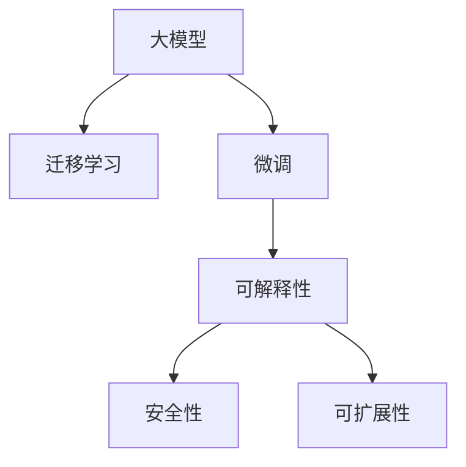

                 

# AI大模型创业：如何应对未来用户需求？

> 关键词：AI创业,大模型,用户需求,未来趋势,创业指导

## 1. 背景介绍

在人工智能（AI）领域，大模型（Large Models）的崛起已经引起了广泛关注。这些模型，如GPT-3、BERT等，通过大量数据训练，具备了强大的自然语言处理能力。然而，在商业化应用过程中，如何利用这些大模型满足未来用户需求，成为众多AI创业者亟需解决的问题。本文将围绕大模型在创业中的应用，深入探讨如何从用户需求出发，构建有竞争力的AI创业项目。

### 1.1 问题由来

近年来，AI大模型在多个领域展现出了非凡的潜力。从自动写作、客户服务到个性化推荐，大模型的应用几乎无所不包。然而，尽管技术进步迅速，如何将这些模型有效地转化为实际产品，满足用户需求，仍然是许多创业者面临的挑战。

大模型强大的性能背后，是其对大规模无标签数据的依赖。这种依赖性意味着，模型开发初期需要大量的数据和计算资源，这对于初创企业而言，无疑是一笔巨大的投入。此外，模型的部署和维护也需要专业的技术支持，这对创业团队的技术能力也提出了更高的要求。

### 1.2 问题核心关键点

面对未来用户需求，AI大模型创业者需要关注以下几个核心问题：

1. **数据获取与处理**：如何有效地收集和处理大量数据，以供模型训练。
2. **模型选择与优化**：针对具体应用场景，选择合适的模型并对其进行优化。
3. **用户需求分析**：深入理解用户需求，设计符合用户期望的功能和体验。
4. **商业模式构建**：基于产品功能，构建可持续的商业模式。
5. **市场竞争策略**：在激烈的市场竞争中，如何定位产品，形成差异化竞争优势。

## 2. 核心概念与联系

### 2.1 核心概念概述

为了更好地理解如何利用大模型应对未来用户需求，本节将介绍几个密切相关的核心概念：

- **大模型（Large Models）**：指通过大规模无标签数据预训练，具备强大语言处理能力的模型，如GPT、BERT等。
- **迁移学习（Transfer Learning）**：指将模型在某一领域的知识迁移到另一领域的训练方法。
- **微调（Fine-Tuning）**：指在大模型基础上，使用下游任务的少量标注数据进行有监督学习，优化模型在该任务上的性能。
- **可解释性（Explainability）**：指模型输出的可理解性和解释性，对于提高用户信任和满意度至关重要。
- **安全性（Safety）**：指模型输出的无害性和伦理合规性，确保产品符合法律法规要求。
- **可扩展性（Scalability）**：指模型在不同规模数据上的表现，以及对多种用户需求的适应能力。

这些核心概念之间的联系可以通过以下Mermaid流程图来展示：



这个流程图展示了大模型、迁移学习、微调等核心概念之间的关系，以及它们与可解释性、安全性、可扩展性等关键属性的联系。

### 2.2 概念间的关系

这些核心概念之间存在着紧密的联系，形成了大模型应用的完整生态系统。下面是这些概念之间的详细关系图：


这个流程图展示了从用户需求到产品发布的全流程，每个环节都需要考虑大模型、迁移学习、微调等技术的应用，以及可解释性、安全性、可扩展性等属性的优化。

## 3. 核心算法原理 & 具体操作步骤

### 3.1 算法原理概述

基于大模型的AI创业项目，核心在于利用模型强大的语言理解能力，解决特定用户需求。其基本原理包括：

1. **数据收集与预处理**：收集与用户需求相关的数据，进行预处理和清洗，以供模型训练。
2. **模型选择与迁移学习**：根据应用场景，选择合适的模型并利用迁移学习进行微调。
3. **功能设计**：根据用户需求，设计模型输出的功能模块，如问答系统、推荐系统等。
4. **用户体验优化**：通过用户反馈，不断优化产品的交互界面和用户体验。
5. **商业模型构建**：基于产品功能，构建可持续的商业模式，如SaaS、API服务等。

### 3.2 算法步骤详解

以下是一个基于大模型的AI创业项目的详细操作步骤：

1. **市场调研与需求分析**：
   - 收集用户需求和反馈，分析市场需求。
   - 确定产品定位和目标用户群体。

2. **数据收集与预处理**：
   - 收集与产品功能相关的数据，如对话记录、用户行为数据等。
   - 进行数据清洗、标注和预处理。

3. **模型选择与迁移学习**：
   - 选择适合产品需求的模型，如BERT、GPT等。
   - 使用迁移学习，在大模型基础上进行微调，优化模型性能。

4. **功能设计**：
   - 设计模型输出的功能模块，如聊天机器人、推荐系统等。
   - 确定功能模块的输入输出格式和接口。

5. **用户体验优化**：
   - 设计直观易用的用户界面，优化交互流程。
   - 收集用户反馈，持续改进产品体验。

6. **商业模型构建**：
   - 根据产品功能，选择合适的商业模式，如SaaS、API服务等。
   - 制定定价策略和市场推广计划。

### 3.3 算法优缺点

基于大模型的AI创业项目具有以下优点：

1. **高效性**：利用大模型强大的语言理解能力，可以快速处理大量用户需求。
2. **灵活性**：大模型可以在多种应用场景下进行微调，灵活适应不同需求。
3. **可扩展性**：模型在不同规模数据上的表现良好，适合扩展到不同用户群体。

同时，这些项目也存在以下缺点：

1. **高成本**：模型训练和部署需要大量计算资源和数据。
2. **技术门槛高**：对团队的技术能力有较高要求。
3. **数据隐私风险**：模型训练和应用过程中，需要严格保护用户数据隐私。

### 3.4 算法应用领域

基于大模型的AI创业项目，已经在多个领域展现出巨大的潜力，包括但不限于：

1. **客户服务**：如聊天机器人、客户推荐等。
2. **内容创作**：如自动写作、文章摘要生成等。
3. **个性化推荐**：如电商推荐、新闻推荐等。
4. **数据分析**：如情感分析、主题建模等。
5. **医疗健康**：如疾病诊断、健康咨询等。

## 4. 数学模型和公式 & 详细讲解 & 举例说明

### 4.1 数学模型构建

假设用户需求为文本分类任务，模型需要在用户输入的文本中，预测出其所属的类别。模型的输入为文本 $x$，输出为类别 $y$。模型的数学模型为：

$$
p(y|x; \theta) = \text{softmax}(W_{out} [W_{in} x + b_{in}] + b_{out})
$$

其中，$W_{in}$ 和 $b_{in}$ 为模型输入层的参数，$W_{out}$ 和 $b_{out}$ 为输出层的参数，$\theta$ 为模型整体参数。

### 4.2 公式推导过程

基于上述模型，我们可以使用交叉熵损失函数进行模型训练：

$$
\mathcal{L}(\theta) = -\frac{1}{N} \sum_{i=1}^N \sum_{j=1}^C y_{ij} \log p_{ij}(x; \theta)
$$

其中，$N$ 为样本数量，$C$ 为类别数量，$y_{ij}$ 为样本 $i$ 属于类别 $j$ 的标签，$p_{ij}$ 为样本 $i$ 属于类别 $j$ 的概率。

使用梯度下降等优化算法，最小化损失函数 $\mathcal{L}(\theta)$，即可更新模型参数 $\theta$，提升模型性能。

### 4.3 案例分析与讲解

以聊天机器人为例，假设用户输入一段文本 $x$，模型需要预测其情绪类别 $y$。

1. **数据收集**：收集大量的情感标注文本数据，用于模型训练。
2. **模型选择**：选择BERT模型，利用其预训练的强大语言表示能力。
3. **微调**：在大模型基础上，使用用户情感标注数据进行微调，优化模型性能。
4. **功能设计**：设计模型输出的功能模块，如情绪分类、情感回复等。
5. **用户体验优化**：设计直观易用的用户界面，优化交互流程。

## 5. 项目实践：代码实例和详细解释说明

### 5.1 开发环境搭建

在进行大模型项目开发前，需要准备好开发环境。以下是使用Python进行PyTorch开发的环境配置流程：

1. 安装Anaconda：从官网下载并安装Anaconda，用于创建独立的Python环境。

2. 创建并激活虚拟环境：
```bash
conda create -n pytorch-env python=3.8 
conda activate pytorch-env
```

3. 安装PyTorch：根据CUDA版本，从官网获取对应的安装命令。例如：
```bash
conda install pytorch torchvision torchaudio cudatoolkit=11.1 -c pytorch -c conda-forge
```

4. 安装Transformers库：
```bash
pip install transformers
```

5. 安装各类工具包：
```bash
pip install numpy pandas scikit-learn matplotlib tqdm jupyter notebook ipython
```

完成上述步骤后，即可在`pytorch-env`环境中开始大模型项目开发。

### 5.2 源代码详细实现

以下是一个基于BERT模型进行情感分类的PyTorch代码实现：

```python
import torch
import torch.nn as nn
import torch.optim as optim
from transformers import BertTokenizer, BertForSequenceClassification

# 初始化模型和分词器
model = BertForSequenceClassification.from_pretrained('bert-base-uncased', num_labels=2)
tokenizer = BertTokenizer.from_pretrained('bert-base-uncased')

# 定义训练函数
def train_epoch(model, dataset, batch_size, optimizer):
    model.train()
    epoch_loss = 0
    for batch in dataset:
        inputs = tokenizer(batch['text'], padding=True, truncation=True, max_length=256)
        input_ids = inputs['input_ids']
        attention_mask = inputs['attention_mask']
        labels = batch['label']
        outputs = model(input_ids, attention_mask=attention_mask, labels=labels)
        loss = outputs.loss
        epoch_loss += loss.item()
        optimizer.zero_grad()
        loss.backward()
        optimizer.step()
    return epoch_loss / len(dataset)

# 定义评估函数
def evaluate(model, dataset, batch_size):
    model.eval()
    total_loss = 0
    total_correct = 0
    for batch in dataset:
        inputs = tokenizer(batch['text'], padding=True, truncation=True, max_length=256)
        input_ids = inputs['input_ids']
        attention_mask = inputs['attention_mask']
        labels = batch['label']
        outputs = model(input_ids, attention_mask=attention_mask, labels=labels)
        loss = outputs.loss
        predictions = outputs.logits.argmax(dim=1)
        total_loss += loss.item()
        total_correct += (predictions == labels).sum().item()
    return total_loss / len(dataset), total_correct / len(dataset)

# 训练和评估
batch_size = 16
epochs = 5
optimizer = optim.AdamW(model.parameters(), lr=2e-5)

train_dataset = load_train_data()
dev_dataset = load_dev_data()
test_dataset = load_test_data()

for epoch in range(epochs):
    train_loss, train_acc = train_epoch(model, train_dataset, batch_size, optimizer)
    dev_loss, dev_acc = evaluate(model, dev_dataset, batch_size)
    print(f'Epoch {epoch+1}, train loss: {train_loss:.3f}, train acc: {train_acc:.3f}, dev loss: {dev_loss:.3f}, dev acc: {dev_acc:.3f}')

test_loss, test_acc = evaluate(model, test_dataset, batch_size)
print(f'Test loss: {test_loss:.3f}, test acc: {test_acc:.3f}')
```

### 5.3 代码解读与分析

以上代码实现了基于BERT模型进行情感分类的完整流程。具体解读如下：

- **模型初始化**：使用预训练的BERT模型和分词器。
- **训练函数**：定义模型在训练集上的训练流程，包括前向传播、损失计算、梯度更新等步骤。
- **评估函数**：定义模型在验证集和测试集上的评估流程，包括计算损失和准确率。
- **训练和评估循环**：根据训练集和验证集数据，不断调整模型参数，最终在测试集上评估模型性能。

## 6. 实际应用场景

### 6.1 智能客服

基于大模型的智能客服系统可以实时响应用户查询，提供高效、个性化的服务。通过收集历史客服数据，进行模型微调，智能客服系统能够理解和处理各种复杂用户问题，并提供快速、准确的答案。

### 6.2 内容创作

大模型在内容创作领域展现了强大的潜力，可以自动生成文章、报告、新闻等文本。通过微调，模型能够更好地理解用户需求，生成符合用户期望的文本内容。

### 6.3 个性化推荐

利用大模型进行个性化推荐，可以为用户提供更加精准、多样化的产品推荐。通过收集用户行为数据，进行模型微调，系统能够根据用户偏好推荐相关商品，提升用户满意度。

### 6.4 未来应用展望

随着技术的发展，大模型在未来将有更广泛的应用场景。例如，在医疗健康领域，大模型可以用于疾病诊断、健康咨询等。在金融领域，大模型可以用于风险评估、投资建议等。

## 7. 工具和资源推荐

### 7.1 学习资源推荐

为了帮助开发者系统掌握大模型创业的理论基础和实践技巧，这里推荐一些优质的学习资源：

1. **《深度学习与NLP》**：斯坦福大学开设的深度学习与自然语言处理课程，涵盖NLP领域的基本概念和经典模型。
2. **《Transformers从原理到实践》**：介绍Transformer原理、BERT模型、微调技术等前沿话题。
3. **《自然语言处理实战》**：动手实践，涵盖NLP任务的各个方面，包括数据处理、模型选择、微调等。

### 7.2 开发工具推荐

高效的开发离不开优秀的工具支持。以下是几款用于大模型创业开发的常用工具：

1. **PyTorch**：基于Python的开源深度学习框架，支持动态计算图，灵活度高，适合快速迭代研究。
2. **TensorFlow**：由Google主导开发的开源深度学习框架，生产部署方便，适合大规模工程应用。
3. **Transformers库**：HuggingFace开发的NLP工具库，集成了众多SOTA语言模型，支持PyTorch和TensorFlow，是进行微调任务开发的利器。
4. **Weights & Biases**：模型训练的实验跟踪工具，可以记录和可视化模型训练过程中的各项指标，方便对比和调优。
5. **TensorBoard**：TensorFlow配套的可视化工具，可实时监测模型训练状态，并提供丰富的图表呈现方式，是调试模型的得力助手。

### 7.3 相关论文推荐

大模型和微调技术的发展源于学界的持续研究。以下是几篇奠基性的相关论文，推荐阅读：

1. **Attention is All You Need**：提出Transformer结构，开启了NLP领域的预训练大模型时代。
2. **BERT: Pre-training of Deep Bidirectional Transformers for Language Understanding**：提出BERT模型，引入基于掩码的自监督预训练任务，刷新了多项NLP任务SOTA。
3. **Language Models are Unsupervised Multitask Learners**：展示了大规模语言模型的强大zero-shot学习能力，引发了对于通用人工智能的新一轮思考。
4. **Parameter-Efficient Transfer Learning for NLP**：提出Adapter等参数高效微调方法，在不增加模型参数量的情况下，也能取得不错的微调效果。
5. **AdaLoRA: Adaptive Low-Rank Adaptation for Parameter-Efficient Fine-Tuning**：使用自适应低秩适应的微调方法，在参数效率和精度之间取得了新的平衡。

这些论文代表了大模型微调技术的发展脉络。通过学习这些前沿成果，可以帮助研究者把握学科前进方向，激发更多的创新灵感。

除上述资源外，还有一些值得关注的前沿资源，帮助开发者紧跟大模型微调技术的最新进展，例如：

1. **arXiv论文预印本**：人工智能领域最新研究成果的发布平台，包括大量尚未发表的前沿工作，学习前沿技术的必读资源。
2. **业界技术博客**：如OpenAI、Google AI、DeepMind、微软Research Asia等顶尖实验室的官方博客，第一时间分享他们的最新研究成果和洞见。
3. **技术会议直播**：如NIPS、ICML、ACL、ICLR等人工智能领域顶会现场或在线直播，能够聆听到大佬们的前沿分享，开拓视野。
4. **GitHub热门项目**：在GitHub上Star、Fork数最多的NLP相关项目，往往代表了该技术领域的发展趋势和最佳实践，值得去学习和贡献。
5. **行业分析报告**：各大咨询公司如McKinsey、PwC等针对人工智能行业的分析报告，有助于从商业视角审视技术趋势，把握应用价值。

## 8. 总结：未来发展趋势与挑战

### 8.1 研究成果总结

本文对基于大模型的AI创业项目进行了全面系统的介绍。首先阐述了AI大模型在创业中的应用价值，明确了从用户需求出发，构建有竞争力的AI创业项目的重要性。其次，从原理到实践，详细讲解了大模型创业项目的操作流程，包括数据收集与预处理、模型选择与优化、功能设计、用户体验优化、商业模型构建等关键环节。

通过本文的系统梳理，可以看到，基于大模型的AI创业项目，利用模型强大的语言理解能力，可以快速响应和满足用户需求，具有高效、灵活、可扩展等优点。然而，这些项目也面临数据获取高成本、技术门槛高、数据隐私风险等挑战。

### 8.2 未来发展趋势

展望未来，AI大模型创业项目将呈现以下几个发展趋势：

1. **智能化水平提升**：随着技术的进步，AI大模型将具备更强的理解和生成能力，可以更好地适应复杂多变的需求。
2. **商业模型多样化**：除了SaaS、API服务，更多创新的商业模式将涌现，如订阅制、按需付费等。
3. **用户参与增强**：引入用户反馈和参与机制，提高产品的用户粘性和满意度。
4. **跨领域应用扩展**：大模型将逐步应用于更多领域，如医疗、金融、教育等，推动各行业的智能化转型。

### 8.3 面临的挑战

尽管大模型创业项目具有广阔的应用前景，但仍需面对以下挑战：

1. **数据隐私保护**：模型训练和应用过程中，需要严格保护用户数据隐私，避免数据泄露风险。
2. **模型鲁棒性**：模型面对域外数据时，泛化性能往往不足，需要进一步提升模型的鲁棒性。
3. **部署成本**：大模型的训练和部署需要大量计算资源，需要找到更经济高效的方法。
4. **用户体验优化**：产品界面和交互流程的设计需要不断改进，提升用户满意度和体验。
5. **商业模式可持续**：需要构建可持续的商业模式，保证项目的长期稳定发展。

### 8.4 研究展望

未来，AI大模型创业项目需要在数据隐私保护、模型鲁棒性提升、部署成本优化、用户体验优化等方面进行深入研究，推动技术的不断进步。

总之，基于大模型的AI创业项目，凭借其强大的语言处理能力，具备广阔的应用前景和潜力。然而，项目的成功离不开技术、市场、用户等多方面的共同努力。只有在不断创新和优化中，才能在激烈的市场竞争中脱颖而出，为社会带来更多的价值和创新。

## 9. 附录：常见问题与解答

**Q1：大模型在创业项目中的应用前景如何？**

A: 大模型在创业项目中具有广阔的应用前景。通过大模型的强大语言理解能力，可以快速响应和满足用户需求，具备高效、灵活、可扩展等优点。然而，也需面对数据获取高成本、技术门槛高等挑战。

**Q2：如何选择适合创业项目的大模型？**

A: 选择适合创业项目的大模型，需要考虑以下几个方面：
1. 任务类型：根据任务类型选择合适的模型，如BERT适合文本分类，GPT适合生成任务。
2. 模型规模：考虑模型的参数规模和计算资源需求，选择适合当前资源情况的模型。
3. 预训练效果：评估模型的预训练效果，选择表现最佳的模型。

**Q3：如何进行大模型的微调优化？**

A: 进行大模型的微调优化，需要考虑以下几个方面：
1. 数据收集与预处理：收集与任务相关的数据，进行清洗和标注。
2. 模型选择与微调：选择适合任务的模型，并使用迁移学习进行微调。
3. 功能设计：设计模型输出的功能模块，如分类、生成等。
4. 用户体验优化：设计直观易用的用户界面，优化交互流程。
5. 商业模型构建：根据产品功能，选择合适的商业模式，如SaaS、API服务等。

**Q4：如何保护大模型项目的用户数据隐私？**

A: 保护大模型项目的用户数据隐私，需要采取以下措施：
1. 数据匿名化：对用户数据进行匿名化处理，避免隐私泄露。
2. 加密存储：使用加密技术存储用户数据，确保数据安全。
3. 访问控制：严格控制数据访问权限，确保只有授权人员能够访问数据。
4. 审计和监控：建立数据访问审计和监控机制，防止数据滥用。

**Q5：大模型项目的商业模型有哪些？**

A: 大模型项目的商业模型主要包括以下几种：
1. SaaS模型：将模型作为服务提供，按月或按年收费。
2. API服务模型：提供API接口，用户按调用次数或使用量付费。
3. 订阅制模型：用户按月或按年订阅服务，享受特定权限和支持。
4. 按需付费模型：根据用户需求和使用情况，动态定价，提供灵活的付费方式。

总之，大模型项目在保护用户隐私、优化用户体验、构建可持续商业模式等方面仍需不断努力，方能在激烈的市场竞争中占据一席之地。通过技术创新和市场策略的不断优化，相信大模型项目将为社会带来更多价值和创新。

