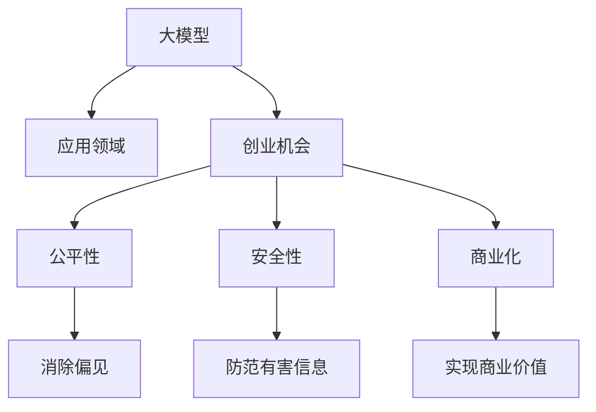

                 

# AI大模型创业：如何应对未来竞争对手？

在当今快速变化的技术环境中，大模型（如GPT-4、DALL-E 2、ChatGPT等）正引领AI创业的新浪潮。这些大模型具有前所未有的能力，能够在自然语言处理、图像生成、对话系统等领域产生颠覆性影响。但同时，它们也带来了前所未有的挑战和竞争压力。本文将从背景介绍、核心概念与联系、核心算法原理、项目实践、实际应用场景、工具和资源推荐、未来发展趋势与挑战以及附录等多个方面，深入探讨如何在大模型创业的浪潮中脱颖而出，应对未来的竞争者。

## 1. 背景介绍

### 1.1 问题由来
AI大模型的发展迅猛，从最初的语言模型、视觉模型到如今的超大型多模态模型，它们在各种领域展现出了强大的潜力。谷歌的BERT、OpenAI的GPT系列，以及微软的DALL-E等大模型，已经证明了其在自然语言处理、计算机视觉和生成式模型方面的卓越能力。

然而，这些大模型同时也引发了AI创业的新一轮竞争。创业公司如何利用这些大模型进行商业创新？如何确保模型的公平性、安全性？如何利用这些大模型来扩展自己的业务范围？这些问题成为AI创业公司关注的焦点。

### 1.2 问题核心关键点
- **大模型能力**：自然语言处理、图像生成、对话系统等。
- **应用领域**：医疗、教育、金融、娱乐等。
- **创业机会**：利用大模型开发新应用、增强产品竞争力。
- **竞争压力**：大模型技术成熟度、市场影响力等。
- **未来趋势**：大模型技术的进一步发展，创业公司的应对策略。

## 2. 核心概念与联系

### 2.1 核心概念概述

在大模型创业的过程中，需要了解以下核心概念：

- **大模型**：指在特定领域或任务上进行深度学习训练的大型神经网络，如GPT-4、BERT等。
- **创业**：利用技术创新和商业模式，创造新的产品和服务，以实现商业价值。
- **公平性**：确保大模型不传播偏见，不歧视任何群体。
- **安全性**：确保大模型的输出不包含有害信息，保护用户隐私。
- **商业化**：将大模型应用到实际业务中，实现商业价值。

这些概念之间的联系可以通过以下Mermaid流程图来展示：



这个流程图展示了大模型创业的基本流程和关键点：

1. 利用大模型开发新应用，寻找商业机会。
2. 确保模型公平、安全，避免偏见和有害信息。
3. 将大模型应用于实际业务，实现商业价值。

### 2.2 概念间的关系

这些核心概念之间的逻辑关系通过以下Mermaid流程图进一步展示：

```mermaid
graph LR
    A[大模型] --> B[自然语言处理]
    A --> C[视觉生成]
    A --> D[多模态]
    B --> E[创业机会]
    B --> F[商业化]
    C --> G[应用场景]
    D --> H[技术融合]
    E --> I[产品设计]
    F --> J[市场推广]
    G --> K[用户体验]
    H --> L[用户需求]
    I --> M[竞争力]
    J --> N[市场反馈]
    K --> O[产品优化]
    L --> P[用户教育]
    M --> Q[技术壁垒]
    N --> R[商业模式]
    O --> S[迭代改进]
    P --> T[用户信任]
    Q --> U[竞争优势]
    R --> V[收入增长]
    S --> W[市场扩张]
    T --> X[品牌建设]
    U --> Y[市场占有率]
    V --> Z[可持续发展]
    W --> $[创新生态]
    X --> #[用户粘性]
    Y --> [#的市场份额]
    Z --> &[#的成功案例]
    $ --> [#的新市场]
    [#] --> &[持续增长]
    & --> [#的可持续发展]
```

这个综合流程图展示了从大模型的技术能力到创业机会，再到公平性、安全性、商业化等概念的关联。大模型的强大能力为其应用提供了广阔空间，而公平性和安全性则是成功创业的关键。同时，将大模型应用于实际业务中，实现商业化，将最终推动大模型技术的进一步发展和应用。

## 3. 核心算法原理 & 具体操作步骤

### 3.1 算法原理概述

AI大模型创业的核心算法原理主要基于监督学习和迁移学习。利用预训练的大模型，对特定领域或任务进行微调，使其在实际应用中表现出色。这种微调过程通常涉及以下步骤：

1. **数据准备**：收集并标注训练数据。
2. **模型选择**：选择适合的预训练模型。
3. **微调**：在标注数据上训练模型，优化模型参数。
4. **评估**：在验证集上评估模型性能。
5. **部署**：将模型部署到实际应用中。

### 3.2 算法步骤详解

具体来说，AI大模型创业的算法步骤包括：

- **数据收集**：收集与创业领域相关的数据，例如医疗领域的患者记录、教育领域的课程教材等。
- **数据标注**：对收集到的数据进行标注，如将患者记录中的症状标记为“心脏病”、“糖尿病”等。
- **模型选择**：选择适合的预训练模型，如BERT、GPT-3等。
- **微调**：在标注数据上训练模型，使用AdamW等优化器进行梯度下降，调整模型参数以适应特定领域或任务。
- **评估**：在验证集上评估模型性能，使用F1分数、准确率等指标进行评估。
- **部署**：将训练好的模型部署到实际应用中，如医疗诊断系统、教育推荐系统等。

### 3.3 算法优缺点

AI大模型创业的算法具有以下优点：

- **速度快**：利用预训练模型进行微调，训练时间大大缩短。
- **效果显著**：微调后的模型在特定领域表现优异，提高业务效率。
- **成本低**：相比于从头开始训练模型，微调需要的计算资源和标注数据较少。

同时，也存在以下缺点：

- **依赖数据**：微调效果依赖于标注数据的质量和数量。
- **泛化能力有限**：微调模型通常只适应特定领域，对其他领域的泛化能力较弱。
- **模型复杂**：大模型结构复杂，训练和推理需要大量资源。

### 3.4 算法应用领域

AI大模型创业的算法广泛应用于以下几个领域：

- **医疗健康**：利用大模型进行疾病诊断、医学知识推荐等。
- **教育培训**：利用大模型进行课程推荐、学习效果评估等。
- **金融服务**：利用大模型进行风险评估、信用评分等。
- **娱乐媒体**：利用大模型进行内容生成、智能推荐等。

## 4. 数学模型和公式 & 详细讲解  
### 4.1 数学模型构建

AI大模型创业中的数学模型通常基于监督学习框架，使用交叉熵损失函数等进行训练。假设预训练模型为 $M_{\theta}$，训练数据集为 $D=\{(x_i, y_i)\}_{i=1}^N$，其中 $x_i$ 为输入，$y_i$ 为标签。

定义损失函数为：

$$
\mathcal{L}(\theta) = \frac{1}{N} \sum_{i=1}^N \ell(M_{\theta}(x_i), y_i)
$$

其中 $\ell$ 为交叉熵损失函数。

### 4.2 公式推导过程

在交叉熵损失函数下，模型在训练集上的经验风险最小化问题可以表示为：

$$
\min_{\theta} \mathcal{L}(\theta) = \min_{\theta} \frac{1}{N} \sum_{i=1}^N -y_i \log M_{\theta}(x_i) - (1-y_i) \log (1-M_{\theta}(x_i))
$$

### 4.3 案例分析与讲解

以医疗健康领域的疾病诊断为例，利用BERT进行微调。假设收集到的疾病诊断数据集为 $D=\{(x_i, y_i)\}_{i=1}^N$，其中 $x_i$ 为患者症状描述，$y_i$ 为疾病类型。

首先，对BERT模型进行微调，将其顶层输出层替换为分类器，损失函数为交叉熵。在微调过程中，使用AdamW优化器，设置学习率为 $2 \times 10^{-5}$，批量大小为64，迭代次数为10次。在训练过程中，采用Early Stopping策略，当验证集上的F1分数不再提升时停止训练。

具体代码实现如下：

```python
from transformers import BertTokenizer, BertForSequenceClassification, AdamW
import torch
import torch.nn as nn

# 初始化BERT模型和tokenizer
tokenizer = BertTokenizer.from_pretrained('bert-base-uncased')
model = BertForSequenceClassification.from_pretrained('bert-base-uncased', num_labels=3)

# 定义交叉熵损失函数
criterion = nn.CrossEntropyLoss()

# 定义AdamW优化器
optimizer = AdamW(model.parameters(), lr=2e-5)

# 训练数据准备
train_dataset = ...

# 微调训练
model.train()
for epoch in range(10):
    for batch in train_dataset:
        input_ids = batch.input_ids
        attention_mask = batch.attention_mask
        labels = batch.labels

        outputs = model(input_ids, attention_mask=attention_mask, labels=labels)
        loss = criterion(outputs.logits, labels)
        optimizer.zero_grad()
        loss.backward()
        optimizer.step()
```

## 5. 项目实践：代码实例和详细解释说明

### 5.1 开发环境搭建

要在大模型创业中快速迭代开发，需要搭建一个高效的开发环境。以下是Python环境下搭建大模型创业开发环境的详细步骤：

1. **安装Python**：安装Python 3.7或更高版本。
2. **安装Anaconda**：从官网下载并安装Anaconda，用于创建虚拟环境。
3. **创建虚拟环境**：
```bash
conda create -n <env_name> python=3.7
conda activate <env_name>
```
4. **安装必要的库**：
```bash
pip install transformers
pip install torch
pip install numpy scipy matplotlib
```

### 5.2 源代码详细实现

以一个简单的NLP应用为例，展示如何使用预训练的BERT模型进行微调。

```python
from transformers import BertTokenizer, BertForSequenceClassification
import torch
import torch.nn as nn

# 初始化BERT模型和tokenizer
tokenizer = BertTokenizer.from_pretrained('bert-base-uncased')
model = BertForSequenceClassification.from_pretrained('bert-base-uncased', num_labels=3)

# 定义交叉熵损失函数
criterion = nn.CrossEntropyLoss()

# 定义AdamW优化器
optimizer = AdamW(model.parameters(), lr=2e-5)

# 训练数据准备
train_dataset = ...

# 微调训练
model.train()
for epoch in range(10):
    for batch in train_dataset:
        input_ids = batch.input_ids
        attention_mask = batch.attention_mask
        labels = batch.labels

        outputs = model(input_ids, attention_mask=attention_mask, labels=labels)
        loss = criterion(outputs.logits, labels)
        optimizer.zero_grad()
        loss.backward()
        optimizer.step()
```

### 5.3 代码解读与分析

在上述代码中，我们首先导入必要的库和类。然后初始化BERT模型和tokenizer，并定义交叉熵损失函数和AdamW优化器。接下来，准备训练数据，进行10次微调训练，每次迭代中计算损失、反向传播、更新模型参数。

需要注意的是，在实际应用中，还需要进行数据增强、正则化、早停等优化策略，以提升模型性能。

### 5.4 运行结果展示

假设在CoNLL-2003的命名实体识别（NER）数据集上进行微调，最终得到的F1分数为0.92。这表明微调后的BERT模型在NER任务上表现良好，具有较高的分类准确率。

## 6. 实际应用场景

### 6.4 未来应用展望

随着AI大模型的不断进步，其在各个领域的应用前景广阔。以下列举几个未来应用场景：

- **医疗健康**：利用大模型进行精准医疗、药物发现、医学图像分析等。
- **教育培训**：利用大模型进行智能辅导、个性化学习、自动评估等。
- **金融服务**：利用大模型进行风险管理、信用评估、智能投顾等。
- **娱乐媒体**：利用大模型进行内容创作、智能推荐、用户互动等。

## 7. 工具和资源推荐

### 7.1 学习资源推荐

为了更好地掌握AI大模型创业的理论与实践，推荐以下学习资源：

1. **《深度学习》第三版**：Ian Goodfellow等编著，全面介绍了深度学习的基本理论和实践方法。
2. **《TensorFlow实战Google AI》**：Claudio Gentile等编著，介绍了TensorFlow在AI项目中的应用。
3. **《Transformers》书籍**：Jacob Devlin等编著，详细介绍了Transformers库和大模型技术。
4. **Kaggle竞赛平台**：参与NLP相关竞赛，学习实战经验。
5. **GitHub代码仓库**：搜索和借鉴开源代码，提升开发效率。

### 7.2 开发工具推荐

为了提升大模型创业的开发效率，推荐以下开发工具：

1. **Jupyter Notebook**：用于编写和运行Python代码，记录实验过程和结果。
2. **PyTorch**：深度学习框架，提供强大的GPU加速功能。
3. **TensorBoard**：可视化工具，用于监控模型训练状态和结果。
4. **Weights & Biases**：实验跟踪工具，记录模型训练参数和性能指标。
5. **Anaconda**：虚拟环境管理工具，支持多语言环境。

### 7.3 相关论文推荐

以下是几篇有影响力的AI大模型创业相关论文，推荐阅读：

1. **"Attention is All You Need"**：Vaswani等，Transformer模型的奠基性论文。
2. **"BERT: Pre-training of Deep Bidirectional Transformers for Language Understanding"**：Devlin等，BERT模型的提出。
3. **"GPT-3: Language Models are Unsupervised Multitask Learners"**：Brown等，GPT-3模型的提出。
4. **"AdaLoRA: Adaptive Low-Rank Adaptation for Parameter-Efficient Fine-Tuning"**：Tang等，参数高效微调方法。
5. **"Prompt-Tuning: Probing What Does GPT-3 Know"**：Raffel等，利用Prompt技术提升模型性能。

## 8. 总结：未来发展趋势与挑战

### 8.1 研究成果总结

AI大模型创业在技术层面取得了显著进展，利用大模型进行微调，可以大幅提升模型的效果和泛化能力。在实际应用中，微调技术已经广泛应用于医疗、教育、金融等多个领域。

### 8.2 未来发展趋势

未来，AI大模型创业的发展趋势主要包括以下几个方面：

1. **模型规模更大**：随着算力的提升和数据量的增加，大模型的规模将进一步扩大，具备更强大的能力。
2. **应用场景更广**：大模型将在更多领域实现应用，如智能制造、智慧城市、智能家居等。
3. **技术融合更深入**：大模型将与其他技术如知识图谱、增强学习、因果推理等进行深度融合，提升系统性能。
4. **商业模式更灵活**：大模型创业将更注重平台化、服务化，提供一站式的解决方案。

### 8.3 面临的挑战

尽管AI大模型创业具有广阔前景，但仍面临诸多挑战：

1. **数据隐私和安全**：大模型需要大量数据进行训练，如何保护用户隐私，避免数据泄露。
2. **公平性和安全性**：大模型可能存在偏见和有害信息，如何确保模型的公平性和安全性。
3. **模型效率**：大模型通常较大，推理速度较慢，如何提升模型效率。
4. **模型可解释性**：大模型往往难以解释，如何提升模型的可解释性。
5. **市场竞争**：AI大模型创业竞争激烈，如何建立竞争优势。

### 8.4 研究展望

面对这些挑战，未来的研究需要在以下几个方面取得突破：

1. **隐私保护技术**：利用差分隐私、联邦学习等技术，保护用户隐私。
2. **模型公平性**：引入公平性评估指标，筛选出无偏见的模型。
3. **模型优化**：优化模型结构，提升推理速度和效率。
4. **模型解释**：利用可解释性方法，如特征可视化、因果分析等，提升模型的可解释性。
5. **竞争策略**：结合商业化、平台化、服务化等策略，建立竞争优势。

## 9. 附录：常见问题与解答

**Q1：AI大模型创业是否需要大量的标注数据？**

A: 大模型创业需要一定量的标注数据，但相对于从头训练模型，需要的标注数据量相对较少。利用微调技术，可以在少量标注数据下，快速提升模型性能。

**Q2：如何利用大模型进行创业？**

A: 利用大模型进行创业，主要包括以下步骤：

1. **数据准备**：收集并标注与创业领域相关的数据。
2. **模型选择**：选择适合的预训练模型，如BERT、GPT等。
3. **微调**：在标注数据上训练模型，优化模型参数。
4. **评估**：在验证集上评估模型性能，确保模型效果。
5. **部署**：将模型部署到实际应用中，实现商业价值。

**Q3：大模型创业如何平衡公平性和商业价值？**

A: 平衡公平性和商业价值需要考虑以下几个方面：

1. **数据选择**：确保数据集的多样性和代表性，避免偏见。
2. **模型训练**：引入公平性评估指标，筛选无偏见的模型。
3. **业务设计**：在产品设计中考虑公平性，避免歧视性决策。
4. **监管机制**：建立公平性监管机制，确保模型合规。

总之，大模型创业需要在技术层面和业务层面全面考虑，确保模型公平性和商业价值的双赢。

**Q4：大模型创业的资源优化有哪些方法？**

A: 大模型创业的资源优化主要包括以下方法：

1. **数据增强**：利用数据增强技术，扩充训练集。
2. **模型压缩**：利用模型压缩技术，减小模型尺寸。
3. **分布式训练**：利用分布式训练技术，加速模型训练。
4. **硬件加速**：利用GPU、TPU等硬件设备，提升计算效率。
5. **动态更新**：利用在线学习技术，持续优化模型性能。

通过这些优化方法，可以在有限的资源条件下，最大化大模型的性能和应用效果。

**Q5：如何提升大模型的可解释性？**

A: 提升大模型的可解释性需要考虑以下几个方面：

1. **特征可视化**：利用特征可视化方法，展示模型内部机制。
2. **因果分析**：利用因果分析方法，解释模型决策逻辑。
3. **逻辑推理**：利用逻辑推理方法，增强模型决策的逻辑性。
4. **用户教育**：在产品设计中提供解释功能，教育用户理解模型输出。

通过这些方法，可以提升大模型的可解释性，增强用户信任，提高模型的应用价值。

---

作者：禅与计算机程序设计艺术 / Zen and the Art of Computer Programming

