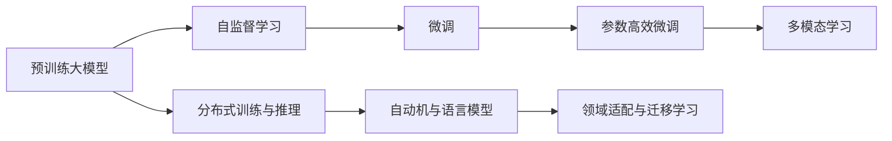

                 

# AI大模型创业：如何打造未来爆款应用？

在人工智能(AI)领域，大模型成为了一股不可忽视的潮流。无论是Google的BERT，OpenAI的GPT-3，还是微软的T5，这些大模型都在不同的NLP任务上取得了优异的表现。但如何将这些大模型的技术优势转化为实际的应用价值，打造出未来爆款AI应用，成为每个AI创业公司面临的重大课题。本文将从背景介绍、核心概念、算法原理、数学模型、项目实践、实际应用场景、工具和资源推荐、总结与展望等几个方面，系统性地探讨如何利用大模型打造未来爆款应用。

## 1. 背景介绍

### 1.1 问题由来
近年来，AI大模型在NLP领域取得了突破性的进展。这些模型通过在大规模无标签文本数据上进行自监督预训练，学习到了丰富的语言知识，能够进行高效的文本生成、分类、匹配等任务。然而，这些模型通常体积庞大，需要大量计算资源进行训练和推理，难以直接应用于各种实际场景。因此，如何构建高效、可扩展的AI大模型应用，成为了AI创业公司亟需解决的问题。

### 1.2 问题核心关键点
构建高效、可扩展的AI大模型应用，需要从以下几个方面进行考量：

- **数据获取与预处理**：构建大模型的第一步是获取大规模语料库，并进行预处理，包括数据清洗、分词、标注等。
- **模型选择与适配**：选择合适的预训练模型，并根据实际需求进行微调，使其适配特定的NLP任务。
- **系统架构设计**：设计高效、可扩展的系统架构，支持多用户并发请求和大规模数据处理。
- **优化与部署**：采用分布式计算、模型压缩、量化加速等技术，优化模型性能和部署效率。
- **服务化封装与接入**：将模型封装为标准化的服务接口，支持API接入、SDK调用等。
- **业务与市场策略**：结合业务需求，制定精准的市场策略，推广AI应用。

### 1.3 问题研究意义
构建AI大模型应用，不仅能够利用大模型的技术优势，还能带来巨大的商业价值。具体体现在以下几个方面：

1. **提高效率**：AI大模型可以快速处理大量文本数据，自动化完成复杂任务，提高工作效率。
2. **降低成本**：相比传统人工标注、人工开发，AI大模型能够大幅降低开发和运营成本。
3. **提升质量**：AI大模型可以消除人为偏见，提高结果的准确性和可靠性。
4. **促进创新**：AI大模型提供了新的数据和技术工具，有助于产生更多创新应用和商业模式。
5. **加速落地**：AI大模型缩短了从技术原型到实际应用的周期，加速了AI技术的产业化进程。

## 2. 核心概念与联系

### 2.1 核心概念概述

为了更好地理解如何构建AI大模型应用，我们首先需要介绍几个核心概念及其相互关系：

- **预训练大模型(Pre-trained Large Models)**：通过在大规模无标签文本数据上进行自监督预训练，学习通用的语言表示。常见的预训练模型有BERT、GPT-3等。
- **微调(Fine-tuning)**：在预训练模型的基础上，使用下游任务的少量标注数据进行有监督训练，优化模型在特定任务上的性能。微调的目标是最大化模型的任务适应能力。
- **参数高效微调(Parameter-Efficient Fine-Tuning, PEFT)**：在微调过程中，只更新少量模型参数，而固定大部分预训练参数，以提高微调效率和泛化能力。
- **多模态学习(Multimodal Learning)**：结合文本、图像、语音等多种模态数据，构建更加全面和准确的AI大模型。
- **分布式训练与推理**：通过分布式计算技术，支持大规模数据的并行处理，提高训练和推理效率。
- **自动机与语言模型(Automatic Machine & Language Models)**：基于深度学习构建的语言模型，能够自动化地处理自然语言数据。
- **领域适配与迁移学习(Domain Adaptation & Transfer Learning)**：通过迁移学习技术，使模型在不同领域之间进行知识迁移，提高模型的泛化能力。

### 2.2 概念间的关系

这些核心概念之间的联系可以通过以下Mermaid流程图来展示：



这个流程图展示了预训练大模型从自监督学习到微调、参数高效微调、多模态学习、分布式训练与推理、自动机与语言模型，以及领域适配与迁移学习，构建AI大模型的完整过程。

## 3. 核心算法原理 & 具体操作步骤

### 3.1 算法原理概述
构建AI大模型应用，通常包括以下几个关键步骤：

1. **数据获取与预处理**：获取大规模语料库，并进行文本清洗、分词、标注等预处理操作。
2. **模型选择与适配**：选择合适的预训练模型，并根据实际需求进行微调，适配特定的NLP任务。
3. **系统架构设计**：设计高效、可扩展的系统架构，支持多用户并发请求和大规模数据处理。
4. **优化与部署**：采用分布式计算、模型压缩、量化加速等技术，优化模型性能和部署效率。
5. **服务化封装与接入**：将模型封装为标准化的服务接口，支持API接入、SDK调用等。
6. **业务与市场策略**：结合业务需求，制定精准的市场策略，推广AI应用。

### 3.2 算法步骤详解

**Step 1: 数据获取与预处理**

1. **语料库选择**：选择合适的文本数据集，确保数据的多样性和覆盖面。常用的语料库包括中文维基百科、微博、论文等。
2. **数据清洗**：去除噪声数据，如停用词、特殊符号等，提高数据质量。
3. **分词与标注**：使用中文分词工具，如jieba，对文本进行分词。根据任务需求，进行实体识别、情感分析等标注。
4. **数据集划分**：将数据集划分为训练集、验证集和测试集，进行数据增量处理。

**Step 2: 模型选择与适配**

1. **预训练模型选择**：选择合适的预训练模型，如BERT、GPT-3等，确保其能够处理特定任务。
2. **微调层设计**：根据任务需求，设计合适的微调层，如添加分类层、注意力层等。
3. **模型适配**：使用下游任务的少量标注数据进行微调，优化模型在特定任务上的性能。

**Step 3: 系统架构设计**

1. **服务化设计**：将模型封装为标准化的服务接口，如RESTful API，支持API接入、SDK调用等。
2. **分布式计算**：采用分布式计算技术，如Spark、Flink等，支持大规模数据处理和并行计算。
3. **数据存储与检索**：设计高效的数据存储和检索方案，如Elasticsearch、MongoDB等。
4. **缓存与加速**：采用缓存技术，如Redis，提高查询效率。

**Step 4: 优化与部署**

1. **模型优化**：采用模型压缩、量化加速等技术，优化模型性能和部署效率。
2. **分布式推理**：采用分布式推理技术，如TensorFlow Serving，支持大规模数据推理。
3. **部署环境搭建**：选择合适的部署环境，如Kubernetes、Docker等，实现自动化部署和扩展。

**Step 5: 服务化封装与接入**

1. **API接口设计**：设计易于使用、功能完备的API接口，支持各种客户端接入。
2. **SDK封装**：封装SDK，方便客户端集成和使用。
3. **文档编写与支持**：编写详细的API文档和用户手册，提供技术支持。

**Step 6: 业务与市场策略**

1. **市场调研**：进行市场调研，了解用户需求和竞争态势。
2. **定价策略**：制定合理的定价策略，平衡成本和收益。
3. **营销推广**：通过社交媒体、KOL等渠道进行推广，吸引用户使用。

### 3.3 算法优缺点

AI大模型应用的主要优点包括：

1. **高性能**：利用大模型的技术优势，能够快速处理大量文本数据，提高工作效率。
2. **低成本**：相比传统人工标注、人工开发，AI大模型能够大幅降低开发和运营成本。
3. **高准确性**：AI大模型可以消除人为偏见，提高结果的准确性和可靠性。
4. **易扩展**：采用分布式计算、模型压缩等技术，支持大规模数据处理和并行计算。
5. **市场潜力**：结合业务需求，能够产生更多创新应用和商业模式。

然而，构建AI大模型应用也面临一些挑战：

1. **数据质量**：数据获取与预处理需要耗费大量时间和资源，数据质量直接影响模型效果。
2. **技术复杂度**：系统架构设计、优化与部署等环节需要综合多方面的技术知识。
3. **市场推广**：需要进行市场调研和营销推广，用户教育和产品迭代需要时间。

### 3.4 算法应用领域

AI大模型应用广泛，以下是一些典型的应用场景：

- **智能客服**：利用AI大模型构建智能客服系统，提供7x24小时不间断服务，提升客户咨询体验。
- **金融舆情监测**：利用AI大模型进行舆情分析和风险预警，提升金融监管能力。
- **智慧教育**：利用AI大模型进行个性化推荐、作业批改等，提升教育效果。
- **医疗健康**：利用AI大模型进行疾病预测、诊断、治疗建议等，提升医疗服务质量。
- **智能交通**：利用AI大模型进行交通数据分析、智能调度等，提升交通管理效率。

## 4. 数学模型和公式 & 详细讲解 & 举例说明

### 4.1 数学模型构建

构建AI大模型应用，通常需要构建如下数学模型：

1. **数据模型**：构建数据集，表示输入的文本数据和相应的标签。
2. **损失函数**：构建损失函数，用于衡量模型输出与真实标签之间的差异。
3. **优化目标**：构建优化目标，通过梯度下降等算法，最小化损失函数，更新模型参数。

以情感分析任务为例，假设模型输入为文本 $x$，标签为 $y$，模型的输出为 $h(x)$，则情感分析任务的数学模型可以表示为：

$$
L(x, y, h(x)) = -\frac{1}{N} \sum_{i=1}^{N} L(h(x_i), y_i)
$$

其中 $L$ 表示损失函数，可以是交叉熵损失、均方误差损失等。模型的优化目标是最小化损失函数，即：

$$
\theta^* = \mathop{\arg\min}_{\theta} L(x, y, h(x))
$$

### 4.2 公式推导过程

以二分类任务为例，假设模型输出 $h(x)$ 表示样本属于正类的概率，真实标签 $y \in \{0,1\}$，则交叉熵损失函数可以表示为：

$$
L(h(x), y) = -[y\log h(x) + (1-y)\log (1-h(x))]
$$

将其代入损失函数 $L(x, y, h(x))$，得：

$$
L(x, y, h(x)) = -\frac{1}{N} \sum_{i=1}^{N} [y_i\log h(x_i)+(1-y_i)\log (1-h(x_i))]
$$

模型的优化目标是最小化损失函数，即：

$$
\theta^* = \mathop{\arg\min}_{\theta} L(x, y, h(x))
$$

### 4.3 案例分析与讲解

以情感分析任务为例，假设我们采用BERT模型进行微调，具体步骤如下：

1. **数据准备**：获取情感分析数据集，并进行预处理，如分词、标注等。
2. **模型选择**：选择BERT模型作为预训练模型。
3. **微调层设计**：在BERT模型的顶层添加一个分类层，输出情感分类概率。
4. **损失函数设计**：使用交叉熵损失函数，将模型输出与真实标签进行对比。
5. **优化目标**：最小化损失函数，更新BERT模型的参数。
6. **模型评估**：在测试集上评估模型效果，对比微调前后的性能。

## 5. 项目实践：代码实例和详细解释说明

### 5.1 开发环境搭建

构建AI大模型应用，通常需要以下开发环境：

1. **Python**：选择Python作为主要开发语言。
2. **深度学习框架**：选择TensorFlow或PyTorch作为深度学习框架。
3. **分布式计算框架**：选择Spark或Flink作为分布式计算框架。
4. **数据库**：选择MySQL或Elasticsearch作为数据存储。
5. **缓存系统**：选择Redis作为缓存系统。
6. **API框架**：选择Flask或FastAPI作为API框架。

### 5.2 源代码详细实现

以情感分析任务为例，以下是利用BERT模型进行微调的Python代码实现：

```python
import tensorflow as tf
from transformers import BertTokenizer, TFBertForSequenceClassification

# 加载预训练模型和分词器
model_name = 'bert-base-cased'
tokenizer = BertTokenizer.from_pretrained(model_name)
model = TFBertForSequenceClassification.from_pretrained(model_name, num_labels=2)

# 定义损失函数和优化器
loss_fn = tf.keras.losses.SparseCategoricalCrossentropy(from_logits=True)
optimizer = tf.keras.optimizers.Adam()

# 定义训练函数
@tf.function
def train_step(inputs, labels):
    with tf.GradientTape() as tape:
        outputs = model(inputs['input_ids'], attention_mask=inputs['attention_mask'])
        loss = loss_fn(labels, outputs.logits)
    gradients = tape.gradient(loss, model.trainable_variables)
    optimizer.apply_gradients(zip(gradients, model.trainable_variables))

# 定义评估函数
def evaluate(inputs, labels):
    with tf.no_grad():
        outputs = model(inputs['input_ids'], attention_mask=inputs['attention_mask'])
        predictions = tf.argmax(outputs.logits, axis=1)
        acc = tf.metrics.Accuracy(labels, predictions).numpy()
    return acc

# 数据加载与预处理
def load_data():
    train_dataset = tf.data.Dataset.from_tensor_slices(train_data)
    train_dataset = train_dataset.map(lambda x, y: tokenizer.encode(x, return_tensors='tf', max_length=128, padding='max_length', truncation=True))
    train_dataset = train_dataset.shuffle(buffer_size=1024).batch(batch_size)
    return train_dataset

# 模型训练
train_dataset = load_data()
for epoch in range(num_epochs):
    for inputs, labels in train_dataset:
        train_step(inputs, labels)
    print(f'Epoch {epoch+1}, train loss: {tf.keras.backend.mean(loss)}')
    val_acc = evaluate(val_data, val_labels)
    print(f'Epoch {epoch+1}, val accuracy: {val_acc}')

# 模型评估
test_acc = evaluate(test_data, test_labels)
print(f'Test accuracy: {test_acc}')
```

### 5.3 代码解读与分析

这段代码实现了利用BERT模型进行情感分析任务的微调过程，包括以下几个关键步骤：

1. **模型加载**：加载BERT模型和分词器。
2. **损失函数与优化器**：定义交叉熵损失函数和Adam优化器。
3. **训练函数**：定义训练函数，使用梯度下降算法更新模型参数。
4. **评估函数**：定义评估函数，计算模型在验证集上的准确率。
5. **数据加载与预处理**：定义数据加载函数，对数据进行预处理，包括分词、编码等。
6. **模型训练**：循环迭代训练数据集，更新模型参数。
7. **模型评估**：在测试集上评估模型效果，计算准确率。

## 6. 实际应用场景

### 6.1 智能客服

智能客服是AI大模型应用的重要场景之一。利用AI大模型构建智能客服系统，能够提供7x24小时不间断服务，提升客户咨询体验。以下是一些具体的应用案例：

1. **文本理解**：利用AI大模型进行文本理解，自动识别用户意图和需求。
2. **知识库检索**：利用AI大模型检索知识库，快速提供答案。
3. **多轮对话**：利用AI大模型进行多轮对话，提供自然流畅的对话体验。
4. **情绪识别**：利用AI大模型进行情绪识别，提高客服质量。

### 6.2 金融舆情监测

金融舆情监测是AI大模型的另一个重要应用场景。利用AI大模型进行舆情分析和风险预警，能够提升金融监管能力。以下是一些具体的应用案例：

1. **情感分析**：利用AI大模型进行情感分析，实时监测市场舆情。
2. **舆情预测**：利用AI大模型进行舆情预测，提前预警潜在风险。
3. **舆情可视化**：利用AI大模型进行舆情可视化，直观展示舆情变化趋势。

### 6.3 智慧教育

智慧教育是AI大模型的典型应用场景之一。利用AI大模型进行个性化推荐、作业批改等，能够提升教育效果。以下是一些具体的应用案例：

1. **个性化推荐**：利用AI大模型进行个性化推荐，提供精准的学习建议。
2. **作业批改**：利用AI大模型进行作业批改，提高教师效率。
3. **学习分析**：利用AI大模型进行学习分析，发现学习障碍。

### 6.4 未来应用展望

未来，AI大模型应用将更加广泛，以下是一些未来应用展望：

1. **多模态应用**：结合文本、图像、语音等多种模态数据，构建更加全面和准确的AI大模型。
2. **分布式计算**：采用分布式计算技术，支持大规模数据处理和并行计算。
3. **自动驾驶**：利用AI大模型进行自动驾驶，提升交通管理效率。
4. **智能医疗**：利用AI大模型进行疾病预测、诊断、治疗建议等，提升医疗服务质量。

## 7. 工具和资源推荐

### 7.1 学习资源推荐

为了帮助开发者系统掌握AI大模型构建的技术，以下是一些优质的学习资源：

1. **《Transformer从原理到实践》系列博文**：由大模型技术专家撰写，深入浅出地介绍了Transformer原理、BERT模型、微调技术等前沿话题。
2. **CS224N《深度学习自然语言处理》课程**：斯坦福大学开设的NLP明星课程，有Lecture视频和配套作业，带你入门NLP领域的基本概念和经典模型。
3. **《Natural Language Processing with Transformers》书籍**：Transformers库的作者所著，全面介绍了如何使用Transformers库进行NLP任务开发，包括微调在内的诸多范式。
4. **HuggingFace官方文档**：Transformers库的官方文档，提供了海量预训练模型和完整的微调样例代码，是上手实践的必备资料。
5. **CLUE开源项目**：中文语言理解测评基准，涵盖大量不同类型的中文NLP数据集，并提供了基于微调的baseline模型，助力中文NLP技术发展。

### 7.2 开发工具推荐

高效的开发离不开优秀的工具支持。以下是几款用于AI大模型微调开发的常用工具：

1. **PyTorch**：基于Python的开源深度学习框架，灵活动态的计算图，适合快速迭代研究。大部分预训练语言模型都有PyTorch版本的实现。
2. **TensorFlow**：由Google主导开发的开源深度学习框架，生产部署方便，适合大规模工程应用。同样有丰富的预训练语言模型资源。
3. **Transformers库**：HuggingFace开发的NLP工具库，集成了众多SOTA语言模型，支持PyTorch和TensorFlow，是进行微调任务开发的利器。
4. **Weights & Biases**：模型训练的实验跟踪工具，可以记录和可视化模型训练过程中的各项指标，方便对比和调优。与主流深度学习框架无缝集成。
5. **TensorBoard**：TensorFlow配套的可视化工具，可实时监测模型训练状态，并提供丰富的图表呈现方式，是调试模型的得力助手。

### 7.3 相关论文推荐

AI大模型构建技术的研究源于学界的持续研究。以下是几篇奠基性的相关论文，推荐阅读：

1. **Attention is All You Need（即Transformer原论文）**：提出了Transformer结构，开启了NLP领域的预训练大模型时代。
2. **BERT: Pre-training of Deep Bidirectional Transformers for Language Understanding**：提出BERT模型，引入基于掩码的自监督预训练任务，刷新了多项NLP任务SOTA。
3. **Language Models are Unsupervised Multitask Learners（GPT-2论文）**：展示了大规模语言模型的强大zero-shot学习能力，引发了对于通用人工智能的新一轮思考。
4. **Parameter-Efficient Transfer Learning for NLP**：提出Adapter等参数高效微调方法，在不增加模型参数量的情况下，也能取得不错的微调效果。
5. **Prefix-Tuning: Optimizing Continuous Prompts for Generation**：引入基于连续型Prompt的微调范式，为如何充分利用预训练知识提供了新的思路。
6. **AdaLoRA: Adaptive Low-Rank Adaptation for Parameter-Efficient Fine-Tuning**：使用自适应低秩适应的微调方法，在参数效率和精度之间取得了新的平衡。

## 8. 总结：未来发展趋势与挑战

### 8.1 研究成果总结

本文对如何利用AI大模型构建未来爆款应用进行了系统性的探讨。通过系统梳理大模型构建的各个环节，介绍了预训练大模型、微调、参数高效微调、多模态学习、分布式训练与推理、自动机与语言模型、领域适配与迁移学习等核心概念及其相互关系。

### 8.2 未来发展趋势

展望未来，AI大模型构建技术将呈现以下几个发展趋势：

1. **模型规模持续增大**：随着算力成本的下降和数据规模的扩张，预训练语言模型的参数量还将持续增长。超大规模语言模型蕴含的丰富语言知识，有望支撑更加复杂多变的下游任务微调。
2. **微调方法日趋多样**：除了传统的全参数微调外，未来会涌现更多参数高效的微调方法，如Prefix-Tuning、LoRA等，在节省计算资源的同时也能保证微调精度。
3. **持续学习成为常态**：随着数据分布的不断变化，微调模型也需要持续学习新知识以保持性能。如何在不遗忘原有知识的同时，高效吸收新样本信息，将成为重要的研究课题。
4. **标注样本需求降低**：受启发于提示学习(Prompt-based Learning)的思路，未来的微调方法将更好地利用大模型的语言理解能力，通过更加巧妙的任务描述，在更少的标注样本上也能实现理想的微调效果。
5. **多模态学习崛起**：当前的微调主要聚焦于纯文本数据，未来会进一步拓展到图像、视频、语音等多模态数据微调。多模态信息的融合，将显著提升语言模型对现实世界的理解和建模能力。
6. **知识整合能力增强**：现有的微调模型往往局限于任务内数据，难以灵活吸收和运用更广泛的先验知识。如何让微调过程更好地与外部知识库、规则库等专家知识结合，形成更加全面、准确的信息整合能力，还有很大的想象空间。

### 8.3 面临的挑战

尽管AI大模型构建技术已经取得了瞩目成就，但在迈向更加智能化、普适化应用的过程中，它仍面临诸多挑战：

1. **数据质量**：数据获取与预处理需要耗费大量时间和资源，数据质量直接影响模型效果。
2. **技术复杂度**：系统架构设计、优化与部署等环节需要综合多方面的技术知识。
3. **市场推广**：需要进行市场调研和营销推广，用户教育和产品迭代需要时间。
4. **成本控制**：大规模数据处理和并行计算需要投入大量资源，如何降低成本是一个重要课题。
5. **安全与伦理**：AI大模型可能存在偏见、有害信息等安全隐患，如何从数据和算法层面消除模型偏见，确保输出安全性，将是重要的研究课题。

### 8.4 研究展望

面对AI大模型构建面临的诸多挑战，未来的研究需要在以下几个方面寻求新的突破：

1. **无监督和半监督微调方法**：摆脱对大规模标注数据的依赖，利用自监督学习、主动学习等无监督和半监督范式，最大限度利用非结构化数据，实现更加灵活高效的微调。
2. **参数高效和计算高效的微调范式**：开发更加参数高效的微调方法，在固定大部分预训练参数的同时，只更新极少量的任务相关参数。同时优化微调模型的计算图，减少前向传播和反向传播的资源消耗，实现更加轻量级、实时性的部署。
3. **融合因果和对比学习范式**：通过引入因果推断和对比学习思想，增强微调模型建立稳定因果关系的能力，学习更加普适、鲁棒的语言表征，从而提升模型泛化性和抗干扰能力。
4. **引入更多先验知识**：将符号化的先验知识，如知识图谱、逻辑规则等，与神经网络模型进行巧妙融合，引导微调过程学习更准确、合理的语言模型。同时加强不同模态数据的整合，实现视觉、语音等多模态信息与文本信息的协同建模。
5. **结合因果分析和博弈论工具**：将因果分析方法引入微调模型，识别出模型决策的关键特征，

