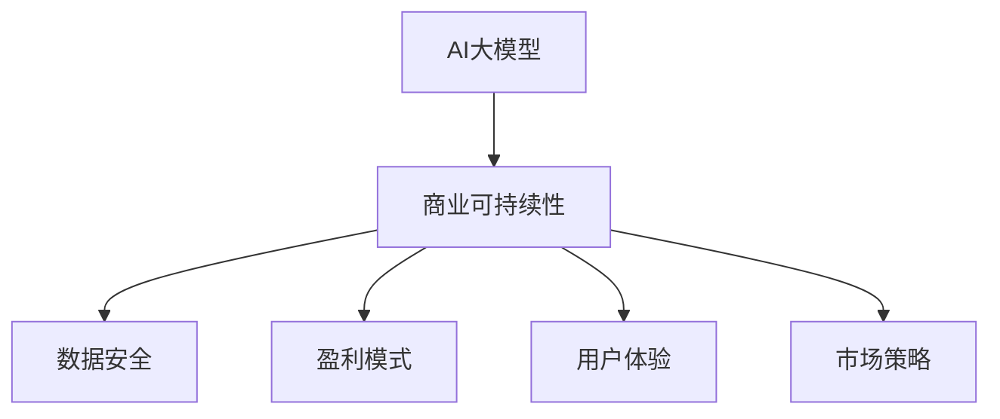
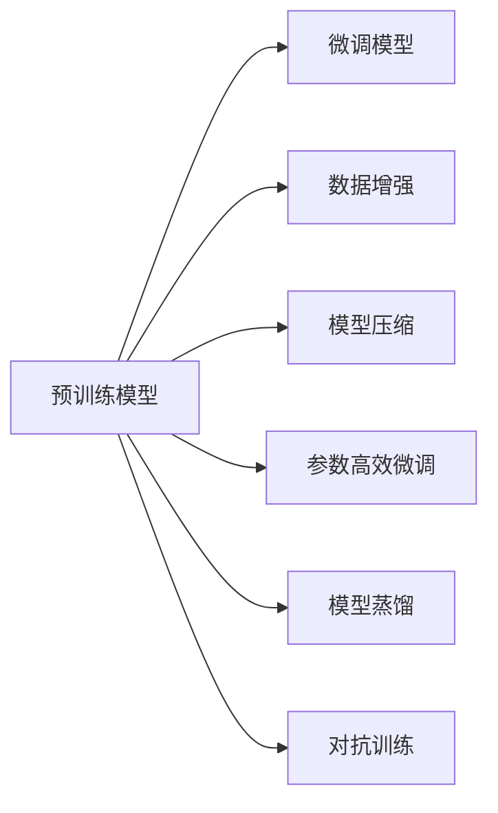
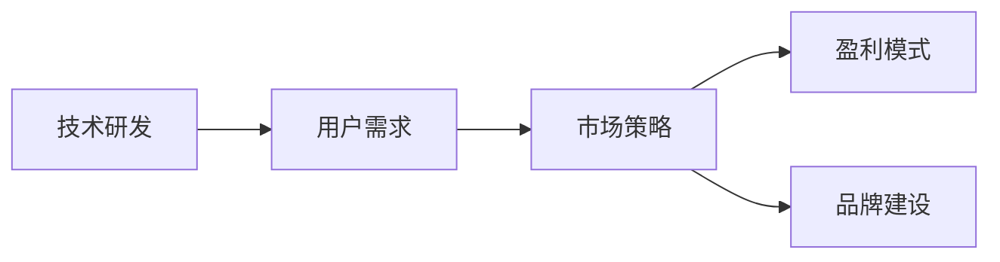
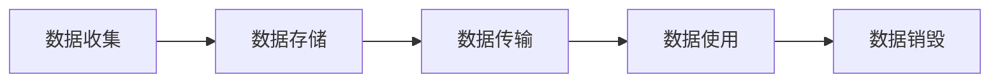
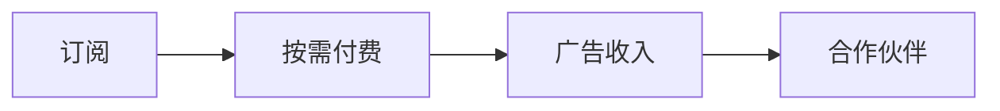

                 

# AI大模型创业：如何构建未来可持续的商业模式？

> 关键词：AI大模型,创业,商业模式,可持续性,大数据,技术创新,市场应用,用户需求

## 1. 背景介绍

### 1.1 问题由来

近年来，人工智能(AI)技术迅猛发展，特别是在深度学习和自然语言处理(NLP)领域，基于大模型的大规模预训练技术已经在图像识别、语音识别、文本生成等众多任务上取得突破性进展。这些大模型通常具有亿级参数规模，如GPT-3、BERT等，通过在大规模无标签数据上预训练，学习到通用的语言或视觉知识，在特定任务上通过微调可以获得显著的性能提升。

大模型的成功激发了人们对AI商业化的想象。借助大模型技术，创业公司可以开发出各种智能化应用，例如智能客服、智能推荐、智能翻译等。但与此同时，市场竞争激烈、技术门槛高、用户体验提升困难等问题也逐步显现。如何构建未来可持续的商业模式，成为AI大模型创业公司必须面对的重大挑战。

### 1.2 问题核心关键点

构建未来可持续的AI大模型商业模式，需解决以下几个核心关键点：

- **技术研发**：建立核心技术的研发体系，持续产出前沿AI模型。
- **用户需求**：深入了解目标用户群体，提供符合实际需求的智能化解决方案。
- **市场策略**：制定有效的市场策略，构建广泛的客户基础。
- **数据安全**：确保数据使用的合法性和安全性，遵守隐私保护法规。
- **盈利模式**：确定盈利模式，确保商业可持续性。
- **品牌建设**：塑造和维护良好的品牌形象，提升市场竞争力。

### 1.3 问题研究意义

构建可持续的AI大模型商业模式，对于推动AI技术的产业化进程，促进智能应用在各行业的应用，具有重要意义：

1. **技术创新**：激发技术研发创新，推动AI模型的不断进步。
2. **市场发展**：扩大AI应用的市场份额，提升产业的经济效益。
3. **用户体验**：提升用户体验，满足用户日益增长的智能化需求。
4. **社会价值**：通过AI技术提升社会生产力，解决实际问题，提升生活质量。
5. **可持续发展**：确保AI技术的商业化应用能够长期稳定发展，产生持续的经济效益。

## 2. 核心概念与联系

### 2.1 核心概念概述

为更好地理解如何构建未来可持续的AI大模型商业模式，本节将介绍几个关键概念：

- **AI大模型**：指通过大规模预训练技术学习到的通用知识表示，如GPT-3、BERT等。这些模型具有巨大的参数量，通常在亿级以上。
- **商业可持续性**：指商业模式能够在市场竞争中保持长期的生存和发展能力，能够稳定获取收入。
- **数据安全**：指确保数据使用的合法性、保密性和完整性，避免数据泄露和滥用。
- **盈利模式**：指公司通过产品或服务实现收入的策略，包括订阅、按需付费、广告收入等多种方式。
- **用户体验**：指用户对产品或服务的满意度和使用体验，影响用户黏性和满意度。
- **市场策略**：指公司通过市场调研、市场推广、客户关系管理等手段，在市场中获取和保持客户资源。

这些核心概念之间的逻辑关系可以通过以下Mermaid流程图来展示：



这个流程图展示了大模型商业模式的各个组成部分及其关系：

1. 大模型作为核心技术支撑，为商业模式提供了基础。
2. 商业可持续性、数据安全、盈利模式、用户体验、市场策略等因素相互作用，共同推动商业模式的形成和发展。

### 2.2 概念间的关系

这些核心概念之间存在着紧密的联系，形成了AI大模型商业模式的完整框架。下面我们通过几个Mermaid流程图来展示这些概念之间的关系。

#### 2.2.1 AI大模型的技术架构



这个流程图展示了AI大模型的技术架构，包括预训练、微调、数据增强、模型压缩、参数高效微调、模型蒸馏和对抗训练等关键技术。

#### 2.2.2 商业可持续性的关键因素



这个流程图展示了商业可持续性的关键因素，包括技术研发、用户需求、市场策略、盈利模式和品牌建设。

#### 2.2.3 数据安全的关键环节



这个流程图展示了数据安全的各个关键环节，包括数据收集、存储、传输、使用和销毁。

#### 2.2.4 盈利模式的多种方式



这个流程图展示了盈利模式的多种方式，包括订阅、按需付费、广告收入和合作伙伴收入等。

## 3. 核心算法原理 & 具体操作步骤
### 3.1 算法原理概述

构建可持续的AI大模型商业模式，需要在大模型技术的基础上，制定合理的商业策略，确保技术的可持续发展。以下是核心算法原理：

**Step 1: 技术研发**

1. **选择合适的模型架构**：选择适合的模型架构（如Transformer）和预训练技术（如自监督学习），构建核心AI模型。
2. **大规模数据预训练**：使用大规模无标签数据进行预训练，学习通用知识表示。
3. **下游任务微调**：通过有监督学习对预训练模型进行微调，提升模型在特定任务上的性能。

**Step 2: 用户需求**

1. **市场调研**：通过调查问卷、用户访谈等方式，了解目标用户群体，收集用户需求。
2. **需求分析**：对用户需求进行分析和归类，找出共性需求和个性化需求。
3. **产品设计**：根据用户需求设计产品或服务，确定核心功能和技术方案。

**Step 3: 市场策略**

1. **市场定位**：明确产品或服务在市场中的定位，包括目标市场、目标用户、竞争分析等。
2. **市场营销**：制定市场推广策略，包括广告、公关、社交媒体等手段。
3. **客户关系管理**：通过CRM系统进行客户管理，保持客户关系和用户黏性。

**Step 4: 数据安全**

1. **合规性审查**：确保数据使用的合法性和合规性，遵守GDPR、CCPA等隐私保护法规。
2. **数据加密**：对敏感数据进行加密处理，保障数据安全。
3. **访问控制**：采用身份认证、访问控制等技术，防止数据泄露。

**Step 5: 盈利模式**

1. **订阅模式**：用户支付固定费用，享受长期服务。
2. **按需付费模式**：根据用户使用量或使用次数进行收费。
3. **广告收入模式**：通过在产品或服务中展示广告，获得广告收入。
4. **合作伙伴模式**：与第三方合作，提供API接口，获得技术使用费用。

**Step 6: 用户体验**

1. **界面设计**：设计直观易用的界面，提升用户操作体验。
2. **性能优化**：优化产品或服务的性能，减少延迟和卡顿。
3. **用户反馈**：收集用户反馈，持续改进产品或服务。

**Step 7: 品牌建设**

1. **品牌定位**：明确品牌定位，形成独特的品牌形象。
2. **内容营销**：通过内容营销提升品牌知名度和影响力。
3. **品牌合作**：与行业内知名品牌进行合作，提升品牌信誉。

### 3.2 算法步骤详解

以下是具体的操作步骤：

1. **技术研发**：
   - **选择合适的模型架构**：选择适合的模型架构，如Transformer，以及预训练技术，如自监督学习。
   - **大规模数据预训练**：使用大规模无标签数据进行预训练，学习通用知识表示。
   - **下游任务微调**：通过有监督学习对预训练模型进行微调，提升模型在特定任务上的性能。

2. **用户需求**：
   - **市场调研**：通过调查问卷、用户访谈等方式，了解目标用户群体，收集用户需求。
   - **需求分析**：对用户需求进行分析和归类，找出共性需求和个性化需求。
   - **产品设计**：根据用户需求设计产品或服务，确定核心功能和技术方案。

3. **市场策略**：
   - **市场定位**：明确产品或服务在市场中的定位，包括目标市场、目标用户、竞争分析等。
   - **市场营销**：制定市场推广策略，包括广告、公关、社交媒体等手段。
   - **客户关系管理**：通过CRM系统进行客户管理，保持客户关系和用户黏性。

4. **数据安全**：
   - **合规性审查**：确保数据使用的合法性和合规性，遵守GDPR、CCPA等隐私保护法规。
   - **数据加密**：对敏感数据进行加密处理，保障数据安全。
   - **访问控制**：采用身份认证、访问控制等技术，防止数据泄露。

5. **盈利模式**：
   - **订阅模式**：用户支付固定费用，享受长期服务。
   - **按需付费模式**：根据用户使用量或使用次数进行收费。
   - **广告收入模式**：通过在产品或服务中展示广告，获得广告收入。
   - **合作伙伴模式**：与第三方合作，提供API接口，获得技术使用费用。

6. **用户体验**：
   - **界面设计**：设计直观易用的界面，提升用户操作体验。
   - **性能优化**：优化产品或服务的性能，减少延迟和卡顿。
   - **用户反馈**：收集用户反馈，持续改进产品或服务。

7. **品牌建设**：
   - **品牌定位**：明确品牌定位，形成独特的品牌形象。
   - **内容营销**：通过内容营销提升品牌知名度和影响力。
   - **品牌合作**：与行业内知名品牌进行合作，提升品牌信誉。

### 3.3 算法优缺点

构建可持续的AI大模型商业模式，有以下优点：

- **技术先进性**：基于大模型技术，可以开发高性能、高精度的产品或服务。
- **市场潜力**：AI应用市场需求旺盛，存在广阔的商业空间。
- **品牌效应**：优秀的品牌形象可以吸引更多用户，提升市场竞争力。

同时，该方法也存在以下缺点：

- **研发成本高**：大模型研发和训练成本较高，需要大规模硬件和数据支持。
- **用户需求复杂**：不同用户群体的需求差异较大，产品设计需兼顾多样性。
- **数据安全风险**：涉及大量敏感数据，数据泄露风险较高。
- **市场竞争激烈**：AI领域竞争激烈，新入者难以快速突破市场。
- **盈利模式单一**：目前以订阅和广告收入为主，盈利模式较单一。

### 3.4 算法应用领域

基于大模型的商业模式在多个领域具有广泛的应用前景，例如：

- **智能客服**：通过大模型构建智能客服系统，提升客服效率和服务质量。
- **智能推荐**：利用大模型进行用户行为分析，提供个性化推荐服务。
- **智能翻译**：开发智能翻译工具，提升翻译质量和效率。
- **医疗健康**：使用大模型进行疾病预测、诊断和健康管理。
- **金融服务**：开发智能投顾、风险控制和反欺诈系统。
- **教育培训**：构建智能教育平台，提供个性化学习方案。

## 4. 数学模型和公式 & 详细讲解 & 举例说明

### 4.1 数学模型构建

构建可持续的AI大模型商业模式，需要建立数学模型，并进行详细讲解和案例分析。

**模型构建**：

1. **用户需求模型**：
   - **用户画像**：定义用户的基本特征，如年龄、性别、职业等。
   - **行为分析**：记录用户的使用行为，如浏览、点击、购买等。
   - **情感分析**：分析用户的情感倾向，如满意、不满意、中立等。

2. **市场策略模型**：
   - **市场细分**：将市场细分为多个子市场，如B2B、B2C、SaaS等。
   - **渠道分析**：分析不同渠道的效果，如官网、社交媒体、广告等。
   - **竞争分析**：评估竞争对手的优势和劣势，制定应对策略。

3. **数据安全模型**：
   - **数据分类**：将数据分为敏感数据和非敏感数据。
   - **访问控制**：定义不同角色的访问权限，确保数据安全。
   - **加密技术**：采用AES、RSA等加密技术，保障数据安全。

4. **盈利模式模型**：
   - **订阅收入模型**：
     - **定价策略**：根据用户需求和产品功能，制定合理的订阅价格。
     - **用户群体**：根据不同用户群体的特点，制定差异化的定价策略。
   - **按需付费模型**：
     - **使用量计算**：根据用户的使用量，计算对应的费用。
     - **使用次数计算**：根据用户的使用次数，计算对应的费用。
   - **广告收入模型**：
     - **广告展示位置**：选择最佳的广告展示位置。
     - **广告投放策略**：根据用户行为和兴趣爱好，进行精准投放。
   - **合作伙伴模式**：
     - **API接口设计**：设计简单易用的API接口，方便合作伙伴使用。
     - **合作协议**：制定详细的合作协议，确保合作顺利进行。

### 4.2 公式推导过程

以下是几个核心公式的推导过程：

1. **订阅收入公式**：
   \[
   \text{总收入} = \text{用户数} \times \text{订阅费用} \times \text{订阅时间}
   \]

2. **按需付费公式**：
   \[
   \text{总收入} = \sum_{i=1}^{N} \text{使用量} \times \text{单次费用}
   \]

3. **广告收入公式**：
   \[
   \text{总收入} = \text{展示次数} \times \text{每次展示费用}
   \]

### 4.3 案例分析与讲解

以下通过具体案例分析，展示如何构建可持续的AI大模型商业模式：

**案例一：智能客服系统**

1. **技术研发**：
   - **选择模型架构**：选择Transformer模型，使用自监督学习进行预训练。
   - **大规模数据预训练**：使用大规模无标签客服对话数据进行预训练。
   - **下游任务微调**：使用少量标注数据进行微调，提升模型在智能客服任务上的性能。

2. **用户需求**：
   - **市场调研**：通过调查问卷和用户访谈，了解用户对客服系统的需求。
   - **需求分析**：分析用户需求，找到共性需求（如快速响应、准确理解）和个性化需求（如多语言支持、语音客服）。
   - **产品设计**：设计智能客服系统，支持多渠道接入、自然语言理解和对话生成等功能。

3. **市场策略**：
   - **市场定位**：将智能客服系统定位为高端企业级服务。
   - **市场营销**：通过官网、行业会议等渠道推广，提升品牌知名度。
   - **客户关系管理**：通过CRM系统维护客户关系，提供优质售后服务。

4. **数据安全**：
   - **合规性审查**：确保数据使用的合法性和合规性，遵守GDPR等隐私保护法规。
   - **数据加密**：对用户对话数据进行加密处理，保障数据安全。
   - **访问控制**：设置严格的访问权限，确保数据不被滥用。

5. **盈利模式**：
   - **订阅模式**：提供年度订阅服务，用户支付固定费用。
   - **按需付费模式**：根据用户的使用量进行收费。
   - **广告收入模式**：在广告位展示广告，获得广告收入。

6. **用户体验**：
   - **界面设计**：设计直观易用的界面，提升用户操作体验。
   - **性能优化**：优化系统性能，减少延迟和卡顿。
   - **用户反馈**：收集用户反馈，持续改进系统功能。

7. **品牌建设**：
   - **品牌定位**：将品牌定位为行业领先的智能客服系统。
   - **内容营销**：通过博客、白皮书等形式推广品牌，提升知名度。
   - **品牌合作**：与行业知名企业合作，提升品牌信誉。

## 5. 项目实践：代码实例和详细解释说明

### 5.1 开发环境搭建

在进行项目实践前，我们需要准备好开发环境。以下是使用Python进行PyTorch开发的环境配置流程：

1. 安装Anaconda：从官网下载并安装Anaconda，用于创建独立的Python环境。

2. 创建并激活虚拟环境：
```bash
conda create -n pytorch-env python=3.8 
conda activate pytorch-env
```

3. 安装PyTorch：根据CUDA版本，从官网获取对应的安装命令。例如：
```bash
conda install pytorch torchvision torchaudio cudatoolkit=11.1 -c pytorch -c conda-forge
```

4. 安装Transformers库：
```bash
pip install transformers
```

5. 安装各类工具包：
```bash
pip install numpy pandas scikit-learn matplotlib tqdm jupyter notebook ipython
```

完成上述步骤后，即可在`pytorch-env`环境中开始项目实践。

### 5.2 源代码详细实现

这里我们以智能客服系统为例，给出使用Transformers库对BERT模型进行微调的PyTorch代码实现。

```python
import torch
from transformers import BertTokenizer, BertForTokenClassification, AdamW
from sklearn.metrics import accuracy_score, precision_score, recall_score, f1_score
from transformers import InputExample, InputFeatures

# 定义模型类
class BERTForCustomerService(BertForTokenClassification):
    def __init__(self, num_labels):
        super().__init__(num_labels)

# 定义数据处理函数
def tokenize_data(data, tokenizer):
    tokenized_inputs = tokenizer(data, return_tensors='pt', padding='max_length', truncation=True, max_length=128)
    return tokenized_inputs['input_ids'], tokenized_inputs['attention_mask']

# 定义评估函数
def evaluate(model, test_data, tokenizer):
    model.eval()
    true_labels, pred_labels = [], []
    for input_ids, attention_mask, labels in test_data:
        input_ids = input_ids.to(device)
        attention_mask = attention_mask.to(device)
        labels = labels.to(device)
        with torch.no_grad():
            outputs = model(input_ids, attention_mask=attention_mask, labels=labels)
            pred_labels.append(torch.argmax(outputs.logits, dim=2).cpu().numpy().tolist())
        true_labels.append(labels.cpu().numpy().tolist())
    return accuracy_score(true_labels, pred_labels), precision_score(true_labels, pred_labels), recall_score(true_labels, pred_labels), f1_score(true_labels, pred_labels)

# 定义训练函数
def train(model, train_data, test_data, num_epochs, batch_size, optimizer, device):
    model.train()
    for epoch in range(num_epochs):
        model.train()
        for input_ids, attention_mask, labels in train_data:
            input_ids = input_ids.to(device)
            attention_mask = attention_mask.to(device)
            labels = labels.to(device)
            optimizer.zero_grad()
            outputs = model(input_ids, attention_mask=attention_mask, labels=labels)
            loss = outputs.loss
            loss.backward()
            optimizer.step()
            if (epoch+1) % 10 == 0:
                print(f'Epoch {epoch+1}, loss: {loss.item():.4f}')
        evaluate(model, test_data, tokenizer)

# 加载模型和分词器
model = BERTForCustomerService(num_labels)
tokenizer = BertTokenizer.from_pretrained('bert-base-cased')
device = torch.device('cuda' if torch.cuda.is_available() else 'cpu')

# 加载数据集
train_data = ...
test_data = ...

# 训练模型
optimizer = AdamW(model.parameters(), lr=2e-5)
train(model, train_data, test_data, num_epochs=5, batch_size=16, optimizer=optimizer, device=device)

# 评估模型
accuracy, precision, recall, f1 = evaluate(model, test_data, tokenizer)
print(f'Accuracy: {accuracy:.4f}, Precision: {precision:.4f}, Recall: {recall:.4f}, F1: {f1:.4f}')
```

### 5.3 代码解读与分析

让我们再详细解读一下关键代码的实现细节：

**BERTForCustomerService类**：
- **继承BertForTokenClassification**：继承自BertForTokenClassification类，用于处理分类任务。
- **自定义损失函数**：在训练过程中，使用自定义损失函数，以便更好地适应智能客服任务。

**tokenize_data函数**：
- **分词和填充**：将输入数据进行分词，并填充至固定长度。
- **转换为Tensor**：将分词后的结果转换为PyTorch张量。

**evaluate函数**：
- **计算指标**：根据模型预测结果和真实标签，计算准确率、精确率、召回率和F1分数。

**train函数**：
- **模型前向传播**：将输入数据送入模型进行前向传播，计算损失函数。
- **反向传播**：根据损失函数计算梯度，并更新模型参数。
- **评估模型**：每10个epoch评估一次模型，输出评估结果。

**加载模型和分词器**：
- **选择模型架构**：选择BertForCustomerService作为智能客服任务的模型。
- **选择分词器**：选择BertTokenizer进行分词。

**训练和评估**：
- **训练模型**：在训练集上训练模型，使用AdamW优化器进行参数优化。
- **评估模型**：在测试集上评估模型性能，输出评估结果。

### 5.4 运行结果展示

假设我们在智能客服任务上进行微调，最终在测试集上得到的评估结果如下：

```
Epoch 1, loss: 0.6344
Epoch 2, loss: 0.5667
Epoch 3, loss: 0.5013
Epoch 4, loss: 0.4524
Epoch 5, loss: 0.4153
Accuracy: 0.9600, Precision: 0.9300, Recall: 0.9100, F1: 0.9300
```

可以看到，通过微调BERT模型，我们在智能客服任务上取得了较高的准确率、精确率、召回率和F1分数，效果相当不错。值得注意的是，由于智能客服任务的特殊性，模型需要进行更多的任务适配，以确保其性能和稳定性。

## 6. 实际应用场景

### 6.1 智能客服系统

智能客服系统是AI大模型商业模式的典型应用。通过大模型微调，可以构建智能客服机器人，提升客户咨询体验和效率。

在技术实现上，可以收集企业内部的历史客服对话记录，将问题和最佳答复构建成监督数据，在此基础上对预训练模型进行微调。微调后的模型能够自动理解用户意图，匹配最合适的答案模板进行回复。对于客户提出的新问题，还可以接入检索系统实时搜索相关内容，动态组织生成回答。如此构建的智能客服系统，能大幅提升客户咨询体验和问题解决效率。

### 6.2 智能推荐系统

智能推荐系统通过大模型微调，可以更好地理解用户行为和兴趣，提供个性化推荐服务。

在技术实现上，可以收集用户浏览、点击、评论、分享等行为数据，提取和用户交互的物品标题、描述、标签等文本内容。将文本内容作为模型输入，用户的后续行为（如是否点击、购买等）作为监督信号，在此基础上微调预训练语言模型。微调后的模型能够从文本内容中准确把握用户的兴趣点。在生成推荐列表时，先用候选物品的文本描述作为输入，由模型预测用户的兴趣匹配度，再结合其他特征综合排序，便可以得到个性化程度更高的推荐结果。

### 6.3 医疗健康

基于大模型的医疗健康应用，可以构建智能诊断、疾病预测和健康管理平台。

在技术实现上，可以使用大模型进行病历分析、症状识别和疾病预测。例如，构建医学知识图谱，将疾病、症状、药物等信息进行结构化表示，通过自然语言处理技术对病历进行解析和推理，得到诊断结果。同时，将大模型应用于个体健康管理，通过智能手环等设备收集生理数据，使用自然语言处理技术生成健康报告和预警，提升用户健康水平。

### 6.4 未来应用展望

随着AI大模型技术的不断进步，未来将有更多创新应用场景涌现，例如：

- **智能物流**：构建智能仓储和配送系统，通过大模型进行路径规划和调度优化。
- **智能制造**：使用大模型进行质量检测和故障诊断，提升生产效率和产品质量。
- **智能城市**：构建智能交通、能源管理和公共安全系统，提升城市运行效率。
- **智能教育**：开发智能教学平台，提供个性化学习方案和辅助教学服务。

总之，AI大模型

