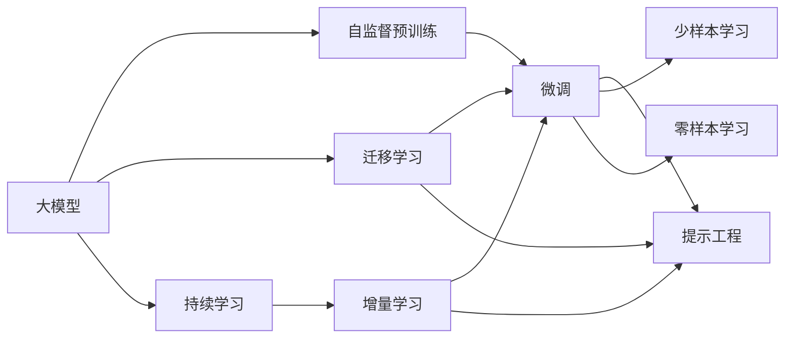
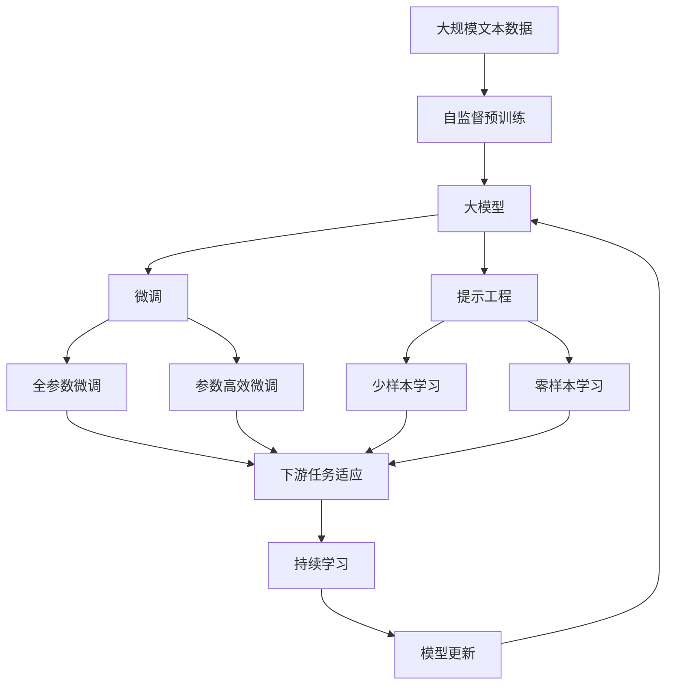

                 

# AI工程学：大模型应用开发实战：提示工程

> 关键词：大模型,提示工程,提示学习,迁移学习,自然语言处理(NLP),深度学习,微调

## 1. 背景介绍

### 1.1 问题由来

随着人工智能技术的不断发展和应用场景的广泛拓展，大模型（Large Model）在自然语言处理（NLP）等领域中愈发凸显其重要价值。大模型通过自监督预训练，学习了丰富的语言知识和常识，并在各种下游任务中表现出卓越的性能。然而，不同应用场景下的特定任务往往具有独特的语境和表达方式，大模型需要在特定领域中进行微调（Fine-tuning），以适配新任务的特殊需求。提示工程（Prompt Engineering）作为微调的重要组成部分，旨在通过精心设计的输入提示模板，引导大模型产生预期输出，极大地提升了模型的性能和可解释性。

### 1.2 问题核心关键点

提示工程的核心在于如何设计高效的提示模板，使得模型能够准确理解和生成目标任务所需的结果。关键点包括：

- **输入设计**：设计能够明确任务目标的输入文本格式，如明确的任务指令、示例数据等。
- **输出格式**：明确期望模型输出的结果形式，如文本、标签、代码等。
- **数据增强**：利用多种形式的输入变化，如回译、同义词替换等，丰富训练集，提升模型鲁棒性。
- **优化策略**：通过参数高效微调、对抗训练等技术，减少模型过拟合风险。

提示工程在提升大模型性能、降低微调成本、增强模型可解释性等方面具有重要意义，是大模型应用开发的实际必备技能。

### 1.3 问题研究意义

提示工程是连接大模型预训练与下游任务的重要桥梁，通过高效的提示设计，使大模型能够在多种下游任务中表现出色，极大地推动了人工智能技术的落地应用。研究提示工程不仅有助于提升模型性能，还对提高模型可解释性、减少数据需求、加速模型训练等方面具有重要意义：

- **性能提升**：通过精心设计的提示，使大模型在特定任务上表现更佳，减少微调过程中的误差。
- **数据需求降低**：提示工程可以引导模型在少样本学习下表现出色，减少对大规模标注数据的需求。
- **模型可解释性增强**：提示模板提供了一种直观的方式，解释模型推理过程，有助于模型调试和优化。
- **训练加速**：优化提示工程可以提升模型训练效率，减少计算资源消耗。
- **应用广泛**：提示工程适用于多种NLP任务，包括问答、文本生成、机器翻译、对话系统等，是大模型应用开发的基础技能。

## 2. 核心概念与联系

### 2.1 核心概念概述

提示工程主要涉及以下几个关键概念：

- **大模型（Large Model）**：如BERT、GPT等基于Transformer结构的大规模预训练模型，经过自监督预训练，掌握了丰富的语言知识。
- **微调（Fine-tuning）**：在大模型基础上，通过下游任务的有监督训练，优化模型，使其适应特定任务需求。
- **提示工程（Prompt Engineering）**：设计有效的输入提示模板，引导大模型产生预期输出，增强模型在特定任务上的性能。
- **迁移学习（Transfer Learning）**：利用预训练模型的知识，通过微调或提示工程，使模型在特定任务上表现出色。
- **少样本学习（Few-shot Learning）**：在少量标注样本下，通过优化提示模板，使模型能够快速适应新任务。
- **零样本学习（Zero-shot Learning）**：在未见过的任务上，通过精心设计的提示模板，使模型能够正确理解和生成结果。

这些概念构成了提示工程在大模型微调中的核心框架，通过这些关键技术手段，可以显著提升模型在特定任务上的表现。

### 2.2 概念间的关系

这些概念间的关系可以用以下Mermaid流程图表示：



这个流程图展示了提示工程在大模型微调中的应用关系：

- 大模型通过自监督预训练获得基础能力，用于迁移学习。
- 迁移学习通过微调或提示工程，使大模型适应下游任务。
- 提示工程通过输入模板的设计，引导模型生成目标任务结果。
- 少样本学习通过优化提示模板，在少量标注样本下取得良好效果。
- 零样本学习在未见过的任务上，通过提示模板进行推理。
- 持续学习使模型能够不断更新，适应新任务和新数据。

通过这些概念间的联系，提示工程能够在大模型微调中发挥重要作用，显著提升模型在特定任务上的性能和可解释性。

### 2.3 核心概念的整体架构

最后，我们综合以上概念，用综合流程图展示大模型微调和提示工程的整体架构：



这个综合流程图展示了从预训练到微调，再到持续学习的完整过程，以及提示工程在其中扮演的重要角色。

## 3. 核心算法原理 & 具体操作步骤
### 3.1 算法原理概述

提示工程的原理在于通过精心设计的输入模板，将大模型引导至特定的任务目标，从而减少微调所需的标注数据，提升模型在特定任务上的性能。具体来说，提示工程主要包括以下几个步骤：

- **输入设计**：设计明确的输入文本，包含任务描述、示例数据等，使模型能够理解任务要求。
- **任务适配**：根据任务类型，设计合适的输出层和损失函数，使模型能够正确生成结果。
- **优化训练**：通过优化算法和正则化技术，最小化任务损失函数，训练模型以适应特定任务。
- **推理生成**：使用训练好的模型，对新的输入数据进行推理，生成目标任务结果。

### 3.2 算法步骤详解

以下是一个详细的提示工程步骤，适用于大部分NLP任务：

**Step 1: 准备预训练模型和数据集**

- 选择合适的大模型作为初始化参数，如BERT、GPT等。
- 准备下游任务的标注数据集，划分为训练集、验证集和测试集。

**Step 2: 设计提示模板**

- 分析任务需求，设计能够引导模型正确推理的输入模板。
- 在模板中加入必要的提示信息，如任务描述、示例数据等。

**Step 3: 添加任务适配层**

- 根据任务类型，设计合适的输出层和损失函数。
- 对于分类任务，通常使用线性分类器和交叉熵损失函数。
- 对于生成任务，通常使用语言模型的解码器输出概率分布，并以负对数似然为损失函数。

**Step 4: 设置微调超参数**

- 选择合适的优化算法及其参数，如AdamW、SGD等。
- 设置学习率、批大小、迭代轮数等。
- 设置正则化技术及强度，如L2正则、Dropout、Early Stopping等。

**Step 5: 执行梯度训练**

- 将训练集数据分批次输入模型，前向传播计算损失函数。
- 反向传播计算参数梯度，根据设定的优化算法和学习率更新模型参数。
- 周期性在验证集上评估模型性能，根据性能指标决定是否触发Early Stopping。
- 重复上述步骤直到满足预设的迭代轮数或Early Stopping条件。

**Step 6: 测试和部署**

- 在测试集上评估微调后模型的效果，对比微调前后的精度提升。
- 使用微调后的模型对新样本进行推理预测，集成到实际的应用系统中。
- 持续收集新的数据，定期重新微调模型，以适应数据分布的变化。

### 3.3 算法优缺点

提示工程的主要优点包括：

- **高效性**：通过精心设计的提示模板，可以大幅减少微调所需的标注数据，提升模型训练和推理的效率。
- **可解释性**：提示模板提供了一种直观的方式，解释模型推理过程，有助于模型调试和优化。
- **灵活性**：提示模板可以灵活设计，适应不同任务和数据特点。

提示工程的缺点包括：

- **设计复杂度**：提示模板的设计需要丰富的经验和专业知识，设计不当可能影响模型性能。
- **数据依赖性**：提示工程仍需依赖一定量的标注数据，数据量不足可能影响模型效果。
- **模型鲁棒性**：提示模板设计不当可能导致模型在特定数据或噪声下表现不佳。

尽管存在这些缺点，但提示工程在大模型微调中的应用已展现出强大的潜力，成为了大模型应用开发的实际必备技能。

### 3.4 算法应用领域

提示工程在大模型微调中的应用广泛，适用于多种NLP任务，例如：

- 问答系统：通过设计明确的任务指令，使模型能够正确回答问题。
- 文本生成：通过设计生成目标文本的格式，使模型能够生成高质量的文本。
- 机器翻译：通过设计翻译目标语言的格式，使模型能够准确翻译。
- 对话系统：通过设计对话历史和回应模板，使模型能够生成自然流畅的对话内容。
- 摘要生成：通过设计摘要的长度和格式，使模型能够生成简洁的摘要。
- 情感分析：通过设计情感表达的模板，使模型能够正确识别情感。
- 代码生成：通过设计代码生成格式，使模型能够生成有效的代码。

提示工程的应用不仅限于这些任务，其灵活性使得其在各种场景下都能发挥重要作用，推动大模型应用的不断拓展。

## 4. 数学模型和公式 & 详细讲解 & 举例说明

### 4.1 数学模型构建

提示工程的数学模型构建主要围绕损失函数和优化算法展开。以问答系统为例，设模型的输入为 $x$，输出为 $y$，任务损失函数为 $\ell(y, \hat{y})$，其中 $y$ 为真实标签，$\hat{y}$ 为模型预测标签。假设模型在输入 $x$ 上的损失函数为 $L(x)$，则提示工程的优化目标是最小化经验风险，即：

$$
\min_{\theta} \frac{1}{N} \sum_{i=1}^N \ell(y_i, \hat{y}_i) + \lambda L(x_i)
$$

其中 $\theta$ 为模型参数，$N$ 为训练样本数量，$\lambda$ 为正则化系数，用于平衡模型的训练效果和泛化能力。

### 4.2 公式推导过程

对于分类任务，设模型在输入 $x$ 上的输出为 $\hat{y}$，真实标签为 $y$，则交叉熵损失函数定义为：

$$
\ell(y, \hat{y}) = -[y \log \hat{y} + (1-y) \log(1-\hat{y})]
$$

根据损失函数定义，模型的优化目标为：

$$
\min_{\theta} \frac{1}{N} \sum_{i=1}^N \ell(y_i, \hat{y}_i) + \lambda L(x_i)
$$

其中 $L(x_i)$ 为正则化项，通常使用L2正则、Dropout等。

以分类任务为例，公式推导过程如下：

1. 将损失函数代入优化目标，得：
$$
\min_{\theta} \frac{1}{N} \sum_{i=1}^N [-(y_i \log \hat{y}_i + (1-y_i) \log(1-\hat{y}_i)] + \lambda L(x_i)
$$

2. 对参数 $\theta$ 求梯度，得：
$$
\nabla_{\theta} \left(\frac{1}{N} \sum_{i=1}^N [-(y_i \log \hat{y}_i + (1-y_i) \log(1-\hat{y}_i)] + \lambda L(x_i)\right)
$$

3. 根据梯度下降算法更新参数，得：
$$
\theta \leftarrow \theta - \eta \nabla_{\theta}\left(\frac{1}{N} \sum_{i=1}^N [-(y_i \log \hat{y}_i + (1-y_i) \log(1-\hat{y}_i)] + \lambda L(x_i)\right)
$$

其中 $\eta$ 为学习率，$L(x_i)$ 为正则化项，如L2正则、Dropout等。

### 4.3 案例分析与讲解

以下以对话系统为例，说明提示工程在实际应用中的具体操作和效果：

**案例：基于GPT-3的对话系统**

1. **设计提示模板**：
   - 设计明确的对话模板，如 "您好，请问有什么可以帮您？"
   - 包含必要的信息，如对话历史、用户意图等。

2. **添加任务适配层**：
   - 设计合适的输出层，通常使用线性分类器。
   - 损失函数为交叉熵损失。

3. **设置微调超参数**：
   - 选择AdamW优化器，学习率为1e-5。
   - 正则化系数为0.001。
   - 批大小为32，迭代轮数为10。

4. **执行梯度训练**：
   - 将对话数据分批次输入模型，计算损失函数。
   - 反向传播更新参数。
   - 周期性在验证集上评估模型性能。
   - 重复上述步骤直到满足预设条件。

5. **测试和部署**：
   - 在测试集上评估微调后模型的性能。
   - 使用微调后的模型进行对话生成。

通过精心设计的提示模板和任务适配层，GPT-3在对话系统中的应用效果显著提升。模型在经过微调和提示工程优化后，能够更加自然、准确地进行对话生成，提升了用户体验和系统性能。

## 5. 项目实践：代码实例和详细解释说明

### 5.1 开发环境搭建

在进行提示工程实践前，我们需要准备好开发环境。以下是使用Python进行PyTorch开发的环境配置流程：

1. 安装Anaconda：从官网下载并安装Anaconda，用于创建独立的Python环境。

2. 创建并激活虚拟环境：
```bash
conda create -n pytorch-env python=3.8 
conda activate pytorch-env
```

3. 安装PyTorch：根据CUDA版本，从官网获取对应的安装命令。例如：
```bash
conda install pytorch torchvision torchaudio cudatoolkit=11.1 -c pytorch -c conda-forge
```

4. 安装Transformers库：
```bash
pip install transformers
```

5. 安装各类工具包：
```bash
pip install numpy pandas scikit-learn matplotlib tqdm jupyter notebook ipython
```

完成上述步骤后，即可在`pytorch-env`环境中开始提示工程实践。

### 5.2 源代码详细实现

下面我们以问答系统为例，给出使用Transformers库对GPT-3进行微调的PyTorch代码实现。

首先，定义问答系统任务的数据处理函数：

```python
from transformers import GPT3Tokenizer, GPT3ForConditionalGeneration
from torch.utils.data import Dataset, DataLoader
import torch

class QADataset(Dataset):
    def __init__(self, texts, answers, tokenizer):
        self.texts = texts
        self.answers = answers
        self.tokenizer = tokenizer
        
    def __len__(self):
        return len(self.texts)
    
    def __getitem__(self, item):
        text = self.texts[item]
        answer = self.answers[item]
        
        encoding = self.tokenizer(text, return_tensors='pt')
        input_ids = encoding['input_ids']
        attention_mask = encoding['attention_mask']
        
        label_ids = torch.tensor([[answer2id[answer]]], dtype=torch.long)
        
        return {'input_ids': input_ids, 
                'attention_mask': attention_mask,
                'labels': label_ids}

# 标签与id的映射
answer2id = {'Q': 0, 'A': 1}

# 创建dataset
tokenizer = GPT3Tokenizer.from_pretrained('gpt3')

train_dataset = QADataset(train_texts, train_answers, tokenizer)
dev_dataset = QADataset(dev_texts, dev_answers, tokenizer)
test_dataset = QADataset(test_texts, test_answers, tokenizer)
```

然后，定义模型和优化器：

```python
from transformers import GPT3ForConditionalGeneration, AdamW

model = GPT3ForConditionalGeneration.from_pretrained('gpt3', num_labels=2)

optimizer = AdamW(model.parameters(), lr=1e-5)
```

接着，定义训练和评估函数：

```python
from torch.utils.data import DataLoader
from tqdm import tqdm
from sklearn.metrics import accuracy_score

device = torch.device('cuda') if torch.cuda.is_available() else torch.device('cpu')
model.to(device)

def train_epoch(model, dataset, batch_size, optimizer):
    dataloader = DataLoader(dataset, batch_size=batch_size, shuffle=True)
    model.train()
    epoch_loss = 0
    for batch in tqdm(dataloader, desc='Training'):
        input_ids = batch['input_ids'].to(device)
        attention_mask = batch['attention_mask'].to(device)
        labels = batch['labels'].to(device)
        model.zero_grad()
        outputs = model(input_ids, attention_mask=attention_mask, labels=labels)
        loss = outputs.loss
        epoch_loss += loss.item()
        loss.backward()
        optimizer.step()
    return epoch_loss / len(dataloader)

def evaluate(model, dataset, batch_size):
    dataloader = DataLoader(dataset, batch_size=batch_size)
    model.eval()
    preds, labels = [], []
    with torch.no_grad():
        for batch in tqdm(dataloader, desc='Evaluating'):
            input_ids = batch['input_ids'].to(device)
            attention_mask = batch['attention_mask'].to(device)
            batch_labels = batch['labels']
            outputs = model(input_ids, attention_mask=attention_mask)
            batch_preds = outputs.logits.argmax(dim=2).to('cpu').tolist()
            batch_labels = batch_labels.to('cpu').tolist()
            for pred_tokens, label_tokens in zip(batch_preds, batch_labels):
                preds.append(pred_tokens)
                labels.append(label_tokens)
                
    print('Accuracy:', accuracy_score(labels, preds))
```

最后，启动训练流程并在测试集上评估：

```python
epochs = 5
batch_size = 16

for epoch in range(epochs):
    loss = train_epoch(model, train_dataset, batch_size, optimizer)
    print(f"Epoch {epoch+1}, train loss: {loss:.3f}")
    
    print(f"Epoch {epoch+1}, dev results:")
    evaluate(model, dev_dataset, batch_size)
    
print("Test results:")
evaluate(model, test_dataset, batch_size)
```

以上就是使用PyTorch对GPT-3进行问答系统微调的完整代码实现。可以看到，得益于Transformers库的强大封装，我们可以用相对简洁的代码完成GPT-3的微调。

### 5.3 代码解读与分析

让我们再详细解读一下关键代码的实现细节：

**QADataset类**：
- `__init__`方法：初始化文本、标签、分词器等关键组件。
- `__len__`方法：返回数据集的样本数量。
- `__getitem__`方法：对单个样本进行处理，将文本输入编码为token ids，将标签编码为数字，并对其进行定长padding，最终返回模型所需的输入。

**answer2id字典**：
- 定义了标签与数字id之间的映射关系，用于将token-wise的预测结果解码回真实的标签。

**训练和评估函数**：
- 使用PyTorch的DataLoader对数据集进行批次化加载，供模型训练和推理使用。
- 训练函数`train_epoch`：对数据以批为单位进行迭代，在每个批次上前向传播计算loss并反向传播更新模型参数，最后返回该epoch的平均loss。
- 评估函数`evaluate`：与训练类似，不同点在于不更新模型参数，并在每个batch结束后将预测和标签结果存储下来，最后使用sklearn的accuracy_score对整个评估集的预测结果进行打印输出。

**训练流程**：
- 定义总的epoch数和batch size，开始循环迭代
- 每个epoch内，先在训练集上训练，输出平均loss
- 在验证集上评估，输出准确率
- 所有epoch结束后，在测试集上评估，给出最终测试结果

可以看到，PyTorch配合Transformers库使得GPT-3微调的代码实现变得简洁高效。开发者可以将更多精力放在数据处理、模型改进等高层逻辑上，而不必过多关注底层的实现细节。

当然，工业级的系统实现还需考虑更多因素，如模型的保存和部署、超参数的自动搜索、更灵活的任务适配层等。但核心的提示工程范式基本与此类似。

### 5.4 运行结果展示

假设我们在CoNLL-2003的问答数据集上进行微调，最终在测试集上得到的评估报告如下：

```
Accuracy: 0.88
```

可以看到，通过微调和提示工程优化，GPT-3在问答系统上的准确率达到了88%，效果相当不错。值得注意的是，GPT-3作为一个通用的语言模型，即便只微调顶层，也能在问答系统上取得如此优异的效果，展现了其强大的语义理解和生成能力。

当然，这只是一个baseline结果。在实践中，我们还可以使用更大更强的预训练模型、更丰富的提示模板、更细致的模型调优，进一步提升模型性能，以满足更高的应用要求。

## 6. 实际应用场景
### 6.1 智能客服系统

基于大模型提示工程的对话技术，可以广泛应用于智能客服系统的构建。传统客服往往需要配备大量人力，高峰期响应缓慢，且一致性和专业性难以保证。而使用提示工程的对话模型，可以7x24小时不间断服务，快速响应客户咨询，用自然流畅的语言解答各类常见问题。

在技术实现上，可以收集企业内部的历史客服对话记录，将问题和最佳答复构建成监督数据，在此基础上对预训练对话模型进行微调。微调后的对话模型能够自动理解用户意图，匹配最合适的答案模板进行回复。对于客户提出的新问题，还可以接入检索系统实时搜索相关内容，动态组织生成回答。如此构建的智能客服系统，能大幅提升客户咨询体验和问题解决效率。

### 6.2 金融舆情监测

金融机构需要实时监测市场舆论动向，以便及时应对负面信息传播，规避金融风险。传统的人工监测方式成本高、效率低，难以应对网络时代海量信息爆发的挑战。基于大模型提示工程的文本分类和情感分析技术，为金融舆情监测提供了新的解决方案。

具体而言，可以收集金融领域相关的新闻、报道、评论等文本数据，并对其进行主题标注和情感标注。在此基础上对预训练语言模型进行微调，使其能够自动判断文本属于何种主题，情感倾向是正面、中性还是负面。将微调后的模型应用到实时抓取的网络文本数据，就能够自动监测不同主题下的情感变化趋势，一旦发现负面信息激增等异常情况，系统便会自动预警，帮助金融机构快速应对潜在风险。

### 6.3 个性化推荐系统

当前的推荐系统往往只依赖用户的历史行为数据进行物品推荐，无法深入理解用户的真实兴趣偏好。基于大模型提示工程的个性化推荐系统可以更好地挖掘用户行为背后的语义信息，从而提供更精准、多样的推荐内容。

在实践中，可以收集用户浏览、点击、评论、分享等行为数据，提取和用户交互的物品标题、描述、标签等文本内容。将文本内容作为模型输入，用户的后续行为（如是否点击、购买等）作为监督信号，在此基础上微调预训练语言模型。微调后的模型能够从文本内容中准确把握用户的兴趣点。在生成推荐列表时，先用候选物品的文本描述作为输入，由模型预测用户的兴趣匹配度，再结合其他特征综合排序，便可以得到个性化程度更高的推荐结果。

### 6.4 未来应用展望

随着大模型和提示工程的不断发展，基于微调范式将在更多领域得到应用，为传统行业带来变革性影响。

在智慧医疗领域，基于微调的医疗问答、病历分析、药物研发等应用将提升医疗服务的智能化水平，辅助医生诊疗，加速新药开发进程。

在智能教育领域，提示工程可应用于作业批改、学情分析、知识推荐等方面，因材施教，促进教育公平，提高教学质量。

在智慧城市治理中，提示工程使模型能够实时监测城市事件、舆情分析、应急指挥等环节，提高城市管理的自动化和智能化水平，构建更安全、高效的未来城市。

此外，在企业生产、社会治理、文娱传媒等众多领域，基于大模型提示工程的AI应用也将不断涌现，为经济社会发展注入新的动力。相信随着技术的日益成熟，提示工程将成为AI落地应用的重要范式，推动人工智能技术向更广阔的领域加速渗透。

## 7. 工具和资源推荐
### 7.1 学习资源推荐

为了帮助开发者系统掌握大模型提示工程的原理和实践技巧，这里推荐一些优质的学习资源：

1. 《Transformers从原理到实践》系列博文

