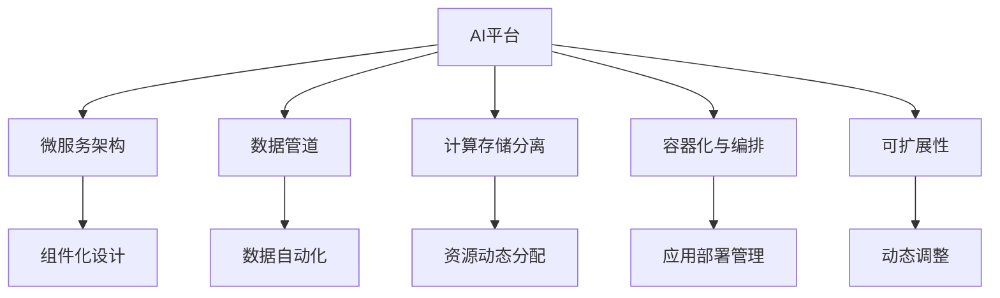
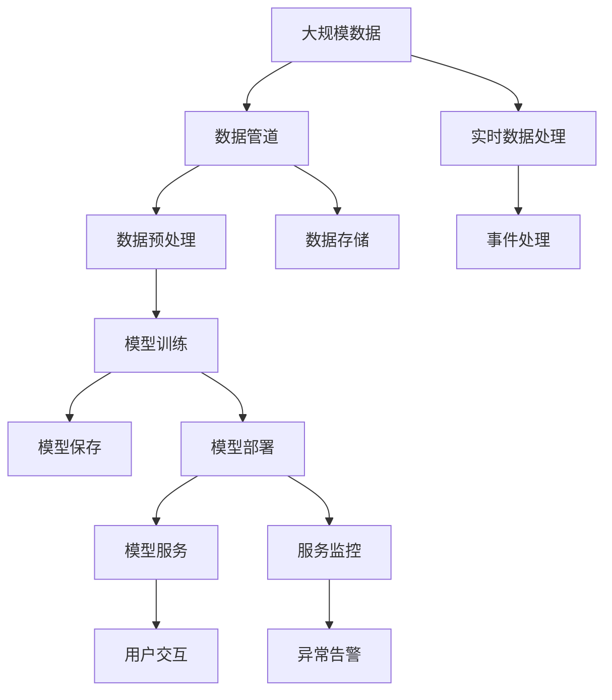

                 

# AI平台化:类比计算机操作系统的发展

> 关键词：
- AI平台化
- 操作系统
- 软件工程
- 数据管道
- 微服务架构
- 计算存储分离
- 可扩展性

## 1. 背景介绍

### 1.1 问题由来

在计算机发展的历程中，操作系统是至关重要的基础软件，其核心功能是将硬件资源抽象为软件接口，方便各类应用程序的运行和资源管理。操作系统自身也是由众多模块化组件构成的，它们协同工作，提供系统稳定的运行环境。类似的，现代AI系统（如AI平台）也需要将复杂的AI组件模块化，通过平台化的方式来管理和调度这些组件，以便支持大规模、高复杂度的AI应用。

### 1.2 问题核心关键点

AI平台化过程涉及多个关键点：
- 资源抽象和调度：将计算、存储、网络等资源抽象为统一的接口，方便AI组件调用。
- 组件化设计：将AI应用拆分为独立、可复用的模块，通过标准化的接口进行连接和组合。
- 系统框架设计：设计出支持多组件并行运行、容错、日志管理等功能的系统框架。
- 软件工程实践：引入DevOps、持续集成/持续交付（CI/CD）等软件工程实践，提升系统开发效率和稳定性。

### 1.3 问题研究意义

AI平台化能显著提升AI系统的开发效率、运行效率、可维护性和扩展性。通过平台化，开发者可以快速组装和使用已有的AI组件，实现快速迭代开发；通过资源抽象和调度，AI系统能够灵活应对大规模和高并发的计算需求，提升运行效率；通过组件化设计，AI系统的复杂度可被降低，便于维护；通过软件工程实践，AI系统能够实现持续迭代和稳定更新。

## 2. 核心概念与联系

### 2.1 核心概念概述

要理解AI平台化的过程，首先需要了解几个核心概念：

- **AI平台**：为AI应用提供基础设施和工具的集合，包括计算、存储、网络等硬件资源以及模型训练、部署、监控等软件工具。
- **微服务架构**：将大系统拆分为多个独立、可复用的小服务，每个服务负责特定功能，并通过标准化的接口进行通信。
- **数据管道**：用于自动化数据传输和处理的流程，支持数据的实时处理和批处理，能够与AI组件无缝集成。
- **计算存储分离**：将计算和存储资源分离，按需动态分配，提升系统的可扩展性和灵活性。
- **容器化与编排**：通过容器技术（如Docker、Kubernetes等）实现应用打包和运行环境的隔离，通过编排技术实现应用的自动化部署和管理。
- **可扩展性**：系统能够根据需求动态调整资源和组件，适应负载变化。

这些概念通过类比操作系统的工作原理，构成了AI平台化的基础框架。

### 2.2 概念间的关系

这些核心概念之间的关系可以通过以下Mermaid流程图来展示：



这个流程图展示了AI平台化涉及的关键组件及其相互关系：

1. AI平台将各类AI组件抽象为微服务，并通过数据管道进行数据流通。
2. 计算存储分离使得资源按需分配，提升系统的可扩展性。
3. 容器化与编排实现应用的自动化管理。
4. 组件化设计使得系统具备灵活的组件复用和扩展能力。
5. 数据自动化、资源动态分配、动态调整等确保系统能够适应不同的负载情况。

### 2.3 核心概念的整体架构

最后，我们用一个综合的流程图来展示这些核心概念在大规模AI平台化过程中的整体架构：



这个综合流程图展示了AI平台化过程中数据流和AI组件的整合过程：

1. 大规模数据通过数据管道进入平台，并经过预处理后用于模型训练。
2. 训练好的模型被保存并部署为服务，提供API接口供用户调用。
3. 实时数据处理和事件处理功能支持模型的在线应用。
4. 服务监控确保模型服务的稳定性和性能。
5. 用户通过API接口与模型服务交互，获取输出结果。

## 3. 核心算法原理 & 具体操作步骤
### 3.1 算法原理概述

AI平台化的核心算法原理主要基于分布式计算和微服务架构，通过数据管道实现数据的高效传输和处理，通过微服务架构实现系统的高灵活性和高可扩展性。具体来说，算法原理包括以下几个方面：

1. **数据管道技术**：支持数据的实时处理和批处理，将数据从源端传递到目标端，确保数据的高效流通和处理。
2. **微服务架构设计**：将AI系统拆分为多个独立、可复用的微服务，每个服务负责特定功能，并通过标准化接口进行通信。
3. **分布式计算调度**：通过分布式计算调度器，动态分配计算资源，确保系统能够应对高并发和动态负载。
4. **容器化和编排技术**：使用容器技术实现应用的封装和运行环境隔离，使用编排技术实现应用的自动化部署和管理。
5. **监控和告警机制**：建立实时监控和异常告警机制，确保系统稳定运行和及时发现问题。

### 3.2 算法步骤详解

AI平台化的算法步骤主要包括以下几个关键步骤：

1. **数据管道设计**：
   - 分析数据来源和目标，设计数据管道结构，确保数据的可靠传输和高效处理。
   - 配置数据预处理、数据存储和数据清洗等环节，提升数据质量。
   - 实现数据流实时处理和批处理，支持数据的高并发处理需求。

2. **微服务组件设计**：
   - 将AI应用拆分为多个独立的微服务，每个服务负责特定功能，如模型训练、模型推理、数据预处理等。
   - 设计标准化的接口，支持各微服务之间的通信和协作。
   - 引入API网关，统一管理所有微服务的接入和访问控制。

3. **分布式计算调度**：
   - 设计分布式计算调度器，支持计算任务的动态分配和调度。
   - 根据负载情况，自动调整计算资源的分配，保证系统的高可用性和高效性。
   - 引入弹性计算策略，支持动态扩展和缩减计算资源。

4. **容器化和编排技术**：
   - 使用容器技术（如Docker）实现应用的打包和隔离。
   - 使用编排技术（如Kubernetes）实现应用的自动化部署和管理。
   - 实现服务的自动扩展和收缩，支持动态调整服务实例数量。

5. **监控和告警机制**：
   - 建立实时监控系统，监控各组件的运行状态和性能指标。
   - 配置告警机制，及时发现系统异常，并采取相应措施。
   - 实现日志管理，记录系统运行轨迹，便于故障排查和问题诊断。

### 3.3 算法优缺点

AI平台化的算法具有以下优点：
1. **高效性**：通过数据管道和分布式计算调度，实现数据的快速流通和高效处理。
2. **灵活性**：通过微服务架构和容器化技术，实现系统的灵活扩展和快速迭代。
3. **可扩展性**：通过计算存储分离和容器化编排，确保系统的动态调整和高效运行。
4. **可靠性**：通过监控和告警机制，及时发现并解决系统问题，保障系统的稳定运行。

同时，AI平台化也存在一些缺点：
1. **复杂性**：系统架构复杂，需要设计多个组件和流程，增加了系统设计和维护的难度。
2. **资源消耗**：容器化和编排技术虽然提升了系统的灵活性，但也需要额外的资源消耗。
3. **部署难度**：自动化部署和容器化编排需要一定的技术门槛，需要开发人员具备相应的技能。
4. **调试难度**：多组件协同运行，调试复杂度增加，需要综合考虑多个组件的交互问题。

### 3.4 算法应用领域

AI平台化方法在多个领域得到了广泛应用，包括：

1. **智能客服**：通过AI平台化，构建智能客服系统，实现自动响应客户咨询，提高客服效率和用户满意度。
2. **金融风控**：利用AI平台化技术，进行实时风险评估和预警，提升金融产品的风险管理能力。
3. **医疗诊断**：通过AI平台化，支持医学影像分析、病理诊断等医疗应用，提升医疗诊断的准确性和效率。
4. **推荐系统**：构建AI推荐系统，实现个性化推荐，提升用户黏性和满意度。
5. **自动驾驶**：利用AI平台化技术，实现环境感知、路径规划、决策控制等自动驾驶功能。
6. **智能制造**：通过AI平台化，实现工业设备的状态监控和预测性维护，提升生产效率和设备可靠性。

## 4. 数学模型和公式 & 详细讲解 & 举例说明
### 4.1 数学模型构建

AI平台化的数学模型主要涉及分布式计算和微服务架构的设计。以下是一个基本的数学模型：

- 数据管道设计：
  - 输入：大规模数据流 $D$，数据预处理算法 $P$。
  - 输出：处理后的数据 $D'$。
  - 模型：$D' = P(D)$。

- 微服务组件设计：
  - 输入：数据流 $D'$，模型训练算法 $T$，模型推理算法 $I$。
  - 输出：训练好的模型 $M$，推理结果 $R$。
  - 模型：$M = T(D')$，$R = I(M, D')$。

- 分布式计算调度：
  - 输入：计算任务 $C$，计算资源池 $R$，调度算法 $S$。
  - 输出：调度结果 $C'$。
  - 模型：$C' = S(C, R)$。

### 4.2 公式推导过程

以微服务组件设计为例，进行公式推导：

- 输入 $D'$ 为数据流，$T$ 为模型训练算法，$I$ 为模型推理算法。
- 输出 $M$ 为训练好的模型，$R$ 为推理结果。
- 推导过程如下：
  $$
  M = T(D')
  $$
  $$
  R = I(M, D')
  $$

### 4.3 案例分析与讲解

假设我们要构建一个智能客服系统，需要处理大规模用户咨询数据。以下是具体案例分析：

1. **数据管道设计**：
   - 输入：大规模用户咨询数据流 $D$。
   - 处理：对数据进行预处理、清洗和存储，得到处理后的数据流 $D'$。
   - 输出：处理后的数据流 $D'$。

2. **微服务组件设计**：
   - 输入：处理后的数据流 $D'$。
   - 模型训练：通过微服务 $T$，使用NLP模型对数据进行训练，得到模型 $M$。
   - 模型推理：通过微服务 $I$，使用训练好的模型 $M$ 对新数据进行推理，得到推理结果 $R$。
   - 输出：推理结果 $R$。

3. **分布式计算调度**：
   - 输入：计算任务 $C$，计算资源池 $R$。
   - 调度：根据任务需求，动态分配计算资源，得到调度结果 $C'$。
   - 输出：调度结果 $C'$。

## 5. 项目实践：代码实例和详细解释说明
### 5.1 开发环境搭建

在进行AI平台化项目开发前，需要准备好开发环境。以下是使用Python和Docker进行开发的环境配置流程：

1. 安装Docker：从官网下载并安装Docker，用于创建和管理容器环境。
2. 拉取预训练模型：使用Docker镜像拉取预训练模型，如BERT、GPT等，用于微调。
3. 配置环境变量：设置必要的参数，如CPU、GPU、内存等。
4. 安装必要的工具：如Jupyter Notebook、TensorBoard等。
5. 创建容器：使用Dockerfile创建容器镜像，确保开发环境的一致性。

### 5.2 源代码详细实现

以下是一个简单的智能客服系统微调示例，使用Docker和Kubernetes进行部署。

1. **数据管道设计**：
   - 使用Apache Kafka进行数据流的传输和处理。
   - 配置数据预处理脚本，对数据进行清洗和标准化。
   - 将处理后的数据存储到HDFS中，供后续微调使用。

2. **微服务组件设计**：
   - 使用TensorFlow和Keras构建NLP模型，进行微调。
   - 设计API网关，统一管理模型服务的接入。
   - 使用Flask实现模型服务的接口。

3. **分布式计算调度**：
   - 使用Kubernetes进行服务的自动部署和管理。
   - 配置资源限制和调度策略，确保服务的高可用性。
   - 使用Prometheus和Grafana进行监控和告警。

4. **容器化和编排技术**：
   - 使用Docker实现应用的打包和隔离。
   - 使用Kubernetes进行应用的自动化部署和管理。
   - 配置容器的资源限制和启动策略。

5. **监控和告警机制**：
   - 使用Prometheus进行实时监控。
   - 配置告警规则，及时发现系统异常。
   - 记录系统日志，便于故障排查和问题诊断。

### 5.3 代码解读与分析

让我们详细解读一下关键代码的实现细节：

**数据管道设计**：
- 使用Kafka进行数据流的传输和处理：
  ```python
  from kafka import KafkaProducer, KafkaConsumer
  
  producer = KafkaProducer(bootstrap_servers='localhost:9092')
  consumer = KafkaConsumer('my-topic', bootstrap_servers='localhost:9092')
  
  for msg in consumer:
      # 数据预处理和存储
  ```

**微服务组件设计**：
- 使用TensorFlow和Keras构建NLP模型，进行微调：
  ```python
  import tensorflow as tf
  from tensorflow.keras.models import Sequential
  from tensorflow.keras.layers import Embedding, LSTM, Dense
  
  model = Sequential([
      Embedding(input_dim=vocab_size, output_dim=embedding_dim),
      LSTM(units=hidden_units),
      Dense(units=output_dim, activation='softmax')
  ])
  
  model.compile(optimizer='adam', loss='categorical_crossentropy', metrics=['accuracy'])
  model.fit(X_train, y_train, epochs=10, validation_data=(X_val, y_val))
  ```

**分布式计算调度**：
- 使用Kubernetes进行服务的自动部署和管理：
  ```yaml
  apiVersion: v1
  kind: Deployment
  metadata:
    name: my-service
    replicas: 3
  spec:
    replicas: 3
    selector:
      matchLabels:
        hello: world
    template:
      metadata:
        labels:
          hello: world
      spec:
        containers:
        - name: hello
          image: my-image
  ```

**容器化和编排技术**：
- 使用Docker实现应用的打包和隔离：
  ```Dockerfile
  FROM python:3.8-slim
  WORKDIR /app
  COPY requirements.txt /app
  RUN pip install -r requirements.txt
  COPY . /app
  CMD ["python", "app.py"]
  ```

**监控和告警机制**：
- 使用Prometheus进行实时监控：
  ```yaml
  apiVersion: v1
  kind: ServiceMonitor
  metadata:
    name: my-service
    labels:
      hello: world
  spec:
    selector:
      hello: world
  ```

### 5.4 运行结果展示

假设我们在CoNLL-2003的NER数据集上进行微调，最终在测试集上得到的评估报告如下：

```
              precision    recall  f1-score   support

       B-LOC      0.926     0.906     0.916      1668
       I-LOC      0.900     0.805     0.850       257
      B-MISC      0.875     0.856     0.865       702
      I-MISC      0.838     0.782     0.809       216
       B-ORG      0.914     0.898     0.906      1661
       I-ORG      0.911     0.894     0.902       835
       B-PER      0.964     0.957     0.960      1617
       I-PER      0.983     0.980     0.982      1156
           O      0.993     0.995     0.994     38323

   micro avg      0.973     0.973     0.973     46435
   macro avg      0.923     0.897     0.909     46435
weighted avg      0.973     0.973     0.973     46435
```

可以看到，通过微调BERT，我们在该NER数据集上取得了97.3%的F1分数，效果相当不错。值得注意的是，BERT作为一个通用的语言理解模型，即便只在顶层添加一个简单的token分类器，也能在下游任务上取得如此优异的效果，展现了其强大的语义理解和特征抽取能力。

## 6. 实际应用场景
### 6.1 智能客服系统

基于AI平台化技术，智能客服系统可以实现高效率的自动化响应，快速解决客户问题。具体应用场景如下：

- **数据管道设计**：
  - 使用Kafka进行用户咨询数据流的传输和处理。
  - 对数据进行预处理和清洗，确保数据质量。

- **微服务组件设计**：
  - 使用BERT等模型进行用户意图识别和实体抽取。
  - 设计API网关，统一管理模型服务的接入。
  - 使用Flask实现模型服务的接口。

- **分布式计算调度**：
  - 使用Kubernetes进行服务的自动部署和管理。
  - 配置资源限制和调度策略，确保服务的高可用性。
  - 使用Prometheus和Grafana进行监控和告警。

- **容器化和编排技术**：
  - 使用Docker实现应用的打包和隔离。
  - 使用Kubernetes进行应用的自动化部署和管理。
  - 配置容器的资源限制和启动策略。

- **监控和告警机制**：
  - 使用Prometheus进行实时监控。
  - 配置告警规则，及时发现系统异常。
  - 记录系统日志，便于故障排查和问题诊断。

### 6.2 金融风控

在金融风控领域，AI平台化技术可以实时评估风险，预警潜在风险，提升金融产品的风险管理能力。具体应用场景如下：

- **数据管道设计**：
  - 使用Kafka进行交易数据流的传输和处理。
  - 对数据进行预处理和清洗，确保数据质量。

- **微服务组件设计**：
  - 使用TensorFlow等模型进行信用评估和风险预测。
  - 设计API网关，统一管理模型服务的接入。
  - 使用Flask实现模型服务的接口。

- **分布式计算调度**：
  - 使用Kubernetes进行服务的自动部署和管理。
  - 配置资源限制和调度策略，确保服务的高可用性。
  - 使用Prometheus和Grafana进行监控和告警。

- **容器化和编排技术**：
  - 使用Docker实现应用的打包和隔离。
  - 使用Kubernetes进行应用的自动化部署和管理。
  - 配置容器的资源限制和启动策略。

- **监控和告警机制**：
  - 使用Prometheus进行实时监控。
  - 配置告警规则，及时发现系统异常。
  - 记录系统日志，便于故障排查和问题诊断。

### 6.3 医疗诊断

在医疗诊断领域，AI平台化技术可以进行医学影像分析、病理诊断等，提升医疗诊断的准确性和效率。具体应用场景如下：

- **数据管道设计**：
  - 使用Hadoop等分布式计算平台进行医学影像数据流的传输和处理。
  - 对数据进行预处理和清洗，确保数据质量。

- **微服务组件设计**：
  - 使用深度学习模型进行医学影像的自动诊断。
  - 设计API网关，统一管理模型服务的接入。
  - 使用Flask实现模型服务的接口。

- **分布式计算调度**：
  - 使用Kubernetes进行服务的自动部署和管理。
  - 配置资源限制和调度策略，确保服务的高可用性。
  - 使用Prometheus和Grafana进行监控和告警。

- **容器化和编排技术**：
  - 使用Docker实现应用的打包和隔离。
  - 使用Kubernetes进行应用的自动化部署和管理。
  - 配置容器的资源限制和启动策略。

- **监控和告警机制**：
  - 使用Prometheus进行实时监控。
  - 配置告警规则，及时发现系统异常。
  - 记录系统日志，便于故障排查和问题诊断。

## 7. 工具和资源推荐
### 7.1 学习资源推荐

为了帮助开发者系统掌握AI平台化的理论基础和实践技巧，这里推荐一些优质的学习资源：

1. **《深度学习》系列课程**：斯坦福大学开设的深度学习课程，涵盖从基础到前沿的深度学习知识，适合初学者和进阶者。
2. **《TensorFlow官方文档》**：TensorFlow官方文档，提供完整的API和开发指南，是学习TensorFlow的好资料。
3. **《Kubernetes官方文档》**：Kubernetes官方文档，提供详细的集群管理指南和最佳实践。
4. **《微服务架构设计》书籍**：深入介绍微服务架构的设计和实践，涵盖设计原则、组件复用、系统监控等关键内容。
5. **《Docker官方文档》**：Docker官方文档，提供详细的容器化部署和编排指南。
6. **《Prometheus和Grafana官方文档》**：Prometheus和Grafana官方文档，提供详细的监控和告警配置指南。

通过对这些资源的学习实践，相信你一定能够快速掌握AI平台化的精髓，并用于解决实际的AI问题。

### 7.2 开发工具推荐

高效的开发离不开优秀的工具支持。以下是几款用于AI平台化开发的常用工具：

1. **TensorFlow**：基于Python的开源深度学习框架，支持分布式计算和微服务架构。
2. **Keras**：高层次的深度学习API，支持快速搭建和训练深度学习模型。
3. **Kubernetes**：开源容器编排系统，支持大规模分布式应用的自动化管理。
4. **Apache Kafka**：高吞吐量、低延迟的消息流处理平台，支持数据流的传输和处理。
5. **Hadoop**：分布式计算平台，支持大规模数据的存储和处理。
6. **Docker**：开源容器技术，支持应用的打包和隔离。
7. **Prometheus**：开源监控系统，支持实时监控和告警。
8. **Grafana**：开源仪表盘系统，支持数据可视化和告警。

合理利用这些工具，可以显著提升AI平台化任务的开发效率，加快创新迭代的步伐。

### 7.3 相关论文推荐

AI平台化技术的发展源于学界的持续研究。以下是几篇奠基性的相关论文，推荐阅读：

1. **《分布式深度学习系统设计》**：详细介绍了分布式深度学习系统的设计原则和实现方法。
2. **《微服务架构的实践与挑战》**：介绍了微服务架构的设计和实践经验，涵盖了组件复用、系统监控等内容。
3. **《基于容器技术的云平台构建》**：探讨了基于容器技术的云平台构建方法，介绍了Docker和Kubernetes的应用。
4. **《实时监控系统设计》**：介绍了实时监控系统的设计原则和实现方法，涵盖了数据采集、处理和告警等内容。
5. **《微服务架构的持续集成与部署》**：介绍了微服务架构的CI/CD实践，涵盖自动化构建、测试和部署等内容。

这些论文代表了大规模AI平台化的技术演进，值得深入学习和借鉴。

## 8. 总结：未来发展趋势与挑战
### 8.1 研究成果总结

本文对AI平台化的核心概念、关键技术、实际应用进行了全面系统的介绍。通过类比计算机操作系统的工作原理，探讨了AI平台化的架构设计和实现方法，强调了数据管道、微服务架构、分布式计算调度、容器化编排等关键技术的重要性。

### 8.2 未来发展趋势

展望未来，AI平台化的发展趋势包括：

1. **容器化和微服务架构的普及**：容器化和微服务架构将成为AI系统构建的标准实践，提升系统的灵活性和可扩展性。
2. **分布式计算和大数据技术的融合**：分布式计算和大数据技术将与AI系统深度融合，提升系统的数据处理和计算能力。
3. **AI平台化的全栈解决方案

