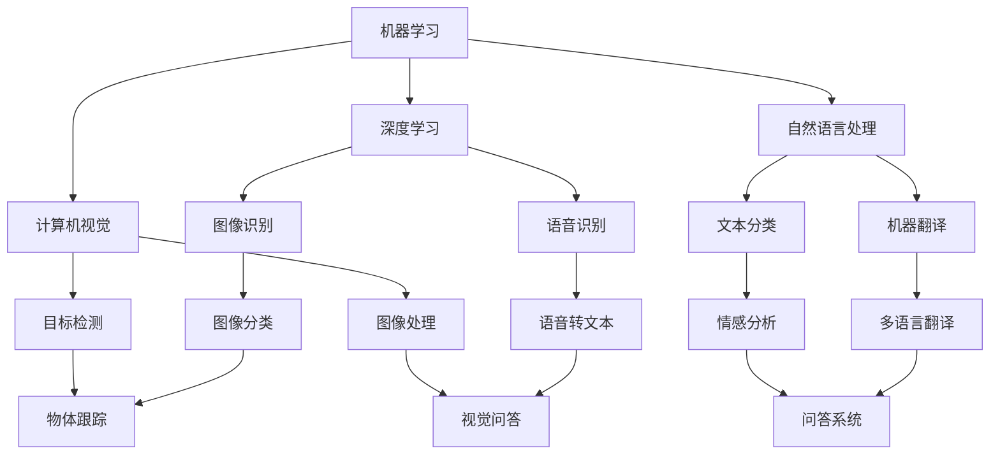

                 

# AI技术在不同领域的应用

## 1. 背景介绍

在过去的几十年里，人工智能(AI)技术飞速发展，深刻地改变了各个行业的运作方式，提高了效率，降低了成本，创造了新的商业价值。AI技术已经在医疗、金融、教育、制造业等多个领域展示了强大的应用潜力，并逐渐成为各行各业不可或缺的关键技术。本文将从多个实际案例出发，系统地探讨AI技术在不同领域的应用，并展望其未来发展趋势。

## 2. 核心概念与联系

### 2.1 核心概念概述

为了更好地理解AI技术在不同领域的应用，我们先介绍几个核心概念：

- **机器学习（Machine Learning, ML）**：通过数据训练模型，使其能够自动地从数据中学习规律，并进行预测或分类等任务。

- **深度学习（Deep Learning, DL）**：一种特殊的机器学习技术，通过多层神经网络模型来处理高维度、非线性的数据，广泛应用于图像识别、语音识别、自然语言处理等领域。

- **计算机视觉（Computer Vision, CV）**：研究如何让计算机识别和理解图像和视频中的视觉内容，实现图像处理、目标检测、人脸识别等任务。

- **自然语言处理（Natural Language Processing, NLP）**：使计算机能够理解、处理和生成人类语言的技术，包括文本分类、机器翻译、情感分析等任务。

- **机器人技术（Robotics）**：结合AI和机械工程，实现自主操作、智能决策的机器人系统。

这些核心概念构成了AI技术的基础框架，其相互交织，共同推动了AI技术在不同领域的应用和发展。

### 2.2 概念间的关系

通过以下Mermaid流程图，我们可以更好地理解这些核心概念之间的关系：



这个流程图展示了AI技术的核心概念及其在各领域的应用，揭示了AI技术的多样性和强大能力。

## 3. 核心算法原理 & 具体操作步骤

### 3.1 算法原理概述

AI技术在不同领域的应用通常遵循以下基本算法原理：

- **数据预处理**：收集和清洗数据，将其转换为机器学习模型可以处理的形式。
- **特征工程**：通过选取和变换特征，提高模型的预测准确性。
- **模型训练**：使用训练数据集训练模型，使其学习数据的规律和特征。
- **模型评估**：使用测试数据集评估模型的性能，进行调优。
- **模型部署**：将训练好的模型部署到实际应用中，进行预测或决策。

这些步骤在各个AI应用场景中都是通用的，但具体实现方式和优化策略会根据应用领域的不同而有所变化。

### 3.2 算法步骤详解

以计算机视觉中的目标检测为例，下面是具体的算法步骤：

1. **数据准备**：收集并标注图像数据集，包括正样本（目标）和负样本（背景）。
2. **模型选择**：选择适合的深度学习模型，如Faster R-CNN、YOLO等。
3. **模型训练**：使用训练集数据训练模型，调整超参数，优化损失函数。
4. **模型评估**：在验证集上评估模型性能，进行调优。
5. **模型部署**：将训练好的模型部署到实际应用中，进行目标检测。

### 3.3 算法优缺点

AI技术在不同领域的应用具有以下优点和缺点：

**优点**：
- **自动化**：减少了人工操作，提高了效率。
- **准确性**：通过机器学习模型的训练，可以提供高精度的预测或分类结果。
- **可扩展性**：AI模型可以轻松扩展到多个领域，具有广泛的应用场景。

**缺点**：
- **数据依赖**：模型性能高度依赖于训练数据的质量和数量。
- **解释性差**：许多AI模型（如深度学习模型）通常是“黑盒”，难以解释其决策过程。
- **资源消耗**：高精度AI模型需要大量的计算资源和存储空间。

### 3.4 算法应用领域

AI技术已经被广泛应用于多个领域，以下是其中几个主要应用领域：

- **医疗健康**：AI在医学影像分析、疾病预测、个性化治疗等方面具有重要应用。
- **金融服务**：AI用于风险管理、欺诈检测、客户服务等。
- **制造业**：AI用于生产优化、质量控制、供应链管理等。
- **交通运输**：AI用于自动驾驶、交通流量分析、路径规划等。
- **教育培训**：AI用于个性化推荐、智能评估、自动批改等。

## 4. 数学模型和公式 & 详细讲解 & 举例说明

### 4.1 数学模型构建

以自然语言处理中的文本分类任务为例，下面是数学模型的构建过程：

- **输入数据**：文本序列 $x=(x_1, x_2, ..., x_n)$。
- **输出数据**：标签序列 $y=(y_1, y_2, ..., y_n)$，其中 $y_i \in \{1, 2, ..., k\}$。
- **模型**：使用深度神经网络，如卷积神经网络（CNN）、循环神经网络（RNN）、长短时记忆网络（LSTM）等。
- **损失函数**：常用的损失函数包括交叉熵损失、均方误差损失等。

### 4.2 公式推导过程

以深度学习中的卷积神经网络（CNN）为例，下面是公式的推导过程：

1. **卷积层**：
   $$
   f(x;w_1, b_1) = \max_{1 \leq i \leq n} \sum_{j=1}^{m} w_{ij}x_{ij} + b_1
   $$
   其中，$x_{ij}$ 表示输入数据在卷积核 $w_{ij}$ 的作用下产生的特征图，$b_1$ 表示偏置项。

2. **池化层**：
   $$
   h = \max_{1 \leq i \leq n} \sum_{j=1}^{m} w_{ij}f(x;w_j, b_j)
   $$
   其中，$f(x;w_j, b_j)$ 表示卷积核 $w_j$ 对输入数据 $x$ 进行卷积运算后的结果，$w_{ij}$ 表示池化核。

3. **全连接层**：
   $$
   y = f(w'x + b')
   $$
   其中，$w'$ 和 $b'$ 分别表示全连接层的权重和偏置项。

### 4.3 案例分析与讲解

以谷歌的BERT为例，其通过在无标签文本数据上进行预训练，学习到丰富的语言表示，然后在下游任务上进行微调，取得了诸多NLP任务的新SOTA结果。其核心思想是将自监督学习与有监督学习结合，利用大规模数据进行预训练，增强模型的通用性。

## 5. 项目实践：代码实例和详细解释说明

### 5.1 开发环境搭建

以TensorFlow为例，下面是开发环境的搭建步骤：

1. 安装TensorFlow：
   ```
   pip install tensorflow
   ```
2. 安装GPU驱动和CUDA库：
   ```
   conda install -c pytorch torchvision torchaudio -c conda-forge
   ```
3. 安装NumPy、Pandas、Scikit-learn等库：
   ```
   pip install numpy pandas scikit-learn
   ```

### 5.2 源代码详细实现

以目标检测任务为例，下面是TensorFlow中的代码实现：

```python
import tensorflow as tf
from tensorflow.keras import layers, models

# 定义模型
model = models.Sequential([
    layers.Conv2D(32, (3, 3), activation='relu', input_shape=(224, 224, 3)),
    layers.MaxPooling2D((2, 2)),
    layers.Conv2D(64, (3, 3), activation='relu'),
    layers.MaxPooling2D((2, 2)),
    layers.Conv2D(128, (3, 3), activation='relu'),
    layers.MaxPooling2D((2, 2)),
    layers.Conv2D(128, (3, 3), activation='relu'),
    layers.MaxPooling2D((2, 2)),
    layers.Flatten(),
    layers.Dense(1024, activation='relu'),
    layers.Dense(5, activation='softmax')
])

# 编译模型
model.compile(optimizer='adam', loss='categorical_crossentropy', metrics=['accuracy'])

# 训练模型
model.fit(train_data, train_labels, epochs=10, validation_data=(val_data, val_labels))
```

### 5.3 代码解读与分析

在上述代码中，我们定义了一个简单的卷积神经网络模型，并使用`compile`方法设置优化器、损失函数和评估指标，然后使用`fit`方法进行训练。其中，`train_data`和`train_labels`是训练数据和标签，`val_data`和`val_labels`是验证数据和标签。

### 5.4 运行结果展示

训练结束后，可以通过以下代码对模型进行评估：

```python
test_loss, test_acc = model.evaluate(test_data, test_labels)
print('Test accuracy:', test_acc)
```

## 6. 实际应用场景

### 6.1 智能医疗

在医疗领域，AI技术被广泛用于疾病诊断、医疗影像分析、药物研发等方面。例如，谷歌的DeepMind公司开发了AlphaGo，通过AI算法对围棋进行了突破性的训练和应用。在医学影像分析中，AI可以帮助医生更快速、准确地诊断疾病，如肺结节、乳腺癌等。

### 6.2 智能交通

在交通领域，AI技术被用于自动驾驶、交通流量分析、路径规划等。特斯拉的Autopilot系统通过AI算法实现自动驾驶，显著提升了道路安全和效率。Google Maps使用AI算法优化路线规划，帮助用户更快地到达目的地。

### 6.3 智能制造

在制造业，AI技术用于生产优化、质量控制、供应链管理等。例如，GE公司使用AI算法优化其航空发动机设计，提高了发动机的效率和可靠性。Amazon的Kiva机器人使用AI算法进行仓库自动化，提高了仓库管理的效率和准确性。

### 6.4 未来应用展望

未来，AI技术将在更多领域得到应用，其发展方向包括：

- **多模态学习**：将视觉、听觉、触觉等多模态信息结合起来，增强模型的感知能力。
- **迁移学习**：将一个领域学到的知识迁移到另一个领域，实现知识重用，提高模型的泛化能力。
- **因果学习**：通过学习因果关系，提高模型的可解释性和鲁棒性。
- **可解释AI**：增强AI模型的可解释性，使其更容易被接受和使用。
- **联邦学习**：在分布式环境中，多个设备协同训练模型，保护数据隐私。

## 7. 工具和资源推荐

### 7.1 学习资源推荐

为了更好地学习AI技术，以下是一些推荐的学习资源：

1. 《深度学习》（Ian Goodfellow著）：全面介绍深度学习的基本概念和算法。
2. 《Python机器学习》（Sebastian Raschka著）：介绍Python在机器学习中的应用。
3. 《TensorFlow实战》（Agamemnon Krasoulis著）：介绍TensorFlow的基本用法和实际案例。
4. 《NLP实战》（Andrew Ng著）：介绍自然语言处理的基本概念和算法。
5. 《机器学习实战》（Peter Harrington著）：介绍机器学习的基本概念和算法。

### 7.2 开发工具推荐

以下是一些常用的开发工具：

1. Jupyter Notebook：用于编写和运行Python代码，支持多种数据可视化库。
2. PyTorch：基于Python的深度学习框架，支持动态计算图。
3. TensorFlow：由Google开发的深度学习框架，支持静态计算图和分布式训练。
4. Keras：高级深度学习框架，提供简单易用的API。
5. OpenCV：用于计算机视觉领域的视频处理、图像识别等任务。

### 7.3 相关论文推荐

以下是一些经典的AI相关论文：

1. "Convolutional Neural Networks for Sentence Classification"（Kaggle论文）：介绍卷积神经网络在文本分类任务中的应用。
2. "Attention is All You Need"（NeurIPS 2017论文）：介绍Transformer架构，推动了NLP领域的预训练大模型的发展。
3. "BERT: Pre-training of Deep Bidirectional Transformers for Language Understanding"（NIPS 2018论文）：介绍BERT预训练模型，显著提升了NLP任务的性能。
4. "AlphaGo Zero"（Nature 2017论文）：介绍AlphaGo Zero算法，通过自我对弈实现自动学习。
5. "DeepMind Health"（DeepMind公司报告）：介绍AI在医疗领域的应用，如疾病预测、药物研发等。

## 8. 总结：未来发展趋势与挑战

### 8.1 研究成果总结

AI技术在各个领域已经取得了显著的进展，但仍然面临诸多挑战，如数据质量、模型复杂度、可解释性等。通过不断的技术创新和实践积累，AI技术将在未来继续拓展其应用边界，提升其性能和实用性。

### 8.2 未来发展趋势

未来的AI技术将朝着以下几个方向发展：

1. **多模态学习**：将视觉、听觉、触觉等多模态信息结合起来，增强模型的感知能力。
2. **迁移学习**：将一个领域学到的知识迁移到另一个领域，实现知识重用，提高模型的泛化能力。
3. **因果学习**：通过学习因果关系，提高模型的可解释性和鲁棒性。
4. **可解释AI**：增强AI模型的可解释性，使其更容易被接受和使用。
5. **联邦学习**：在分布式环境中，多个设备协同训练模型，保护数据隐私。

### 8.3 面临的挑战

AI技术在发展过程中仍面临诸多挑战：

1. **数据质量**：AI模型的性能高度依赖于数据的质量和数量，但获取高质量的数据成本较高。
2. **模型复杂度**：高精度AI模型需要大量的计算资源和存储空间，计算成本较高。
3. **可解释性**：许多AI模型（如深度学习模型）通常是“黑盒”，难以解释其决策过程。
4. **隐私保护**：AI模型需要大量数据进行训练，但数据隐私问题亟待解决。
5. **伦理道德**：AI模型的应用过程中，如何避免偏见、歧视等问题，需要进一步研究和规范。

### 8.4 研究展望

未来的AI研究将需要解决这些挑战，推动AI技术在更多领域的应用：

1. **数据增强**：通过数据增强技术，提升数据质量和数量，减少对标注数据的依赖。
2. **模型压缩**：通过模型压缩技术，降低模型的计算和存储成本，提高模型的部署效率。
3. **模型解释**：通过模型解释技术，增强AI模型的可解释性，使其更容易被接受和使用。
4. **隐私保护**：通过联邦学习等技术，保护数据隐私，确保数据安全。
5. **伦理规范**：制定AI技术的伦理规范，避免偏见、歧视等问题，确保AI技术的公平性和公正性。

## 9. 附录：常见问题与解答

**Q1：AI技术是否需要大量标注数据？**

A: 是的，AI模型需要大量的标注数据进行训练，标注数据的质量和数量对模型的性能有着重要影响。

**Q2：AI技术是否适用于所有行业？**

A: 是的，AI技术可以应用于各种行业，包括医疗、金融、教育、制造等，但其应用方式和效果会根据具体行业和应用场景的不同而有所变化。

**Q3：AI技术的核心是什么？**

A: AI技术的核心是机器学习和深度学习，通过数据训练模型，使其能够自动地从数据中学习规律，并进行预测或分类等任务。

**Q4：AI技术有哪些优势和劣势？**

A: AI技术的优势包括自动化、准确性和可扩展性，但劣势包括数据依赖、解释性差和资源消耗。

**Q5：AI技术的未来发展方向是什么？**

A: AI技术的未来发展方向包括多模态学习、迁移学习、因果学习、可解释AI和联邦学习。

作者：禅与计算机程序设计艺术 / Zen and the Art of Computer Programming

