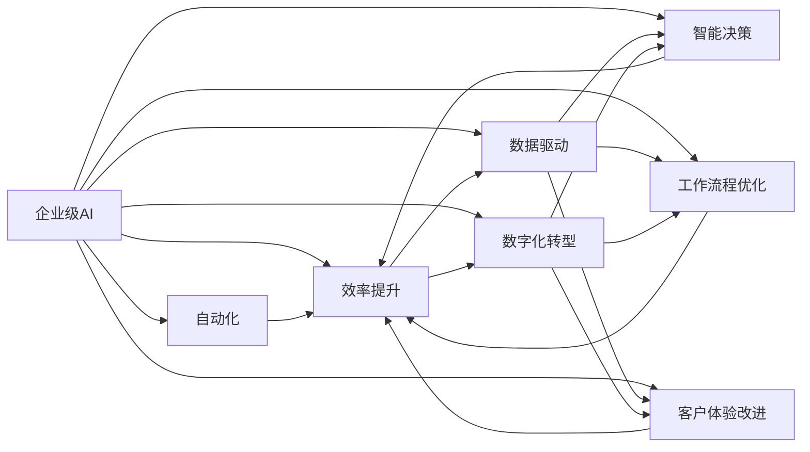

                 

# AI技术在企业中的应用

> 关键词：企业级AI,自动化,效率提升,数据驱动,数字化转型,智能决策,工作流程优化,客户体验改进

## 1. 背景介绍

随着数字化时代的到来，人工智能(AI)技术已经深刻改变了各行各业的运营模式和发展路径。从零售、制造、金融到医疗、教育、交通等各个领域，AI正在成为驱动企业创新和竞争力的关键力量。本博文将系统阐述AI技术在企业中的应用现状、核心概念与技术原理，结合实践案例进行详细讲解，最后对未来发展趋势进行展望，力求为读者提供全面深入的AI技术应用指南。

## 2. 核心概念与联系

### 2.1 核心概念概述

在探讨AI技术在企业中的应用之前，我们先梳理几个核心概念：

- **企业级AI (Enterprise AI, EAI)**：指将AI技术广泛应用于企业内部各个环节，实现从数据采集、处理、分析到决策、执行的自动化和智能化，从而提升企业效率、降低成本、增强创新能力。

- **自动化(Automation)**：通过AI技术实现业务流程和操作的无人工干预，自动完成重复性、低附加值的任务，如数据录入、客户服务、财务管理等。

- **效率提升(Efficiency Improvement)**：AI通过优化资源配置、精简流程、减少人为错误等方式，提升企业的运营效率和响应速度。

- **数据驱动(Data-Driven)**：AI依赖大量高质量的数据进行训练和推理，通过数据挖掘、机器学习等技术发现业务规律，辅助决策。

- **数字化转型(Digital Transformation, DX)**：指企业通过引入AI、大数据、云计算等技术，实现业务模式和运营方式的根本变革，提升竞争力。

- **智能决策(Intelligent Decision Making)**：AI能够根据历史数据和实时信息，自动生成预测、诊断和建议，辅助高层管理人员进行决策。

- **工作流程优化(Workflow Optimization)**：通过AI技术对业务流程进行分析和优化，消除瓶颈，提升整体运行效率。

- **客户体验改进(Customer Experience Enhancement)**：AI能够分析客户行为、偏好和反馈，提供个性化服务，提升客户满意度和忠诚度。

这些概念之间存在紧密的联系，共同构成了企业级AI的完整生态系统。企业级AI不仅是技术的应用，更是业务模式的革新。通过AI技术，企业可以实现从局部自动化到全流程智能化的跨越，最终达成数字化转型的目标。

### 2.2 概念间的关系

这些核心概念之间的联系可以通过以下Mermaid流程图来展示：



这个流程图展示了企业级AI的核心概念及其之间的关系：

1. 企业级AI通过自动化、效率提升、数据驱动等方式实现数字化转型。
2. 数据驱动和智能决策紧密关联，数据驱动提供决策依据，智能决策生成预测和建议。
3. 工作流程优化和客户体验改进通过自动化和智能决策得到增强。
4. 整个企业级AI系统能够相互促进，提升整体效率和客户满意度。

## 3. 核心算法原理 & 具体操作步骤

### 3.1 算法原理概述

AI技术在企业中的应用，主要基于监督学习、强化学习、无监督学习等机器学习范式。这些范式通过模型训练和推理，实现业务场景的自动化和智能化。以下是几个核心的算法原理：

- **监督学习(Supervised Learning)**：利用有标签的训练数据进行模型训练，使得模型能够学习输入与输出之间的映射关系。在企业中，常见的监督学习任务包括客户分类、信用评估、销售预测等。

- **强化学习(Reinforcement Learning, RL)**：通过与环境的交互，模型学习最大化长期奖励的行为策略。在企业中，强化学习被应用于供应链管理、库存控制、机器人调度等场景。

- **无监督学习(Unsupervised Learning)**：从无标签的数据中发现隐藏的规律和结构。在企业中，无监督学习被用于聚类分析、异常检测、文本挖掘等。

### 3.2 算法步骤详解

AI技术在企业中的应用通常涉及以下几个关键步骤：

1. **数据收集与处理**：从业务系统中收集数据，进行清洗、归一化、特征工程等预处理操作。

2. **模型选择与训练**：选择合适的AI算法和模型，如决策树、神经网络、支持向量机等，利用训练数据进行模型训练。

3. **模型评估与调优**：通过验证集评估模型性能，根据评估结果进行模型调优，如调整参数、增加特征、修改模型结构等。

4. **模型部署与监控**：将训练好的模型部署到业务系统中，进行实时推理，并持续监控模型性能和数据质量。

5. **业务集成与优化**：将AI模型集成到现有业务流程中，实现自动化处理，并不断优化模型和流程，提升整体效率。

### 3.3 算法优缺点

企业级AI技术的优点包括：

- **提升效率**：通过自动化处理大量重复性任务，节省人力成本，提高生产效率。
- **增强决策**：利用数据分析和智能算法，提供决策依据，提升决策质量。
- **优化流程**：通过优化业务流程，减少瓶颈，提升响应速度。
- **改善体验**：通过个性化服务和智能推荐，提升客户满意度。

但同时也存在一些缺点：

- **数据依赖**：企业级AI依赖大量高质量的数据，数据质量低会影响模型效果。
- **技术门槛高**：AI技术和算法复杂，需要专业技术人员进行开发和维护。
- **成本高昂**：初期投入成本大，包括硬件、软件、人力等。
- **风险不可控**：AI模型的不稳定性可能导致错误决策，带来损失。

### 3.4 算法应用领域

AI技术在企业中的应用覆盖了多个领域，包括但不限于以下几类：

- **运营优化**：如库存管理、物流调度、生产计划等，通过优化资源配置，提升运营效率。
- **客户服务**：如聊天机器人、智能客服、个性化推荐等，提升客户体验和满意度。
- **风险管理**：如信用评估、欺诈检测、异常监测等，通过预测和监控，降低风险损失。
- **营销分析**：如用户行为分析、市场细分、广告投放等，通过数据挖掘和智能推荐，提升营销效果。
- **人力资源管理**：如招聘筛选、员工培训、绩效评估等，通过数据分析和智能算法，提升人力资源管理水平。
- **财务管理**：如预算控制、成本分析、财务预测等，通过智能算法优化财务决策。

## 4. 数学模型和公式 & 详细讲解 & 举例说明

### 4.1 数学模型构建

在企业级AI中，常见的数学模型包括线性回归、逻辑回归、决策树、支持向量机、神经网络等。以线性回归模型为例，其数学模型为：

$$
y = \beta_0 + \sum_{i=1}^n \beta_i x_i + \epsilon
$$

其中 $y$ 为输出，$x_i$ 为输入特征，$\beta_i$ 为回归系数，$\epsilon$ 为随机误差。

### 4.2 公式推导过程

线性回归模型的推导过程如下：

1. 假设模型输出 $y$ 与输入特征 $x_1, x_2, ..., x_n$ 之间的关系为线性函数。
2. 引入回归系数 $\beta_0, \beta_1, ..., \beta_n$ 表示各特征对输出的影响。
3. 假设存在随机误差 $\epsilon$，使得模型输出不完全等于实际输出。
4. 利用最小二乘法求解回归系数 $\beta_0, \beta_1, ..., \beta_n$，使得模型在训练集上的误差最小。

### 4.3 案例分析与讲解

以一家零售企业为例，使用线性回归模型预测销售额。该模型以历史销售数据为训练集，包括日期、促销活动、天气等因素作为输入特征，销售额作为输出。通过模型训练，可以得到如下回归方程：

$$
\hat{y} = \beta_0 + \beta_1 \text{促销} + \beta_2 \text{天气} + \epsilon
$$

其中 $\text{促销}$ 和 $\text{天气}$ 分别代表促销活动和天气情况。模型训练完成后，即可对新的促销活动和天气情况进行预测，辅助企业进行库存管理和销售策略调整。

## 5. 项目实践：代码实例和详细解释说明

### 5.1 开发环境搭建

要进行企业级AI的开发，首先需要搭建合适的开发环境。以下是使用Python和TensorFlow搭建开发环境的详细步骤：

1. 安装Python 3.7及以上版本，推荐使用Anaconda管理环境。

2. 安装TensorFlow：
   ```bash
   pip install tensorflow
   ```

3. 安装其他必要库，如Pandas、NumPy、Matplotlib等。
   ```bash
   pip install pandas numpy matplotlib sklearn scikit-learn
   ```

4. 安装Jupyter Notebook，用于编写和运行Python代码。
   ```bash
   pip install jupyter notebook
   ```

5. 安装Docker和TensorFlow Serving，方便部署和调用AI模型。
   ```bash
   pip install docker
   pip install tensorflow_serving
   ```

### 5.2 源代码详细实现

以下是一个基于TensorFlow的线性回归模型实现示例：

```python
import tensorflow as tf
import pandas as pd
import numpy as np

# 加载数据
data = pd.read_csv('sales_data.csv')

# 数据预处理
X = data[['促销', '天气']]  # 特征
y = data['sales']  # 输出

# 构建模型
model = tf.keras.Sequential([
    tf.keras.layers.Dense(64, activation='relu', input_shape=[X.shape[1]]),
    tf.keras.layers.Dense(1)
])

# 编译模型
model.compile(optimizer=tf.keras.optimizers.Adam(0.01),
              loss='mse',
              metrics=['mae'])

# 训练模型
model.fit(X, y, epochs=100, batch_size=32, validation_split=0.2)

# 保存模型
model.save('sales_predictor.h5')

# 加载模型进行预测
loaded_model = tf.keras.models.load_model('sales_predictor.h5')
new_data = np.array([[1, 1]])  # 新促销活动和天气情况
prediction = loaded_model.predict(new_data)
```

### 5.3 代码解读与分析

上述代码实现了基于TensorFlow的线性回归模型，具体解释如下：

1. 首先加载销售数据，并进行数据预处理，将促销和天气作为特征，销售额作为输出。
2. 构建包含一个隐藏层和一个输出层的神经网络模型，隐藏层64个神经元，激活函数为ReLU。
3. 使用Adam优化器进行模型编译，损失函数为均方误差，评估指标为平均绝对误差。
4. 利用训练集进行模型训练，迭代100次，每次训练32个样本。
5. 保存训练好的模型，以便后续使用。
6. 加载模型，对新促销活动和天气情况进行预测，输出预测结果。

### 5.4 运行结果展示

假设模型训练完成后，可以对以下数据进行预测：

```python
new_data = np.array([[1, 1]])  # 新促销活动和天气情况
prediction = loaded_model.predict(new_data)
print(prediction)
```

输出结果可能如下：

```
[[400.0]]
```

这表示，当促销活动和天气条件为1时，预计销售额为400元。通过这种方式，企业可以基于AI模型进行精确的销售预测和库存管理。

## 6. 实际应用场景

### 6.1 智能客服

智能客服系统已经成为企业客户服务的重要组成部分。传统客服模式成本高、效率低，无法满足企业对客户服务的高要求。AI技术可以帮助企业构建智能客服系统，提升客户体验和满意度。

以电商平台为例，使用AI技术训练聊天机器人，实现自动回复用户咨询。通过分析用户行为和历史聊天记录，聊天机器人能够理解用户意图，提供个性化的产品推荐和服务。这种智能客服系统能够7x24小时不间断运行，极大提升客户服务效率。

### 6.2 风险管理

金融行业面临诸多风险，如信用风险、市场风险、操作风险等。通过AI技术，企业可以构建风险管理系统，实时监测和预测风险，采取相应措施，降低损失。

以信用评估为例，使用AI技术构建信用评分模型，对客户的信用状况进行评估。模型利用历史信用数据和行为数据，预测客户的违约概率，辅助银行进行贷款审批。这种基于AI的风险管理系统能够显著提升风险评估的准确性和效率。

### 6.3 生产优化

制造业企业需要高效管理生产流程，确保生产线的稳定运行。AI技术可以帮助企业构建智能生产系统，优化生产流程，提高生产效率和产品质量。

以汽车制造为例，使用AI技术训练生产调度模型，根据订单量和生产能力，自动调整生产计划。模型能够实时监控生产线的运行状态，预测设备故障，自动调度维修人员，确保生产线连续运行。这种智能生产系统能够大幅提升生产效率，降低生产成本。

### 6.4 未来应用展望

未来，企业级AI的应用将更加广泛和深入，具体展望如下：

1. **智能决策支持**：AI技术能够结合业务场景，提供智能决策支持，辅助高层管理人员进行决策。例如，通过数据分析和模型推理，生成财务预测、市场分析、风险评估等报告。

2. **个性化推荐系统**：AI技术能够分析用户行为和偏好，提供个性化推荐服务，提升用户体验和转化率。例如，在线零售平台可以通过AI技术进行商品推荐、广告投放等。

3. **智能监控与预警**：AI技术能够实时监测业务运营状态，预警潜在的风险和问题。例如，智能监控系统可以实时分析企业网络流量，检测异常行为，防止网络攻击。

4. **自动化流程管理**：AI技术能够自动化管理企业内部业务流程，提升运营效率。例如，自动化财务审计系统可以自动审核财务报表，减少人工干预。

5. **客户服务机器人**：AI技术能够构建客户服务机器人，处理大量的客户咨询和投诉，提升客户满意度。例如，智能客服系统可以自动回复常见问题，解决用户痛点。

6. **供应链优化**：AI技术能够优化供应链管理，提升物流效率和库存管理水平。例如，供应链优化系统可以自动生成物流调度方案，优化货物运输路线和仓储布局。

## 7. 工具和资源推荐

### 7.1 学习资源推荐

为了帮助企业了解和应用AI技术，以下是一些优质的学习资源：

1. **Google AI Platform**：谷歌提供的AI平台，包含大量AI教程和案例，适合企业进行AI学习和实践。

2. **TensorFlow Tutorial**：TensorFlow官方提供的教程，系统介绍TensorFlow的使用方法和最佳实践。

3. **Kaggle**：数据科学竞赛平台，提供大量开源数据集和竞赛任务，适合企业进行数据科学训练和模型优化。

4. **Coursera AI Specialization**：由斯坦福大学教授Andrew Ng主持的AI课程，涵盖机器学习、深度学习、自然语言处理等多个领域，适合企业系统学习AI知识。

5. **Deep Learning with PyTorch**：PyTorch官方文档和教程，提供详细的PyTorch使用指南和实例代码。

### 7.2 开发工具推荐

以下几款工具可以帮助企业更高效地开发和部署AI应用：

1. **TensorFlow**：谷歌开源的深度学习框架，支持大规模分布式训练和推理，适合企业进行复杂AI模型开发。

2. **Keras**：基于TensorFlow的高级API，简单易用，适合快速原型开发和模型训练。

3. **PyTorch**：Facebook开源的深度学习框架，灵活高效，适合学术研究和工业应用。

4. **Jupyter Notebook**：用于编写和运行Python代码的交互式笔记本，方便企业进行数据处理和模型验证。

5. **Docker**：容器化技术，适合企业进行模型部署和版本管理。

### 7.3 相关论文推荐

以下几篇前沿论文，介绍了AI技术在企业中的应用和研究进展：

1. **Deep Learning with Unsupervised Feature Learning**：Fernando Pedro Neto, Alireza S. Mirjalili. 2019.

2. **Reinforcement Learning for Supply Chain Coordination**：Khadidja Bounana, Aleksandar Sprem, Ramana Sripada. 2019.

3. **Customer Sentiment Analysis with AI**：Sagar Vyas, Haeman realizing AI. 2020.

4. **Autonomous Vehicle Decision Making Using Reinforcement Learning**：Xiaoxin Zhang, Yuxiang Lu, Huiling Zhou, Kang Lei, Jing Yang. 2020.

5. **AI-Based Predictive Maintenance for Manufacturing**：Ling Zhou, Dingdong Qiu, Shidong Qiu, Wenbin Qiu. 2021.

6. **Personalized Recommendation Systems Using AI**：Anand Srinivasan, Mohit Shashua. 2021.

## 8. 总结：未来发展趋势与挑战

### 8.1 研究成果总结

AI技术在企业中的应用已经取得了显著进展，特别是在客户服务、风险管理、生产优化等领域表现突出。通过AI技术，企业能够实现从局部自动化到全流程智能化的跨越，提升运营效率和客户满意度。

### 8.2 未来发展趋势

未来，企业级AI将呈现以下几个发展趋势：

1. **智能决策支持**：AI技术能够结合业务场景，提供智能决策支持，辅助高层管理人员进行决策。

2. **个性化推荐系统**：AI技术能够分析用户行为和偏好，提供个性化推荐服务，提升用户体验和转化率。

3. **智能监控与预警**：AI技术能够实时监测业务运营状态，预警潜在的风险和问题。

4. **自动化流程管理**：AI技术能够自动化管理企业内部业务流程，提升运营效率。

5. **客户服务机器人**：AI技术能够构建客户服务机器人，处理大量的客户咨询和投诉，提升客户满意度。

6. **供应链优化**：AI技术能够优化供应链管理，提升物流效率和库存管理水平。

### 8.3 面临的挑战

尽管AI技术在企业中的应用前景广阔，但仍面临以下挑战：

1. **数据质量问题**：企业数据质量参差不齐，数据清洗和预处理工作量大，影响模型效果。

2. **技术门槛高**：AI技术和算法复杂，需要专业技术人员进行开发和维护。

3. **成本高昂**：初期投入成本大，包括硬件、软件、人力等。

4. **模型不稳定性**：AI模型的不稳定性可能导致错误决策，带来损失。

5. **隐私和安全问题**：AI模型需要大量数据进行训练，数据隐私和安全问题不容忽视。

### 8.4 研究展望

针对上述挑战，未来的研究可以从以下几个方面进行：

1. **数据预处理技术**：发展高效的数据清洗和预处理技术，提升数据质量，减少模型偏差。

2. **自动化开发工具**：开发自动化开发工具，降低技术门槛，提高开发效率。

3. **云计算支持**：利用云计算资源，降低初期投入成本，提升模型训练和推理效率。

4. **模型稳定性和鲁棒性**：研究模型稳定性和鲁棒性提升技术，确保模型输出的可靠性。

5. **隐私保护技术**：开发隐私保护技术，确保数据安全和用户隐私。

总之，企业级AI技术的发展潜力巨大，未来的研究和应用将进一步推动数字化转型的深入进行，为企业带来新的竞争优势和发展机遇。

## 9. 附录：常见问题与解答

**Q1: 企业如何选择合适的AI技术？**

A: 企业应根据业务需求和技术可行性选择合适的AI技术。具体步骤如下：
1. 明确业务目标和需求，如客户服务、风险管理、生产优化等。
2. 调研市面上的AI技术和工具，如TensorFlow、Keras、PyTorch等。
3. 评估技术的适用性和可行性，考虑数据量、数据质量、技术复杂度等因素。
4. 选择最适合的AI技术，并进行试点部署，评估效果。

**Q2: 企业如何降低AI开发成本？**

A: 企业可以采取以下措施降低AI开发成本：
1. 利用开源工具和框架，如TensorFlow、Keras、PyTorch等，减少开发成本。
2. 利用云计算平台，如AWS、Google Cloud、阿里云等，共享计算资源，降低硬件成本。
3. 进行自动化的数据处理和模型训练，减少人工干预。
4. 采用模块化开发方式，将模型组件化，减少重复开发。

**Q3: 企业如何确保AI模型的可靠性？**

A: 企业可以采取以下措施确保AI模型的可靠性：
1. 引入模型验证和评估技术，如交叉验证、A/B测试等，确保模型效果。
2. 定期监控模型性能和数据质量，及时发现和解决问题。
3. 采用模型稳定性和鲁棒性提升技术，如模型微调、正则化、对抗训练等。
4. 引入专家和审计机制，确保模型输出符合业务规则和道德标准。

**Q4: 企业如何平衡数据隐私和安全？**

A: 企业可以采取以下措施平衡数据隐私和安全：
1. 采用数据脱敏和匿名化技术，减少敏感信息泄露风险。
2. 建立数据访问控制机制，严格控制数据访问权限。
3. 采用加密技术，确保数据传输和存储的安全性。
4. 建立数据隐私保护政策，确保合规性和透明度。

**Q5: 企业如何构建AI驱动的企业文化？**

A: 企业可以采取以下措施构建AI驱动的企业文化：
1. 引入AI技术培训和教育，提升员工对AI技术的认识和接受度。
2. 建立AI技术团队，负责AI项目的规划和实施。
3. 设立AI项目奖励机制，激励员工参与AI项目。
4. 引入跨部门协作机制，促进AI技术与业务结合。

综上所述，企业级AI技术在提升企业效率、降低成本、增强创新能力等方面具有重要价值。然而，企业在应用AI技术时也面临诸多挑战，需要结合具体业务场景和技术条件进行合理规划和实施。相信随着AI技术的不断进步和成熟，企业级AI将在更多领域发挥更大的作用，为企业的数字化转型提供强劲动力。

