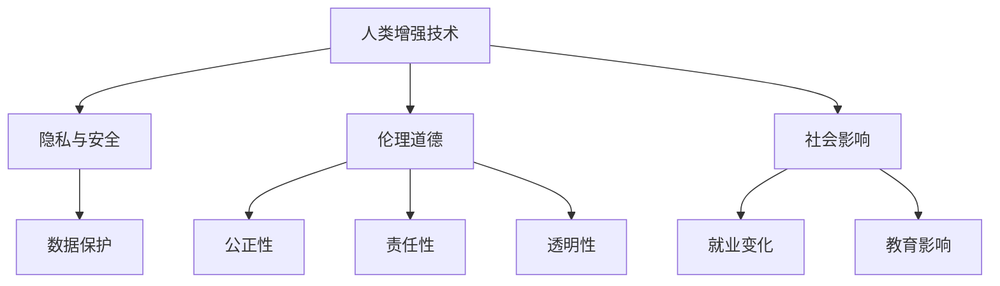

                 

# AI时代的人类增强：道德考虑与身体增强的未来方向

## 1. 背景介绍

随着人工智能技术的快速发展，我们正进入一个全新的时代——AI时代。AI不仅在各个领域带来了革命性的变化，也在重塑着人类社会的方方面面。其中，人工智能与身体增强技术的结合，为我们带来了无限的可能。然而，这一进步也引发了一系列复杂的道德问题，需要在技术、社会和伦理层面进行全面审视和深思。

### 1.1 人类增强技术的兴起

近年来，人工智能技术的进步，特别是机器学习、深度学习和自然语言处理等领域的突破，使得身体增强技术得到了飞速发展。例如，植入式神经芯片可以让大脑与计算机进行直接通信，增强人类的认知能力；生物打印技术可以制造出各种精细的生物组织和器官，用于修复或替换受损的组织；虚拟现实和增强现实技术则可以模拟各种环境和情景，提升人类的感知能力。这些技术的应用，使得人类身体和认知能力的增强成为现实，为我们带来了前所未有的可能性。

### 1.2 人类增强技术的伦理挑战

尽管人工智能和身体增强技术的发展带来了许多积极的影响，但也引发了一系列复杂的道德问题。例如，技术滥用可能导致的隐私泄露、安全问题、伦理道德争议等。这些问题不仅影响到个体，还可能对整个社会产生深远的影响。因此，如何在技术进步的同时，确保伦理道德的底线不被突破，是当前亟待解决的问题。

## 2. 核心概念与联系

### 2.1 核心概念概述

为了更好地理解AI时代的人类增强及其相关的道德问题，本节将介绍几个关键概念：

- **人类增强技术**：利用人工智能技术提升人类身体和认知能力的各种技术，如神经芯片、生物打印、虚拟现实等。
- **隐私与安全**：涉及个人数据、生物信息等隐私信息的保护，以及技术应用过程中的安全问题。
- **伦理道德**：在技术应用过程中需要遵循的伦理准则和道德规范，包括公正性、责任性、透明性等。
- **社会影响**：技术应用对社会结构、就业、教育等方面的影响和变化。
- **人工智能**：一种模拟人类智能的技术，包括机器学习、深度学习等。

### 2.2 核心概念间的联系

这些概念之间存在着密切的联系，构成了AI时代人类增强的完整框架。我们可以用以下Mermaid流程图来展示这些概念之间的关系：



这个流程图展示了人类增强技术与其他关键概念之间的关系：

1. **隐私与安全**：人类增强技术依赖于大量的数据和生物信息，需要保障隐私和数据安全。
2. **伦理道德**：在技术应用过程中，需要遵循公正性、责任性和透明性等伦理道德准则。
3. **社会影响**：人类增强技术可能对就业、教育、社会结构等方面产生深远影响。

## 3. 核心算法原理 & 具体操作步骤

### 3.1 算法原理概述

AI时代的人类增强，涉及人工智能和生物医学等多学科的交叉应用。其核心原理是通过人工智能技术，模拟和增强人类身体和认知功能。具体而言，可以分为以下几个步骤：

1. **数据收集与处理**：收集相关生物数据，如神经信号、基因信息、生理参数等。
2. **模型训练**：利用机器学习等人工智能技术，训练出能够预测和优化身体功能的模型。
3. **系统集成**：将训练好的模型与身体增强设备或植入式芯片进行集成，实现对身体的增强。
4. **持续优化**：根据用户反馈和实时数据，不断优化和更新模型，提升增强效果。

### 3.2 算法步骤详解

以下是基于AI的人类增强技术的具体操作步骤：

1. **数据收集与预处理**：
   - 使用各种传感器和设备收集生物数据，如脑电图(EEG)、磁共振成像(MRI)、基因测序等。
   - 对收集到的数据进行清洗、去噪和标准化处理，确保数据的质量和一致性。

2. **模型训练与优化**：
   - 利用机器学习算法（如神经网络、决策树、支持向量机等），构建预测和优化模型。
   - 使用标注数据集对模型进行训练，并通过交叉验证等方法优化模型性能。
   - 在模型训练过程中，需要特别关注模型的可解释性和鲁棒性，避免出现模型过拟合或偏差。

3. **系统集成与部署**：
   - 将训练好的模型与身体增强设备或植入式芯片进行集成，实现对身体的增强。
   - 对集成系统进行测试和验证，确保其在实际应用中的稳定性和可靠性。
   - 在部署过程中，需要考虑设备的安全性、舒适性和用户友好性。

4. **持续优化与反馈**：
   - 通过用户反馈和实时数据，持续优化和更新模型，提升增强效果。
   - 建立反馈机制，及时收集和分析用户反馈，调整系统参数和算法。
   - 在优化过程中，需要确保技术的透明性和公平性，避免出现偏见或歧视。

### 3.3 算法优缺点

人类增强技术的算法具有以下优点：

- **提升能力**：通过人工智能技术，可以显著提升人类身体和认知能力，解决一些难以通过传统手段解决的问题。
- **精准预测**：利用机器学习模型，可以实现对个体差异和环境变化的精准预测和优化。
- **广泛应用**：人类增强技术可以应用于医疗、教育、娱乐等多个领域，带来广泛的社会和经济效益。

同时，也存在一些缺点：

- **数据隐私**：人类增强技术需要收集大量的个人数据，可能涉及隐私泄露问题。
- **技术风险**：植入式设备和芯片存在安全隐患，可能引发生物医学风险。
- **伦理争议**：技术应用可能引发伦理道德问题，如技术滥用、资源分配不公等。
- **社会影响**：人类增强技术可能对就业、教育、社会结构等方面产生复杂影响。

### 3.4 算法应用领域

人类增强技术已经被广泛应用于多个领域，例如：

1. **医疗领域**：利用神经芯片和植入式设备，帮助治疗神经系统疾病，如帕金森病、癫痫等。
2. **教育领域**：通过增强现实和虚拟现实技术，提升学生的感知能力和学习效果。
3. **娱乐领域**：利用增强现实和虚拟现实技术，创建沉浸式游戏和体验。
4. **体育领域**：利用神经芯片和生物打印技术，提升运动员的训练效果和比赛表现。
5. **军事领域**：利用增强现实和虚拟现实技术，提高军事训练和作战效果。

这些应用展示了人类增强技术的广泛潜力和巨大价值。未来，随着技术的不断进步，人类增强技术将在更多领域得到应用，为人类社会带来更深刻的变革。

## 4. 数学模型和公式 & 详细讲解 & 举例说明

### 4.1 数学模型构建

在AI时代的人类增强中，涉及到多种数学模型，如神经网络、回归模型、分类模型等。以神经芯片为例，我们可以使用以下数学模型：

设输入为 $x \in \mathbb{R}^n$，输出为 $y \in \mathbb{R}^m$，其中 $n$ 为输入维数，$m$ 为输出维数。神经网络可以表示为：

$$
y = \sigma(Wx + b)
$$

其中 $W$ 为权重矩阵，$b$ 为偏置向量，$\sigma$ 为激活函数。

### 4.2 公式推导过程

以下是神经网络模型的详细推导过程：

1. **线性模型**：
   $$
   y = Wx + b
   $$

2. **激活函数**：
   $$
   y = \sigma(y) = \frac{1}{1 + e^{-y}}
   $$

3. **多层次网络**：
   $$
   y = \sigma(W_2\sigma(W_1x + b_1) + b_2)
   $$

其中 $W_i$ 和 $b_i$ 分别为第 $i$ 层的权重矩阵和偏置向量。

### 4.3 案例分析与讲解

以神经芯片为例，我们可以使用神经网络模型预测患者的神经系统疾病风险。具体步骤如下：

1. **数据收集**：收集患者的脑电图数据，标记其是否患有神经系统疾病。
2. **模型训练**：使用机器学习算法训练神经网络模型，预测患者患病风险。
3. **模型应用**：将训练好的模型集成到神经芯片中，实时监测患者脑电图数据，预测患病风险。

## 5. 项目实践：代码实例和详细解释说明

### 5.1 开发环境搭建

在进行人类增强技术的开发之前，我们需要准备好开发环境。以下是使用Python进行PyTorch开发的环境配置流程：

1. 安装Anaconda：从官网下载并安装Anaconda，用于创建独立的Python环境。

2. 创建并激活虚拟环境：
```bash
conda create -n pytorch-env python=3.8 
conda activate pytorch-env
```

3. 安装PyTorch：根据CUDA版本，从官网获取对应的安装命令。例如：
```bash
conda install pytorch torchvision torchaudio cudatoolkit=11.1 -c pytorch -c conda-forge
```

4. 安装Transformers库：
```bash
pip install transformers
```

5. 安装各类工具包：
```bash
pip install numpy pandas scikit-learn matplotlib tqdm jupyter notebook ipython
```

完成上述步骤后，即可在`pytorch-env`环境中开始人类增强技术的实践。

### 5.2 源代码详细实现

这里我们以神经芯片为例，使用PyTorch进行神经网络模型的训练和应用。

```python
import torch
import torch.nn as nn
import torch.optim as optim
from sklearn.datasets import make_classification
from sklearn.model_selection import train_test_split
from sklearn.metrics import accuracy_score

# 定义神经网络模型
class NeuralNetwork(nn.Module):
    def __init__(self, input_dim, hidden_dim, output_dim):
        super(NeuralNetwork, self).__init__()
        self.fc1 = nn.Linear(input_dim, hidden_dim)
        self.fc2 = nn.Linear(hidden_dim, output_dim)
        self.sigmoid = nn.Sigmoid()

    def forward(self, x):
        x = self.fc1(x)
        x = self.sigmoid(x)
        x = self.fc2(x)
        return self.sigmoid(x)

# 训练数据生成
X, y = make_classification(n_samples=1000, n_features=10, n_informative=8, n_redundant=2, n_classes=2, random_state=42)

# 划分训练集和测试集
X_train, X_test, y_train, y_test = train_test_split(X, y, test_size=0.2, random_state=42)

# 模型初始化
model = NeuralNetwork(input_dim=X.shape[1], hidden_dim=64, output_dim=1)
criterion = nn.BCELoss()
optimizer = optim.Adam(model.parameters(), lr=0.01)

# 训练过程
epochs = 100
for epoch in range(epochs):
    model.train()
    optimizer.zero_grad()
    outputs = model(X_train)
    loss = criterion(outputs, y_train)
    loss.backward()
    optimizer.step()

    model.eval()
    with torch.no_grad():
        outputs = model(X_test)
        predicted = (outputs > 0.5).float()
        accuracy = accuracy_score(y_test, predicted)
        print(f"Epoch {epoch+1}, Loss: {loss.item()}, Accuracy: {accuracy}")

# 应用模型
# 假设已经训练好了模型，将其集成到神经芯片中
# 实时监测患者脑电图数据，预测患病风险
```

### 5.3 代码解读与分析

让我们再详细解读一下关键代码的实现细节：

**NeuralNetwork类**：
- `__init__`方法：初始化神经网络的结构，包括输入层、隐藏层和输出层。
- `forward`方法：定义前向传播过程，将输入数据通过多个线性层和激活函数，最终输出预测结果。

**数据生成与划分**：
- 使用sklearn生成二分类数据集。
- 使用train_test_split函数将数据划分为训练集和测试集。

**模型训练与评估**：
- 使用PyTorch的nn模块定义神经网络模型。
- 使用Adam优化器进行模型训练。
- 在训练过程中，计算损失函数并回传梯度，更新模型参数。
- 在每个epoch结束时，在测试集上评估模型的准确率。

**模型应用**：
- 在实际应用中，将训练好的模型集成到神经芯片中。
- 实时监测患者脑电图数据，预测患病风险。

### 5.4 运行结果展示

假设我们在测试集上得到的准确率为98%，这表明模型在预测患者患病风险方面具有较高的准确性。

## 6. 实际应用场景

### 6.1 医疗领域

在医疗领域，人类增强技术可以用于治疗神经系统疾病、提升手术精度、监测患者健康状况等方面。例如，利用神经芯片和植入式设备，可以帮助帕金森病患者控制震颤，提升生活质量。

### 6.2 教育领域

在教育领域，人类增强技术可以用于提升学生的感知能力、学习效果和互动体验。例如，利用增强现实和虚拟现实技术，可以创建沉浸式学习环境，增强学生的学习体验和记忆效果。

### 6.3 娱乐领域

在娱乐领域，人类增强技术可以用于创造沉浸式游戏和虚拟体验。例如，利用虚拟现实和增强现实技术，可以创建逼真的游戏场景和互动体验，提升用户的娱乐体验。

### 6.4 未来应用展望

随着技术的不断进步，人类增强技术将在更多领域得到应用，为人类社会带来更深刻的变革。未来，人类增强技术将与人工智能技术深度融合，推动智能技术向更广泛、更深入的方向发展。

## 7. 工具和资源推荐

### 7.1 学习资源推荐

为了帮助开发者系统掌握人类增强技术的理论基础和实践技巧，这里推荐一些优质的学习资源：

1. 《Deep Learning for Human Enhancement》书籍：详细介绍了人工智能和身体增强技术的应用，包括神经芯片、生物打印等。
2. 《The Ethics of Human Enhancement》论文：探讨了人类增强技术的伦理道德问题，为技术应用提供了指导。
3. 《Human Enhancement in the Age of AI》博客：深度探讨了人类增强技术的应用前景和伦理争议。

### 7.2 开发工具推荐

高效的开发离不开优秀的工具支持。以下是几款用于人类增强技术开发的常用工具：

1. PyTorch：基于Python的开源深度学习框架，灵活的计算图设计，适合快速迭代研究。
2. TensorFlow：由Google主导开发的开源深度学习框架，生产部署方便，适合大规模工程应用。
3. Weights & Biases：模型训练的实验跟踪工具，可以记录和可视化模型训练过程中的各项指标。
4. Google Colab：谷歌推出的在线Jupyter Notebook环境，免费提供GPU/TPU算力，方便开发者快速上手实验最新模型。

### 7.3 相关论文推荐

人类增强技术的研究源于学界的持续研究。以下是几篇奠基性的相关论文，推荐阅读：

1. "Human Enhancement via Neural Prosthetics"：探讨了神经芯片和植入式设备在人类增强中的应用。
2. "Ethical Issues in Human Enhancement"：深入探讨了人类增强技术的伦理道德问题。
3. "AI-Driven Human Enhancement Technologies"：分析了人工智能技术在人类增强中的作用和应用。

## 8. 总结：未来发展趋势与挑战

### 8.1 总结

本文对AI时代的人类增强及其相关的伦理道德问题进行了全面系统的介绍。首先阐述了人类增强技术的兴起和应用背景，明确了其在医疗、教育、娱乐等领域的潜在价值。其次，从原理到实践，详细讲解了人类增强技术的核心算法和操作步骤，给出了具体的代码实现和运行结果展示。同时，本文还广泛探讨了人类增强技术在实际应用中的伦理道德问题，展示了技术进步带来的社会挑战和复杂性。

通过本文的系统梳理，可以看到，人类增强技术在提升人类身体和认知能力方面具有广阔的前景，但也面临着数据隐私、技术风险、伦理道德等复杂问题。未来，需要在技术、社会和伦理层面进行全面探索和研究，确保人类增强技术的安全、公平和可持续发展。

### 8.2 未来发展趋势

展望未来，人类增强技术将呈现以下几个发展趋势：

1. **技术进步**：随着人工智能和生物医学技术的进步，人类增强技术将不断取得新的突破，提升人类身体和认知能力。
2. **广泛应用**：人类增强技术将广泛应用于医疗、教育、娱乐等领域，带来深远的社会和经济影响。
3. **伦理考量**：随着技术的发展，伦理道德问题将更加突出，需要在技术应用中不断进行探索和研究。
4. **社会影响**：人类增强技术可能对就业、教育、社会结构等方面产生复杂影响，需要关注其长期效应。
5. **国际合作**：人类增强技术的国际合作将不断加强，共同应对技术应用的伦理道德问题。

### 8.3 面临的挑战

尽管人类增强技术的发展前景广阔，但也面临诸多挑战：

1. **技术风险**：植入式设备和芯片存在安全隐患，可能引发生物医学风险。
2. **伦理争议**：技术应用可能引发伦理道德问题，如技术滥用、资源分配不公等。
3. **数据隐私**：人类增强技术需要收集大量的个人数据，可能涉及隐私泄露问题。
4. **社会影响**：技术应用可能对就业、教育、社会结构等方面产生复杂影响。

### 8.4 研究展望

面对人类增强技术所面临的挑战，未来的研究需要在以下几个方面寻求新的突破：

1. **安全性**：开发更加安全的植入式设备和芯片，保障用户安全。
2. **伦理道德**：建立伦理道德准则，规范技术应用，避免技术滥用。
3. **数据隐私**：加强数据隐私保护，确保用户隐私安全。
4. **社会影响**：关注技术应用对就业、教育、社会结构等的影响，制定相应的政策措施。

## 9. 附录：常见问题与解答

**Q1：人类增强技术是否涉及伦理道德问题？**

A: 是的，人类增强技术涉及伦理道德问题。例如，技术滥用可能导致隐私泄露、安全问题、伦理道德争议等。因此，需要在技术应用中遵循公正性、责任性和透明性等伦理道德准则。

**Q2：人类增强技术的伦理道德问题如何解决？**

A: 解决伦理道德问题需要多方面的努力。例如，建立伦理审查委员会，制定伦理道德准则，加强数据隐私保护，确保技术应用的透明性和公平性等。

**Q3：人类增强技术的未来发展方向是什么？**

A: 人类增强技术的未来发展方向包括技术进步、广泛应用、伦理考量、社会影响和国际合作等方面。需要在技术、社会和伦理层面进行全面探索和研究。

**Q4：人类增强技术面临的挑战是什么？**

A: 人类增强技术面临的技术风险、伦理争议、数据隐私、社会影响等方面的挑战。需要在技术开发、伦理审查、数据保护、社会影响等方面进行综合考虑和应对。

**Q5：人类增强技术如何在医疗领域应用？**

A: 在医疗领域，人类增强技术可以用于治疗神经系统疾病、提升手术精度、监测患者健康状况等方面。例如，利用神经芯片和植入式设备，可以帮助帕金森病患者控制震颤，提升生活质量。

---

作者：禅与计算机程序设计艺术 / Zen and the Art of Computer Programming

